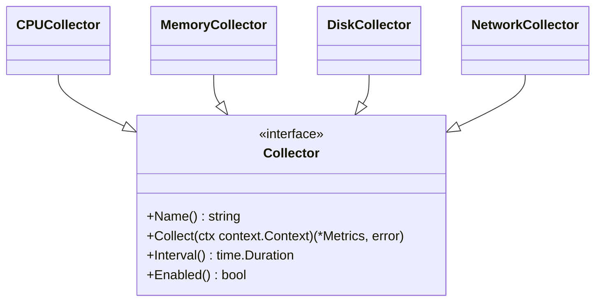
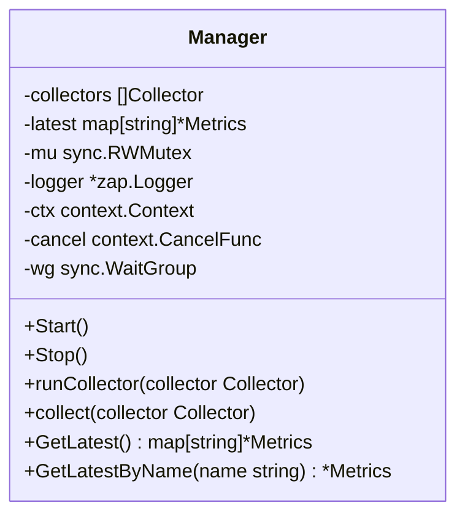
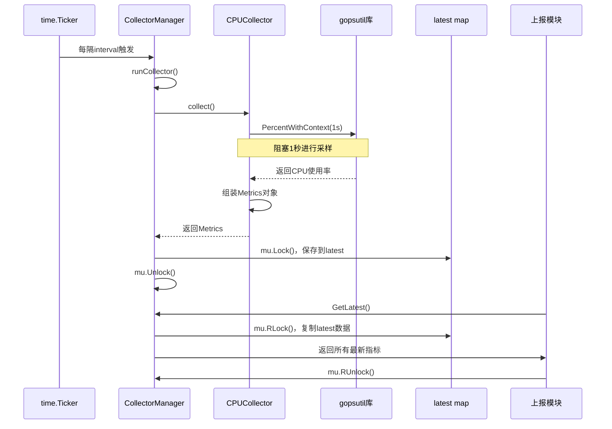

# 资源采集器

<cite>
**本文档引用的文件**
- [collector.go](file://daemon/internal/collector/collector.go#L1-L24)
- [cpu.go](file://daemon/internal/collector/cpu.go#L1-L106)
- [memory.go](file://daemon/internal/collector/memory.go#L1-L89)
- [disk.go](file://daemon/internal/collector/disk.go#L1-L154)
- [network.go](file://daemon/internal/collector/network.go#L1-L137)
- [manager.go](file://daemon/internal/collector/manager.go#L1-L124)
- [types.go](file://daemon/pkg/types/types.go#L1-L111)
- [daemon.yaml](file://daemon/configs/daemon.yaml#L1-L63)
- [daemon.dev.yaml](file://daemon/configs/daemon.dev.yaml#L1-L62)
- [daemon.go](file://daemon/internal/daemon/daemon.go#L51-L84)
- [main.go](file://daemon/cmd/daemon/main.go#L1-L65)
</cite>

## 目录
1. [引言](#引言)
2. [接口与管理器设计](#接口与管理器设计)
3. [核心采集器实现](#核心采集器实现)
4. [数据结构与指标定义](#数据结构与指标定义)
5. [配置管理](#配置管理)
6. [资源采集时序图](#资源采集时序图)
7. [故障排查指南](#故障排查指南)
8. [结论](#结论)

## 引言
资源采集器是Daemon模块的核心组件，负责监控和采集系统的关键资源指标。本技术文档详细阐述了采集器的架构设计、接口规范、四大核心采集器（CPU、内存、磁盘、网络）的实现细节、数据结构定义以及配置管理机制。文档还提供了资源采集的完整流程时序图和故障排查指南，旨在为开发者和运维人员提供全面的技术参考。

## 接口与管理器设计

资源采集器的设计遵循了清晰的接口抽象和高效的调度机制。`Collector`接口定义了所有采集器必须实现的公共方法，而`Manager`（采集器管理器）则负责统一调度和管理这些采集器。

### 采集器接口 (Collector Interface)
`Collector`接口是所有具体采集器的抽象基类，它定义了四个核心方法，确保了不同资源采集器的一致性。



**接口来源**
- [collector.go](file://daemon/internal/collector/collector.go#L10-L23)

**接口方法说明**:
- **Name()**: 返回采集器的唯一标识名称，如 "cpu"、"memory"。
- **Collect()**: 执行实际的采集逻辑，返回包含指标数据的`*types.Metrics`对象。
- **Interval()**: 返回该采集器的采集间隔，决定了采集的频率。
- **Enabled()**: 返回一个布尔值，指示该采集器是否被启用。

这种接口设计实现了**依赖倒置原则**，使得`Manager`可以不关心具体采集器的实现细节，只通过接口与它们交互，极大地提高了系统的可扩展性和可维护性。

### 采集器管理器 (CollectorManager)
`Manager`是采集器的调度中心，它负责启动、停止所有启用的采集器，并通过并发机制确保它们独立、高效地运行。



**类来源**
- [manager.go](file://daemon/internal/collector/manager.go#L12-L21)

**关键字段**:
- **collectors []Collector**: 存储所有注册的采集器实例。
- **latest map[string]*Metrics**: 一个线程安全的映射，用于存储每个采集器最新的指标数据。
- **mu sync.RWMutex**: 读写锁，保护`latest`映射的并发访问。
- **ctx context.Context**: 用于控制所有采集器goroutine的生命周期。
- **wg sync.WaitGroup**: 用于在停止管理器时等待所有采集器goroutine优雅退出。

**核心方法**:
- **Start()**: 遍历所有采集器，对每个启用的采集器调用`runCollector`方法，并在新的goroutine中启动它。
- **Stop()**: 调用`cancel()`函数，向所有采集器goroutine发送停止信号，并通过`wg.Wait()`等待它们全部退出。
- **runCollector()**: 为单个采集器创建一个独立的goroutine。它使用`time.Ticker`根据采集器的`Interval()`定期触发`collect()`方法。
- **collect()**: 执行采集逻辑。它调用采集器的`Collect()`方法，将结果安全地存入`latest`映射，并记录日志。
- **GetLatest()**: 提供一个线程安全的接口，供外部（如上报模块）获取所有最新的指标数据。

这种设计模式确保了采集过程的**并发性**和**健壮性**。每个采集器都在独立的goroutine中运行，避免了某个采集器的阻塞影响其他采集器。同时，通过`context`和`WaitGroup`，实现了优雅的启动和停止。

**接口来源**
- [manager.go](file://daemon/internal/collector/manager.go#L23-L124)

## 核心采集器实现

本节深入分析CPU、内存、磁盘和网络四大核心采集器的具体实现。

### CPU采集器 (CPUCollector)
CPU采集器负责监控CPU的使用率、核心数、型号等关键信息。

**实现分析**:
- **采集方法**: `Collect()`方法首先调用`gopsutil/v3/cpu.PercentWithContext()`，传入一个1秒的采样间隔来计算CPU使用率。这是一个阻塞调用，会等待1秒后返回一个浮点数切片，其中`percent[0]`代表整体CPU使用率。
- **指标计算**: CPU使用率直接取自`gopsutil`的返回值。核心数通过`cpu.CountsWithContext()`获取，型号信息则来自`cpu.InfoWithContext()`。
- **数据结构**: 指标数据被组织成一个`map[string]interface{}`，包含`usage_percent`、`cores`、`model`等字段。
- **性能影响**: 由于`PercentWithContext()`需要1秒的采样时间，这会阻塞该采集器的goroutine。因此，将采集间隔设置得过短（如小于1秒）是没有意义的，且会浪费资源。

**代码来源**
- [cpu.go](file://daemon/internal/collector/cpu.go#L43-L105)

### 内存采集器 (MemoryCollector)
内存采集器负责监控物理内存和Swap内存的使用情况。

**实现分析**:
- **采集方法**: 使用`gopsutil/v3/mem.VirtualMemoryWithContext()`获取物理内存信息，使用`gopsutil/v3/mem.SwapMemoryWithContext()`获取Swap内存信息。
- **指标计算**: 主要计算`total_bytes`、`used_bytes`、`free_bytes`和`usage_percent`。`usage_percent`由`gopsutil`库直接提供。
- **数据结构**: 为了保证向前兼容，采集器同时提供了新旧两种命名的字段（如`total_bytes`和`total`）。此外，还包含了`cached`、`buffers`等详细信息。
- **性能影响**: 获取内存信息是轻量级的系统调用，性能开销极小，因此可以设置较短的采集间隔。

**代码来源**
- [memory.go](file://daemon/internal/collector/memory.go#L43-L88)

### 磁盘采集器 (DiskCollector)
磁盘采集器负责监控磁盘的使用率、读写I/O等信息。

**实现分析**:
- **采集方法**: 首先通过`disk.PartitionsWithContext()`获取所有磁盘分区。然后，对于每个分区（或配置中指定的挂载点），调用`disk.UsageWithContext()`获取使用情况。
- **指标计算**: 总的使用率是通过累加所有指定挂载点的`used`和`total`值，然后计算`usedBytes / totalBytes * 100`得到的。
- **数据结构**: 返回的数据包含两部分：扁平化的汇总数据（如`total_bytes`, `usage_percent`）和一个名为`details`的数组，其中包含每个挂载点的详细信息。
- **性能影响**: 获取磁盘I/O统计（`IOCountersWithContext`）可能在某些系统上失败或开销较大，因此代码中将其作为可选操作，并使用`Debug`级别日志记录错误。

**代码来源**
- [disk.go](file://daemon/internal/collector/disk.go#L45-L153)

### 网络采集器 (NetworkCollector)
网络采集器负责监控网络接口的流量和错误统计。

**实现分析**:
- **采集方法**: 调用`net.IOCountersWithContext(true)`获取所有网络接口的I/O统计。`true`参数表示包含回环接口。
- **指标计算**: 将所有指定网卡（或所有网卡）的`BytesSent`和`BytesRecv`累加，得到总的发送和接收字节数。
- **数据结构**: 与磁盘采集器类似，返回的数据包含`tx_bytes`、`rx_bytes`等汇总字段和一个`details`数组。
- **性能影响**: 获取网络I/O统计通常非常快速，性能开销很低。

**代码来源**
- [network.go](file://daemon/internal/collector/network.go#L45-L136)

## 数据结构与指标定义

所有采集器返回的指标数据都封装在`types.Metrics`结构体中，确保了数据格式的统一。

```mermaid
classDiagram
class Metrics {
+Name string
+Timestamp time.Time
+Values map[string]interface{}
}
```

**类来源**
- [types.go](file://daemon/pkg/types/types.go#L18-L23)

**字段说明**:
- **Name**: 采集器的名称，用于标识数据来源。
- **Timestamp**: 采集发生的时间戳，精确到纳秒。
- **Values**: 一个`map[string]interface{}`，用于存储具体的指标键值对。这种设计提供了极大的灵活性，可以容纳各种类型和结构的指标数据。

## 配置管理

采集器的行为（启用/禁用、采集间隔等）通过配置文件进行管理。

### 配置文件示例
```yaml
# 采集器配置
collectors:
  cpu:
    enabled: true
    interval: 60s
  memory:
    enabled: true
    interval: 60s
  disk:
    enabled: true
    interval: 60s
    mount_points: []  # 空则采集所有挂载点
  network:
    enabled: true
    interval: 60s
    interfaces: []  # 空则采集所有网卡
```

**配置来源**
- [daemon.yaml](file://daemon/configs/daemon.yaml#L39-L54)

### 配置加载流程
1.  **启动**: `main.go`中的`main()`函数启动。
2.  **加载配置**: 调用`config.Load()`从`daemon.yaml`文件加载配置。
3.  **创建Daemon**: `daemon.New()`函数被调用，传入配置和日志实例。
4.  **创建采集器**: 在`daemon.New()`内部，`createCollectors()`函数根据配置文件中的`collectors`部分，为每个启用的采集器创建实例（如`NewCPUCollector`）。
5.  **创建管理器**: 将创建好的采集器实例列表传递给`collector.NewManager()`，完成管理器的初始化。

**代码来源**
- [main.go](file://daemon/cmd/daemon/main.go#L48-L52)
- [daemon.go](file://daemon/internal/daemon/daemon.go#L63-L64)

## 资源采集时序图

下图展示了从定时触发到数据上报的完整流程。



**时序图来源**
- [manager.go](file://daemon/internal/collector/manager.go#L64-L80)
- [cpu.go](file://daemon/internal/collector/cpu.go#L46-L47)

## 故障排查指南

### 问题1：采集数据为0
- **可能原因**: 某些指标（如CPU使用率）在系统空闲时可能为0，这是正常现象。
- **排查步骤**:
    1.  检查日志中是否有`failed to get cpu percent`等错误信息。
    2.  确认`gopsutil`库是否能正常工作，可在命令行手动执行`top`或`htop`查看CPU使用率。
    3.  检查采集间隔是否设置过长，导致在查看时恰好采集到空闲状态。

### 问题2：采集器频繁报错
- **可能原因**: 通常是`gopsutil`库在特定系统或环境下调用失败。
- **排查步骤**:
    1.  查看日志中的具体错误信息，例如`failed to get virtual memory`。
    2.  确认运行Daemon的用户是否有足够的权限访问系统信息。
    3.  检查`gopsutil`库的版本是否与当前操作系统兼容。
    4.  尝试在开发环境（`daemon.dev.yaml`）中运行，使用更短的间隔和`debug`日志级别来复现问题。

### 问题3：磁盘挂载点无法识别
- **可能原因**: 配置文件中`mount_points`的路径与系统实际挂载点不一致。
- **排查步骤**:
    1.  在服务器上执行`df -h`命令，查看所有挂载点的准确路径。
    2.  检查`daemon.yaml`配置文件中`collectors.disk.mount_points`的路径是否与`df -h`输出完全一致（包括大小写和斜杠）。
    3.  如果希望采集所有挂载点，确保`mount_points`为空数组`[]`。

## 结论
Daemon的资源采集器通过清晰的接口设计和高效的并发管理器，实现了对系统资源的稳定、可靠监控。四大核心采集器利用`gopsutil`库，以统一的`Metrics`数据结构返回指标，便于后续处理和上报。通过灵活的配置文件，可以轻松地启用/禁用采集器并调整采集频率。该设计具有良好的可扩展性，未来可以方便地添加新的采集器类型。