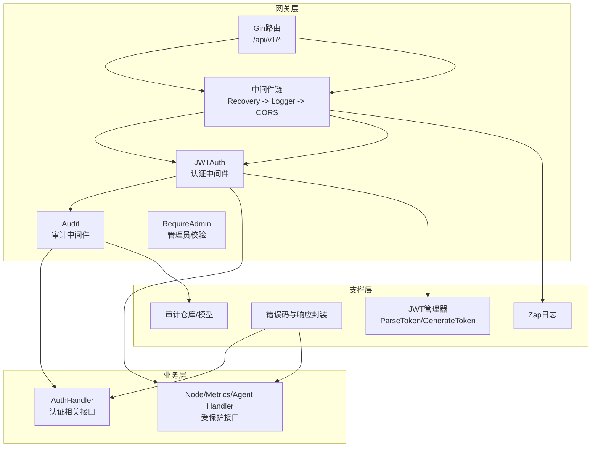
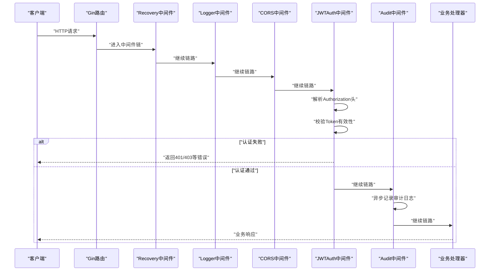
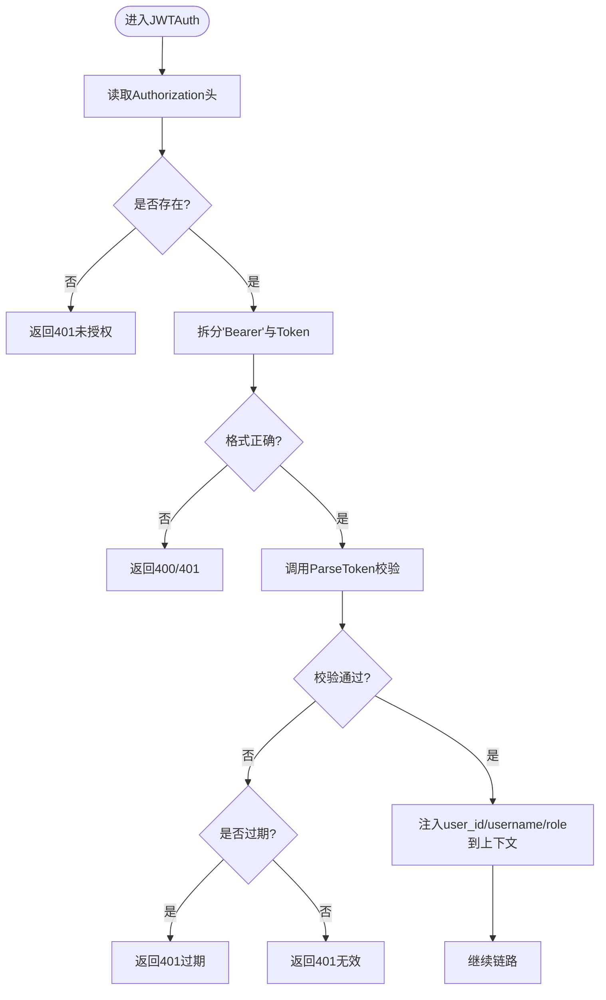
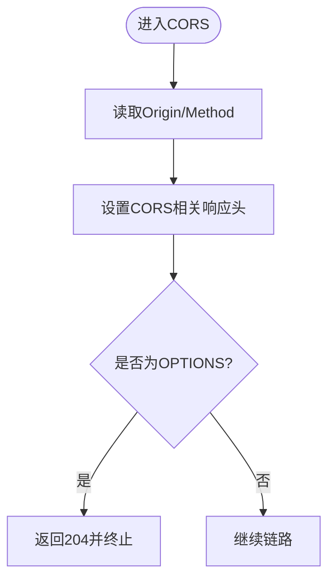
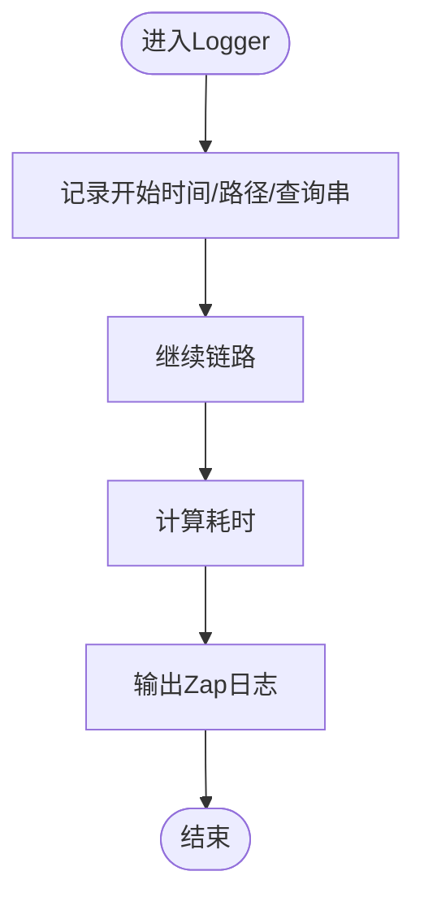
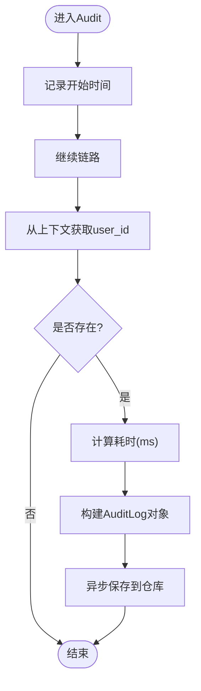
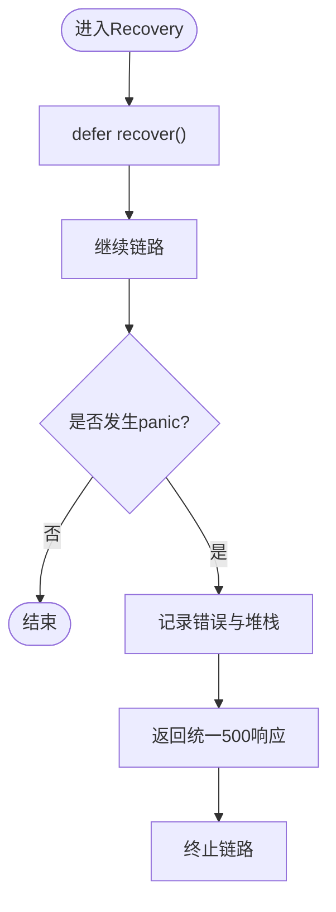
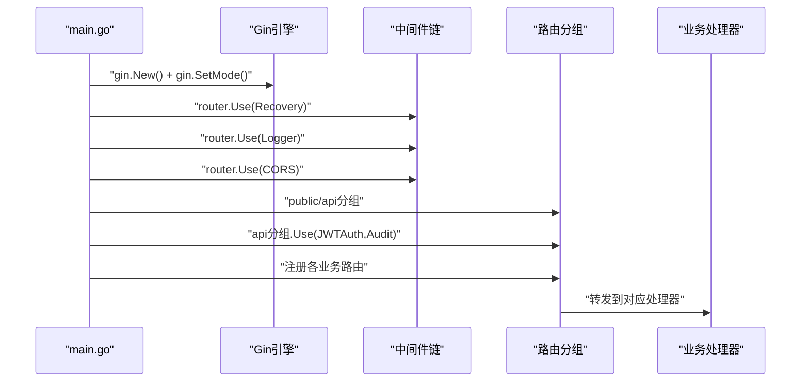
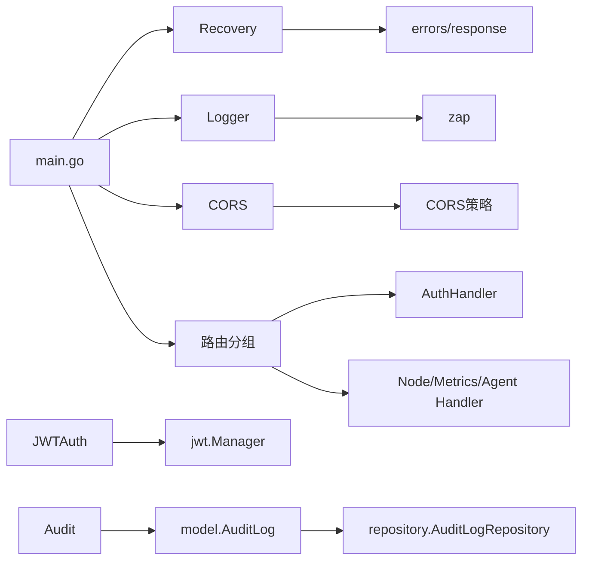

# API网关层

<cite>
**本文引用的文件**
- [manager/cmd/manager/main.go](file://manager/cmd/manager/main.go)
- [manager/internal/middleware/auth.go](file://manager/internal/middleware/auth.go)
- [manager/internal/middleware/cors.go](file://manager/internal/middleware/cors.go)
- [manager/internal/middleware/logger.go](file://manager/internal/middleware/logger.go)
- [manager/internal/middleware/audit.go](file://manager/internal/middleware/audit.go)
- [manager/internal/middleware/recovery.go](file://manager/internal/middleware/recovery.go)
- [manager/pkg/jwt/jwt.go](file://manager/pkg/jwt/jwt.go)
- [manager/pkg/response/response.go](file://manager/pkg/response/response.go)
- [manager/pkg/errors/errors.go](file://manager/pkg/errors/errors.go)
- [manager/internal/handler/auth.go](file://manager/internal/handler/auth.go)
- [manager/internal/model/audit_log.go](file://manager/internal/model/audit_log.go)
</cite>

## 目录
1. [简介](#简介)
2. [项目结构](#项目结构)
3. [核心组件](#核心组件)
4. [架构总览](#架构总览)
5. [组件详解](#组件详解)
6. [依赖关系分析](#依赖关系分析)
7. [性能与并发优化](#性能与并发优化)
8. [故障排查指南](#故障排查指南)
9. [结论](#结论)
10. [附录](#附录)

## 简介
本文件聚焦于API网关层的架构与实现，围绕基于Gin框架的HTTP路由与中间件链展开，系统性解析以下能力：
- JWT认证中间件：令牌解析、验证与用户上下文注入
- CORS中间件：跨域策略配置，保障前端安全访问
- 日志中间件：统一记录请求响应信息，便于调试与监控
- 审计中间件：捕获关键操作并生成审计日志
- recovery中间件：panic恢复，确保服务稳定性
同时提供请求处理流程图、中间件注册流程、认证拦截逻辑与审计日志生成的实际代码示例路径，并给出高并发场景下的性能优化建议。

## 项目结构
API网关层位于manager模块中，采用“中间件链 + 路由分组”的组织方式：
- 中间件集中于internal/middleware目录，分别实现认证、CORS、日志、审计、panic恢复
- 路由注册集中在cmd/manager/main.go，按公开与受保护API进行分组
- 认证与响应体封装分别由pkg/jwt与pkg/response支撑
- 审计日志模型与错误码定义位于internal/model与pkg/errors

图表来源
- [manager/cmd/manager/main.go](file://manager/cmd/manager/main.go#L136-L210)
- [manager/internal/middleware/auth.go](file://manager/internal/middleware/auth.go#L12-L49)
- [manager/internal/middleware/audit.go](file://manager/internal/middleware/audit.go#L12-L49)
- [manager/internal/middleware/logger.go](file://manager/internal/middleware/logger.go#L10-L36)
- [manager/internal/middleware/cors.go](file://manager/internal/middleware/cors.go#L7-L28)
- [manager/internal/middleware/recovery.go](file://manager/internal/middleware/recovery.go#L13-L39)
- [manager/pkg/jwt/jwt.go](file://manager/pkg/jwt/jwt.go#L43-L88)
- [manager/pkg/response/response.go](file://manager/pkg/response/response.go#L33-L101)
- [manager/pkg/errors/errors.go](file://manager/pkg/errors/errors.go#L93-L171)
- [manager/internal/model/audit_log.go](file://manager/internal/model/audit_log.go#L7-L31)

章节来源
- [manager/cmd/manager/main.go](file://manager/cmd/manager/main.go#L136-L210)

## 核心组件
- 中间件链：全局注册Recovery、Logger、CORS，随后按需在/api/v1分组中叠加JWTAuth与Audit
- JWT认证：从Authorization头解析Bearer Token，校验签名与有效期，注入用户信息到上下文
- CORS：放行预检请求，设置允许来源、方法、头部与凭证
- 日志：记录状态码、方法、路径、IP、UA、耗时与错误
- 审计：异步落库记录用户、资源、方法、路径、IP、状态、耗时
- panic恢复：捕获panic，记录堆栈并返回统一错误响应

章节来源
- [manager/cmd/manager/main.go](file://manager/cmd/manager/main.go#L136-L210)
- [manager/internal/middleware/auth.go](file://manager/internal/middleware/auth.go#L12-L49)
- [manager/internal/middleware/cors.go](file://manager/internal/middleware/cors.go#L7-L28)
- [manager/internal/middleware/logger.go](file://manager/internal/middleware/logger.go#L10-L36)
- [manager/internal/middleware/audit.go](file://manager/internal/middleware/audit.go#L12-L49)
- [manager/internal/middleware/recovery.go](file://manager/internal/middleware/recovery.go#L13-L39)

## 架构总览
下图展示从接收HTTP请求到分发至业务处理器的完整路径，以及各中间件在链路中的职责与调用顺序。

图表来源
- [manager/cmd/manager/main.go](file://manager/cmd/manager/main.go#L136-L210)
- [manager/internal/middleware/recovery.go](file://manager/internal/middleware/recovery.go#L13-L39)
- [manager/internal/middleware/logger.go](file://manager/internal/middleware/logger.go#L10-L36)
- [manager/internal/middleware/cors.go](file://manager/internal/middleware/cors.go#L7-L28)
- [manager/internal/middleware/auth.go](file://manager/internal/middleware/auth.go#L12-L49)
- [manager/internal/middleware/audit.go](file://manager/internal/middleware/audit.go#L12-L49)
- [manager/internal/handler/auth.go](file://manager/internal/handler/auth.go#L98-L122)

## 组件详解

### JWT认证中间件
- 令牌解析与校验
  - 从Authorization头解析Bearer Token
  - 调用JWT管理器进行签名与有效期校验
  - 对过期与无效令牌分别返回不同错误
- 上下文注入
  - 成功后将用户ID、用户名、角色注入到Gin上下文
- 管理员权限校验
  - 提供RequireAdmin中间件，校验角色为admin

图表来源
- [manager/internal/middleware/auth.go](file://manager/internal/middleware/auth.go#L12-L49)
- [manager/pkg/jwt/jwt.go](file://manager/pkg/jwt/jwt.go#L63-L88)
- [manager/pkg/errors/errors.go](file://manager/pkg/errors/errors.go#L93-L131)
- [manager/pkg/response/response.go](file://manager/pkg/response/response.go#L53-L101)

章节来源
- [manager/internal/middleware/auth.go](file://manager/internal/middleware/auth.go#L12-L49)
- [manager/pkg/jwt/jwt.go](file://manager/pkg/jwt/jwt.go#L43-L88)
- [manager/pkg/response/response.go](file://manager/pkg/response/response.go#L53-L101)
- [manager/pkg/errors/errors.go](file://manager/pkg/errors/errors.go#L93-L131)

### CORS中间件
- 放行预检请求（OPTIONS），避免浏览器二次请求阻断
- 设置允许来源、方法、头部与凭证，满足前端跨域访问需求

图表来源
- [manager/internal/middleware/cors.go](file://manager/internal/middleware/cors.go#L7-L28)

章节来源
- [manager/internal/middleware/cors.go](file://manager/internal/middleware/cors.go#L7-L28)

### 日志中间件
- 记录请求开始时间、路径、查询串、客户端IP、User-Agent
- 在处理完成后计算耗时并输出日志，包含状态码与私有错误信息

图表来源
- [manager/internal/middleware/logger.go](file://manager/internal/middleware/logger.go#L10-L36)

章节来源
- [manager/internal/middleware/logger.go](file://manager/internal/middleware/logger.go#L10-L36)

### 审计中间件
- 异步记录审计日志，包含用户ID、方法、路径、IP、状态码、耗时
- 仅对已认证请求记录，避免匿名请求产生噪音

图表来源
- [manager/internal/middleware/audit.go](file://manager/internal/middleware/audit.go#L12-L49)
- [manager/internal/model/audit_log.go](file://manager/internal/model/audit_log.go#L7-L31)

章节来源
- [manager/internal/middleware/audit.go](file://manager/internal/middleware/audit.go#L12-L49)
- [manager/internal/model/audit_log.go](file://manager/internal/model/audit_log.go#L7-L31)

### recovery中间件
- 使用defer捕获panic，记录错误与堆栈，返回统一500响应
- 终止后续链路，避免异常传播导致进程崩溃

图表来源
- [manager/internal/middleware/recovery.go](file://manager/internal/middleware/recovery.go#L13-L39)

章节来源
- [manager/internal/middleware/recovery.go](file://manager/internal/middleware/recovery.go#L13-L39)

### 路由与中间件注册流程
- 初始化Gin引擎与模式
- 全局注册中间件链：Recovery -> Logger -> CORS
- 健康检查与公开API（无需认证）
- 受保护API分组/api/v1，叠加JWTAuth与Audit
- 管理员接口分组/admin，叠加RequireAdmin

图表来源
- [manager/cmd/manager/main.go](file://manager/cmd/manager/main.go#L136-L210)

章节来源
- [manager/cmd/manager/main.go](file://manager/cmd/manager/main.go#L136-L210)

### 认证拦截逻辑与用户上下文使用
- 认证拦截：JWTAuth从上下文提取user_id/username/role，供后续处理器使用
- 示例路径
  - 认证拦截与上下文注入：[manager/internal/middleware/auth.go](file://manager/internal/middleware/auth.go#L12-L49)
  - 获取用户信息工具函数：[manager/internal/middleware/auth.go](file://manager/internal/middleware/auth.go#L72-L98)
  - 业务处理器读取用户ID示例：[manager/internal/handler/auth.go](file://manager/internal/handler/auth.go#L98-L122)

章节来源
- [manager/internal/middleware/auth.go](file://manager/internal/middleware/auth.go#L12-L49)
- [manager/internal/middleware/auth.go](file://manager/internal/middleware/auth.go#L72-L98)
- [manager/internal/handler/auth.go](file://manager/internal/handler/auth.go#L98-L122)

### 审计日志生成与存储
- 审计中间件异步保存，避免阻塞请求链路
- 审计模型字段覆盖用户、资源、方法、路径、IP、状态、耗时等
- 示例路径
  - 审计中间件实现：[manager/internal/middleware/audit.go](file://manager/internal/middleware/audit.go#L12-L49)
  - 审计模型定义：[manager/internal/model/audit_log.go](file://manager/internal/model/audit_log.go#L7-L31)

章节来源
- [manager/internal/middleware/audit.go](file://manager/internal/middleware/audit.go#L12-L49)
- [manager/internal/model/audit_log.go](file://manager/internal/model/audit_log.go#L7-L31)

## 依赖关系分析
- 中间件依赖
  - JWTAuth依赖JWT管理器进行令牌解析与校验
  - Logger依赖Zap日志库
  - Audit依赖审计仓库与模型
  - Recovery依赖错误码与响应封装
- 路由依赖
  - main.go中集中注册中间件与路由，形成清晰的控制流
- 错误与响应
  - 统一错误码与响应结构，保证错误处理一致性

图表来源
- [manager/cmd/manager/main.go](file://manager/cmd/manager/main.go#L136-L210)
- [manager/internal/middleware/recovery.go](file://manager/internal/middleware/recovery.go#L13-L39)
- [manager/internal/middleware/logger.go](file://manager/internal/middleware/logger.go#L10-L36)
- [manager/internal/middleware/cors.go](file://manager/internal/middleware/cors.go#L7-L28)
- [manager/internal/middleware/auth.go](file://manager/internal/middleware/auth.go#L12-L49)
- [manager/internal/middleware/audit.go](file://manager/internal/middleware/audit.go#L12-L49)
- [manager/pkg/jwt/jwt.go](file://manager/pkg/jwt/jwt.go#L43-L88)
- [manager/internal/model/audit_log.go](file://manager/internal/model/audit_log.go#L7-L31)
- [manager/pkg/errors/errors.go](file://manager/pkg/errors/errors.go#L93-L171)
- [manager/pkg/response/response.go](file://manager/pkg/response/response.go#L33-L101)

章节来源
- [manager/cmd/manager/main.go](file://manager/cmd/manager/main.go#L136-L210)
- [manager/internal/middleware/auth.go](file://manager/internal/middleware/auth.go#L12-L49)
- [manager/internal/middleware/audit.go](file://manager/internal/middleware/audit.go#L12-L49)
- [manager/pkg/jwt/jwt.go](file://manager/pkg/jwt/jwt.go#L43-L88)
- [manager/internal/model/audit_log.go](file://manager/internal/model/audit_log.go#L7-L31)
- [manager/pkg/errors/errors.go](file://manager/pkg/errors/errors.go#L93-L171)
- [manager/pkg/response/response.go](file://manager/pkg/response/response.go#L33-L101)

## 性能与并发优化
- 中间件顺序优化
  - 将CORS置于较前位置，减少不必要的后续处理
  - Recovery置于最前，确保任何环节异常都能被捕获
  - Logger置于Recovery之后，以便统计真实耗时
- 日志异步化
  - 审计中间件已采用goroutine异步保存，避免阻塞请求
  - 建议将Logger中间件的日志写入改为异步队列，降低IO阻塞
- 并发与限流
  - 在路由层引入限流中间件，防止突发流量冲击
  - 对高频接口（如登录）增加速率限制
- 资源与连接
  - 合理配置Gin引擎的读写超时与最大内存
  - 审计与日志服务独立部署，避免与主业务争抢资源

[本节为通用性能建议，不直接分析具体文件]

## 故障排查指南
- 认证失败
  - 检查Authorization头格式是否为Bearer Token
  - 校验JWT密钥、签发者与有效期配置
  - 参考路径：[manager/internal/middleware/auth.go](file://manager/internal/middleware/auth.go#L12-L49)，[manager/pkg/jwt/jwt.go](file://manager/pkg/jwt/jwt.go#L63-L88)
- 跨域问题
  - 确认CORS中间件已注册且允许来源与方法
  - 参考路径：[manager/internal/middleware/cors.go](file://manager/internal/middleware/cors.go#L7-L28)
- 审计日志缺失
  - 确认请求已通过JWTAuth，上下文中存在user_id
  - 参考路径：[manager/internal/middleware/audit.go](file://manager/internal/middleware/audit.go#L12-L49)
- 500错误与panic
  - 查看Recovery中间件日志中的堆栈信息
  - 参考路径：[manager/internal/middleware/recovery.go](file://manager/internal/middleware/recovery.go#L13-L39)
- 统一错误响应
  - 使用response.Error封装，确保HTTP状态码与错误码一致
  - 参考路径：[manager/pkg/response/response.go](file://manager/pkg/response/response.go#L53-L101)，[manager/pkg/errors/errors.go](file://manager/pkg/errors/errors.go#L93-L171)

章节来源
- [manager/internal/middleware/auth.go](file://manager/internal/middleware/auth.go#L12-L49)
- [manager/internal/middleware/cors.go](file://manager/internal/middleware/cors.go#L7-L28)
- [manager/internal/middleware/audit.go](file://manager/internal/middleware/audit.go#L12-L49)
- [manager/internal/middleware/recovery.go](file://manager/internal/middleware/recovery.go#L13-L39)
- [manager/pkg/response/response.go](file://manager/pkg/response/response.go#L53-L101)
- [manager/pkg/errors/errors.go](file://manager/pkg/errors/errors.go#L93-L171)

## 结论
本API网关层以Gin为核心，通过精心设计的中间件链实现了认证、跨域、日志、审计与panic恢复的全栈能力。JWT认证中间件负责令牌解析与上下文注入，CORS中间件保障前端跨域安全访问，日志与审计中间件分别承担可观测性与合规记录，recovery中间件确保服务稳定性。路由注册采用分组与中间件叠加的方式，结构清晰、易于扩展与维护。

[本节为总结性内容，不直接分析具体文件]

## 附录
- 中间件注册与路由示例路径
  - 全局中间件注册：[manager/cmd/manager/main.go](file://manager/cmd/manager/main.go#L136-L143)
  - 公开API分组与路由：[manager/cmd/manager/main.go](file://manager/cmd/manager/main.go#L153-L160)
  - 受保护API分组与JWT/Audit叠加：[manager/cmd/manager/main.go](file://manager/cmd/manager/main.go#L161-L165)
  - 管理员分组与RequireAdmin叠加：[manager/cmd/manager/main.go](file://manager/cmd/manager/main.go#L198-L201)
- 认证拦截与上下文注入
  - JWTAuth实现：[manager/internal/middleware/auth.go](file://manager/internal/middleware/auth.go#L12-L49)
  - RequireAdmin实现：[manager/internal/middleware/auth.go](file://manager/internal/middleware/auth.go#L52-L70)
  - 获取用户信息工具函数：[manager/internal/middleware/auth.go](file://manager/internal/middleware/auth.go#L72-L98)
- 审计日志
  - 审计中间件实现：[manager/internal/middleware/audit.go](file://manager/internal/middleware/audit.go#L12-L49)
  - 审计模型定义：[manager/internal/model/audit_log.go](file://manager/internal/model/audit_log.go#L7-L31)
- 日志与错误
  - Logger中间件实现：[manager/internal/middleware/logger.go](file://manager/internal/middleware/logger.go#L10-L36)
  - Recovery中间件实现：[manager/internal/middleware/recovery.go](file://manager/internal/middleware/recovery.go#L13-L39)
  - 错误码与响应封装：[manager/pkg/errors/errors.go](file://manager/pkg/errors/errors.go#L93-L171)，[manager/pkg/response/response.go](file://manager/pkg/response/response.go#L33-L101)