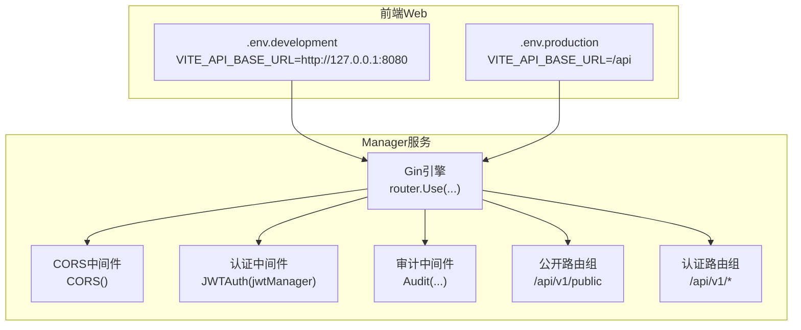
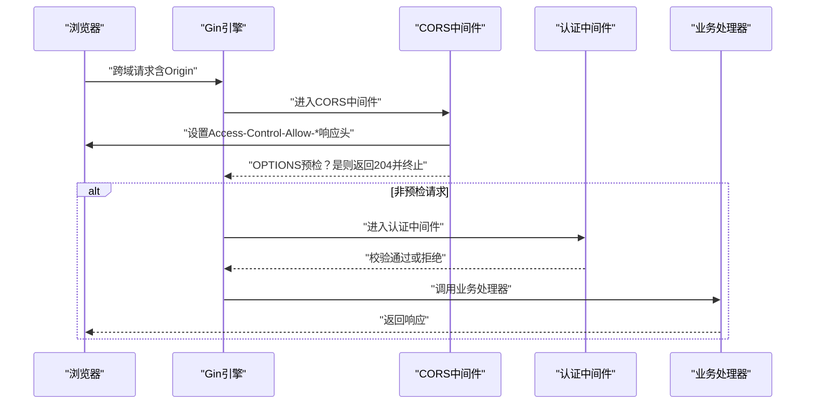
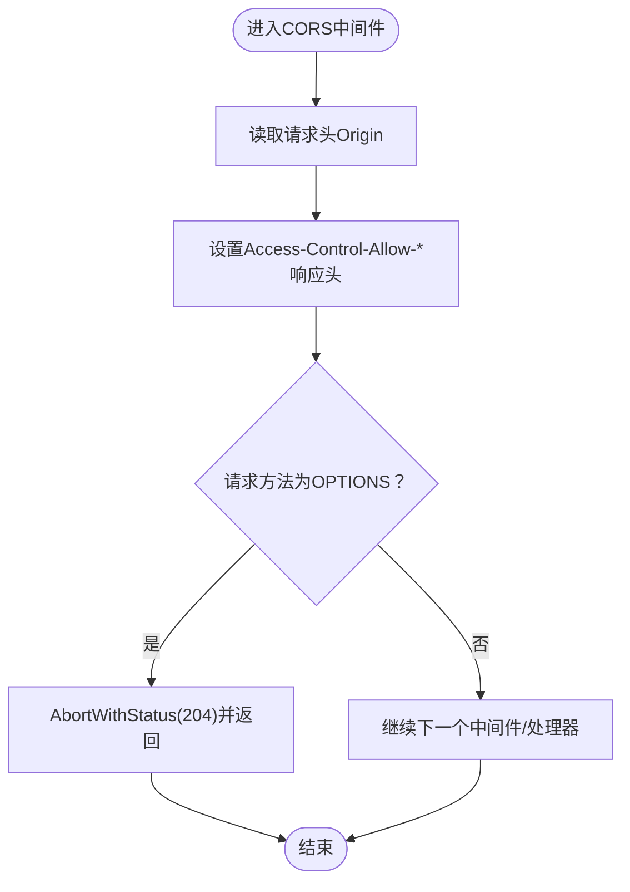
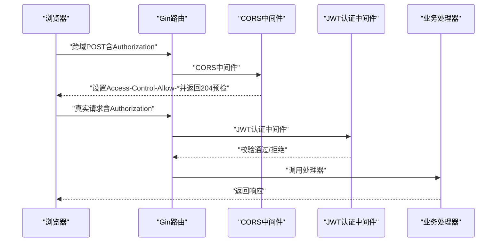
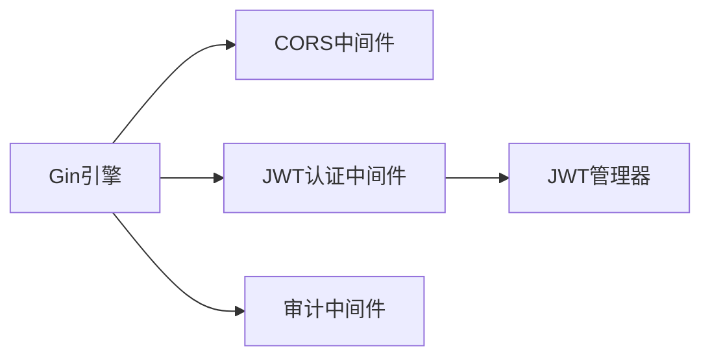

# CORS中间件

<cite>
**本文引用的文件**
- [manager/internal/middleware/cors.go](file://manager/internal/middleware/cors.go)
- [manager/cmd/manager/main.go](file://manager/cmd/manager/main.go)
- [manager/internal/middleware/auth.go](file://manager/internal/middleware/auth.go)
- [manager/internal/config/config.go](file://manager/internal/config/config.go)
- [manager/configs/manager.yaml](file://manager/configs/manager.yaml)
- [web/.env.development](file://web/.env.development)
- [web/.env.production](file://web/.env.production)
- [manager/test/integration/manager_integration_test.go](file://manager/test/integration/manager_integration_test.go)
</cite>

## 目录
1. [简介](#简介)
2. [项目结构](#项目结构)
3. [核心组件](#核心组件)
4. [架构总览](#架构总览)
5. [详细组件分析](#详细组件分析)
6. [依赖关系分析](#依赖关系分析)
7. [性能考虑](#性能考虑)
8. [故障排查指南](#故障排查指南)
9. [结论](#结论)
10. [附录](#附录)

## 简介
本文件系统性说明本仓库中CORS中间件的配置与实现，重点解释如何在 Gin 路由中启用并应用该中间件，以及其对预检请求（OPTIONS）的处理机制。由于当前实现采用“按请求来源动态回显 Origin”的策略，因此无法直接通过 manager.yaml 中的配置项进行动态控制；但本文将给出可扩展的设计建议，帮助在不破坏现有行为的前提下，逐步引入基于配置的动态跨域策略。

此外，文档还说明了 CORS 中间件与认证中间件的协同工作流程，确保跨域请求中的认证信息能够正确传递，从而在开放前端访问的同时有效防范恶意跨站请求。

## 项目结构
CORS 中间件位于 Manager 服务内部，作为全局中间件被注册到 Gin 引擎上。认证中间件同样注册于 Gin 引擎，且在需要鉴权的路由组上生效。前端通过 Vite 环境变量配置 API 基础地址，以满足本地开发与生产部署的不同跨域场景。

图表来源
- [manager/cmd/manager/main.go](file://manager/cmd/manager/main.go#L135-L170)
- [manager/internal/middleware/cors.go](file://manager/internal/middleware/cors.go#L1-L27)
- [manager/internal/middleware/auth.go](file://manager/internal/middleware/auth.go#L1-L98)
- [web/.env.development](file://web/.env.development#L1-L5)
- [web/.env.production](file://web/.env.production#L1-L5)

章节来源
- [manager/cmd/manager/main.go](file://manager/cmd/manager/main.go#L135-L170)
- [manager/internal/middleware/cors.go](file://manager/internal/middleware/cors.go#L1-L27)
- [web/.env.development](file://web/.env.development#L1-L5)
- [web/.env.production](file://web/.env.production#L1-L5)

## 核心组件
- CORS 中间件：负责设置 Access-Control-* 响应头，并对预检请求（OPTIONS）进行快速放行。
- 认证中间件：从 Authorization 头解析 Bearer Token，校验有效性并将用户信息注入上下文。
- Gin 路由注册：在全局注册 CORS 中间件，在需要鉴权的路由组上注册认证中间件。

章节来源
- [manager/internal/middleware/cors.go](file://manager/internal/middleware/cors.go#L1-L27)
- [manager/internal/middleware/auth.go](file://manager/internal/middleware/auth.go#L1-L98)
- [manager/cmd/manager/main.go](file://manager/cmd/manager/main.go#L135-L170)

## 架构总览
下图展示了从浏览器到 Manager 服务的典型跨域请求链路，以及中间件在其中的作用位置。

图表来源
- [manager/internal/middleware/cors.go](file://manager/internal/middleware/cors.go#L1-L27)
- [manager/internal/middleware/auth.go](file://manager/internal/middleware/auth.go#L1-L98)
- [manager/cmd/manager/main.go](file://manager/cmd/manager/main.go#L135-L170)

## 详细组件分析

### CORS 中间件实现与行为
- 动态回显 Origin：中间件从请求头读取 Origin，并将其写入 Access-Control-Allow-Origin，实现“按来源放行”。
- 允许的方法与头部：固定设置允许的方法集合与允许的头部集合。
- 凭证支持：开启 Access-Control-Allow-Credentials，允许携带 Cookie 或自定义认证头。
- 预检请求处理：对 OPTIONS 方法直接返回 204，不继续后续中间件链。
- 响应头暴露：通过 Access-Control-Expose-Headers 暴露必要的响应头，便于前端读取。

图表来源
- [manager/internal/middleware/cors.go](file://manager/internal/middleware/cors.go#L1-L27)

章节来源
- [manager/internal/middleware/cors.go](file://manager/internal/middleware/cors.go#L1-L27)

### 预检请求（OPTIONS）处理机制
- CORS 中间件对所有 OPTIONS 请求直接返回 204，不进入后续中间件链。
- 这意味着任何需要复杂请求（例如带自定义头部或凭证）的预检请求都会被快速放行，随后由后续中间件（如认证中间件）决定是否继续处理。

章节来源
- [manager/internal/middleware/cors.go](file://manager/internal/middleware/cors.go#L1-L27)

### 与认证中间件的协同工作流程
- 注册顺序：CORS 在全局注册，JWTAuth 在需要鉴权的路由组上注册。
- 认证信息传递：当浏览器发送跨域请求时，若启用了凭证（Allow-Credentials），浏览器会在请求头中携带 Authorization（或其他认证头）。CORS 中间件不会修改这些头部，认证中间件会从 Authorization 头解析 Bearer Token 并校验。
- 复杂请求拦截逻辑：对于复杂请求，浏览器会先发送 OPTIONS 预检；CORS 中间件会快速放行预检，随后认证中间件再进行鉴权判断。

图表来源
- [manager/cmd/manager/main.go](file://manager/cmd/manager/main.go#L135-L170)
- [manager/internal/middleware/cors.go](file://manager/internal/middleware/cors.go#L1-L27)
- [manager/internal/middleware/auth.go](file://manager/internal/middleware/auth.go#L1-L98)

章节来源
- [manager/cmd/manager/main.go](file://manager/cmd/manager/main.go#L135-L170)
- [manager/internal/middleware/auth.go](file://manager/internal/middleware/auth.go#L1-L98)

### 当前配置现状与限制
- CORS 中间件未直接读取 manager.yaml 中的配置项，而是采用“按来源动态回显”的策略。
- manager.yaml 中的 server、database、redis、grpc、jwt、log、metrics 等配置项与 CORS 无直接关联。
- 前端通过 Vite 环境变量配置 API 基础地址，开发环境指向 Manager 服务地址，生产环境可指向反向代理路径。

章节来源
- [manager/internal/middleware/cors.go](file://manager/internal/middleware/cors.go#L1-L27)
- [manager/configs/manager.yaml](file://manager/configs/manager.yaml#L1-L52)
- [web/.env.development](file://web/.env.development#L1-L5)
- [web/.env.production](file://web/.env.production#L1-L5)

### 可扩展设计建议（基于现有实现的安全增强）
为在保持现有“按来源动态回显”的前提下，逐步引入基于配置的跨域策略，建议如下演进方向：
- 新增 CORS 配置项：在 manager.yaml 中新增 cors 节点，包含 allowed_origins、allowed_methods、allowed_headers、allow_credentials、expose_headers 等字段。
- 中间件改造：在 CORS 中间件中读取配置，优先匹配 allowed_origins 列表，若匹配成功则设置 Access-Control-Allow-Origin；否则可设置为 "*" 或禁止。
- 选项开关：提供 enable_cors 开关，便于在不同环境灵活启用/禁用。
- 安全加固：默认仅允许受信来源，避免使用通配符；对凭证场景严格校验来源，防止 CSRF 风险。

上述改动可在不破坏现有 OPTIONS 预检放行逻辑的前提下，提升跨域策略的可控性与安全性。

（本节为概念性设计说明，不对应具体代码文件）

## 依赖关系分析
- CORS 中间件依赖 Gin 上下文，负责设置响应头并短路 OPTIONS 请求。
- 认证中间件依赖 JWT 管理器，从 Authorization 头解析 Token 并将用户信息注入上下文。
- Gin 引擎在全局注册 CORS，在路由组上注册认证与审计中间件。

图表来源
- [manager/cmd/manager/main.go](file://manager/cmd/manager/main.go#L135-L170)
- [manager/internal/middleware/cors.go](file://manager/internal/middleware/cors.go#L1-L27)
- [manager/internal/middleware/auth.go](file://manager/internal/middleware/auth.go#L1-L98)

章节来源
- [manager/cmd/manager/main.go](file://manager/cmd/manager/main.go#L135-L170)
- [manager/internal/middleware/auth.go](file://manager/internal/middleware/auth.go#L1-L98)

## 性能考虑
- CORS 中间件仅设置少量响应头并可能提前返回，对性能影响极小。
- 对 OPTIONS 预检请求的快速放行避免了不必要的后续中间件开销。
- 若未来引入基于配置的来源白名单匹配，建议使用高效的数据结构（如哈希集合）以降低匹配成本。

（本节为通用性能讨论，不直接分析具体文件）

## 故障排查指南
- 预检失败（CORS 403）：确认前端是否正确发送预检请求，且 Manager 是否对 OPTIONS 方法进行了放行（当前实现即如此）。
- 凭证相关问题：若前端需要携带 Cookie 或自定义认证头，需确保请求头中包含 Authorization，并且 CORS 中间件已设置 Allow-Credentials。
- 认证失败：检查 Authorization 头格式是否为 Bearer Token，以及 Token 是否有效、未过期。
- 前端跨域访问：确认 Vite 环境变量中 API 基础地址指向正确的 Manager 服务地址；开发环境通常为 http://127.0.0.1:8080，生产环境可指向反向代理路径。

章节来源
- [manager/internal/middleware/cors.go](file://manager/internal/middleware/cors.go#L1-L27)
- [manager/internal/middleware/auth.go](file://manager/internal/middleware/auth.go#L1-L98)
- [web/.env.development](file://web/.env.development#L1-L5)
- [web/.env.production](file://web/.env.production#L1-L5)

## 结论
本项目的 CORS 中间件采用“按来源动态回显”的策略，配合 OPTIONS 预检快速放行与凭证支持，能够在开放前端访问的同时维持基本的安全边界。当前实现未直接读取 manager.yaml 中的配置项，但通过可扩展设计可在不改变现有行为的前提下，逐步引入基于配置的跨域策略，进一步提升可控性与安全性。认证中间件与 CORS 中间件的协作流程清晰，确保跨域请求中的认证信息正确传递。

（本节为总结性内容，不直接分析具体文件）

## 附录

### 实际配置示例（基于现有实现的安全实践）
- 开发环境（前端直连 Manager）：将 VITE_API_BASE_URL 设置为 http://127.0.0.1:8080，确保浏览器与 Manager 同源或允许的来源。
- 生产环境（反向代理）：将 VITE_API_BASE_URL 设置为 /api，交由反向代理统一处理跨域与认证。
- 认证头传递：前端在跨域请求中携带 Authorization: Bearer <token>，CORS 中间件不会修改该头部，认证中间件负责解析与校验。

章节来源
- [web/.env.development](file://web/.env.development#L1-L5)
- [web/.env.production](file://web/.env.production#L1-L5)
- [manager/internal/middleware/cors.go](file://manager/internal/middleware/cors.go#L1-L27)
- [manager/internal/middleware/auth.go](file://manager/internal/middleware/auth.go#L1-L98)

### 集成测试中的跨域行为参考
- 集成测试通过 HTTP 客户端直接访问 Manager 服务，验证健康检查与认证流程。虽然测试未显式构造复杂跨域场景，但其请求头与响应头的行为可作为 CORS 与认证协作的参考。

章节来源
- [manager/test/integration/manager_integration_test.go](file://manager/test/integration/manager_integration_test.go#L1-L200)