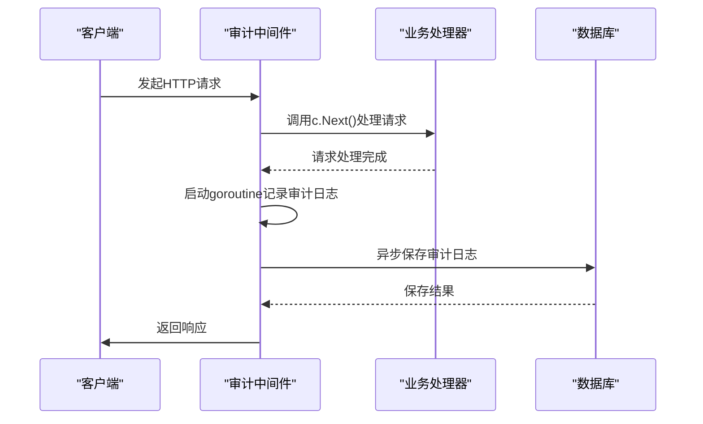
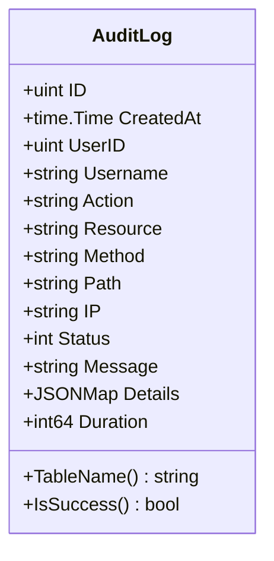
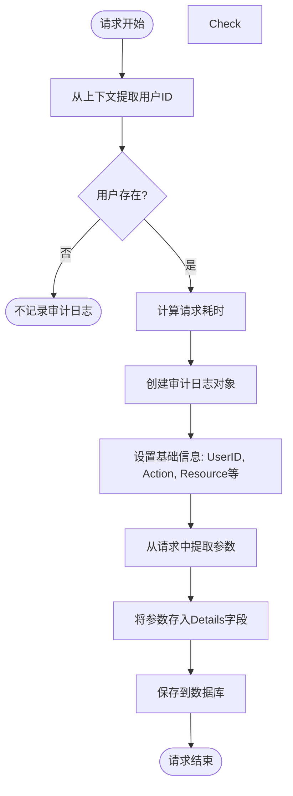
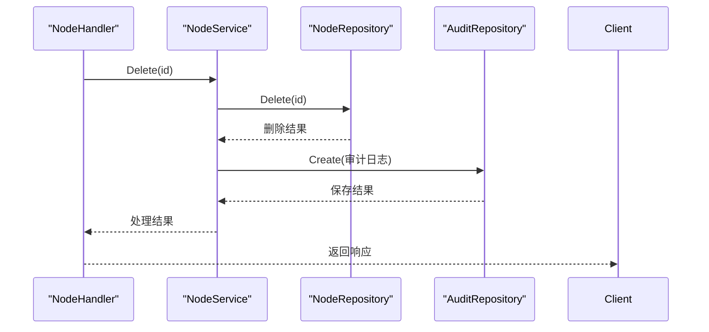
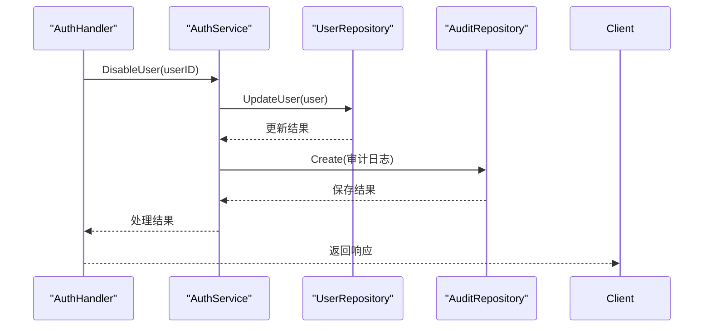
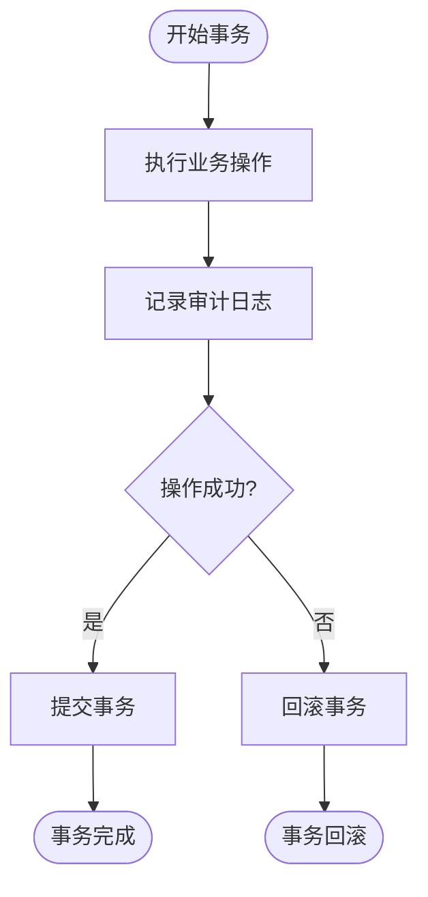
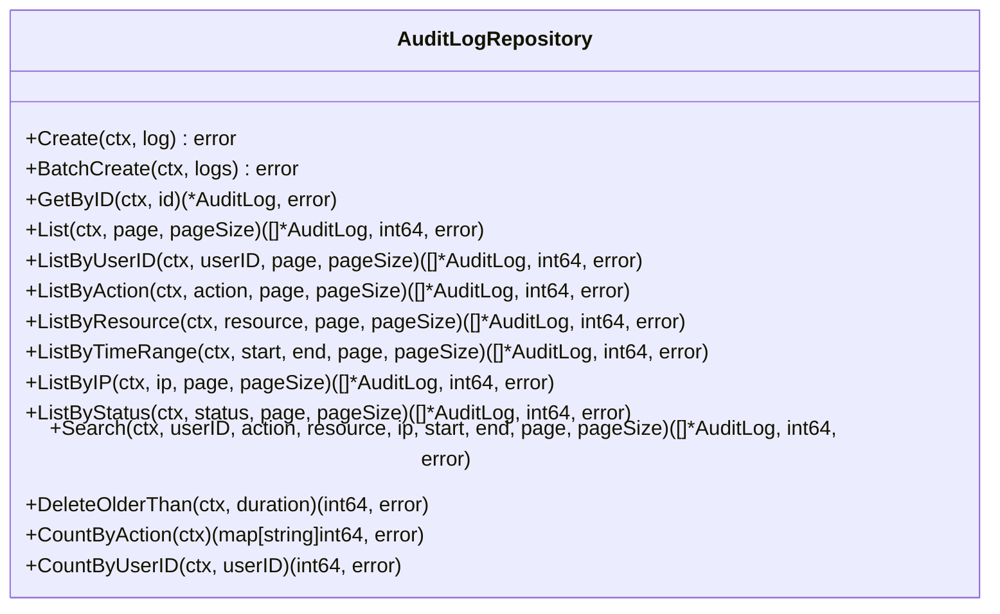
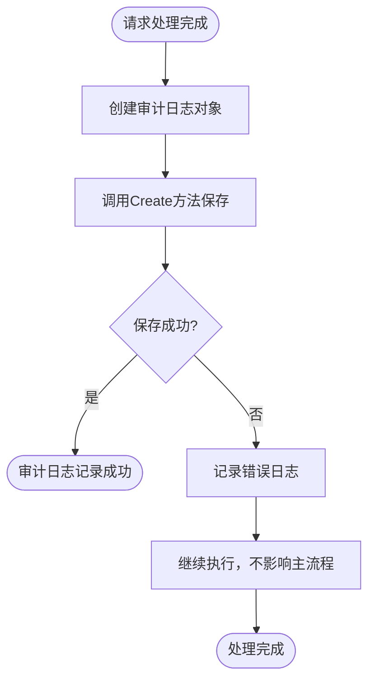
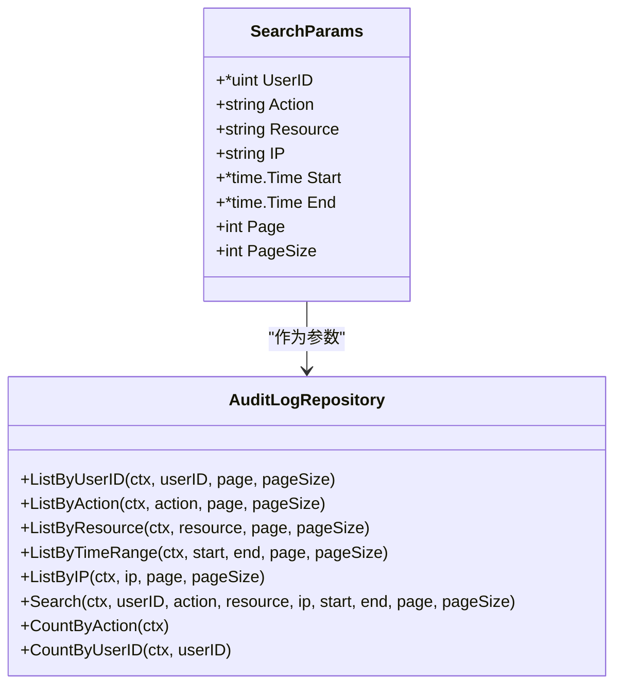
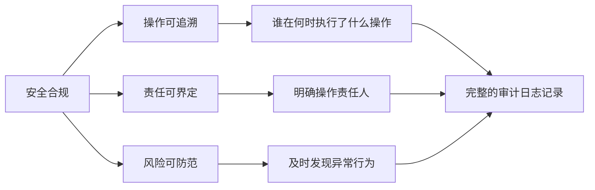

# 审计中间件

<cite>
**本文档引用的文件**   
- [audit.go](file://manager/internal/middleware/audit.go)
- [audit_log.go](file://manager/internal/repository/audit_log.go)
- [audit_log.go](file://manager/internal/model/audit_log.go)
- [main.go](file://manager/cmd/manager/main.go)
- [auth.go](file://manager/internal/middleware/auth.go)
- [node.go](file://manager/internal/service/node.go)
- [auth.go](file://manager/internal/service/auth.go)
- [schema.sql](file://config/mysql/schema.sql)
- [设计文档_03_Manager模块.md](file://docs/设计文档_03_Manager模块.md)
</cite>

## 目录
1. [引言](#引言)
2. [审计中间件工作机制](#审计中间件工作机制)
3. [审计日志数据结构](#审计日志数据结构)
4. [关键管理操作的审计](#关键管理操作的审计)
5. [数据库交互与持久化](#数据库交互与持久化)
6. [异常处理机制](#异常处理机制)
7. [审计日志查询API](#审计日志查询api)
8. [安全合规与操作追溯](#安全合规与操作追溯)
9. [结论](#结论)

## 引言

审计中间件是运维框架中的关键安全组件，负责捕获系统中的关键管理操作并生成详细的审计日志。这些日志记录了用户对系统资源的所有重要操作，为安全合规、操作追溯和故障排查提供了重要依据。本文档详细阐述审计中间件的工作机制，重点说明如何捕获节点管理、版本发布、用户权限变更等关键操作，并将其持久化到数据库中。

## 审计中间件工作机制

审计中间件采用Gin框架的中间件模式实现，通过在HTTP请求处理流程中插入审计逻辑，自动捕获和记录所有经过认证的请求信息。中间件在请求处理完成后异步执行，确保不影响主业务流程的性能。



**Diagram sources**
- [audit.go](file://manager/internal/middleware/audit.go#L14-L49)

**Section sources**
- [audit.go](file://manager/internal/middleware/audit.go#L12-L49)

## 审计日志数据结构

审计日志模型定义了记录操作信息所需的所有字段，包括操作用户、操作类型、目标资源、请求参数等关键信息。



**Diagram sources**
- [audit_log.go](file://manager/internal/model/audit_log.go#L8-L36)

**Section sources**
- [audit_log.go](file://manager/internal/model/audit_log.go#L7-L36)

## 关键管理操作的审计

### 操作信息提取

审计中间件从请求上下文中提取关键信息，包括操作用户、操作类型、目标资源和请求参数。用户信息通过JWT认证中间件注入到上下文中，确保只有经过认证的请求才会被记录。



**Diagram sources**
- [audit.go](file://manager/internal/middleware/audit.go#L22-L41)

**Section sources**
- [audit.go](file://manager/internal/middleware/audit.go#L12-L49)
- [auth.go](file://manager/internal/middleware/auth.go#L43-L47)

### 节点管理操作审计

节点管理操作（如节点注册、删除）通过服务层注入审计仓库，在执行业务逻辑的同时记录详细的审计信息。



**Diagram sources**
- [node.go](file://manager/internal/service/node.go#L117-L124)
- [audit.go](file://manager/internal/middleware/audit.go#L43-L47)

**Section sources**
- [node.go](file://manager/internal/service/node.go#L116-L124)
- [audit.go](file://manager/internal/middleware/audit.go#L43-L47)

### 用户权限变更审计

用户权限变更操作（如禁用用户、修改密码）在服务层实现中集成审计功能，确保所有权限变更都有迹可循。



**Diagram sources**
- [auth.go](file://manager/internal/service/auth.go#L34-L36)
- [auth.go](file://manager/internal/service/auth.go#L310-L318)

**Section sources**
- [auth.go](file://manager/internal/service/auth.go#L33-L36)
- [auth.go](file://manager/internal/service/auth.go#L310-L318)

## 数据库交互与持久化

### 数据库表结构

审计日志表的设计考虑了查询性能和存储效率，通过合理的索引策略支持高效的审计日志查询。

```sql
CREATE TABLE `audit_logs` (
  `id` BIGINT UNSIGNED NOT NULL AUTO_INCREMENT,
  `user_id` BIGINT UNSIGNED DEFAULT NULL COMMENT '用户ID',
  `username` VARCHAR(64) DEFAULT NULL COMMENT '用户名',
  `action` VARCHAR(64) NOT NULL COMMENT '操作',
  `resource_type` VARCHAR(32) NOT NULL COMMENT '资源类型',
  `resource_id` VARCHAR(64) DEFAULT NULL COMMENT '资源ID',
  `detail` JSON DEFAULT NULL COMMENT '详细信息',
  `ip` VARCHAR(45) NOT NULL COMMENT '客户端IP',
  `user_agent` VARCHAR(255) DEFAULT NULL COMMENT 'User-Agent',
  `status` ENUM('success', 'failed') NOT NULL DEFAULT 'success' COMMENT '操作状态',
  `error_message` TEXT DEFAULT NULL COMMENT '错误信息',
  `created_at` DATETIME NOT NULL DEFAULT CURRENT_TIMESTAMP,
  PRIMARY KEY (`id`),
  KEY `idx_user_id` (`user_id`),
  KEY `idx_action` (`action`),
  KEY `idx_resource` (`resource_type`, `resource_id`),
  KEY `idx_created_at` (`created_at`)
) ENGINE=InnoDB DEFAULT CHARSET=utf8mb4 COMMENT='审计日志表';
```

**Section sources**
- [设计文档_03_Manager模块.md](file://docs/设计文档_03_Manager模块.md#L574-L597)

### 事务一致性保障

审计日志的持久化与业务操作保持事务一致性，确保业务操作和审计记录的原子性。



**Section sources**
- [database.go](file://manager/pkg/database/database.go#L278-L280)

### 批量写入优化

对于高频的审计日志写入场景，系统提供批量创建接口，减少数据库连接开销，提高写入性能。



**Diagram sources**
- [audit_log.go](file://manager/internal/repository/audit_log.go#L12-L41)

**Section sources**
- [audit_log.go](file://manager/internal/repository/audit_log.go#L12-L41)

## 异常处理机制

审计中间件采用异步非阻塞的方式记录日志，即使审计日志记录失败也不会影响主业务流程的执行。



**Section sources**
- [audit.go](file://manager/internal/middleware/audit.go#L43-L47)

## 审计日志查询API

系统提供丰富的API接口，支持按用户、操作类型、时间范围等多种条件查询审计日志。



**Diagram sources**
- [audit_log.go](file://manager/internal/repository/audit_log.go#L22-L34)

**Section sources**
- [audit_log.go](file://manager/internal/repository/audit_log.go#L22-L34)

## 安全合规与操作追溯

审计日志在安全合规和操作追溯中发挥着重要作用。通过完整的操作记录，系统管理员可以追踪任何关键操作的执行者、执行时间和操作详情，满足安全审计要求。



## 结论

审计中间件通过在请求处理流程中插入审计逻辑，实现了对关键管理操作的全面监控和记录。系统从请求上下文中提取操作用户、操作类型、目标资源和请求参数等信息，并通过异步方式持久化到数据库中。通过合理的数据库设计和批量写入优化，系统在保证审计功能完整性的同时，最大限度地减少了对主业务流程性能的影响。审计日志为系统的安全合规、操作追溯和故障排查提供了重要支持，是运维框架中不可或缺的安全组件。