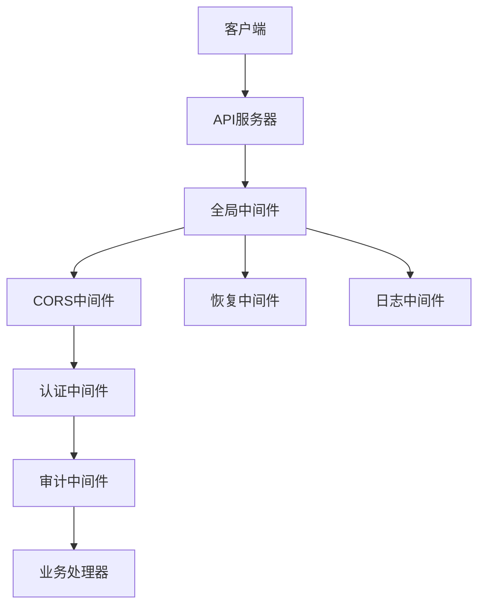
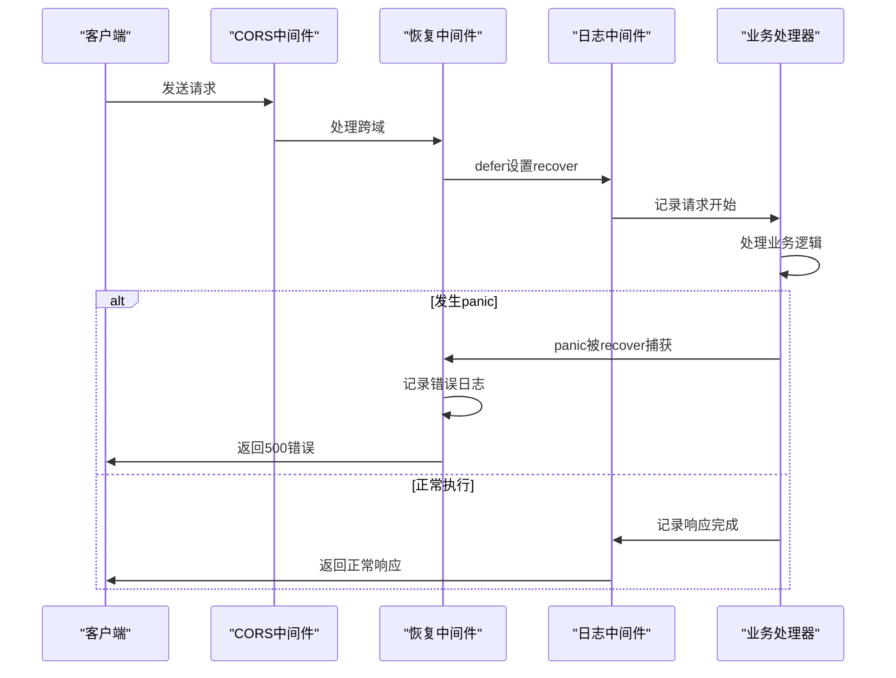
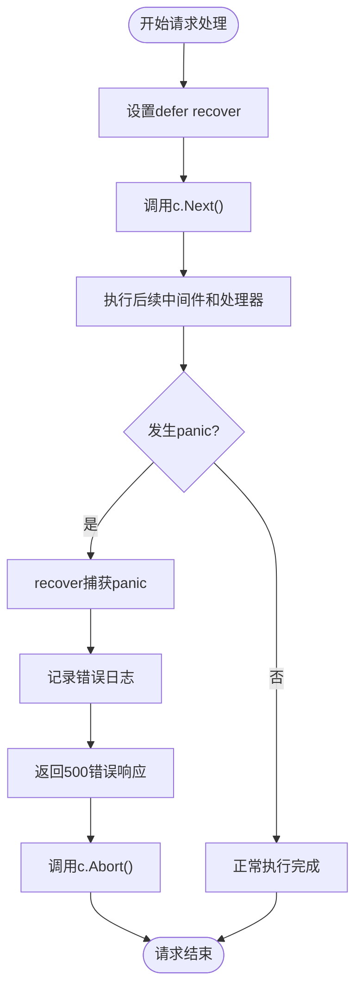
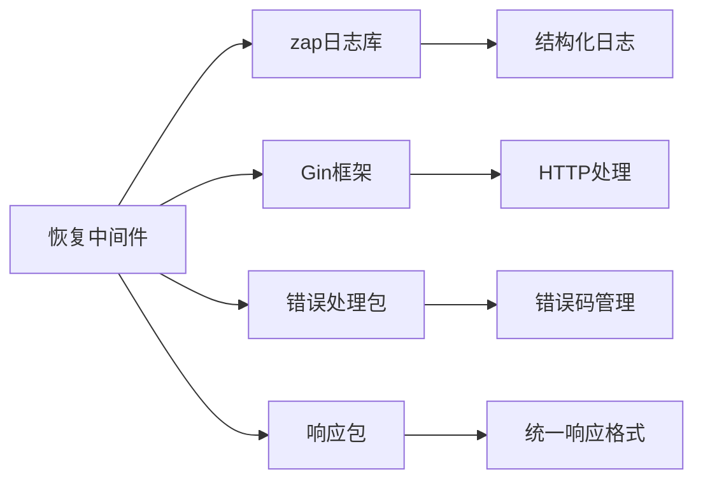

# 恢复中间件

<cite>
**本文档引用的文件**
- [recovery.go](file://manager/internal/middleware/recovery.go)
- [response.go](file://manager/pkg/response/response.go)
- [errors.go](file://manager/pkg/errors/errors.go)
- [main.go](file://manager/cmd/manager/main.go)
- [logger.go](file://manager/internal/middleware/logger.go)
- [auth.go](file://manager/internal/middleware/auth.go)
- [audit.go](file://manager/internal/middleware/audit.go)
- [cors.go](file://manager/internal/middleware/cors.go)
</cite>

## 目录
1. [简介](#简介)
2. [项目结构](#项目结构)
3. [核心组件](#核心组件)
4. [架构概述](#架构概述)
5. [详细组件分析](#详细组件分析)
6. [依赖分析](#依赖分析)
7. [性能考虑](#性能考虑)
8. [故障排除指南](#故障排除指南)
9. [结论](#结论)

## 简介
恢复中间件是运维工具框架中的关键组件，负责捕获HTTP请求处理过程中发生的panic，防止服务崩溃。该中间件通过Go语言的defer和recover机制实现错误恢复，将panic信息转换为结构化的错误响应，并记录详细的错误堆栈用于故障排查。在保证服务高可用性方面发挥着重要作用。

## 项目结构
本项目采用分层架构设计，主要包含agent、daemon、manager和web四个核心模块。其中，恢复中间件位于manager模块的internal/middleware目录下，与其他中间件共同构成API服务器的请求处理管道。



**图示来源**
- [main.go](file://manager/cmd/manager/main.go#L136-L143)
- [recovery.go](file://manager/internal/middleware/recovery.go#L14-L38)
- [logger.go](file://manager/internal/middleware/logger.go#L11-L35)
- [cors.go](file://manager/internal/middleware/cors.go#L8-L27)

**本节来源**
- [main.go](file://manager/cmd/manager/main.go#L135-L143)
- [recovery.go](file://manager/internal/middleware/recovery.go#L1-L38)

## 核心组件
恢复中间件的核心功能是通过defer和recover机制捕获HTTP请求处理过程中的panic。当发生panic时，中间件会记录详细的错误日志，包括错误信息、堆栈跟踪、请求路径和方法等，并返回标准化的500错误响应。该中间件与其他中间件协同工作，确保服务的稳定性和可靠性。

**本节来源**
- [recovery.go](file://manager/internal/middleware/recovery.go#L14-L38)
- [response.go](file://manager/pkg/response/response.go#L98-L101)
- [errors.go](file://manager/pkg/errors/errors.go#L44-L49)

## 架构概述
恢复中间件作为API服务器请求处理管道的第一个全局中间件，位于CORS和日志中间件之后。这种顺序确保了即使发生panic，也能正确处理跨域请求并记录日志。中间件通过Gin框架的Context对象访问请求信息，并利用zap日志库记录详细的错误信息。



**图示来源**
- [recovery.go](file://manager/internal/middleware/recovery.go#L16-L34)
- [main.go](file://manager/cmd/manager/main.go#L140-L142)
- [logger.go](file://manager/internal/middleware/logger.go#L12-L35)

## 详细组件分析

### 恢复中间件分析
恢复中间件实现了完整的错误恢复机制，通过defer函数设置recover捕获点。当HTTP请求处理过程中发生panic时，recover函数能够捕获异常，阻止其向上传播导致服务崩溃。中间件随后记录详细的错误信息，包括panic值、堆栈跟踪、请求路径和方法等。



**图示来源**
- [recovery.go](file://manager/internal/middleware/recovery.go#L16-L34)
- [response.go](file://manager/pkg/response/response.go#L98-L101)

**本节来源**
- [recovery.go](file://manager/internal/middleware/recovery.go#L1-L38)
- [response.go](file://manager/pkg/response/response.go#L98-L101)

### 错误响应分析
恢复中间件使用统一的响应格式返回错误信息，确保客户端能够一致地处理错误。错误响应包含错误码、消息和时间戳等字段，其中错误码5001对应服务器内部错误。这种结构化的错误响应便于前端统一处理，并为监控系统提供标准化的数据格式。

```mermaid
classDiagram
class Response {
+int Code
+string Message
+interface{} Data
+string Timestamp
}
class APIError {
+ErrorCode Code
+string Message
+string Details
}
Response --> APIError : "包含错误信息"
APIError --> ErrorCode : "枚举类型"
class ErrorCode {
+Success
+ErrInvalidParams
+ErrUnauthorized
+ErrForbidden
+ErrNotFound
+ErrConflict
+ErrTooManyRequests
+ErrInvalidToken
+ErrTokenExpired
+ErrInvalidCredentials
+ErrNodeNotFound
+ErrNodeOffline
+ErrNodeAlreadyExists
+ErrTaskNotFound
+ErrTaskRunning
+ErrTaskFailed
+ErrUserNotFound
+ErrUserDisabled
+ErrUserAlreadyExists
+ErrVersionNotFound
+ErrVersionAlreadyExists
+ErrVersionNotReleased
+ErrVersionDeprecated
+ErrInvalidVersion
+ErrVersionHashMismatch
+ErrVersionSignatureInvalid
+ErrInternalServer
+ErrDatabase
+ErrRedis
+ErrGRPC
+ErrFileOperation
}
APIError --> ErrorCode : "使用错误码"
```

**图示来源**
- [response.go](file://manager/pkg/response/response.go#L11-L17)
- [errors.go](file://manager/pkg/errors/errors.go#L6-L49)
- [errors.go](file://manager/pkg/errors/errors.go#L51-L56)

**本节来源**
- [response.go](file://manager/pkg/response/response.go#L11-L145)
- [errors.go](file://manager/pkg/errors/errors.go#L1-L171)

## 依赖分析
恢复中间件依赖于多个核心组件，包括zap日志库用于记录错误信息，Gin框架提供HTTP处理能力，以及自定义的错误处理和响应包。这些依赖关系确保了中间件能够有效地捕获、记录和响应错误。



**图示来源**
- [recovery.go](file://manager/internal/middleware/recovery.go#L7-L10)
- [errors.go](file://manager/pkg/errors/errors.go#L1-L171)
- [response.go](file://manager/pkg/response/response.go#L1-L145)

**本节来源**
- [recovery.go](file://manager/internal/middleware/recovery.go#L3-L10)
- [errors.go](file://manager/pkg/errors/errors.go#L1-L171)
- [response.go](file://manager/pkg/response/response.go#L1-L145)

## 性能考虑
恢复中间件对性能的影响极小，因为defer语句的开销很低，只有在发生panic时才会执行recover和日志记录操作。在正常情况下，中间件只是简单地调用c.Next()，不会增加额外的处理时间。日志记录使用异步方式，避免阻塞请求处理流程。

## 故障排除指南
当系统出现异常时，可以通过查看恢复中间件记录的错误日志来定位问题。日志中包含完整的堆栈跟踪信息，可以帮助开发人员快速找到panic发生的位置。建议在生产环境中配置日志监控和告警，及时发现和处理潜在的系统问题。

**本节来源**
- [recovery.go](file://manager/internal/middleware/recovery.go#L19-L24)
- [logger.go](file://manager/internal/middleware/logger.go#L24-L33)

## 结论
恢复中间件通过defer和recover机制有效地防止了服务因panic而崩溃，提高了系统的稳定性和可用性。中间件与其他组件协同工作，提供了完整的错误处理解决方案，包括错误捕获、日志记录和结构化响应。在生产环境中，建议结合监控告警系统，及时发现和处理潜在的系统问题，确保服务的持续稳定运行。