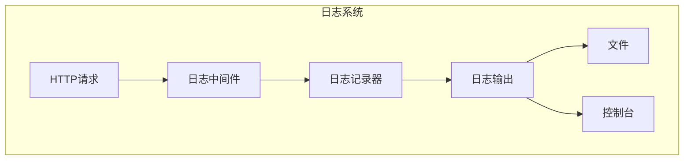
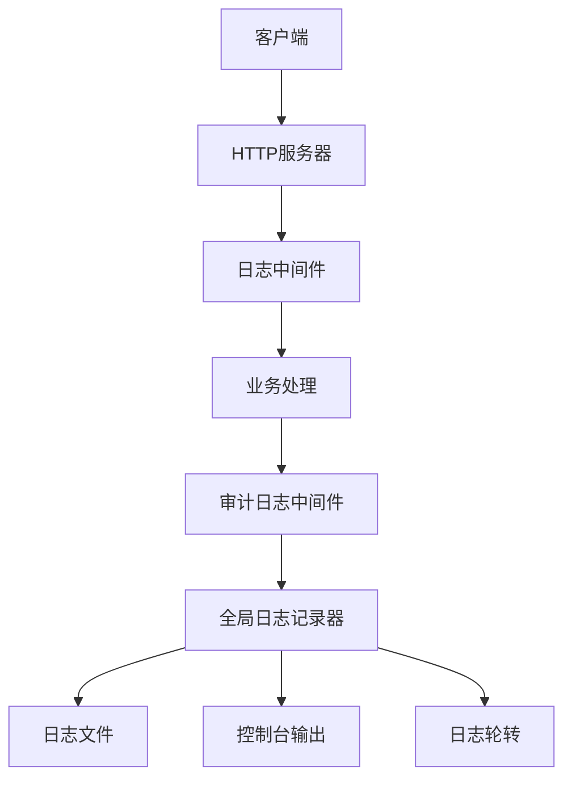
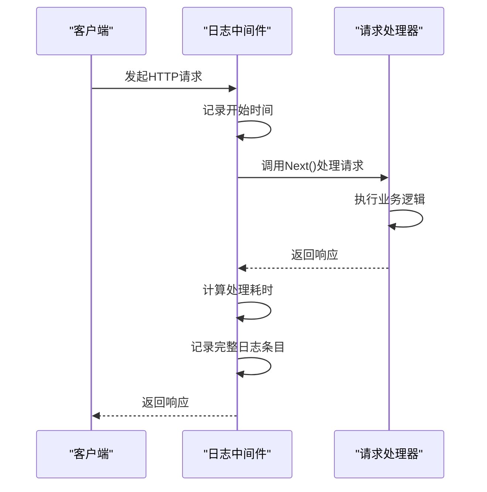
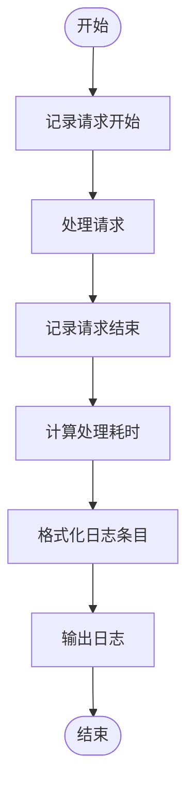
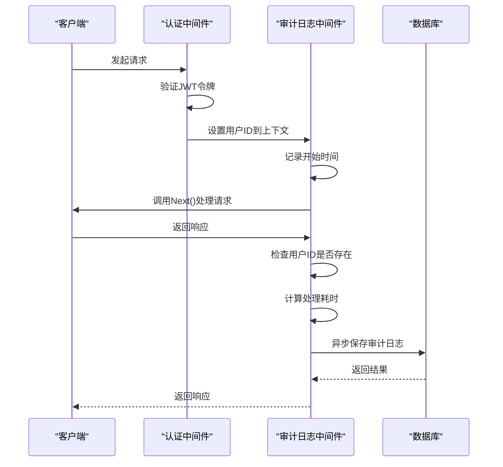

# 日志中间件

<cite>
**本文档引用的文件**
- [logger.go](file://manager/internal/logger/logger.go)
- [logger.go](file://agent/internal/logger/logger.go)
- [logger.go](file://daemon/internal/logger/logger.go)
- [logger.go](file://manager/internal/middleware/logger.go)
- [audit.go](file://manager/internal/middleware/audit.go)
- [config.go](file://manager/internal/config/config.go)
- [main.go](file://manager/cmd/manager/main.go)
- [main.go](file://agent/cmd/agent/main.go)
- [server.go](file://agent/internal/api/server.go)
</cite>

## 目录
1. [简介](#简介)
2. [项目结构](#项目结构)
3. [核心组件](#核心组件)
4. [架构概述](#架构概述)
5. [详细组件分析](#详细组件分析)
6. [依赖分析](#依赖分析)
7. [性能考虑](#性能考虑)
8. [故障排除指南](#故障排除指南)
9. [结论](#结论)

## 简介
本文档全面解析了运维工具框架中的日志中间件实现，重点描述了如何记录HTTP请求的完整生命周期信息。文档详细说明了日志格式化策略、输出目标配置以及与全局日志系统的集成方式。同时阐述了在高并发场景下的性能优化措施，如异步日志写入和批量处理，以及日志数据在系统监控和故障排查中的实际应用。

## 项目结构
该日志系统在agent、daemon和manager三个主要模块中均有实现，每个模块都有独立的日志配置和处理逻辑。系统采用分层架构，将日志中间件、日志记录器和日志配置分离，实现了灵活的日志管理。



**图源**
- [logger.go](file://manager/internal/middleware/logger.go#L10-L35)
- [logger.go](file://manager/internal/logger/logger.go#L1-L115)

**节源**
- [logger.go](file://manager/internal/middleware/logger.go#L10-L35)
- [logger.go](file://manager/internal/logger/logger.go#L1-L115)

## 核心组件
日志中间件系统由三个核心组件构成：日志中间件、全局日志记录器和日志配置管理。日志中间件负责捕获HTTP请求的完整生命周期信息；全局日志记录器提供统一的日志输出接口；日志配置管理则允许通过配置文件灵活调整日志行为。

**节源**
- [logger.go](file://manager/internal/middleware/logger.go#L10-L35)
- [logger.go](file://manager/internal/logger/logger.go#L1-L115)
- [config.go](file://manager/internal/config/config.go#L71-L85)

## 架构概述
系统采用分层架构设计，日志中间件位于HTTP请求处理链中，捕获请求和响应的完整信息。全局日志记录器作为单例存在，提供统一的日志输出接口。配置系统允许在运行时调整日志级别、输出路径等参数。



**图源**
- [main.go](file://manager/cmd/manager/main.go#L136-L143)
- [logger.go](file://manager/internal/middleware/logger.go#L10-L35)

## 详细组件分析

### 日志中间件分析
日志中间件负责记录HTTP请求的完整生命周期信息，包括请求方法、路径、客户端IP、响应状态码和处理耗时等关键指标。

#### 对于API/服务组件：


**图源**
- [logger.go](file://manager/internal/middleware/logger.go#L10-L35)
- [server.go](file://agent/internal/api/server.go#L102-L117)

#### 对于复杂逻辑组件：


**图源**
- [logger.go](file://manager/internal/middleware/logger.go#L10-L35)
- [logger.go](file://manager/internal/logger/logger.go#L24-L33)

**节源**
- [logger.go](file://manager/internal/middleware/logger.go#L10-L35)
- [server.go](file://agent/internal/api/server.go#L102-L117)

### 审计日志中间件分析
审计日志中间件专门用于记录需要安全审计的操作，只对已认证的用户请求进行记录，确保日志的安全性和有效性。



**图源**
- [audit.go](file://manager/internal/middleware/audit.go#L13-L48)
- [auth.go](file://manager/internal/middleware/auth.go#L13-L60)

**节源**
- [audit.go](file://manager/internal/middleware/audit.go#L13-L48)

## 依赖分析
日志系统与其他组件存在明确的依赖关系，确保了系统的模块化和可维护性。

```mermaid
graph TD
A[日志中间件] --> B[全局日志记录器]
B --> C[日志配置]
A --> D[HTTP框架(Gin)]
E[业务组件] --> B
F[主程序] --> A
F --> B
F --> C
```

**图源**
- [main.go](file://manager/cmd/manager/main.go#L46-L51)
- [logger.go](file://manager/internal/middleware/logger.go#L11-L35)

**节源**
- [main.go](file://manager/cmd/manager/main.go#L46-L51)
- [logger.go](file://manager/internal/middleware/logger.go#L11-L35)

## 性能考虑
在高并发场景下，日志系统采用了多种性能优化措施来确保系统的稳定性和响应性。

### 异步日志记录
审计日志采用goroutine异步记录，避免阻塞主请求处理流程，提高系统吞吐量。

### 批量处理
虽然当前实现中未直接体现批量处理，但通过lumberjack日志轮转库实现了高效的日志文件管理，支持自动压缩和备份。

### 日志级别控制
系统支持动态调整日志级别（debug、info、warn、error），在生产环境中可降低为info级别，减少日志输出量，提高性能。

### 日志轮转
使用lumberjack库实现日志文件的自动轮转，配置了最大文件大小、保留文件数量和保留天数，防止日志文件无限增长。

**节源**
- [logger.go](file://manager/internal/logger/logger.go#L54-L62)
- [config.go](file://manager/internal/config/config.go#L75-L78)

## 故障排除指南
日志系统在系统监控和故障排查中发挥着关键作用，提供了丰富的诊断信息。

### 日志条目结构
日志条目采用结构化JSON格式，包含以下关键字段：
- time: 日志时间戳
- level: 日志级别
- msg: 日志消息
- status: HTTP状态码
- method: 请求方法
- path: 请求路径
- query: 查询参数
- ip: 客户端IP
- user-agent: 用户代理
- latency: 处理耗时
- error: 错误信息

### 常见问题排查
1. **日志文件未生成**：检查日志输出路径的写入权限和磁盘空间。
2. **日志级别不符合预期**：确认配置文件中的日志级别设置是否正确。
3. **日志轮转未生效**：检查lumberjack配置参数是否正确设置。
4. **审计日志缺失**：确认请求是否通过认证中间件，用户ID是否正确设置到上下文。

**节源**
- [logger.go](file://manager/internal/middleware/logger.go#L24-L33)
- [logger.go](file://manager/internal/logger/logger.go#L39-L52)

## 结论
该日志中间件系统设计合理，功能完整，能够有效记录HTTP请求的完整生命周期信息。通过与全局日志系统的集成，实现了统一的日志管理。在高并发场景下，采用异步记录等性能优化措施，确保了系统的稳定性和高效性。日志数据为系统监控和故障排查提供了有力支持，是运维工具框架中不可或缺的重要组件。