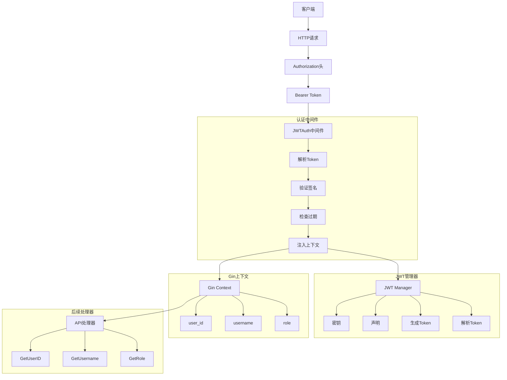
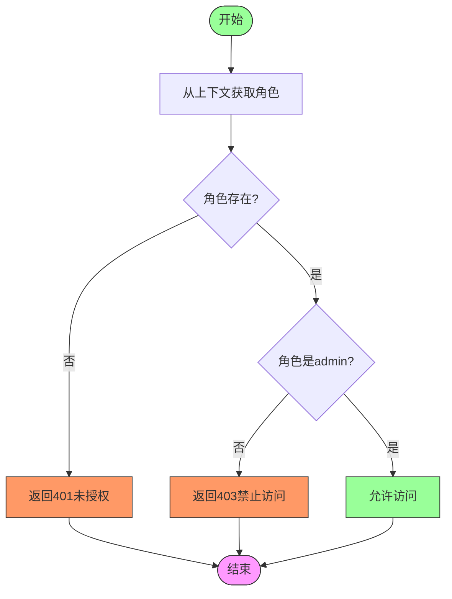
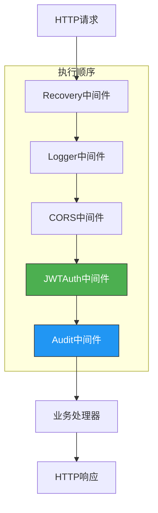
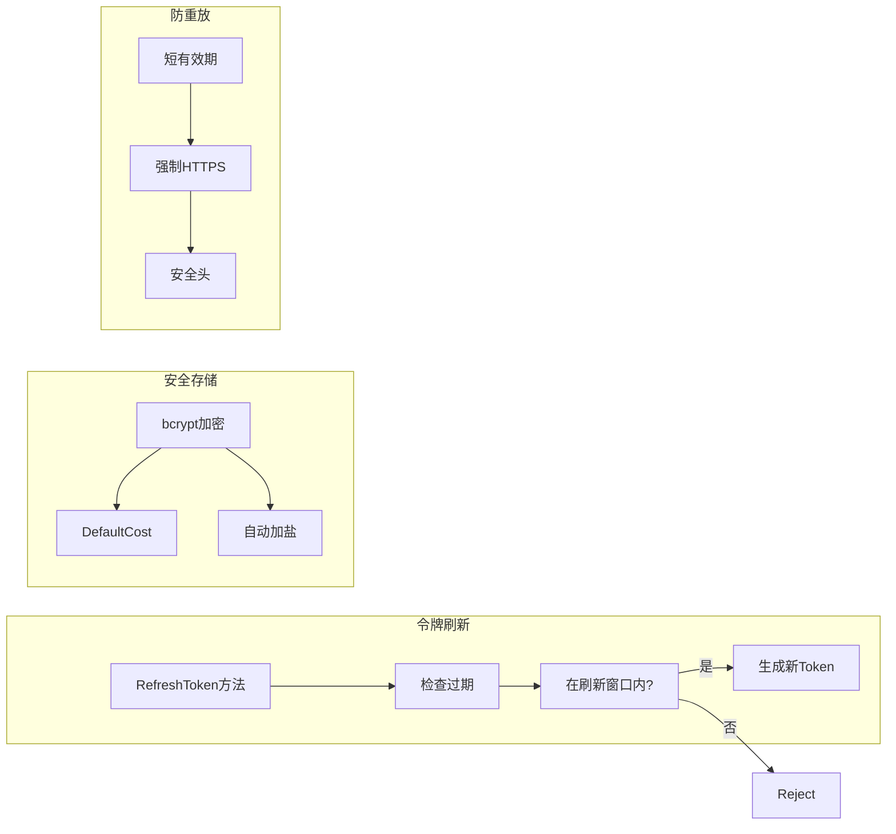
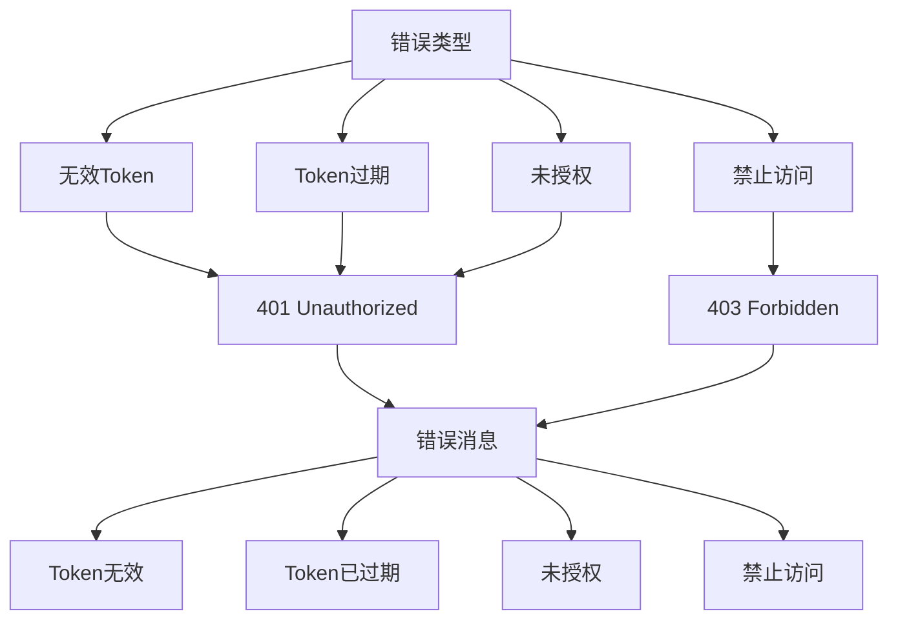
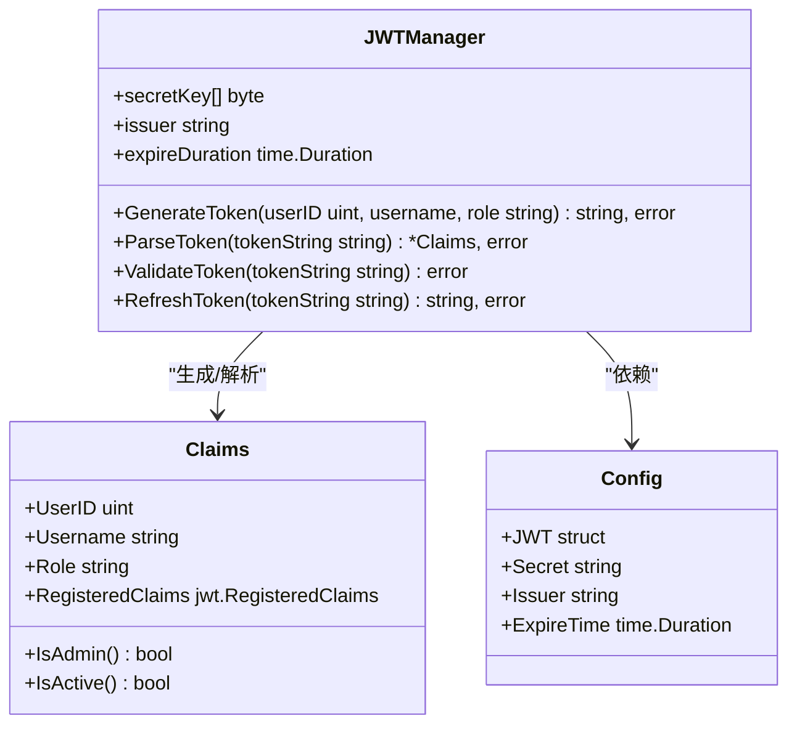

# 认证中间件

<cite>
**本文档引用的文件**   
- [auth.go](file://manager/internal/middleware/auth.go)
- [jwt.go](file://manager/pkg/jwt/jwt.go)
- [auth.go](file://manager/internal/handler/auth.go)
- [auth.go](file://manager/internal/service/auth.go)
- [user.go](file://manager/internal/model/user.go)
- [audit.go](file://manager/internal/middleware/audit.go)
- [main.go](file://manager/cmd/manager/main.go)
</cite>

## 目录
1. [简介](#简介)
2. [认证中间件架构](#认证中间件架构)
3. [JWT认证流程](#jwt认证流程)
4. [权限控制机制](#权限控制机制)
5. [中间件协作关系](#中间件协作关系)
6. [安全最佳实践](#安全最佳实践)
7. [错误处理与响应](#错误处理与响应)
8. [配置与初始化](#配置与初始化)
9. [总结](#总结)

## 简介
认证中间件是系统安全架构的核心组件，负责处理基于JWT的用户认证和权限验证。该中间件实现了完整的认证流程，包括令牌提取、验证、用户信息注入以及与RBAC权限系统的集成。通过Gin框架的中间件机制，为API端点提供统一的安全保护。

## 认证中间件架构



**图示来源**
- [auth.go](file://manager/internal/middleware/auth.go#L13-L49)
- [jwt.go](file://manager/pkg/jwt/jwt.go#L34-L61)
- [auth.go](file://manager/internal/handler/auth.go#L100-L104)

## JWT认证流程

认证中间件实现了标准的JWT认证流程，从HTTP请求头中提取令牌并进行验证。流程包括令牌提取、格式验证、签名验证和过期检查等关键步骤。

```mermaid
sequenceDiagram
participant Client as "客户端"
participant Middleware as "认证中间件"
participant JWTManager as "JWT管理器"
participant Context as "Gin上下文"
participant Handler as "API处理器"
Client->>Middleware : 发送HTTP请求
Middleware->>Middleware : 获取Authorization头
alt 头部为空
Middleware-->>Client : 返回401未授权
return
end
Middleware->>Middleware : 检查Bearer格式
alt 格式无效
Middleware-->>Client : 返回401无效Token
return
end
Middleware->>JWTManager : 调用ParseToken
JWTManager->>JWTManager : 验证签名方法
JWTManager->>JWTManager : 使用密钥验证签名
alt 签名验证失败
JWTManager-->>Middleware : 返回ErrInvalidToken
Middleware-->>Client : 返回401无效Token
return
end
JWTManager->>JWTManager : 检查过期时间
alt Token已过期
JWTManager-->>Middleware : 返回ErrExpiredToken
Middleware-->>Client : 返回401Token过期
return
end
JWTManager-->>Middleware : 返回Claims
Middleware->>Context : 注入用户信息
Context->>Context : 设置user_id
Context->>Context : 设置username
Context->>Context : 设置role
Middleware->>Handler : 调用Next()
Handler->>Handler : 处理业务逻辑
Handler-->>Client : 返回响应
```

**图示来源**
- [auth.go](file://manager/internal/middleware/auth.go#L13-L49)
- [jwt.go](file://manager/pkg/jwt/jwt.go#L63-L88)
- [auth.go](file://manager/internal/handler/auth.go#L100-L104)

**认证流程详细说明**
1. **令牌提取**: 从HTTP请求头的`Authorization`字段获取令牌
2. **格式验证**: 检查是否以`Bearer `前缀开头
3. **签名验证**: 使用HS256算法和密钥验证令牌签名
4. **过期检查**: 验证令牌是否在有效期内
5. **上下文注入**: 将解析出的用户信息注入Gin上下文

**Section sources**
- [auth.go](file://manager/internal/middleware/auth.go#L13-L49)
- [jwt.go](file://manager/pkg/jwt/jwt.go#L63-L88)

## 权限控制机制

系统实现了基于角色的访问控制(RBAC)机制，通过中间件链实现细粒度的权限管理。管理员权限中间件检查用户角色，确保只有授权用户才能访问敏感资源。



**图示来源**
- [auth.go](file://manager/internal/middleware/auth.go#L53-L69)
- [user.go](file://manager/internal/model/user.go#L34-L37)

**权限控制实现**
- `RequireAdmin`中间件检查用户角色是否为`admin`
- 通过`c.Get("role")`从Gin上下文获取角色信息
- 非管理员用户返回403禁止访问响应
- 用户模型中的`IsAdmin()`方法提供角色判断

**Section sources**
- [auth.go](file://manager/internal/middleware/auth.go#L53-L69)
- [user.go](file://manager/internal/model/user.go#L34-L37)

## 中间件协作关系

认证中间件与其他中间件协同工作，形成完整的安全和监控体系。中间件按特定顺序执行，确保请求在到达业务处理器前经过必要的验证和记录。



**图示来源**
- [main.go](file://manager/cmd/manager/main.go#L140-L144)
- [audit.go](file://manager/internal/middleware/audit.go#L13-L49)

**中间件执行顺序**
1. **Recovery**: 捕获panic，防止服务崩溃
2. **Logger**: 记录请求日志
3. **CORS**: 处理跨域请求
4. **JWTAuth**: 验证用户身份
5. **Audit**: 记录审计日志
6. **业务处理器**: 执行业务逻辑

**审计日志中间件**
- 在请求处理完成后异步记录审计日志
- 包含用户ID、操作类型、资源路径、IP地址等信息
- 只记录已认证用户的操作

**Section sources**
- [main.go](file://manager/cmd/manager/main.go#L140-L165)
- [audit.go](file://manager/internal/middleware/audit.go#L13-L49)

## 安全最佳实践

系统实现了多项安全最佳实践，包括令牌刷新、安全存储和防重放攻击等机制，确保认证系统的安全性。



**图示来源**
- [jwt.go](file://manager/pkg/jwt/jwt.go#L96-L128)
- [auth.go](file://manager/internal/service/auth.go#L172-L204)
- [user.go](file://manager/internal/model/user.go#L17)

**令牌刷新机制**
- 实现`RefreshToken`方法，允许在令牌过期后7天内刷新
- 检查过期令牌是否在刷新窗口期内
- 生成新的有效令牌

**密码安全**
- 使用bcrypt算法加密存储密码
- 默认成本因子确保安全性
- 自动加盐防止彩虹表攻击

**防重放攻击**
- 设置合理的令牌有效期
- 建议通过HTTPS传输令牌
- 使用安全的HTTP头配置

**Section sources**
- [jwt.go](file://manager/pkg/jwt/jwt.go#L96-L128)
- [auth.go](file://manager/internal/service/auth.go#L172-L204)
- [user.go](file://manager/internal/model/user.go#L17)

## 错误处理与响应

认证系统实现了完善的错误处理机制，提供清晰的错误信息和适当的HTTP状态码，帮助客户端正确处理认证相关错误。



**图示来源**
- [auth.go](file://manager/internal/middleware/auth.go#L18-L40)
- [auth.go](file://manager/internal/middleware/auth.go#L57-L64)
- [errors.go](file://manager/pkg/errors/errors.go)

**错误处理策略**
- 统一使用`response.Error`函数返回错误
- 根据错误类型返回适当的HTTP状态码
- 提供清晰的错误消息帮助调试
- 敏感信息不暴露给客户端

**Section sources**
- [auth.go](file://manager/internal/middleware/auth.go#L18-L40)
- [auth.go](file://manager/internal/middleware/auth.go#L57-L64)

## 配置与初始化

认证系统通过配置文件进行初始化，包括JWT密钥、签发者和过期时间等关键参数，确保系统的灵活性和可配置性。



**图示来源**
- [jwt.go](file://manager/pkg/jwt/jwt.go#L28-L41)
- [main.go](file://manager/cmd/manager/main.go#L71-L75)
- [config.go](file://manager/internal/config/config.go)

**初始化流程**
1. 从配置文件加载JWT相关参数
2. 创建JWT管理器实例
3. 在服务层注入JWT管理器
4. 在路由中注册认证中间件

**Section sources**
- [main.go](file://manager/cmd/manager/main.go#L71-L75)
- [jwt.go](file://manager/pkg/jwt/jwt.go#L34-L41)

## 总结

认证中间件实现了完整的JWT认证流程，为系统提供了可靠的安全保障。通过中间件机制，实现了认证、权限控制和审计日志的分离，确保了代码的可维护性和扩展性。系统遵循安全最佳实践，包括密码加密、令牌刷新和防重放攻击等机制，为生产环境提供了坚实的安全基础。

**Section sources**
- [auth.go](file://manager/internal/middleware/auth.go)
- [jwt.go](file://manager/pkg/jwt/jwt.go)
- [main.go](file://manager/cmd/manager/main.go)