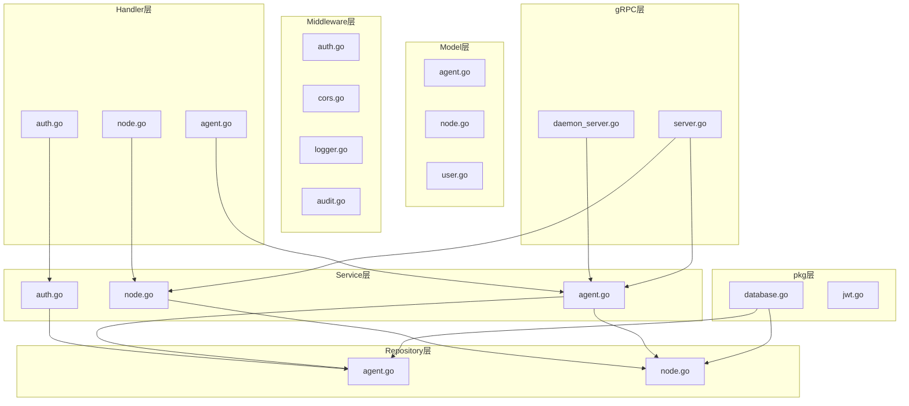
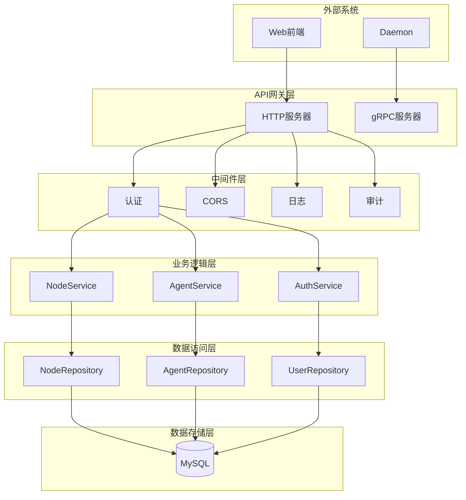
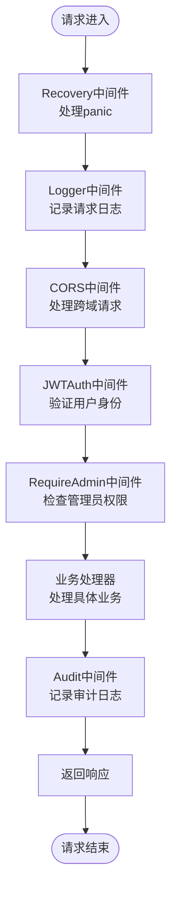
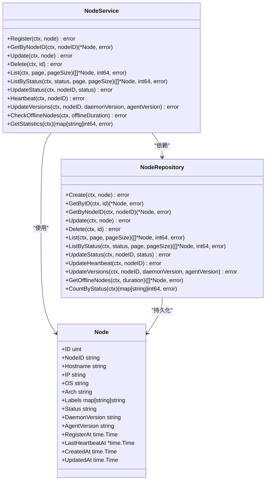
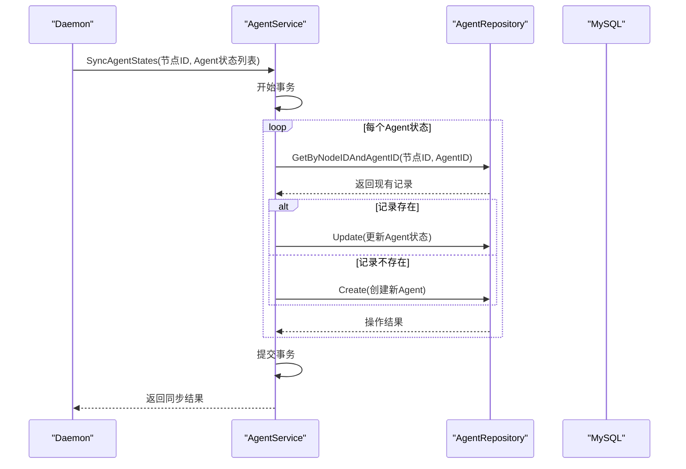
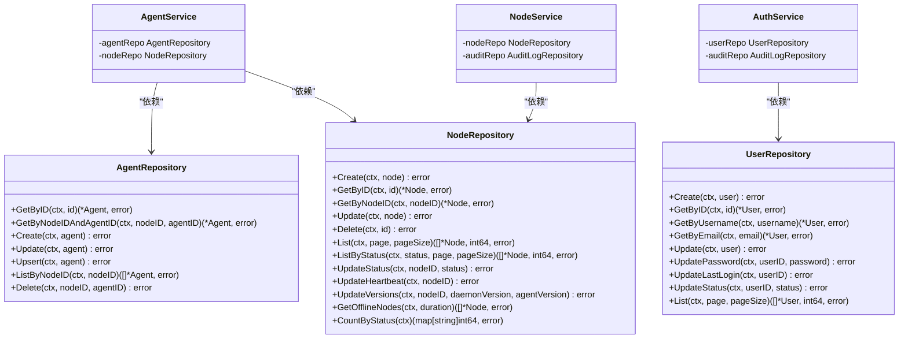
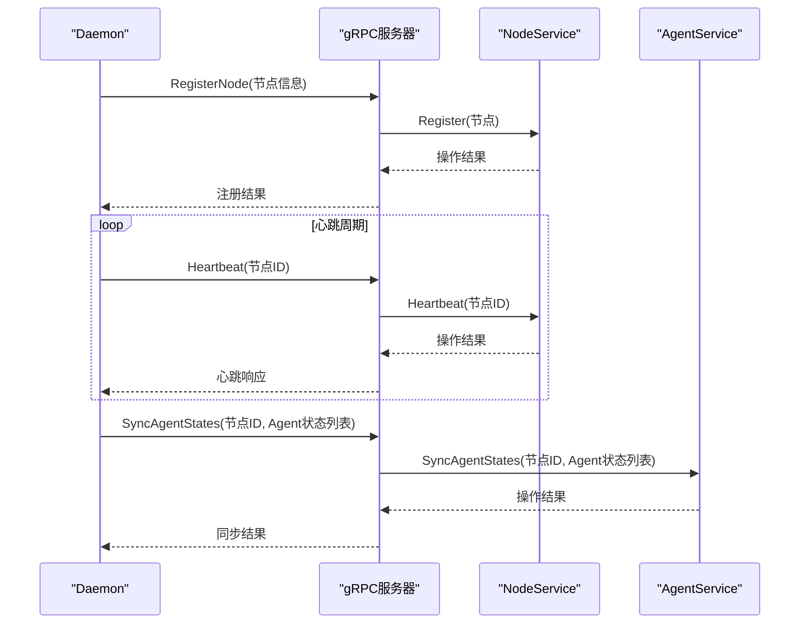
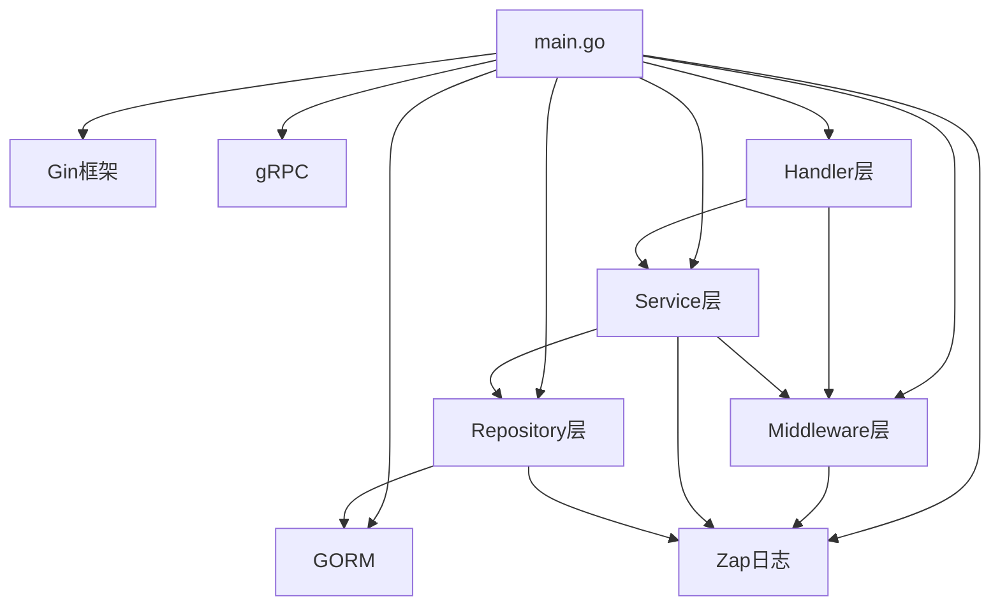

# Manager模块

<cite>
**本文档引用文件**   
- [main.go](file://manager/cmd/manager/main.go)
- [auth.go](file://manager/internal/middleware/auth.go)
- [cors.go](file://manager/internal/middleware/cors.go)
- [logger.go](file://manager/internal/middleware/logger.go)
- [audit.go](file://manager/internal/middleware/audit.go)
- [auth_handler.go](file://manager/internal/handler/auth.go)
- [node_handler.go](file://manager/internal/handler/node.go)
- [agent_handler.go](file://manager/internal/handler/agent.go)
- [auth_service.go](file://manager/internal/service/auth.go)
- [node_service.go](file://manager/internal/service/node.go)
- [agent_service.go](file://manager/internal/service/agent.go)
- [agent_repository.go](file://manager/internal/repository/agent.go)
- [node_repository.go](file://manager/internal/repository/node.go)
- [daemon_server.go](file://manager/internal/grpc/daemon_server.go)
- [server.go](file://manager/internal/grpc/server.go)
- [database.go](file://manager/pkg/database/database.go)
</cite>

## 目录
1. [简介](#简介)
2. [项目结构](#项目结构)
3. [核心组件](#核心组件)
4. [架构概述](#架构概述)
5. [详细组件分析](#详细组件分析)
6. [依赖分析](#依赖分析)
7. [性能考虑](#性能考虑)
8. [故障排除指南](#故障排除指南)
9. [结论](#结论)

## 简介
Manager模块是运维工具框架的核心控制中心，负责管理整个系统的节点、用户、监控指标和Agent。它作为系统的API网关和控制平面，接收来自Web前端的HTTP请求和来自Daemon的gRPC调用，协调各个组件的工作。Manager模块基于Gin框架构建RESTful API，使用GORM与MySQL数据库交互，并通过gRPC协议与部署在各个节点上的Daemon进行通信。该模块实现了完整的用户认证、权限控制、审计日志和高可用性设计，是整个系统的大脑和中枢神经系统。

## 项目结构
Manager模块采用清晰的分层架构，将代码组织为多个逻辑层，每个层都有明确的职责。这种分层设计遵循了关注点分离原则，提高了代码的可维护性和可测试性。



**图源**
- [main.go](file://manager/cmd/manager/main.go#L1-L290)
- [auth.go](file://manager/internal/handler/auth.go#L1-L225)
- [node.go](file://manager/internal/handler/node.go#L1-L157)
- [agent.go](file://manager/internal/handler/agent.go#L1-L161)

**本节源**
- [main.go](file://manager/cmd/manager/main.go#L1-L290)

## 核心组件
Manager模块的核心组件包括API网关层、业务服务层、数据访问层和gRPC服务端。API网关层基于Gin框架实现，处理所有HTTP请求，通过中间件链提供认证、日志、CORS和审计功能。业务服务层包含NodeService、AgentService等服务，封装了核心业务逻辑。数据访问层通过GORM与MySQL数据库交互，使用repository模式实现数据访问的抽象。gRPC服务端接收来自Daemon的上报数据，包括节点注册、心跳和监控指标。这些组件通过清晰的依赖关系协同工作，构成了系统的控制中心。

**本节源**
- [main.go](file://manager/cmd/manager/main.go#L1-L290)
- [auth.go](file://manager/internal/middleware/auth.go#L1-L98)
- [cors.go](file://manager/internal/middleware/cors.go#L1-L28)
- [logger.go](file://manager/internal/middleware/logger.go#L1-L36)
- [audit.go](file://manager/internal/middleware/audit.go#L1-L50)

## 架构概述
Manager模块采用典型的分层架构，从上到下分为API网关层、业务逻辑层、数据访问层和数据存储层。API网关层处理所有外部请求，包括来自Web前端的HTTP请求和来自Daemon的gRPC调用。业务逻辑层包含各种服务，如NodeService、AgentService等，负责处理具体的业务逻辑。数据访问层通过GORM与MySQL数据库交互，使用repository模式实现数据访问的解耦。整个系统通过依赖注入的方式将各层组件组合在一起，确保了松耦合和高内聚。



**图源**
- [main.go](file://manager/cmd/manager/main.go#L1-L290)
- [auth.go](file://manager/internal/middleware/auth.go#L1-L98)
- [node_service.go](file://manager/internal/service/node.go#L1-L234)
- [agent_service.go](file://manager/internal/service/agent.go#L1-L298)
- [node_repository.go](file://manager/internal/repository/node.go#L1-L226)
- [agent_repository.go](file://manager/internal/repository/agent.go#L1-L138)

## 详细组件分析
### API网关层分析
API网关层是Manager模块的入口，负责接收和处理所有外部请求。它基于Gin框架构建，提供了高性能的HTTP路由和中间件支持。网关层实现了RESTful API，包括用户认证、节点管理、Agent操作等接口。通过中间件链，网关层提供了统一的认证、日志、CORS和审计功能，确保了系统的安全性和可观察性。

#### 中间件链工作机制
API网关层通过中间件链处理请求，每个中间件负责特定的功能。请求首先经过Recovery中间件，确保panic不会导致服务器崩溃。然后经过Logger中间件，记录请求的详细信息。CORS中间件处理跨域请求，允许Web前端访问API。JWTAuth中间件验证用户身份，确保只有授权用户才能访问受保护的资源。最后，Audit中间件记录审计日志，跟踪用户的操作。



**图源**
- [main.go](file://manager/cmd/manager/main.go#L1-L290)
- [auth.go](file://manager/internal/middleware/auth.go#L1-L98)
- [cors.go](file://manager/internal/middleware/cors.go#L1-L28)
- [logger.go](file://manager/internal/middleware/logger.go#L1-L36)
- [audit.go](file://manager/internal/middleware/audit.go#L1-L50)

**本节源**
- [main.go](file://manager/cmd/manager/main.go#L1-L290)
- [auth.go](file://manager/internal/middleware/auth.go#L1-L98)
- [cors.go](file://manager/internal/middleware/cors.go#L1-L28)
- [logger.go](file://manager/internal/middleware/logger.go#L1-L36)
- [audit.go](file://manager/internal/middleware/audit.go#L1-L50)

### 业务服务层分析
业务服务层是Manager模块的核心，包含了系统的主要业务逻辑。该层由多个服务组成，每个服务负责特定的业务领域。NodeService负责节点的注册、心跳和状态管理。AgentService管理节点上的Agent，包括状态同步和操作指令。AuthService处理用户认证和权限管理。这些服务通过清晰的接口定义，实现了高内聚和低耦合。

#### NodeService领域逻辑
NodeService是管理节点生命周期的核心服务。它负责处理节点注册、心跳上报、状态更新等操作。当新节点注册时，NodeService会创建或更新节点记录。通过定期的心跳检测，服务能够及时发现离线节点并更新其状态。此外，NodeService还提供了节点列表查询、统计信息获取等功能，支持按状态、标签等条件过滤。



**图源**
- [node_service.go](file://manager/internal/service/node.go#L1-L234)
- [node_repository.go](file://manager/internal/repository/node.go#L1-L226)
- [node.go](file://manager/internal/model/node.go)

**本节源**
- [node_service.go](file://manager/internal/service/node.go#L1-L234)
- [node_repository.go](file://manager/internal/repository/node.go#L1-L226)

#### AgentService领域逻辑
AgentService负责管理节点上的Agent，包括状态同步和操作指令。当Daemon上报Agent状态时，AgentService会将这些状态持久化到数据库中。服务还提供了Agent列表查询功能，支持按节点ID获取特定节点上的所有Agent。对于Agent操作（如启动、停止、重启），AgentService会通过gRPC调用转发到相应的Daemon。



**图源**
- [agent_service.go](file://manager/internal/service/agent.go#L1-L298)
- [agent_repository.go](file://manager/internal/repository/agent.go#L1-L138)

**本节源**
- [agent_service.go](file://manager/internal/service/agent.go#L1-L298)
- [agent_repository.go](file://manager/internal/repository/agent.go#L1-L138)

### 数据访问层分析
数据访问层通过GORM与MySQL数据库交互，实现了数据访问的抽象和解耦。该层采用repository模式，为每个实体提供了统一的数据访问接口。通过repository模式，业务逻辑层无需关心具体的数据存储细节，提高了代码的可测试性和可维护性。数据访问层还负责处理数据库连接池、事务管理等底层细节。

#### Repository模式实现
Repository模式将数据访问逻辑封装在独立的repository中，为上层服务提供统一的接口。每个repository对应一个数据库表，提供了CRUD操作和特定的查询方法。通过依赖注入，服务层可以轻松地使用不同的repository实现，便于单元测试和替换。



**图源**
- [agent_repository.go](file://manager/internal/repository/agent.go#L1-L138)
- [node_repository.go](file://manager/internal/repository/node.go#L1-L226)
- [user_repository.go](file://manager/internal/repository/user.go)
- [agent_service.go](file://manager/internal/service/agent.go#L1-L298)
- [node_service.go](file://manager/internal/service/node.go#L1-L234)
- [auth_service.go](file://manager/internal/service/auth.go#L1-L287)

**本节源**
- [agent_repository.go](file://manager/internal/repository/agent.go#L1-L138)
- [node_repository.go](file://manager/internal/repository/node.go#L1-L226)
- [user_repository.go](file://manager/internal/repository/user.go)

### gRPC服务端分析
gRPC服务端是Manager模块与Daemon通信的桥梁，负责接收来自各个节点的上报数据。服务端实现了ManagerService和DaemonService两个gRPC服务，分别处理节点注册/心跳和Agent状态同步。通过gRPC协议，Manager能够高效地接收大量监控数据，并保证通信的安全性和可靠性。

#### gRPC服务端工作机制
gRPC服务端监听指定端口，接收来自Daemon的连接。当Daemon启动时，会向Manager注册自身信息。之后，Daemon定期发送心跳包，保持连接活跃。同时，Daemon收集节点上的监控指标和Agent状态，通过gRPC流或单次调用上报给Manager。Manager处理这些数据后，将其持久化到数据库中，供后续查询和分析。



**图源**
- [server.go](file://manager/internal/grpc/server.go#L1-L145)
- [daemon_server.go](file://manager/internal/grpc/daemon_server.go#L1-L70)
- [node_service.go](file://manager/internal/service/node.go#L1-L234)
- [agent_service.go](file://manager/internal/service/agent.go#L1-L298)

**本节源**
- [server.go](file://manager/internal/grpc/server.go#L1-L145)
- [daemon_server.go](file://manager/internal/grpc/daemon_server.go#L1-L70)

## 依赖分析
Manager模块的依赖关系清晰，遵循了依赖倒置原则。高层模块依赖于抽象，而不是具体实现。通过依赖注入，各个组件在运行时被正确地组合在一起。这种设计使得系统更加灵活，易于测试和维护。



**图源**
- [main.go](file://manager/cmd/manager/main.go#L1-L290)
- [auth.go](file://manager/internal/middleware/auth.go#L1-L98)
- [node_service.go](file://manager/internal/service/node.go#L1-L234)
- [agent_service.go](file://manager/internal/service/agent.go#L1-L298)
- [node_repository.go](file://manager/internal/repository/node.go#L1-L226)
- [agent_repository.go](file://manager/internal/repository/agent.go#L1-L138)

**本节源**
- [main.go](file://manager/cmd/manager/main.go#L1-L290)

## 性能考虑
Manager模块在设计时充分考虑了高并发场景下的性能优化。通过连接池配置、缓存机制和异步处理等策略，确保系统在高负载下仍能稳定运行。

### 连接池配置
数据库连接池是性能优化的关键。Manager模块通过配置最大连接数、最大空闲连接数和连接生命周期，有效管理数据库连接。合理的连接池配置可以避免连接耗尽，同时减少连接创建和销毁的开销。

```go
// 数据库连接池配置
sqlDB.SetMaxIdleConns(cfg.MaxIdleConns)
sqlDB.SetMaxOpenConns(cfg.MaxOpenConns)
sqlDB.SetConnMaxLifetime(cfg.ConnMaxLifetime)
```

**本节源**
- [database.go](file://manager/pkg/database/database.go#L1-L281)

### 缓存机制
虽然当前代码中未显式实现缓存，但通过GORM的内置缓存和数据库查询优化，间接实现了缓存效果。对于频繁查询但不常变更的数据（如用户信息），可以考虑引入Redis等外部缓存，进一步提升性能。

### 异步处理
审计日志的记录采用异步方式，避免阻塞主请求处理流程。通过goroutine，日志记录在后台线程中执行，确保了API响应的及时性。

```go
// 异步记录审计日志
go func() {
    // 记录审计日志
    if err := auditRepo.Create(c.Request.Context(), log); err != nil {
        logger.Error("failed to create audit log", zap.Error(err))
    }
}()
```

**本节源**
- [audit.go](file://manager/internal/middleware/audit.go#L1-L50)

## 故障排除指南
### 用户认证流程问题
当用户无法登录时，首先检查用户名和密码是否正确。如果认证失败，查看日志中的错误信息。常见的问题包括数据库连接失败、用户不存在或密码错误。确保JWT密钥配置正确，且Token未过期。

**本节源**
- [auth_handler.go](file://manager/internal/handler/auth.go#L1-L225)
- [auth_service.go](file://manager/internal/service/auth.go#L1-L287)

### 节点注册接口问题
如果节点注册失败，检查Daemon发送的注册请求是否包含必需的字段，如node_id、hostname和ip。确保Manager和Daemon之间的网络连接正常，gRPC端口未被防火墙阻止。查看Manager日志，确认是否收到注册请求。

**本节源**
- [server.go](file://manager/internal/grpc/server.go#L1-L145)
- [node_service.go](file://manager/internal/service/node.go#L1-L234)

### 任务调度逻辑问题
任务调度功能目前在代码中被注释掉，尚未实现。如果需要实现任务调度，可以基于cron包扩展，定义定时任务来执行特定的业务逻辑，如定期清理过期数据或生成报表。

**本节源**
- [main.go](file://manager/cmd/manager/main.go#L1-L290)

## 结论
Manager模块作为系统的控制中心，成功实现了API网关、业务逻辑处理、数据访问和gRPC通信等核心功能。通过分层架构和清晰的组件划分，系统具有良好的可维护性和可扩展性。中间件链提供了统一的安全和监控能力，repository模式实现了数据访问的解耦。尽管某些功能（如任务调度）尚未完全实现，但整体架构为未来的功能扩展奠定了坚实的基础。通过合理的性能优化策略，系统能够在高并发场景下稳定运行，满足运维管理的需求。