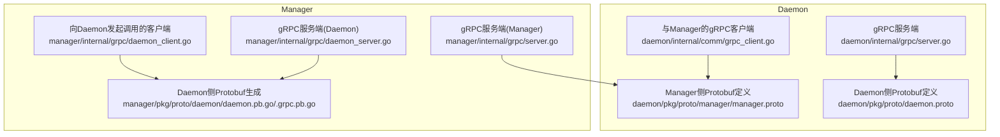
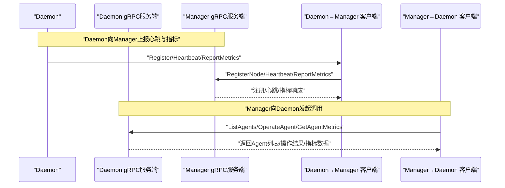
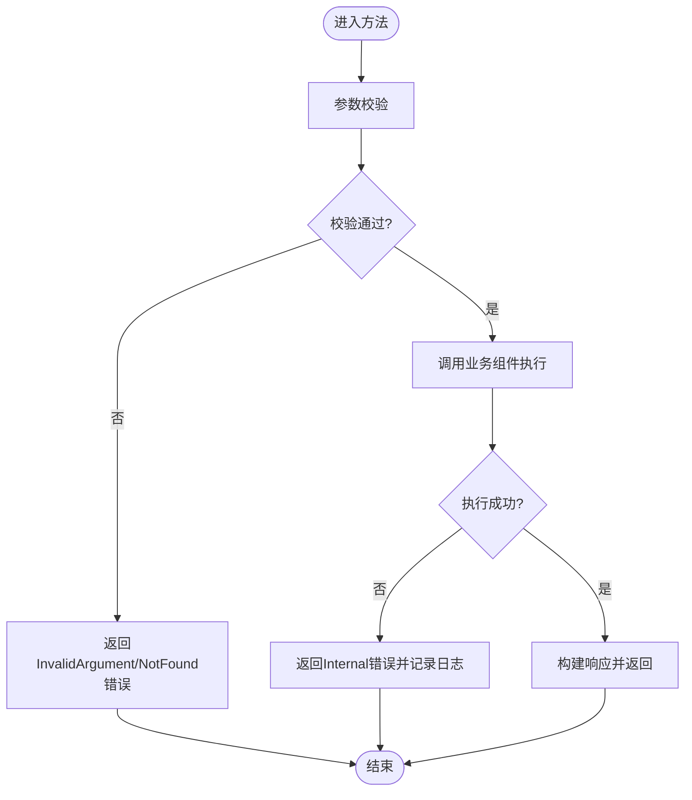
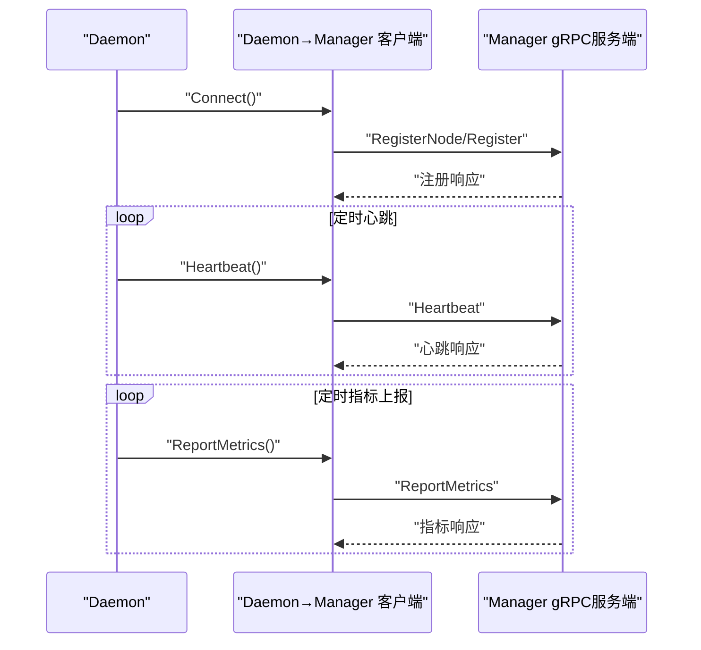
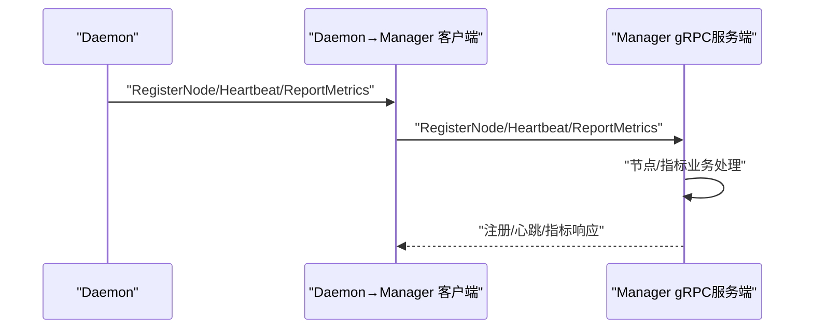
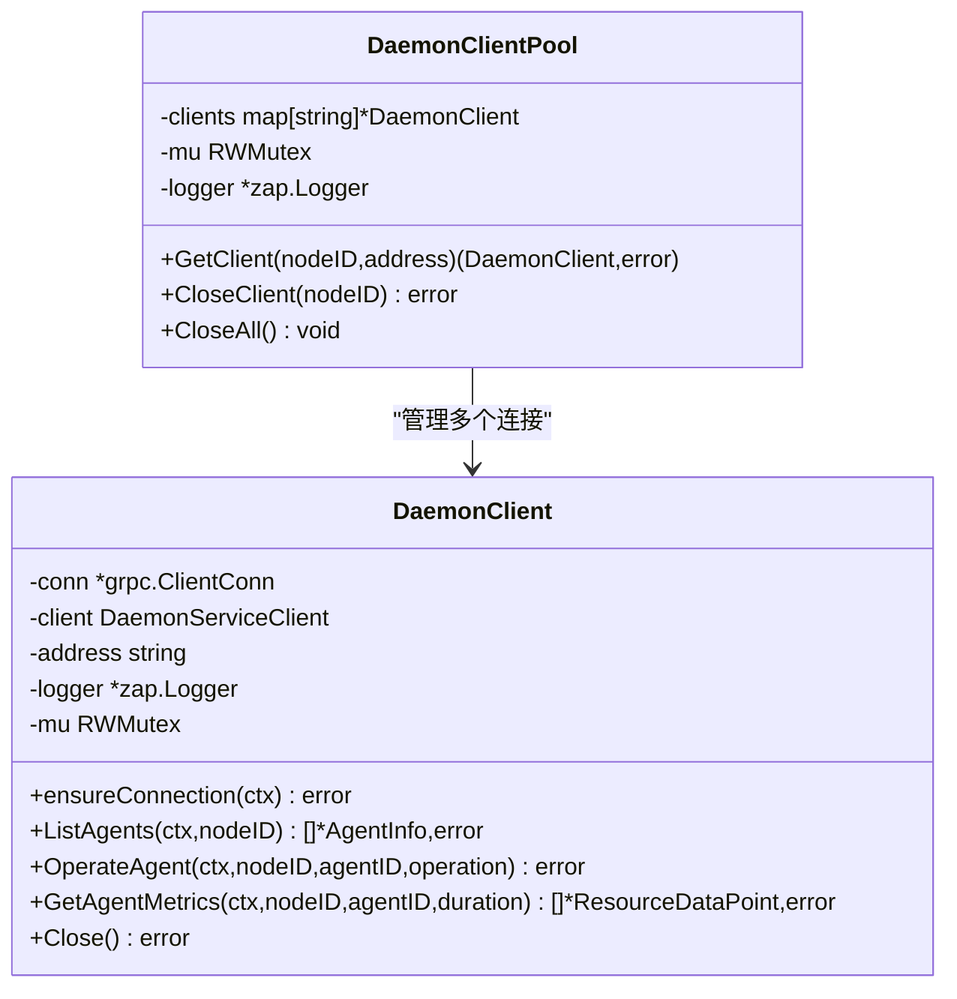
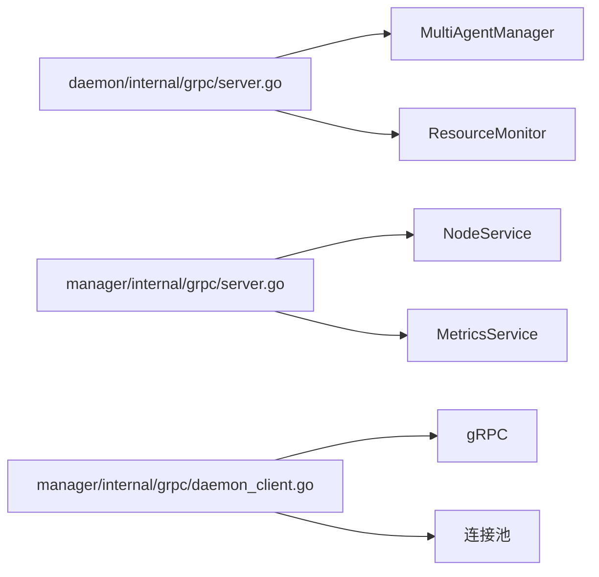

# gRPC服务层

<cite>
**本文引用的文件**
- [daemon/pkg/proto/manager/manager.proto](file://daemon/pkg/proto/manager/manager.proto)
- [daemon/pkg/proto/daemon.proto](file://daemon/pkg/proto/daemon.proto)
- [manager/pkg/proto/daemon/daemon.pb.go](file://manager/pkg/proto/daemon/daemon.pb.go)
- [manager/pkg/proto/daemon/daemon_grpc.pb.go](file://manager/pkg/proto/daemon/daemon_grpc.pb.go)
- [daemon/internal/grpc/server.go](file://daemon/internal/grpc/server.go)
- [manager/internal/grpc/server.go](file://manager/internal/grpc/server.go)
- [daemon/internal/comm/grpc_client.go](file://daemon/internal/comm/grpc_client.go)
- [manager/internal/grpc/daemon_client.go](file://manager/internal/grpc/daemon_client.go)
- [manager/internal/grpc/daemon_server.go](file://manager/internal/grpc/daemon_server.go)
- [manager/internal/grpc/errors.go](file://manager/internal/grpc/errors.go)
- [daemon/configs/daemon.yaml](file://daemon/configs/daemon.yaml)
- [manager/configs/manager.yaml](file://manager/configs/manager.yaml)
- [daemon/test/integration/grpc_integration_test.go](file://daemon/test/integration/grpc_integration_test.go)
- [docs/api/Manager_API.md](file://docs/api/Manager_API.md)
- [docs/设计文档_03_Manager模块.md](file://docs/设计文档_03_Manager模块.md)
</cite>

## 目录
1. [简介](#简介)
2. [项目结构](#项目结构)
3. [核心组件](#核心组件)
4. [架构总览](#架构总览)
5. [详细组件分析](#详细组件分析)
6. [依赖关系分析](#依赖关系分析)
7. [性能与安全](#性能与安全)
8. [故障排查指南](#故障排查指南)
9. [结论](#结论)
10. [附录](#附录)

## 简介
本文件聚焦于gRPC服务层，系统化梳理Daemon与Manager之间的双向通信机制，包括：
- Daemon向Manager的心跳、状态上报与指标上报流程
- Manager对Daemon的配置查询与任务指令下发能力
- 服务端流式RPC在实时监控场景的应用现状与扩展建议
- 错误处理与状态码映射策略
- protobuf消息格式设计与版本兼容性考量
- 高并发连接的性能优化与安全配置（TLS）

## 项目结构
围绕gRPC服务层的关键文件分布如下：
- Daemon侧
  - gRPC服务端实现：daemon/internal/grpc/server.go
  - 与Manager交互的gRPC客户端：daemon/internal/comm/grpc_client.go
  - Protobuf定义：daemon/pkg/proto/manager/manager.proto、daemon/pkg/proto/daemon.proto
- Manager侧
  - gRPC服务端实现：manager/internal/grpc/server.go
  - gRPC客户端（向Daemon发起调用）：manager/internal/grpc/daemon_client.go
  - 与Daemon交互的服务端：manager/internal/grpc/daemon_server.go
  - 错误映射工具：manager/internal/grpc/errors.go
  - Protobuf生成文件：manager/pkg/proto/daemon/daemon.pb.go、daemon_grpc.pb.go
- 配置与文档
  - Daemon配置：daemon/configs/daemon.yaml
  - Manager配置：manager/configs/manager.yaml
  - API文档：docs/api/Manager_API.md
  - 设计文档：docs/设计文档_03_Manager模块.md

图表来源
- [daemon/internal/grpc/server.go](file://daemon/internal/grpc/server.go#L1-L255)
- [daemon/internal/comm/grpc_client.go](file://daemon/internal/comm/grpc_client.go#L1-L253)
- [manager/internal/grpc/server.go](file://manager/internal/grpc/server.go#L1-L145)
- [manager/internal/grpc/daemon_client.go](file://manager/internal/grpc/daemon_client.go#L1-L398)
- [manager/internal/grpc/daemon_server.go](file://manager/internal/grpc/daemon_server.go#L1-L70)
- [daemon/pkg/proto/manager/manager.proto](file://daemon/pkg/proto/manager/manager.proto#L1-L68)
- [daemon/pkg/proto/daemon.proto](file://daemon/pkg/proto/daemon.proto#L1-L183)
- [manager/pkg/proto/daemon/daemon.pb.go](file://manager/pkg/proto/daemon/daemon.pb.go#L1-L300)
- [manager/pkg/proto/daemon/daemon_grpc.pb.go](file://manager/pkg/proto/daemon/daemon_grpc.pb.go#L1-L300)

章节来源
- [daemon/internal/grpc/server.go](file://daemon/internal/grpc/server.go#L1-L255)
- [manager/internal/grpc/server.go](file://manager/internal/grpc/server.go#L1-L145)
- [daemon/internal/comm/grpc_client.go](file://daemon/internal/comm/grpc_client.go#L1-L253)
- [manager/internal/grpc/daemon_client.go](file://manager/internal/grpc/daemon_client.go#L1-L398)
- [manager/internal/grpc/daemon_server.go](file://manager/internal/grpc/daemon_server.go#L1-L70)
- [daemon/pkg/proto/manager/manager.proto](file://daemon/pkg/proto/manager/manager.proto#L1-L68)
- [daemon/pkg/proto/daemon.proto](file://daemon/pkg/proto/daemon.proto#L1-L183)
- [manager/pkg/proto/daemon/daemon.pb.go](file://manager/pkg/proto/daemon/daemon.pb.go#L1-L300)
- [manager/pkg/proto/daemon/daemon_grpc.pb.go](file://manager/pkg/proto/daemon/daemon_grpc.pb.go#L1-L300)

## 核心组件
- Daemon gRPC服务端
  - 提供列举Agent、操作Agent、获取Agent指标、同步Agent状态等能力
  - 通过内部组件（MultiAgentManager、ResourceMonitor）完成具体业务
- Daemon与Manager的gRPC客户端
  - 负责注册节点、发送心跳、上报指标、拉取配置、推送更新等
  - 支持TLS与KeepAlive配置
- Manager gRPC服务端
  - 接收Daemon的心跳与指标上报，持久化指标
  - 提供节点注册、心跳处理、指标入库等服务
- Manager向Daemon发起调用的客户端
  - 提供连接池、重连、超时控制与错误映射
- 错误处理与状态码映射
  - 将gRPC状态码映射为业务错误类型，便于上层统一处理

章节来源
- [daemon/internal/grpc/server.go](file://daemon/internal/grpc/server.go#L1-L255)
- [daemon/internal/comm/grpc_client.go](file://daemon/internal/comm/grpc_client.go#L1-L253)
- [manager/internal/grpc/server.go](file://manager/internal/grpc/server.go#L1-L145)
- [manager/internal/grpc/daemon_client.go](file://manager/internal/grpc/daemon_client.go#L1-L398)
- [manager/internal/grpc/errors.go](file://manager/internal/grpc/errors.go#L1-L49)

## 架构总览
Daemon与Manager之间采用双向gRPC通信：
- Daemon主动向Manager上报心跳与指标，并拉取配置与更新
- Manager可向Daemon下发指令（如列举Agent、操作Agent、获取指标等）
- 服务端流式RPC在当前实现中未直接使用，但具备扩展为流式推送的能力

图表来源
- [daemon/internal/comm/grpc_client.go](file://daemon/internal/comm/grpc_client.go#L1-L253)
- [manager/internal/grpc/server.go](file://manager/internal/grpc/server.go#L1-L145)
- [manager/internal/grpc/daemon_client.go](file://manager/internal/grpc/daemon_client.go#L1-L398)
- [daemon/internal/grpc/server.go](file://daemon/internal/grpc/server.go#L1-L255)

## 详细组件分析

### Daemon gRPC服务端（接收与处理）
- 主要方法
  - 列举Agent：ListAgents
  - 操作Agent：OperateAgent（start/stop/restart）
  - 获取Agent指标：GetAgentMetrics
  - 同步Agent状态：SyncAgentStates
- 处理要点
  - 参数校验与错误码映射（InvalidArgument/NotFound/Internal）
  - 与MultiAgentManager、ResourceMonitor协作
  - 日志记录与返回结构体字段填充

图表来源
- [daemon/internal/grpc/server.go](file://daemon/internal/grpc/server.go#L69-L124)
- [daemon/internal/grpc/server.go](file://daemon/internal/grpc/server.go#L126-L170)
- [daemon/internal/grpc/server.go](file://daemon/internal/grpc/server.go#L172-L211)

章节来源
- [daemon/internal/grpc/server.go](file://daemon/internal/grpc/server.go#L37-L124)
- [daemon/internal/grpc/server.go](file://daemon/internal/grpc/server.go#L126-L170)
- [daemon/internal/grpc/server.go](file://daemon/internal/grpc/server.go#L172-L211)

### Daemon与Manager的gRPC客户端（心跳与指标上报）
- 连接建立
  - TLS配置（证书、CA、最小TLS版本）
  - KeepAlive参数设置
  - 不使用TLS时的降级策略
- 心跳上报
  - 构造HeartbeatRequest并调用Heartbeat
  - 失败时返回错误并记录日志
- 指标上报
  - 将指标转换为MetricData并批量上报
  - 非数值字段过滤与日志提示
- 节点注册
  - RegisterNode请求构建与响应处理

图表来源
- [daemon/internal/comm/grpc_client.go](file://daemon/internal/comm/grpc_client.go#L41-L93)
- [daemon/internal/comm/grpc_client.go](file://daemon/internal/comm/grpc_client.go#L144-L175)
- [daemon/internal/comm/grpc_client.go](file://daemon/internal/comm/grpc_client.go#L177-L247)
- [manager/internal/grpc/server.go](file://manager/internal/grpc/server.go#L34-L72)
- [manager/internal/grpc/server.go](file://manager/internal/grpc/server.go#L74-L97)
- [manager/internal/grpc/server.go](file://manager/internal/grpc/server.go#L99-L144)

章节来源
- [daemon/internal/comm/grpc_client.go](file://daemon/internal/comm/grpc_client.go#L41-L93)
- [daemon/internal/comm/grpc_client.go](file://daemon/internal/comm/grpc_client.go#L144-L175)
- [daemon/internal/comm/grpc_client.go](file://daemon/internal/comm/grpc_client.go#L177-L247)
- [manager/internal/grpc/server.go](file://manager/internal/grpc/server.go#L34-L72)
- [manager/internal/grpc/server.go](file://manager/internal/grpc/server.go#L74-L97)
- [manager/internal/grpc/server.go](file://manager/internal/grpc/server.go#L99-L144)

### Manager gRPC服务端（接收Daemon上报）
- 节点注册：RegisterNode
- 心跳处理：Heartbeat
- 指标入库：ReportMetrics（批量创建并持久化）
- 日志与错误处理：统一记录并返回响应

图表来源
- [manager/internal/grpc/server.go](file://manager/internal/grpc/server.go#L34-L72)
- [manager/internal/grpc/server.go](file://manager/internal/grpc/server.go#L74-L97)
- [manager/internal/grpc/server.go](file://manager/internal/grpc/server.go#L99-L144)

章节来源
- [manager/internal/grpc/server.go](file://manager/internal/grpc/server.go#L34-L144)

### Manager向Daemon发起调用的客户端（连接池与重连）
- 连接池：按nodeID维护连接，支持获取、关闭与关闭全部
- 重连机制：检测连接状态，必要时重建连接
- 超时控制：统一默认超时时间
- 错误映射：将gRPC状态码映射为业务错误类型

图表来源
- [manager/internal/grpc/daemon_client.go](file://manager/internal/grpc/daemon_client.go#L1-L398)

章节来源
- [manager/internal/grpc/daemon_client.go](file://manager/internal/grpc/daemon_client.go#L1-L398)
- [manager/internal/grpc/errors.go](file://manager/internal/grpc/errors.go#L1-L49)

### Manager侧Daemon服务端（接收状态同步）
- SyncAgentStates：接收Daemon上报的Agent状态并调用AgentService进行同步
- 参数校验与日志记录
- 成功/失败响应

章节来源
- [manager/internal/grpc/daemon_server.go](file://manager/internal/grpc/daemon_server.go#L1-L70)

### Protobuf消息格式与版本兼容性
- Daemon与Manager的Protobuf定义
  - Manager侧：manager/pkg/proto/daemon/daemon.pb.go、daemon_grpc.pb.go
  - Daemon侧：daemon/pkg/proto/daemon.proto
  - Manager与Daemon的ManagerService定义：daemon/pkg/proto/manager/manager.proto
- 版本兼容性建议
  - 字段新增遵循向后兼容原则（新增可选字段、避免删除或重命名）
  - 数值类型与字符串类型保持一致，避免破坏序列化
  - 通过独立的manager.proto定义与daemon.proto解耦，便于双方演进

章节来源
- [manager/pkg/proto/daemon/daemon.pb.go](file://manager/pkg/proto/daemon/daemon.pb.go#L1-L300)
- [manager/pkg/proto/daemon/daemon_grpc.pb.go](file://manager/pkg/proto/daemon/daemon_grpc.pb.go#L1-L300)
- [daemon/pkg/proto/daemon.proto](file://daemon/pkg/proto/daemon.proto#L1-L183)
- [daemon/pkg/proto/manager/manager.proto](file://daemon/pkg/proto/manager/manager.proto#L1-L68)

### 服务端流式RPC（实时监控扩展）
- 当前实现
  - Manager与Daemon的gRPC方法均为Unary RPC
  - 未直接使用服务端流式推送
- 扩展建议
  - 在DaemonService中增加SubscribeUpdates方法，返回UpdateEvent流
  - Manager侧实现订阅逻辑，按需推送版本更新、配置变更等事件
  - 结合KeepAlive与TLS保障长连接稳定性与安全性

章节来源
- [docs/设计文档_03_Manager模块.md](file://docs/设计文档_03_Manager模块.md#L1194-L1311)

## 依赖关系分析
- 组件耦合
  - Daemon gRPC服务端依赖MultiAgentManager与ResourceMonitor
  - Manager gRPC服务端依赖NodeService与MetricsService
  - Manager向Daemon的客户端依赖gRPC连接与连接池
- 外部依赖
  - gRPC、TLS、KeepAlive
  - 日志库zap
- 潜在循环依赖
  - 通过接口与生成的pb.go文件避免直接循环导入

图表来源
- [daemon/internal/grpc/server.go](file://daemon/internal/grpc/server.go#L1-L255)
- [manager/internal/grpc/server.go](file://manager/internal/grpc/server.go#L1-L145)
- [manager/internal/grpc/daemon_client.go](file://manager/internal/grpc/daemon_client.go#L1-L398)

章节来源
- [daemon/internal/grpc/server.go](file://daemon/internal/grpc/server.go#L1-L255)
- [manager/internal/grpc/server.go](file://manager/internal/grpc/server.go#L1-L145)
- [manager/internal/grpc/daemon_client.go](file://manager/internal/grpc/daemon_client.go#L1-L398)

## 性能与安全
- 连接复用与重连
  - Manager侧使用连接池按nodeID管理连接，减少重复握手
  - 连接状态检测与自动重连，降低瞬断影响
- KeepAlive与超时
  - 设置合理的KeepAlive参数，维持长连接稳定
  - 统一默认超时时间，避免阻塞
- 压缩与序列化
  - 可结合gRPC压缩选项（如gzip）降低带宽占用（需评估CPU开销）
  - 保持Protobuf字段紧凑，避免冗余数据
- 安全配置（TLS）
  - Daemon与Manager均支持TLS配置
  - 生产环境启用TLS，使用强密码套件与最小TLS版本
  - 证书与CA文件路径配置在各自配置文件中

章节来源
- [manager/internal/grpc/daemon_client.go](file://manager/internal/grpc/daemon_client.go#L1-L120)
- [daemon/internal/comm/grpc_client.go](file://daemon/internal/comm/grpc_client.go#L41-L93)
- [daemon/configs/daemon.yaml](file://daemon/configs/daemon.yaml#L1-L63)
- [manager/configs/manager.yaml](file://manager/configs/manager.yaml#L1-L52)

## 故障排查指南
- 常见错误与定位
  - InvalidArgument：请求参数缺失或非法（如空AgentID、无效操作）
  - NotFound：目标不存在（如Agent未注册）
  - Internal：内部错误（如操作失败、数据库异常）
  - Unavailable/DeadlineExceeded：连接失败或超时
- 错误映射
  - Manager侧将gRPC状态码映射为业务错误类型，便于统一处理
- 日志与追踪
  - 服务端与客户端均记录关键事件与错误信息
  - 建议在关键路径添加上下文traceID以便跨服务追踪

章节来源
- [manager/internal/grpc/errors.go](file://manager/internal/grpc/errors.go#L1-L49)
- [daemon/internal/grpc/server.go](file://daemon/internal/grpc/server.go#L69-L124)
- [manager/internal/grpc/daemon_client.go](file://manager/internal/grpc/daemon_client.go#L120-L210)

## 结论
本gRPC服务层实现了Daemon与Manager之间的高效、可靠双向通信：
- 心跳与指标上报流程清晰，错误处理与日志完善
- Manager侧具备完善的指标入库与节点管理能力
- 连接池与重连机制提升了高并发场景下的稳定性
- TLS与KeepAlive配置为生产环境提供了安全保障
- 服务端流式RPC尚未启用，但具备扩展为实时推送的基础

## 附录
- 实际代码示例路径
  - 心跳接收处理逻辑：[manager/internal/grpc/server.go](file://manager/internal/grpc/server.go#L74-L97)
  - 指标数据入库流程：[manager/internal/grpc/server.go](file://manager/internal/grpc/server.go#L99-L144)
  - 服务端流式推送实现（扩展）：[docs/设计文档_03_Manager模块.md](file://docs/设计文档_03_Manager模块.md#L1194-L1311)
  - gRPC通信时序图：见“架构总览”与“Daemon与Manager的gRPC客户端（心跳与指标上报）”
- API参考
  - Manager API文档（心跳与指标）：[docs/api/Manager_API.md](file://docs/api/Manager_API.md#L1317-L1383)