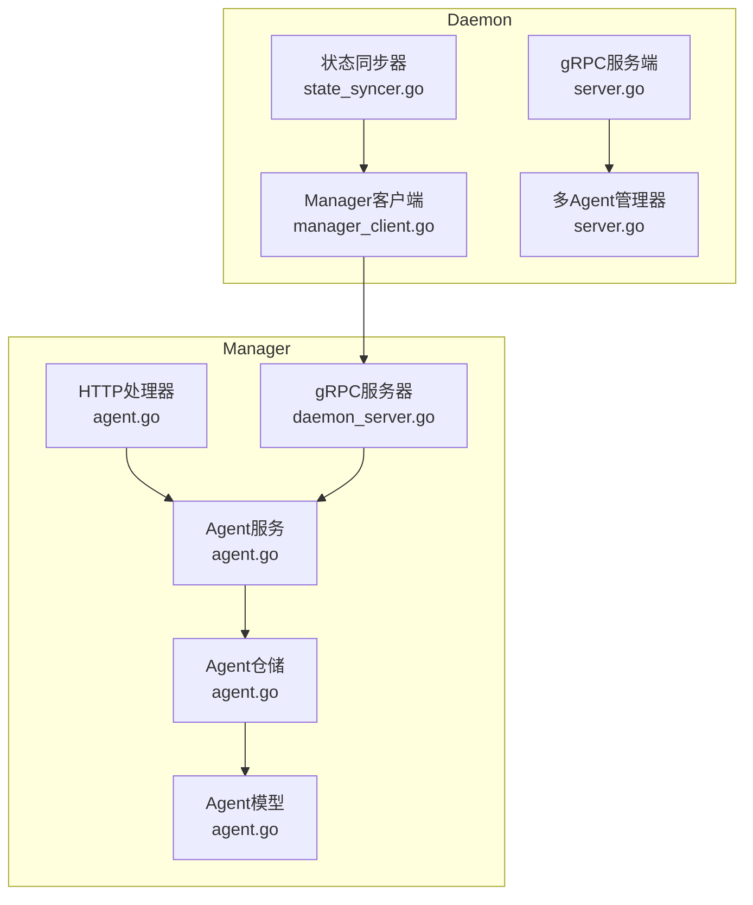
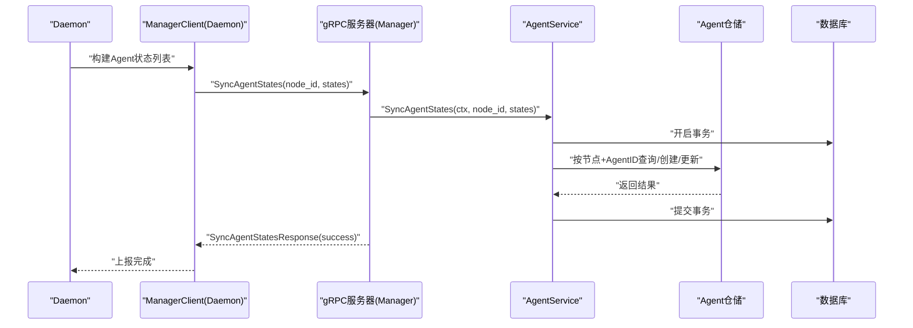
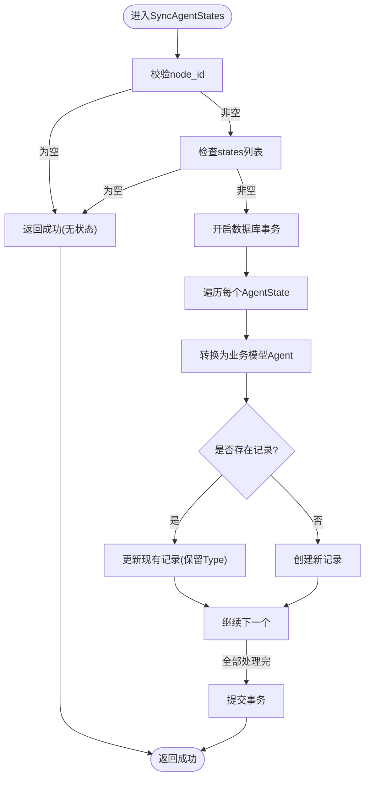
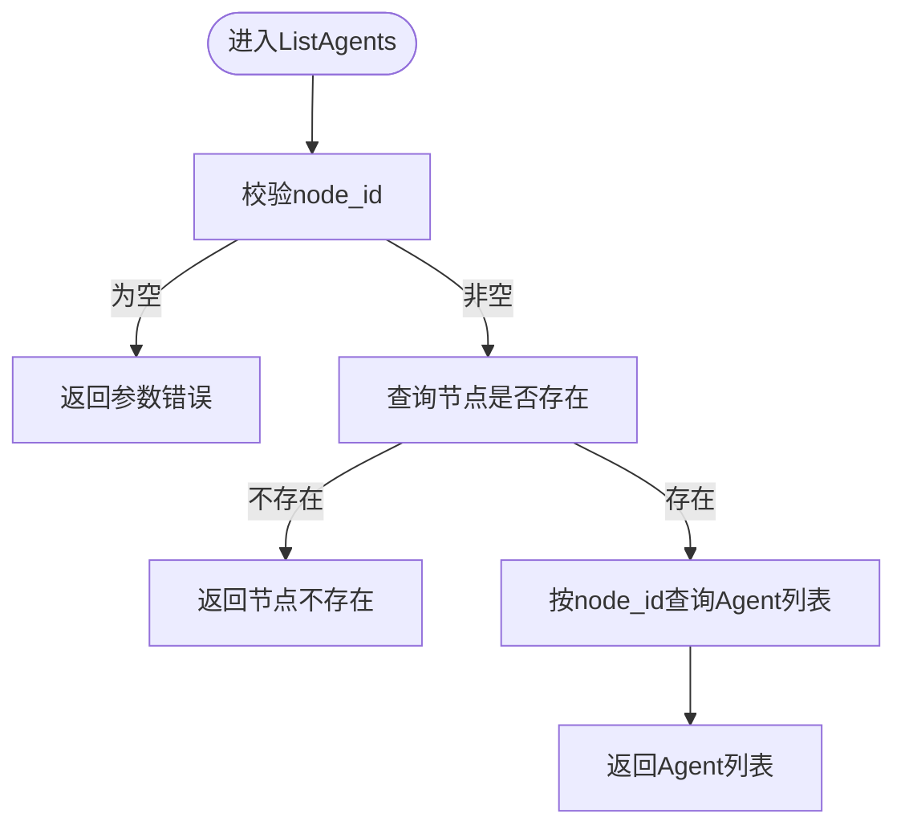
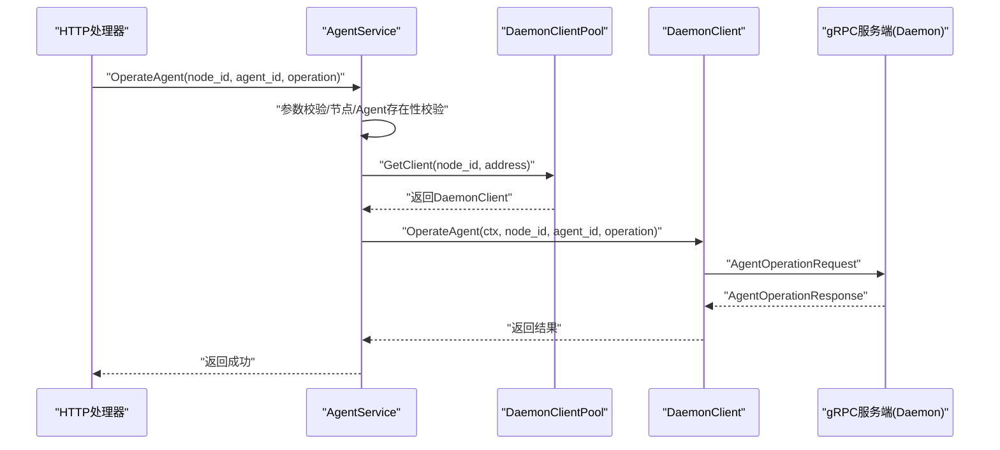
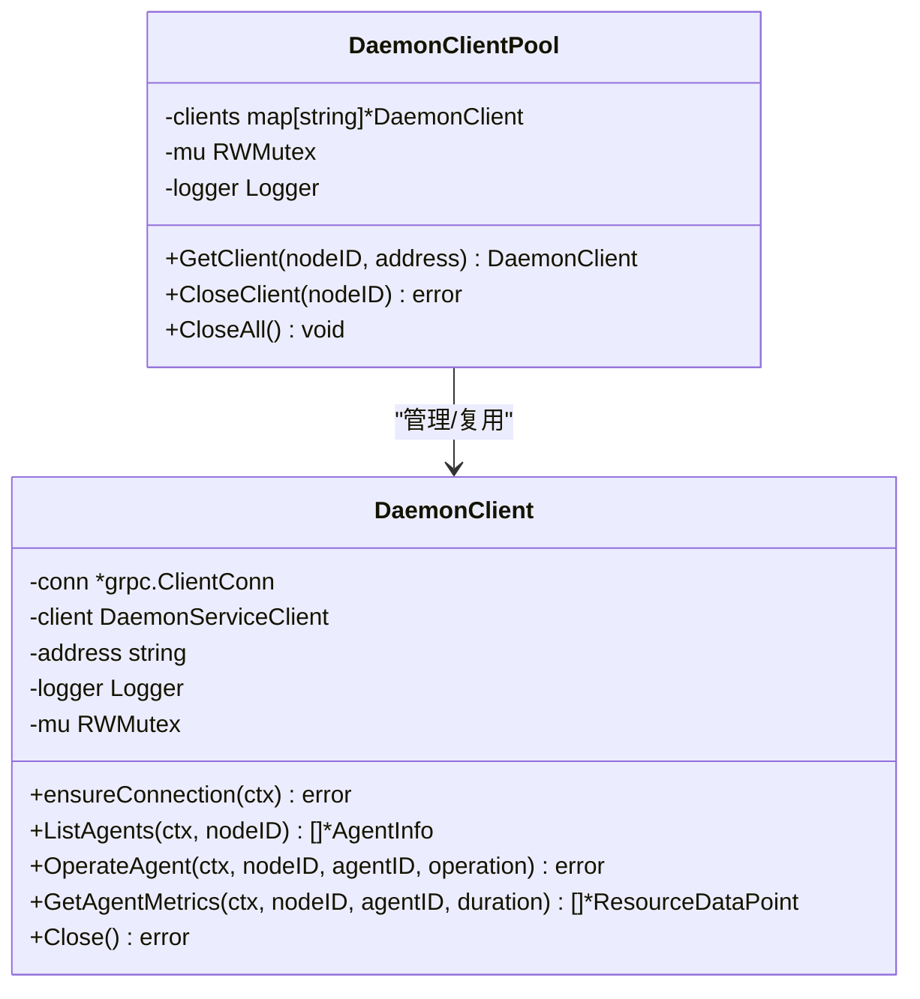
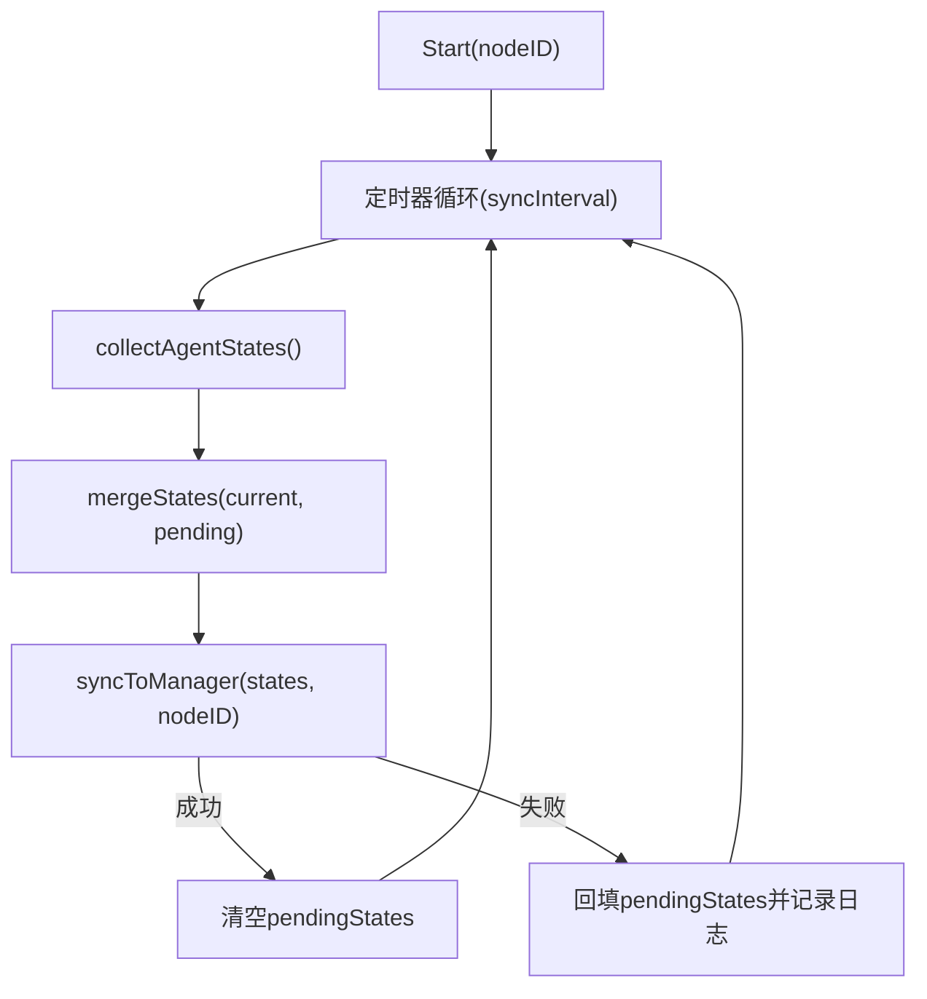
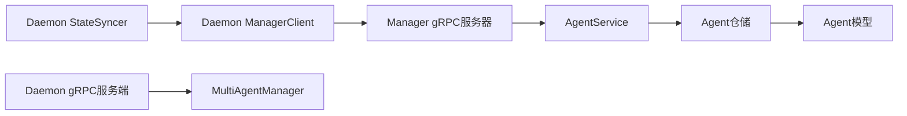

# Agent服务

<cite>
**本文引用的文件**
- [agent.go](file://manager/internal/service/agent.go)
- [agent.go](file://manager/internal/repository/agent.go)
- [agent.go](file://manager/internal/handler/agent.go)
- [daemon_client.go](file://manager/internal/grpc/daemon_client.go)
- [daemon_server.go](file://manager/internal/grpc/daemon_server.go)
- [state_syncer.go](file://daemon/internal/agent/state_syncer.go)
- [manager_client.go](file://daemon/internal/grpc/manager_client.go)
- [server.go](file://daemon/internal/grpc/server.go)
- [agent.go](file://manager/internal/model/agent.go)
- [daemon.proto](file://manager/pkg/proto/daemon/daemon.proto)
- [daemon.pb.go](file://manager/pkg/proto/daemon/daemon.pb.go)
- [daemon.pb.go](file://daemon/pkg/proto/daemon.pb.go)
</cite>

## 目录
1. [简介](#简介)
2. [项目结构](#项目结构)
3. [核心组件](#核心组件)
4. [架构总览](#架构总览)
5. [详细组件分析](#详细组件分析)
6. [依赖关系分析](#依赖关系分析)
7. [性能考量](#性能考量)
8. [故障排查指南](#故障排查指南)
9. [结论](#结论)

## 简介
本文件聚焦于Agent服务的生命周期管理与远程操作能力，围绕以下目标展开：
- 解析SyncAgentStates方法如何通过gRPC从Daemon上报的Agent状态进行同步，并使用数据库事务保证一致性。
- 说明ListAgents方法的节点关联查询实现思路与边界条件。
- 阐述OperateAgent方法如何通过DaemonClientPool连接池调用远程Daemon服务执行启动/停止/重启操作，包含连接管理、错误处理与超时控制。
- 解释GetAgentLogs方法的设计意图与当前实现状态。
- 提供Agent状态同步序列图，展示Manager与Daemon之间的通信流程。
- 针对大规模Agent状态同步的性能瓶颈与连接池配置优化给出建议。

## 项目结构
Agent服务横跨三个子系统：
- Manager侧：提供HTTP API入口、gRPC服务端接收Daemon上报、封装Agent业务逻辑与数据持久化。
- Daemon侧：负责Agent进程生命周期管理、状态采集与上报、指标采集。
- 两者通过gRPC协议交互，使用统一的protobuf定义进行消息编解码。

图表来源
- [agent.go](file://manager/internal/handler/agent.go#L1-L161)
- [agent.go](file://manager/internal/service/agent.go#L1-L298)
- [agent.go](file://manager/internal/repository/agent.go#L1-L138)
- [agent.go](file://manager/internal/model/agent.go#L1-L53)
- [daemon_server.go](file://manager/internal/grpc/daemon_server.go#L1-L70)
- [state_syncer.go](file://daemon/internal/agent/state_syncer.go#L1-L282)
- [manager_client.go](file://daemon/internal/grpc/manager_client.go#L1-L155)
- [server.go](file://daemon/internal/grpc/server.go#L1-L255)

章节来源
- [agent.go](file://manager/internal/handler/agent.go#L1-L161)
- [agent.go](file://manager/internal/service/agent.go#L1-L298)
- [agent.go](file://manager/internal/repository/agent.go#L1-L138)
- [agent.go](file://manager/internal/model/agent.go#L1-L53)
- [daemon_server.go](file://manager/internal/grpc/daemon_server.go#L1-L70)
- [state_syncer.go](file://daemon/internal/agent/state_syncer.go#L1-L282)
- [manager_client.go](file://daemon/internal/grpc/manager_client.go#L1-L155)
- [server.go](file://daemon/internal/grpc/server.go#L1-L255)

## 核心组件
- AgentService：封装Agent状态同步、节点下Agent列表查询、远程操作、日志获取等核心业务。
- DaemonClientPool：基于节点ID维护gRPC连接，支持连接复用、重连与关闭。
- DaemonClient：单节点gRPC客户端，封装连接保活、超时控制与错误转换。
- StateSyncer：Daemon侧状态采集与上报器，周期性收集Agent状态并上报Manager。
- ManagerClient：Daemon侧连接Manager的gRPC客户端，负责状态上报。
- gRPC协议：统一的Agent状态、操作、指标等消息定义。

章节来源
- [agent.go](file://manager/internal/service/agent.go#L1-L298)
- [daemon_client.go](file://manager/internal/grpc/daemon_client.go#L1-L398)
- [state_syncer.go](file://daemon/internal/agent/state_syncer.go#L1-L282)
- [manager_client.go](file://daemon/internal/grpc/manager_client.go#L1-L155)
- [daemon.proto](file://manager/pkg/proto/daemon/daemon.proto#L113-L183)
- [daemon.pb.go](file://manager/pkg/proto/daemon/daemon.pb.go#L1199-L1394)
- [daemon.pb.go](file://daemon/pkg/proto/daemon.pb.go#L1139-L1241)

## 架构总览
Manager与Daemon通过gRPC双向协作：
- Daemon周期性收集Agent状态并通过ManagerClient上报至Manager的gRPC服务器。
- Manager的gRPC服务器接收状态并调用AgentService进行数据库事务级同步。
- Manager提供HTTP API，Handler调用AgentService执行远程操作与查询。

图表来源
- [state_syncer.go](file://daemon/internal/agent/state_syncer.go#L188-L224)
- [manager_client.go](file://daemon/internal/grpc/manager_client.go#L102-L154)
- [daemon_server.go](file://manager/internal/grpc/daemon_server.go#L32-L69)
- [agent.go](file://manager/internal/service/agent.go#L48-L139)
- [agent.go](file://manager/internal/repository/agent.go#L60-L118)

## 详细组件分析

### SyncAgentStates：状态同步与事务一致性
- 输入校验：要求node_id非空；空states列表直接返回成功。
- 事务封装：使用数据库事务包裹批量插入/更新，确保原子性。
- 数据转换：将protobuf AgentState转换为业务模型Agent，填充NodeID、AgentID、Status、PID、LastHeartbeat、LastSyncTime等字段。
- 历史记录处理：若记录已存在，保留Type（避免覆盖首次创建时的类型）；否则创建新记录。
- 错误策略：单条失败不影响整体事务提交，但会记录警告并继续处理后续条目；最终统计成功/失败数量。

图表来源
- [agent.go](file://manager/internal/service/agent.go#L48-L139)
- [agent.go](file://manager/internal/repository/agent.go#L60-L118)

章节来源
- [agent.go](file://manager/internal/service/agent.go#L48-L139)
- [agent.go](file://manager/internal/repository/agent.go#L60-L118)

### ListAgents：节点关联查询实现
- 参数校验：node_id必填。
- 节点存在性校验：先查询节点是否存在，不存在返回“节点不存在”。
- 数据查询：按node_id查询agents表，返回Agent列表。
- 返回：记录日志并返回结果。

图表来源
- [agent.go](file://manager/internal/service/agent.go#L141-L173)
- [agent.go](file://manager/internal/repository/agent.go#L112-L124)

章节来源
- [agent.go](file://manager/internal/service/agent.go#L141-L173)
- [agent.go](file://manager/internal/repository/agent.go#L112-L124)

### OperateAgent：远程操作（启动/停止/重启）
- 参数校验：node_id、agent_id、operation均必填；operation限定为start/stop/restart。
- 节点与Agent存在性校验：查询节点与Agent是否存在。
- 地址构造：基于node.IP与默认端口拼接Daemon地址。
- 连接池获取：DaemonClientPool按nodeID获取/创建客户端。
- 超时控制：为每次gRPC调用设置默认超时。
- 错误处理：捕获gRPC错误并转换为API错误；记录详细上下文日志。
- 成功返回：记录操作成功日志。

图表来源
- [agent.go](file://manager/internal/handler/agent.go#L62-L103)
- [agent.go](file://manager/internal/service/agent.go#L175-L252)
- [daemon_client.go](file://manager/internal/grpc/daemon_client.go#L167-L237)
- [server.go](file://daemon/internal/grpc/server.go#L69-L124)

章节来源
- [agent.go](file://manager/internal/handler/agent.go#L62-L103)
- [agent.go](file://manager/internal/service/agent.go#L175-L252)
- [daemon_client.go](file://manager/internal/grpc/daemon_client.go#L167-L237)
- [server.go](file://daemon/internal/grpc/server.go#L69-L124)

### GetAgentLogs：设计意图与待实现状态
- 参数校验：node_id、agent_id必填；lines默认100，上限1000。
- 节点与Agent存在性校验：同上。
- 当前实现：返回“功能未实现”的内部错误，提示后续实现。
- 设计意图：提供从Daemon侧拉取Agent日志的能力，便于集中化日志检索与分析。

章节来源
- [agent.go](file://manager/internal/service/agent.go#L254-L298)
- [agent.go](file://manager/internal/handler/agent.go#L105-L160)

### DaemonClientPool：连接池设计与优化
- 并发安全：读写锁保护clients映射，支持高并发场景下的连接复用。
- 双重检查：获取写锁前先读锁快速命中已有连接，减少锁竞争。
- 重连机制：ensureConnection检测连接状态，必要时重建连接并更新client。
- 超时与保活：默认超时、keepalive参数配置，提升长连接稳定性。
- 关闭策略：支持按nodeID关闭、全量关闭，清理内存映射。

图表来源
- [daemon_client.go](file://manager/internal/grpc/daemon_client.go#L297-L398)
- [daemon_client.go](file://manager/internal/grpc/daemon_client.go#L74-L137)

章节来源
- [daemon_client.go](file://manager/internal/grpc/daemon_client.go#L297-L398)
- [daemon_client.go](file://manager/internal/grpc/daemon_client.go#L74-L137)

### Daemon状态同步器：周期上报与重试
- 状态采集：从MultiAgentManager获取Agent实例，结合元数据生成AgentState。
- 待同步合并：优先使用pendingStates中的最新状态，避免过期数据覆盖。
- 上报流程：使用ManagerClient调用Manager的SyncAgentStates，带超时控制。
- 重试策略：上报失败将状态回填pendingStates，等待下次周期重试。
- 生命周期：Start/Stop控制同步循环，支持取消与等待。

图表来源
- [state_syncer.go](file://daemon/internal/agent/state_syncer.go#L188-L224)
- [state_syncer.go](file://daemon/internal/agent/state_syncer.go#L226-L282)

章节来源
- [state_syncer.go](file://daemon/internal/agent/state_syncer.go#L188-L224)
- [state_syncer.go](file://daemon/internal/agent/state_syncer.go#L226-L282)

## 依赖关系分析
- Manager gRPC服务器：接收Daemon上报，调用AgentService执行状态同步。
- Daemon gRPC服务端：提供ListAgents、OperateAgent、GetAgentMetrics、SyncAgentStates等服务。
- Protobuf定义：统一的AgentState、AgentOperationRequest、AgentMetricsRequest等消息类型，确保双方兼容。
- 数据模型：Agent模型包含节点ID、AgentID、状态、PID、心跳时间、最后同步时间等字段，支撑状态同步与查询。

图表来源
- [daemon_server.go](file://manager/internal/grpc/daemon_server.go#L32-L69)
- [agent.go](file://manager/internal/service/agent.go#L48-L139)
- [agent.go](file://manager/internal/repository/agent.go#L60-L118)
- [state_syncer.go](file://daemon/internal/agent/state_syncer.go#L188-L224)
- [manager_client.go](file://daemon/internal/grpc/manager_client.go#L102-L154)
- [server.go](file://daemon/internal/grpc/server.go#L69-L124)

章节来源
- [daemon_server.go](file://manager/internal/grpc/daemon_server.go#L32-L69)
- [agent.go](file://manager/internal/service/agent.go#L48-L139)
- [agent.go](file://manager/internal/repository/agent.go#L60-L118)
- [state_syncer.go](file://daemon/internal/agent/state_syncer.go#L188-L224)
- [manager_client.go](file://daemon/internal/grpc/manager_client.go#L102-L154)
- [server.go](file://daemon/internal/grpc/server.go#L69-L124)

## 性能考量
- 大规模Agent状态同步的瓶颈
  - 单次事务批量写入：SyncAgentStates在事务中逐条处理，当states数量较大时，单事务耗时增加，可能影响吞吐。
  - 连接池复用：DaemonClientPool按nodeID复用连接，减少握手成本；但大量节点同时上报仍可能造成连接数膨胀。
  - 上报频率与合并：StateSyncer默认周期同步，pendingStates合并可减少抖动，但也会放大单次上报的数据量。
- 优化建议
  - 分批事务：将states分批提交，降低单事务压力；或采用批量Upsert策略（如支持）减少逐条更新开销。
  - 连接池容量控制：限制最大连接数，避免内存与FD耗尽；结合节点活跃度做动态调整。
  - 超时与重试：合理设置上报超时与重试间隔，避免瞬时网络抖动导致的堆积。
  - 压缩与限流：对上报数据进行压缩（如启用gRPC压缩），并在Manager端做速率限制，防止突发流量冲击数据库。
  - 数据库索引：确保agents表的复合索引（node_id, agent_id）高效命中，减少查询与更新成本。

[本节为通用性能讨论，不直接分析具体文件]

## 故障排查指南
- 连接问题
  - DaemonClient.ensureConnection会在连接断开/失败时尝试重建；若持续失败，检查Manager端gRPC服务是否可用、防火墙与证书配置。
  - DaemonClientPool.GetClient在并发场景下可能出现竞争，确认读写锁使用正确且无死锁。
- 超时与重试
  - Daemon上报超时默认较短，若网络不稳定，StateSyncer会将状态回填pendingStates并等待下次周期重试。
- 参数校验
  - Manager gRPC服务器与HTTP Handler均对node_id、agent_id、operation进行严格校验，非法参数会返回明确错误。
- 日志定位
  - 各组件均记录详细上下文日志（节点ID、AgentID、操作、错误信息），便于快速定位问题。

章节来源
- [daemon_client.go](file://manager/internal/grpc/daemon_client.go#L74-L137)
- [daemon_client.go](file://manager/internal/grpc/daemon_client.go#L167-L237)
- [daemon_server.go](file://manager/internal/grpc/daemon_server.go#L32-L69)
- [agent.go](file://manager/internal/handler/agent.go#L62-L103)
- [state_syncer.go](file://daemon/internal/agent/state_syncer.go#L188-L224)

## 结论
- SyncAgentStates通过gRPC与数据库事务实现了强一致的状态同步，适合中小规模场景；在大规模场景下建议引入分批事务与批量写策略。
- ListAgents提供简洁的节点关联查询，具备良好的扩展性。
- OperateAgent通过连接池与超时控制保障了远程操作的可靠性与可观测性。
- GetAgentLogs目前处于待实现阶段，后续可结合Daemon侧日志聚合能力提供统一查询入口。
- StateSyncer与ManagerClient配合，形成稳定的Daemon->Manager上报链路，具备重试与合并能力，适合异步、周期性的状态同步。