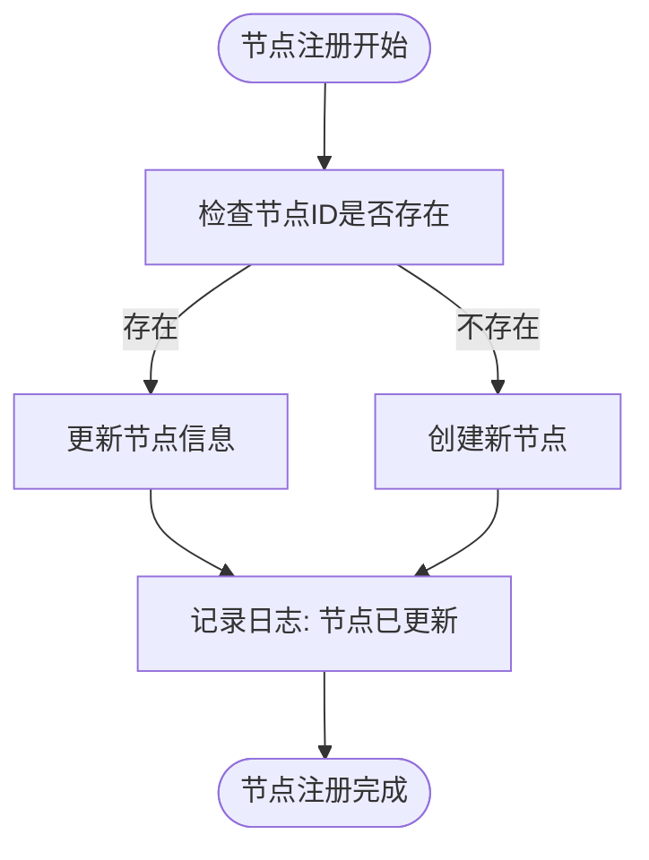
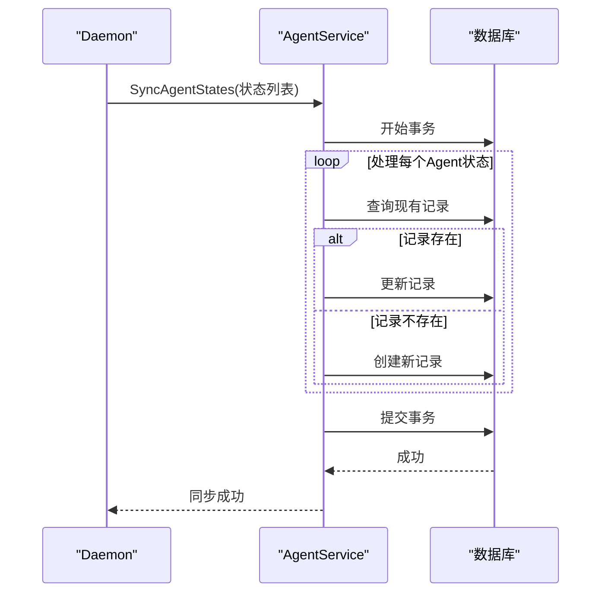
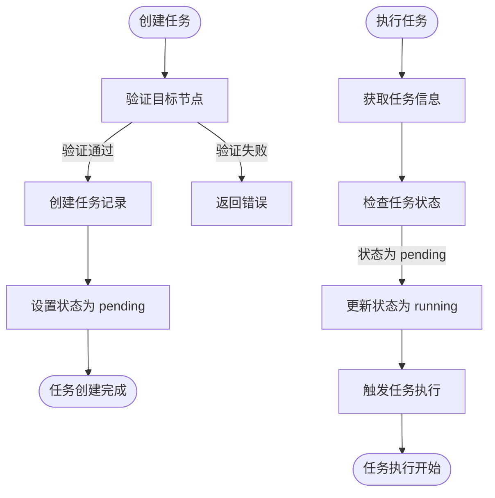
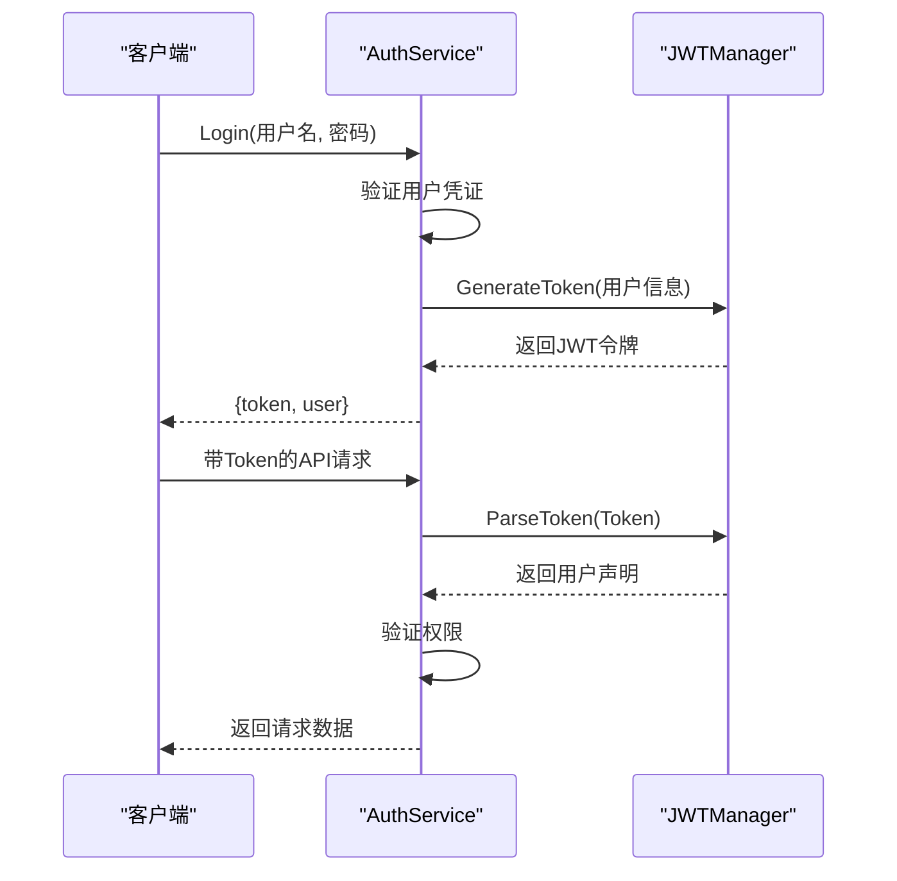
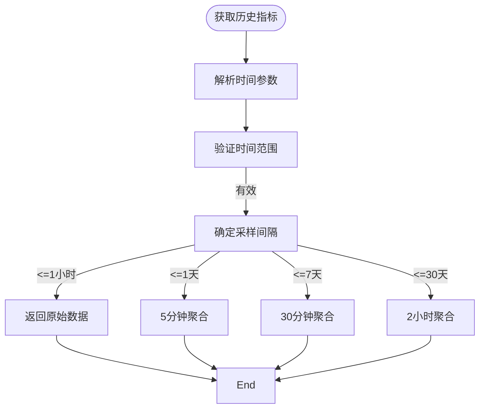
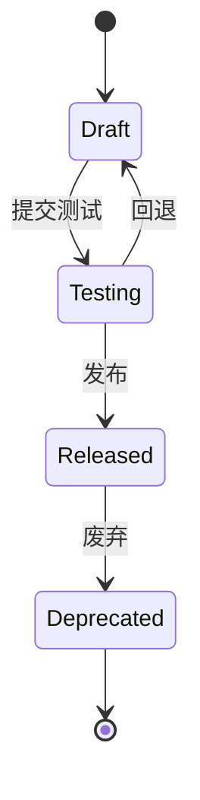
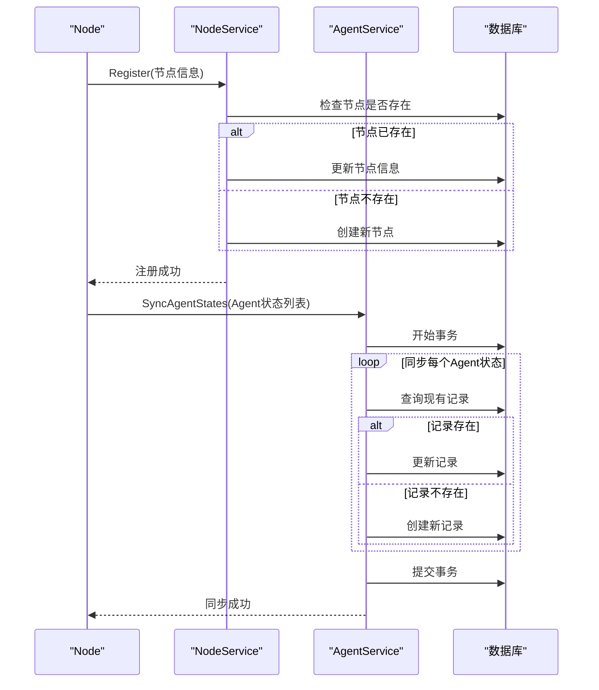

# 业务服务层

<cite>
**本文档引用的文件**   
- [node.go](file://manager/internal/service/node.go)
- [agent.go](file://manager/internal/service/agent.go)
- [task.go](file://manager/internal/service/task.go)
- [auth.go](file://manager/internal/service/auth.go)
- [metrics.go](file://manager/internal/service/metrics.go)
- [version.go](file://manager/internal/service/version.go)
- [node.go](file://manager/internal/model/node.go)
- [agent.go](file://manager/internal/model/agent.go)
- [task.go](file://manager/internal/model/task.go)
- [user.go](file://manager/internal/model/user.go)
- [metrics.go](file://manager/internal/model/metrics.go)
- [version.go](file://manager/internal/model/version.go)
- [auth.go](file://manager/internal/handler/auth.go)
- [node.go](file://manager/internal/handler/node.go)
- [agent.go](file://manager/internal/handler/agent.go)
- [metrics.go](file://manager/internal/handler/metrics.go)
</cite>

## 目录
1. [引言](#引言)
2. [核心服务概览](#核心服务概览)
3. [节点服务（NodeService）](#节点服务nodeservice)
4. [Agent服务（AgentService）](#agent服务agentservice)
5. [任务服务（TaskService）](#任务服务taskservice)
6. [认证服务（AuthService）](#认证服务authservice)
7. [监控服务（MetricsService）](#监控服务metricsservice)
8. [版本服务（VersionService）](#版本服务versionservice)
9. [服务间协作与调用序列](#服务间协作与调用序列)
10. [最佳实践指南](#最佳实践指南)
11. [结论](#结论)

## 引言
本技术文档旨在全面解析运维框架中的业务服务层，重点阐述各核心服务的领域逻辑、协作关系及实现细节。文档详细描述了NodeService如何管理节点生命周期，AgentService如何监控Agent状态，TaskService的任务调度机制，AuthService的认证授权流程，MetricsService的监控指标聚合，以及VersionService的版本管理与灰度发布逻辑。通过代码级分析和序列图，为开发者提供深入理解系统架构和实现原理的参考。

## 核心服务概览
业务服务层是运维框架的核心，负责处理所有业务逻辑和领域规则。该层由多个独立但相互协作的服务组成，每个服务专注于特定的业务领域。服务层位于数据访问层（Repository）和接口层（Handler）之间，通过定义清晰的接口与上下层交互，确保了系统的高内聚和低耦合。主要服务包括节点管理、Agent管理、任务调度、用户认证、监控指标和版本管理等。

## 节点服务（NodeService）

节点服务（NodeService）负责管理所有注册节点的全生命周期，包括注册、心跳、状态更新和离线检测等核心功能。

### 节点生命周期管理

NodeService通过`Register`方法处理节点注册。当节点首次启动时，会向Manager发送注册请求。服务首先检查该节点ID是否已存在，若存在则更新节点信息，否则创建新节点记录。注册成功后，节点进入"offline"状态，等待首次心跳。



**节点服务方法**
- `Register`: 注册或更新节点
- `GetByNodeID`: 根据节点ID获取节点信息
- `Update`: 更新节点信息
- `Delete`: 删除节点
- `List`: 获取节点列表
- `UpdateStatus`: 更新节点状态
- `Heartbeat`: 处理节点心跳
- `UpdateVersions`: 更新节点版本信息
- `CheckOfflineNodes`: 检查并标记离线节点

### 心跳与状态更新机制

心跳机制是维持节点在线状态的关键。节点通过定期调用`Heartbeat`方法来更新其最后心跳时间。服务在接收到心跳后，会检查节点的当前状态，如果节点之前处于"offline"状态，则将其状态更新为"online"。同时，服务会定期调用`CheckOfflineNodes`方法，扫描超过指定时间未发送心跳的节点，并将其状态标记为"offline"。

**节点服务核心逻辑**
- 节点注册时，若节点已存在则执行更新操作
- 心跳处理时，自动将离线节点状态更新为在线
- 定期检查离线节点，维护节点状态的准确性
- 提供基于状态、标签等条件的节点查询功能

**节点服务来源**
- [node.go](file://manager/internal/service/node.go#L1-L234)
- [node.go](file://manager/internal/model/node.go#L1-L68)

## Agent服务（AgentService）

Agent服务（AgentService）负责管理部署在各个节点上的Agent实例，包括状态同步、操作控制和日志获取等功能。

### Agent状态监控

AgentService通过`SyncAgentStates`方法同步Agent状态。该方法接收来自Daemon的Agent状态列表，并在数据库事务中批量处理。对于每个Agent状态，服务会检查数据库中是否存在对应记录，若存在则更新，否则创建新记录。此过程确保了Agent状态数据的一致性和完整性。



**Agent服务方法**
- `SyncAgentStates`: 同步多个Agent的状态
- `ListAgents`: 获取节点下所有Agent列表
- `OperateAgent`: 对Agent执行启动、停止、重启操作
- `GetAgentLogs`: 获取Agent日志

### Agent操作控制

`OperateAgent`方法允许用户对特定Agent执行操作。服务首先验证节点和Agent的存在性，然后通过gRPC连接池获取对应节点的Daemon客户端，最后调用Daemon的`OperateAgent`方法执行实际操作。这种设计实现了控制命令的转发，将具体操作委托给节点上的Daemon进程。

**Agent服务核心逻辑**
- 使用事务确保状态同步的数据一致性
- 通过gRPC连接池管理与Daemon的连接
- 验证节点和Agent的存在性后再执行操作
- 支持批量状态同步和单个Agent操作

**Agent服务来源**
- [agent.go](file://manager/internal/service/agent.go#L1-L298)
- [agent.go](file://manager/internal/model/agent.go#L1-L53)

## 任务服务（TaskService）

任务服务（TaskService）负责管理所有运维任务的创建、调度、执行和状态追踪，支持即时任务和定时任务两种模式。

### 任务调度机制

TaskService通过`Create`方法创建新任务。在创建任务前，服务会验证所有目标节点是否存在，确保任务可以被正确执行。任务创建后，其状态为"pending"，等待执行。`Execute`方法用于执行任务，它会将任务状态更新为"running"，并触发实际的任务执行逻辑（通过gRPC调用Agent）。



**任务服务方法**
- `Create`: 创建新任务
- `GetByID`: 根据ID获取任务
- `Update`: 更新任务信息
- `Delete`: 删除任务（仅限非运行中任务）
- `List`: 获取任务列表
- `Execute`: 执行任务
- `Cancel`: 取消任务
- `UpdateStatus`: 更新任务状态
- `UpdateResult`: 更新任务执行结果
- `GetPendingTasks`: 获取待执行任务
- `GetRunningTasks`: 获取运行中任务

### 任务状态追踪

任务服务提供了完整的任务状态追踪功能。任务状态包括"pending"（待执行）、"running"（运行中）、"completed"（已完成）、"failed"（失败）和"cancelled"（已取消）。服务通过`UpdateStatus`和`UpdateResult`方法更新任务状态和结果，并提供`ListByStatus`等查询方法，方便用户按状态筛选任务。

**任务服务核心逻辑**
- 任务创建时验证目标节点的有效性
- 仅允许取消"pending"或"running"状态的任务
- 提供任务执行、取消和状态更新的完整生命周期管理
- 支持按状态、创建者等条件查询任务

**任务服务来源**
- [task.go](file://manager/internal/service/task.go#L1-L274)
- [task.go](file://manager/internal/model/task.go#L1-L75)

## 认证服务（AuthService）

认证服务（AuthService）负责用户认证、授权和权限控制，采用JWT（JSON Web Token）作为主要的认证机制。

### JWT令牌管理

AuthService通过`Login`方法处理用户登录。服务首先验证用户名和密码，然后调用JWT管理器生成包含用户ID、用户名和角色的JWT令牌。生成的令牌返回给客户端，后续请求需在Authorization头中携带此令牌。`ValidateToken`方法用于验证令牌的有效性，解析出用户声明信息。



**认证服务方法**
- `Register`: 用户注册
- `Login`: 用户登录，返回JWT令牌
- `Logout`: 用户登出
- `RefreshToken`: 刷新JWT令牌
- `ChangePassword`: 修改密码
- `ResetPassword`: 重置密码（管理员）
- `GetUserByID`: 根据ID获取用户
- `UpdateUser`: 更新用户信息
- `DisableUser`: 禁用用户
- `EnableUser`: 启用用户
- `ListUsers`: 获取用户列表
- `ValidateToken`: 验证JWT令牌

### 权限控制流程

服务实现了基于角色的访问控制（RBAC）。用户角色分为"admin"和"user"，不同角色拥有不同的权限。例如，只有管理员才能调用`DisableUser`和`EnableUser`等管理操作。权限验证通常在Handler层通过中间件完成，AuthService提供`ValidateToken`方法供中间件使用。

**认证服务核心逻辑**
- 使用bcrypt算法安全存储用户密码
- JWT令牌包含用户ID、用户名和角色信息
- 支持令牌刷新机制，提高安全性
- 实现完整的用户生命周期管理
- 提供管理员专用的用户管理功能

**认证服务来源**
- [auth.go](file://manager/internal/service/auth.go#L1-L287)
- [user.go](file://manager/internal/model/user.go#L1-L43)
- [auth.go](file://manager/internal/handler/auth.go#L1-L225)

## 监控服务（MetricsService）

监控服务（MetricsService）负责收集、存储和查询系统监控指标，提供集群资源概览和历史数据分析功能。

### 指标聚合与查询

MetricsService通过`BatchCreate`方法批量创建指标记录，提高数据写入效率。服务支持多种查询方式，包括获取最新指标、按时间范围查询和获取历史数据。`GetMetricsHistoryWithSampling`方法实现了智能采样策略，根据时间范围自动选择合适的采样间隔，确保返回的数据点数量适中。



**监控服务方法**
- `Create`: 创建单个指标记录
- `BatchCreate`: 批量创建指标记录
- `GetLatestByNodeID`: 获取节点最新指标
- `GetLatestByNodeIDAndType`: 获取节点指定类型的最新指标
- `ListByNodeID`: 根据节点ID获取指标列表
- `ListByTimeRange`: 根据时间范围获取指标
- `GetAverageByNodeIDAndType`: 获取指定时间范围内的平均值
- `CleanOldMetrics`: 清理旧指标数据
- `GetLatestMetricsByNodeID`: 获取节点所有类型的最新指标
- `GetMetricsHistoryWithSampling`: 获取带采样策略的历史指标数据
- `GetMetricsSummaryStats`: 获取指标统计摘要
- `GetClusterOverview`: 获取集群资源概览

### 性能优化策略

服务实现了多种性能优化策略。对于大数据量的历史查询，采用时间分区和聚合查询来减少数据量。`GetClusterOverview`方法直接从数据库获取聚合数据，避免在应用层进行大量计算。`CleanOldMetrics`方法定期清理过期的指标数据，控制数据库大小。

**监控服务核心逻辑**
- 支持批量指标写入，提高数据采集效率
- 实现智能采样策略，优化历史数据查询性能
- 提供集群级别的资源概览，支持全局监控
- 支持按节点、指标类型和时间范围的多维查询
- 定期清理旧数据，维护数据库性能

**监控服务来源**
- [metrics.go](file://manager/internal/service/metrics.go#L1-L371)
- [metrics.go](file://manager/internal/model/metrics.go#L1-L65)
- [metrics.go](file://manager/internal/handler/metrics.go#L1-L210)

## 版本服务（VersionService）

版本服务（VersionService）负责管理Agent和Daemon等组件的版本信息，支持版本发布、废弃和文件完整性验证。

### 版本管理与灰度发布

VersionService通过`Create`方法创建新版本，服务会检查相同组件和版本号的版本是否已存在，防止重复创建。`Release`方法用于发布版本，将版本状态从"draft"更新为"released"。`Deprecate`方法用于废弃版本，将其标记为"deprecated"。这些状态转换支持灰度发布策略，允许逐步推广新版本。



**版本服务方法**
- `Create`: 创建新版本
- `GetByID`: 根据ID获取版本
- `GetByComponentAndVersion`: 根据组件和版本号获取版本
- `Update`: 更新版本信息
- `Delete`: 删除版本（仅限未发布版本）
- `List`: 获取版本列表
- `ListByComponent`: 根据组件获取版本列表
- `GetLatestReleased`: 获取最新发布的版本
- `GetAllReleased`: 获取所有已发布的版本
- `Release`: 发布版本
- `Deprecate`: 废弃版本
- `VerifyFile`: 验证文件哈希
- `CalculateFileHash`: 计算文件哈希

### 文件完整性验证

服务提供了文件完整性验证功能。`CalculateFileHash`方法使用SHA-256算法计算文件哈希值，`VerifyFile`方法比较实际哈希值与预期值。这些功能确保了版本文件在传输和存储过程中的完整性，防止文件被篡改。

**版本服务核心逻辑**
- 版本状态包括draft、testing、released和deprecated
- 仅允许删除未发布的版本，保护已发布版本
- 支持按组件查询版本，便于版本管理
- 提供文件哈希计算和验证功能，确保文件完整性
- 记录版本的上传者和发布时间，支持审计

**版本服务来源**
- [version.go](file://manager/internal/service/version.go#L1-L278)
- [version.go](file://manager/internal/model/version.go#L1-L49)

## 服务间协作与调用序列

各业务服务之间通过清晰的接口进行协作，形成了一个松耦合的微服务架构。以下序列图展示了典型的跨服务协作场景。

### 节点注册与Agent同步流程



### 任务创建与执行流程

```mermaid
sequenceDiagram
participant User as "用户"
participant TaskService as "TaskService"
participant NodeService as "NodeService"
participant DB as "数据库"
User->>TaskService : Create(任务信息)
TaskService->>NodeService : 验证目标节点
loop 验证每个目标节点
NodeService->>DB : GetByNodeID(nodeID)
DB-->>NodeService : 返回节点信息
alt 节点不存在
NodeService-->>TaskService : 返回错误
TaskService-->>User : 创建失败
break
end
end
TaskService->>DB : 创建任务记录
DB-->>TaskService : 任务创建成功
TaskService-->>User : 任务创建成功
User->>TaskService : Execute(taskID)
TaskService->>DB : 获取任务信息
DB-->>TaskService : 返回任务
TaskService->>DB : 更新任务状态为running
DB-->>TaskService : 更新成功
TaskService-->>User : 任务执行开始
```

## 最佳实践指南

### 事务管理

对于涉及多个数据操作的业务场景，应使用数据库事务确保数据一致性。如Agent状态同步，使用`database.DB.Transaction`方法包裹所有数据库操作，确保批量更新的原子性。

### 错误处理

服务层应实现统一的错误处理机制。使用自定义的`APIError`类型包装错误，包含错误代码、消息和原始错误。在Handler层捕获这些错误并返回适当的HTTP状态码和响应体。

### 性能优化

- 对于批量数据操作，使用批量插入而非单条插入
- 对于大数据量查询，实现分页和采样策略
- 使用连接池管理外部服务连接，避免频繁创建和销毁
- 定期清理过期数据，维护数据库性能

### 安全考虑

- 用户密码使用bcrypt算法加密存储
- JWT令牌设置合理的过期时间，并支持刷新机制
- 敏感信息（如密码）在返回给客户端前应清除
- 实现基于角色的访问控制，限制用户权限

## 结论

业务服务层作为运维框架的核心，通过清晰的职责划分和松耦合的设计，实现了高效的节点管理、Agent监控、任务调度、用户认证、指标监控和版本管理功能。各服务通过定义良好的接口相互协作，形成了一个可扩展、易维护的系统架构。通过深入理解各服务的实现细节和协作关系，开发者可以更好地利用和扩展该框架，满足复杂的运维需求。