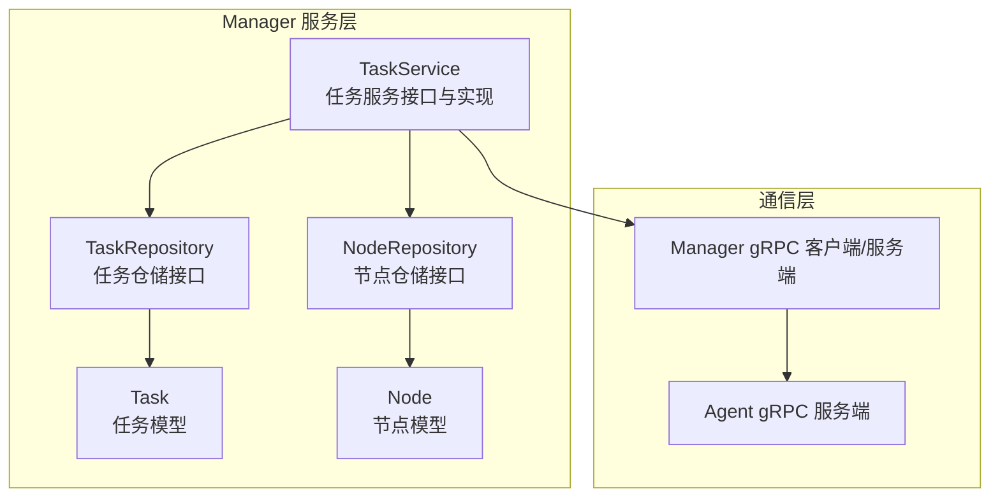
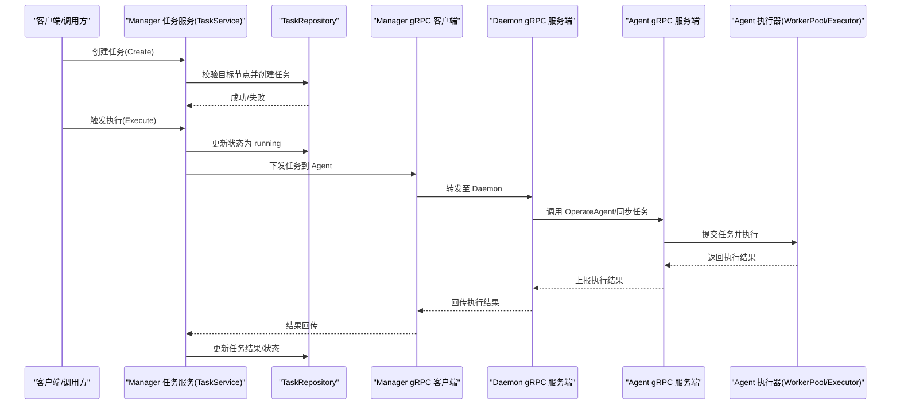
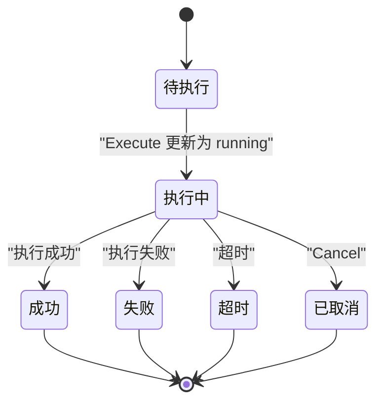
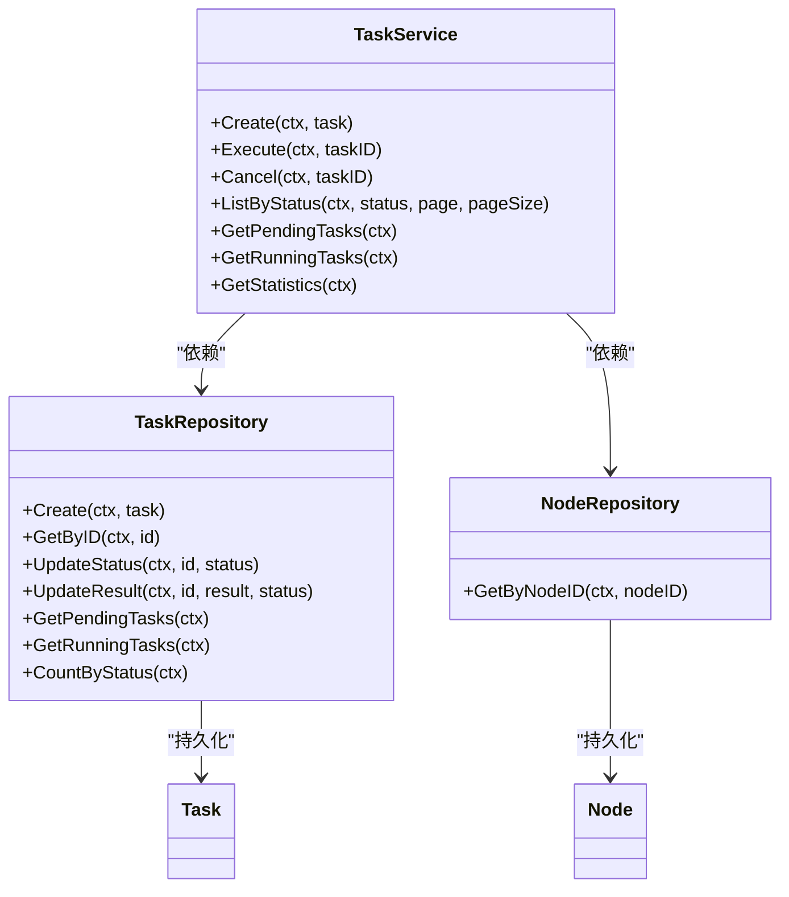

# 任务服务

<cite>
**本文引用的文件**
- [manager/internal/service/task.go](file://manager/internal/service/task.go)
- [manager/internal/repository/task.go](file://manager/internal/repository/task.go)
- [manager/internal/model/task.go](file://manager/internal/model/task.go)
- [manager/internal/repository/node.go](file://manager/internal/repository/node.go)
- [manager/internal/model/node.go](file://manager/internal/model/node.go)
- [manager/internal/grpc/daemon_server.go](file://manager/internal/grpc/daemon_server.go)
- [manager/internal/grpc/daemon_client_test.go](file://manager/internal/grpc/daemon_client_test.go)
- [manager/pkg/proto/daemon/daemon_grpc.pb.go](file://manager/pkg/proto/daemon/daemon_grpc.pb.go)
- [daemon/internal/grpc/server.go](file://daemon/internal/grpc/server.go)
- [docs/设计文档_03_Manager模块.md](file://docs/设计文档_03_Manager模块.md)
- [docs/设计文档_02_Agent模块.md](file://docs/设计文档_02_Agent模块.md)
- [daemon/internal/agent/multi_manager.go](file://daemon/internal/agent/multi_manager.go)
- [daemon/internal/agent/instance.go](file://daemon/internal/agent/instance.go)
- [manager/pkg/errors/errors.go](file://manager/pkg/errors/errors.go)
</cite>

## 目录
1. [简介](#简介)
2. [项目结构](#项目结构)
3. [核心组件](#核心组件)
4. [架构总览](#架构总览)
5. [详细组件分析](#详细组件分析)
6. [依赖关系分析](#依赖关系分析)
7. [性能考量](#性能考量)
8. [故障排查指南](#故障排查指南)
9. [结论](#结论)
10. [附录](#附录)

## 简介
本文件面向任务服务的全面技术文档，聚焦于任务调度与执行管理。围绕 Create、Execute、Cancel、ListByStatus、GetPendingTasks、GetStatistics 等关键方法，系统阐述：
- Create 如何校验目标节点并创建任务记录；
- Execute 的状态机实现（pending→running）；
- Cancel 对运行中任务的取消逻辑；
- ListByStatus、GetPendingTasks 等查询方法在调度器中的应用；
- GetStatistics 提供的任务统计能力；
- 任务状态流转图；
- 任务执行失败的重试机制与分布式锁最佳实践建议。

同时给出即时任务创建、定时任务调度、任务取消等使用示例，并结合 Agent/Manager/daemon 的交互链路，说明任务执行的实际落地方式。

## 项目结构
任务服务位于 Manager 模块，采用典型的分层结构：Service 层负责业务编排与状态控制，Repository 层封装数据访问，Model 定义数据结构，gRPC 作为与 Agent/daemon 的通信桥梁。

图表来源
- [manager/internal/service/task.go](file://manager/internal/service/task.go#L13-L42)
- [manager/internal/repository/task.go](file://manager/internal/repository/task.go#L11-L43)
- [manager/internal/repository/node.go](file://manager/internal/repository/node.go#L11-L38)
- [manager/internal/grpc/daemon_server.go](file://manager/internal/grpc/daemon_server.go#L1-L70)
- [manager/pkg/proto/daemon/daemon_grpc.pb.go](file://manager/pkg/proto/daemon/daemon_grpc.pb.go#L127-L363)
- [daemon/internal/grpc/server.go](file://daemon/internal/grpc/server.go#L1-L55)

章节来源
- [manager/internal/service/task.go](file://manager/internal/service/task.go#L13-L42)
- [manager/internal/repository/task.go](file://manager/internal/repository/task.go#L11-L43)
- [manager/internal/repository/node.go](file://manager/internal/repository/node.go#L11-L38)
- [manager/internal/grpc/daemon_server.go](file://manager/internal/grpc/daemon_server.go#L1-L70)
- [manager/pkg/proto/daemon/daemon_grpc.pb.go](file://manager/pkg/proto/daemon/daemon_grpc.pb.go#L127-L363)
- [daemon/internal/grpc/server.go](file://daemon/internal/grpc/server.go#L1-L55)

## 核心组件
- 任务服务接口与实现：TaskService，提供任务创建、查询、执行、取消、统计等能力。
- 任务仓储接口与实现：TaskRepository，封装任务的增删改查、状态更新、统计、定时任务查询等。
- 节点仓储接口与实现：NodeRepository，提供节点的增删改查、按状态查询、心跳更新等。
- 任务模型与节点模型：Task、Node，定义字段、索引、JSON 字段序列化等。
- 错误包装与响应：errors 包提供统一错误码与包装，便于上层处理。
- gRPC 通道：Manager 通过 gRPC 与 Agent/daemon 交互，执行器在 Agent 侧实现。

章节来源
- [manager/internal/service/task.go](file://manager/internal/service/task.go#L13-L42)
- [manager/internal/repository/task.go](file://manager/internal/repository/task.go#L11-L43)
- [manager/internal/repository/node.go](file://manager/internal/repository/node.go#L11-L38)
- [manager/internal/model/task.go](file://manager/internal/model/task.go#L11-L35)
- [manager/internal/model/node.go](file://manager/internal/model/node.go#L11-L33)
- [manager/pkg/errors/errors.go](file://manager/pkg/errors/errors.go#L66-L89)

## 架构总览
任务服务的执行链路如下：
- 管理端（Manager）接收任务创建与执行请求；
- TaskService 校验目标节点并持久化任务；
- Execute 将任务状态置为 running；
- Manager 通过 gRPC 将任务下发给 Agent；
- Agent 侧 WorkerPool/Executor 执行任务，完成后回传结果；
- Manager 更新任务状态与结果。

图表来源
- [manager/internal/service/task.go](file://manager/internal/service/task.go#L68-L90)
- [manager/internal/service/task.go](file://manager/internal/service/task.go#L169-L197)
- [manager/internal/grpc/daemon_server.go](file://manager/internal/grpc/daemon_server.go#L32-L69)
- [manager/pkg/proto/daemon/daemon_grpc.pb.go](file://manager/pkg/proto/daemon/daemon_grpc.pb.go#L127-L363)
- [daemon/internal/grpc/server.go](file://daemon/internal/grpc/server.go#L1-L55)
- [docs/设计文档_02_Agent模块.md](file://docs/设计文档_02_Agent模块.md#L419-L517)

章节来源
- [manager/internal/service/task.go](file://manager/internal/service/task.go#L68-L90)
- [manager/internal/service/task.go](file://manager/internal/service/task.go#L169-L197)
- [manager/internal/grpc/daemon_server.go](file://manager/internal/grpc/daemon_server.go#L32-L69)
- [manager/pkg/proto/daemon/daemon_grpc.pb.go](file://manager/pkg/proto/daemon/daemon_grpc.pb.go#L127-L363)
- [daemon/internal/grpc/server.go](file://daemon/internal/grpc/server.go#L1-L55)
- [docs/设计文档_02_Agent模块.md](file://docs/设计文档_02_Agent模块.md#L419-L517)

## 详细组件分析

### 任务模型与状态
- 任务模型包含名称、类型、目标节点列表、脚本内容、参数、状态、开始/结束时间、结果、创建者等字段。
- 状态字段默认为 pending，支持 running/completed/failed 等。
- 目标节点以 JSON 数组形式存储，便于灵活选择节点或节点组。

章节来源
- [manager/internal/model/task.go](file://manager/internal/model/task.go#L11-L35)
- [manager/internal/model/task.go](file://manager/internal/model/task.go#L52-L75)

### 任务服务接口与实现
- Create：遍历任务的目标节点，逐一校验节点是否存在，再创建任务记录。
- Execute：获取任务并检查状态，若非 running 则更新为 running，随后通过 gRPC 下发执行（当前实现仅更新状态，实际执行在 gRPC 服务中实现）。
- Cancel：仅允许 pending/running 状态取消，更新结果与状态为 cancelled。
- ListByStatus/GetPendingTasks/GetRunningTasks/GetStatistics：分别提供按状态查询、待执行/运行中任务查询、统计信息查询。
- UpdateStatus/UpdateResult：内部状态与结果更新方法。

章节来源
- [manager/internal/service/task.go](file://manager/internal/service/task.go#L68-L90)
- [manager/internal/service/task.go](file://manager/internal/service/task.go#L169-L197)
- [manager/internal/service/task.go](file://manager/internal/service/task.go#L199-L223)
- [manager/internal/service/task.go](file://manager/internal/service/task.go#L149-L167)
- [manager/internal/service/task.go](file://manager/internal/service/task.go#L245-L263)
- [manager/internal/service/task.go](file://manager/internal/service/task.go#L265-L273)

### 任务仓储接口与实现
- Create/GetByID/Update/Delete/List 等基础 CRUD；
- ListByStatus/ListByType/ListByCreator/ListByTimeRange：按条件分页查询；
- UpdateStatus：根据状态自动更新 started_at/finished_at；
- UpdateResult：更新结果与状态并设置 finished_at；
- GetPendingTasks/GetRunningTasks：按状态排序查询；
- CountByStatus：按状态统计；
- GetScheduledTasks：查询定时任务（基于 schedule 字段）。

章节来源
- [manager/internal/repository/task.go](file://manager/internal/repository/task.go#L11-L43)
- [manager/internal/repository/task.go](file://manager/internal/repository/task.go#L194-L215)
- [manager/internal/repository/task.go](file://manager/internal/repository/task.go#L217-L230)
- [manager/internal/repository/task.go](file://manager/internal/repository/task.go#L232-L254)
- [manager/internal/repository/task.go](file://manager/internal/repository/task.go#L256-L280)
- [manager/internal/repository/task.go](file://manager/internal/repository/task.go#L282-L291)

### 节点模型与校验
- 节点模型包含 NodeID、主机名、IP、操作系统、架构、标签、版本、状态、心跳时间等。
- Create 中对每个目标节点调用 GetByNodeID 校验存在性，不存在则返回错误。

章节来源
- [manager/internal/model/node.go](file://manager/internal/model/node.go#L11-L33)
- [manager/internal/repository/node.go](file://manager/internal/repository/node.go#L11-L38)
- [manager/internal/service/task.go](file://manager/internal/service/task.go#L68-L89)

### gRPC 交互与 Agent 执行
- Manager 通过 gRPC 客户端向 Daemon 服务端转发 Agent 状态同步请求；
- Agent 服务端在 daemon 内部实现，负责与具体 Agent 交互；
- Agent 侧 WorkerPool/Executor 负责任务执行、超时与状态变更；
- 任务执行完成后，Agent 将结果回传至 Manager。

章节来源
- [manager/internal/grpc/daemon_server.go](file://manager/internal/grpc/daemon_server.go#L32-L69)
- [manager/pkg/proto/daemon/daemon_grpc.pb.go](file://manager/pkg/proto/daemon/daemon_grpc.pb.go#L127-L363)
- [daemon/internal/grpc/server.go](file://daemon/internal/grpc/server.go#L1-L55)
- [docs/设计文档_02_Agent模块.md](file://docs/设计文档_02_Agent模块.md#L419-L517)

### 任务状态机与流转
- pending：初始状态，等待执行；
- running：执行中，更新 started_at；
- completed/failed：执行完成，更新 finished_at；
- cancelled：取消，更新结果与状态；
- timeout：Agent 执行器在超时场景下设置。

图表来源
- [manager/internal/repository/task.go](file://manager/internal/repository/task.go#L194-L215)
- [manager/internal/repository/task.go](file://manager/internal/repository/task.go#L217-L230)
- [docs/设计文档_02_Agent模块.md](file://docs/设计文档_02_Agent模块.md#L419-L517)

章节来源
- [manager/internal/repository/task.go](file://manager/internal/repository/task.go#L194-L215)
- [manager/internal/repository/task.go](file://manager/internal/repository/task.go#L217-L230)
- [docs/设计文档_02_Agent模块.md](file://docs/设计文档_02_Agent模块.md#L419-L517)

### 查询方法与调度器应用
- ListByStatus：按状态分页查询，便于 UI 或调度器筛选；
- GetPendingTasks/GetRunningTasks：调度器可据此拉取待执行/运行中任务进行执行；
- GetStatistics：统计各状态任务数量，用于仪表盘或监控。

章节来源
- [manager/internal/service/task.go](file://manager/internal/service/task.go#L149-L167)
- [manager/internal/service/task.go](file://manager/internal/service/task.go#L245-L263)
- [manager/internal/service/task.go](file://manager/internal/service/task.go#L265-L273)
- [manager/internal/repository/task.go](file://manager/internal/repository/task.go#L101-L122)
- [manager/internal/repository/task.go](file://manager/internal/repository/task.go#L232-L254)
- [manager/internal/repository/task.go](file://manager/internal/repository/task.go#L256-L280)

### 统计与报表
- GetStatistics 通过 CountByStatus 聚合各状态任务数量，可用于看板展示与告警。

章节来源
- [manager/internal/service/task.go](file://manager/internal/service/task.go#L265-L273)
- [manager/internal/repository/task.go](file://manager/internal/repository/task.go#L256-L280)

### 重试机制与分布式锁最佳实践
- Agent 重启退避策略：根据重启次数与时间窗口计算退避延迟，避免频繁重启造成压力。
- 任务执行器超时控制：在 Agent 侧 WorkerPool 中为任务设置超时上下文，超时/取消时设置相应状态。
- 分布式锁建议：在需要保证“同一任务在同一时刻仅在一个节点执行”的场景，可在 Manager 层引入分布式锁（如基于 Redis 的 RedLock），在 Execute 前申请锁，成功后再更新状态并下发执行；失败则释放锁并返回错误。

章节来源
- [daemon/internal/agent/instance.go](file://daemon/internal/agent/instance.go#L389-L410)
- [docs/设计文档_02_Agent模块.md](file://docs/设计文档_02_Agent模块.md#L419-L517)

## 依赖关系分析

图表来源
- [manager/internal/service/task.go](file://manager/internal/service/task.go#L13-L42)
- [manager/internal/repository/task.go](file://manager/internal/repository/task.go#L11-L43)
- [manager/internal/repository/node.go](file://manager/internal/repository/node.go#L11-L38)
- [manager/internal/model/task.go](file://manager/internal/model/task.go#L11-L35)
- [manager/internal/model/node.go](file://manager/internal/model/node.go#L11-L33)

章节来源
- [manager/internal/service/task.go](file://manager/internal/service/task.go#L13-L42)
- [manager/internal/repository/task.go](file://manager/internal/repository/task.go#L11-L43)
- [manager/internal/repository/node.go](file://manager/internal/repository/node.go#L11-L38)
- [manager/internal/model/task.go](file://manager/internal/model/task.go#L11-L35)
- [manager/internal/model/node.go](file://manager/internal/model/node.go#L11-L33)

## 性能考量
- 查询优化：按状态、类型、创建者、时间范围等维度提供分页查询，避免全表扫描；
- 状态更新：UpdateStatus/UpdateResult 使用原子更新，减少并发冲突；
- 统计聚合：CountByStatus 使用分组聚合，适合高频统计；
- gRPC 调用：Manager 与 Agent 间采用 gRPC，具备高吞吐低延迟特性；
- Agent 执行：WorkerPool 并发执行，合理设置并发度与队列长度，避免阻塞。

[本节为通用指导，无需特定文件来源]

## 故障排查指南
- 任务不存在：Create/Execute/Cancel 均会在查询不到记录时返回明确错误；
- 数据库异常：统一通过 errors 包包装，便于上层识别；
- 节点不存在：Create 会逐个校验目标节点，缺失节点会返回错误；
- 状态非法：Execute/Cancel 对状态有限制，非法状态会返回错误；
- 执行失败：UpdateResult 支持更新结果与状态，便于定位问题。

章节来源
- [manager/internal/service/task.go](file://manager/internal/service/task.go#L68-L90)
- [manager/internal/service/task.go](file://manager/internal/service/task.go#L169-L197)
- [manager/internal/service/task.go](file://manager/internal/service/task.go#L199-L223)
- [manager/pkg/errors/errors.go](file://manager/pkg/errors/errors.go#L66-L89)

## 结论
任务服务通过清晰的接口与仓储分离，实现了任务的创建、校验、执行、取消与统计。状态机设计简洁可靠，配合 gRPC 与 Agent 执行器，能够支撑即时任务与定时任务的调度执行。建议在生产环境中结合分布式锁与重试策略，进一步提升可靠性与一致性。

[本节为总结性内容，无需特定文件来源]

## 附录

### 使用示例

- 即时任务创建
  - 步骤：构造任务对象（含名称、类型、目标节点列表、脚本/参数等），调用 Create 完成创建。
  - 参考路径：[manager/internal/service/task.go](file://manager/internal/service/task.go#L68-L90)

- 定时任务调度
  - 设计说明：任务模型包含 cron 表达式字段，仓储提供 GetScheduledTasks 查询定时任务。
  - 参考路径：[docs/设计文档_03_Manager模块.md](file://docs/设计文档_03_Manager模块.md#L523-L573)，[manager/internal/repository/task.go](file://manager/internal/repository/task.go#L282-L291)

- 任务取消
  - 步骤：调用 Cancel，仅允许 pending/running 状态取消，更新结果与状态为 cancelled。
  - 参考路径：[manager/internal/service/task.go](file://manager/internal/service/task.go#L199-L223)

- 查询与统计
  - 按状态查询：ListByStatus
  - 待执行/运行中查询：GetPendingTasks/GetRunningTasks
  - 统计：GetStatistics
  - 参考路径：[manager/internal/service/task.go](file://manager/internal/service/task.go#L149-L167)，[manager/internal/service/task.go](file://manager/internal/service/task.go#L245-L263)，[manager/internal/service/task.go](file://manager/internal/service/task.go#L265-L273)

- Agent 执行与回传
  - Manager 通过 gRPC 下发任务，Agent 侧 WorkerPool/Executor 执行并回传结果。
  - 参考路径：[manager/internal/grpc/daemon_server.go](file://manager/internal/grpc/daemon_server.go#L32-L69)，[docs/设计文档_02_Agent模块.md](file://docs/设计文档_02_Agent模块.md#L419-L517)