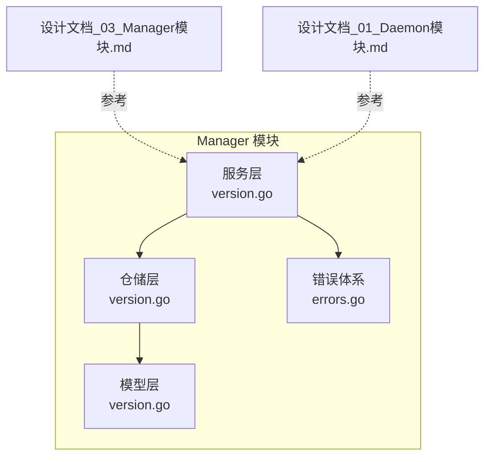
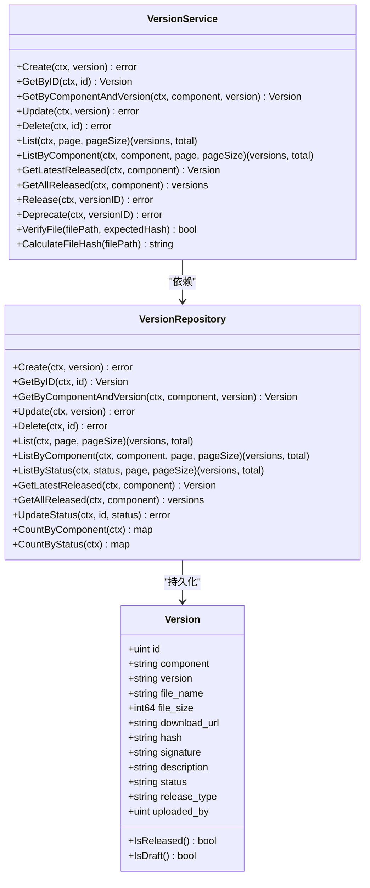
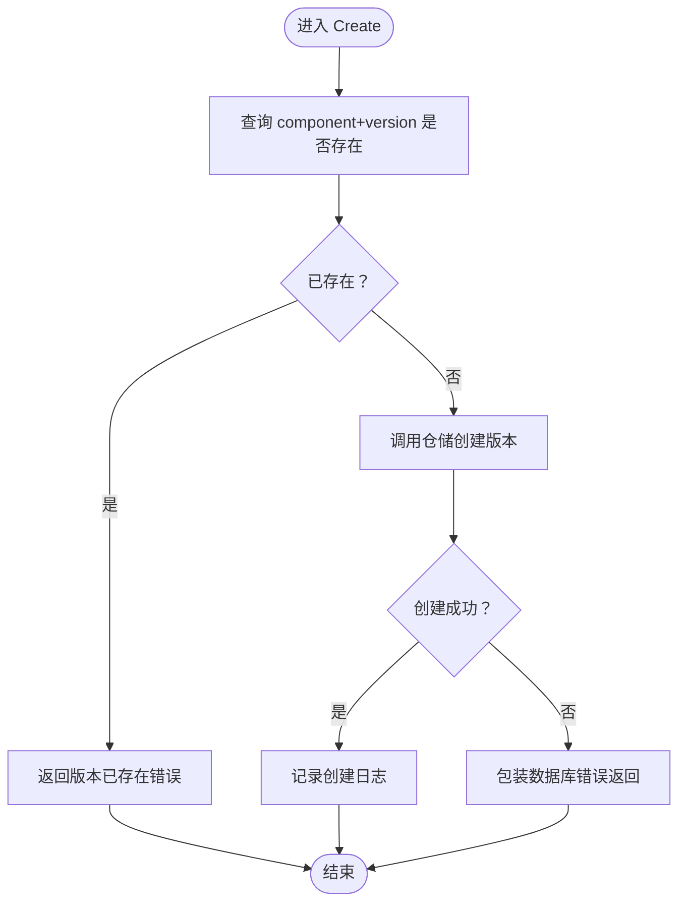
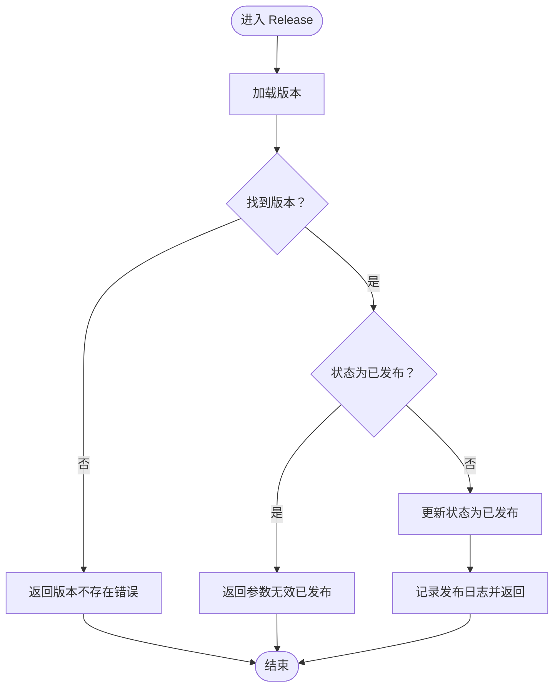
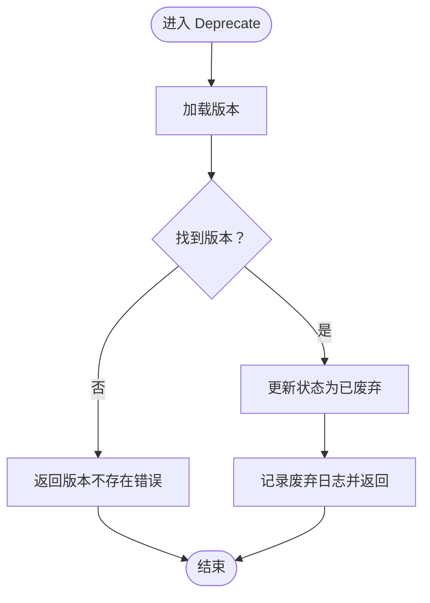
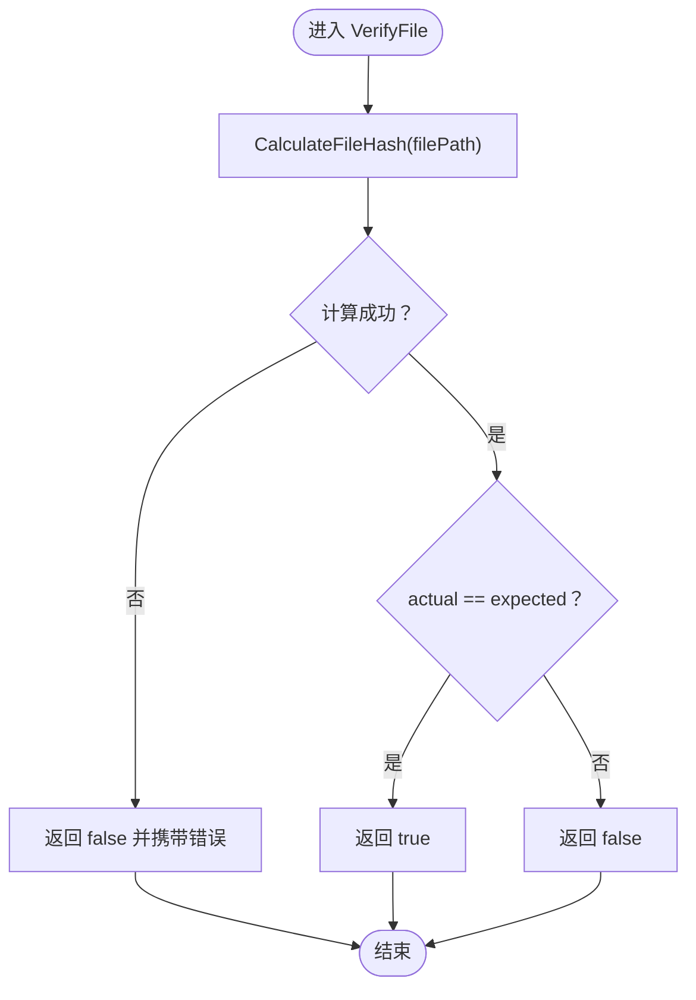
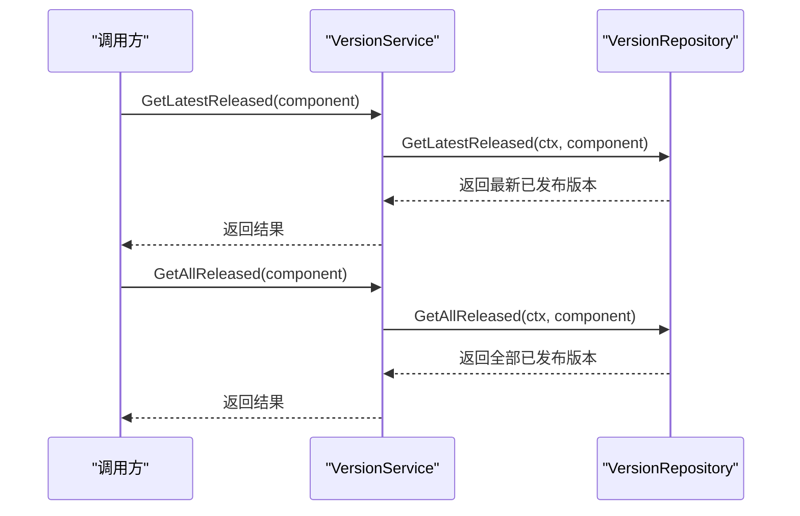
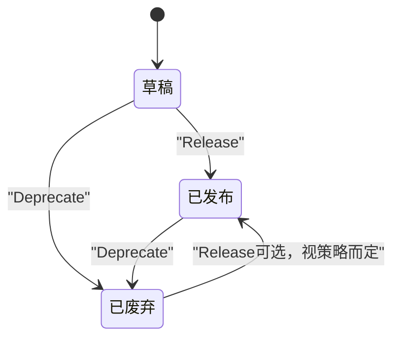
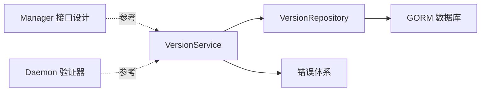

# 版本服务

<cite>
**本文引用的文件**
- [manager/internal/service/version.go](file://manager/internal/service/version.go)
- [manager/internal/repository/version.go](file://manager/internal/repository/version.go)
- [manager/internal/model/version.go](file://manager/internal/model/version.go)
- [manager/pkg/errors/errors.go](file://manager/pkg/errors/errors.go)
- [docs/设计文档_03_Manager模块.md](file://docs/设计文档_03_Manager模块.md)
- [docs/设计文档_01_Daemon模块.md](file://docs/设计文档_01_Daemon模块.md)
</cite>

## 目录
1. [简介](#简介)
2. [项目结构](#项目结构)
3. [核心组件](#核心组件)
4. [架构总览](#架构总览)
5. [详细组件分析](#详细组件分析)
6. [依赖关系分析](#依赖关系分析)
7. [性能考量](#性能考量)
8. [故障排查指南](#故障排查指南)
9. [结论](#结论)
10. [附录](#附录)

## 简介
本文件面向版本服务的全生命周期管理，围绕 Create、Release、Deprecate、CalculateFileHash、VerifyFile、GetLatestReleased、GetAllReleased 等关键能力进行深入解析，并结合灰度发布场景给出应用示例。同时提供版本状态机图与安全最佳实践，帮助读者在理解代码实现的同时，掌握工程落地的关键要点。

## 项目结构
版本服务位于 Manager 模块中，采用经典的分层架构：
- 模型层：定义版本实体及其状态字段
- 仓储层：封装数据库访问与状态变更
- 服务层：编排业务流程、执行校验与错误包装
- 错误体系：统一错误码与消息，便于上层处理
- 文档参考：补充了版本上传、部署与灰度策略的接口说明

图表来源
- [manager/internal/service/version.go](file://manager/internal/service/version.go#L1-L277)
- [manager/internal/repository/version.go](file://manager/internal/repository/version.go#L1-L243)
- [manager/internal/model/version.go](file://manager/internal/model/version.go#L1-L49)
- [manager/pkg/errors/errors.go](file://manager/pkg/errors/errors.go#L1-L171)
- [docs/设计文档_03_Manager模块.md](file://docs/设计文档_03_Manager模块.md#L829-L890)
- [docs/设计文档_01_Daemon模块.md](file://docs/设计文档_01_Daemon模块.md#L865-L915)

章节来源
- [manager/internal/service/version.go](file://manager/internal/service/version.go#L1-L277)
- [manager/internal/repository/version.go](file://manager/internal/repository/version.go#L1-L243)
- [manager/internal/model/version.go](file://manager/internal/model/version.go#L1-L49)
- [manager/pkg/errors/errors.go](file://manager/pkg/errors/errors.go#L1-L171)
- [docs/设计文档_03_Manager模块.md](file://docs/设计文档_03_Manager模块.md#L829-L890)
- [docs/设计文档_01_Daemon模块.md](file://docs/设计文档_01_Daemon模块.md#L865-L915)

## 核心组件
- 版本模型：包含组件类型、版本号、文件元信息、哈希、签名、状态、发布类型、上传者等字段，并提供状态判断辅助方法。
- 版本仓储：提供创建、查询、分页、按状态/组件筛选、更新状态、统计数量等能力。
- 版本服务：对外暴露 Create、Release、Deprecate、GetLatestReleased、GetAllReleased、VerifyFile、CalculateFileHash 等接口，并在服务层完成唯一性校验、状态约束、错误包装与日志记录。
- 错误体系：统一错误码与消息，便于上层统一处理与返回。

章节来源
- [manager/internal/model/version.go](file://manager/internal/model/version.go#L1-L49)
- [manager/internal/repository/version.go](file://manager/internal/repository/version.go#L1-L243)
- [manager/internal/service/version.go](file://manager/internal/service/version.go#L1-L277)
- [manager/pkg/errors/errors.go](file://manager/pkg/errors/errors.go#L1-L171)

## 架构总览
版本服务遵循“服务编排 + 仓储持久化”的分层设计，服务层负责业务规则与状态转换，仓储层负责数据存取与状态更新，模型层承载数据结构与状态判断。

图表来源
- [manager/internal/model/version.go](file://manager/internal/model/version.go#L1-L49)
- [manager/internal/repository/version.go](file://manager/internal/repository/version.go#L1-L243)
- [manager/internal/service/version.go](file://manager/internal/service/version.go#L1-L277)

## 详细组件分析

### Create 方法：版本唯一性校验
- 业务目标：防止同组件下重复版本号导致的数据冲突。
- 实现要点：
  - 先通过仓储查询是否存在相同 component+version 的版本。
  - 若存在且非“记录未找到”错误，则包装数据库错误返回。
  - 若已存在，直接返回“版本已存在”错误。
  - 不存在则创建版本并记录成功日志。
- 关键路径
  - 查询唯一性：[GetByComponentAndVersion](file://manager/internal/repository/version.go#L66-L75)
  - 创建版本：[Create](file://manager/internal/repository/version.go#L50-L53)
  - 错误包装与返回：[Create](file://manager/internal/service/version.go#L68-L91)

图表来源
- [manager/internal/service/version.go](file://manager/internal/service/version.go#L68-L91)
- [manager/internal/repository/version.go](file://manager/internal/repository/version.go#L50-L75)

章节来源
- [manager/internal/service/version.go](file://manager/internal/service/version.go#L68-L91)
- [manager/internal/repository/version.go](file://manager/internal/repository/version.go#L50-L75)

### Release 方法：发布流程与状态约束
- 业务目标：将草稿态版本发布为已发布态，禁止对已发布版本重复发布。
- 实现要点：
  - 通过仓储加载目标版本。
  - 若已是“已发布”，返回“参数无效”错误（提示已发布）。
  - 否则调用仓储更新状态为“已发布”，记录发布日志。
- 关键路径
  - 加载版本：[GetByID](file://manager/internal/repository/version.go#L55-L63)
  - 更新状态：[UpdateStatus](file://manager/internal/repository/version.go#L184-L191)
  - 业务校验与返回：[Release](file://manager/internal/service/version.go#L196-L224)

图表来源
- [manager/internal/service/version.go](file://manager/internal/service/version.go#L196-L224)
- [manager/internal/repository/version.go](file://manager/internal/repository/version.go#L55-L63)
- [manager/internal/repository/version.go](file://manager/internal/repository/version.go#L184-L191)

章节来源
- [manager/internal/service/version.go](file://manager/internal/service/version.go#L196-L224)
- [manager/internal/repository/version.go](file://manager/internal/repository/version.go#L55-L63)
- [manager/internal/repository/version.go](file://manager/internal/repository/version.go#L184-L191)

### Deprecate 方法：废弃机制
- 业务目标：将版本标记为废弃，用于后续灰度回退或停止推广。
- 实现要点：
  - 通过仓储加载目标版本。
  - 调用仓储更新状态为“已废弃”，记录废弃日志。
- 关键路径
  - 加载版本：[GetByID](file://manager/internal/repository/version.go#L55-L63)
  - 更新状态：[UpdateStatus](file://manager/internal/repository/version.go#L184-L191)
  - 业务处理与返回：[Deprecate](file://manager/internal/service/version.go#L226-L249)

图表来源
- [manager/internal/service/version.go](file://manager/internal/service/version.go#L226-L249)
- [manager/internal/repository/version.go](file://manager/internal/repository/version.go#L55-L63)
- [manager/internal/repository/version.go](file://manager/internal/repository/version.go#L184-L191)

章节来源
- [manager/internal/service/version.go](file://manager/internal/service/version.go#L226-L249)
- [manager/internal/repository/version.go](file://manager/internal/repository/version.go#L55-L63)
- [manager/internal/repository/version.go](file://manager/internal/repository/version.go#L184-L191)

### CalculateFileHash 与 VerifyFile：SHA256 文件完整性校验
- 业务目标：对本地文件计算 SHA256 哈希，用于入库前校验与下载后校验。
- 实现要点：
  - 打开文件并使用流式复制到哈希器，避免一次性读入内存。
  - 将二进制哈希值编码为十六进制字符串返回。
  - VerifyFile 对比实际哈希与期望哈希，一致返回 true，否则 false。
- 关键路径
  - 计算哈希：[CalculateFileHash](file://manager/internal/service/version.go#L261-L277)
  - 验证哈希：[VerifyFile](file://manager/internal/service/version.go#L251-L259)
  - 参考 Daemon 模块中的哈希验证实现（对比思路一致）：[Daemon 验证器](file://docs/设计文档_01_Daemon模块.md#L865-L915)

图表来源
- [manager/internal/service/version.go](file://manager/internal/service/version.go#L251-L277)
- [docs/设计文档_01_Daemon模块.md](file://docs/设计文档_01_Daemon模块.md#L865-L915)

章节来源
- [manager/internal/service/version.go](file://manager/internal/service/version.go#L251-L277)
- [docs/设计文档_01_Daemon模块.md](file://docs/设计文档_01_Daemon模块.md#L865-L915)

### GetLatestReleased 与 GetAllReleased：灰度发布应用场景
- GetLatestReleased：按组件查询最新已发布版本，适合灰度发布时选择“当前最新稳定版本”作为基线。
- GetAllReleased：获取某组件全部已发布版本，可用于灰度回滚或对比历史版本差异。
- 使用建议（结合 Manager 接口设计）：
  - 在灰度发布前，先调用 GetLatestReleased 获取当前稳定版本。
  - 在灰度过程中，结合部署策略（如 canary）逐步扩大流量比例。
  - 若灰度失败，可通过 Deprecate 或回滚策略切换至历史稳定版本。
- 关键路径
  - 最新已发布：[GetLatestReleased](file://manager/internal/repository/version.go#L154-L168)
  - 全部已发布：[GetAllReleased](file://manager/internal/repository/version.go#L170-L182)
  - 参考 Manager 版本接口设计（上传、部署、下载等）：[Manager 版本接口](file://docs/设计文档_03_Manager模块.md#L829-L890)

图表来源
- [manager/internal/service/version.go](file://manager/internal/service/version.go#L173-L194)
- [manager/internal/repository/version.go](file://manager/internal/repository/version.go#L154-L182)
- [docs/设计文档_03_Manager模块.md](file://docs/设计文档_03_Manager模块.md#L829-L890)

章节来源
- [manager/internal/service/version.go](file://manager/internal/service/version.go#L173-L194)
- [manager/internal/repository/version.go](file://manager/internal/repository/version.go#L154-L182)
- [docs/设计文档_03_Manager模块.md](file://docs/设计文档_03_Manager模块.md#L829-L890)

### 版本状态机图
版本状态包括 draft、testing、released、deprecated。服务层对状态转换进行了约束，例如禁止删除已发布版本、禁止重复发布等。

图表来源
- [manager/internal/model/version.go](file://manager/internal/model/version.go#L1-L49)
- [manager/internal/service/version.go](file://manager/internal/service/version.go#L196-L249)
- [manager/internal/repository/version.go](file://manager/internal/repository/version.go#L184-L191)

章节来源
- [manager/internal/model/version.go](file://manager/internal/model/version.go#L1-L49)
- [manager/internal/service/version.go](file://manager/internal/service/version.go#L196-L249)
- [manager/internal/repository/version.go](file://manager/internal/repository/version.go#L184-L191)

## 依赖关系分析
- 服务层依赖仓储层提供的数据访问与状态更新能力。
- 仓储层依赖 GORM 进行数据库操作，查询与更新均通过上下文传递。
- 错误体系提供统一错误码与消息，服务层通过 Wrap 与预定义错误进行返回。
- 文档层面提供了版本上传、部署与灰度策略的接口参考，便于在灰度发布场景中组合使用。

图表来源
- [manager/internal/service/version.go](file://manager/internal/service/version.go#L1-L277)
- [manager/internal/repository/version.go](file://manager/internal/repository/version.go#L1-L243)
- [manager/pkg/errors/errors.go](file://manager/pkg/errors/errors.go#L1-L171)
- [docs/设计文档_03_Manager模块.md](file://docs/设计文档_03_Manager模块.md#L829-L890)
- [docs/设计文档_01_Daemon模块.md](file://docs/设计文档_01_Daemon模块.md#L865-L915)

章节来源
- [manager/internal/service/version.go](file://manager/internal/service/version.go#L1-L277)
- [manager/internal/repository/version.go](file://manager/internal/repository/version.go#L1-L243)
- [manager/pkg/errors/errors.go](file://manager/pkg/errors/errors.go#L1-L171)
- [docs/设计文档_03_Manager模块.md](file://docs/设计文档_03_Manager模块.md#L829-L890)
- [docs/设计文档_01_Daemon模块.md](file://docs/设计文档_01_Daemon模块.md#L865-L915)

## 性能考量
- 文件哈希计算采用流式 IO，避免大文件一次性读入内存，降低内存峰值。
- 仓储查询默认按 id 降序，有利于快速定位最新版本。
- 建议在高并发场景下：
  - 对 Create 唯一性查询加索引（component+version），减少锁竞争。
  - 对 GetLatestReleased 使用单条 First 查询，避免不必要的排序成本。
  - 对 VerifyFile 在调用侧控制文件大小阈值，避免超大文件带来的 CPU 和 IO 压力。

[本节为通用性能建议，不直接分析具体文件]

## 故障排查指南
- 版本已存在
  - 现象：Create 返回“版本已存在”。
  - 排查：确认组件与版本号是否重复；必要时清理或调整版本号。
  - 参考：[Create](file://manager/internal/service/version.go#L68-L91)
- 版本不存在
  - 现象：Release/Deprecate/GetByID 返回“版本不存在”。
  - 排查：确认传入的版本 ID 是否正确；检查数据库记录。
  - 参考：[GetByID](file://manager/internal/service/version.go#L93-L104)
- 已发布版本不可删除
  - 现象：Delete 返回“不能删除已发布的版本”。
  - 排查：先 Deprecate 再删除，或通过其他流程处理。
  - 参考：[Delete](file://manager/internal/service/version.go#L129-L151)
- 发布重复
  - 现象：Release 返回“参数无效（已发布）”。
  - 排查：确认版本状态；避免重复发布。
  - 参考：[Release](file://manager/internal/service/version.go#L196-L224)
- 文件哈希不匹配
  - 现象：VerifyFile 返回 false。
  - 排查：确认文件路径、期望哈希值是否正确；重新计算哈希。
  - 参考：[VerifyFile](file://manager/internal/service/version.go#L251-L259)

章节来源
- [manager/internal/service/version.go](file://manager/internal/service/version.go#L68-L151)
- [manager/internal/service/version.go](file://manager/internal/service/version.go#L196-L259)

## 结论
版本服务以清晰的分层与严格的业务约束实现了从创建、发布、废弃到完整性校验的全生命周期管理。通过 GetLatestReleased 与 GetAllReleased，可在灰度发布场景中灵活选择基线版本与回滚策略。配合统一的错误体系与安全实践，能够有效提升系统的稳定性与可维护性。

[本节为总结性内容，不直接分析具体文件]

## 附录

### 安全最佳实践（版本文件存储、哈希验证与发布审批）
- 文件存储
  - 限制文件大小与允许目录，避免路径穿越与磁盘滥用。
  - 仅在可信目录写入，设置合理权限。
  - 参考：[Agent 文件执行器的安全检查](file://docs/设计文档_02_Agent模块.md#L730-L903)
- 哈希验证
  - 使用流式计算 SHA256，避免内存压力。
  - 对比前严格校验输入路径与期望哈希格式。
  - 参考：[CalculateFileHash](file://manager/internal/service/version.go#L261-L277)、[Daemon 验证器](file://docs/设计文档_01_Daemon模块.md#L865-L915)
- 发布审批
  - 建议在 Release 前增加审批流程（如审计日志、审批人签发），并在服务层记录审计事件。
  - 参考：服务层已记录发布/废弃日志，可扩展审计仓库对接。
- 错误处理
  - 使用统一错误码与 Wrap 包装，便于上层统一处理与返回。
  - 参考：[错误体系](file://manager/pkg/errors/errors.go#L1-L171)

章节来源
- [manager/internal/service/version.go](file://manager/internal/service/version.go#L261-L277)
- [docs/设计文档_01_Daemon模块.md](file://docs/设计文档_01_Daemon模块.md#L865-L915)
- [docs/设计文档_02_Agent模块.md](file://docs/设计文档_02_Agent模块.md#L730-L903)
- [manager/pkg/errors/errors.go](file://manager/pkg/errors/errors.go#L1-L171)