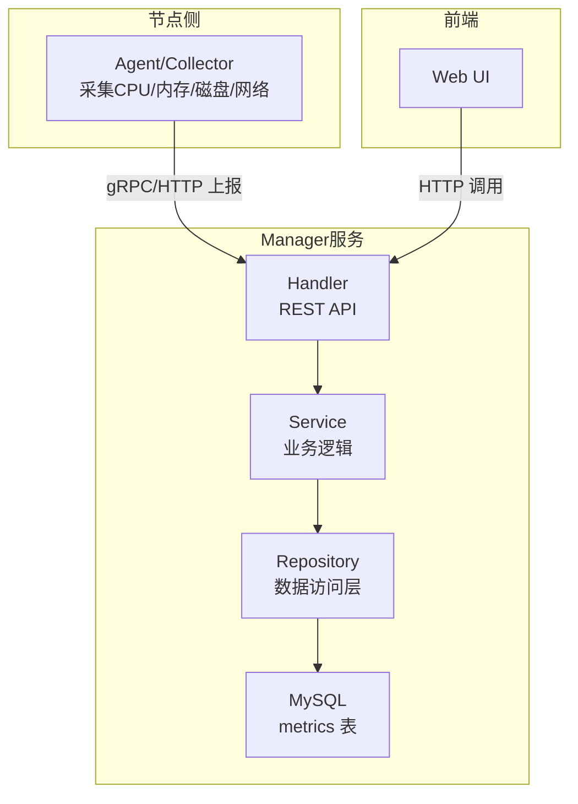
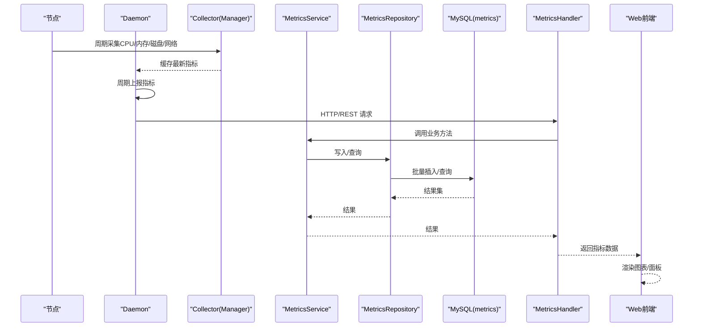
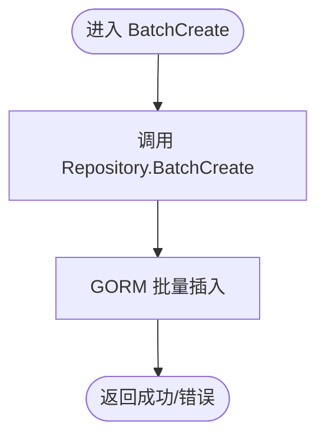
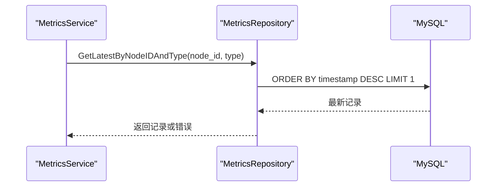
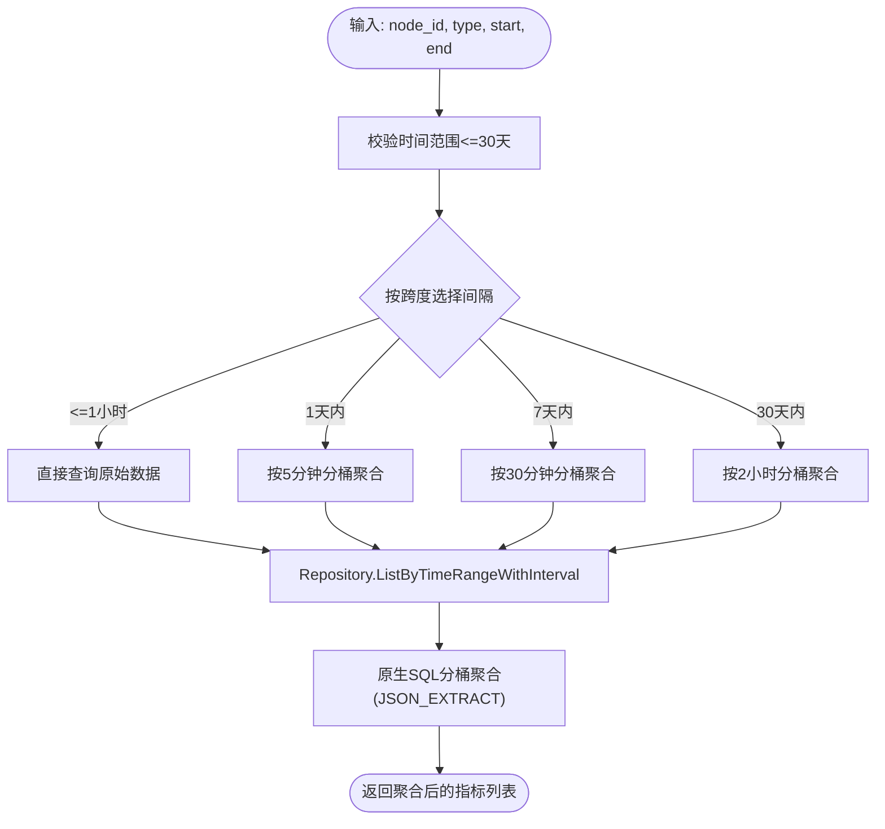
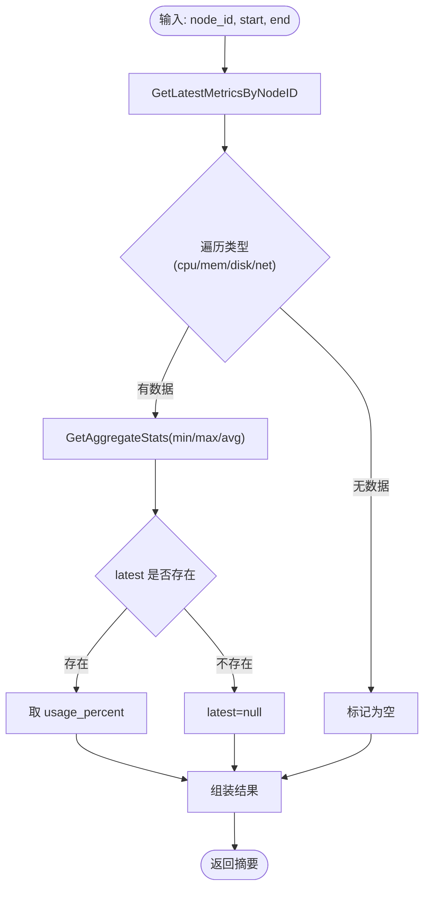
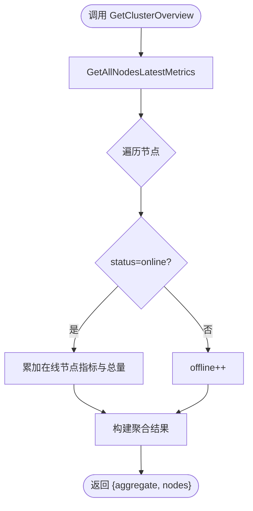
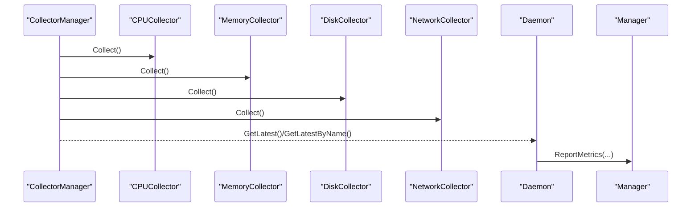
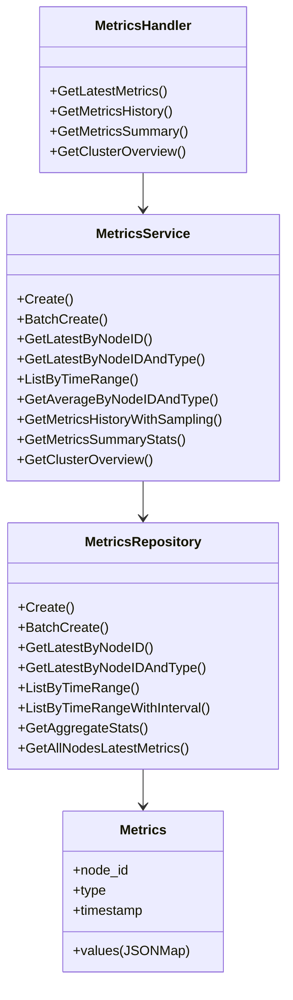

# 监控服务

<cite>
**本文引用的文件**
- [manager/internal/service/metrics.go](file://manager/internal/service/metrics.go)
- [manager/internal/repository/metrics.go](file://manager/internal/repository/metrics.go)
- [manager/internal/model/metrics.go](file://manager/internal/model/metrics.go)
- [manager/internal/handler/metrics.go](file://manager/internal/handler/metrics.go)
- [daemon/internal/collector/manager.go](file://daemon/internal/collector/manager.go)
- [daemon/internal/collector/cpu.go](file://daemon/internal/collector/cpu.go)
- [daemon/internal/collector/memory.go](file://daemon/internal/collector/memory.go)
- [daemon/internal/collector/disk.go](file://daemon/internal/collector/disk.go)
- [daemon/internal/collector/network.go](file://daemon/internal/collector/network.go)
- [daemon/internal/daemon/daemon.go](file://daemon/internal/daemon/daemon.go)
- [daemon/pkg/types/types.go](file://daemon/pkg/types/types.go)
- [manager/migrations/add_metrics_partitions.sql](file://manager/migrations/add_metrics_partitions.sql)
- [manager/migrations/README_PARTITIONS.md](file://manager/migrations/README_PARTITIONS.md)
- [config/mysql/schema.sql](file://config/mysql/schema.sql)
</cite>

## 目录
1. [简介](#简介)
2. [项目结构](#项目结构)
3. [核心组件](#核心组件)
4. [架构总览](#架构总览)
5. [详细组件分析](#详细组件分析)
6. [依赖关系分析](#依赖关系分析)
7. [性能考量](#性能考量)
8. [故障排查指南](#故障排查指南)
9. [结论](#结论)
10. [附录](#附录)

## 简介
本技术文档聚焦于监控服务的指标采集与查询分析能力，围绕以下目标展开：
- 深入解析 BatchCreate 方法的批量插入性能优化策略
- 说明 GetLatestByNodeIDAndType 的最新指标查询实现
- 阐述 ListByTimeRangeWithSampling 的智能采样策略，基于时间范围自动选择5分钟/30分钟/2小时等聚合间隔
- 解释 GetMetricsSummaryStats 提供的 min/max/avg/latest 统计功能
- 描述 GetClusterOverview 如何聚合所有节点指标生成集群概览
- 提供历史数据查询的性能优化建议（分区表查询、索引使用）
- 绘制从 Agent 采集到前端展示的完整数据流图
- 针对大规模指标存储提出分区策略与数据保留策略的最佳实践

## 项目结构
监控服务由三部分组成：
- Agent/Collector：负责在节点侧采集 CPU、内存、磁盘、网络等指标，并周期性上报
- Manager：提供指标写入、查询、统计与集群概览的后端服务
- Web：前端可视化界面，调用 Manager 的 API 展示图表与面板

**章节来源**
- [manager/internal/handler/metrics.go](file://manager/internal/handler/metrics.go#L1-L210)
- [manager/internal/service/metrics.go](file://manager/internal/service/metrics.go#L1-L371)
- [manager/internal/repository/metrics.go](file://manager/internal/repository/metrics.go#L1-L503)
- [daemon/internal/collector/manager.go](file://daemon/internal/collector/manager.go#L1-L124)
- [daemon/internal/collector/cpu.go](file://daemon/internal/collector/cpu.go#L1-L106)
- [daemon/internal/collector/memory.go](file://daemon/internal/collector/memory.go#L1-L89)
- [daemon/internal/collector/disk.go](file://daemon/internal/collector/disk.go#L1-L154)
- [daemon/internal/collector/network.go](file://daemon/internal/collector/network.go#L1-L137)

## 核心组件
- Handler：REST API 入口，负责参数校验、调用 Service 并返回响应
- Service：封装业务逻辑，协调 Repository，提供批量写入、最新指标查询、历史采样、统计摘要、集群概览等能力
- Repository：面向数据库的访问层，提供 CRUD、聚合查询、采样聚合、最新指标查询、集群概览等实现
- Model：指标模型与 JSONMap 的序列化/反序列化
- Collector：节点侧采集器集合，周期性采集并缓存最新指标
- Daemon：节点守护进程，负责启动采集器、周期性上报指标

**章节来源**
- [manager/internal/handler/metrics.go](file://manager/internal/handler/metrics.go#L1-L210)
- [manager/internal/service/metrics.go](file://manager/internal/service/metrics.go#L1-L371)
- [manager/internal/repository/metrics.go](file://manager/internal/repository/metrics.go#L1-L503)
- [manager/internal/model/metrics.go](file://manager/internal/model/metrics.go#L1-L65)
- [daemon/internal/collector/manager.go](file://daemon/internal/collector/manager.go#L1-L124)
- [daemon/internal/daemon/daemon.go](file://daemon/internal/daemon/daemon.go#L566-L616)

## 架构总览
下图展示了从 Agent 采集到前端展示的完整链路，以及 Manager 的内部职责划分。

**图表来源**
- [daemon/internal/collector/manager.go](file://daemon/internal/collector/manager.go#L1-L124)
- [daemon/internal/daemon/daemon.go](file://daemon/internal/daemon/daemon.go#L566-L616)
- [manager/internal/handler/metrics.go](file://manager/internal/handler/metrics.go#L1-L210)
- [manager/internal/service/metrics.go](file://manager/internal/service/metrics.go#L1-L371)
- [manager/internal/repository/metrics.go](file://manager/internal/repository/metrics.go#L1-L503)

## 详细组件分析

### BatchCreate 批量插入性能优化
- Repository 层使用 GORM 的批量创建接口一次性写入多个指标记录，减少多次往返与事务开销
- 适合高并发、高频采集场景，显著降低写入延迟与数据库压力
- Service 层仅做简单包装与错误处理，便于上层调用

**图表来源**
- [manager/internal/service/metrics.go](file://manager/internal/service/metrics.go#L68-L76)
- [manager/internal/repository/metrics.go](file://manager/internal/repository/metrics.go#L75-L78)

**章节来源**
- [manager/internal/service/metrics.go](file://manager/internal/service/metrics.go#L68-L76)
- [manager/internal/repository/metrics.go](file://manager/internal/repository/metrics.go#L75-L78)

### GetLatestByNodeIDAndType 最新指标查询实现
- 通过 Repository 的 GetLatestByNodeIDAndType 获取指定节点与类型的最新一条记录
- 若无记录则返回空，调用方需自行处理“无数据”场景
- Service 层负责错误包装与日志记录

**图表来源**
- [manager/internal/service/metrics.go](file://manager/internal/service/metrics.go#L88-L96)
- [manager/internal/repository/metrics.go](file://manager/internal/repository/metrics.go#L194-L208)

**章节来源**
- [manager/internal/service/metrics.go](file://manager/internal/service/metrics.go#L88-L96)
- [manager/internal/repository/metrics.go](file://manager/internal/repository/metrics.go#L194-L208)

### ListByTimeRangeWithSampling 智能采样策略
- Service 层根据时间跨度自动选择采样间隔：
  - ≤1小时：原始数据（60秒间隔）
  - 1天内：5分钟聚合
  - 7天内：30分钟聚合
  - 30天内：2小时聚合
- Repository 层使用原生 SQL 对时间戳进行分桶聚合，利用 JSON_EXTRACT 提取 usage_percent 字段并求 AVG
- 限制时间范围不超过30天，防止过度采样导致内存与查询压力

**图表来源**
- [manager/internal/service/metrics.go](file://manager/internal/service/metrics.go#L169-L225)
- [manager/internal/repository/metrics.go](file://manager/internal/repository/metrics.go#L258-L333)

**章节来源**
- [manager/internal/service/metrics.go](file://manager/internal/service/metrics.go#L169-L225)
- [manager/internal/repository/metrics.go](file://manager/internal/repository/metrics.go#L258-L333)

### GetMetricsSummaryStats 统计摘要（min/max/avg/latest）
- Service 层先获取节点各类型最新指标，再对指定时间范围调用 Repository 的 GetAggregateStats 获取 min/max/avg
- 若某类型无数据，latest 为 null；若 min/max/avg 均为 0 且存在最新数据，则 latest 来自 values.usage_percent
- 返回结构包含每种指标类型的统计摘要

**图表来源**
- [manager/internal/service/metrics.go](file://manager/internal/service/metrics.go#L227-L293)
- [manager/internal/repository/metrics.go](file://manager/internal/repository/metrics.go#L335-L374)

**章节来源**
- [manager/internal/service/metrics.go](file://manager/internal/service/metrics.go#L227-L293)
- [manager/internal/repository/metrics.go](file://manager/internal/repository/metrics.go#L335-L374)

### GetClusterOverview 集群概览聚合
- Service 层调用 Repository.GetAllNodesLatestMetrics 获取所有节点的最新指标
- 对在线节点计算平均 CPU/Memory/Disk 使用率，并累加总内存/总磁盘字节数
- 返回聚合统计与节点列表（包含 hostname/ip/status/cpu/memory/disk/network）

**图表来源**
- [manager/internal/service/metrics.go](file://manager/internal/service/metrics.go#L295-L370)
- [manager/internal/repository/metrics.go](file://manager/internal/repository/metrics.go#L376-L502)

**章节来源**
- [manager/internal/service/metrics.go](file://manager/internal/service/metrics.go#L295-L370)
- [manager/internal/repository/metrics.go](file://manager/internal/repository/metrics.go#L376-L502)

### Agent 采集与上报流程
- Collector 管理器周期性启动各采集器（CPU/内存/磁盘/网络），并将最新指标缓存到内存
- Daemon 周期性将最新指标通过 gRPC 上报至 Manager
- 指标结构统一使用 JSONMap 存储 values 字段，便于扩展

**图表来源**
- [daemon/internal/collector/manager.go](file://daemon/internal/collector/manager.go#L1-L124)
- [daemon/internal/collector/cpu.go](file://daemon/internal/collector/cpu.go#L1-L106)
- [daemon/internal/collector/memory.go](file://daemon/internal/collector/memory.go#L1-L89)
- [daemon/internal/collector/disk.go](file://daemon/internal/collector/disk.go#L1-L154)
- [daemon/internal/collector/network.go](file://daemon/internal/collector/network.go#L1-L137)
- [daemon/internal/daemon/daemon.go](file://daemon/internal/daemon/daemon.go#L566-L616)
- [daemon/pkg/types/types.go](file://daemon/pkg/types/types.go#L1-L111)

**章节来源**
- [daemon/internal/collector/manager.go](file://daemon/internal/collector/manager.go#L1-L124)
- [daemon/internal/collector/cpu.go](file://daemon/internal/collector/cpu.go#L1-L106)
- [daemon/internal/collector/memory.go](file://daemon/internal/collector/memory.go#L1-L89)
- [daemon/internal/collector/disk.go](file://daemon/internal/collector/disk.go#L1-L154)
- [daemon/internal/collector/network.go](file://daemon/internal/collector/network.go#L1-L137)
- [daemon/internal/daemon/daemon.go](file://daemon/internal/daemon/daemon.go#L566-L616)
- [daemon/pkg/types/types.go](file://daemon/pkg/types/types.go#L1-L111)

## 依赖关系分析
- Service 依赖 Repository 接口，便于替换实现与测试
- Handler 依赖 Service 接口，负责参数校验与响应封装
- Model 的 JSONMap 支持 values 的动态结构，利于多类型指标统一存储
- Collector 与 Daemon 通过 gRPC/HTTP 与 Manager 交互

**图表来源**
- [manager/internal/handler/metrics.go](file://manager/internal/handler/metrics.go#L1-L210)
- [manager/internal/service/metrics.go](file://manager/internal/service/metrics.go#L1-L371)
- [manager/internal/repository/metrics.go](file://manager/internal/repository/metrics.go#L1-L503)
- [manager/internal/model/metrics.go](file://manager/internal/model/metrics.go#L1-L65)

**章节来源**
- [manager/internal/handler/metrics.go](file://manager/internal/handler/metrics.go#L1-L210)
- [manager/internal/service/metrics.go](file://manager/internal/service/metrics.go#L1-L371)
- [manager/internal/repository/metrics.go](file://manager/internal/repository/metrics.go#L1-L503)
- [manager/internal/model/metrics.go](file://manager/internal/model/metrics.go#L1-L65)

## 性能考量
- 批量写入：使用 Repository 的批量创建接口，减少往返次数与事务开销
- 采样聚合：根据时间跨度自动选择合适间隔，控制前端渲染数据点数量，避免过度采样
- 索引与分区：
  - 建议使用复合索引 (node_id, type, timestamp)，加速时间范围查询
  - 对 metrics 表进行按日期 RANGE 分区，结合分区裁剪提升查询性能
- 查询优化：
  - 使用 EXPLAIN 验证是否命中分区与索引
  - 对空数据与异常情况进行快速返回，避免不必要的计算
- 数据保留：
  - 建议按月/季度保留策略，定期清理过期分区
  - 通过分区删除替代 DELETE，降低锁表与碎片化风险

**章节来源**
- [manager/internal/repository/metrics.go](file://manager/internal/repository/metrics.go#L258-L333)
- [manager/migrations/add_metrics_partitions.sql](file://manager/migrations/add_metrics_partitions.sql#L1-L101)
- [manager/migrations/README_PARTITIONS.md](file://manager/migrations/README_PARTITIONS.md#L1-L318)

## 故障排查指南
- 参数校验失败：Handler 对时间范围、类型、时间格式进行严格校验，返回 400
- 数据库错误：Service/Repository 层统一包装为 APIError，Handler 返回错误响应
- 无数据场景：最新指标查询返回空，调用方可按需降级或提示
- 分区迁移问题：参考迁移文档中的回滚方案与验证步骤

**章节来源**
- [manager/internal/handler/metrics.go](file://manager/internal/handler/metrics.go#L56-L208)
- [manager/internal/service/metrics.go](file://manager/internal/service/metrics.go#L1-L371)
- [manager/migrations/README_PARTITIONS.md](file://manager/migrations/README_PARTITIONS.md#L162-L267)

## 结论
本监控服务通过清晰的分层设计与合理的查询策略，在保证高吞吐写入的同时，提供了高效的历史数据查询、统计摘要与集群概览能力。配合分区与索引优化，可在大规模指标场景下维持稳定性能。建议在生产环境实施分区与数据保留策略，并持续使用 EXPLAIN 验证查询计划，确保长期稳定性。

## 附录

### 数据模型与索引建议
- 表结构：metrics 表包含 node_id、type、timestamp、values(JSON) 等字段
- 建议索引：
  - idx_node_type_time(node_id, type, timestamp)
  - idx_node_time(node_id, timestamp)
  - idx_deleted_at(deleted_at)
- 分区策略：按日期 RANGE 分区，每日一区，保留未来若干天与 p_future

**章节来源**
- [manager/internal/model/metrics.go](file://manager/internal/model/metrics.go#L1-L65)
- [manager/migrations/add_metrics_partitions.sql](file://manager/migrations/add_metrics_partitions.sql#L1-L32)
- [config/mysql/schema.sql](file://config/mysql/schema.sql#L1-L5)