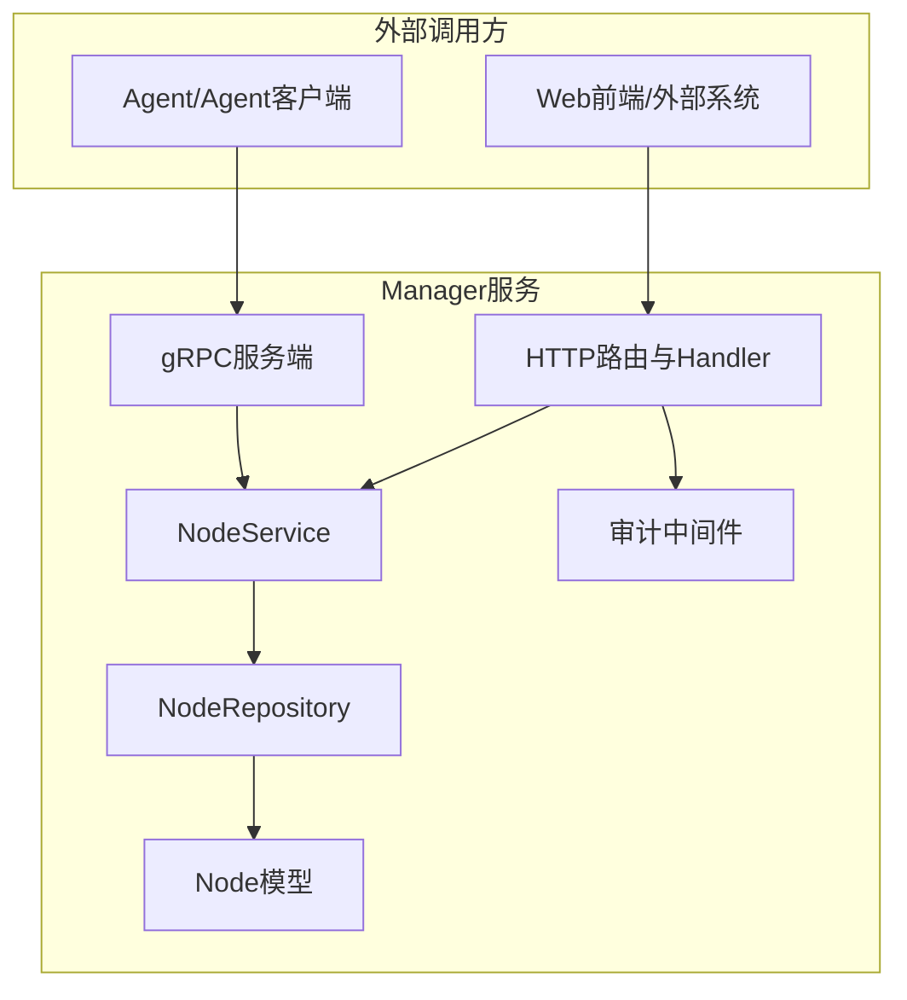
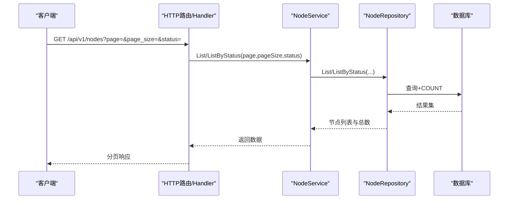
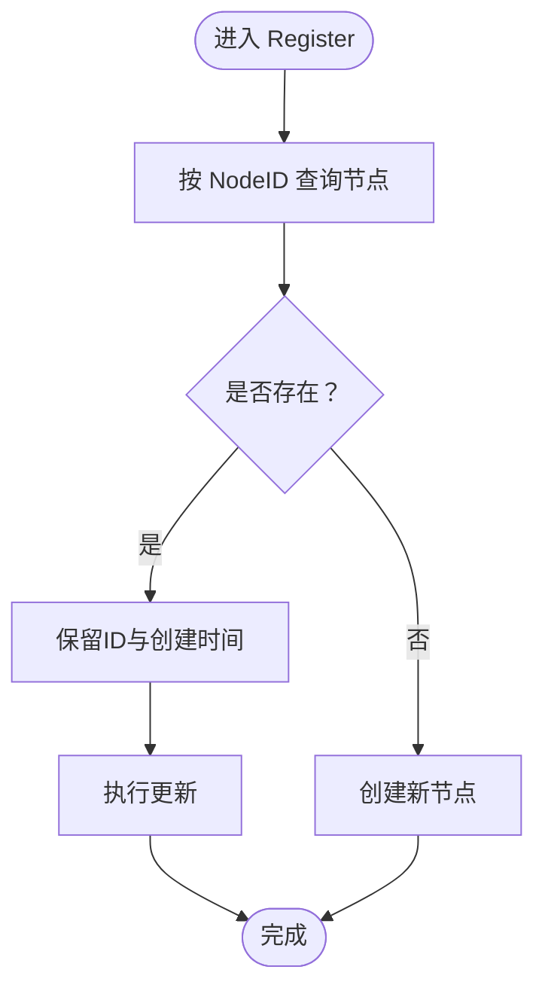
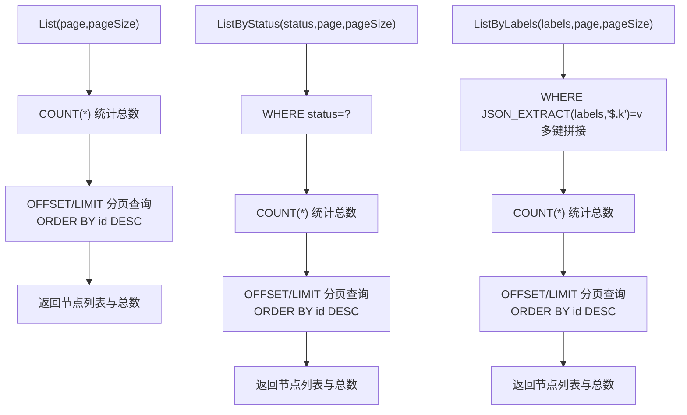
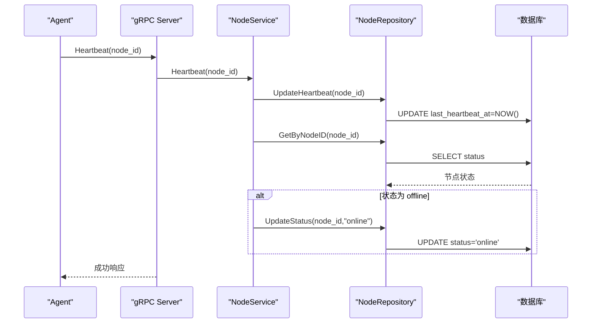
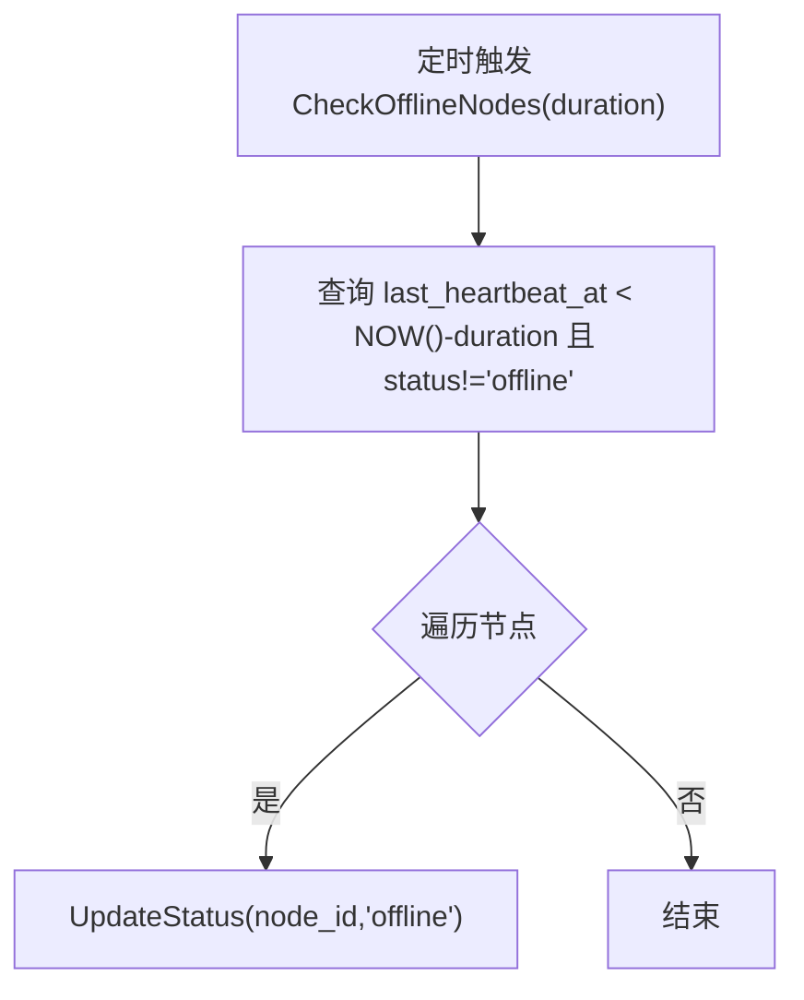
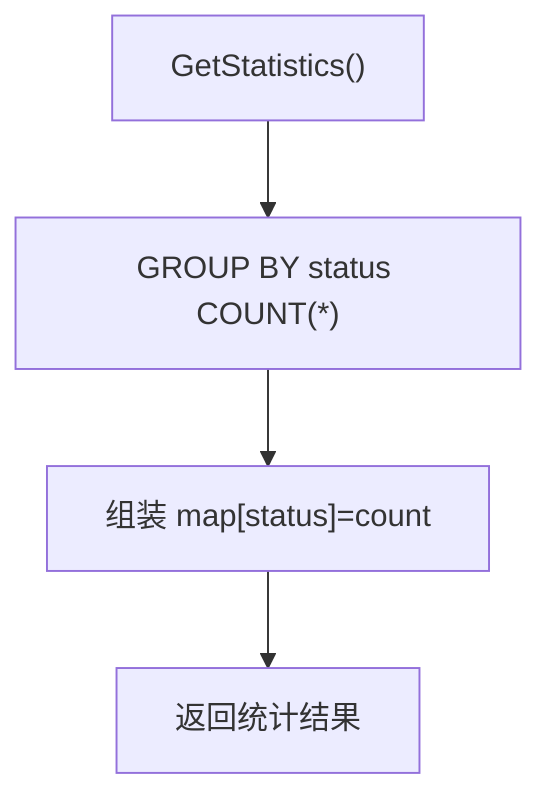
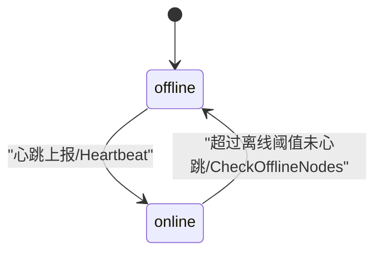
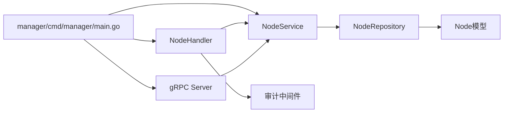

# 节点服务

<cite>
**本文引用的文件**
- [manager/cmd/manager/main.go](file://manager/cmd/manager/main.go)
- [manager/internal/grpc/server.go](file://manager/internal/grpc/server.go)
- [manager/internal/grpc/daemon_server.go](file://manager/internal/grpc/daemon_server.go)
- [manager/internal/service/node.go](file://manager/internal/service/node.go)
- [manager/internal/repository/node.go](file://manager/internal/repository/node.go)
- [manager/internal/model/node.go](file://manager/internal/model/node.go)
- [manager/internal/handler/node.go](file://manager/internal/handler/node.go)
- [manager/internal/middleware/audit.go](file://manager/internal/middleware/audit.go)
- [manager/pkg/proto/daemon/daemon.proto](file://manager/pkg/proto/daemon/daemon.proto)
- [daemon/internal/comm/grpc_client.go](file://daemon/internal/comm/grpc_client.go)
</cite>

## 目录
1. [简介](#简介)
2. [项目结构](#项目结构)
3. [核心组件](#核心组件)
4. [架构总览](#架构总览)
5. [详细组件分析](#详细组件分析)
6. [依赖关系分析](#依赖关系分析)
7. [性能考虑](#性能考虑)
8. [故障排查指南](#故障排查指南)
9. [结论](#结论)
10. [附录](#附录)

## 简介
本文件聚焦于“节点服务”的生命周期管理，围绕以下目标展开：
- Register 方法的节点注册与更新逻辑，包括节点存在性检查与审计日志记录
- GetByNodeID 与 List 的查询实现与分页机制
- UpdateStatus 与 Heartbeat 在节点状态管理中的作用，特别是心跳检测与离线状态转换逻辑
- CheckOfflineNodes 定时任务如何识别并更新离线节点
- GetStatistics 提供的节点统计功能
- 节点注册、心跳上报、批量查询等实际使用示例
- 节点状态转换图（online/offline）
- 高并发注册场景的性能优化与数据库事务处理最佳实践

## 项目结构
节点服务位于 Manager 侧，采用清晰的分层架构：
- Handler 层：对外暴露 HTTP API，负责参数解析、分页与响应封装
- Service 层：业务逻辑编排，协调 Repository 与审计日志
- Repository 层：数据访问接口与实现，封装 GORM 查询与更新
- Model 层：节点模型定义，含状态、标签、版本等字段
- gRPC 层：接收 Daemon/Agent 的注册与心跳上报
- 审计中间件：统一记录用户行为日志

图表来源
- [manager/cmd/manager/main.go](file://manager/cmd/manager/main.go#L136-L210)
- [manager/internal/handler/node.go](file://manager/internal/handler/node.go#L36-L69)
- [manager/internal/grpc/server.go](file://manager/internal/grpc/server.go#L34-L97)
- [manager/internal/service/node.go](file://manager/internal/service/node.go#L14-L40)
- [manager/internal/repository/node.go](file://manager/internal/repository/node.go#L11-L39)
- [manager/internal/model/node.go](file://manager/internal/model/node.go#L11-L38)
- [manager/internal/middleware/audit.go](file://manager/internal/middleware/audit.go#L12-L49)

章节来源
- [manager/cmd/manager/main.go](file://manager/cmd/manager/main.go#L136-L210)

## 核心组件
- NodeService 接口与实现：提供注册、查询、更新、删除、状态变更、心跳、离线检测、统计等能力
- NodeRepository 接口与实现：封装节点的增删改查、分页、按状态/标签过滤、心跳更新、离线节点查询、状态统计
- Node 模型：包含节点标识、主机名、IP、操作系统、架构、标签、版本、状态、最后心跳时间、注册时间等
- Handler：HTTP 层的节点 API，支持分页、按状态过滤、统计
- gRPC Server：接收 Agent 的注册与心跳上报
- 审计中间件：统一记录用户操作日志

章节来源
- [manager/internal/service/node.go](file://manager/internal/service/node.go#L14-L40)
- [manager/internal/repository/node.go](file://manager/internal/repository/node.go#L11-L39)
- [manager/internal/model/node.go](file://manager/internal/model/node.go#L11-L38)
- [manager/internal/handler/node.go](file://manager/internal/handler/node.go#L36-L69)
- [manager/internal/grpc/server.go](file://manager/internal/grpc/server.go#L34-L97)
- [manager/internal/middleware/audit.go](file://manager/internal/middleware/audit.go#L12-L49)

## 架构总览
节点生命周期管理涉及两条主要通路：
- HTTP 通路：Web/外部系统通过 HTTP 路由访问节点列表、详情与统计
- gRPC 通路：Agent 通过 gRPC 上报注册与心跳，Manager 写入节点状态并触发状态转换

图表来源
- [manager/internal/handler/node.go](file://manager/internal/handler/node.go#L36-L69)
- [manager/internal/service/node.go](file://manager/internal/service/node.go#L126-L154)
- [manager/internal/repository/node.go](file://manager/internal/repository/node.go#L86-L156)

## 详细组件分析

### Register 方法：节点注册与更新
- 存在性检查：先按 NodeID 查询是否存在
- 已存在：保留原 ID 与创建时间，执行更新
- 不存在：创建新节点
- 审计日志：当前实现未在 Register 中直接记录审计日志，但 HTTP 层有审计中间件，可覆盖到该 API

图表来源
- [manager/internal/service/node.go](file://manager/internal/service/node.go#L63-L91)
- [manager/internal/repository/node.go](file://manager/internal/repository/node.go#L51-L84)

章节来源
- [manager/internal/service/node.go](file://manager/internal/service/node.go#L63-L91)
- [manager/internal/repository/node.go](file://manager/internal/repository/node.go#L51-L84)

### GetByNodeID 与 List：查询与分页
- GetByNodeID：按 NodeID 查询单个节点，不存在返回特定错误
- List：支持分页与排序（按 ID 降序），同时返回总数
- ListByStatus：按状态过滤，同样支持分页与总数
- ListByLabels：按 JSON 标签键值过滤，支持多键组合

图表来源
- [manager/internal/service/node.go](file://manager/internal/service/node.go#L126-L154)
- [manager/internal/repository/node.go](file://manager/internal/repository/node.go#L86-L156)

章节来源
- [manager/internal/service/node.go](file://manager/internal/service/node.go#L93-L154)
- [manager/internal/repository/node.go](file://manager/internal/repository/node.go#L86-L156)

### UpdateStatus 与 Heartbeat：状态管理
- UpdateStatus：直接更新节点状态
- Heartbeat：
  - 更新 last_heartbeat_at
  - 若节点此前为 offline，则更新为 online
  - 该流程确保心跳可达时恢复在线状态

图表来源
- [manager/internal/grpc/server.go](file://manager/internal/grpc/server.go#L74-L97)
- [manager/internal/service/node.go](file://manager/internal/service/node.go#L166-L188)
- [manager/internal/repository/node.go](file://manager/internal/repository/node.go#L167-L174)

章节来源
- [manager/internal/grpc/server.go](file://manager/internal/grpc/server.go#L74-L97)
- [manager/internal/service/node.go](file://manager/internal/service/node.go#L166-L188)
- [manager/internal/repository/node.go](file://manager/internal/repository/node.go#L167-L174)

### CheckOfflineNodes：离线检测与批量更新
- 定时任务扫描 last_heartbeat_at 超过阈值且状态非 offline 的节点
- 将这些节点批量更新为 offline

图表来源
- [manager/internal/service/node.go](file://manager/internal/service/node.go#L203-L223)
- [manager/internal/repository/node.go](file://manager/internal/repository/node.go#L189-L199)

章节来源
- [manager/internal/service/node.go](file://manager/internal/service/node.go#L203-L223)
- [manager/internal/repository/node.go](file://manager/internal/repository/node.go#L189-L199)

### GetStatistics：节点统计
- 统计各状态节点数量，返回 map[string]int64
- Handler 层进一步汇总 total/online/offline，并兼容未知状态

图表来源
- [manager/internal/service/node.go](file://manager/internal/service/node.go#L225-L233)
- [manager/internal/repository/node.go](file://manager/internal/repository/node.go#L201-L225)
- [manager/internal/handler/node.go](file://manager/internal/handler/node.go#L116-L156)

章节来源
- [manager/internal/service/node.go](file://manager/internal/service/node.go#L225-L233)
- [manager/internal/repository/node.go](file://manager/internal/repository/node.go#L201-L225)
- [manager/internal/handler/node.go](file://manager/internal/handler/node.go#L116-L156)

### 节点状态转换图

图表来源
- [manager/internal/service/node.go](file://manager/internal/service/node.go#L166-L188)
- [manager/internal/service/node.go](file://manager/internal/service/node.go#L203-L223)

## 依赖关系分析
- 依赖注入：main 中集中初始化 Repository、Service、Handler、gRPC 与 Cron 调度器
- gRPC 与 HTTP：分别暴露注册与心跳的入口，统一由 NodeService 编排
- 审计：HTTP 层通过中间件记录用户行为，便于审计

图表来源
- [manager/cmd/manager/main.go](file://manager/cmd/manager/main.go#L77-L110)
- [manager/internal/handler/node.go](file://manager/internal/handler/node.go#L12-L24)
- [manager/internal/grpc/server.go](file://manager/internal/grpc/server.go#L13-L32)
- [manager/internal/service/node.go](file://manager/internal/service/node.go#L42-L61)
- [manager/internal/repository/node.go](file://manager/internal/repository/node.go#L41-L49)
- [manager/internal/model/node.go](file://manager/internal/model/node.go#L11-L38)
- [manager/internal/middleware/audit.go](file://manager/internal/middleware/audit.go#L12-L49)

章节来源
- [manager/cmd/manager/main.go](file://manager/cmd/manager/main.go#L77-L110)

## 性能考虑
- 高并发注册
  - 建议在 Register 前增加幂等校验（例如基于 NodeID 的唯一约束）以避免重复插入
  - 对批量注册场景，可考虑使用事务包裹 Create/Update，减少锁竞争
  - 使用连接池与合理的超时设置，避免阻塞
- 分页查询
  - List/ListByStatus 使用 OFFSET/LIMIT，建议在大数据量下配合索引与覆盖查询优化
  - 可引入“游标分页”或“基于主键范围”的分页策略以降低 OFFSET 开销
- 心跳与离线检测
  - Heartbeat 仅更新时间戳，避免频繁写入状态字段
  - CheckOfflineNodes 采用一次性扫描与批量更新，建议在低峰期运行或限流
- 审计日志
  - 审计中间件异步落库，避免阻塞主请求链路
- 数据库事务
  - 对需要强一致性的场景（如注册+审计），可在 Service 层开启事务，保证原子性

[本节为通用性能建议，不直接分析具体文件]

## 故障排查指南
- 注册失败
  - 检查 gRPC/HTTP 是否正确调用 Register，确认 NodeID 是否为空
  - 查看 Service 层日志与错误包装，定位数据库异常
- 心跳无响应
  - 确认 gRPC 心跳请求是否到达，查看 Heartbeat 处理日志
  - 检查 CheckOfflineNodes 是否定期执行，确认离线阈值设置合理
- 查询异常
  - List/ListByStatus/ListByLabels 返回总数为 0 或异常，检查 WHERE 条件与索引
- 统计不准确
  - 检查 GROUP BY 与 COUNT 的 SQL 是否执行，确认状态枚举一致性

章节来源
- [manager/internal/service/node.go](file://manager/internal/service/node.go#L63-L91)
- [manager/internal/service/node.go](file://manager/internal/service/node.go#L166-L188)
- [manager/internal/service/node.go](file://manager/internal/service/node.go#L203-L223)
- [manager/internal/handler/node.go](file://manager/internal/handler/node.go#L36-L69)

## 结论
节点服务通过清晰的分层与职责划分，实现了从注册、心跳、状态管理到离线检测与统计的完整生命周期闭环。结合 HTTP 与 gRPC 的双入口，既满足 Web 管理界面的查询与统计，也支持 Agent 的高频心跳上报。通过审计中间件与日志体系，具备良好的可观测性与可追溯性。后续可在分页策略、事务边界与批量更新等方面进一步优化以应对更高并发场景。

[本节为总结性内容，不直接分析具体文件]

## 附录

### 实际使用示例（路径指引）
- 节点注册（gRPC）
  - 客户端调用：参考 [daemon/internal/comm/grpc_client.go](file://daemon/internal/comm/grpc_client.go#L103-L142)
  - 服务端处理：参考 [manager/internal/grpc/server.go](file://manager/internal/grpc/server.go#L34-L72)
- 心跳上报（gRPC）
  - 客户端调用：参考 [daemon/internal/comm/grpc_client.go](file://daemon/internal/comm/grpc_client.go#L144-L175)
  - 服务端处理：参考 [manager/internal/grpc/server.go](file://manager/internal/grpc/server.go#L74-L97)
- 批量查询（HTTP）
  - 列表与分页：参考 [manager/internal/handler/node.go](file://manager/internal/handler/node.go#L36-L69)
  - 按状态查询：参考 [manager/internal/handler/node.go](file://manager/internal/handler/node.go#L53-L57)
- 离线检测（定时任务）
  - 触发与批量更新：参考 [manager/internal/service/node.go](file://manager/internal/service/node.go#L203-L223)
- 统计查询（HTTP）
  - 统计聚合：参考 [manager/internal/handler/node.go](file://manager/internal/handler/node.go#L116-L156)

### API 与消息定义（路径指引）
- gRPC 服务定义（DaemonService）：参考 [manager/pkg/proto/daemon/daemon.proto](file://manager/pkg/proto/daemon/daemon.proto#L1-L35)
- Register/Heartbeat 请求/响应字段：参考 [manager/pkg/proto/daemon/daemon.proto](file://manager/pkg/proto/daemon/daemon.proto#L37-L66)