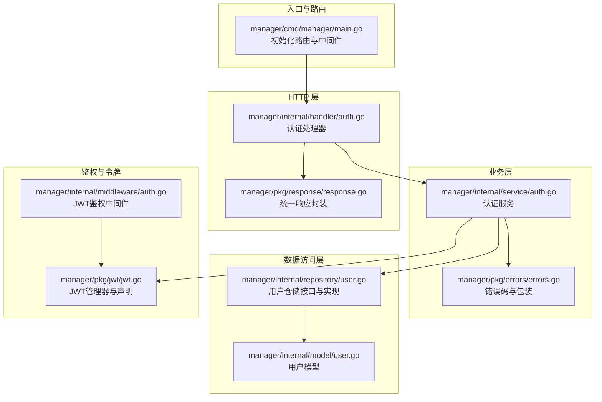
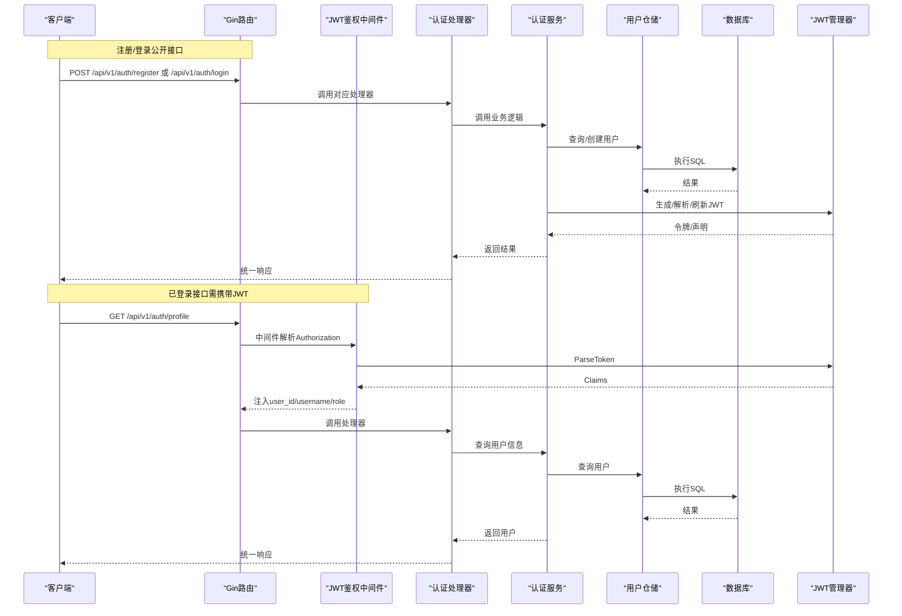
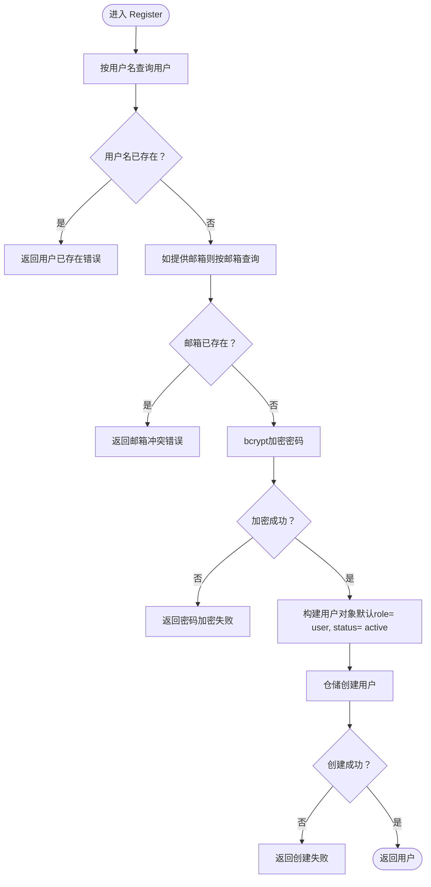
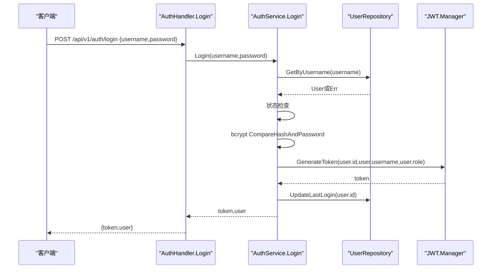
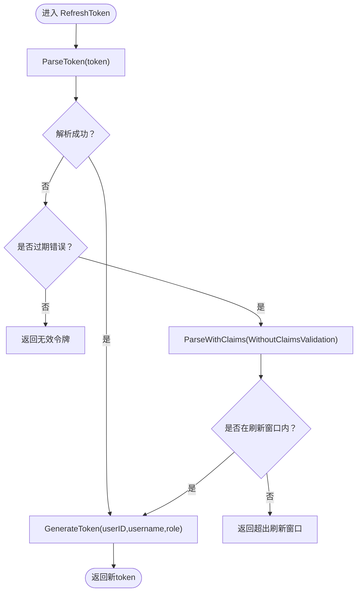
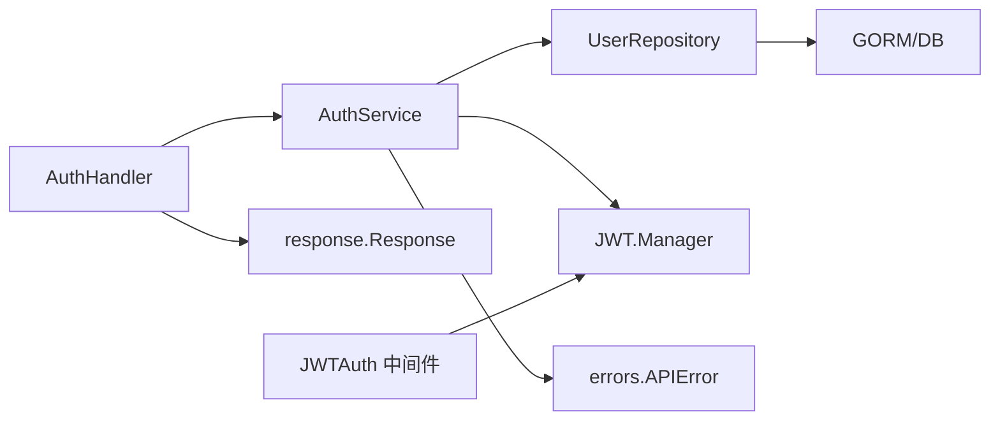

# 认证服务

<cite>
**本文引用的文件**
- [manager/cmd/manager/main.go](file://manager/cmd/manager/main.go)
- [manager/internal/handler/auth.go](file://manager/internal/handler/auth.go)
- [manager/internal/service/auth.go](file://manager/internal/service/auth.go)
- [manager/internal/repository/user.go](file://manager/internal/repository/user.go)
- [manager/internal/model/user.go](file://manager/internal/model/user.go)
- [manager/internal/middleware/auth.go](file://manager/internal/middleware/auth.go)
- [manager/pkg/jwt/jwt.go](file://manager/pkg/jwt/jwt.go)
- [manager/pkg/errors/errors.go](file://manager/pkg/errors/errors.go)
- [manager/pkg/response/response.go](file://manager/pkg/response/response.go)
</cite>

## 目录
1. [简介](#简介)
2. [项目结构](#项目结构)
3. [核心组件](#核心组件)
4. [架构总览](#架构总览)
5. [详细组件分析](#详细组件分析)
6. [依赖关系分析](#依赖关系分析)
7. [性能考量](#性能考量)
8. [故障排查指南](#故障排查指南)
9. [结论](#结论)
10. [附录](#附录)

## 简介
本文件面向“认证服务”的技术文档，聚焦用户认证与权限管理。内容涵盖：
- Register 方法的用户注册流程：用户名与邮箱唯一性校验、密码 bcrypt 加密、默认角色与状态设置、数据库持久化。
- Login 方法的登录流程：用户查找、状态检查、密码比对、JWT 令牌签发、最后登录时间更新。
- RefreshToken 的令牌刷新机制：基于过期时间窗口的刷新策略与新令牌生成。
- ChangePassword 与 ResetPassword 的密码管理流程：旧密码校验与管理员重置密码。
- ListUsers 与用户启禁用功能：分页查询、状态变更。
- JWT 令牌结构说明：payload 中的用户ID、用户名、角色及注册声明。
- 认证流程序列图：登录、鉴权、刷新全过程。
- 安全最佳实践：密码安全策略、JWT 密钥轮换、防暴力破解建议。

## 项目结构
认证服务位于 Manager 模块，采用经典的分层架构：
- Handler 层：处理 HTTP 请求与响应封装。
- Service 层：业务逻辑编排，调用 Repository 与 JWT 管理器。
- Repository 层：数据访问接口与实现，负责与数据库交互。
- Model 层：领域模型与基础工具方法。
- Middleware 层：JWT 鉴权与审计日志中间件。
- JWT 包：令牌生成、解析、刷新与声明结构。
- 错误与响应包：统一错误码与 HTTP 响应格式。

图表来源
- [manager/cmd/manager/main.go](file://manager/cmd/manager/main.go#L145-L210)
- [manager/internal/handler/auth.go](file://manager/internal/handler/auth.go#L1-L225)
- [manager/internal/service/auth.go](file://manager/internal/service/auth.go#L1-L287)
- [manager/internal/repository/user.go](file://manager/internal/repository/user.go#L1-L186)
- [manager/internal/model/user.go](file://manager/internal/model/user.go#L1-L43)
- [manager/internal/middleware/auth.go](file://manager/internal/middleware/auth.go#L1-L98)
- [manager/pkg/jwt/jwt.go](file://manager/pkg/jwt/jwt.go#L1-L140)
- [manager/pkg/errors/errors.go](file://manager/pkg/errors/errors.go#L1-L171)
- [manager/pkg/response/response.go](file://manager/pkg/response/response.go#L1-L145)

章节来源
- [manager/cmd/manager/main.go](file://manager/cmd/manager/main.go#L145-L210)

## 核心组件
- 认证处理器（AuthHandler）：暴露注册、登录、获取个人资料、修改密码、列出用户、启禁用用户等接口。
- 认证服务（AuthService）：实现注册、登录、刷新、密码变更/重置、用户查询与状态变更。
- 用户仓储（UserRepository）：提供用户创建、查询、更新密码、更新状态、分页查询等能力。
- JWT 管理器（Manager）：生成、解析、刷新 JWT，并提供声明结构（含用户ID、用户名、角色与注册声明）。
- 鉴权中间件（JWTAuth）：从 Authorization 头解析 Bearer Token，注入用户上下文。
- 错误与响应：统一错误码、HTTP 状态映射与响应体格式。

章节来源
- [manager/internal/handler/auth.go](file://manager/internal/handler/auth.go#L1-L225)
- [manager/internal/service/auth.go](file://manager/internal/service/auth.go#L1-L287)
- [manager/internal/repository/user.go](file://manager/internal/repository/user.go#L1-L186)
- [manager/pkg/jwt/jwt.go](file://manager/pkg/jwt/jwt.go#L1-L140)
- [manager/internal/middleware/auth.go](file://manager/internal/middleware/auth.go#L1-L98)
- [manager/pkg/errors/errors.go](file://manager/pkg/errors/errors.go#L1-L171)
- [manager/pkg/response/response.go](file://manager/pkg/response/response.go#L1-L145)

## 架构总览
认证服务遵循“请求-处理器-服务-仓储-数据库”的调用链路，同时通过 JWT 中间件实现无状态鉴权。

图表来源
- [manager/cmd/manager/main.go](file://manager/cmd/manager/main.go#L153-L210)
- [manager/internal/handler/auth.go](file://manager/internal/handler/auth.go#L1-L225)
- [manager/internal/service/auth.go](file://manager/internal/service/auth.go#L1-L287)
- [manager/internal/repository/user.go](file://manager/internal/repository/user.go#L1-L186)
- [manager/pkg/jwt/jwt.go](file://manager/pkg/jwt/jwt.go#L1-L140)
- [manager/internal/middleware/auth.go](file://manager/internal/middleware/auth.go#L1-L98)

## 详细组件分析

### 注册 Register（用户名与邮箱唯一性校验、bcrypt 加密、默认角色与状态）
- 唯一性校验
  - 按用户名查询，若存在则返回“用户已存在”错误。
  - 若提供邮箱，则按邮箱查询，若存在则返回“邮箱已被使用”冲突错误。
- 密码加密
  - 使用 bcrypt 对明文密码进行哈希，失败时返回“密码加密失败”。
- 默认值
  - 角色默认为“user”，状态默认为“active”。
- 持久化
  - 调用仓储创建用户，失败返回“创建用户失败”。

图表来源
- [manager/internal/service/auth.go](file://manager/internal/service/auth.go#L66-L114)
- [manager/internal/repository/user.go](file://manager/internal/repository/user.go#L48-L51)
- [manager/internal/model/user.go](file://manager/internal/model/user.go#L9-L27)

章节来源
- [manager/internal/service/auth.go](file://manager/internal/service/auth.go#L66-L114)
- [manager/internal/repository/user.go](file://manager/internal/repository/user.go#L48-L51)
- [manager/internal/model/user.go](file://manager/internal/model/user.go#L9-L27)

### 登录 Login（凭据验证与JWT签发）
- 用户查找与状态检查
  - 按用户名查询用户，不存在返回“无效凭据”。
  - 用户状态非“active”返回“用户已禁用”。
- 密码校验
  - 使用 bcrypt 比对哈希，失败返回“无效凭据”。
- 令牌签发
  - 调用 JWT 管理器生成令牌，失败返回“生成Token失败”。
- 最后登录时间更新
  - 异步尝试更新最后登录时间，失败仅记录告警。

图表来源
- [manager/internal/handler/auth.go](file://manager/internal/handler/auth.go#L71-L96)
- [manager/internal/service/auth.go](file://manager/internal/service/auth.go#L116-L153)
- [manager/internal/repository/user.go](file://manager/internal/repository/user.go#L63-L81)
- [manager/pkg/jwt/jwt.go](file://manager/pkg/jwt/jwt.go#L43-L61)

章节来源
- [manager/internal/handler/auth.go](file://manager/internal/handler/auth.go#L71-L96)
- [manager/internal/service/auth.go](file://manager/internal/service/auth.go#L116-L153)
- [manager/internal/repository/user.go](file://manager/internal/repository/user.go#L63-L81)
- [manager/pkg/jwt/jwt.go](file://manager/pkg/jwt/jwt.go#L43-L61)

### 刷新令牌 RefreshToken（过期窗口内的刷新）
- 解析旧令牌
  - 正常解析失败且为“过期”错误时，尝试解析过期令牌（WithoutClaimsValidation），并检查过期时间是否在允许刷新窗口内（示例为7天）。
- 生成新令牌
  - 使用旧令牌中的用户ID、用户名、角色生成新令牌。

图表来源
- [manager/internal/service/auth.go](file://manager/internal/service/auth.go#L162-L169)
- [manager/pkg/jwt/jwt.go](file://manager/pkg/jwt/jwt.go#L96-L128)

章节来源
- [manager/internal/service/auth.go](file://manager/internal/service/auth.go#L162-L169)
- [manager/pkg/jwt/jwt.go](file://manager/pkg/jwt/jwt.go#L96-L128)

### 修改密码 ChangePassword（旧密码校验与新密码加密）
- 用户查询
  - 按ID查询用户，不存在返回“用户不存在”。
- 旧密码校验
  - bcrypt 比对失败返回“旧密码错误”。
- 新密码加密与更新
  - bcrypt 加密新密码，失败返回“密码加密失败”。
  - 更新数据库密码，失败返回“更新密码失败”。

章节来源
- [manager/internal/service/auth.go](file://manager/internal/service/auth.go#L171-L204)
- [manager/internal/repository/user.go](file://manager/internal/repository/user.go#L169-L176)

### 重置密码 ResetPassword（管理员操作）
- 新密码加密
  - bcrypt 加密新密码，失败返回“密码加密失败”。
- 更新数据库密码
  - 失败返回“重置密码失败”。

章节来源
- [manager/internal/service/auth.go](file://manager/internal/service/auth.go#L206-L224)
- [manager/internal/repository/user.go](file://manager/internal/repository/user.go#L169-L176)

### 列表与启禁用 ListUsers 与用户启禁用
- 列表查询
  - 分页查询用户列表与总数，失败返回“查询用户列表失败”。
- 启用/禁用
  - 更新用户状态为“active”或“disabled”，失败返回对应错误。

章节来源
- [manager/internal/service/auth.go](file://manager/internal/service/auth.go#L269-L277)
- [manager/internal/service/auth.go](file://manager/internal/service/auth.go#L249-L267)
- [manager/internal/repository/user.go](file://manager/internal/repository/user.go#L93-L112)
- [manager/internal/repository/user.go](file://manager/internal/repository/user.go#L178-L185)

### JWT 令牌结构说明
- 声明结构（Claims）
  - user_id：用户ID
  - username：用户名
  - role：角色（admin/user）
  - RegisteredClaims：issuer、issued_at、expires_at、not_before
- 管理器能力
  - GenerateToken：签发令牌
  - ParseToken：解析并验证令牌
  - ValidateToken：仅验证有效性
  - RefreshToken：在允许窗口内刷新令牌

章节来源
- [manager/pkg/jwt/jwt.go](file://manager/pkg/jwt/jwt.go#L19-L26)
- [manager/pkg/jwt/jwt.go](file://manager/pkg/jwt/jwt.go#L43-L61)
- [manager/pkg/jwt/jwt.go](file://manager/pkg/jwt/jwt.go#L63-L88)
- [manager/pkg/jwt/jwt.go](file://manager/pkg/jwt/jwt.go#L96-L128)

### 鉴权中间件与权限控制
- JWTAuth
  - 从 Authorization 头提取 Bearer Token，解析失败返回相应错误。
  - 成功后将 user_id、username、role 注入上下文，供后续处理器使用。
- RequireAdmin
  - 仅允许 role 为“admin”的请求通过。

章节来源
- [manager/internal/middleware/auth.go](file://manager/internal/middleware/auth.go#L12-L49)
- [manager/internal/middleware/auth.go](file://manager/internal/middleware/auth.go#L52-L69)

## 依赖关系分析
- Handler 依赖 Service 接口，便于替换实现与测试。
- Service 依赖 Repository 接口与 JWT 管理器，职责清晰。
- Repository 依赖 GORM，提供统一的数据访问抽象。
- 错误与响应包被广泛复用，保证一致的错误语义与HTTP状态映射。

图表来源
- [manager/internal/handler/auth.go](file://manager/internal/handler/auth.go#L1-L225)
- [manager/internal/service/auth.go](file://manager/internal/service/auth.go#L1-L287)
- [manager/internal/repository/user.go](file://manager/internal/repository/user.go#L1-L186)
- [manager/pkg/jwt/jwt.go](file://manager/pkg/jwt/jwt.go#L1-L140)
- [manager/pkg/errors/errors.go](file://manager/pkg/errors/errors.go#L1-L171)
- [manager/pkg/response/response.go](file://manager/pkg/response/response.go#L1-L145)
- [manager/internal/middleware/auth.go](file://manager/internal/middleware/auth.go#L1-L98)

章节来源
- [manager/internal/handler/auth.go](file://manager/internal/handler/auth.go#L1-L225)
- [manager/internal/service/auth.go](file://manager/internal/service/auth.go#L1-L287)
- [manager/internal/repository/user.go](file://manager/internal/repository/user.go#L1-L186)
- [manager/pkg/jwt/jwt.go](file://manager/pkg/jwt/jwt.go#L1-L140)
- [manager/pkg/errors/errors.go](file://manager/pkg/errors/errors.go#L1-L171)
- [manager/pkg/response/response.go](file://manager/pkg/response/response.go#L1-L145)
- [manager/internal/middleware/auth.go](file://manager/internal/middleware/auth.go#L1-L98)

## 性能考量
- bcrypt 密码加密成本较高，建议在高并发场景下：
  - 合理设置 bcrypt 默认成本，避免过高导致CPU占用。
  - 在登录与注册高峰时段适当限流，减少瞬时压力。
- JWT 为无状态令牌，解析与签发开销较小，但需注意：
  - 避免在 payload 中放入过大负载，以降低解析与传输成本。
  - 控制令牌有效期，平衡用户体验与安全。
- 数据库层面：
  - 用户名与邮箱建立唯一索引，避免重复写入引发锁竞争。
  - 分页查询使用 LIMIT/OFFSET，注意大数据量下的排序与索引优化。

## 故障排查指南
- 常见错误码与含义
  - 1002 未授权、1007 Token无效、1008 Token过期、1009 无效凭据
  - 2007 用户不存在、2008 用户已禁用、2009 用户已存在
  - 5001 服务器内部错误、5002 数据库错误
- 响应状态映射
  - 401：未授权、Token无效、Token过期、无效凭据
  - 403：禁止访问、用户已禁用
  - 404：资源不存在
  - 409：资源冲突（如用户名/邮箱已存在）
  - 429：请求过多
  - 500：服务器内部错误
- 排查步骤
  - 登录失败：确认用户名是否存在、状态是否为“active”、密码是否正确。
  - Token无效/过期：检查 Authorization 头格式是否为“Bearer xxx”、令牌是否在有效期内、是否超过刷新窗口。
  - 注册失败：检查用户名与邮箱唯一性约束、bcrypt 加密是否成功、数据库连接是否正常。
  - 启禁用失败：确认调用者具备管理员权限、用户ID是否有效。

章节来源
- [manager/pkg/errors/errors.go](file://manager/pkg/errors/errors.go#L1-L171)
- [manager/pkg/response/response.go](file://manager/pkg/response/response.go#L1-L145)
- [manager/internal/service/auth.go](file://manager/internal/service/auth.go#L116-L153)
- [manager/internal/middleware/auth.go](file://manager/internal/middleware/auth.go#L12-L49)

## 结论
该认证服务以清晰的分层设计实现了完整的用户认证与权限管理能力：注册时进行唯一性校验与密码加密，登录时严格校验凭据并签发JWT，支持刷新令牌与密码管理，提供用户列表与启禁用管理。配合统一的错误与响应体系、JWT中间件与审计日志，整体具备良好的可维护性与安全性。建议在生产环境中结合限流、密钥轮换与安全加固策略进一步提升抗攻击能力。

## 附录
- 安全最佳实践
  - 密码安全策略
    - 强制最小长度与复杂度要求（如字母+数字+特殊字符组合）。
    - 定期强制修改密码，限制历史密码复用。
    - 对弱密码字典进行黑名单校验。
  - JWT 密钥轮换
    - 定期轮换密钥，旧密钥保留短期过渡期，确保新旧密钥并行验证与平滑切换。
    - 严格保密密钥，避免硬编码与泄露。
  - 防暴力破解
    - 登录失败次数限制与临时封禁策略（如15分钟内最多5次失败即锁定）。
    - IP/设备维度统计与风控规则联动。
    - 使用验证码或二次验证（TOTP）增强防护。
  - 其他
    - 令牌有效期不宜过长，结合刷新窗口策略。
    - 审计日志记录关键操作，便于追踪与溯源。
    - 对外暴露的接口尽量最小化，内部接口使用更严格的权限控制。