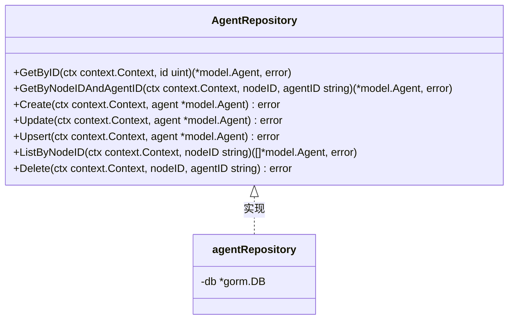
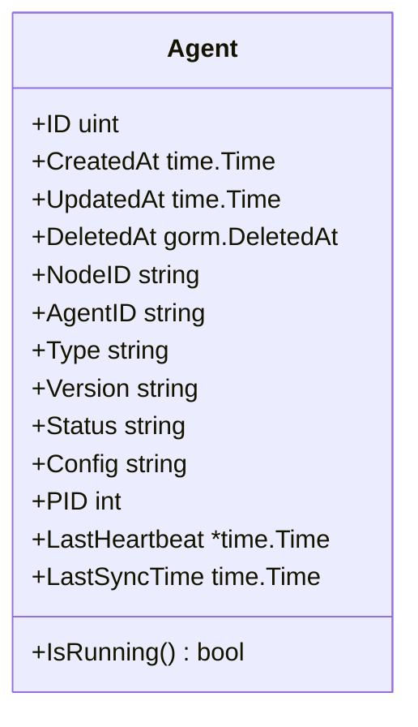
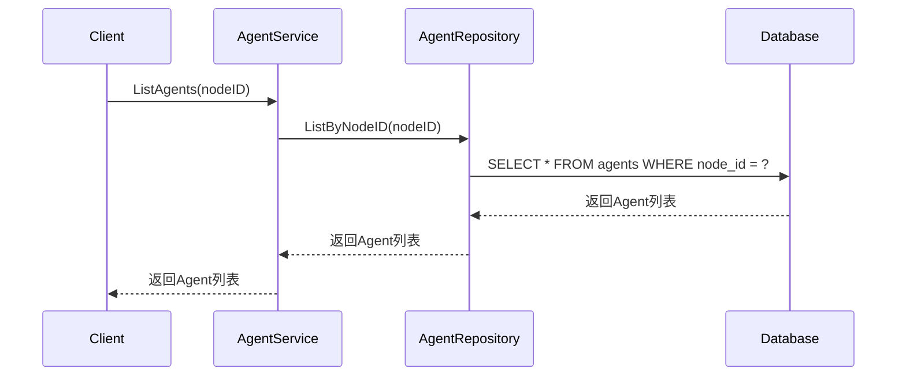
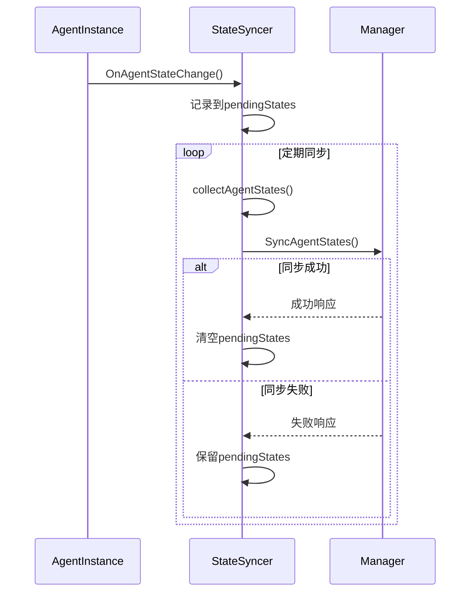
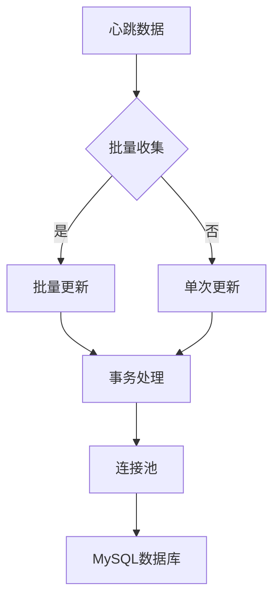
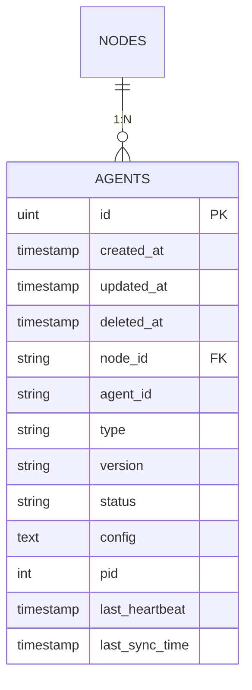

# Agent数据访问

<cite>
**本文档引用的文件**   
- [agent.go](file://manager/internal/model/agent.go)
- [agent.go](file://manager/internal/repository/agent.go)
- [agent.go](file://manager/internal/service/agent.go)
- [schema.sql](file://config/mysql/schema.sql)
- [database.go](file://manager/pkg/database/database.go)
- [config.go](file://manager/internal/config/config.go)
- [state_syncer.go](file://daemon/internal/agent/state_syncer.go)
- [heartbeat.go](file://daemon/internal/agent/heartbeat.go)
- [multi_manager.go](file://daemon/internal/agent/multi_manager.go)
- [registry.go](file://daemon/internal/agent/registry.go)
</cite>

## 目录
1. [引言](#引言)
2. [AgentRepo实现机制](#agentrepo实现机制)
3. [Agent状态持久化管理](#agent状态持久化管理)
4. [Agent与节点关联关系处理](#agent与节点关联关系处理)
5. [数据一致性保障](#数据一致性保障)
6. [心跳更新高性能写入优化](#心跳更新高性能写入优化)
7. [agents表结构与索引优化](#agents表结构与索引优化)
8. [结论](#结论)

## 引言

本技术文档详细阐述了运维框架中Agent数据访问组件的实现机制，重点分析AgentRepo的实现细节。文档涵盖了Agent状态持久化管理、Agent与节点的关联关系处理、数据一致性保障机制以及心跳更新的高性能写入优化方案。通过结合schema.sql中的agents表结构，详细说明了关键字段的设计考量和索引优化策略。

**Section sources**
- [agent.go](file://manager/internal/model/agent.go#L1-L53)
- [schema.sql](file://config/mysql/schema.sql#L1-L5)

## AgentRepo实现机制

AgentRepo是Agent数据访问的核心组件，通过GORM ORM框架实现对数据库的CRUD操作。该组件采用Repository设计模式，提供了清晰的接口定义和实现分离。

AgentRepository接口定义了以下核心方法：
- `GetByID`: 根据ID获取Agent
- `GetByNodeIDAndAgentID`: 根据节点ID和AgentID获取Agent
- `Create`: 创建Agent
- `Update`: 更新Agent
- `Upsert`: 创建或更新Agent（如果不存在则创建，存在则更新）
- `ListByNodeID`: 根据节点ID列举所有Agent
- `Delete`: 删除Agent

`agentRepository`结构体实现了上述接口，通过`db *gorm.DB`字段持有数据库连接。`NewAgentRepository`函数用于创建AgentRepository实例，接受GORM数据库连接作为参数。



**Diagram sources **
- [agent.go](file://manager/internal/repository/agent.go#L11-L33)
- [agent.go](file://manager/internal/repository/agent.go#L35-L44)

**Section sources**
- [agent.go](file://manager/internal/repository/agent.go#L1-L138)

## Agent状态持久化管理

Agent状态持久化管理通过`Agent`模型和`agentRepository`实现，涵盖了Agent进程信息、资源使用率和运行状态的更新策略。

### Agent模型设计

`Agent`模型定义了Agent的核心属性，包括：

- `NodeID`: 节点ID，外键关联到nodes表
- `AgentID`: Agent唯一标识符，在节点内唯一
- `Type`: Agent类型（如filebeat、telegraf、node_exporter等）
- `Version`: Agent版本号
- `Status`: 运行状态（running/stopped/error/starting/stopping）
- `Config`: Agent配置（JSON格式）
- `PID`: 进程ID（0表示未运行）
- `LastHeartbeat`: 最后心跳时间
- `LastSyncTime`: 最后同步时间



**Diagram sources **
- [agent.go](file://manager/internal/model/agent.go#L9-L53)

### 状态更新策略

Agent状态更新主要通过以下机制实现：

1. **心跳更新**: Daemon通过`StateSyncer`组件定期向Manager上报Agent状态
2. **操作触发**: 当执行启动、停止、重启等操作时，立即更新状态
3. **批量同步**: `SyncAgentStates`方法支持批量更新多个Agent的状态

`Upsert`方法实现了"存在则更新，不存在则创建"的逻辑，首先尝试通过`GetByNodeIDAndAgentID`查找现有记录，如果不存在则调用`Create`方法创建，否则调用`Update`方法更新。

**Section sources**
- [agent.go](file://manager/internal/model/agent.go#L9-L53)
- [agent.go](file://manager/internal/repository/agent.go#L93-L110)

## Agent与节点关联关系处理

Agent与节点的关联关系通过`NodeID`字段实现，该字段作为外键关联到nodes表，确保了数据的完整性和一致性。

### 关联关系实现

在`Agent`模型中，`NodeID`字段被定义为非空且带有索引，确保了每个Agent必须关联到一个有效的节点。

```go
NodeID string `gorm:"index:idx_node_agent;size:50;not null" json:"node_id"`
```

这种设计实现了以下功能：

1. **数据完整性**: 通过非空约束确保每个Agent都有对应的节点
2. **查询效率**: 通过索引`idx_node_agent`提高基于节点ID的查询性能
3. **批量操作**: 支持通过`ListByNodeID`方法获取指定节点下的所有Agent

### 关联查询

`ListByNodeID`方法实现了基于节点ID的批量查询功能，使用GORM的`Where`条件查询所有关联到指定节点的Agent。



**Diagram sources **
- [agent.go](file://manager/internal/repository/agent.go#L28-L32)
- [agent.go](file://manager/internal/repository/agent.go#L112-L124)

**Section sources**
- [agent.go](file://manager/internal/model/agent.go#L16-L17)
- [agent.go](file://manager/internal/repository/agent.go#L112-L124)

## 数据一致性保障

系统通过多种机制确保Agent状态变更时的数据一致性，包括事务处理、状态同步和错误处理。

### 事务处理

在`SyncAgentStates`方法中，使用了GORM的事务机制确保批量更新的原子性。整个同步过程在一个事务中执行，如果任何Agent的更新失败，整个事务将回滚。

```go
err := database.DB.Transaction(func(tx *gorm.DB) error {
    // 创建临时repository使用事务
    txAgentRepo := repository.NewAgentRepository(tx)
    
    // 处理每个Agent状态
    for _, protoState := range states {
        // ... 状态处理逻辑
    }
    
    return nil
})
```

### 状态同步机制

`StateSyncer`组件负责将Daemon端的Agent状态同步到Manager端，其核心流程如下：

1. 监听Agent状态变化，将变化记录到`pendingStates`缓存中
2. 定期（默认30秒）执行同步循环
3. 收集所有Agent的当前状态
4. 合并`pendingStates`中的待同步状态
5. 调用Manager的`SyncAgentStates`方法进行同步

如果同步失败，`pendingStates`中的状态会被保留，等待下一次同步尝试，确保状态不会丢失。



**Diagram sources **
- [agent.go](file://manager/internal/service/agent.go#L48-L139)
- [state_syncer.go](file://daemon/internal/agent/state_syncer.go#L226-L258)

**Section sources**
- [agent.go](file://manager/internal/service/agent.go#L48-L139)
- [state_syncer.go](file://daemon/internal/agent/state_syncer.go#L226-L258)

## 心跳更新高性能写入优化

系统通过批量更新和连接池调优实现了心跳更新的高性能写入。

### 批量更新策略

`SyncAgentStates`方法支持批量更新多个Agent的状态，减少了数据库连接的建立和关闭开销。通过单次事务处理多个Agent的状态更新，显著提高了写入性能。

```go
func (s *AgentService) SyncAgentStates(ctx context.Context, nodeID string, states []*daemonpb.AgentState) error {
    // 使用事务确保数据一致性
    err := database.DB.Transaction(func(tx *gorm.DB) error {
        txAgentRepo := repository.NewAgentRepository(tx)
        
        for _, protoState := range states {
            // 处理每个Agent状态
            // ...
        }
        
        return nil
    })
    // ...
}
```

### 连接池调优

数据库连接池通过`DatabaseConfig`配置进行优化，关键参数包括：

- `MaxIdleConns`: 最大空闲连接数
- `MaxOpenConns`: 最大打开连接数
- `ConnMaxLifetime`: 连接最大生命周期

这些参数在`database/database.go`中通过`sqlDB.SetMaxIdleConns`、`sqlDB.SetMaxOpenConns`和`sqlDB.SetConnMaxLifetime`方法进行设置。



**Diagram sources **
- [agent.go](file://manager/internal/service/agent.go#L48-L139)
- [database.go](file://manager/pkg/database/database.go#L60-L63)

**Section sources**
- [agent.go](file://manager/internal/service/agent.go#L48-L139)
- [database.go](file://manager/pkg/database/database.go#L60-L63)
- [config.go](file://manager/internal/config/config.go#L34-L36)

## agents表结构与索引优化

通过分析`schema.sql`文件，可以详细了解agents表的结构设计和索引优化策略。

### 表结构设计

```sql
-- 创建数据库（如果不存在）
CREATE DATABASE IF NOT EXISTS ops_manager_dev CHARACTER SET utf8mb4 COLLATE utf8mb4_unicode_ci;

USE ops_manager_dev;

-- agents表结构在GORM模型中定义，通过AutoMigrate自动创建
```

### 字段设计考量

根据`Agent`模型的GORM标签，关键字段的设计考量如下：

- `NodeID`和`AgentID`: 联合索引`idx_node_agent`，确保在节点内AgentID的唯一性，同时优化基于节点的查询性能
- `Status`: 单独索引`idx_status`，优化基于状态的查询（如查找所有运行中的Agent）
- `CreatedAt`和`UpdatedAt`: GORM自动管理的时间戳字段
- `DeletedAt`: 软删除标记，支持数据恢复

### 索引优化策略

系统采用了以下索引优化策略：

1. **复合索引**: `idx_node_agent`索引同时包含`NodeID`和`AgentID`，优化了`GetByNodeIDAndAgentID`查询
2. **状态索引**: `idx_status`索引优化了基于状态的查询
3. **软删除索引**: `DeletedAt`字段的索引优化了软删除查询



**Diagram sources **
- [schema.sql](file://config/mysql/schema.sql#L1-L5)
- [agent.go](file://manager/internal/model/agent.go#L16-L20)
- [agent.go](file://manager/internal/model/agent.go#L28-L30)

**Section sources**
- [schema.sql](file://config/mysql/schema.sql#L1-L5)
- [agent.go](file://manager/internal/model/agent.go#L16-L30)

## 结论

Agent数据访问组件通过精心设计的Repository模式、高效的状态管理机制和优化的数据库访问策略，实现了高性能、高可靠性的Agent状态持久化管理。系统通过事务处理、批量更新和连接池调优确保了数据一致性和写入性能，同时通过合理的表结构设计和索引优化提升了查询效率。这种架构设计为大规模Agent管理提供了坚实的基础。