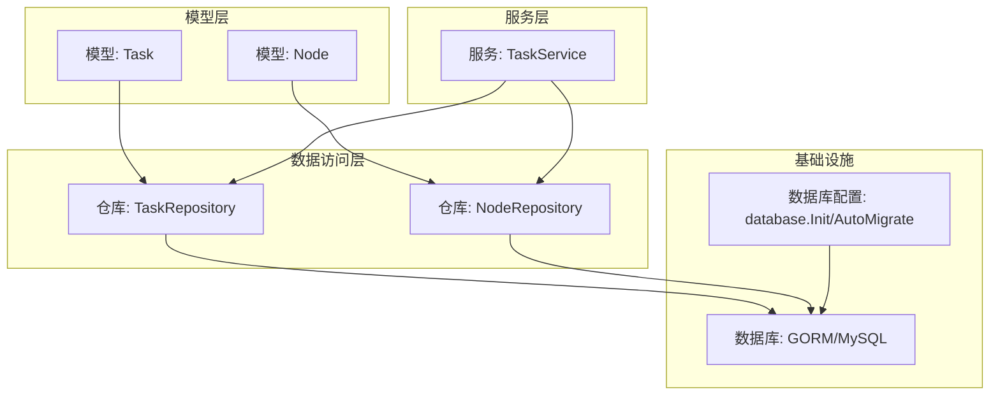
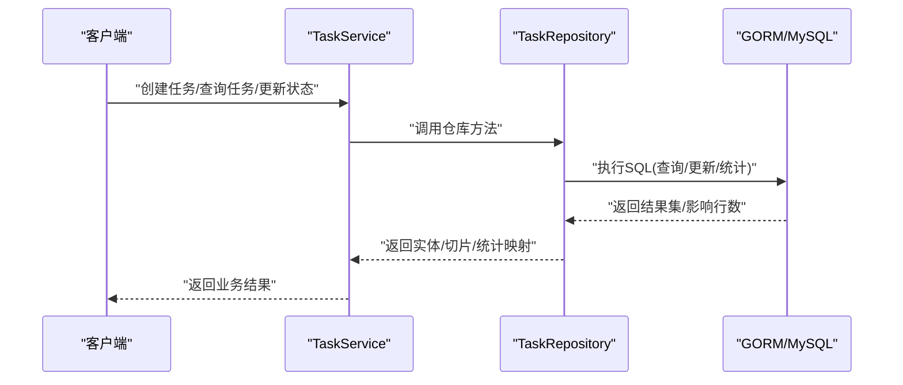
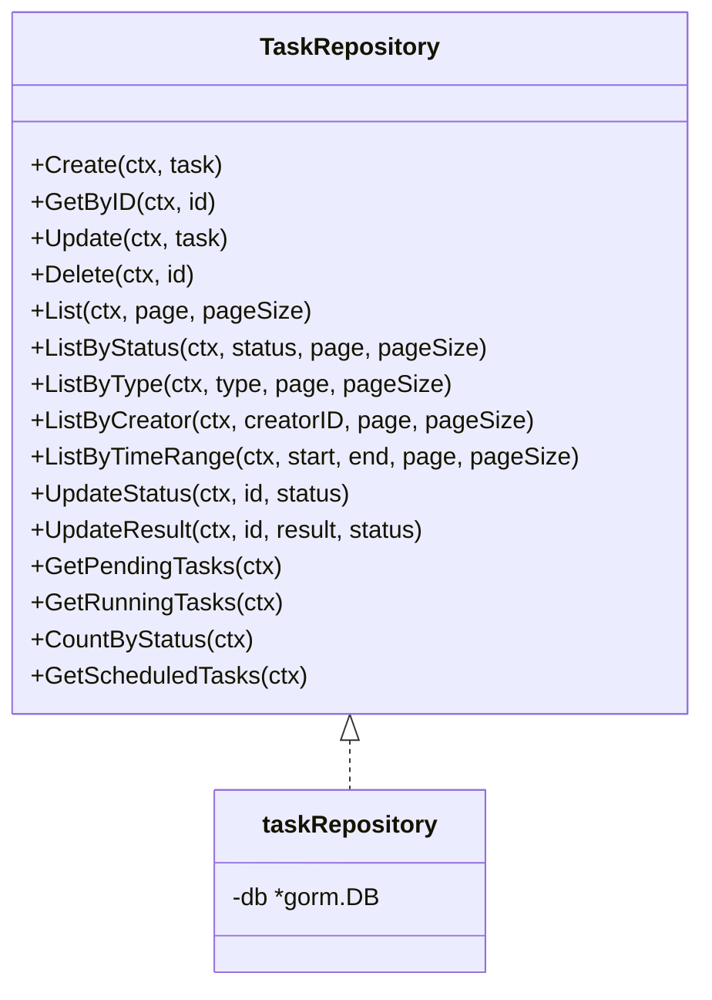
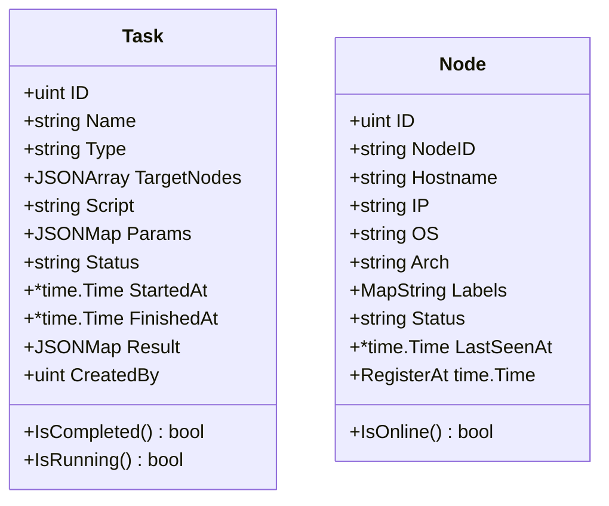
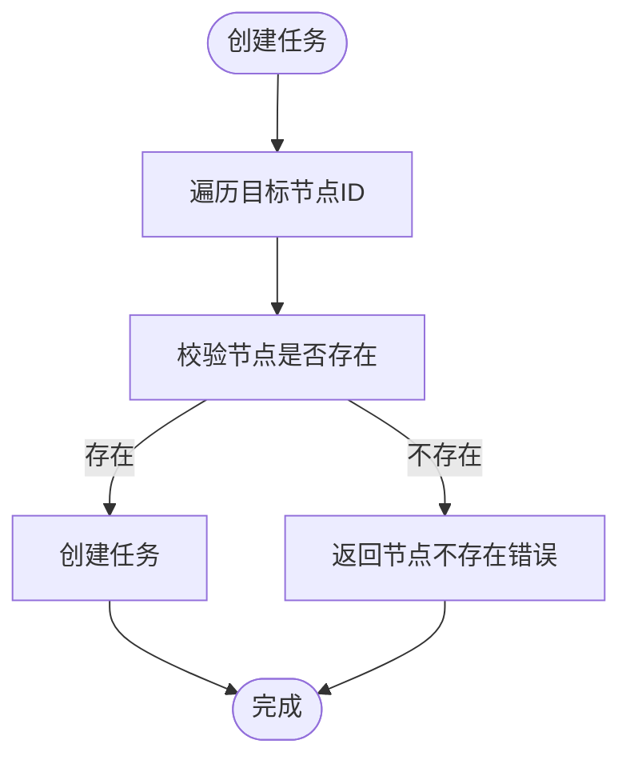
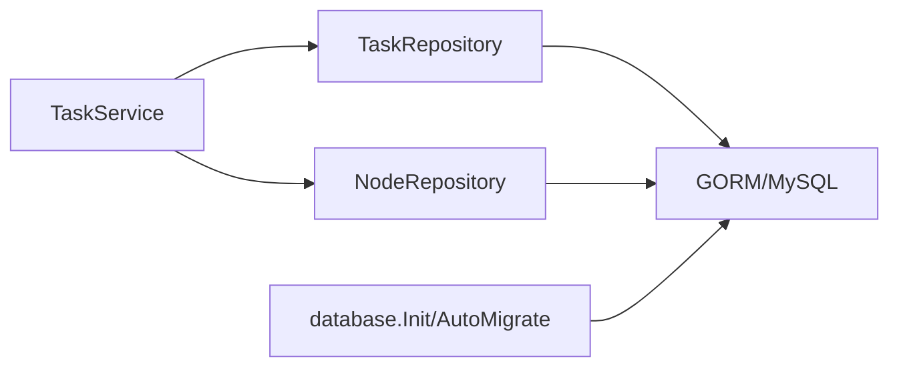

# 任务数据访问

<cite>
**本文引用的文件**
- [manager/internal/repository/task.go](file://manager/internal/repository/task.go)
- [manager/internal/model/task.go](file://manager/internal/model/task.go)
- [manager/internal/service/task.go](file://manager/internal/service/task.go)
- [manager/internal/repository/node.go](file://manager/internal/repository/node.go)
- [manager/internal/model/node.go](file://manager/internal/model/node.go)
- [manager/pkg/database/database.go](file://manager/pkg/database/database.go)
- [docs/设计文档_03_Manager模块.md](file://docs/设计文档_03_Manager模块.md)
- [docs/运维工具框架需求文档.md](file://docs/运维工具框架需求文档.md)
</cite>

## 目录
1. [简介](#简介)
2. [项目结构](#项目结构)
3. [核心组件](#核心组件)
4. [架构总览](#架构总览)
5. [详细组件分析](#详细组件分析)
6. [依赖分析](#依赖分析)
7. [性能考量](#性能考量)
8. [故障排查指南](#故障排查指南)
9. [结论](#结论)
10. [附录](#附录)

## 简介
本文件聚焦于任务数据访问组件，系统性阐述 TaskRepo 的实现机制与数据访问逻辑，覆盖以下关键主题：
- 任务与执行记录的数据访问逻辑，包括即时任务与定时任务的存储结构
- 任务执行记录的批量插入与状态更新策略
- 任务结果查询的分页与过滤实现
- 任务与节点关联的多对多关系处理
- 任务执行历史的数据归档方案
- 基于 schema.sql 中 tasks 与 task_executions 表结构，说明索引设计对任务调度性能的影响

## 项目结构
围绕任务数据访问的相关模块分布如下：
- 数据模型：任务模型与节点模型
- 数据访问层：任务仓库与节点仓库
- 服务层：任务服务，协调仓库与节点仓库
- 数据库初始化与迁移：数据库连接、连接池、AutoMigrate
- 设计文档：提供任务执行表 task_executions 的表结构与索引设计说明

图表来源
- [manager/internal/model/task.go](file://manager/internal/model/task.go#L1-L40)
- [manager/internal/model/node.go](file://manager/internal/model/node.go#L1-L38)
- [manager/internal/repository/task.go](file://manager/internal/repository/task.go#L1-L50)
- [manager/internal/repository/node.go](file://manager/internal/repository/node.go#L1-L40)
- [manager/internal/service/task.go](file://manager/internal/service/task.go#L1-L60)
- [manager/pkg/database/database.go](file://manager/pkg/database/database.go#L1-L80)

章节来源
- [manager/internal/model/task.go](file://manager/internal/model/task.go#L1-L40)
- [manager/internal/model/node.go](file://manager/internal/model/node.go#L1-L38)
- [manager/internal/repository/task.go](file://manager/internal/repository/task.go#L1-L50)
- [manager/internal/repository/node.go](file://manager/internal/repository/node.go#L1-L40)
- [manager/internal/service/task.go](file://manager/internal/service/task.go#L1-L60)
- [manager/pkg/database/database.go](file://manager/pkg/database/database.go#L1-L80)

## 核心组件
- 任务仓库 TaskRepository：提供任务的创建、查询、分页、状态更新、统计、定时任务检索等能力
- 任务服务 TaskService：封装业务规则，协调仓库与节点仓库，负责任务生命周期管理
- 节点仓库 NodeRepository：提供节点的增删改查、分页、按状态/标签筛选、心跳与版本更新等能力
- 数据库初始化与迁移：统一数据库连接、连接池配置与模型迁移

章节来源
- [manager/internal/repository/task.go](file://manager/internal/repository/task.go#L1-L50)
- [manager/internal/service/task.go](file://manager/internal/service/task.go#L1-L60)
- [manager/internal/repository/node.go](file://manager/internal/repository/node.go#L1-L40)
- [manager/pkg/database/database.go](file://manager/pkg/database/database.go#L1-L80)

## 架构总览
任务数据访问的整体交互流程如下：
- 服务层接收请求，调用仓库层进行数据访问
- 仓库层基于 GORM 对 MySQL 执行 CRUD、聚合与统计
- 数据库初始化与迁移确保表结构与索引满足性能需求

图表来源
- [manager/internal/service/task.go](file://manager/internal/service/task.go#L1-L120)
- [manager/internal/repository/task.go](file://manager/internal/repository/task.go#L55-L120)
- [manager/pkg/database/database.go](file://manager/pkg/database/database.go#L1-L80)

## 详细组件分析

### 任务仓库 TaskRepository 实现机制
- 接口职责
  - 创建、查询、更新、删除（软删除）、分页列表、按状态/类型/创建者/时间范围过滤
  - 状态更新、结果更新、待执行/运行中任务查询、按状态统计
  - 定时任务检索（schedule 非空）

- 关键实现要点
  - 使用 GORM 的 Model/Where/Order/Limit/Offset/Find/Count/Updates 等组合实现分页与过滤
  - 状态更新时根据状态动态设置 started_at/finished_at
  - 统计按状态分组计数，返回映射

- 与服务层协作
  - 服务层在执行任务前检查状态，更新为 running；取消任务时更新结果与状态
  - 服务层在创建任务前校验目标节点存在性

图表来源
- [manager/internal/repository/task.go](file://manager/internal/repository/task.go#L1-L50)
- [manager/internal/repository/task.go](file://manager/internal/repository/task.go#L55-L292)

章节来源
- [manager/internal/repository/task.go](file://manager/internal/repository/task.go#L1-L292)
- [manager/internal/service/task.go](file://manager/internal/service/task.go#L1-L120)

### 任务模型与节点模型
- 任务模型 Task
  - 主键、创建/更新时间、软删除索引
  - 名称、描述、类型、目标节点(JSON 数组)、脚本内容、参数(JSON 映射)
  - 状态、开始/结束时间、结果(JSON 映射)、创建者
  - 提供 IsCompleted/IsRunning 辅助判断

- 节点模型 Node
  - 主键、创建/更新时间、软删除索引
  - 节点标识、主机名、IP、操作系统、架构、标签(JSON 映射)
  - 状态、最后心跳时间、注册时间
  - 提供 IsOnline 辅助判断

图表来源
- [manager/internal/model/task.go](file://manager/internal/model/task.go#L1-L40)
- [manager/internal/model/node.go](file://manager/internal/model/node.go#L1-L38)

章节来源
- [manager/internal/model/task.go](file://manager/internal/model/task.go#L1-L75)
- [manager/internal/model/node.go](file://manager/internal/model/node.go#L1-L68)

### 任务与节点关联的多对多关系处理
- 目标节点字段
  - 任务模型包含目标节点 JSON 数组字段，便于快速筛选与过滤
  - 服务层在创建任务时会校验目标节点存在性

- 节点仓库能力
  - 支持按标签过滤节点，便于基于标签选择目标节点集合
  - 支持按状态/心跳离线检测等

图表来源
- [manager/internal/service/task.go](file://manager/internal/service/task.go#L69-L90)
- [manager/internal/repository/node.go](file://manager/internal/repository/node.go#L66-L74)

章节来源
- [manager/internal/service/task.go](file://manager/internal/service/task.go#L69-L90)
- [manager/internal/repository/node.go](file://manager/internal/repository/node.go#L66-L74)

### 任务执行记录的数据结构与索引设计
- 表结构概述
  - 任务执行表 task_executions 包含任务ID、执行批次ID、节点ID、状态、退出码、输出、错误、开始/结束时间、触发方式、创建人、创建时间等字段
  - 主键为自增ID，同时建立多处索引以支撑常见查询

- 索引用途
  - idx_task_id：按任务ID查询执行历史
  - idx_execution_id：按批次ID批量查询执行
  - idx_node_id：按节点ID查询执行历史
  - idx_status：按状态筛选执行
  - idx_created_at：按时间范围查询与清理

- 设计文档与需求文档
  - 设计文档明确列出 task_executions 的表结构与索引用途
  - 需求文档给出任务执行表字段清单，与设计文档一致

章节来源
- [docs/设计文档_03_Manager模块.md](file://docs/设计文档_03_Manager模块.md#L548-L573)
- [docs/运维工具框架需求文档.md](file://docs/运维工具框架需求文档.md#L460-L467)

### 任务执行记录的批量插入与状态更新策略
- 批量插入
  - 设计文档提供按批次查询执行的索引 idx_execution_id，便于按批次批量插入与查询
  - 实际批量插入可通过事务一次性提交多条记录，减少往返开销

- 状态更新
  - 任务执行完成后，Agent/Agent侧执行器将结果回传至 Manager，Manager侧可按批次更新状态与结果
  - 更新策略建议采用原子更新（单条 Updates），避免并发冲突；如需批量更新，建议使用事务包裹

- 归档方案
  - 建议按 created_at 时间维度进行归档（例如移动到历史表或分区表），利用 idx_created_at 索引提升查询效率
  - 归档周期可根据业务量与存储成本设定，保留最近N天的活跃数据

章节来源
- [docs/设计文档_03_Manager模块.md](file://docs/设计文档_03_Manager模块.md#L548-L573)
- [docs/运维工具框架需求文档.md](file://docs/运维工具框架需求文档.md#L460-L467)

### 任务结果查询的分页与过滤实现
- 分页与排序
  - 仓库层提供 List/ListByStatus/ListByType/ListByCreator/ListByTimeRange 等方法，均采用先 Count 再 Offset/Limit 的模式，并按 id 降序排序
  - 该模式简单可靠，适合中小规模数据；大规模数据建议引入更高效的分页策略（如基于游标的分页）

- 过滤条件
  - 支持按状态、类型、创建者、时间范围等条件过滤
  - 服务层在创建任务时校验目标节点存在性，避免无效目标导致后续执行失败

章节来源
- [manager/internal/repository/task.go](file://manager/internal/repository/task.go#L80-L192)
- [manager/internal/service/task.go](file://manager/internal/service/task.go#L69-L90)

### 定时任务与即时任务的存储结构
- 存储结构
  - 任务表 tasks 仅包含任务元信息（名称、类型、目标节点、参数、状态、时间戳等）
  - 定时任务通过 schedule 字段标识（仓库层提供 GetScheduledTasks 检索非空 schedule 的任务）

- 触发与执行
  - 即时任务由服务层直接更新状态为 running 并下发执行
  - 定时任务由外部调度器（如 Cron）定期拉取 GetScheduledTasks 并触发执行

章节来源
- [manager/internal/repository/task.go](file://manager/internal/repository/task.go#L282-L292)
- [manager/internal/service/task.go](file://manager/internal/service/task.go#L169-L197)

## 依赖分析
- 仓库层依赖 GORM 与 MySQL
- 服务层依赖仓库层与节点仓库
- 数据库初始化负责连接池与 AutoMigrate

图表来源
- [manager/internal/service/task.go](file://manager/internal/service/task.go#L1-L60)
- [manager/internal/repository/task.go](file://manager/internal/repository/task.go#L1-L50)
- [manager/internal/repository/node.go](file://manager/internal/repository/node.go#L1-L40)
- [manager/pkg/database/database.go](file://manager/pkg/database/database.go#L1-L80)

章节来源
- [manager/internal/service/task.go](file://manager/internal/service/task.go#L1-L60)
- [manager/internal/repository/task.go](file://manager/internal/repository/task.go#L1-L50)
- [manager/internal/repository/node.go](file://manager/internal/repository/node.go#L1-L40)
- [manager/pkg/database/database.go](file://manager/pkg/database/database.go#L1-L80)

## 性能考量
- 索引设计对查询性能的影响
  - tasks 表：idx_type、idx_status 有助于按类型与状态快速筛选
  - task_executions 表：idx_task_id、idx_execution_id、idx_node_id、idx_status、idx_created_at 为常见查询提供高效路径
- 连接池与日志
  - database.Init 设置最大空闲连接、最大打开连接与连接最大生命周期，降低连接抖动
  - GORM 日志级别可按配置调整，平衡可观测性与性能
- 分页策略
  - 当前实现使用 Count + Offset/Limit，适合中小规模数据；大规模数据建议采用基于游标的分页或基于主键范围的分页

章节来源
- [docs/设计文档_03_Manager模块.md](file://docs/设计文档_03_Manager模块.md#L540-L546)
- [docs/设计文档_03_Manager模块.md](file://docs/设计文档_03_Manager模块.md#L548-L573)
- [manager/pkg/database/database.go](file://manager/pkg/database/database.go#L1-L80)
- [manager/internal/repository/task.go](file://manager/internal/repository/task.go#L80-L192)

## 故障排查指南
- 常见错误与定位
  - 任务不存在：GetByID 返回记录不存在错误，服务层转换为业务错误
  - 节点不存在：创建任务时校验节点，返回节点不存在错误
  - 任务正在运行：取消任务前检查状态，若非 pending/running 则拒绝
  - 数据库错误：统一包装为数据库错误，便于上层识别

- 建议排查步骤
  - 检查数据库连接与连接池配置
  - 核对表结构与索引是否存在
  - 校验任务状态流转是否符合预期
  - 查看服务日志与数据库日志

章节来源
- [manager/internal/service/task.go](file://manager/internal/service/task.go#L92-L137)
- [manager/internal/service/task.go](file://manager/internal/service/task.go#L199-L223)
- [manager/pkg/database/database.go](file://manager/pkg/database/database.go#L1-L80)

## 结论
- TaskRepo 已完整覆盖任务的创建、查询、分页、过滤、状态更新与统计等核心能力
- 任务与节点的多对多关系通过 JSON 字段与节点仓库校验实现，满足灵活的目标节点选择
- 任务执行记录的表结构与索引设计为按任务、批次、节点、状态、时间范围的查询提供了良好基础
- 建议在大规模场景下优化分页策略与引入归档机制，以进一步提升性能与可维护性

## 附录
- 任务执行表 task_executions 的字段与索引用途详见设计文档
- 任务 API 与任务执行历史接口详见需求文档

章节来源
- [docs/设计文档_03_Manager模块.md](file://docs/设计文档_03_Manager模块.md#L548-L573)
- [docs/运维工具框架需求文档.md](file://docs/运维工具框架需求文档.md#L545-L553)