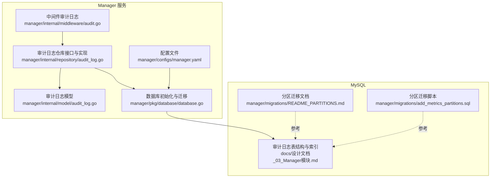
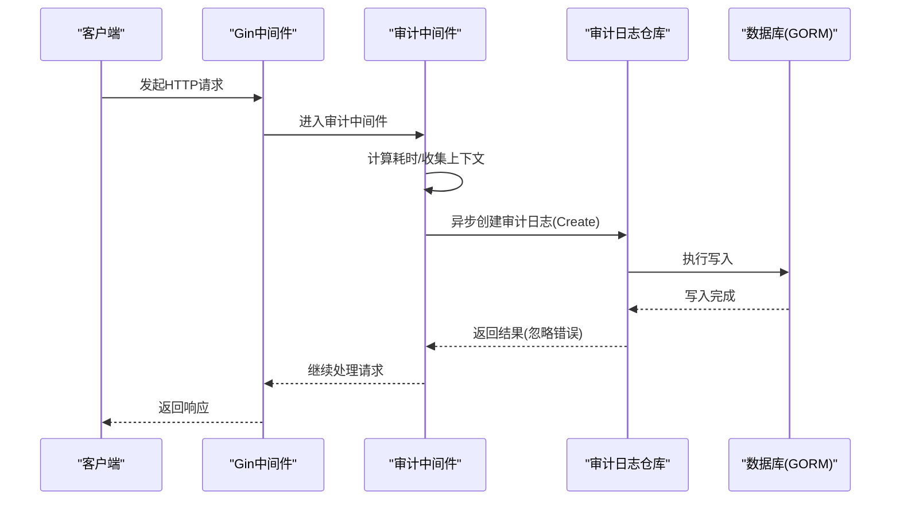
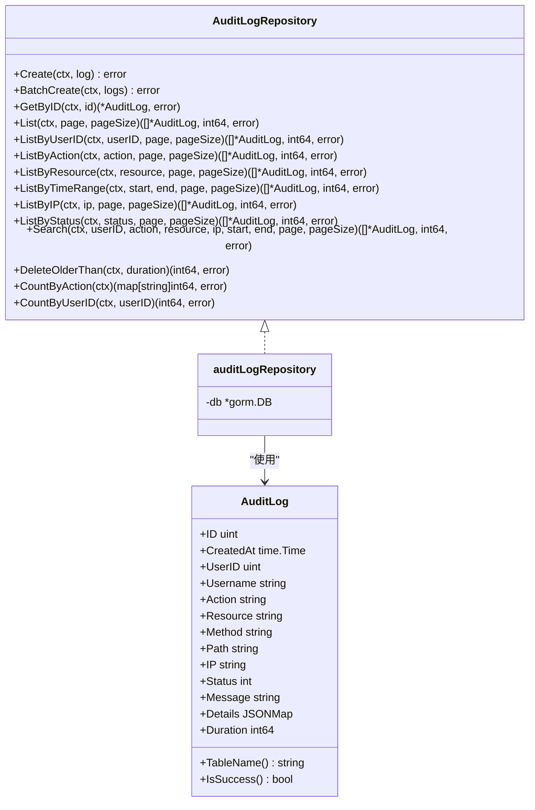
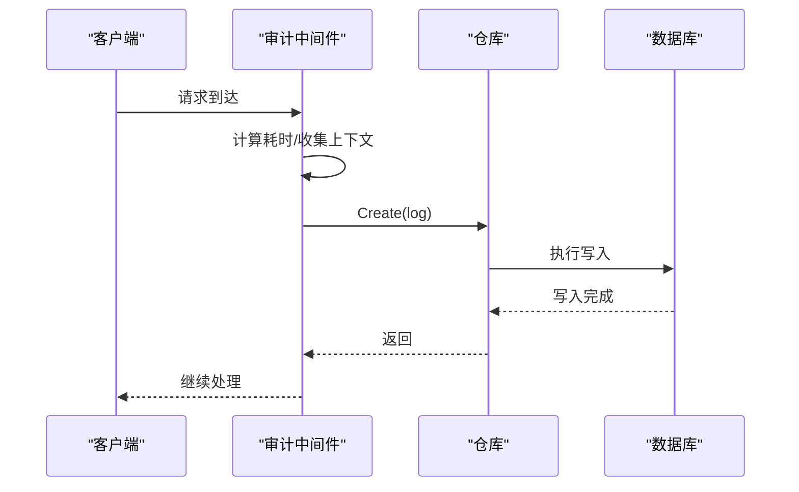
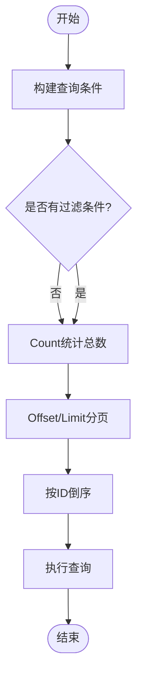
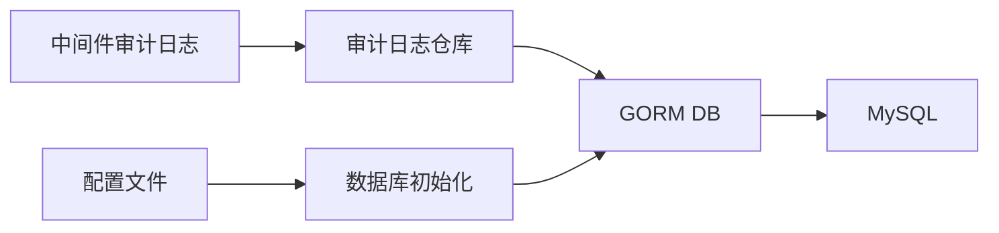

# 审计日志访问

<cite>
**本文引用的文件**
- [manager/internal/repository/audit_log.go](file://manager/internal/repository/audit_log.go)
- [manager/internal/model/audit_log.go](file://manager/internal/model/audit_log.go)
- [manager/internal/middleware/audit.go](file://manager/internal/middleware/audit.go)
- [manager/pkg/database/database.go](file://manager/pkg/database/database.go)
- [docs/设计文档_03_Manager模块.md](file://docs/设计文档_03_Manager模块.md)
- [manager/migrations/README_PARTITIONS.md](file://manager/migrations/README_PARTITIONS.md)
- [manager/migrations/add_metrics_partitions.sql](file://manager/migrations/add_metrics_partitions.sql)
- [manager/configs/manager.yaml](file://manager/configs/manager.yaml)
</cite>

## 目录
1. [简介](#简介)
2. [项目结构](#项目结构)
3. [核心组件](#核心组件)
4. [架构总览](#架构总览)
5. [详细组件分析](#详细组件分析)
6. [依赖关系分析](#依赖关系分析)
7. [性能考量](#性能考量)
8. [故障排查指南](#故障排查指南)
9. [结论](#结论)
10. [附录](#附录)

## 简介
本文件聚焦于审计日志数据访问组件，系统性阐述 AuditLogRepo 的实现机制与运行流程，覆盖写入与批量写入、分页查询与时间范围过滤、多条件搜索、统计聚合、生命周期管理（删除与清理）、以及基于 schema 的索引设计与大数据量下的分区优化思路。文档同时结合中间件审计日志采集、数据库初始化与迁移、配置项等上下文，帮助读者快速理解并高效使用该组件。

## 项目结构
围绕审计日志访问的关键文件组织如下：
- 数据模型：定义审计日志实体及表名映射
- 数据访问层：提供统一的审计日志 CRUD、分页、过滤、统计与清理能力
- 中间件：在请求链路中异步采集审计日志并持久化
- 数据库初始化与迁移：负责连接、连接池、AutoMigrate 与约束兼容处理
- 设计文档与迁移脚本：提供审计日志表结构、索引设计与分区优化参考

图表来源
- [manager/internal/middleware/audit.go](file://manager/internal/middleware/audit.go#L1-L50)
- [manager/internal/repository/audit_log.go](file://manager/internal/repository/audit_log.go#L1-L60)
- [manager/internal/model/audit_log.go](file://manager/internal/model/audit_log.go#L1-L37)
- [manager/pkg/database/database.go](file://manager/pkg/database/database.go#L1-L80)
- [docs/设计文档_03_Manager模块.md](file://docs/设计文档_03_Manager模块.md#L574-L596)
- [manager/migrations/README_PARTITIONS.md](file://manager/migrations/README_PARTITIONS.md#L1-L60)
- [manager/migrations/add_metrics_partitions.sql](file://manager/migrations/add_metrics_partitions.sql#L1-L40)
- [manager/configs/manager.yaml](file://manager/configs/manager.yaml#L1-L20)

章节来源
- [manager/internal/repository/audit_log.go](file://manager/internal/repository/audit_log.go#L1-L60)
- [manager/internal/model/audit_log.go](file://manager/internal/model/audit_log.go#L1-L37)
- [manager/internal/middleware/audit.go](file://manager/internal/middleware/audit.go#L1-L50)
- [manager/pkg/database/database.go](file://manager/pkg/database/database.go#L1-L80)
- [docs/设计文档_03_Manager模块.md](file://docs/设计文档_03_Manager模块.md#L574-L596)
- [manager/migrations/README_PARTITIONS.md](file://manager/migrations/README_PARTITIONS.md#L1-L60)
- [manager/migrations/add_metrics_partitions.sql](file://manager/migrations/add_metrics_partitions.sql#L1-L40)
- [manager/configs/manager.yaml](file://manager/configs/manager.yaml#L1-L20)

## 核心组件
- 审计日志模型：定义字段、表名与辅助方法（如成功判断）
- 审计日志仓库接口：统一抽象写入、批量写入、查询、统计与清理
- 审计日志仓库实现：基于 GORM 的具体实现，涵盖分页、过滤、统计与删除
- 审计中间件：在请求链路中异步采集审计日志并调用仓库写入
- 数据库初始化与迁移：建立连接、连接池、AutoMigrate，并兼容约束迁移问题
- 设计文档与迁移脚本：提供审计日志表结构、索引设计与分区优化参考

章节来源
- [manager/internal/model/audit_log.go](file://manager/internal/model/audit_log.go#L1-L37)
- [manager/internal/repository/audit_log.go](file://manager/internal/repository/audit_log.go#L1-L60)
- [manager/internal/middleware/audit.go](file://manager/internal/middleware/audit.go#L1-L50)
- [manager/pkg/database/database.go](file://manager/pkg/database/database.go#L1-L80)
- [docs/设计文档_03_Manager模块.md](file://docs/设计文档_03_Manager模块.md#L574-L596)
- [manager/migrations/README_PARTITIONS.md](file://manager/migrations/README_PARTITIONS.md#L1-L60)
- [manager/migrations/add_metrics_partitions.sql](file://manager/migrations/add_metrics_partitions.sql#L1-L40)

## 架构总览
审计日志写入与查询的整体流程如下：
- 请求进入中间件，计算耗时并构造审计日志对象
- 异步调用仓库写入；若失败记录日志
- 查询侧通过仓库接口进行分页、过滤、统计与清理

图表来源
- [manager/internal/middleware/audit.go](file://manager/internal/middleware/audit.go#L1-L50)
- [manager/internal/repository/audit_log.go](file://manager/internal/repository/audit_log.go#L53-L61)

章节来源
- [manager/internal/middleware/audit.go](file://manager/internal/middleware/audit.go#L1-L50)
- [manager/internal/repository/audit_log.go](file://manager/internal/repository/audit_log.go#L53-L61)

## 详细组件分析

### 审计日志模型与表结构
- 字段设计：包含用户标识、用户名冗余、操作类型、资源、HTTP 方法与路径、IP、状态码、消息、详情(JSON)、耗时等
- 表名映射：固定为 audit_logs
- 辅助方法：提供成功判断逻辑（状态码 2xx）

章节来源
- [manager/internal/model/audit_log.go](file://manager/internal/model/audit_log.go#L1-L37)

### 审计日志仓库接口与实现
- 接口职责：统一抽象写入、批量写入、按 ID 查询、分页列表、按用户、动作、资源、时间范围、IP、状态过滤、多条件搜索、删除旧数据、按动作与用户统计
- 实现要点：
  - 写入：单条与批量写入均通过 GORM 完成
  - 分页：先 Count 再 Offset/Limit 查询，排序按主键倒序
  - 过滤：支持用户、动作、资源、时间范围、IP、状态等条件
  - 搜索：多条件动态拼接 WHERE 子句
  - 统计：按动作分组计数、按用户计数
  - 清理：按时间阈值删除旧日志

图表来源
- [manager/internal/repository/audit_log.go](file://manager/internal/repository/audit_log.go#L1-L60)
- [manager/internal/model/audit_log.go](file://manager/internal/model/audit_log.go#L1-L37)

章节来源
- [manager/internal/repository/audit_log.go](file://manager/internal/repository/audit_log.go#L1-L60)
- [manager/internal/model/audit_log.go](file://manager/internal/model/audit_log.go#L1-L37)

### 审计日志写入机制
- 单条写入：Create 直接调用 GORM Create
- 批量写入：BatchCreate 将切片传入 GORM，实现批量插入
- 中间件采集：审计中间件在请求结束后异步创建审计日志对象并调用仓库写入，失败记录日志

图表来源
- [manager/internal/middleware/audit.go](file://manager/internal/middleware/audit.go#L1-L50)
- [manager/internal/repository/audit_log.go](file://manager/internal/repository/audit_log.go#L53-L61)

章节来源
- [manager/internal/middleware/audit.go](file://manager/internal/middleware/audit.go#L1-L50)
- [manager/internal/repository/audit_log.go](file://manager/internal/repository/audit_log.go#L53-L61)

### 审计日志查询机制
- 分页查询：先 Count 再 Offset/Limit，按主键倒序，便于稳定分页
- 条件过滤：支持用户、动作、资源、IP、状态、时间范围
- 多条件搜索：Search 动态拼接 WHERE 条件，先统计总数再分页
- 统计聚合：按动作分组计数、按用户计数

图表来源
- [manager/internal/repository/audit_log.go](file://manager/internal/repository/audit_log.go#L73-L92)
- [manager/internal/repository/audit_log.go](file://manager/internal/repository/audit_log.go#L94-L161)
- [manager/internal/repository/audit_log.go](file://manager/internal/repository/audit_log.go#L163-L185)
- [manager/internal/repository/audit_log.go](file://manager/internal/repository/audit_log.go#L187-L231)
- [manager/internal/repository/audit_log.go](file://manager/internal/repository/audit_log.go#L233-L271)

章节来源
- [manager/internal/repository/audit_log.go](file://manager/internal/repository/audit_log.go#L73-L92)
- [manager/internal/repository/audit_log.go](file://manager/internal/repository/audit_log.go#L94-L161)
- [manager/internal/repository/audit_log.go](file://manager/internal/repository/audit_log.go#L163-L185)
- [manager/internal/repository/audit_log.go](file://manager/internal/repository/audit_log.go#L187-L231)
- [manager/internal/repository/audit_log.go](file://manager/internal/repository/audit_log.go#L233-L271)

### 时间范围过滤与分页
- 时间范围过滤：通过 BETWEEN 条件限定 created_at
- 分页：offset = (page-1)*pageSize，limit=pageSize，order=id desc
- 总数统计：先 Count 再分页，保证分页一致性

章节来源
- [manager/internal/repository/audit_log.go](file://manager/internal/repository/audit_log.go#L163-L185)
- [manager/internal/repository/audit_log.go](file://manager/internal/repository/audit_log.go#L73-L92)

### 多条件搜索与敏感操作处理
- 多条件搜索：Search 支持用户、动作、资源、IP、时间范围组合过滤
- 敏感操作处理：可基于动作字段进行识别与隔离（例如仅统计或仅导出），并在查询侧通过过滤条件实现快速定位与检索

章节来源
- [manager/internal/repository/audit_log.go](file://manager/internal/repository/audit_log.go#L233-L271)

### 生命周期管理：删除与清理
- 删除旧日志：DeleteOlderThan 按 created_at 阈值删除，返回受影响行数
- 清理策略：可结合保留周期（如 90 天）定期执行清理任务

章节来源
- [manager/internal/repository/audit_log.go](file://manager/internal/repository/audit_log.go#L273-L282)

### 索引设计与分区优化
- 审计日志表索引（来自设计文档）：主键 id、索引 idx_user_id、idx_action、idx_resource、idx_created_at
- 分区优化参考：虽然审计日志表结构与分区脚本针对 metrics 表，但其分区策略（按日期分区、分区裁剪、索引设计、定期清理）可作为审计日志表优化的参考思路

章节来源
- [docs/设计文档_03_Manager模块.md](file://docs/设计文档_03_Manager模块.md#L574-L596)
- [manager/migrations/README_PARTITIONS.md](file://manager/migrations/README_PARTITIONS.md#L1-L60)
- [manager/migrations/add_metrics_partitions.sql](file://manager/migrations/add_metrics_partitions.sql#L1-L40)

## 依赖关系分析
- 仓库依赖 GORM 数据库实例，通过 WithContext 传递上下文
- 中间件依赖仓库接口，异步写入审计日志
- 数据库初始化负责连接、连接池与 AutoMigrate，确保模型与表结构一致

图表来源
- [manager/internal/middleware/audit.go](file://manager/internal/middleware/audit.go#L1-L50)
- [manager/internal/repository/audit_log.go](file://manager/internal/repository/audit_log.go#L1-L60)
- [manager/pkg/database/database.go](file://manager/pkg/database/database.go#L1-L80)
- [manager/configs/manager.yaml](file://manager/configs/manager.yaml#L1-L20)

章节来源
- [manager/internal/middleware/audit.go](file://manager/internal/middleware/audit.go#L1-L50)
- [manager/internal/repository/audit_log.go](file://manager/internal/repository/audit_log.go#L1-L60)
- [manager/pkg/database/database.go](file://manager/pkg/database/database.go#L1-L80)
- [manager/configs/manager.yaml](file://manager/configs/manager.yaml#L1-L20)

## 性能考量
- 分页与排序：按主键倒序排序，有利于稳定分页；建议在 created_at 上建立索引以优化时间范围查询
- 统计与聚合：CountByAction 使用 Group 聚合，建议配合合适的索引减少全表扫描
- 批量写入：BatchCreate 提升写入吞吐，适合高并发场景
- 连接池与日志：数据库初始化设置连接池参数与日志级别，有助于控制资源占用与可观测性
- 分区优化：参考 metrics 表的分区策略，可考虑按日期分区与索引设计，提升大数据量下的查询与清理效率

章节来源
- [manager/internal/repository/audit_log.go](file://manager/internal/repository/audit_log.go#L58-L61)
- [manager/pkg/database/database.go](file://manager/pkg/database/database.go#L1-L80)
- [docs/设计文档_03_Manager模块.md](file://docs/设计文档_03_Manager模块.md#L574-L596)
- [manager/migrations/README_PARTITIONS.md](file://manager/migrations/README_PARTITIONS.md#L1-L60)
- [manager/migrations/add_metrics_partitions.sql](file://manager/migrations/add_metrics_partitions.sql#L1-L40)

## 故障排查指南
- 写入失败：中间件捕获错误并记录日志，检查数据库连接、权限与表结构
- 查询异常：确认过滤条件是否命中索引，必要时使用 EXPLAIN 分析
- 清理无效：核对 DeleteOlderThan 的时间阈值与 created_at 字段，确保时区与时间同步
- 迁移问题：AutoMigrate 对约束冲突有兼容处理，若仍失败，检查约束名称与表结构

章节来源
- [manager/internal/middleware/audit.go](file://manager/internal/middleware/audit.go#L1-L50)
- [manager/pkg/database/database.go](file://manager/pkg/database/database.go#L82-L210)
- [manager/internal/repository/audit_log.go](file://manager/internal/repository/audit_log.go#L273-L282)

## 结论
AuditLogRepo 提供了完善的审计日志写入、查询、统计与清理能力，配合中间件采集与数据库初始化，能够满足高并发写入与高效检索的需求。结合设计文档与分区迁移参考，可在大数据量场景下进一步优化查询与维护效率。

## 附录
- 审计日志表结构与索引设计参考
- 分区迁移文档与脚本参考
- 数据库配置项说明

章节来源
- [docs/设计文档_03_Manager模块.md](file://docs/设计文档_03_Manager模块.md#L574-L596)
- [manager/migrations/README_PARTITIONS.md](file://manager/migrations/README_PARTITIONS.md#L1-L60)
- [manager/migrations/add_metrics_partitions.sql](file://manager/migrations/add_metrics_partitions.sql#L1-L40)
- [manager/configs/manager.yaml](file://manager/configs/manager.yaml#L1-L20)