# 数据访问层

<cite>
**本文档引用的文件**   
- [node.go](file://manager/internal/repository/node.go)
- [agent.go](file://manager/internal/repository/agent.go)
- [task.go](file://manager/internal/repository/task.go)
- [user.go](file://manager/internal/repository/user.go)
- [audit_log.go](file://manager/internal/repository/audit_log.go)
- [metrics.go](file://manager/internal/repository/metrics.go)
- [node.go](file://manager/internal/model/node.go)
- [agent.go](file://manager/internal/model/agent.go)
- [task.go](file://manager/internal/model/task.go)
- [user.go](file://manager/internal/model/user.go)
- [audit_log.go](file://manager/internal/model/audit_log.go)
- [metrics.go](file://manager/internal/model/metrics.go)
- [database.go](file://manager/pkg/database/database.go)
- [config.go](file://manager/internal/config/config.go)
- [schema.sql](file://config/mysql/schema.sql)
</cite>

## 目录
1. [引言](#引言)
2. [项目结构](#项目结构)
3. [核心组件](#核心组件)
4. [架构概述](#架构概述)
5. [详细组件分析](#详细组件分析)
6. [依赖分析](#依赖分析)
7. [性能考虑](#性能考虑)
8. [故障排除指南](#故障排除指南)
9. [结论](#结论)

## 引言
本技术文档详细阐述了基于GORM的Repository模式实现，重点介绍了数据访问层的设计与实现。文档涵盖了NodeRepo、AgentRepo、TaskRepo、UserRepo、AuditLogRepo和MetricsRepo等核心数据访问组件，详细说明了它们如何封装CRUD操作及复杂查询。文档还提供了GORM模型定义、数据库连接池配置、事务处理、预加载关联数据等实际代码示例，并包含数据库ER图和索引设计说明，解释了关键查询的性能优化策略。

## 项目结构
数据访问层主要位于`manager/internal/repository`目录下，采用标准的Repository模式实现。该层与模型层（`manager/internal/model`）紧密配合，通过GORM ORM框架与MySQL数据库交互。数据库配置和连接管理在`manager/pkg/database`包中实现，而具体的业务逻辑则通过服务层（`manager/internal/service`）调用数据访问层的方法来完成。

**图表来源**
- [node.go](file://manager/internal/repository/node.go)
- [agent.go](file://manager/internal/repository/agent.go)
- [task.go](file://manager/internal/repository/task.go)
- [user.go](file://manager/internal/repository/user.go)
- [audit_log.go](file://manager/internal/repository/audit_log.go)
- [metrics.go](file://manager/internal/repository/metrics.go)

**章节来源**
- [node.go](file://manager/internal/repository/node.go)
- [agent.go](file://manager/internal/repository/agent.go)
- [task.go](file://manager/internal/repository/task.go)
- [user.go](file://manager/internal/repository/user.go)
- [audit_log.go](file://manager/internal/repository/audit_log.go)
- [metrics.go](file://manager/internal/repository/metrics.go)

## 核心组件
数据访问层的核心组件包括NodeRepo、AgentRepo、TaskRepo、UserRepo、AuditLogRepo和MetricsRepo。每个Repository都实现了特定的CRUD操作和复杂查询，通过GORM框架与数据库进行交互。这些组件封装了数据访问逻辑，为上层服务提供了清晰的接口。

**章节来源**
- [node.go](file://manager/internal/repository/node.go)
- [agent.go](file://manager/internal/repository/agent.go)
- [task.go](file://manager/internal/repository/task.go)
- [user.go](file://manager/internal/repository/user.go)
- [audit_log.go](file://manager/internal/repository/audit_log.go)
- [metrics.go](file://manager/internal/repository/metrics.go)

## 架构概述
数据访问层采用Repository模式，将数据访问逻辑与业务逻辑分离。每个Repository负责一个特定的实体（如Node、Agent、Task等），提供创建、读取、更新、删除（CRUD）操作以及复杂的查询功能。GORM框架用于处理数据库交互，支持事务、预加载、钩子等功能。

```mermaid
classDiagram
class NodeRepository {
+Create(ctx context.Context, node *model.Node) error
+GetByID(ctx context.Context, id uint) (*model.Node, error)
+GetByNodeID(ctx context.Context, nodeID string) (*model.Node, error)
+Update(ctx context.Context, node *model.Node) error
+Delete(ctx context.Context, id uint) error
+List(ctx context.Context, page, pageSize int) ([]*model.Node, int64, error)
+ListByStatus(ctx context.Context, status string, page, pageSize int) ([]*model.Node, int64, error)
+ListByLabels(ctx context.Context, labels map[string]string, page, pageSize int) ([]*model.Node, int64, error)
+UpdateStatus(ctx context.Context, nodeID string, status string) error
+UpdateHeartbeat(ctx context.Context, nodeID string) error
+UpdateVersions(ctx context.Context, nodeID, daemonVersion, agentVersion string) error
+GetOfflineNodes(ctx context.Context, duration time.Duration) ([]*model.Node, error)
+CountByStatus(ctx context.Context) (map[string]int64, error)
}
class AgentRepository {
+GetByID(ctx context.Context, id uint) (*model.Agent, error)
+GetByNodeIDAndAgentID(ctx context.Context, nodeID, agentID string) (*model.Agent, error)
+Create(ctx context.Context, agent *model.Agent) error
+Update(ctx context.Context, agent *model.Agent) error
+Upsert(ctx context.Context, agent *model.Agent) error
+ListByNodeID(ctx context.Context, nodeID string) ([]*model.Agent, error)
+Delete(ctx context.Context, nodeID, agentID string) error
}
class TaskRepository {
+Create(ctx context.Context, task *model.Task) error
+GetByID(ctx context.Context, id uint) (*model.Task, error)
+Update(ctx context.Context, task *model.Task) error
+Delete(ctx context.Context, id uint) error
+List(ctx context.Context, page, pageSize int) ([]*model.Task, int64, error)
+ListByStatus(ctx context.Context, status string, page, pageSize int) ([]*model.Task, int64, error)
+ListByType(ctx context.Context, taskType string, page, pageSize int) ([]*model.Task, int64, error)
+ListByCreator(ctx context.Context, creatorID uint, page, pageSize int) ([]*model.Task, int64, error)
+ListByTimeRange(ctx context.Context, start, end time.Time, page, pageSize int) ([]*model.Task, int64, error)
+UpdateStatus(ctx context.Context, id uint, status string) error
+UpdateResult(ctx context.Context, id uint, result string, status string) error
+GetPendingTasks(ctx context.Context) ([]*model.Task, error)
+GetRunningTasks(ctx context.Context) ([]*model.Task, error)
+CountByStatus(ctx context.Context) (map[string]int64, error)
+GetScheduledTasks(ctx context.Context) ([]*model.Task, error)
}
class UserRepository {
+Create(ctx context.Context, user *model.User) error
+GetByID(ctx context.Context, id uint) (*model.User, error)
+GetByUsername(ctx context.Context, username string) (*model.User, error)
+GetByEmail(ctx context.Context, email string) (*model.User, error)
+Update(ctx context.Context, user *model.User) error
+Delete(ctx context.Context, id uint) error
+List(ctx context.Context, page, pageSize int) ([]*model.User, int64, error)
+ListByRole(ctx context.Context, role string, page, pageSize int) ([]*model.User, int64, error)
+ListByStatus(ctx context.Context, status string, page, pageSize int) ([]*model.User, int64, error)
+UpdateLastLogin(ctx context.Context, id uint) error
+UpdatePassword(ctx context.Context, id uint, password string) error
+UpdateStatus(ctx context.Context, id uint, status string) error
}
class AuditLogRepository {
+Create(ctx context.Context, log *model.AuditLog) error
+BatchCreate(ctx context.Context, logs []*model.AuditLog) error
+GetByID(ctx context.Context, id uint) (*model.AuditLog, error)
+List(ctx context.Context, page, pageSize int) ([]*model.AuditLog, int64, error)
+ListByUserID(ctx context.Context, userID uint, page, pageSize int) ([]*model.AuditLog, int64, error)
+ListByAction(ctx context.Context, action string, page, pageSize int) ([]*model.AuditLog, int64, error)
+ListByResource(ctx context.Context, resource string, page, pageSize int) ([]*model.AuditLog, int64, error)
+ListByTimeRange(ctx context.Context, start, end time.Time, page, pageSize int) ([]*model.AuditLog, int64, error)
+ListByIP(ctx context.Context, ip string, page, pageSize int) ([]*model.AuditLog, int64, error)
+ListByStatus(ctx context.Context, status int, page, pageSize int) ([]*model.AuditLog, int64, error)
+Search(ctx context.Context, userID *uint, action, resource, ip string, start, end *time.Time, page, pageSize int) ([]*model.AuditLog, int64, error)
+DeleteOlderThan(ctx context.Context, duration time.Duration) (int64, error)
+CountByAction(ctx context.Context) (map[string]int64, error)
+CountByUserID(ctx context.Context, userID uint) (int64, error)
}
class MetricsRepository {
+Create(ctx context.Context, metrics *model.Metrics) error
+BatchCreate(ctx context.Context, metrics []*model.Metrics) error
+GetByID(ctx context.Context, id uint) (*model.Metrics, error)
+List(ctx context.Context, page, pageSize int) ([]*model.Metrics, int64, error)
+ListByNodeID(ctx context.Context, nodeID string, page, pageSize int) ([]*model.Metrics, int64, error)
+ListByNodeIDAndType(ctx context.Context, nodeID, metricsType string, page, pageSize int) ([]*model.Metrics, int64, error)
+ListByTimeRange(ctx context.Context, nodeID string, metricsType string, start, end time.Time) ([]*model.Metrics, error)
+GetLatestByNodeID(ctx context.Context, nodeID string) ([]*model.Metrics, error)
+GetLatestByNodeIDAndType(ctx context.Context, nodeID, metricsType string) (*model.Metrics, error)
+DeleteOlderThan(ctx context.Context, duration time.Duration) (int64, error)
+GetAverageByNodeIDAndType(ctx context.Context, nodeID, metricsType string, start, end time.Time) (map[string]float64, error)
+ListByTimeRangeWithInterval(ctx context.Context, nodeID string, metricType string, startTime, endTime time.Time, interval time.Duration) ([]*model.Metrics, error)
+GetAggregateStats(ctx context.Context, nodeID string, metricType string, startTime, endTime time.Time) (min, max, avg float64, err error)
+GetAllNodesLatestMetrics(ctx context.Context) ([]*NodeMetrics, error)
}
NodeRepository --> DatabaseManager
AgentRepository --> DatabaseManager
TaskRepository --> DatabaseManager
UserRepository --> DatabaseManager
AuditLogRepository --> DatabaseManager
MetricsRepository --> DatabaseManager
```

**图表来源**
- [node.go](file://manager/internal/repository/node.go)
- [agent.go](file://manager/internal/repository/agent.go)
- [task.go](file://manager/internal/repository/task.go)
- [user.go](file://manager/internal/repository/user.go)
- [audit_log.go](file://manager/internal/repository/audit_log.go)
- [metrics.go](file://manager/internal/repository/metrics.go)

## 详细组件分析

### NodeRepo分析
NodeRepo负责节点数据的CRUD操作和复杂查询。它提供了创建、读取、更新和删除节点的方法，以及根据状态、标签等条件查询节点列表的功能。此外，NodeRepo还支持更新节点状态、心跳时间和版本信息。

#### NodeRepository类图

**图表来源**
- [node.go](file://manager/internal/repository/node.go)
- [node.go](file://manager/internal/model/node.go)

### AgentRepo分析
AgentRepo负责Agent状态的持久化管理。它提供了创建、读取、更新和删除Agent的方法，以及根据节点ID查询Agent列表的功能。AgentRepo还支持Upsert操作，即如果Agent不存在则创建，存在则更新。

#### AgentRepository类图

**图表来源**
- [agent.go](file://manager/internal/repository/agent.go)
- [agent.go](file://manager/internal/model/agent.go)

### TaskRepo分析
TaskRepo负责任务与执行记录的数据访问逻辑。它提供了创建、读取、更新和删除任务的方法，以及根据状态、类型、创建者和时间范围查询任务列表的功能。TaskRepo还支持更新任务状态和结果，以及获取待执行和运行中的任务。

#### TaskRepository类图

**图表来源**
- [task.go](file://manager/internal/repository/task.go)
- [task.go](file://manager/internal/model/task.go)

### UserRepo分析
UserRepo负责用户认证数据的管理。它提供了创建、读取、更新和删除用户的方法，以及根据用户名、邮箱、角色和状态查询用户列表的功能。UserRepo还支持更新用户的最后登录时间、密码和状态。

#### UserRepository类图

**图表来源**
- [user.go](file://manager/internal/repository/user.go)
- [user.go](file://manager/internal/model/user.go)

### AuditLogRepo分析
AuditLogRepo负责审计日志的写入与查询机制。它提供了创建、批量创建和查询审计日志的方法，支持根据用户ID、操作类型、资源类型、IP地址和时间范围进行查询。AuditLogRepo还支持多条件搜索和删除指定时间之前的日志。

#### AuditLogRepository类图

**图表来源**
- [audit_log.go](file://manager/internal/repository/audit_log.go)
- [audit_log.go](file://manager/internal/model/audit_log.go)

### MetricsRepo分析
MetricsRepo负责指标数据的批量插入与聚合查询优化。它提供了创建、批量创建和查询指标数据的方法，支持根据节点ID、指标类型和时间范围进行查询。MetricsRepo还支持获取最新指标、平均值、聚合统计和所有节点的最新指标数据。

#### MetricsRepository类图

**图表来源**
- [metrics.go](file://manager/internal/repository/metrics.go)
- [metrics.go](file://manager/internal/model/metrics.go)

## 依赖分析
数据访问层的各个Repository组件都依赖于GORM框架和数据库连接。每个Repository通过`*gorm.DB`实例与数据库进行交互。服务层通过依赖注入的方式获取Repository实例，从而实现业务逻辑与数据访问的解耦。

**图表来源**
- [node.go](file://manager/internal/repository/node.go)
- [agent.go](file://manager/internal/repository/agent.go)
- [task.go](file://manager/internal/repository/task.go)
- [user.go](file://manager/internal/repository/user.go)
- [audit_log.go](file://manager/internal/repository/audit_log.go)
- [metrics.go](file://manager/internal/repository/metrics.go)
- [database.go](file://manager/pkg/database/database.go)

**章节来源**
- [node.go](file://manager/internal/repository/node.go)
- [agent.go](file://manager/internal/repository/agent.go)
- [task.go](file://manager/internal/repository/task.go)
- [user.go](file://manager/internal/repository/user.go)
- [audit_log.go](file://manager/internal/repository/audit_log.go)
- [metrics.go](file://manager/internal/repository/metrics.go)
- [database.go](file://manager/pkg/database/database.go)

## 性能考虑
针对大数据量场景下的分页查询、批量操作和连接池调优，数据访问层提供了以下实践指导：

1. **分页查询**：所有列表查询方法都支持分页参数（page, pageSize），避免一次性加载大量数据。
2. **批量操作**：对于审计日志和指标数据，提供了批量创建方法（BatchCreate），减少数据库交互次数。
3. **连接池调优**：通过配置文件（config.yaml）可以调整数据库连接池的最大空闲连接数、最大打开连接数和连接最大生命周期。
4. **索引优化**：在关键字段上创建了索引，如节点ID、AgentID、任务状态、用户ID等，以提高查询性能。
5. **聚合查询**：对于指标数据，提供了聚合查询方法（如GetAggregateStats），减少数据传输量。

**章节来源**
- [node.go](file://manager/internal/repository/node.go)
- [agent.go](file://manager/internal/repository/agent.go)
- [task.go](file://manager/internal/repository/task.go)
- [user.go](file://manager/internal/repository/user.go)
- [audit_log.go](file://manager/internal/repository/audit_log.go)
- [metrics.go](file://manager/internal/repository/metrics.go)
- [config.go](file://manager/internal/config/config.go)

## 故障排除指南
在使用数据访问层时，可能会遇到以下常见问题：

1. **数据库连接失败**：检查数据库配置（DSN）是否正确，确保数据库服务正在运行。
2. **查询性能低下**：检查是否在关键字段上创建了索引，优化查询条件。
3. **批量操作失败**：检查批量数据的大小，避免单次操作数据量过大。
4. **事务处理异常**：确保在事务中正确处理错误，避免资源泄漏。

**章节来源**
- [database.go](file://manager/pkg/database/database.go)
- [config.go](file://manager/internal/config/config.go)

## 结论
本文档详细介绍了基于GORM的Repository模式实现，涵盖了数据访问层的各个核心组件。通过清晰的接口定义和合理的架构设计，数据访问层有效地封装了数据访问逻辑，为上层服务提供了稳定、高效的数据操作能力。针对大数据量场景的性能优化策略，确保了系统在高负载下的稳定运行。