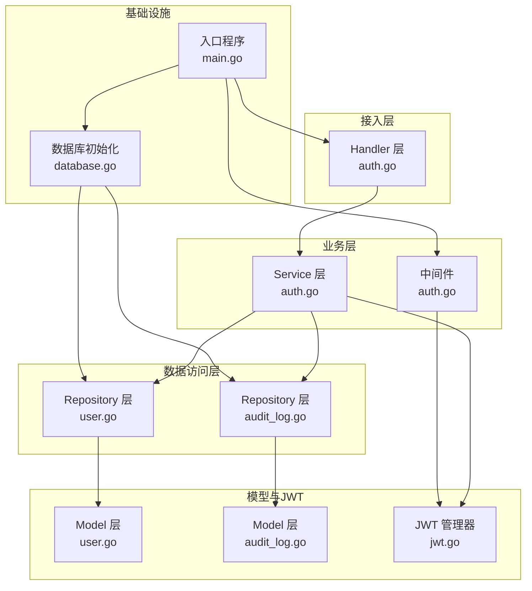
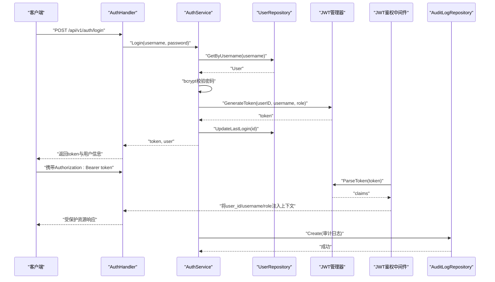
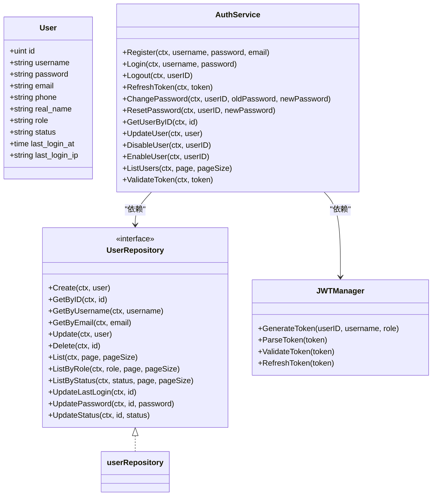

# 用户数据访问

<cite>
**本文引用的文件**
- [manager/internal/repository/user.go](file://manager/internal/repository/user.go)
- [manager/internal/model/user.go](file://manager/internal/model/user.go)
- [manager/internal/service/auth.go](file://manager/internal/service/auth.go)
- [manager/internal/handler/auth.go](file://manager/internal/handler/auth.go)
- [manager/internal/middleware/auth.go](file://manager/internal/middleware/auth.go)
- [manager/pkg/jwt/jwt.go](file://manager/pkg/jwt/jwt.go)
- [manager/pkg/database/database.go](file://manager/pkg/database/database.go)
- [manager/cmd/manager/main.go](file://manager/cmd/manager/main.go)
- [manager/internal/repository/audit_log.go](file://manager/internal/repository/audit_log.go)
- [manager/internal/model/audit_log.go](file://manager/internal/model/audit_log.go)
- [docs/设计文档_03_Manager模块.md](file://docs/设计文档_03_Manager模块.md)
- [config/mysql/schema.sql](file://config/mysql/schema.sql)
</cite>

## 目录
1. [简介](#简介)
2. [项目结构](#项目结构)
3. [核心组件](#核心组件)
4. [架构总览](#架构总览)
5. [详细组件分析](#详细组件分析)
6. [依赖关系分析](#依赖关系分析)
7. [性能考量](#性能考量)
8. [故障排查指南](#故障排查指南)
9. [结论](#结论)
10. [附录](#附录)

## 简介
本技术文档聚焦于用户数据访问组件，系统性阐述UserRepo的实现机制与职责边界，覆盖用户认证数据的CRUD操作、密码哈希存储策略、RBAC权限模型的数据结构与查询优化、登录状态与会话管理的数据访问模式，以及安全审计相关的数据保护措施。同时结合schema.sql与设计文档中的users表结构，说明唯一约束与索引的设计考量，并给出可操作的优化建议与排障指引。

## 项目结构
围绕用户数据访问的关键层次如下：
- Handler层：对外暴露认证相关API，负责参数校验与响应封装。
- Service层：业务编排，协调Repository与JWT、审计仓库，执行认证流程与权限控制。
- Repository层：面向数据库的用户数据访问接口与实现，提供CRUD与分页查询能力。
- Model层：用户实体与审计日志实体的结构定义及GORM标签。
- JWT与中间件：Token签发、解析与鉴权中间件，配合RequireAdmin进行RBAC控制。
- 数据库初始化与迁移：GORM连接、连接池、AutoMigrate与约束修复逻辑。

图表来源
- [manager/internal/handler/auth.go](file://manager/internal/handler/auth.go#L1-L225)
- [manager/internal/service/auth.go](file://manager/internal/service/auth.go#L1-L287)
- [manager/internal/repository/user.go](file://manager/internal/repository/user.go#L1-L186)
- [manager/internal/repository/audit_log.go](file://manager/internal/repository/audit_log.go#L1-L321)
- [manager/internal/model/user.go](file://manager/internal/model/user.go#L1-L43)
- [manager/internal/model/audit_log.go](file://manager/internal/model/audit_log.go#L1-L37)
- [manager/pkg/jwt/jwt.go](file://manager/pkg/jwt/jwt.go#L1-L140)
- [manager/pkg/database/database.go](file://manager/pkg/database/database.go#L1-L281)
- [manager/cmd/manager/main.go](file://manager/cmd/manager/main.go#L1-L290)

章节来源
- [manager/cmd/manager/main.go](file://manager/cmd/manager/main.go#L1-L290)
- [manager/pkg/database/database.go](file://manager/pkg/database/database.go#L1-L281)

## 核心组件
- UserRepository接口与实现：提供用户创建、查询、更新、删除、分页、按角色/状态过滤、最后登录时间与密码更新、状态更新等能力。
- User模型：定义users表字段、唯一索引、默认值、软删除索引、辅助方法（IsAdmin、IsActive）。
- AuthService：注册、登录、登出、刷新Token、修改/重置密码、用户启停、列表查询、Token校验等。
- JWT管理器：签发、解析、刷新Token、有效期校验、管理员角色判定。
- 审计日志Repository与模型：支持多条件分页查询、批量写入、统计、清理过期日志等。
- Handler与中间件：统一鉴权中间件、管理员权限中间件、路由注册与参数绑定。

章节来源
- [manager/internal/repository/user.go](file://manager/internal/repository/user.go#L1-L186)
- [manager/internal/model/user.go](file://manager/internal/model/user.go#L1-L43)
- [manager/internal/service/auth.go](file://manager/internal/service/auth.go#L1-L287)
- [manager/pkg/jwt/jwt.go](file://manager/pkg/jwt/jwt.go#L1-L140)
- [manager/internal/repository/audit_log.go](file://manager/internal/repository/audit_log.go#L1-L321)
- [manager/internal/model/audit_log.go](file://manager/internal/model/audit_log.go#L1-L37)
- [manager/internal/handler/auth.go](file://manager/internal/handler/auth.go#L1-L225)
- [manager/internal/middleware/auth.go](file://manager/internal/middleware/auth.go#L1-L98)

## 架构总览
用户认证与会话管理的整体流程如下：
- 客户端调用公开API进行登录/注册。
- Handler将请求交由Service处理。
- Service通过Repository读取用户信息，bcrypt校验密码；成功后由JWT管理器签发Token。
- 中间件从请求头解析Token，校验有效性并将用户信息注入上下文。
- 后续受保护路由根据上下文中的角色信息进行RBAC控制。
- 所有关键操作均记录审计日志，便于追踪与合规。

图表来源
- [manager/internal/handler/auth.go](file://manager/internal/handler/auth.go#L1-L225)
- [manager/internal/service/auth.go](file://manager/internal/service/auth.go#L1-L287)
- [manager/internal/repository/user.go](file://manager/internal/repository/user.go#L1-L186)
- [manager/pkg/jwt/jwt.go](file://manager/pkg/jwt/jwt.go#L1-L140)
- [manager/internal/middleware/auth.go](file://manager/internal/middleware/auth.go#L1-L98)
- [manager/internal/repository/audit_log.go](file://manager/internal/repository/audit_log.go#L1-L321)

## 详细组件分析

### UserRepo实现机制与CRUD
- 接口契约：提供Create、GetByID、GetByUsername、GetByEmail、Update、Delete、List、ListByRole、ListByStatus、UpdateLastLogin、UpdatePassword、UpdateStatus等方法。
- 实现要点：
  - 使用GORM上下文传递，确保链路追踪与超时控制。
  - 分页查询采用先Count再Offset/Limit的方式，避免复杂子查询。
  - UpdateLastLogin通过NOW()表达式更新数据库时间，减少往返。
  - 软删除：Delete基于GORM的DeletedAt字段，符合项目软删除约定。
- 查询优化建议：
  - 在username与email上建立唯一索引（见“表结构与索引设计”）。
  - 对高频过滤字段（role、status）建立复合索引以提升ListByRole/ListByStatus性能。
  - 对createdAt/id建立索引以优化分页排序。

章节来源
- [manager/internal/repository/user.go](file://manager/internal/repository/user.go#L1-L186)
- [manager/internal/model/user.go](file://manager/internal/model/user.go#L1-L43)

### 密码哈希存储策略
- 存储策略：用户密码以加密后的字符串形式存储，不保留明文。
- 注册流程：bcrypt生成哈希，Repository仅保存哈希值。
- 登录流程：Repository按用户名查询用户，Service使用bcrypt比较哈希与输入密码。
- 修改/重置密码：Service侧重新生成哈希并调用Repository更新。

章节来源
- [manager/internal/service/auth.go](file://manager/internal/service/auth.go#L1-L287)
- [manager/internal/repository/user.go](file://manager/internal/repository/user.go#L1-L186)
- [manager/internal/model/user.go](file://manager/internal/model/user.go#L1-L43)

### RBAC权限模型的数据结构与查询优化
- 角色字段：User模型包含role字段，默认值为普通用户。
- 中间件控制：RequireAdmin中间件从上下文读取role并拒绝非管理员访问。
- 查询优化：
  - ListByRole与ListByStatus分别针对role与status过滤，建议在这些字段上建立索引。
  - 若存在更细粒度的权限位，可在User模型中扩展权限字段并在Repository中增加相应查询方法。

章节来源
- [manager/internal/model/user.go](file://manager/internal/model/user.go#L1-L43)
- [manager/internal/middleware/auth.go](file://manager/internal/middleware/auth.go#L1-L98)
- [manager/internal/repository/user.go](file://manager/internal/repository/user.go#L1-L186)

### 登录状态与会话管理的数据访问模式
- 会话模式：采用JWT无状态会话，服务端不维护会话状态。
- 登录后更新：登录成功后调用UpdateLastLogin更新最后登录时间。
- Token刷新：JWT管理器支持刷新Token，超过一定宽限期则不可刷新。
- 中间件：JWTAuth中间件从Authorization头解析Bearer Token，解析失败即返回未授权或Token过期。

章节来源
- [manager/internal/service/auth.go](file://manager/internal/service/auth.go#L1-L287)
- [manager/pkg/jwt/jwt.go](file://manager/pkg/jwt/jwt.go#L1-L140)
- [manager/internal/middleware/auth.go](file://manager/internal/middleware/auth.go#L1-L98)
- [manager/internal/repository/user.go](file://manager/internal/repository/user.go#L1-L186)

### 安全审计相关的数据保护措施
- 审计日志模型：包含用户ID、用户名、操作类型、资源、方法、路径、IP、状态码、消息、详情、耗时等字段。
- 写入策略：关键操作（如登录、修改密码、启停用户等）由Service层触发审计日志写入。
- 查询与统计：支持按用户、动作、资源、时间范围、IP、状态等多维度查询与统计。
- 清理策略：提供按时间阈值删除过期审计日志的能力，避免长期膨胀。

章节来源
- [manager/internal/repository/audit_log.go](file://manager/internal/repository/audit_log.go#L1-L321)
- [manager/internal/model/audit_log.go](file://manager/internal/model/audit_log.go#L1-L37)
- [manager/internal/service/auth.go](file://manager/internal/service/auth.go#L1-L287)

### 表结构、唯一约束与索引设计考量
- users表字段与约束：
  - 主键：id
  - 唯一约束：username、email
  - 默认值：role默认为普通用户，status默认为启用
  - 辅助字段：last_login_at、last_login_ip
- 设计考量：
  - 唯一约束保障用户名与邮箱的唯一性，防止重复注册。
  - role/status字段用于快速过滤与权限判定。
  - last_login_at用于审计与统计，last_login_ip用于安全追踪。
- 建议补充索引：
  - 在role与status上建立复合索引，优化按角色/状态分页查询。
  - 在username与email上保持唯一索引，确保查询效率与一致性。
  - 在created_at上建立索引，优化分页排序与时间范围查询。

章节来源
- [docs/设计文档_03_Manager模块.md](file://docs/设计文档_03_Manager模块.md#L352-L374)
- [manager/internal/model/user.go](file://manager/internal/model/user.go#L1-L43)
- [config/mysql/schema.sql](file://config/mysql/schema.sql#L1-L5)

## 依赖关系分析
- 组件耦合：
  - Handler依赖Service；Service依赖Repository与JWT管理器；Repository依赖GORM与Model。
  - 中间件依赖JWT管理器进行Token解析与校验。
- 外部依赖：
  - GORM作为ORM框架，负责SQL生成与执行。
  - bcrypt用于密码哈希与校验。
  - gin用于HTTP路由与中间件。
  - gRPC用于内部服务通信（与用户数据访问无直接关系，但影响整体架构）。
- 循环依赖：
  - 当前结构清晰，未发现循环依赖迹象。

图表来源
- [manager/internal/model/user.go](file://manager/internal/model/user.go#L1-L43)
- [manager/internal/repository/user.go](file://manager/internal/repository/user.go#L1-L186)
- [manager/internal/service/auth.go](file://manager/internal/service/auth.go#L1-L287)
- [manager/pkg/jwt/jwt.go](file://manager/pkg/jwt/jwt.go#L1-L140)

章节来源
- [manager/internal/repository/user.go](file://manager/internal/repository/user.go#L1-L186)
- [manager/internal/service/auth.go](file://manager/internal/service/auth.go#L1-L287)
- [manager/pkg/jwt/jwt.go](file://manager/pkg/jwt/jwt.go#L1-L140)

## 性能考量
- 查询性能：
  - 分页查询先Count再Limit/Offset，适合中小规模数据；大规模场景建议引入覆盖索引与延迟关联。
  - 对高频过滤字段（role、status）建立索引，避免全表扫描。
- 写入性能：
  - bcrypt哈希成本较高，建议在并发场景下合理限流与异步化（如队列）。
  - 审计日志批量写入可考虑批量插入以降低往返。
- 连接池与迁移：
  - GORM连接池参数需结合QPS与延迟要求调整，避免连接抖动。
  - AutoMigrate过程中对约束冲突进行修复，减少迁移失败风险。

章节来源
- [manager/pkg/database/database.go](file://manager/pkg/database/database.go#L1-L281)
- [manager/internal/repository/user.go](file://manager/internal/repository/user.go#L1-L186)
- [manager/internal/repository/audit_log.go](file://manager/internal/repository/audit_log.go#L1-L321)

## 故障排查指南
- 登录失败：
  - 检查用户名是否存在与状态是否为启用。
  - 确认bcrypt哈希比对是否通过。
  - 查看JWT签发是否成功。
- Token无效或过期：
  - 中间件会区分未授权、无效Token与过期Token，按错误码定位问题。
  - 超过刷新宽限期的Token不可刷新。
- 审计日志缺失：
  - 确认Service层是否正确调用审计仓库写入。
  - 检查审计日志表索引与查询条件是否匹配。
- 数据库连接问题：
  - 检查DSN、连接池参数与Ping结果。
  - AutoMigrate失败时关注约束修复逻辑与错误信息。

章节来源
- [manager/internal/service/auth.go](file://manager/internal/service/auth.go#L1-L287)
- [manager/internal/middleware/auth.go](file://manager/internal/middleware/auth.go#L1-L98)
- [manager/pkg/jwt/jwt.go](file://manager/pkg/jwt/jwt.go#L1-L140)
- [manager/internal/repository/audit_log.go](file://manager/internal/repository/audit_log.go#L1-L321)
- [manager/pkg/database/database.go](file://manager/pkg/database/database.go#L1-L281)

## 结论
本项目在用户数据访问方面实现了清晰的分层架构：Handler负责接口与参数，Service负责业务编排与安全控制，Repository提供稳定的数据库访问能力，JWT与中间件保障会话与权限控制，审计日志贯穿关键操作以满足安全与合规要求。结合users表的唯一约束与索引设计，系统在可用性与安全性之间取得平衡。建议后续在高并发场景下进一步优化索引与分页策略，并对敏感操作引入更细粒度的权限控制与审计策略。

## 附录
- 路由与中间件注册示例（节选）：
  - 公开API：登录、注册
  - 受保护API：携带JWT鉴权中间件
  - 管理员API：RequireAdmin中间件
- 数据库初始化与迁移：
  - 初始化GORM连接、设置连接池、Ping测试
  - AutoMigrate自动迁移模型，包含users与audit_logs
  - 约束修复逻辑处理迁移过程中的已知问题

章节来源
- [manager/cmd/manager/main.go](file://manager/cmd/manager/main.go#L1-L290)
- [manager/pkg/database/database.go](file://manager/pkg/database/database.go#L1-L281)