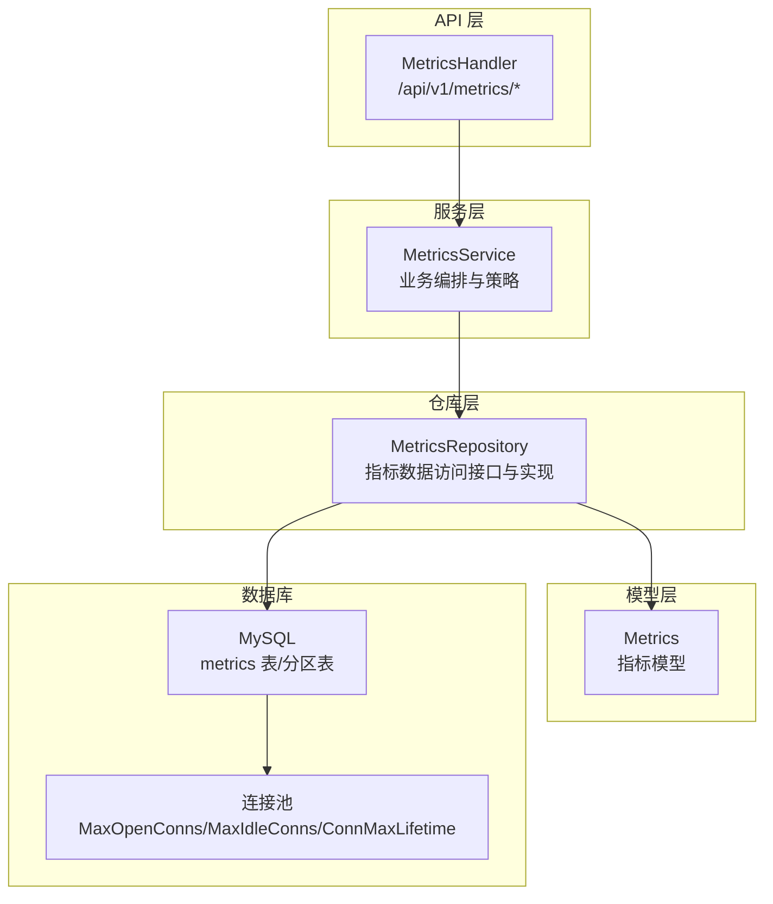
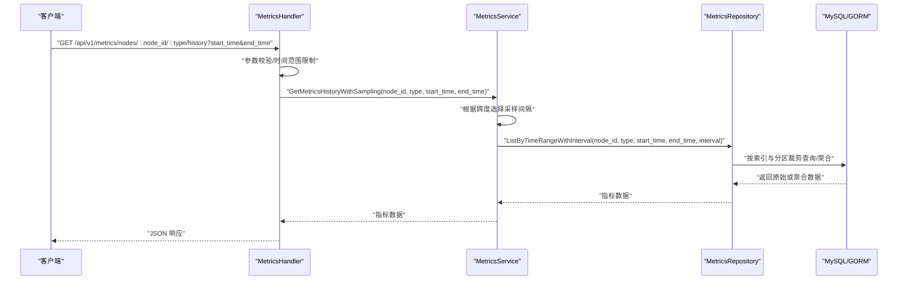
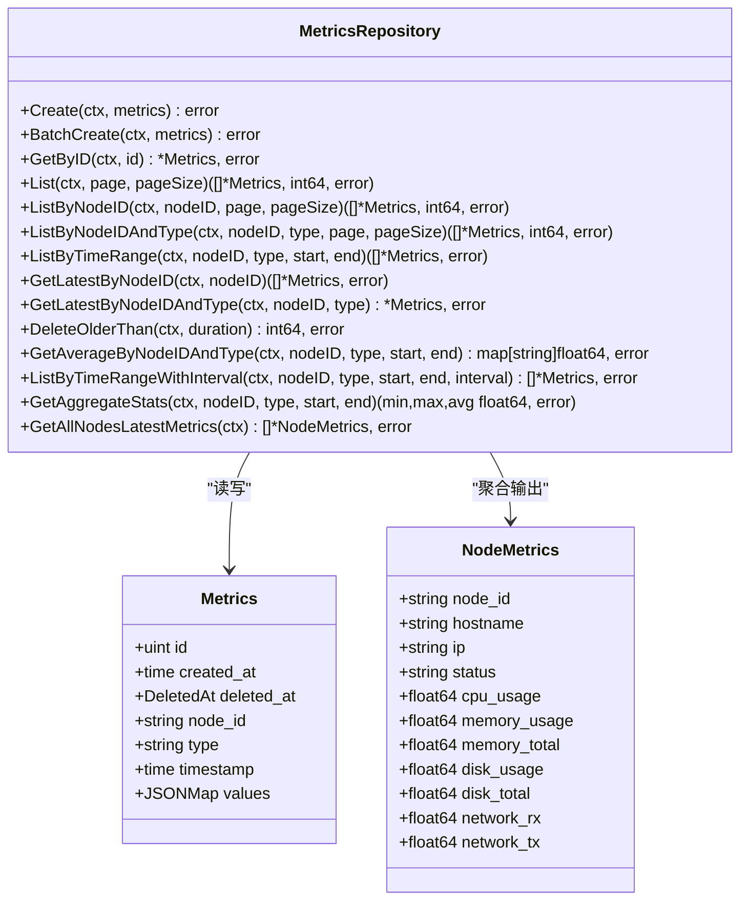
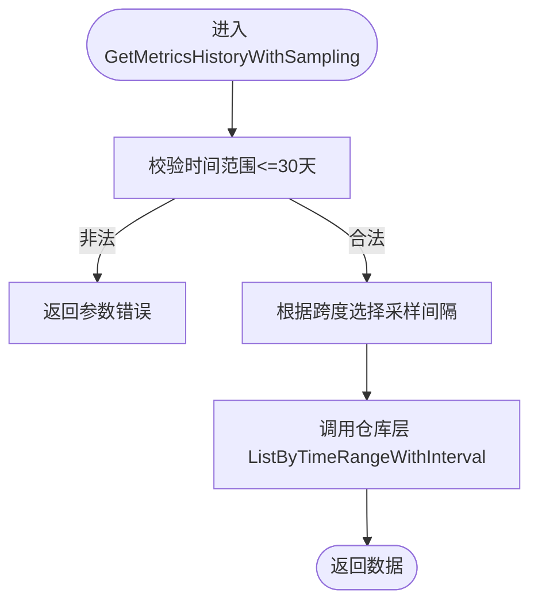
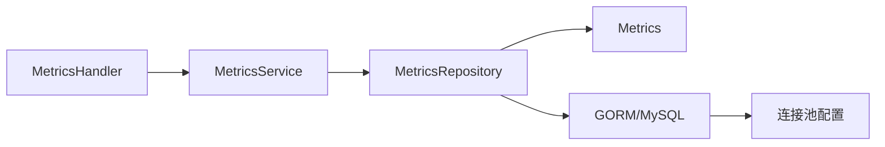

# 监控指标访问

<cite>
**本文引用的文件**
- [schema.sql](file://config/mysql/schema.sql)
- [add_metrics_partitions.sql](file://manager/migrations/add_metrics_partitions.sql)
- [metrics.go（仓库层）](file://manager/internal/repository/metrics.go)
- [metrics.go（模型层）](file://manager/internal/model/metrics.go)
- [metrics.go（服务层）](file://manager/internal/service/metrics.go)
- [metrics.go（处理器层）](file://manager/internal/handler/metrics.go)
- [database.go](file://manager/pkg/database/database.go)
- [metrics_repository_test.go](file://manager/internal/repository/metrics_repository_test.go)
- [metrics_api_test.go](file://manager/test/integration/metrics_api_test.go)
</cite>

## 目录
1. [简介](#简介)
2. [项目结构](#项目结构)
3. [核心组件](#核心组件)
4. [架构总览](#架构总览)
5. [组件详解](#组件详解)
6. [依赖关系分析](#依赖关系分析)
7. [性能与优化](#性能与优化)
8. [故障排查指南](#故障排查指南)
9. [结论](#结论)
10. [附录](#附录)

## 简介
本技术文档围绕监控指标数据访问组件展开，重点阐述 MetricsRepo 的实现机制与优化策略，涵盖：
- 指标数据的批量插入优化（批量提交与连接复用）
- 聚合查询实现（时间区间内的最大值、最小值、平均值）
- 历史指标数据的分页查询与降采样策略
- 实时监控场景下的性能优化
- 结合 node_metrics 表结构与分区索引设计，给出大数据量下的查询性能调优建议

## 项目结构
监控指标访问涉及四层：处理器层（HTTP）、服务层（业务逻辑）、仓库层（数据访问）、模型层（数据结构）。数据库连接由统一的数据库包初始化并注入到服务层，再由服务层调用仓库层完成指标数据的读写与聚合。

图表来源
- [metrics.go（处理器层）](file://manager/internal/handler/metrics.go#L1-L210)
- [metrics.go（服务层）](file://manager/internal/service/metrics.go#L1-L371)
- [metrics.go（仓库层）](file://manager/internal/repository/metrics.go#L1-L503)
- [metrics.go（模型层）](file://manager/internal/model/metrics.go#L1-L65)
- [database.go](file://manager/pkg/database/database.go#L1-L281)

章节来源
- [metrics.go（处理器层）](file://manager/internal/handler/metrics.go#L1-L210)
- [metrics.go（服务层）](file://manager/internal/service/metrics.go#L1-L371)
- [metrics.go（仓库层）](file://manager/internal/repository/metrics.go#L1-L503)
- [metrics.go（模型层）](file://manager/internal/model/metrics.go#L1-L65)
- [database.go](file://manager/pkg/database/database.go#L1-L281)

## 核心组件
- 指标模型（Metrics）：包含主键、创建时间、软删除标记、节点标识、指标类型、采集时间戳、JSON 格式的指标值映射。
- 仓库接口（MetricsRepository）：定义指标的增删改查、分页、时间范围查询、最新指标查询、平均值聚合、降采样聚合、统计摘要、全节点最新指标等能力。
- 服务实现（MetricsService）：封装业务策略，如自动降采样、时间范围校验、统计摘要汇总、集群概览聚合。
- 处理器（MetricsHandler）：对外暴露 HTTP 接口，负责参数解析、参数校验、调用服务层并返回标准响应。
- 数据库连接（database.Init）：集中初始化连接池参数，确保批量插入与高并发场景下的稳定性。

章节来源
- [metrics.go（模型层）](file://manager/internal/model/metrics.go#L1-L65)
- [metrics.go（仓库层）](file://manager/internal/repository/metrics.go#L28-L58)
- [metrics.go（服务层）](file://manager/internal/service/metrics.go#L14-L41)
- [metrics.go（处理器层）](file://manager/internal/handler/metrics.go#L1-L210)
- [database.go](file://manager/pkg/database/database.go#L21-L80)

## 架构总览
下图展示从 HTTP 请求到数据库访问的关键调用链路，以及关键优化点（批量提交、连接池、索引与分区）。

图表来源
- [metrics.go（处理器层）](file://manager/internal/handler/metrics.go#L56-L129)
- [metrics.go（服务层）](file://manager/internal/service/metrics.go#L169-L225)
- [metrics.go（仓库层）](file://manager/internal/repository/metrics.go#L258-L333)

## 组件详解

### 仓库层（MetricsRepository）实现要点
- 批量插入优化
  - 使用批量创建接口一次性提交多条指标记录，减少往返开销与事务拆分成本。
  - 结合连接池参数（最大打开连接数、最大空闲连接数、连接最大生命周期）提升吞吐。
- 分页查询
  - 支持按节点、类型、时间范围分页，排序以时间倒序为主。
- 时间范围查询
  - 支持按节点与类型过滤，并按时间升序返回。
- 最新指标查询
  - 提供按节点与类型获取最新记录的能力；提供按节点获取每种类型最新记录的 SQL 实现。
- 平均值聚合
  - 读取时间范围内的全部记录，遍历 JSON 值映射，累加并计算平均值。
- 降采样聚合
  - 当采样间隔大于 0 时，按时间桶聚合，使用时间戳整除间隔后分组，对 JSON 字段进行聚合。
- 统计摘要
  - 使用 JSON_EXTRACT 提取数值字段，计算最小值、最大值、平均值；空数据返回零值。
- 全节点最新指标
  - 使用 LEFT JOIN 与子查询，分别获取 CPU/Memory/Disk/Network 的最新指标并合并为 NodeMetrics。

图表来源
- [metrics.go（仓库层）](file://manager/internal/repository/metrics.go#L28-L58)
- [metrics.go（模型层）](file://manager/internal/model/metrics.go#L11-L65)

章节来源
- [metrics.go（仓库层）](file://manager/internal/repository/metrics.go#L70-L109)
- [metrics.go（仓库层）](file://manager/internal/repository/metrics.go#L111-L156)
- [metrics.go（仓库层）](file://manager/internal/repository/metrics.go#L158-L171)
- [metrics.go（仓库层）](file://manager/internal/repository/metrics.go#L173-L208)
- [metrics.go（仓库层）](file://manager/internal/repository/metrics.go#L210-L219)
- [metrics.go（仓库层）](file://manager/internal/repository/metrics.go#L221-L256)
- [metrics.go（仓库层）](file://manager/internal/repository/metrics.go#L258-L333)
- [metrics.go（仓库层）](file://manager/internal/repository/metrics.go#L335-L374)
- [metrics.go（仓库层）](file://manager/internal/repository/metrics.go#L376-L502)

### 服务层（MetricsService）策略
- 自动降采样：根据时间跨度自动选择采样间隔，确保前端渲染数据点数量适中。
- 时间范围校验：限制最大跨度（如 30 天），防止超大查询导致资源耗尽。
- 统计摘要：对每种指标类型计算 min/max/avg，并补充 latest 值。
- 集群概览：聚合所有节点的最新指标，计算平均使用率与总量。

图表来源
- [metrics.go（服务层）](file://manager/internal/service/metrics.go#L169-L225)

章节来源
- [metrics.go（服务层）](file://manager/internal/service/metrics.go#L169-L225)
- [metrics.go（服务层）](file://manager/internal/service/metrics.go#L227-L293)
- [metrics.go（服务层）](file://manager/internal/service/metrics.go#L295-L371)

### 处理器层（MetricsHandler）接口
- 最新指标：/api/v1/metrics/nodes/:node_id/latest
- 历史指标：/api/v1/metrics/nodes/:node_id/:type/history?start_time&end_time
- 统计摘要：/api/v1/metrics/nodes/:node_id/summary?start_time&end_time
- 集群概览：/api/v1/metrics/cluster/overview

章节来源
- [metrics.go（处理器层）](file://manager/internal/handler/metrics.go#L28-L129)
- [metrics.go（处理器层）](file://manager/internal/handler/metrics.go#L131-L209)

### 数据模型与表结构
- 指标模型（Metrics）：包含节点标识、类型、时间戳、JSON 值映射。
- node_metrics 聚合视图：用于集群概览，包含节点基础信息与各类指标最新值。

章节来源
- [metrics.go（模型层）](file://manager/internal/model/metrics.go#L11-L65)
- [metrics.go（仓库层）](file://manager/internal/repository/metrics.go#L376-L502)

## 依赖关系分析
- 处理器依赖服务层；服务层依赖仓库接口；仓库层依赖 GORM 与 MySQL；数据库连接由统一的数据库包初始化并注入。
- 仓库层内部使用 GORM 的原生 SQL 与 Raw Rows 扫描，以支持复杂聚合与降采样。
- 服务层对仓库层的调用遵循单一职责：参数校验、策略决策、结果组装。

图表来源
- [metrics.go（处理器层）](file://manager/internal/handler/metrics.go#L1-L210)
- [metrics.go（服务层）](file://manager/internal/service/metrics.go#L1-L371)
- [metrics.go（仓库层）](file://manager/internal/repository/metrics.go#L1-L503)
- [metrics.go（模型层）](file://manager/internal/model/metrics.go#L1-L65)
- [database.go](file://manager/pkg/database/database.go#L21-L80)

章节来源
- [metrics.go（处理器层）](file://manager/internal/handler/metrics.go#L1-L210)
- [metrics.go（服务层）](file://manager/internal/service/metrics.go#L1-L371)
- [metrics.go（仓库层）](file://manager/internal/repository/metrics.go#L1-L503)
- [metrics.go（模型层）](file://manager/internal/model/metrics.go#L1-L65)
- [database.go](file://manager/pkg/database/database.go#L21-L80)

## 性能与优化

### 批量插入优化（批量提交与连接复用）
- 批量提交：仓库层提供批量创建接口，将多条指标记录一次性写入数据库，降低网络往返与事务拆分成本。
- 连接复用：数据库初始化集中设置连接池参数，确保在高并发场景下稳定吞吐；建议在 Agent 侧按批次大小与频率控制写入节奏，避免瞬时洪峰。

章节来源
- [metrics.go（仓库层）](file://manager/internal/repository/metrics.go#L75-L78)
- [database.go](file://manager/pkg/database/database.go#L60-L64)

### 聚合查询与降采样策略
- 聚合统计：使用 JSON_EXTRACT 提取数值字段，计算 min/max/avg；空数据返回零值，避免异常。
- 降采样：当采样间隔大于 0 时，按时间桶聚合，使用时间戳整除间隔后分组，对 JSON 字段进行聚合，减少前端渲染压力。
- 服务层自动降采样：根据时间跨度自动选择采样间隔，保证数据点数量在合理范围。

章节来源
- [metrics.go（仓库层）](file://manager/internal/repository/metrics.go#L335-L374)
- [metrics.go（仓库层）](file://manager/internal/repository/metrics.go#L258-L333)
- [metrics.go（服务层）](file://manager/internal/service/metrics.go#L169-L225)

### 分页查询与大数据量优化
- 分页：仓库层提供按节点、类型、时间范围的分页查询，排序以时间倒序为主，便于快速定位最新数据。
- 索引与分区：迁移脚本提供按日期分区的 RANGE 分区表，配合复合索引实现分区裁剪与高效查询。

章节来源
- [metrics.go（仓库层）](file://manager/internal/repository/metrics.go#L90-L109)
- [metrics.go（仓库层）](file://manager/internal/repository/metrics.go#L111-L156)
- [add_metrics_partitions.sql](file://manager/migrations/add_metrics_partitions.sql#L1-L101)

### 实时监控场景优化建议
- 采样策略：短时间窗口（≤1小时）返回原始数据；较长窗口采用分钟级或小时级聚合，平衡精度与性能。
- 缓存与预聚合：对热点节点与常用时间窗口可考虑缓存或预聚合，降低数据库压力。
- 连接池调优：根据峰值 QPS 与平均延迟调整 MaxOpenConns 与 MaxIdleConns，缩短连接生命周期以减少长连接占用。

章节来源
- [metrics.go（服务层）](file://manager/internal/service/metrics.go#L169-L225)
- [database.go](file://manager/pkg/database/database.go#L60-L64)

### 大数据量下的查询性能调优
- 分区裁剪：使用按日期分区的 RANGE 分区表，查询时仅扫描相关分区，避免全表扫描。
- 复合索引：使用 (node_id, type, timestamp) 等复合索引，加速时间范围查询与分组聚合。
- EXPLAIN 验证：通过 EXPLAIN 验证查询计划，确保使用分区裁剪与索引，避免全表扫描。

章节来源
- [add_metrics_partitions.sql](file://manager/migrations/add_metrics_partitions.sql#L1-L101)

## 故障排查指南
- 参数校验失败：时间范围超过限制、时间格式不正确、指标类型非法等，处理器层会返回 400。
- 未授权访问：缺少或无效的认证 Token，返回 401。
- 节点不存在：返回 404 或 200（空数据），需确认节点是否存在及是否有历史数据。
- 数据库错误：服务层捕获仓库层错误并包装为 API 错误，记录日志以便定位。

章节来源
- [metrics.go（处理器层）](file://manager/internal/handler/metrics.go#L56-L129)
- [metrics.go（处理器层）](file://manager/internal/handler/metrics.go#L131-L209)
- [metrics.go（服务层）](file://manager/internal/service/metrics.go#L59-L138)
- [metrics.go（服务层）](file://manager/internal/service/metrics.go#L227-L293)

## 结论
本组件通过清晰的分层设计与完善的指标访问能力，实现了从批量写入、分页查询、聚合统计到降采样的完整监控数据链路。结合分区与索引优化，可在大数据量场景下保持良好的查询性能。服务层的自动降采样策略进一步提升了实时监控场景下的用户体验与系统稳定性。

## 附录

### API 规范（节选）
- 获取节点最新指标：GET /api/v1/metrics/nodes/:node_id/latest
- 获取历史指标：GET /api/v1/metrics/nodes/:node_id/:type/history?start_time&end_time
- 获取统计摘要：GET /api/v1/metrics/nodes/:node_id/summary?start_time&end_time
- 获取集群概览：GET /api/v1/metrics/cluster/overview

章节来源
- [metrics.go（处理器层）](file://manager/internal/handler/metrics.go#L28-L129)
- [metrics.go（处理器层）](file://manager/internal/handler/metrics.go#L131-L209)

### 单元与集成测试要点
- 仓库层测试覆盖：原始数据查询、聚合数据查询、边界时间处理、空数据统计等。
- 集成测试覆盖：最新指标、历史指标、统计摘要、参数校验、未授权访问等场景。

章节来源
- [metrics_repository_test.go](file://manager/internal/repository/metrics_repository_test.go#L55-L294)
- [metrics_api_test.go](file://manager/test/integration/metrics_api_test.go#L139-L406)