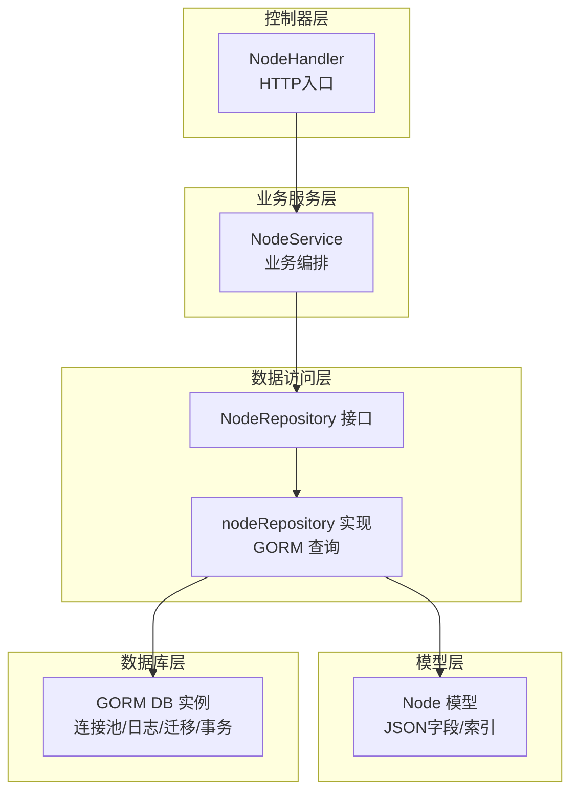
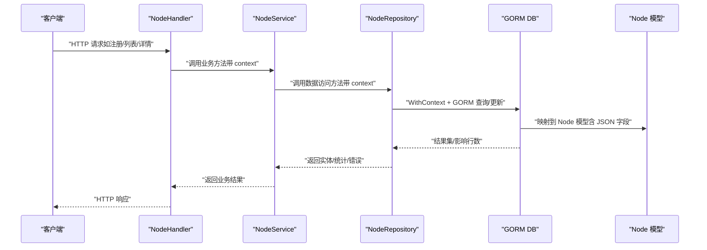
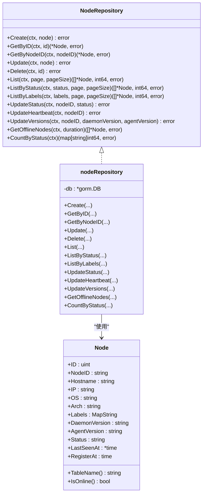
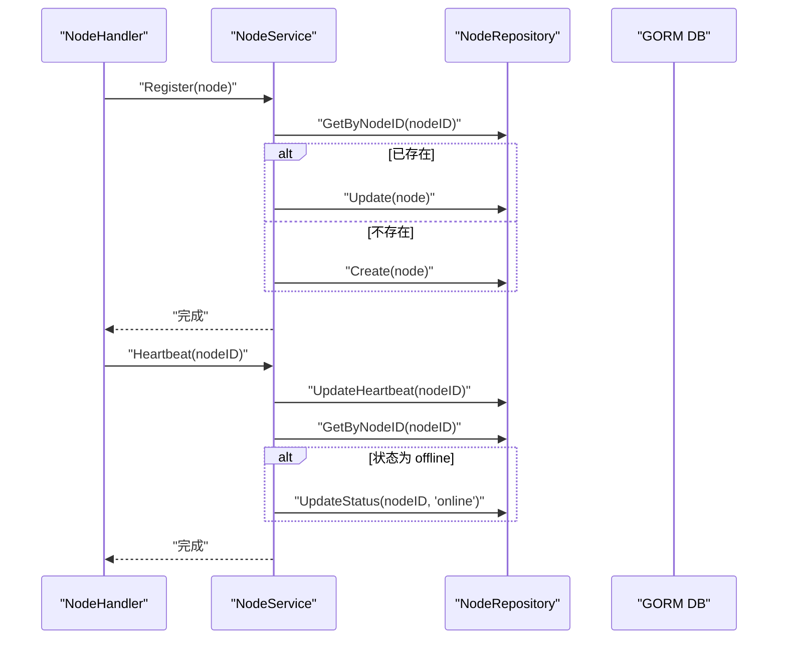
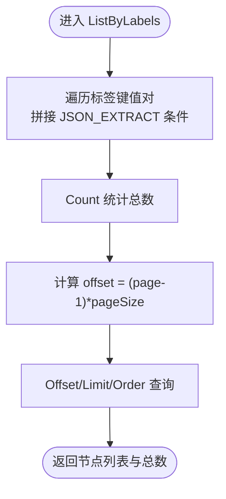
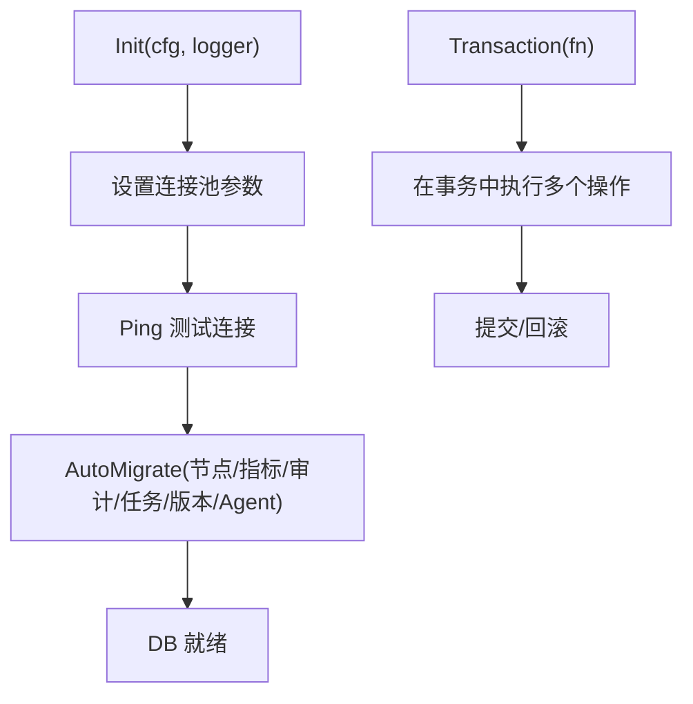
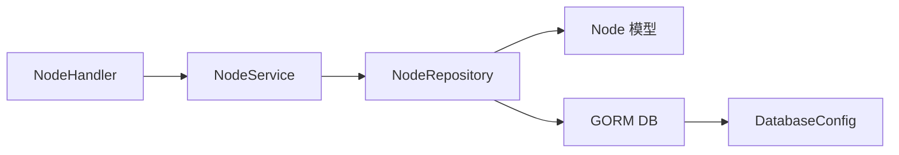

# 节点数据访问

<cite>
**本文引用的文件**
- [manager/internal/repository/node.go](file://manager/internal/repository/node.go)
- [manager/internal/service/node.go](file://manager/internal/service/node.go)
- [manager/internal/model/node.go](file://manager/internal/model/node.go)
- [manager/pkg/database/database.go](file://manager/pkg/database/database.go)
- [manager/internal/config/config.go](file://manager/internal/config/config.go)
- [manager/internal/handler/node.go](file://manager/internal/handler/node.go)
- [docs/设计文档_03_Manager模块.md](file://docs/设计文档_03_Manager模块.md)
- [config/mysql/schema.sql](file://config/mysql/schema.sql)
</cite>

## 目录
1. [简介](#简介)
2. [项目结构](#项目结构)
3. [核心组件](#核心组件)
4. [架构总览](#架构总览)
5. [详细组件分析](#详细组件分析)
6. [依赖关系分析](#依赖关系分析)
7. [性能考量](#性能考量)
8. [故障排查指南](#故障排查指南)
9. [结论](#结论)
10. [附录](#附录)

## 简介
本文件聚焦于“节点数据访问”子系统，围绕 NodeRepo 的实现机制进行深入解析，涵盖：
- 基于 GORM 的节点 CRUD 实现（创建、查询、更新、删除）
- 复杂查询构建（按状态、标签、分组等复合条件）
- 预加载与懒加载策略（节点与 Agent、分组等关联）
- 数据库连接池配置与事务最佳实践
- schema 设计对查询性能的影响及高并发优化建议

## 项目结构
节点数据访问相关代码分布在以下层次：
- 表模型层：定义节点实体及其 JSON 字段映射
- 数据访问层：NodeRepository 接口与 nodeRepository 实现
- 业务服务层：NodeService 对接 Repository，封装业务流程
- 控制器层：NodeHandler 接收 HTTP 请求，调用 NodeService
- 数据库初始化与配置：连接池、日志级别、迁移、事务

图表来源
- [manager/internal/handler/node.go](file://manager/internal/handler/node.go#L1-L157)
- [manager/internal/service/node.go](file://manager/internal/service/node.go#L1-L234)
- [manager/internal/repository/node.go](file://manager/internal/repository/node.go#L1-L226)
- [manager/internal/model/node.go](file://manager/internal/model/node.go#L1-L68)
- [manager/pkg/database/database.go](file://manager/pkg/database/database.go#L1-L281)

章节来源
- [manager/internal/handler/node.go](file://manager/internal/handler/node.go#L1-L157)
- [manager/internal/service/node.go](file://manager/internal/service/node.go#L1-L234)
- [manager/internal/repository/node.go](file://manager/internal/repository/node.go#L1-L226)
- [manager/internal/model/node.go](file://manager/internal/model/node.go#L1-L68)
- [manager/pkg/database/database.go](file://manager/pkg/database/database.go#L1-L281)

## 核心组件
- NodeRepository 接口：定义节点 CRUD、分页查询、状态更新、心跳更新、版本更新、离线检测、状态统计等能力
- nodeRepository 实现：基于 GORM 的具体实现，包含上下文透传、分页、聚合统计、JSON 条件构造等
- NodeService：在 Repository 基础上组织业务逻辑（如注册、心跳、离线检测）
- Node 模型：节点实体，包含 JSON 字段（labels）与自定义 JSON 编解码
- 数据库初始化：连接池、日志级别、迁移、事务封装

章节来源
- [manager/internal/repository/node.go](file://manager/internal/repository/node.go#L1-L39)
- [manager/internal/repository/node.go](file://manager/internal/repository/node.go#L41-L226)
- [manager/internal/service/node.go](file://manager/internal/service/node.go#L1-L60)
- [manager/internal/model/node.go](file://manager/internal/model/node.go#L1-L68)
- [manager/pkg/database/database.go](file://manager/pkg/database/database.go#L1-L80)

## 架构总览
下图展示从 HTTP 请求到数据库访问的整体链路，以及 NodeRepo 在其中的角色。

图表来源
- [manager/internal/handler/node.go](file://manager/internal/handler/node.go#L1-L157)
- [manager/internal/service/node.go](file://manager/internal/service/node.go#L1-L234)
- [manager/internal/repository/node.go](file://manager/internal/repository/node.go#L1-L226)
- [manager/internal/model/node.go](file://manager/internal/model/node.go#L1-L68)
- [manager/pkg/database/database.go](file://manager/pkg/database/database.go#L1-L80)

## 详细组件分析

### NodeRepository 接口与实现
- 接口职责：统一节点数据访问能力，便于替换实现与测试
- 实现要点：
  - 上下文透传：WithContext 保证请求级上下文传递
  - 分页查询：先 Count 再 Offset/Limit，支持按 id 降序
  - 复合条件查询：按状态、按标签（JSON_EXTRACT）、按分组（后续扩展）
  - 状态与心跳：原子更新 last_heartbeat_at 并根据状态切换
  - 统计：按 status 分组统计数量
  - 离线检测：基于 last_heartbeat_at 与阈值判断

图表来源
- [manager/internal/repository/node.go](file://manager/internal/repository/node.go#L1-L39)
- [manager/internal/repository/node.go](file://manager/internal/repository/node.go#L41-L226)
- [manager/internal/model/node.go](file://manager/internal/model/node.go#L1-L68)

章节来源
- [manager/internal/repository/node.go](file://manager/internal/repository/node.go#L1-L226)
- [manager/internal/model/node.go](file://manager/internal/model/node.go#L1-L68)

### 节点注册与状态更新流程
- 注册：若节点已存在则更新，否则创建；更新时保留原有创建时间等字段
- 心跳：更新 last_heartbeat_at；若之前为 offline，则更新为 online
- 离线检测：查询 last_heartbeat_at 超过阈值且非 offline 的节点，批量更新为 offline

图表来源
- [manager/internal/service/node.go](file://manager/internal/service/node.go#L62-L114)
- [manager/internal/service/node.go](file://manager/internal/service/node.go#L167-L188)
- [manager/internal/repository/node.go](file://manager/internal/repository/node.go#L158-L174)

章节来源
- [manager/internal/service/node.go](file://manager/internal/service/node.go#L62-L114)
- [manager/internal/service/node.go](file://manager/internal/service/node.go#L167-L188)
- [manager/internal/repository/node.go](file://manager/internal/repository/node.go#L158-L174)

### 复杂查询构建：标签、分组、状态
- 标签查询：使用 JSON_EXTRACT 构造键路径条件，支持多键组合
- 状态查询：直接按 status 字段过滤
- 分组查询：当前实现未直接体现 group_id 的查询，可在现有 ListByLabels 基础上扩展

图表来源
- [manager/internal/repository/node.go](file://manager/internal/repository/node.go#L130-L156)

章节来源
- [manager/internal/repository/node.go](file://manager/internal/repository/node.go#L130-L156)

### 预加载与懒加载策略
- 当前实现采用“懒加载”：查询节点时不会自动加载关联 Agent/分组
- 若需关联 Agent：
  - 可在 Repository 层使用 Joins/Preload 加载 Agent
  - 或在 Service 层二次查询 Agent 列表后合并
- 若需分组信息：
  - 可在模型层增加分组字段并在查询时 Join
  - 或在 Service 层补充分组缓存/映射

章节来源
- [manager/internal/repository/node.go](file://manager/internal/repository/node.go#L1-L226)
- [docs/设计文档_03_Manager模块.md](file://docs/设计文档_03_Manager模块.md#L390-L421)

### 数据库连接池配置与事务最佳实践
- 连接池参数：最大空闲连接、最大打开连接、连接最大生命周期
- 日志级别：silent/error/warn/info
- 迁移：AutoMigrate 自动迁移节点、指标、审计、任务、版本、Agent 等表
- 事务：Transaction 封装，确保跨操作一致性

图表来源
- [manager/pkg/database/database.go](file://manager/pkg/database/database.go#L21-L80)
- [manager/pkg/database/database.go](file://manager/pkg/database/database.go#L212-L263)
- [manager/pkg/database/database.go](file://manager/pkg/database/database.go#L277-L281)
- [manager/internal/config/config.go](file://manager/internal/config/config.go#L30-L38)

章节来源
- [manager/pkg/database/database.go](file://manager/pkg/database/database.go#L21-L80)
- [manager/pkg/database/database.go](file://manager/pkg/database/database.go#L212-L263)
- [manager/pkg/database/database.go](file://manager/pkg/database/database.go#L277-L281)
- [manager/internal/config/config.go](file://manager/internal/config/config.go#L30-L38)

### schema 设计与索引对查询性能的影响
- 节点表关键索引：
  - 主键：id
  - 唯一索引：uuid
  - 辅助索引：group_id、status、ip
- JSON 字段：
  - labels 为 JSON 类型，适合按键值过滤（配合 JSON_EXTRACT）
- 影响：
  - 按 status 查询：利用 idx_status
  - 按 ip 查询：利用 idx_ip
  - 按 group_id 查询：利用 idx_group_id
  - 按标签查询：JSON_EXTRACT 会受索引限制，建议在高频场景引入物化列或二级索引

章节来源
- [docs/设计文档_03_Manager模块.md](file://docs/设计文档_03_Manager模块.md#L390-L421)
- [manager/internal/model/node.go](file://manager/internal/model/node.go#L1-L68)

## 依赖关系分析
- Handler -> Service：HTTP 入口调用业务层
- Service -> Repository：业务层编排数据访问
- Repository -> Model：映射到节点模型
- Repository -> DB：GORM 访问数据库
- DB -> Config：连接池与日志配置来自配置文件

图表来源
- [manager/internal/handler/node.go](file://manager/internal/handler/node.go#L1-L157)
- [manager/internal/service/node.go](file://manager/internal/service/node.go#L1-L234)
- [manager/internal/repository/node.go](file://manager/internal/repository/node.go#L1-L226)
- [manager/internal/model/node.go](file://manager/internal/model/node.go#L1-L68)
- [manager/internal/config/config.go](file://manager/internal/config/config.go#L30-L38)

章节来源
- [manager/internal/handler/node.go](file://manager/internal/handler/node.go#L1-L157)
- [manager/internal/service/node.go](file://manager/internal/service/node.go#L1-L234)
- [manager/internal/repository/node.go](file://manager/internal/repository/node.go#L1-L226)
- [manager/internal/model/node.go](file://manager/internal/model/node.go#L1-L68)
- [manager/internal/config/config.go](file://manager/internal/config/config.go#L30-L38)

## 性能考量
- 分页与排序：按 id 降序分页，避免大 offset 导致的性能退化；建议在高频分页场景引入“游标分页”或“基于索引的边界分页”
- 标签查询：JSON_EXTRACT 不走普通索引，建议：
  - 引入物化标签列（如 tag_key/tag_value），建立联合索引
  - 或使用 JSON 函数索引（MySQL 8.0+）
- 状态与心跳：利用 status、last_heartbeat_at 建立复合索引以提升离线检测效率
- 连接池：合理设置 MaxOpenConns 与 ConnMaxLifetime，避免连接抖动
- 事务：将多步写入放入单事务，减少锁竞争与不一致风险
- 预加载：按需预加载 Agent/分组，避免 N+1 查询

[本节为通用性能建议，无需特定文件引用]

## 故障排查指南
- 常见错误与定位：
  - 数据库连接失败：检查 DSN、网络、权限；查看 Init 日志
  - 迁移异常：关注 AutoMigrate 的约束清理与重试逻辑
  - 查询慢：确认是否命中索引；评估 JSON_EXTRACT 场景
  - 事务冲突：检查并发写入与锁等待
- 日志与监控：
  - 数据库日志级别可通过配置项调整
  - 业务层对错误进行包装与记录，便于定位

章节来源
- [manager/pkg/database/database.go](file://manager/pkg/database/database.go#L21-L80)
- [manager/pkg/database/database.go](file://manager/pkg/database/database.go#L212-L263)
- [manager/internal/service/node.go](file://manager/internal/service/node.go#L62-L114)

## 结论
NodeRepo 以 GORM 为基础，提供了完善的节点数据访问能力，覆盖 CRUD、分页、状态与心跳、版本更新、离线检测与统计等核心场景。结合合理的索引设计与连接池配置，可在高并发下保持稳定性能。建议在高频标签查询与分页场景引入物化列或游标分页，并在业务层做好事务与错误处理，持续优化查询路径与数据结构。

[本节为总结性内容，无需特定文件引用]

## 附录

### 表结构与索引参考
- 节点表（nodes）关键字段与索引：
  - 主键：id
  - 唯一索引：uuid
  - 辅助索引：group_id、status、ip
  - JSON 字段：labels
- Agent 表（agents）与节点表（nodes）存在外键关联

章节来源
- [docs/设计文档_03_Manager模块.md](file://docs/设计文档_03_Manager模块.md#L390-L421)
- [docs/设计文档_03_Manager模块.md](file://docs/设计文档_03_Manager模块.md#L423-L442)

### 数据库初始化与连接池配置
- 初始化流程：解析配置 -> 设置日志级别 -> 连接数据库 -> 设置连接池 -> Ping 测试
- 迁移：自动迁移节点、指标、审计、任务、版本、Agent 等表
- 事务：提供 Transaction 封装

章节来源
- [manager/pkg/database/database.go](file://manager/pkg/database/database.go#L21-L80)
- [manager/pkg/database/database.go](file://manager/pkg/database/database.go#L212-L263)
- [manager/pkg/database/database.go](file://manager/pkg/database/database.go#L277-L281)
- [manager/internal/config/config.go](file://manager/internal/config/config.go#L30-L38)