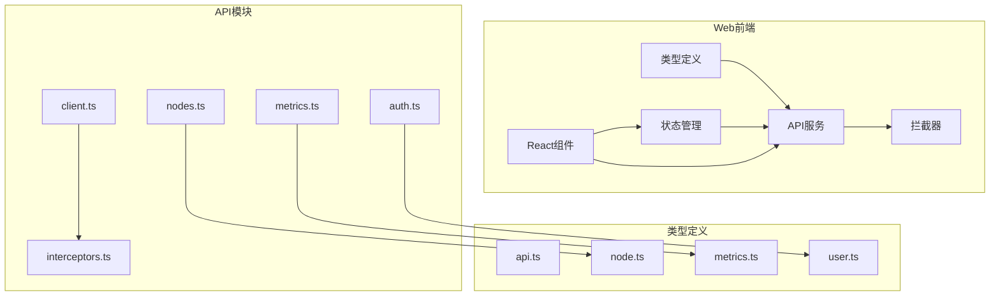
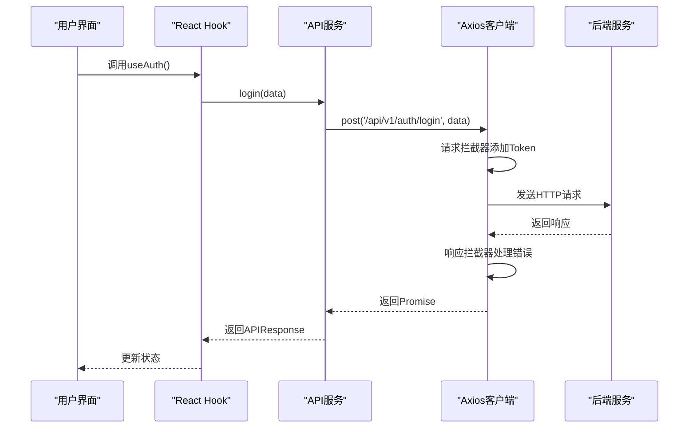
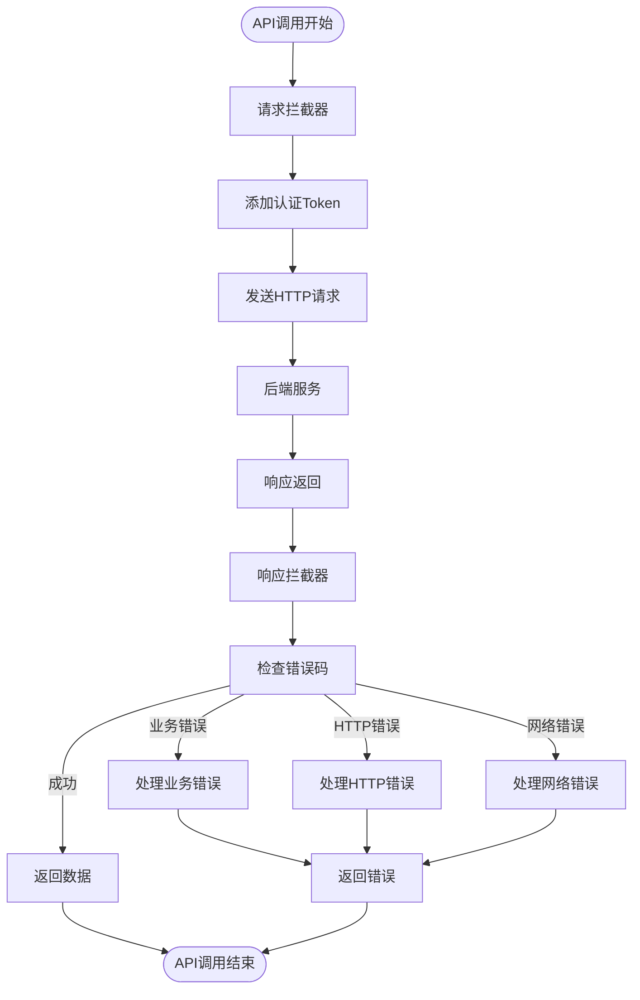
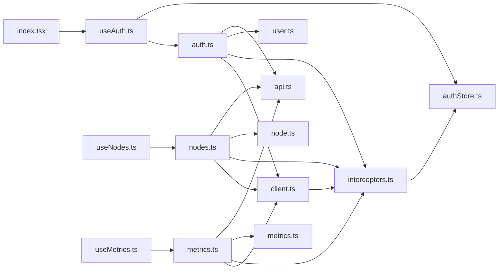
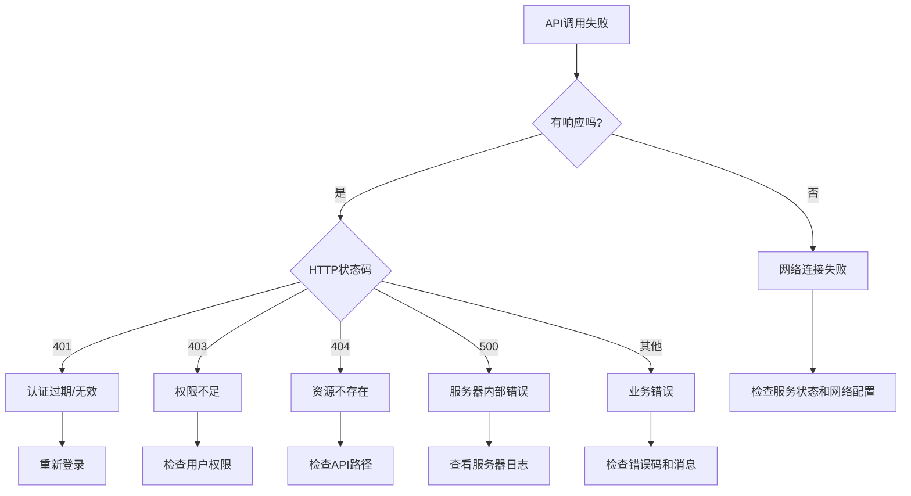

# API服务模块

<cite>
**本文档引用的文件**
- [auth.ts](file://web/src/api/auth.ts)
- [nodes.ts](file://web/src/api/nodes.ts)
- [metrics.ts](file://web/src/api/metrics.ts)
- [client.ts](file://web/src/api/client.ts)
- [interceptors.ts](file://web/src/api/interceptors.ts)
- [api.ts](file://web/src/types/api.ts)
- [node.ts](file://web/src/types/node.ts)
- [metrics.ts](file://web/src/types/metrics.ts)
- [user.ts](file://web/src/types/user.ts)
- [useAuth.ts](file://web/src/hooks/useAuth.ts)
- [useNodes.ts](file://web/src/hooks/useNodes.ts)
- [useMetrics.ts](file://web/src/hooks/useMetrics.ts)
- [authStore.ts](file://web/src/stores/authStore.ts)
- [index.tsx](file://web/src/pages/Login/index.tsx)
</cite>

## 目录
1. [简介](#简介)
2. [项目结构](#项目结构)
3. [核心组件](#核心组件)
4. [架构概述](#架构概述)
5. [详细组件分析](#详细组件分析)
6. [依赖分析](#依赖分析)
7. [性能考虑](#性能考虑)
8. [故障排除指南](#故障排除指南)
9. [结论](#结论)

## 简介
本项目是一个运维框架，包含agent、daemon、manager和web四个主要模块。其中web模块提供了前端用户界面，通过模块化的API服务与后端进行交互。这些API服务包括认证(auth.ts)、节点管理(nodes.ts)和监控指标(metrics.ts)等，每个服务都封装了特定功能域的RESTful接口。系统使用TypeScript接口定义强类型的请求/响应契约，提升了类型安全性和开发效率。

## 项目结构



**图示来源**
- [auth.ts](file://web/src/api/auth.ts#L1-L43)
- [nodes.ts](file://web/src/api/nodes.ts#L1-L47)
- [metrics.ts](file://web/src/api/metrics.ts#L1-L58)
- [client.ts](file://web/src/api/client.ts#L1-L18)
- [interceptors.ts](file://web/src/api/interceptors.ts#L1-L95)

**本节来源**
- [web/src/api](file://web/src/api)
- [web/src/types](file://web/src/types)

## 核心组件

前端API服务模块采用模块化设计，将不同功能域的RESTful接口封装在独立的文件中。auth.ts处理认证相关接口，nodes.ts管理节点操作，metrics.ts负责监控指标获取。这些服务都基于统一的client.ts配置和interceptors.ts拦截器，确保了请求的一致性和安全性。通过TypeScript接口定义强类型的请求/响应契约，如LoginRequest、Node、MetricsHistoryResponse等，提升了代码的类型安全性和开发效率。

**本节来源**
- [auth.ts](file://web/src/api/auth.ts#L1-L43)
- [nodes.ts](file://web/src/api/nodes.ts#L1-L47)
- [metrics.ts](file://web/src/api/metrics.ts#L1-L58)
- [api.ts](file://web/src/types/api.ts#L1-L55)

## 架构概述



**图示来源**
- [auth.ts](file://web/src/api/auth.ts#L19-L21)
- [interceptors.ts](file://web/src/api/interceptors.ts#L14-L94)
- [useAuth.ts](file://web/src/hooks/useAuth.ts#L17-L23)
- [client.ts](file://web/src/api/client.ts#L9-L17)

## 详细组件分析

### 认证服务分析

认证服务(auth.ts)封装了用户登录、注册、获取资料和修改密码等接口。每个API函数都返回Promise<APIResponse<T>>类型，确保了响应数据的类型安全。

```mermaid
classDiagram
class auth {
+login(data : LoginRequest) : Promise~APIResponse~LoginResponse~~
+register(data : RegisterRequest) : Promise~APIResponse~RegisterResponse~~
+getProfile() : Promise~APIResponse~{user : User}~~
+changePassword(data : ChangePasswordRequest) : Promise~APIResponse~
}
class user {
+id : number
+username : string
+email : string
+role : UserRole
+status : UserStatus
}
class LoginRequest {
+username : string
+password : string
}
class LoginResponse {
+token : string
+user : User
}
auth --> user : "使用"
auth --> LoginRequest : "参数"
auth --> LoginResponse : "返回"
```

**图示来源**
- [auth.ts](file://web/src/api/auth.ts#L19-L42)
- [user.ts](file://web/src/types/user.ts#L5-L52)
- [api.ts](file://web/src/types/api.ts#L6-L11)

**本节来源**
- [auth.ts](file://web/src/api/auth.ts#L1-L43)
- [user.ts](file://web/src/types/user.ts#L1-L52)

### 节点管理服务分析

节点管理服务(nodes.ts)提供了节点列表、详情、删除和统计信息等操作接口。通过分页参数支持大规模节点的高效管理。

```mermaid
classDiagram
class nodes {
+getNodes(params : {page, page_size, status}) : Promise~APIResponse~PageResponse~Node~~~
+getNode(id : string) : Promise~APIResponse~{node : Node}~~
+deleteNode(id : number) : Promise~APIResponse~
+getNodeStatistics() : Promise~APIResponse~{statistics : NodeStatistics}~~
}
class Node {
+id : number
+node_id : string
+hostname : string
+ip : string
+os : string
+arch : string
+status : NodeStatus
+labels? : Record~string, string~
+created_at : string
+updated_at : string
}
class NodeStatistics {
+total : number
+online : number
+offline : number
}
class PageResponse {
+list : T[]
+page_info : PageInfo
}
class PageInfo {
+page : number
+page_size : number
+total : number
+total_pages? : number
}
nodes --> Node : "使用"
nodes --> NodeStatistics : "使用"
nodes --> PageResponse : "使用"
PageResponse --> PageInfo : "包含"
```

**图示来源**
- [nodes.ts](file://web/src/api/nodes.ts#L11-L47)
- [node.ts](file://web/src/types/node.ts#L5-L71)
- [api.ts](file://web/src/types/api.ts#L22-L25)

**本节来源**
- [nodes.ts](file://web/src/api/nodes.ts#L1-L47)
- [node.ts](file://web/src/types/node.ts#L1-L71)

### 监控指标服务分析

监控指标服务(metrics.ts)提供了获取最新指标、历史数据、统计摘要和集群概览等功能，支持全面的系统监控需求。

```mermaid
classDiagram
class metrics {
+getLatestMetrics(nodeId : string) : Promise~APIResponse~MetricsLatestResponse~~
+getMetricsHistory(nodeId : string, type : string, params : {start_time, end_time}) : Promise~APIResponse~MetricsHistoryResponse~~
+getMetricsSummary(nodeId : string, timeRange? : TimeRange) : Promise~APIResponse~MetricsSummaryResponse~~
+getClusterOverview() : Promise~APIResponse~ClusterOverviewResponse~~
}
class MetricsLatestResponse {
+cpu? : MetricData
+memory? : MetricData
+disk? : MetricData
+network? : MetricData
}
class MetricsHistoryResponse {
+MetricData[]
}
class MetricsSummaryResponse {
+cpu? : MetricSummary
+memory? : MetricSummary
+disk? : MetricSummary
+network? : MetricSummary
}
class ClusterOverviewResponse {
+aggregate : {avg_cpu, avg_memory, avg_disk, total_memory_gb, total_disk_gb, node_counts}
+nodes : NodeMetrics[]
}
class MetricData {
+id : number
+node_id : string
+type : 'cpu' | 'memory' | 'disk' | 'network'
+timestamp : string
+values : Record~string, any~
}
class MetricSummary {
+min : number
+max : number
+avg : number
+latest : number
}
class TimeRange {
+startTime : Date
+endTime : Date
}
class NodeMetrics {
+node_id : string
+hostname : string
+ip : string
+status : string
+cpu_usage : number
+memory_usage : number
+disk_usage : number
+network_rx : number
+network_tx : number
}
metrics --> MetricsLatestResponse : "返回"
metrics --> MetricsHistoryResponse : "返回"
metrics --> MetricsSummaryResponse : "返回"
metrics --> ClusterOverviewResponse : "返回"
metrics --> TimeRange : "参数"
```

**图示来源**
- [metrics.ts](file://web/src/api/metrics.ts#L11-L57)
- [metrics.ts](file://web/src/types/metrics.ts#L1-L93)
- [api.ts](file://web/src/types/api.ts#L6-L11)

**本节来源**
- [metrics.ts](file://web/src/api/metrics.ts#L1-L58)
- [web/src/types/metrics.ts](file://web/src/types/metrics.ts#L1-L93)

### 客户端与拦截器分析

客户端(client.ts)和拦截器(interceptors.ts)提供了统一的HTTP配置和请求/响应处理逻辑，确保了API调用的一致性和安全性。



**图示来源**
- [client.ts](file://web/src/api/client.ts#L9-L17)
- [interceptors.ts](file://web/src/api/interceptors.ts#L14-L94)

**本节来源**
- [client.ts](file://web/src/api/client.ts#L1-L18)
- [interceptors.ts](file://web/src/api/interceptors.ts#L1-L95)

## 依赖分析



**图示来源**
- [auth.ts](file://web/src/api/auth.ts#L5-L14)
- [nodes.ts](file://web/src/api/nodes.ts#L5-L6)
- [metrics.ts](file://web/src/api/metrics.ts#L5-L6)
- [client.ts](file://web/src/api/client.ts#L6)
- [interceptors.ts](file://web/src/api/interceptors.ts#L6-L8)
- [useAuth.ts](file://web/src/hooks/useAuth.ts#L7)
- [useNodes.ts](file://web/src/hooks/useNodes.ts#L6)
- [useMetrics.ts](file://web/src/hooks/useMetrics.ts#L7)
- [authStore.ts](file://web/src/stores/authStore.ts#L7)

**本节来源**
- [web/src/api](file://web/src/api)
- [web/src/hooks](file://web/src/hooks)
- [web/src/stores](file://web/src/stores)

## 性能考虑

API服务模块在性能方面进行了多项优化。首先，通过React Query的缓存机制(useQuery)避免了重复请求，如useLatestMetrics设置了25秒的缓存时间。其次，自动刷新功能(refetchInterval)以30秒间隔获取最新指标，平衡了数据实时性和网络负载。对于历史数据，设置了5分钟的缓存时间，减少对服务器的频繁请求。此外，分页参数支持大规模数据的高效加载，避免一次性获取过多数据导致性能问题。

**本节来源**
- [useMetrics.ts](file://web/src/hooks/useMetrics.ts#L20-L21)
- [useMetrics.ts](file://web/src/hooks/useMetrics.ts#L53-L54)
- [useMetrics.ts](file://web/src/hooks/useMetrics.ts#L75)
- [useMetrics.ts](file://web/src/hooks/useMetrics.ts#L92)
- [nodes.ts](file://web/src/api/nodes.ts#L11-L15)

## 故障排除指南

当API调用出现问题时，可以按照以下步骤进行排查：

1. **网络连接问题**：检查Manager服务是否已启动，API地址配置是否正确（.env.development文件），以及防火墙或网络设置。
2. **认证问题**：检查Token是否过期或无效，响应拦截器会自动处理401错误并重定向到登录页面。
3. **参数错误**：确保请求参数符合TypeScript接口定义，如LoginRequest必须包含username和password字段。
4. **数据解析问题**：确认后端返回的响应格式符合APIResponse<T>契约，包含code、message和data字段。
5. **缓存问题**：如果数据未及时更新，检查React Query的缓存设置和refetchInterval配置。



**图示来源**
- [interceptors.ts](file://web/src/api/interceptors.ts#L55-L90)
- [useAuth.ts](file://web/src/hooks/useAuth.ts#L17-L23)
- [authStore.ts](file://web/src/stores/authStore.ts#L43-L49)

**本节来源**
- [interceptors.ts](file://web/src/api/interceptors.ts#L55-L90)
- [useAuth.ts](file://web/src/hooks/useAuth.ts#L37-L39)
- [authStore.ts](file://web/src/stores/authStore.ts#L43-L49)

## 结论

本项目的API服务模块通过模块化设计实现了良好的可维护性和扩展性。每个服务文件（auth.ts、nodes.ts、metrics.ts）都封装了特定功能域的RESTful接口，职责清晰。TypeScript接口定义了强类型的请求/响应契约，提升了类型安全性和开发效率。通过统一的客户端配置和拦截器，实现了请求的标准化处理和错误的集中管理。与前端组件的解耦设计使得API服务可以独立演进，同时通过React Hook提供了简洁的使用接口。这种架构不仅提高了代码质量，也为未来的功能扩展奠定了坚实的基础。