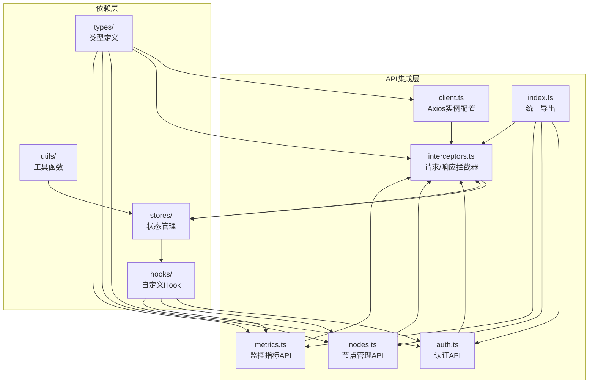
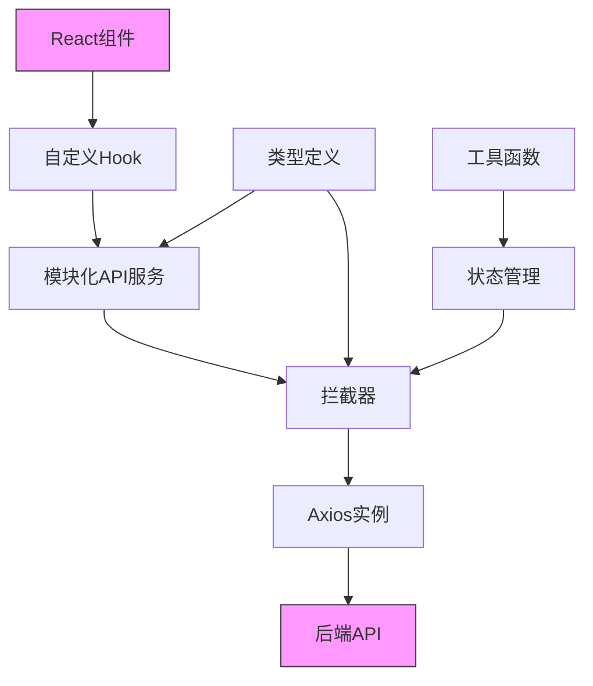
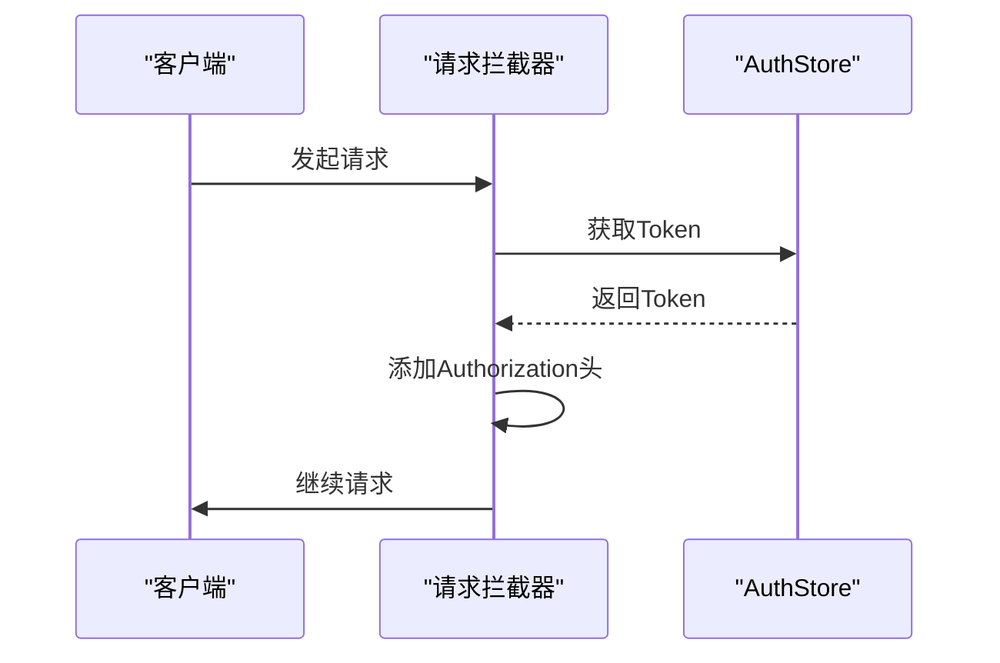
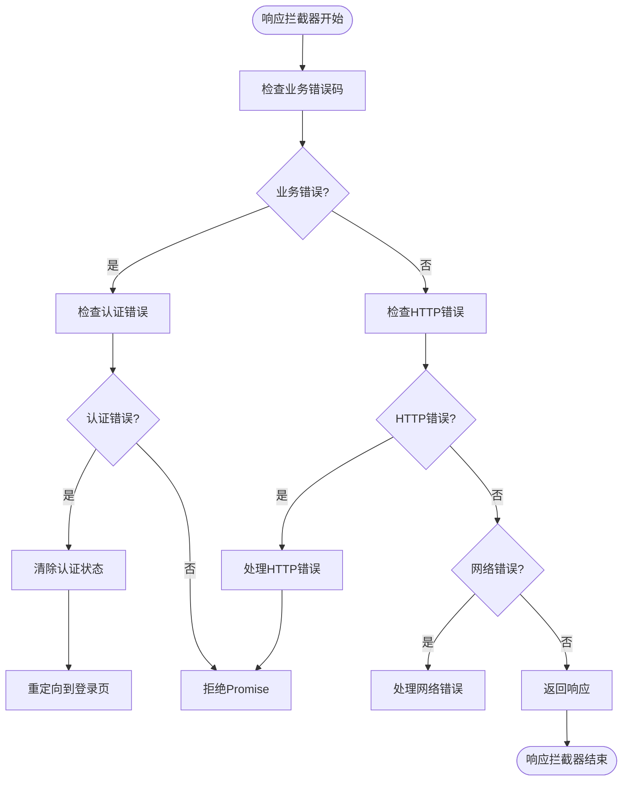
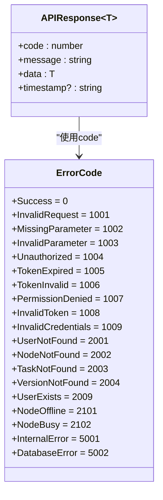
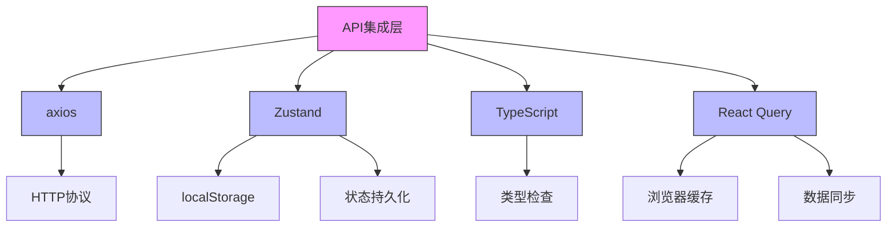
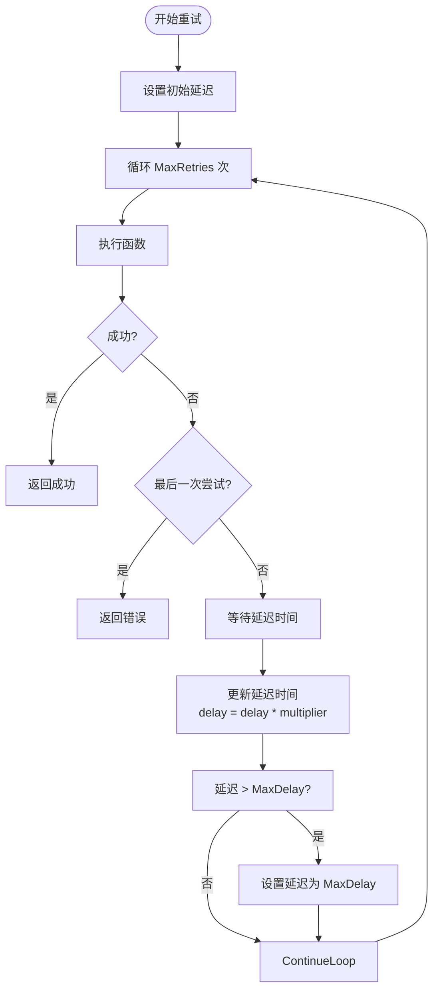

# API集成层

<cite>
**本文档引用的文件**
- [client.ts](file://web/src/api/client.ts)
- [interceptors.ts](file://web/src/api/interceptors.ts)
- [auth.ts](file://web/src/api/auth.ts)
- [nodes.ts](file://web/src/api/nodes.ts)
- [metrics.ts](file://web/src/api/metrics.ts)
- [api.ts](file://web/src/types/api.ts)
- [authStore.ts](file://web/src/stores/authStore.ts)
- [storage.ts](file://web/src/utils/storage.ts)
- [useAuth.ts](file://web/src/hooks/useAuth.ts)
- [useNodes.ts](file://web/src/hooks/useNodes.ts)
- [useMetrics.ts](file://web/src/hooks/useMetrics.ts)
</cite>

## 目录
1. [简介](#简介)
2. [项目结构](#项目结构)
3. [核心组件](#核心组件)
4. [架构概述](#架构概述)
5. [详细组件分析](#详细组件分析)
6. [依赖分析](#依赖分析)
7. [性能考虑](#性能考虑)
8. [故障排除指南](#故障排除指南)
9. [结论](#结论)

## 简介
本文档全面介绍了基于Axios的RESTful通信架构，重点分析了前端应用中的API集成层。文档详细说明了axios实例的配置、拦截器的实现机制、模块化API服务的设计模式以及强类型的请求/响应契约。通过TypeScript接口定义和Zustand状态管理，实现了高效、可靠的前后端通信。文档还提供了API调用的最佳实践，包括错误处理、重试机制和缓存策略。

## 项目结构
API集成层位于`web/src/api`目录下，采用模块化设计，将不同的业务功能分离到独立的文件中。该层与类型定义、状态管理和业务逻辑层紧密协作，形成了一个完整的前端通信解决方案。



**图示来源**
- [client.ts](file://web/src/api/client.ts)
- [interceptors.ts](file://web/src/api/interceptors.ts)
- [auth.ts](file://web/src/api/auth.ts)
- [nodes.ts](file://web/src/api/nodes.ts)
- [metrics.ts](file://web/src/api/metrics.ts)
- [index.ts](file://web/src/api/index.ts)

**本节来源**
- [client.ts](file://web/src/api/client.ts)
- [interceptors.ts](file://web/src/api/interceptors.ts)
- [auth.ts](file://web/src/api/auth.ts)
- [nodes.ts](file://web/src/api/nodes.ts)
- [metrics.ts](file://web/src/api/metrics.ts)

## 核心组件
API集成层的核心组件包括axios实例配置、拦截器机制和模块化的API服务。这些组件共同构建了一个健壮、可维护的通信架构。通过在`client.ts`中创建的axios实例，设置了基础URL、超时时间和默认请求头；`interceptors.ts`实现了请求拦截器（自动添加JWT令牌）和响应拦截器（统一错误处理、401重定向）；`auth.ts`、`nodes.ts`、`metrics.ts`等文件则通过TypeScript接口定义了强类型的请求/响应契约，实现了模块化的API服务设计。

**本节来源**
- [client.ts](file://web/src/api/client.ts#L1-L18)
- [interceptors.ts](file://web/src/api/interceptors.ts#L1-L95)
- [auth.ts](file://web/src/api/auth.ts#L1-L43)

## 架构概述
API集成层采用分层架构设计，将通信逻辑与业务逻辑分离。最底层是axios实例，负责HTTP通信；中间层是拦截器，处理认证和错误；上层是模块化的API服务，提供具体的业务接口；顶层是自定义Hook，将API与React组件连接。



**图示来源**
- [client.ts](file://web/src/api/client.ts#L1-L18)
- [interceptors.ts](file://web/src/api/interceptors.ts#L1-L95)
- [authStore.ts](file://web/src/stores/authStore.ts#L1-L85)
- [useAuth.ts](file://web/src/hooks/useAuth.ts#L1-L73)

## 详细组件分析

### Axios客户端配置分析
`client.ts`文件创建了axios实例，配置了基础URL、超时设置和默认请求头。基础URL通过环境变量`VITE_API_BASE_URL`配置，默认值为`http://127.0.0.1:8080`。超时时间通过环境变量`VITE_API_TIMEOUT`配置，默认值为30000毫秒。默认请求头设置了`Content-Type`为`application/json`。

**本节来源**
- [client.ts](file://web/src/api/client.ts#L1-L18)

### 拦截器机制分析
拦截器机制是API集成层的核心，分为请求拦截器和响应拦截器两部分。

#### 请求拦截器
请求拦截器在每个请求发送前自动添加JWT令牌。它从Zustand store中获取当前用户的token，并将其添加到请求头的`Authorization`字段中，格式为`Bearer {token}`。



**图示来源**
- [interceptors.ts](file://web/src/api/interceptors.ts#L14-L27)
- [authStore.ts](file://web/src/stores/authStore.ts#L1-L85)

#### 响应拦截器
响应拦截器处理服务器响应，实现统一的错误处理和401重定向。它检查响应数据中的业务错误码，当遇到认证相关的错误码（如1004、1005、1006、1008）时，清除认证状态并重定向到登录页面。对于HTTP状态码，也进行了分类处理，如401未授权、403无权限、404资源不存在、500服务器错误等。



**图示来源**
- [interceptors.ts](file://web/src/api/interceptors.ts#L32-L92)
- [api.ts](file://web/src/types/api.ts#L28-L54)

**本节来源**
- [interceptors.ts](file://web/src/api/interceptors.ts#L1-L95)

### 模块化API服务分析
API服务采用模块化设计，每个业务领域都有独立的API文件，如`auth.ts`、`nodes.ts`、`metrics.ts`等。这些文件导出具体的API函数，函数返回Promise，类型为`APIResponse<T>`，其中T是具体的响应数据类型。

#### 认证API服务
认证API服务提供了用户登录、注册、获取用户资料和修改密码等接口。所有接口都通过拦截器自动处理认证。

```mermaid
classDiagram
class AuthService {
+login(data : LoginRequest) : Promise~APIResponse~LoginResponse~~
+register(data : RegisterRequest) : Promise~APIResponse~RegisterResponse~~
+getProfile() : Promise~APIResponse~{user : User}~~
+changePassword(data : ChangePasswordRequest) : Promise~APIResponse~
}
class LoginRequest {
+username : string
+password : string
}
class LoginResponse {
+token : string
+user : User
}
class User {
+id : number
+username : string
+email : string
+role : UserRole
+status : UserStatus
+created_at : string
+updated_at : string
+last_login_at? : string
}
AuthService --> LoginRequest : "使用"
AuthService --> LoginResponse : "返回"
AuthService --> User : "包含"
```

**图示来源**
- [auth.ts](file://web/src/api/auth.ts#L1-L43)
- [user.ts](file://web/src/types/user.ts#L1-L52)
- [api.ts](file://web/src/types/api.ts#L6-L11)

#### 节点管理API服务
节点管理API服务提供了获取节点列表、节点详情、删除节点和节点统计信息等接口。

```mermaid
classDiagram
class NodesService {
+getNodes(params : {page? : number, page_size? : number, status? : string}) : Promise~APIResponse~PageResponse~Node~~~
+getNode(id : string) : Promise~APIResponse~{node : Node}~~
+deleteNode(id : number) : Promise~APIResponse~
+getNodeStatistics() : Promise~APIResponse~{statistics : NodeStatistics}~~
}
class Node {
+id : number
+node_id : string
+hostname : string
+ip : string
+os : string
+arch : string
+status : NodeStatus
+labels? : Record~string, string~
+created_at : string
+updated_at : string
+last_heartbeat_at? : string
}
class NodeStatistics {
+total : number
+online : number
+offline : number
}
NodesService --> Node : "使用"
NodesService --> NodeStatistics : "返回"
```

**图示来源**
- [nodes.ts](file://web/src/api/nodes.ts#L1-L47)
- [node.ts](file://web/src/types/node.ts#L1-L71)

#### 监控指标API服务
监控指标API服务提供了获取最新指标、历史指标数据、指标统计摘要和集群资源概览等接口。

```mermaid
classDiagram
class MetricsService {
+getLatestMetrics(nodeId : string) : Promise~APIResponse~MetricsLatestResponse~~
+getMetricsHistory(nodeId : string, type : string, params : {start_time : string, end_time : string}) : Promise~APIResponse~MetricsHistoryResponse~~
+getMetricsSummary(nodeId : string, timeRange? : TimeRange) : Promise~APIResponse~MetricsSummaryResponse~~
+getClusterOverview() : Promise~APIResponse~ClusterOverviewResponse~~
}
class MetricsLatestResponse {
+cpu? : MetricData
+memory? : MetricData
+disk? : MetricData
+network? : MetricData
}
class MetricsHistoryResponse {
+type MetricData[]
}
class MetricsSummaryResponse {
+cpu? : MetricSummary
+memory? : MetricSummary
+disk? : MetricSummary
+network? : MetricSummary
}
class ClusterOverviewResponse {
+aggregate : ClusterAggregate
+nodes : NodeMetrics[]
}
MetricsService --> MetricsLatestResponse : "返回"
MetricsService --> MetricsHistoryResponse : "返回"
MetricsService --> MetricsSummaryResponse : "返回"
MetricsService --> ClusterOverviewResponse : "返回"
```

**图示来源**
- [metrics.ts](file://web/src/api/metrics.ts#L1-L58)
- [metrics.ts](file://web/src/types/metrics.ts#L1-L93)

**本节来源**
- [auth.ts](file://web/src/api/auth.ts#L1-L43)
- [nodes.ts](file://web/src/api/nodes.ts#L1-L47)
- [metrics.ts](file://web/src/api/metrics.ts#L1-L58)
- [user.ts](file://web/src/types/user.ts#L1-L52)
- [node.ts](file://web/src/types/node.ts#L1-L71)
- [metrics.ts](file://web/src/types/metrics.ts#L1-L93)

### 强类型契约分析
通过TypeScript接口定义了强类型的请求/响应契约，确保了类型安全。`APIResponse<T>`接口定义了统一的响应格式，包含code、message、data和timestamp字段。`ErrorCode`枚举定义了各种错误码，便于前端统一处理。



**图示来源**
- [api.ts](file://web/src/types/api.ts#L6-L54)

**本节来源**
- [api.ts](file://web/src/types/api.ts#L1-L55)

## 依赖分析
API集成层依赖于多个核心组件，包括axios库、Zustand状态管理、TypeScript类型系统和React Query数据获取库。



**图示来源**
- [client.ts](file://web/src/api/client.ts#L5-L6)
- [interceptors.ts](file://web/src/api/interceptors.ts#L7-L8)
- [authStore.ts](file://web/src/stores/authStore.ts#L5-L6)
- [useAuth.ts](file://web/src/hooks/useAuth.ts#L5-L6)
- [useNodes.ts](file://web/src/hooks/useNodes.ts#L5-L6)
- [useMetrics.ts](file://web/src/hooks/useMetrics.ts#L5-L6)

**本节来源**
- [client.ts](file://web/src/api/client.ts#L1-L18)
- [interceptors.ts](file://web/src/api/interceptors.ts#L1-L95)
- [authStore.ts](file://web/src/stores/authStore.ts#L1-L85)
- [useAuth.ts](file://web/src/hooks/useAuth.ts#L1-L73)
- [useNodes.ts](file://web/src/hooks/useNodes.ts#L1-L58)
- [useMetrics.ts](file://web/src/hooks/useMetrics.ts#L1-L103)

## 性能考虑
API集成层在性能方面做了多项优化，包括请求缓存、自动刷新和错误重试机制。

### 缓存策略
通过React Query实现了智能缓存策略。在`useLatestMetrics`中设置了25秒的缓存时间（staleTime）和30秒的自动刷新间隔（refetchInterval），避免了不必要的重复请求。对于历史数据，设置了5分钟的缓存时间，因为历史数据相对稳定。

### 并发控制
React Query自动处理了并发请求的去重。当多个组件同时请求相同的数据时，React Query会合并这些请求，只发送一次HTTP请求，然后将结果分发给所有订阅者。

### 错误重试机制
虽然当前前端代码中没有显式的重试逻辑，但在后端代码中发现了重试机制的实现。`RetryWithBackoff`函数实现了带退避策略的重试机制，可用于处理临时性网络故障。



**图示来源**
- [设计文档_01_Daemon模块.md](file://docs/设计文档_01_Daemon模块.md#L1356-L1381)

**本节来源**
- [useMetrics.ts](file://web/src/hooks/useMetrics.ts#L20-L21)
- [useMetricsHistory.ts](file://web/src/hooks/useMetrics.ts#L53-L54)
- [设计文档_01_Daemon模块.md](file://docs/设计文档_01_Daemon模块.md#L1356-L1381)

## 故障排除指南
### 常见问题及解决方案
1. **网络连接失败**
   - 检查Manager服务是否已启动（运行`make run-dev`）
   - 检查API地址配置是否正确（检查`.env.development`文件）
   - 检查防火墙或网络设置

2. **未授权，请重新登录**
   - 检查Token是否已过期
   - 尝试重新登录获取新Token
   - 检查后端JWT配置

3. **请求的资源不存在**
   - 检查API路径是否正确
   - 确认后端服务是否正常运行
   - 检查路由配置

4. **服务器内部错误**
   - 查看后端日志获取详细错误信息
   - 检查数据库连接是否正常
   - 确认相关服务是否正常运行

### 调试技巧
- 使用浏览器开发者工具查看网络请求和响应
- 检查localStorage中的`ops_token`和`ops_user`是否正确
- 在`interceptors.ts`中添加console.log进行调试
- 使用React DevTools检查组件状态

**本节来源**
- [interceptors.ts](file://web/src/api/interceptors.ts#L83-L86)
- [authStore.ts](file://web/src/stores/authStore.ts#L5-L6)
- [storage.ts](file://web/src/utils/storage.ts#L5-L6)

## 结论
API集成层通过axios、拦截器、模块化API服务和TypeScript类型系统，构建了一个健壮、可维护的RESTful通信架构。该架构实现了自动认证、统一错误处理、强类型契约和智能缓存等特性，大大提高了开发效率和系统可靠性。通过与Zustand状态管理和React Query数据获取库的集成，实现了状态的统一管理和数据的高效同步。建议在未来的开发中，可以考虑引入更完善的错误重试机制和更精细的缓存策略，以进一步提升用户体验和系统稳定性。