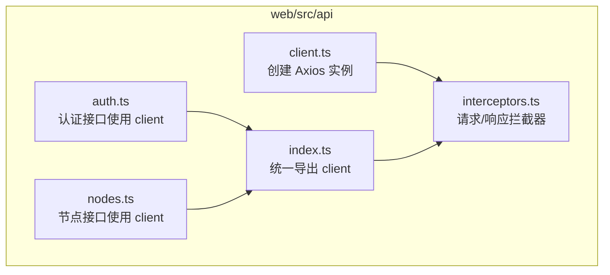
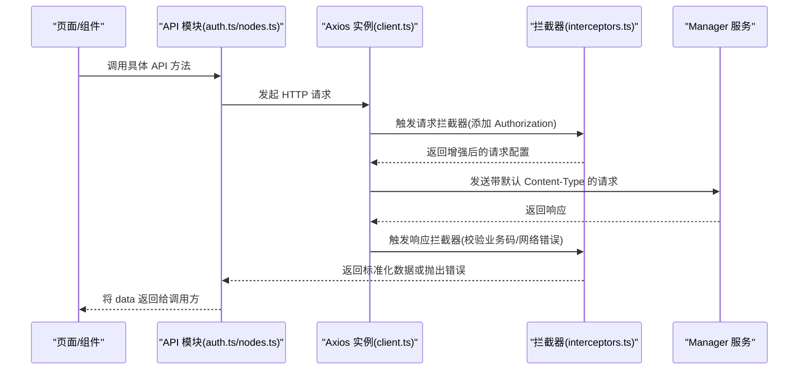
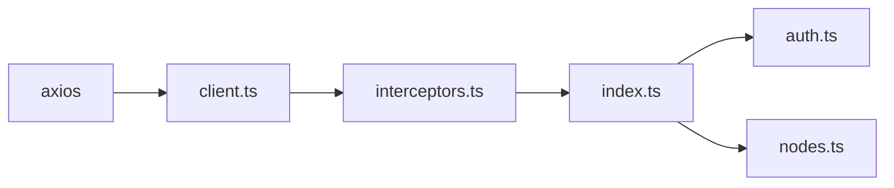

# 客户端配置

<cite>
**本文引用的文件**
- [web/src/api/client.ts](file://web/src/api/client.ts)
- [web/src/api/interceptors.ts](file://web/src/api/interceptors.ts)
- [web/src/api/index.ts](file://web/src/api/index.ts)
- [web/src/api/auth.ts](file://web/src/api/auth.ts)
- [web/src/api/nodes.ts](file://web/src/api/nodes.ts)
- [web/.env.development](file://web/.env.development)
- [web/.env.production](file://web/.env.production)
</cite>

## 目录
1. [简介](#简介)
2. [项目结构](#项目结构)
3. [核心组件](#核心组件)
4. [架构总览](#架构总览)
5. [详细组件分析](#详细组件分析)
6. [依赖关系分析](#依赖关系分析)
7. [性能考量](#性能考量)
8. [故障排查指南](#故障排查指南)
9. [结论](#结论)
10. [附录：环境变量与最佳实践](#附录环境变量与最佳实践)

## 简介
本文件聚焦于前端 Web 侧基于 Axios 的 HTTP 客户端实例配置，围绕以下主题展开：
- baseURL 如何从 VITE_API_BASE_URL 环境变量读取，开发环境默认指向本地 Manager 服务；
- timeout 设置为 30 秒的合理性及对用户体验的影响；
- Content-Type 默认头的应用场景；
- 通过 axios.create() 的配置参数进行说明；
- 在不同部署环境（开发、测试、生产）中如何通过 .env 文件调整配置的最佳实践；
- 单例 client 的设计优势，包括统一管理请求配置、便于注入拦截器等。

## 项目结构
前端 Web 位于 web 目录，HTTP 客户端与拦截器位于 web/src/api 下，API 层按功能拆分模块（如认证、节点、指标等），统一通过一个入口导出 client。

图表来源
- [web/src/api/client.ts](file://web/src/api/client.ts#L1-L18)
- [web/src/api/interceptors.ts](file://web/src/api/interceptors.ts#L1-L95)
- [web/src/api/index.ts](file://web/src/api/index.ts#L1-L10)
- [web/src/api/auth.ts](file://web/src/api/auth.ts#L1-L43)
- [web/src/api/nodes.ts](file://web/src/api/nodes.ts#L1-L47)

章节来源
- [web/src/api/client.ts](file://web/src/api/client.ts#L1-L18)
- [web/src/api/interceptors.ts](file://web/src/api/interceptors.ts#L1-L95)
- [web/src/api/index.ts](file://web/src/api/index.ts#L1-L10)

## 核心组件
- Axios 实例 client：通过 axios.create() 创建，集中定义 baseURL、timeout、默认 headers 等基础配置。
- 拦截器：在 client 上注入请求/响应拦截器，统一处理鉴权头、业务错误码、网络错误提示等。
- API 模块：各功能模块（如认证、节点）均从统一入口导入 client，确保一致的行为和配置。

章节来源
- [web/src/api/client.ts](file://web/src/api/client.ts#L1-L18)
- [web/src/api/interceptors.ts](file://web/src/api/interceptors.ts#L1-L95)
- [web/src/api/index.ts](file://web/src/api/index.ts#L1-L10)

## 架构总览
下图展示了从页面调用到后端服务的整体流程，以及拦截器在请求/响应阶段的作用。

图表来源
- [web/src/api/auth.ts](file://web/src/api/auth.ts#L1-L43)
- [web/src/api/nodes.ts](file://web/src/api/nodes.ts#L1-L47)
- [web/src/api/client.ts](file://web/src/api/client.ts#L1-L18)
- [web/src/api/interceptors.ts](file://web/src/api/interceptors.ts#L1-L95)

## 详细组件分析

### Axios 实例配置（axios.create）
- baseURL：从 import.meta.env.VITE_API_BASE_URL 读取，若未设置则回退到 http://127.0.0.1:8080。该值在不同环境通过 .env 文件配置，开发环境通常指向本地 Manager 服务，生产环境可配置为相对路径以走反向代理。
- timeout：从 import.meta.env.VITE_API_TIMEOUT 读取，若未设置则默认 30000ms（30 秒）。该超时时间适用于所有请求，有助于避免长时间挂起影响用户体验。
- headers：默认设置 Content-Type 为 application/json，确保后端能正确解析 JSON 请求体。

章节来源
- [web/src/api/client.ts](file://web/src/api/client.ts#L1-L18)

### 拦截器机制
- 请求拦截器：从全局状态获取 token 并注入到 Authorization 头部，统一处理鉴权。
- 响应拦截器：
  - 校验业务错误码，遇到未授权/令牌失效等情况自动清理登录状态并跳转至登录页；
  - 对 HTTP 状态码进行分类处理（如 401/403/404/500 等），并给出明确提示；
  - 对网络错误（无响应/请求未发出）提供可操作的诊断建议（包含 baseURL 和 URL 信息）。

章节来源
- [web/src/api/interceptors.ts](file://web/src/api/interceptors.ts#L1-L95)

### API 模块对 client 的使用
- API 模块（如认证、节点）直接从统一入口导入 client，无需各自重复配置，保证行为一致性。
- 典型用法：client.post('/api/v1/auth/login', payload) 或 client.get('/api/v1/nodes')，然后将返回的 res.data 透传给调用方。

章节来源
- [web/src/api/index.ts](file://web/src/api/index.ts#L1-L10)
- [web/src/api/auth.ts](file://web/src/api/auth.ts#L1-L43)
- [web/src/api/nodes.ts](file://web/src/api/nodes.ts#L1-L47)

### 单例 client 的设计优势
- 统一管理：所有请求共享同一 baseURL、timeout、headers，避免分散配置带来的不一致。
- 易于扩展：新增拦截器、中间件只需在 client 上注入一次，即可影响全部 API 调用。
- 易于维护：当需要修改基础路径、超时策略或默认头部时，只需改动一处。

章节来源
- [web/src/api/client.ts](file://web/src/api/client.ts#L1-L18)
- [web/src/api/interceptors.ts](file://web/src/api/interceptors.ts#L1-L95)
- [web/src/api/index.ts](file://web/src/api/index.ts#L1-L10)

## 依赖关系分析
- client.ts 依赖 axios，创建 AxiosInstance；
- interceptors.ts 依赖 client.ts，为其注入请求/响应拦截器；
- index.ts 将 client 作为默认导出，供各 API 模块统一导入；
- 各 API 模块（如 auth.ts、nodes.ts）导入 index.ts 导出的 client，间接复用拦截器与配置。

图表来源
- [web/src/api/client.ts](file://web/src/api/client.ts#L1-L18)
- [web/src/api/interceptors.ts](file://web/src/api/interceptors.ts#L1-L95)
- [web/src/api/index.ts](file://web/src/api/index.ts#L1-L10)
- [web/src/api/auth.ts](file://web/src/api/auth.ts#L1-L43)
- [web/src/api/nodes.ts](file://web/src/api/nodes.ts#L1-L47)

## 性能考量
- 超时设置（30 秒）：在大多数前端交互场景下，30 秒的超时能覆盖较长的请求处理时间（如批量查询、复杂计算），同时避免长时间阻塞 UI。对于实时性要求极高的接口，可在调用处单独覆盖 timeout。
- Content-Type 默认为 application/json：适合绝大多数后端接口，减少额外序列化开销；若需上传二进制或表单数据，应在调用处显式设置或使用 FormData。
- baseURL 选择：开发环境指向本地服务，生产环境使用相对路径可减少跨域问题并提升性能；若使用绝对路径，需确保 CORS 配置正确。

章节来源
- [web/src/api/client.ts](file://web/src/api/client.ts#L1-L18)
- [web/src/api/interceptors.ts](file://web/src/api/interceptors.ts#L1-L95)

## 故障排查指南
- 网络错误（无响应/请求未发出）：拦截器会输出包含 baseURL 与 URL 的详细提示，建议优先检查 Manager 服务是否已启动、API 地址是否正确、防火墙/代理设置是否允许访问。
- 401 未授权：拦截器会清空登录状态并跳转登录页；请确认 token 是否存在且未过期。
- 403 禁止访问：检查当前用户权限或接口权限组配置。
- 404 资源不存在：核对请求路径是否正确。
- 500 服务器内部错误：联系后端团队排查。

章节来源
- [web/src/api/interceptors.ts](file://web/src/api/interceptors.ts#L1-L95)

## 结论
通过在 client.ts 中集中配置 baseURL、timeout 与默认 headers，并在 interceptors.ts 中统一注入拦截器，前端实现了“一处配置、全链路生效”的高效模式。该设计既保证了请求行为的一致性，又便于后续扩展与维护。配合 .env 文件在不同环境下的灵活切换，能够快速适配开发、测试与生产环境。

## 附录：环境变量与最佳实践
- 开发环境（.env.development）
  - VITE_API_BASE_URL：指向本地 Manager 服务地址（例如 http://127.0.0.1:8080）。
  - VITE_API_TIMEOUT：建议保持 30000ms，兼顾长任务与交互体验。
- 生产环境（.env.production）
  - VITE_API_BASE_URL：建议使用相对路径（例如 /api），由反向代理转发至后端，减少跨域与证书问题。
  - VITE_API_TIMEOUT：根据实际业务调整，若接口普遍较短可适当降低。
- 测试环境（如需）
  - 可参考开发环境配置，或根据 CI/CD 环境变量注入对应值。
- 最佳实践
  - 不同环境使用独立 .env 文件，避免混用；
  - 在 CI/CD 中通过环境变量覆盖 .env 内容；
  - 对于需要上传大文件或表单提交的接口，调用处显式设置 Content-Type 或使用 FormData；
  - 若后端支持，尽量使用相对 baseURL，减少跨域与证书问题；
  - 对关键接口可考虑在调用处覆盖 timeout，平衡用户体验与稳定性。

章节来源
- [web/.env.development](file://web/.env.development#L1-L5)
- [web/.env.production](file://web/.env.production#L1-L5)
- [web/src/api/client.ts](file://web/src/api/client.ts#L1-L18)