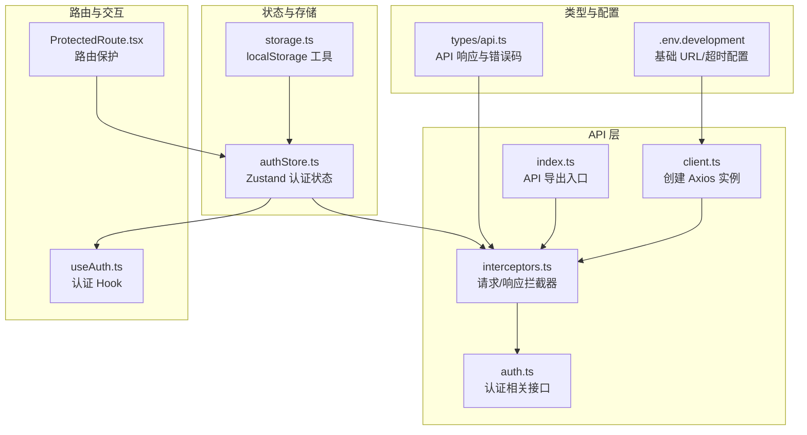
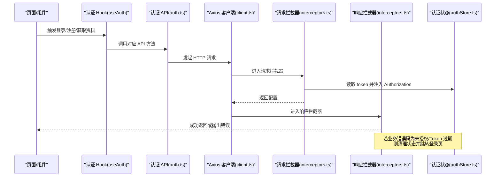
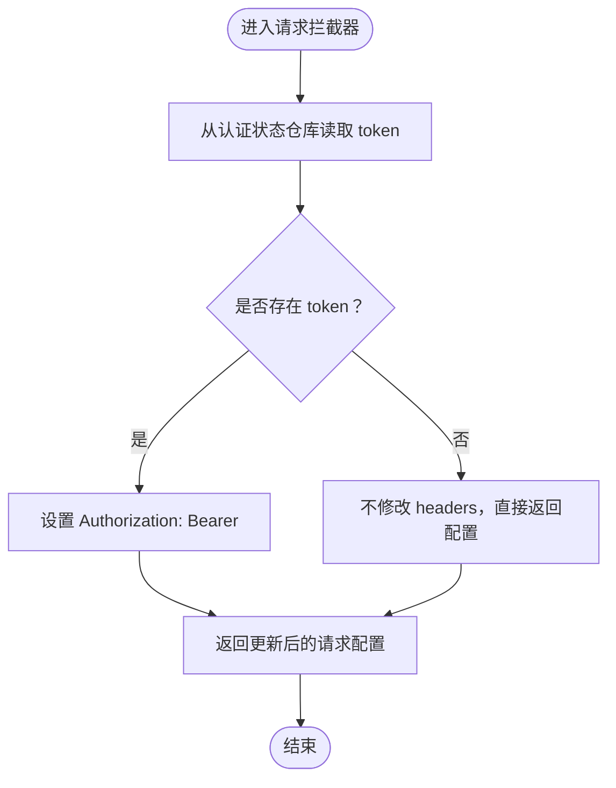
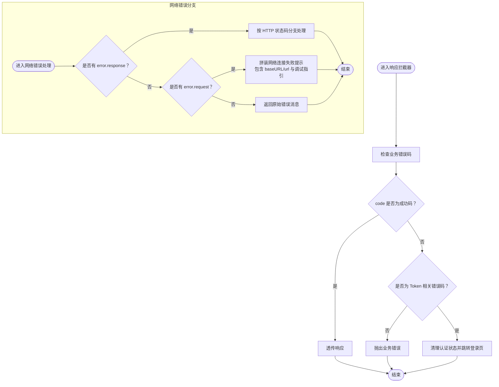
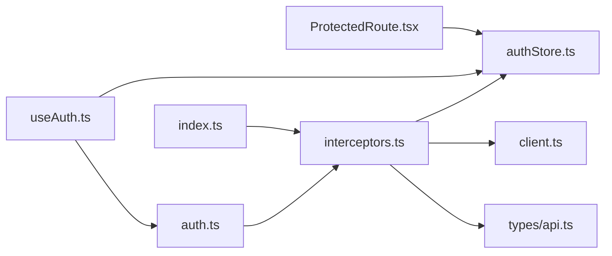

# 拦截器机制

<cite>
**本文引用的文件**
- [interceptors.ts](file://web/src/api/interceptors.ts)
- [client.ts](file://web/src/api/client.ts)
- [authStore.ts](file://web/src/stores/authStore.ts)
- [api.ts](file://web/src/types/api.ts)
- [storage.ts](file://web/src/utils/storage.ts)
- [auth.ts](file://web/src/api/auth.ts)
- [useAuth.ts](file://web/src/hooks/useAuth.ts)
- [ProtectedRoute.tsx](file://web/src/router/ProtectedRoute.tsx)
- [.env.development](file://web/.env.development)
- [index.ts](file://web/src/api/index.ts)
</cite>

## 目录
1. [引言](#引言)
2. [项目结构](#项目结构)
3. [核心组件](#核心组件)
4. [架构总览](#架构总览)
5. [详细组件分析](#详细组件分析)
6. [依赖关系分析](#依赖关系分析)
7. [性能考虑](#性能考虑)
8. [故障排查指南](#故障排查指南)
9. [结论](#结论)

## 引言
本文件聚焦于 web 前端中基于 Axios 的拦截器机制，系统性解析请求与响应拦截器如何协同工作：请求拦截器从认证状态仓库自动注入 Authorization 头以保障每次请求的安全性；响应拦截器对业务错误码（如未授权、Token 过期等）进行统一处理，包含自动跳转登录页与状态清理；同时在网络错误场景下提供精细化提示与调试指引。文档还通过序列图与流程图展示拦截器链的执行流程，并总结其在提升代码复用性与错误处理一致性方面的价值。

## 项目结构
围绕拦截器的相关文件组织如下：
- Axios 客户端实例：client.ts
- 拦截器配置：interceptors.ts
- 认证状态仓库：authStore.ts
- 类型定义（含统一响应与错误码）：types/api.ts
- 本地存储工具：utils/storage.ts
- 认证相关 API：api/auth.ts
- 认证 Hook：hooks/useAuth.ts
- 路由保护组件：router/ProtectedRoute.tsx
- 环境变量：.env.development
- API 模块导出入口：api/index.ts

图表来源
- [client.ts](file://web/src/api/client.ts#L1-L18)
- [interceptors.ts](file://web/src/api/interceptors.ts#L1-L95)
- [auth.ts](file://web/src/api/auth.ts#L1-L43)
- [index.ts](file://web/src/api/index.ts#L1-L10)
- [authStore.ts](file://web/src/stores/authStore.ts#L1-L85)
- [storage.ts](file://web/src/utils/storage.ts#L1-L48)
- [api.ts](file://web/src/types/api.ts#L1-L55)
- [.env.development](file://web/.env.development#L1-L5)
- [ProtectedRoute.tsx](file://web/src/router/ProtectedRoute.tsx#L1-L38)
- [useAuth.ts](file://web/src/hooks/useAuth.ts#L1-L73)

章节来源
- [client.ts](file://web/src/api/client.ts#L1-L18)
- [interceptors.ts](file://web/src/api/interceptors.ts#L1-L95)
- [authStore.ts](file://web/src/stores/authStore.ts#L1-L85)
- [api.ts](file://web/src/types/api.ts#L1-L55)
- [storage.ts](file://web/src/utils/storage.ts#L1-L48)
- [auth.ts](file://web/src/api/auth.ts#L1-L43)
- [useAuth.ts](file://web/src/hooks/useAuth.ts#L1-L73)
- [ProtectedRoute.tsx](file://web/src/router/ProtectedRoute.tsx#L1-L38)
- [.env.development](file://web/.env.development#L1-L5)
- [index.ts](file://web/src/api/index.ts#L1-L10)

## 核心组件
- Axios 客户端实例：负责创建带默认 baseURL、timeout、Content-Type 的实例，作为拦截器挂载点。
- 请求拦截器：从认证状态仓库读取 token 并注入 Authorization 头，保证后续请求具备身份凭证。
- 响应拦截器：统一处理业务错误码与 HTTP 状态码，对 Token 相关错误执行状态清理与登录页跳转；对网络错误提供可操作的调试指引。
- 认证状态仓库：提供 setAuth/clearAuth/updateUser 等动作，持久化用户与 token 到 localStorage，并维护 isAuthenticated 状态。
- 类型系统：统一响应结构与错误码枚举，为拦截器判断与提示提供依据。
- 认证 Hook：封装登录、注册、修改密码、获取资料等操作，成功后写入认证状态。
- 路由保护：在水合完成前显示加载态，在未认证时重定向至登录页。

章节来源
- [client.ts](file://web/src/api/client.ts#L1-L18)
- [interceptors.ts](file://web/src/api/interceptors.ts#L1-L95)
- [authStore.ts](file://web/src/stores/authStore.ts#L1-L85)
- [api.ts](file://web/src/types/api.ts#L1-L55)
- [useAuth.ts](file://web/src/hooks/useAuth.ts#L1-L73)
- [ProtectedRoute.tsx](file://web/src/router/ProtectedRoute.tsx#L1-L38)

## 架构总览
拦截器链在 Axios 实例上注册，形成“请求前 -> 业务处理 -> 响应后”的闭环。请求拦截器负责安全头注入；响应拦截器负责错误归一化与用户体验引导。二者共同提升跨模块调用的一致性与可维护性。

图表来源
- [auth.ts](file://web/src/api/auth.ts#L1-L43)
- [client.ts](file://web/src/api/client.ts#L1-L18)
- [interceptors.ts](file://web/src/api/interceptors.ts#L1-L95)
- [authStore.ts](file://web/src/stores/authStore.ts#L1-L85)
- [useAuth.ts](file://web/src/hooks/useAuth.ts#L1-L73)

## 详细组件分析

### 请求拦截器：自动注入 Authorization 头
- 从认证状态仓库读取 token，并将其注入到请求头 Authorization 中，值为 Bearer 方式。
- 仅当存在 token 且 headers 存在时才添加，避免无效写入。
- 对于无 token 的请求，仍保持原样，交由后端或路由保护层处理。

图表来源
- [interceptors.ts](file://web/src/api/interceptors.ts#L14-L27)
- [authStore.ts](file://web/src/stores/authStore.ts#L1-L85)

章节来源
- [interceptors.ts](file://web/src/api/interceptors.ts#L14-L27)
- [authStore.ts](file://web/src/stores/authStore.ts#L1-L85)

### 响应拦截器：业务错误码与网络错误统一处理
- 业务错误码处理：
  - 当响应 code 不等于成功码时，抛出业务错误；
  - 对于未授权、Token 过期、Token 无效等 Token 相关错误，清理认证状态并跳转登录页；
  - 其他业务错误统一返回错误消息。
- HTTP 状态码处理：
  - 401：清理认证状态并跳转登录页；
  - 403：提示无权限；
  - 404：提示资源不存在；
  - 500：提示服务器内部错误；
  - 其他：根据后端 message 或默认提示。
- 网络错误处理：
  - 有 error.response：按状态码分支处理；
  - 有 error.request：网络连接失败，拼装 baseURL 与 url，提供调试指引（检查服务状态、API 地址、防火墙等）；
  - 否则：返回原始错误消息。

图表来源
- [interceptors.ts](file://web/src/api/interceptors.ts#L32-L92)
- [api.ts](file://web/src/types/api.ts#L27-L55)
- [authStore.ts](file://web/src/stores/authStore.ts#L1-L85)

章节来源
- [interceptors.ts](file://web/src/api/interceptors.ts#L32-L92)
- [api.ts](file://web/src/types/api.ts#L27-L55)
- [authStore.ts](file://web/src/stores/authStore.ts#L1-L85)

### Axios 客户端与环境配置
- 客户端实例默认设置：
  - baseURL 来自 VITE_API_BASE_URL，默认 127.0.0.1:8080；
  - timeout 来自 VITE_API_TIMEOUT，默认 30000ms；
  - Content-Type 默认 application/json。
- 通过环境变量集中管理，便于开发与生产切换。

章节来源
- [client.ts](file://web/src/api/client.ts#L1-L18)
- [.env.development](file://web/.env.development#L1-L5)

### 认证状态仓库与持久化
- 认证状态包含 user、token、isAuthenticated、水合标记；
- setAuth 写入用户与 token，并持久化到 localStorage；
- clearAuth 清空用户与 token，并重置 isAuthenticated；
- updateUser 更新本地用户信息；
- 水合阶段根据存储数据重算 isAuthenticated，并标记完成。

章节来源
- [authStore.ts](file://web/src/stores/authStore.ts#L1-L85)
- [storage.ts](file://web/src/utils/storage.ts#L1-L48)

### 认证 Hook 与路由保护
- useAuth 将登录、注册、修改密码、获取资料等 API 包裹为 Mutation，成功后写入认证状态；
- ProtectedRoute 在水合完成前显示加载态，未认证时重定向至登录页，配合拦截器实现端到端的安全与体验。

章节来源
- [useAuth.ts](file://web/src/hooks/useAuth.ts#L1-L73)
- [ProtectedRoute.tsx](file://web/src/router/ProtectedRoute.tsx#L1-L38)

## 依赖关系分析
- 模块耦合：
  - interceptors.ts 依赖 client.ts（Axios 实例）、authStore.ts（认证状态）、types/api.ts（错误码与统一响应）；
  - auth.ts 依赖 interceptors.ts（通过导出的 client）；
  - useAuth.ts 依赖 authStore.ts 与 auth.ts；
  - ProtectedRoute.tsx 依赖 authStore.ts。
- 外部依赖：
  - axios、zustand、@tanstack/react-query、react-router-dom。

图表来源
- [interceptors.ts](file://web/src/api/interceptors.ts#L1-L95)
- [client.ts](file://web/src/api/client.ts#L1-L18)
- [authStore.ts](file://web/src/stores/authStore.ts#L1-L85)
- [api.ts](file://web/src/types/api.ts#L1-L55)
- [auth.ts](file://web/src/api/auth.ts#L1-L43)
- [useAuth.ts](file://web/src/hooks/useAuth.ts#L1-L73)
- [ProtectedRoute.tsx](file://web/src/router/ProtectedRoute.tsx#L1-L38)
- [index.ts](file://web/src/api/index.ts#L1-L10)

章节来源
- [interceptors.ts](file://web/src/api/interceptors.ts#L1-L95)
- [client.ts](file://web/src/api/client.ts#L1-L18)
- [authStore.ts](file://web/src/stores/authStore.ts#L1-L85)
- [api.ts](file://web/src/types/api.ts#L1-L55)
- [auth.ts](file://web/src/api/auth.ts#L1-L43)
- [useAuth.ts](file://web/src/hooks/useAuth.ts#L1-L73)
- [ProtectedRoute.tsx](file://web/src/router/ProtectedRoute.tsx#L1-L38)
- [index.ts](file://web/src/api/index.ts#L1-L10)

## 性能考虑
- 请求头注入为 O(1) 操作，开销极低；
- 响应拦截器在成功路径快速透传，仅在异常路径进行分支判断与状态清理；
- Axios 实例默认超时时间可按环境调整，避免长时间阻塞；
- 认证状态仓库采用持久化中间件，减少重复登录成本，但需注意水合阶段的加载态与用户体验。

[本节为通用指导，无需特定文件来源]

## 故障排查指南
- 网络连接失败（无 error.response 且有 error.request）：
  - 检查 Manager 服务是否已启动（运行开发命令）；
  - 检查 API 地址配置是否正确（确认 .env.development 中的 VITE_API_BASE_URL）；
  - 检查防火墙或网络设置，确保可访问目标地址。
- 401 未授权：
  - 清理认证状态并跳转登录页，确认登录凭据有效；
  - 检查 Token 是否过期或被撤销。
- 403 无权限：
  - 检查当前账户权限范围与请求资源的关系。
- 404 资源不存在：
  - 检查请求路径是否正确，确认接口版本与端点。
- 500 服务器内部错误：
  - 查看后端日志，定位具体问题。
- 业务错误码（如 Token 过期、Token 无效等）：
  - 自动触发状态清理与登录页跳转，确认后端 JWT 签发与校验逻辑正常。

章节来源
- [interceptors.ts](file://web/src/api/interceptors.ts#L55-L92)
- [.env.development](file://web/.env.development#L1-L5)

## 结论
拦截器机制通过“请求自动注入 Authorization 头 + 响应统一错误处理”的组合，显著提升了前端请求的安全性与一致性。它将认证与错误处理逻辑集中在一处，避免了在各处重复编写相同代码，从而：
- 提升代码复用性：所有 API 请求共享同一安全头注入逻辑；
- 提升错误处理一致性：业务错误与网络错误均有明确分支与提示；
- 改善用户体验：Token 相关错误自动跳转登录页，网络错误提供可操作的调试指引；
- 强化端到端安全：结合路由保护与认证状态持久化，形成从路由到请求再到响应的完整安全闭环。

[本节为总结性内容，无需特定文件来源]