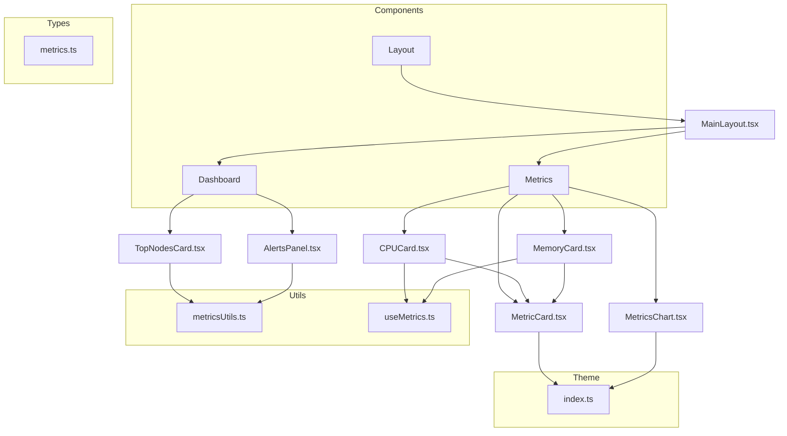
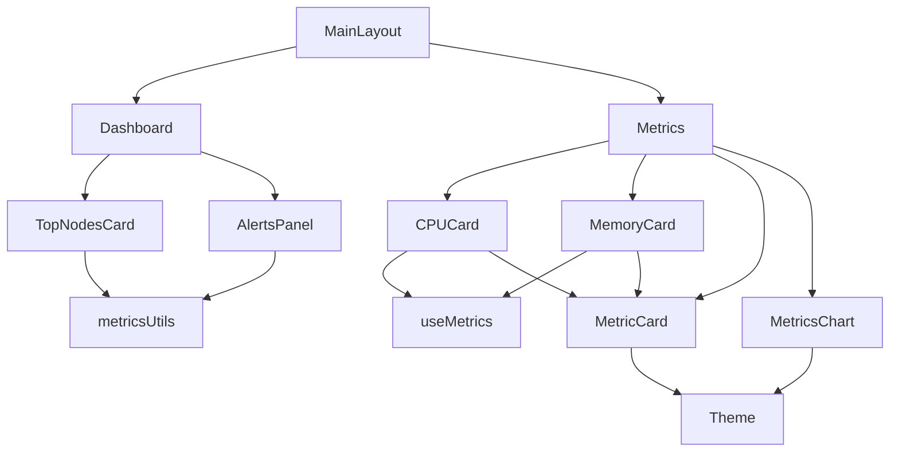
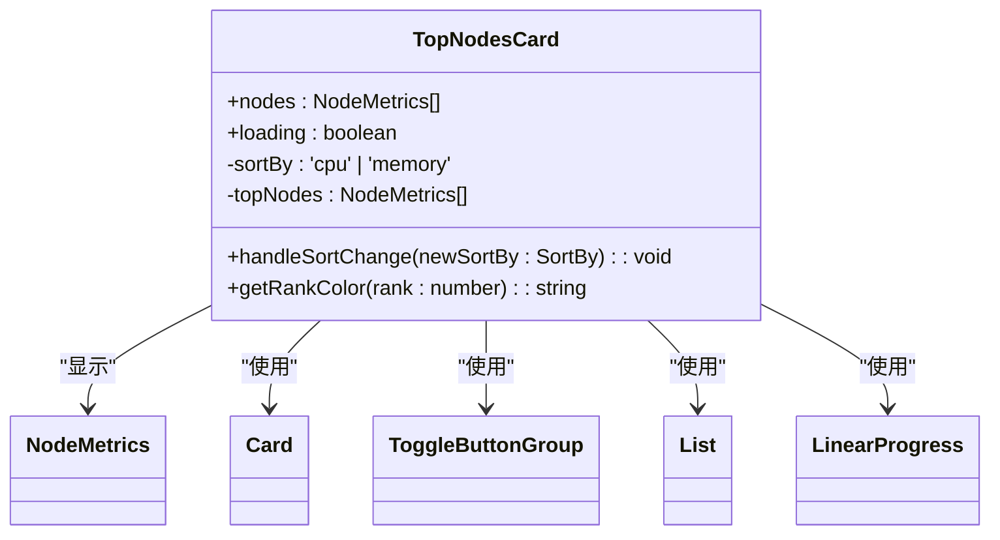
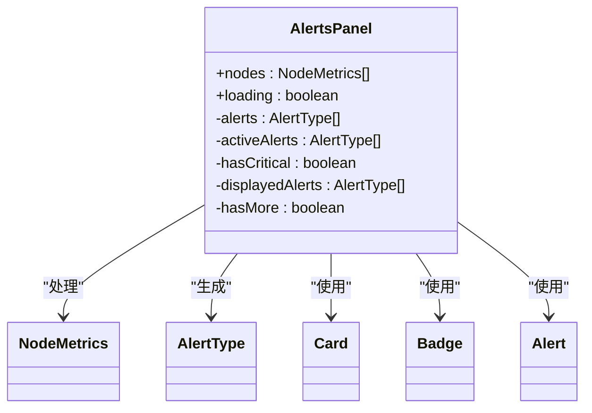
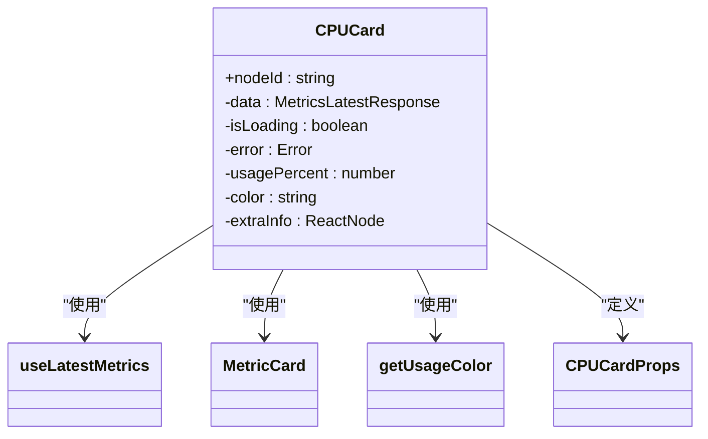
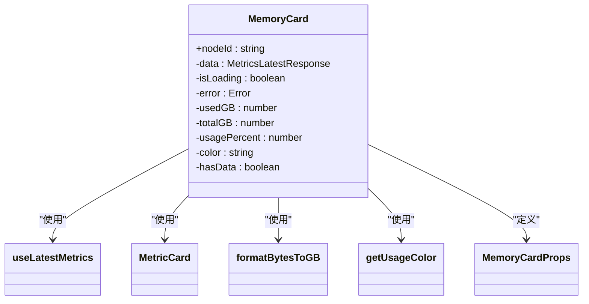
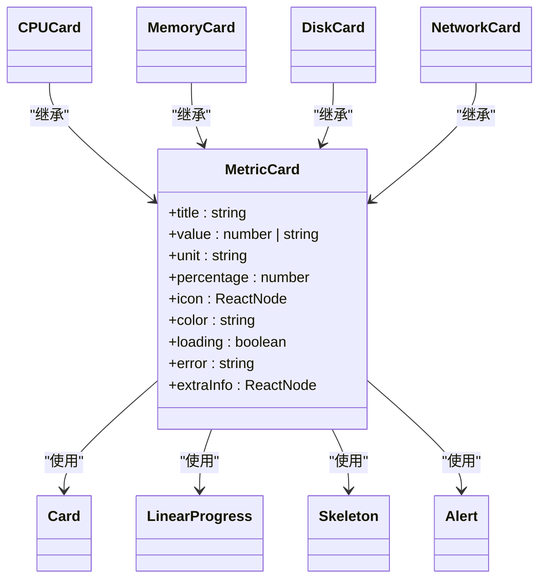
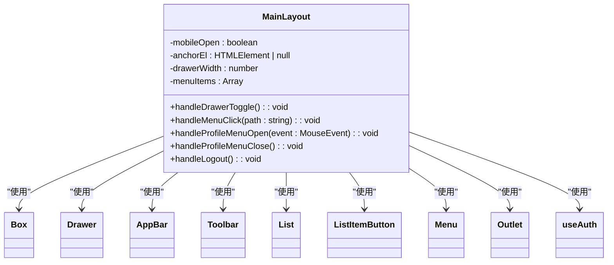
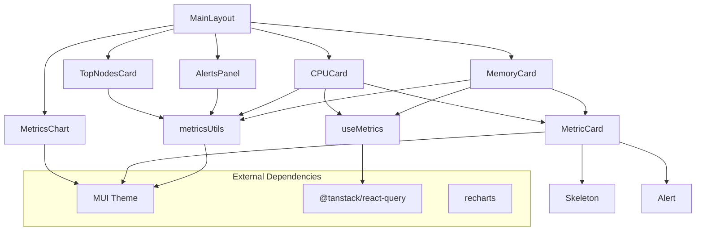

# UI组件库

<cite>
**本文档中引用的文件**   
- [TopNodesCard.tsx](file://web/src/components/Dashboard/TopNodesCard.tsx)
- [AlertsPanel.tsx](file://web/src/components/Dashboard/AlertsPanel.tsx)
- [MainLayout.tsx](file://web/src/components/Layout/MainLayout.tsx)
- [CPUCard.tsx](file://web/src/components/Metrics/CPUCard.tsx)
- [MemoryCard.tsx](file://web/src/components/Metrics/MemoryCard.tsx)
- [MetricCard.tsx](file://web/src/components/Metrics/MetricCard.tsx)
- [MetricsChart.tsx](file://web/src/components/Metrics/MetricsChart.tsx)
- [metricsUtils.ts](file://web/src/utils/metricsUtils.ts)
- [useMetrics.ts](file://web/src/hooks/useMetrics.ts)
- [metrics.ts](file://web/src/types/metrics.ts)
- [index.ts](file://web/src/theme/index.ts)
</cite>

## 目录
1. [介绍](#介绍)
2. [项目结构](#项目结构)
3. [核心组件](#核心组件)
4. [架构概览](#架构概览)
5. [详细组件分析](#详细组件分析)
6. [依赖分析](#依赖分析)
7. [性能考虑](#性能考虑)
8. [故障排除指南](#故障排除指南)
9. [结论](#结论)

## 介绍
本文档系统化介绍了基于Material-UI 5构建的UI组件库，重点解析了仪表盘、指标可视化和布局组件的实现。文档涵盖了Dashboard组件（TopNodesCard、AlertsPanel）如何通过Flex布局实现响应式仪表盘；剖析了Metrics系列组件（CPUCard、MemoryCard等）的指标可视化实现，包括ECharts集成、动态数据绑定和性能优化技巧；说明了MainLayout布局组件的Sider-Header-Content经典布局模式及暗色主题适配方案。同时提供了每个组件的Props API、使用示例和最佳实践，包含如何通过Emotion实现CSS-in-JS样式定制。

## 项目结构
项目采用模块化结构，将UI组件按功能分类组织。核心组件位于`web/src/components`目录下，分为Dashboard、Layout和Metrics三个主要模块。这种组织方式提高了代码的可维护性和可重用性。



**图表来源**
- [TopNodesCard.tsx](file://web/src/components/Dashboard/TopNodesCard.tsx)
- [AlertsPanel.tsx](file://web/src/components/Dashboard/AlertsPanel.tsx)
- [MainLayout.tsx](file://web/src/components/Layout/MainLayout.tsx)
- [CPUCard.tsx](file://web/src/components/Metrics/CPUCard.tsx)
- [MemoryCard.tsx](file://web/src/components/Metrics/MemoryCard.tsx)
- [MetricCard.tsx](file://web/src/components/Metrics/MetricCard.tsx)
- [MetricsChart.tsx](file://web/src/components/Metrics/MetricsChart.tsx)

**章节来源**
- [web/src/components](file://web/src/components)

## 核心组件
本UI组件库的核心组件包括仪表盘组件（TopNodesCard、AlertsPanel）、布局组件（MainLayout）和指标组件（CPUCard、MemoryCard等）。这些组件共同构建了一个功能完整、响应式的运维管理平台界面。组件设计遵循Material-UI 5的设计规范，同时通过Emotion实现了灵活的CSS-in-JS样式定制。

**章节来源**
- [TopNodesCard.tsx](file://web/src/components/Dashboard/TopNodesCard.tsx)
- [AlertsPanel.tsx](file://web/src/components/Dashboard/AlertsPanel.tsx)
- [MainLayout.tsx](file://web/src/components/Layout/MainLayout.tsx)

## 架构概览
系统采用React组件化架构，基于Material-UI 5构建用户界面。整体架构分为四个主要层次：布局层、仪表盘层、指标层和工具层。布局层提供统一的页面结构，仪表盘层展示关键信息，指标层负责具体的数据可视化，工具层提供数据处理和状态管理功能。



**图表来源**
- [MainLayout.tsx](file://web/src/components/Layout/MainLayout.tsx)
- [TopNodesCard.tsx](file://web/src/components/Dashboard/TopNodesCard.tsx)
- [AlertsPanel.tsx](file://web/src/components/Dashboard/AlertsPanel.tsx)
- [CPUCard.tsx](file://web/src/components/Metrics/CPUCard.tsx)
- [MemoryCard.tsx](file://web/src/components/Metrics/MemoryCard.tsx)

## 详细组件分析
本节将深入分析各个关键组件的实现细节，包括其Props API、使用示例和最佳实践。

### Dashboard组件分析
Dashboard组件包含TopNodesCard和AlertsPanel两个核心组件，用于展示系统关键信息。这些组件通过Flex布局实现响应式设计，确保在不同屏幕尺寸下都能提供良好的用户体验。

#### TopNodesCard组件
TopNodesCard组件用于展示资源使用率最高的5个节点，支持按CPU或内存使用率排序。



**图表来源**
- [TopNodesCard.tsx](file://web/src/components/Dashboard/TopNodesCard.tsx#L30-L202)
- [metrics.ts](file://web/src/types/metrics.ts#L62-L72)

**章节来源**
- [TopNodesCard.tsx](file://web/src/components/Dashboard/TopNodesCard.tsx)

#### AlertsPanel组件
AlertsPanel组件用于展示系统告警信息，通过徽章显示告警数量，并根据告警级别显示不同颜色。



**图表来源**
- [AlertsPanel.tsx](file://web/src/components/Dashboard/AlertsPanel.tsx#L24-L137)
- [metrics.ts](file://web/src/types/metrics.ts#L62-L72)

**章节来源**
- [AlertsPanel.tsx](file://web/src/components/Dashboard/AlertsPanel.tsx)

### Metrics组件分析
Metrics组件系列提供了丰富的指标可视化功能，包括CPUCard、MemoryCard等具体指标卡片和MetricCard、MetricsChart等通用组件。

#### CPUCard组件
CPUCard组件用于展示CPU使用率指标，集成动态数据绑定和性能优化。



**图表来源**
- [CPUCard.tsx](file://web/src/components/Metrics/CPUCard.tsx#L11-L77)
- [useMetrics.ts](file://web/src/hooks/useMetrics.ts#L15-L27)

**章节来源**
- [CPUCard.tsx](file://web/src/components/Metrics/CPUCard.tsx)

#### MemoryCard组件
MemoryCard组件用于展示内存使用情况，支持GB单位转换和数据有效性检查。



**图表来源**
- [MemoryCard.tsx](file://web/src/components/Metrics/MemoryCard.tsx#L11-L86)
- [metricsUtils.ts](file://web/src/utils/metricsUtils.ts#L66-L67)

**章节来源**
- [MemoryCard.tsx](file://web/src/components/Metrics/MemoryCard.tsx)

#### MetricCard组件
MetricCard是通用指标卡片组件，为其他具体指标卡片提供基础功能。



**图表来源**
- [MetricCard.tsx](file://web/src/components/Metrics/MetricCard.tsx#L16-L117)
- [MainLayout.tsx](file://web/src/components/Layout/MainLayout.tsx)

**章节来源**
- [MetricCard.tsx](file://web/src/components/Metrics/MetricCard.tsx)

#### MetricsChart组件
MetricsChart组件使用Recharts库实现指标趋势图表，支持响应式设计和自定义tooltip。

```mermaid
classDiagram
class MetricsChart {
+data : {timestamp : number, value : number}[]
+title : string
+unit : string
+color : string
+loading : boolean
+height : number
-timeRange : number
-chartData : {timestamp : number, value : number, unit : string}[]
+CustomTooltip : function
+formatXAxisTick : function
+createXAxisFormatter : function
+formatYAxisTick : function
}
MetricsChart --> AreaChart : "使用"
MetricsChart --> XAxis : "使用"
MetricsChart --> YAxis : "使用"
MetricsChart --> Tooltip : "使用"
MetricsChart --> ResponsiveContainer : "使用"
MetricsChart --> Paper : "使用"
MetricsChart --> Typography : "使用"
MetricsChart --> Skeleton : "使用"
```

**图表来源**
- [MetricsChart.tsx](file://web/src/components/Metrics/MetricsChart.tsx#L18-L178)
- [recharts](file://node_modules/recharts)

**章节来源**
- [MetricsChart.tsx](file://web/src/components/Metrics/MetricsChart.tsx)

### MainLayout组件分析
MainLayout组件实现了经典的Sider-Header-Content布局模式，为整个应用提供统一的布局结构。



**图表来源**
- [MainLayout.tsx](file://web/src/components/Layout/MainLayout.tsx#L33-L184)
- [useAuth.ts](file://web/src/hooks/useAuth.ts)

**章节来源**
- [MainLayout.tsx](file://web/src/components/Layout/MainLayout.tsx)

## 依赖分析
组件库的依赖关系清晰，遵循单一职责原则和组件复用原则。通过分析依赖关系，可以更好地理解组件之间的交互和数据流。



**图表来源**
- [package.json](file://web/package.json)
- [MainLayout.tsx](file://web/src/components/Layout/MainLayout.tsx)
- [CPUCard.tsx](file://web/src/components/Metrics/CPUCard.tsx)
- [MemoryCard.tsx](file://web/src/components/Metrics/MemoryCard.tsx)
- [useMetrics.ts](file://web/src/hooks/useMetrics.ts)

**章节来源**
- [package.json](file://web/package.json)
- [MainLayout.tsx](file://web/src/components/Layout/MainLayout.tsx)

## 性能考虑
组件库在设计时充分考虑了性能优化，采用了多种技术手段来确保流畅的用户体验。

1. **React.memo**: 在MetricCard和MetricsChart组件中使用React.memo进行组件记忆化，避免不必要的重新渲染。
2. **useMemo**: 在CPUCard、MemoryCard和MetricsChart组件中使用useMemo缓存计算结果，减少重复计算。
3. **React Query**: 使用@tanstack/react-query进行数据获取和缓存管理，通过refetchInterval和staleTime配置实现智能数据刷新。
4. **Skeleton Loading**: 使用Skeleton组件提供加载状态的视觉反馈，提升用户体验。
5. **响应式设计**: 使用ResponsiveContainer确保图表在不同屏幕尺寸下的良好表现。

**章节来源**
- [MetricCard.tsx](file://web/src/components/Metrics/MetricCard.tsx#L115)
- [MetricsChart.tsx](file://web/src/components/Metrics/MetricsChart.tsx#L176)
- [CPUCard.tsx](file://web/src/components/Metrics/CPUCard.tsx#L22)
- [MemoryCard.tsx](file://web/src/components/Metrics/MemoryCard.tsx#L22)
- [useMetrics.ts](file://web/src/hooks/useMetrics.ts#L20)

## 故障排除指南
本节提供常见问题的解决方案和调试技巧。

### 数据加载问题
如果指标数据无法加载，请检查：
1. 确认nodeId参数是否正确传递
2. 检查网络连接和API端点是否正常
3. 查看浏览器控制台是否有错误信息
4. 确认useLatestMetrics等Hook是否正确使用

### 布局问题
如果布局显示异常，请检查：
1. 确认MainLayout的Sx属性是否被意外覆盖
2. 检查响应式断点设置是否正确
3. 确认Material-UI的ThemeProvider是否正确配置

### 样式问题
如果样式显示不正确，请检查：
1. 确认theme配置是否正确加载
2. 检查Emotion的CSS-in-JS样式是否被正确应用
3. 确认组件的className和sx属性是否冲突

**章节来源**
- [MainLayout.tsx](file://web/src/components/Layout/MainLayout.tsx)
- [MetricCard.tsx](file://web/src/components/Metrics/MetricCard.tsx)
- [theme/index.ts](file://web/src/theme/index.ts)

## 结论
本UI组件库基于Material-UI 5构建，提供了一套完整的运维管理平台界面组件。通过合理的组件划分和依赖管理，实现了高可维护性和可重用性。组件库采用了现代化的React技术栈，包括React Query进行数据管理、Recharts进行数据可视化、Emotion进行样式管理。性能优化方面，通过React.memo、useMemo和智能数据刷新策略确保了流畅的用户体验。整体设计遵循Material Design规范，同时提供了足够的灵活性以满足特定业务需求。