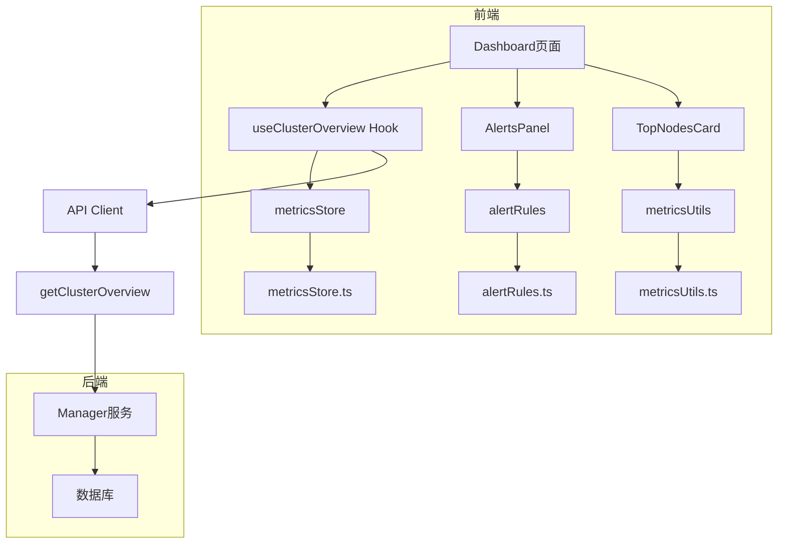
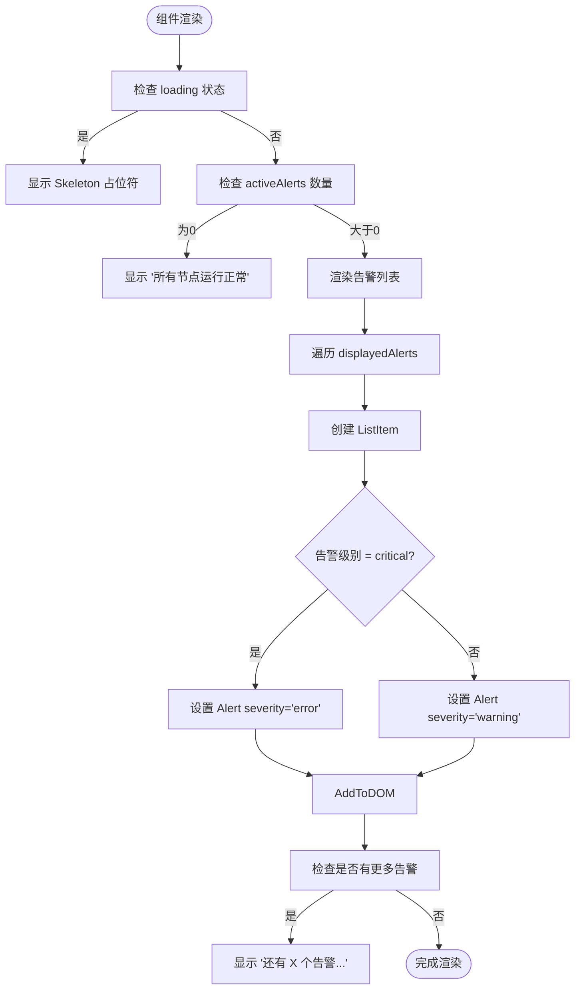
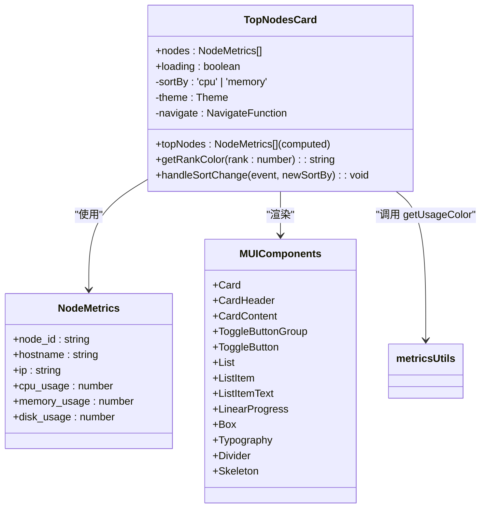
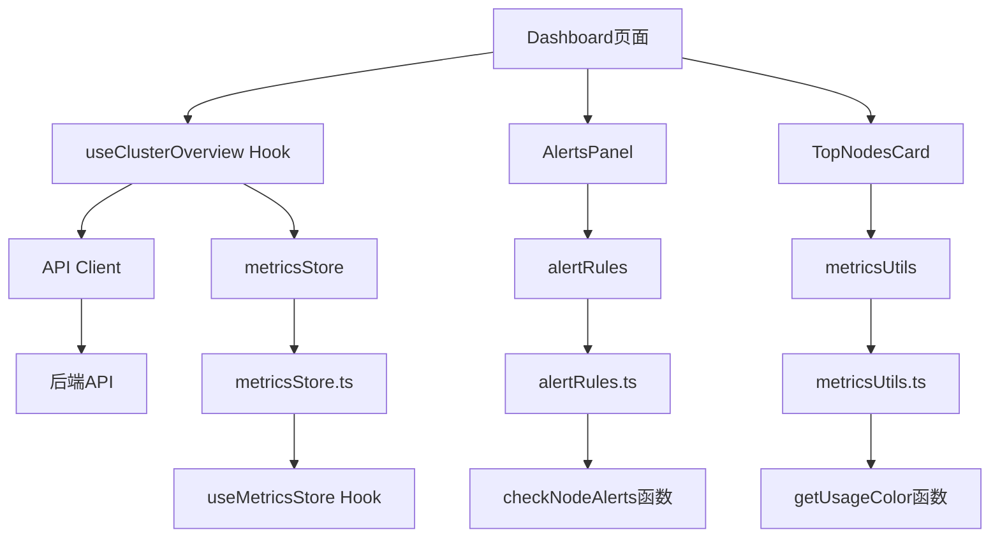

# 仪表盘组件

<cite>
**本文档引用的文件**   
- [AlertsPanel.tsx](file://web/src/components/Dashboard/AlertsPanel.tsx)
- [TopNodesCard.tsx](file://web/src/components/Dashboard/TopNodesCard.tsx)
- [alertRules.ts](file://web/src/utils/alertRules.ts)
- [metricsUtils.ts](file://web/src/utils/metricsUtils.ts)
- [metricsStore.ts](file://web/src/stores/metricsStore.ts)
- [authStore.ts](file://web/src/stores/authStore.ts)
- [node.ts](file://web/src/types/node.ts)
- [metrics.ts](file://web/src/types/metrics.ts)
- [useMetrics.ts](file://web/src/hooks/useMetrics.ts)
- [metrics.ts](file://web/src/api/metrics.ts)
- [index.tsx](file://web/src/pages/Dashboard/index.tsx)
</cite>

## 目录
1. [简介](#简介)
2. [核心组件](#核心组件)
3. [架构概览](#架构概览)
4. [详细组件分析](#详细组件分析)
5. [依赖分析](#依赖分析)
6. [性能考虑](#性能考虑)
7. [故障排除指南](#故障排除指南)
8. [结论](#结论)

## 简介
本文档详细说明了运维监控系统中仪表盘组件的实现机制，重点分析了 `AlertsPanel` 和 `TopNodesCard` 两个核心组件。文档涵盖了组件的实现原理、状态管理集成、布局策略、交互行为以及性能优化措施，为开发者提供全面的技术参考。

## 核心组件
本文档聚焦于仪表盘中的两个关键组件：`AlertsPanel`（告警面板）和 `TopNodesCard`（Top节点卡片）。`AlertsPanel` 负责集成告警规则引擎，实时展示集群中的异常状态；`TopNodesCard` 则通过响应式布局，直观地呈现资源使用率最高的节点信息。

**组件来源**
- [AlertsPanel.tsx](file://web/src/components/Dashboard/AlertsPanel.tsx)
- [TopNodesCard.tsx](file://web/src/components/Dashboard/TopNodesCard.tsx)

## 架构概览
仪表盘组件的架构围绕数据流和状态管理构建。数据从后端API获取，通过React Query进行缓存和管理，再由全局状态管理器（如Zustand）协调。组件通过Hooks订阅数据，并利用MUI框架进行渲染。

**图表来源**
- [index.tsx](file://web/src/pages/Dashboard/index.tsx)
- [useMetrics.ts](file://web/src/hooks/useMetrics.ts)
- [metrics.ts](file://web/src/api/metrics.ts)

## 详细组件分析

### AlertsPanel 分析
`AlertsPanel` 组件实现了告警信息的集成与展示，其核心功能包括告警规则集成、状态颜色编码、自动刷新和点击交互。

#### 告警规则集成与实时通知
`AlertsPanel` 通过 `utils/alertRules.ts` 中的 `checkNodeAlerts` 函数集成告警规则引擎。该函数遍历传入的节点指标数据，对每个节点的CPU、内存和磁盘使用率进行检查，并根据预设阈值生成告警。告警级别分为 `critical`（严重）、`warning`（警告）和 `normal`（正常），并按严重级别排序展示。

**图表来源**
- [AlertsPanel.tsx](file://web/src/components/Dashboard/AlertsPanel.tsx#L29-L135)
- [alertRules.ts](file://web/src/utils/alertRules.ts#L68-L119)

#### 状态颜色编码与自动刷新
告警面板的状态通过徽章颜色进行编码：当存在 `critical` 告警时，徽章为红色（`error`）；仅有 `warning` 告警时，为黄色（`warning`）；无告警时，为默认颜色。自动刷新策略由全局 `metricsStore` 控制，`useClusterOverview` Hook 根据 `refreshInterval` 的值决定是否自动轮询数据。

**组件来源**
- [AlertsPanel.tsx](file://web/src/components/Dashboard/AlertsPanel.tsx#L51-L55)
- [metricsStore.ts](file://web/src/stores/metricsStore.ts)
- [useMetrics.ts](file://web/src/hooks/useMetrics.ts#L85-L100)

#### 点击交互行为
每个告警项都具有点击交互功能。当用户点击一个告警时，会触发 `navigate` 函数，跳转到对应节点的详情页面（`/nodes/${alert.node_id}`），实现了从概览到详情的快速导航。

**组件来源**
- [AlertsPanel.tsx](file://web/src/components/Dashboard/AlertsPanel.tsx#L94)

### TopNodesCard 分析
`TopNodesCard` 组件通过灵活的布局系统构建了一个响应式的节点概览卡片，展示了CPU和内存使用率最高的前5个节点。

#### Flex布局与Grid系统
该组件利用MUI的 `Box`、`ListItem` 和 `ListItemText` 组件，结合Flex布局实现了卡片内部的元素排列。排名序号、节点信息和使用率进度条通过 `display: 'flex'` 和 `flex: 1` 等样式属性进行精确控制。在仪表盘页面中，`TopNodesCard` 与 `AlertsPanel` 通过 `Grid` 系统并排布局，在大屏幕上占据等宽空间，在小屏幕上堆叠显示，实现了完美的响应式设计。

**图表来源**
- [TopNodesCard.tsx](file://web/src/components/Dashboard/TopNodesCard.tsx)
- [metricsUtils.ts](file://web/src/utils/metricsUtils.ts#L13-L32)

#### 关键指标聚合视图
组件通过 `sortBy` 状态管理当前的排序维度（CPU或内存）。`useMemo` Hook 根据此状态对节点数据进行排序并截取前5个，确保了计算的高效性。每个节点项都展示了主机名、IP地址、使用率百分比和一个彩色的进度条，进度条的颜色由 `getUsageColor` 工具函数根据使用率动态生成。

**组件来源**
- [TopNodesCard.tsx](file://web/src/components/Dashboard/TopNodesCard.tsx#L40-L57)
- [metricsUtils.ts](file://web/src/utils/metricsUtils.ts)

### 组件Props接口与事件回调
两个组件都定义了清晰的Props接口和事件回调机制。

#### Props接口定义
- `AlertsPanelProps`: 接收 `nodes`（节点指标数组）和可选的 `loading` 状态。
- `TopNodesCardProps`: 接收 `nodes`（节点指标数组）和可选的 `loading` 状态。

#### 事件回调机制
- `AlertsPanel` 通过 `navigate` 实现点击跳转。
- `TopNodesCard` 通过 `handleSortChange` 回调处理排序维度的切换。

**组件来源**
- [AlertsPanel.tsx](file://web/src/components/Dashboard/AlertsPanel.tsx#L24-L27)
- [TopNodesCard.tsx](file://web/src/components/Dashboard/TopNodesCard.tsx#L30-L33)

### 全局状态管理集成
两个组件都与全局状态管理Store紧密集成。
- `AlertsPanel` 本身不直接读取Store，但其数据源 `nodes` 来自 `useClusterOverview`，而该Hook依赖于 `metricsStore` 中的 `refreshInterval` 来控制刷新行为。
- `TopNodesCard` 同样依赖 `useClusterOverview` 获取数据，其刷新行为也受 `metricsStore` 控制。

**组件来源**
- [metricsStore.ts](file://web/src/stores/metricsStore.ts)
- [useMetrics.ts](file://web/src/hooks/useMetrics.ts#L87)

### 实际使用示例
在 `Dashboard/index.tsx` 页面中，两个组件被并排放置在Grid布局中，共同构成仪表盘的核心部分。`loading` 状态由 `useClusterOverview` 的 `isLoading` 决定，实现了数据加载时的骨架屏效果。

**组件来源**
- [index.tsx](file://web/src/pages/Dashboard/index.tsx#L174-L179)

### 性能优化措施
- **防抖更新**: 虽然组件本身未直接实现防抖，但其数据获取层（React Query）通过 `staleTime` 和 `refetchInterval` 实现了类似的效果，避免了过于频繁的网络请求。
- **虚拟滚动**: 当前实现中未使用虚拟滚动，因为告警和Top节点列表项数固定且较少（最多10个和5个）。对于更长的列表，虚拟滚动是一个可行的优化方向。

**组件来源**
- [useMetrics.ts](file://web/src/hooks/useMetrics.ts#L93)

## 依赖分析
组件的依赖关系清晰，形成了一个自上而下的数据流。

**图表来源**
- [index.tsx](file://web/src/pages/Dashboard/index.tsx)
- [useMetrics.ts](file://web/src/hooks/useMetrics.ts)
- [metricsStore.ts](file://web/src/stores/metricsStore.ts)
- [alertRules.ts](file://web/src/utils/alertRules.ts)
- [metricsUtils.ts](file://web/src/utils/metricsUtils.ts)

## 性能考虑
组件在性能方面表现良好。通过 `useMemo` 优化了昂贵的计算（如排序和告警检查），通过React Query的缓存机制减少了不必要的网络请求。MUI的Skeleton组件提供了良好的加载体验。对于未来可能的数据量增长，可以考虑在后端实现分页或聚合，或在前端引入虚拟滚动。

## 故障排除指南
- **告警不显示**: 检查 `nodes` 数据是否正确传入，确认 `alertRules.ts` 中的阈值设置是否合理。
- **数据不刷新**: 检查 `metricsStore` 中的 `refreshInterval` 是否为 `null` 或 `false`，确认 `useClusterOverview` Hook 是否正常工作。
- **样式错乱**: 检查MUI主题是否正确加载，确认 `Box` 和 `Grid` 的 `sx` 属性是否被意外覆盖。

**组件来源**
- [AlertsPanel.tsx](file://web/src/components/Dashboard/AlertsPanel.tsx)
- [TopNodesCard.tsx](file://web/src/components/Dashboard/TopNodesCard.tsx)
- [metricsStore.ts](file://web/src/stores/metricsStore.ts)

## 结论
`AlertsPanel` 和 `TopNodesCard` 是仪表盘中功能强大且设计精良的组件。它们通过与告警规则引擎和全局状态管理的深度集成，提供了实时、直观的集群监控视图。其清晰的Props定义、响应式布局和合理的性能优化，使其成为可复用和可维护的前端组件典范。