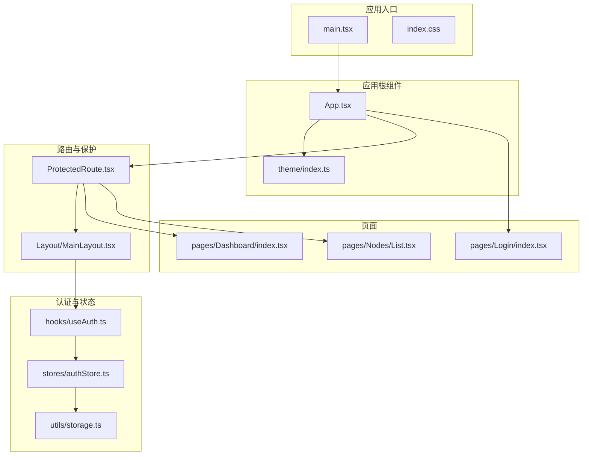
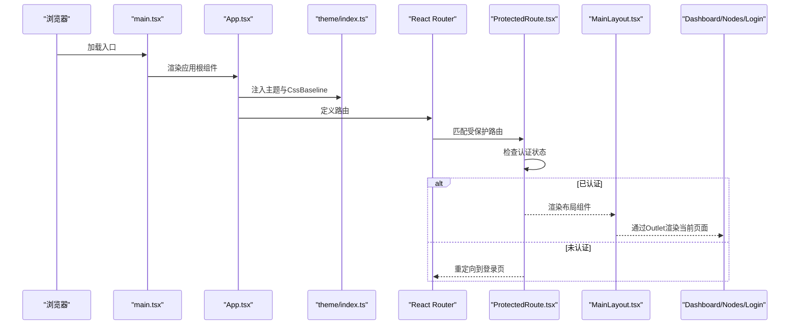
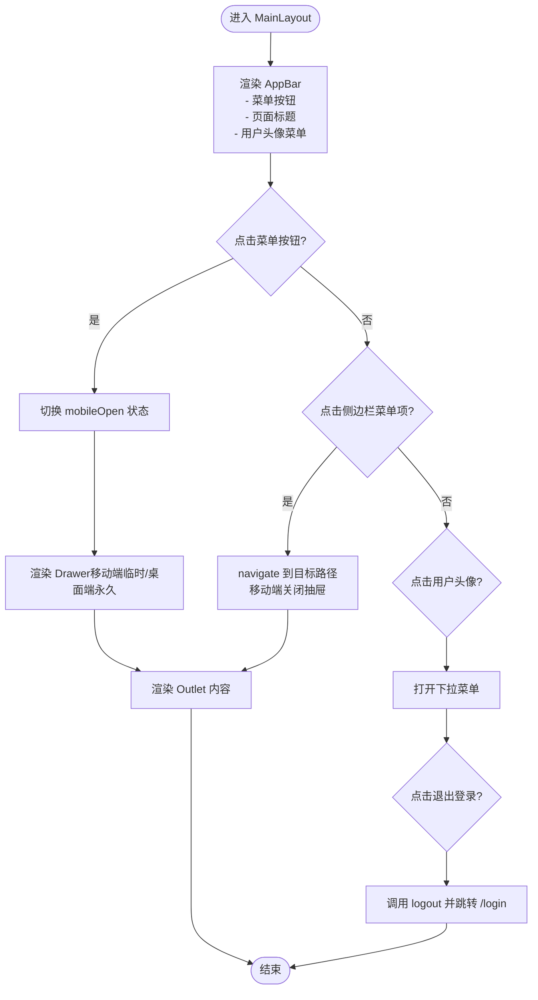
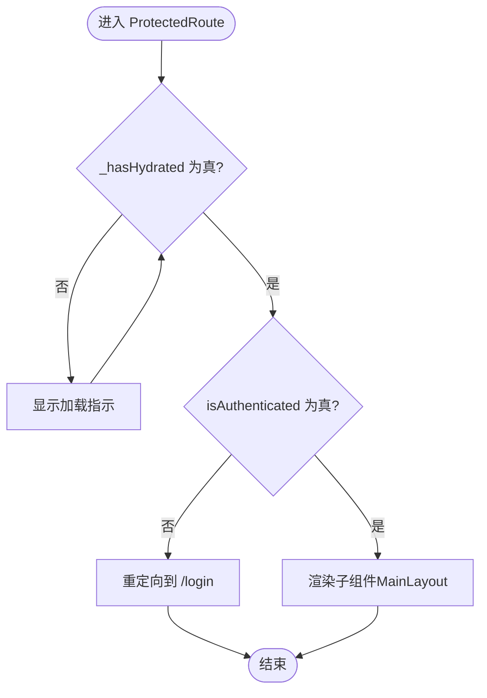
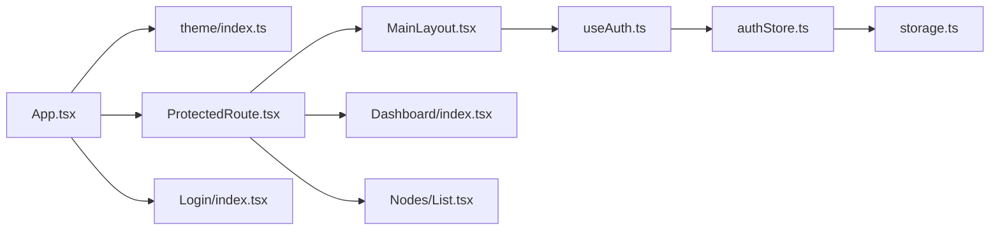

# 布局组件

<cite>
**本文引用的文件**
- [web/src/components/Layout/MainLayout.tsx](file://web/src/components/Layout/MainLayout.tsx)
- [web/src/components/Layout/index.ts](file://web/src/components/Layout/index.ts)
- [web/src/router/ProtectedRoute.tsx](file://web/src/router/ProtectedRoute.tsx)
- [web/src/theme/index.ts](file://web/src/theme/index.ts)
- [web/src/App.tsx](file://web/src/App.tsx)
- [web/src/hooks/useAuth.ts](file://web/src/hooks/useAuth.ts)
- [web/src/stores/authStore.ts](file://web/src/stores/authStore.ts)
- [web/src/utils/storage.ts](file://web/src/utils/storage.ts)
- [web/src/pages/Dashboard/index.tsx](file://web/src/pages/Dashboard/index.tsx)
- [web/src/pages/Nodes/List.tsx](file://web/src/pages/Nodes/List.tsx)
- [web/src/pages/Login/index.tsx](file://web/src/pages/Login/index.tsx)
- [web/src/main.tsx](file://web/src/main.tsx)
- [web/src/index.css](file://web/src/index.css)
</cite>

## 目录
1. [简介](#简介)
2. [项目结构](#项目结构)
3. [核心组件](#核心组件)
4. [架构总览](#架构总览)
5. [组件详解](#组件详解)
6. [依赖关系分析](#依赖关系分析)
7. [性能考量](#性能考量)
8. [故障排查指南](#故障排查指南)
9. [结论](#结论)
10. [附录：扩展指南](#附录扩展指南)

## 简介
本文件围绕前端 Web 子项目的“布局组件”进行系统性文档化，重点解析 MainLayout 组件所采用的 Sider-Header-Content 经典三栏布局架构，并说明其如何结合 Material-UI 的 Drawer 与 AppBar 实现可折叠侧边栏与顶部导航栏，支持响应式断点切换（移动端抽屉模式）。同时，文档覆盖主题体系（含 MUI 主题配置）、路由集成与权限控制（与 ProtectedRoute 配合）、动态标题设置、以及如何通过上下文或 props 向下传递布局状态（如 collapsed 状态）。最后提供扩展指南，帮助开发者自定义头部工具栏或添加全局快捷操作。

## 项目结构
Web 前端位于 web/src 目录，主要涉及以下关键文件：
- 布局组件：MainLayout.tsx
- 路由保护：ProtectedRoute.tsx
- 主题配置：theme/index.ts
- 应用入口：App.tsx
- 认证钩子与状态：useAuth.ts、authStore.ts、storage.ts
- 页面示例：Dashboard、Nodes.List、Login
- 入口渲染：main.tsx、index.css

图表来源
- [web/src/main.tsx](file://web/src/main.tsx#L1-L11)
- [web/src/index.css](file://web/src/index.css#L1-L18)
- [web/src/App.tsx](file://web/src/App.tsx#L1-L57)
- [web/src/theme/index.ts](file://web/src/theme/index.ts#L1-L100)
- [web/src/router/ProtectedRoute.tsx](file://web/src/router/ProtectedRoute.tsx#L1-L38)
- [web/src/components/Layout/MainLayout.tsx](file://web/src/components/Layout/MainLayout.tsx#L1-L184)
- [web/src/hooks/useAuth.ts](file://web/src/hooks/useAuth.ts#L1-L73)
- [web/src/stores/authStore.ts](file://web/src/stores/authStore.ts#L1-L85)
- [web/src/utils/storage.ts](file://web/src/utils/storage.ts#L1-L48)
- [web/src/pages/Dashboard/index.tsx](file://web/src/pages/Dashboard/index.tsx#L1-L193)
- [web/src/pages/Nodes/List.tsx](file://web/src/pages/Nodes/List.tsx#L1-L183)
- [web/src/pages/Login/index.tsx](file://web/src/pages/Login/index.tsx#L1-L110)

章节来源
- [web/src/main.tsx](file://web/src/main.tsx#L1-L11)
- [web/src/App.tsx](file://web/src/App.tsx#L1-L57)

## 核心组件
- MainLayout：实现 Sider-Header-Content 三栏布局，包含固定 AppBar、临时 Drawer（移动端抽屉）与永久 Drawer（桌面端侧栏），并通过 Outlet 渲染当前路由内容。
- ProtectedRoute：基于认证状态保护路由，未认证时跳转登录页。
- theme/index.ts：MUI 主题配置，提供统一的色彩、排版与组件风格。
- useAuth 与 authStore：封装认证状态与登录/登出流程，使用 zustand + localStorage 持久化。

章节来源
- [web/src/components/Layout/MainLayout.tsx](file://web/src/components/Layout/MainLayout.tsx#L1-L184)
- [web/src/router/ProtectedRoute.tsx](file://web/src/router/ProtectedRoute.tsx#L1-L38)
- [web/src/theme/index.ts](file://web/src/theme/index.ts#L1-L100)
- [web/src/hooks/useAuth.ts](file://web/src/hooks/useAuth.ts#L1-L73)
- [web/src/stores/authStore.ts](file://web/src/stores/authStore.ts#L1-L85)

## 架构总览
整体架构采用“应用根组件 -> 路由保护 -> 布局组件 -> 页面”的分层设计。应用根组件负责注入主题、基准样式与路由容器；ProtectedRoute 在进入受保护路由前检查认证状态；MainLayout 提供三栏布局与导航；页面组件在 Outlet 中渲染具体业务内容。

图表来源
- [web/src/main.tsx](file://web/src/main.tsx#L1-L11)
- [web/src/App.tsx](file://web/src/App.tsx#L1-L57)
- [web/src/theme/index.ts](file://web/src/theme/index.ts#L1-L100)
- [web/src/router/ProtectedRoute.tsx](file://web/src/router/ProtectedRoute.tsx#L1-L38)
- [web/src/components/Layout/MainLayout.tsx](file://web/src/components/Layout/MainLayout.tsx#L1-L184)

## 组件详解

### MainLayout：Sider-Header-Content 三栏布局
- 结构组成
  - AppBar：顶部导航栏，包含菜单按钮（移动端抽屉开关）、页面标题与用户头像下拉菜单。
  - Drawer：左侧侧边栏，包含品牌标题与菜单项列表；在移动端使用临时抽屉，在桌面端使用永久抽屉。
  - Main Content：通过 Outlet 渲染当前路由页面。
- 响应式行为
  - 移动端：通过临时抽屉（variant="temporary"）与菜单按钮控制抽屉显隐；桌面端：永久抽屉（variant="permanent"）常驻。
  - 断点控制：使用 Material-UI 的 sx 媒体查询断点（xs/sm）实现不同设备下的布局切换。
- 导航与交互
  - 顶部菜单按钮点击触发抽屉显隐。
  - 侧边栏菜单项点击后导航至对应路径，并在移动端自动关闭抽屉。
  - 用户头像下拉菜单提供“退出登录”等操作。
- 与认证的集成
  - 通过 useAuth 获取用户信息与登出方法，用于顶部菜单展示与登出流程。

图表来源
- [web/src/components/Layout/MainLayout.tsx](file://web/src/components/Layout/MainLayout.tsx#L1-L184)
- [web/src/hooks/useAuth.ts](file://web/src/hooks/useAuth.ts#L1-L73)

章节来源
- [web/src/components/Layout/MainLayout.tsx](file://web/src/components/Layout/MainLayout.tsx#L1-L184)
- [web/src/hooks/useAuth.ts](file://web/src/hooks/useAuth.ts#L1-L73)

### ProtectedRoute：路由保护与权限控制
- 功能要点
  - 等待认证状态从持久化存储恢复完成（_hasHydrated）。
  - 若未认证则重定向到登录页。
  - 认证通过后渲染子组件（即 MainLayout 及其内部页面）。
- 与认证状态的关系
  - 依赖 useAuthStore 的 isAuthenticated 与 _hasHydrated 字段。
  - 通过 zustand 的 persist 中间件实现 localStorage 持久化。

图表来源
- [web/src/router/ProtectedRoute.tsx](file://web/src/router/ProtectedRoute.tsx#L1-L38)
- [web/src/stores/authStore.ts](file://web/src/stores/authStore.ts#L1-L85)

章节来源
- [web/src/router/ProtectedRoute.tsx](file://web/src/router/ProtectedRoute.tsx#L1-L38)
- [web/src/stores/authStore.ts](file://web/src/stores/authStore.ts#L1-L85)

### 主题与样式体系
- MUI 主题配置
  - theme/index.ts 使用 createTheme 定义主色、辅色、成功/错误/警告/信息等语义色，以及字体与组件默认样式（如按钮圆角、卡片阴影、输入框变体等）。
- 样式基线
  - App.tsx 中通过 ThemeProvider 注入主题，CssBaseline 统一重置与基础样式。
  - index.css 提供全局基础样式（box-sizing、body 边距、root 最小高度）。
- 暗色模式支持
  - 当前仓库未提供暗色模式的 CSS 变量与 Emotion 注入配置。若需启用暗色模式，可在 theme/index.ts 中扩展 palette.mode 或通过自定义主题 Provider 注入。

章节来源
- [web/src/theme/index.ts](file://web/src/theme/index.ts#L1-L100)
- [web/src/App.tsx](file://web/src/App.tsx#L1-L57)
- [web/src/index.css](file://web/src/index.css#L1-L18)

### 动态标题设置
- 页面级标题
  - Dashboard 页面通过 Typography 设置页面标题，作为“动态标题”的示例。
- 布局级标题
  - MainLayout 中 AppBar 的标题为“运维管理平台”，可按需调整为动态值（例如根据当前路由或页面上下文）。
- 建议实践
  - 在页面组件中通过 useLocation 或路由参数获取当前页面标识，再通过 useDocumentTitle 或自定义 hook 设置浏览器标题。
  - 在 MainLayout 中保留一个可选的动态标题插槽，便于子页面传入。

章节来源
- [web/src/pages/Dashboard/index.tsx](file://web/src/pages/Dashboard/index.tsx#L1-L193)
- [web/src/components/Layout/MainLayout.tsx](file://web/src/components/Layout/MainLayout.tsx#L1-L184)

### 布局状态传递（collapsed 状态）
- 现状
  - MainLayout 当前未暴露 collapsed 状态给子组件或外部消费者。
- 扩展建议
  - 在 MainLayout 中通过 useState 维护 collapsed 状态，并通过 React Context 或 props 向下传递。
  - 在 Drawer 永久模式下，可通过 sx 控制宽度与布局偏移，以适配 collapsed 状态。
  - 在移动端抽屉中，collapsed 不适用，仍保持临时抽屉行为。

章节来源
- [web/src/components/Layout/MainLayout.tsx](file://web/src/components/Layout/MainLayout.tsx#L1-L184)

### 与路由的集成
- App.tsx 定义路由：
  - /login：登录页，无需受保护。
  - /、/dashboard、/nodes、/nodes/:id：受保护路由，包裹在 ProtectedRoute 中，内部渲染 MainLayout。
- 路由嵌套
  - / 路由下嵌套多个子路由，通过 Outlet 渲染对应页面组件。

章节来源
- [web/src/App.tsx](file://web/src/App.tsx#L1-L57)

### 权限控制渲染
- 当前实现
  - ProtectedRoute 基于 isAuthenticated 控制是否允许进入受保护路由。
  - 登出后会清除本地存储并重定向到登录页。
- 扩展建议
  - 可在 ProtectedRoute 内部增加角色/权限校验，仅允许具备特定权限的用户访问某些路由。
  - 可通过路由元信息（如 route.meta.permissions）与 useLocation 结合进行细粒度权限判断。

章节来源
- [web/src/router/ProtectedRoute.tsx](file://web/src/router/ProtectedRoute.tsx#L1-L38)
- [web/src/stores/authStore.ts](file://web/src/stores/authStore.ts#L1-L85)
- [web/src/hooks/useAuth.ts](file://web/src/hooks/useAuth.ts#L1-L73)
- [web/src/utils/storage.ts](file://web/src/utils/storage.ts#L1-L48)

## 依赖关系分析

图表来源
- [web/src/App.tsx](file://web/src/App.tsx#L1-L57)
- [web/src/theme/index.ts](file://web/src/theme/index.ts#L1-L100)
- [web/src/router/ProtectedRoute.tsx](file://web/src/router/ProtectedRoute.tsx#L1-L38)
- [web/src/components/Layout/MainLayout.tsx](file://web/src/components/Layout/MainLayout.tsx#L1-L184)
- [web/src/hooks/useAuth.ts](file://web/src/hooks/useAuth.ts#L1-L73)
- [web/src/stores/authStore.ts](file://web/src/stores/authStore.ts#L1-L85)
- [web/src/utils/storage.ts](file://web/src/utils/storage.ts#L1-L48)
- [web/src/pages/Dashboard/index.tsx](file://web/src/pages/Dashboard/index.tsx#L1-L193)
- [web/src/pages/Nodes/List.tsx](file://web/src/pages/Nodes/List.tsx#L1-L183)
- [web/src/pages/Login/index.tsx](file://web/src/pages/Login/index.tsx#L1-L110)

章节来源
- [web/src/App.tsx](file://web/src/App.tsx#L1-L57)
- [web/src/components/Layout/MainLayout.tsx](file://web/src/components/Layout/MainLayout.tsx#L1-L184)

## 性能考量
- 路由保护的水合等待
  - ProtectedRoute 在 _hasHydrated 为假时显示加载指示，避免在认证状态尚未恢复时渲染受保护内容，减少不必要的重渲染与闪烁。
- Drawer 的渲染策略
  - 移动端使用临时抽屉，桌面端使用永久抽屉，减少不必要的 DOM 渲染与布局抖动。
- 主题注入
  - ThemeProvider 仅在应用根部注入一次，避免重复创建主题实例带来的性能损耗。
- 页面内容渲染
  - 页面组件通过 Outlet 渲染，避免在布局层做过多状态管理，降低耦合度与复杂度。

章节来源
- [web/src/router/ProtectedRoute.tsx](file://web/src/router/ProtectedRoute.tsx#L1-L38)
- [web/src/components/Layout/MainLayout.tsx](file://web/src/components/Layout/MainLayout.tsx#L1-L184)
- [web/src/theme/index.ts](file://web/src/theme/index.ts#L1-L100)

## 故障排查指南
- 登录后无法进入受保护路由
  - 检查 useAuthStore 是否正确写入 token 与 user，并确保 _hasHydrated 已标记为真。
  - 确认 localStorage 中存在对应的键值对。
- 登出后仍可访问受保护路由
  - 检查 logout 是否调用了 clearAuth 并清空了 localStorage。
  - 确认 ProtectedRoute 的 isAuthenticated 判断逻辑。
- 移动端抽屉无法打开
  - 检查 AppBar 中菜单按钮的 onClick 是否绑定 handleDrawerToggle。
  - 确认 mobileOpen 状态在点击后正确切换。
- 页面标题未更新
  - 在页面组件中添加动态标题设置逻辑，或在 MainLayout 中增加动态标题插槽。

章节来源
- [web/src/stores/authStore.ts](file://web/src/stores/authStore.ts#L1-L85)
- [web/src/utils/storage.ts](file://web/src/utils/storage.ts#L1-L48)
- [web/src/router/ProtectedRoute.tsx](file://web/src/router/ProtectedRoute.tsx#L1-L38)
- [web/src/components/Layout/MainLayout.tsx](file://web/src/components/Layout/MainLayout.tsx#L1-L184)
- [web/src/pages/Login/index.tsx](file://web/src/pages/Login/index.tsx#L1-L110)

## 结论
本布局组件以 Material-UI 的 Drawer 与 AppBar 为基础，构建了经典的 Sider-Header-Content 三栏布局，并通过响应式断点实现了移动端抽屉模式。结合 ProtectedRoute 的认证保护与 useAuth/authStore 的状态管理，形成了清晰的路由与权限控制链路。主题体系通过 MUI 主题配置与 CssBaseline 提供一致的视觉与交互体验。当前仓库未包含暗色模式的 CSS 变量与 Emotion 注入配置，但提供了完善的扩展点以便后续接入。

## 附录：扩展指南

### 自定义头部工具栏或添加全局快捷操作
- 在 AppBar 中新增工具栏区域
  - 可在现有标题与用户菜单之间插入新的按钮组或下拉菜单，用于全局快捷操作（如刷新、全屏、设置等）。
- 通过 Context 向下传递布局状态
  - 在 MainLayout 中维护 collapsed 状态，并通过 React Context 将其传递给子组件，使页面组件可根据 collapsed 状态调整布局或间距。
- 动态标题设置
  - 在页面组件中读取当前路由或页面上下文，设置浏览器标题；或在 MainLayout 中提供动态标题插槽，由子页面传入标题文本。
- 响应式优化
  - 对于超窄屏幕，可将部分工具栏元素隐藏或折叠为二级菜单，保证移动端可用性。

章节来源
- [web/src/components/Layout/MainLayout.tsx](file://web/src/components/Layout/MainLayout.tsx#L1-L184)
- [web/src/pages/Dashboard/index.tsx](file://web/src/pages/Dashboard/index.tsx#L1-L193)
- [web/src/pages/Nodes/List.tsx](file://web/src/pages/Nodes/List.tsx#L1-L183)