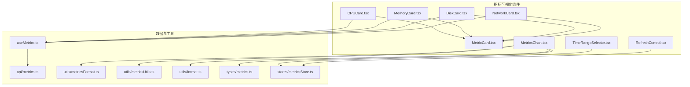
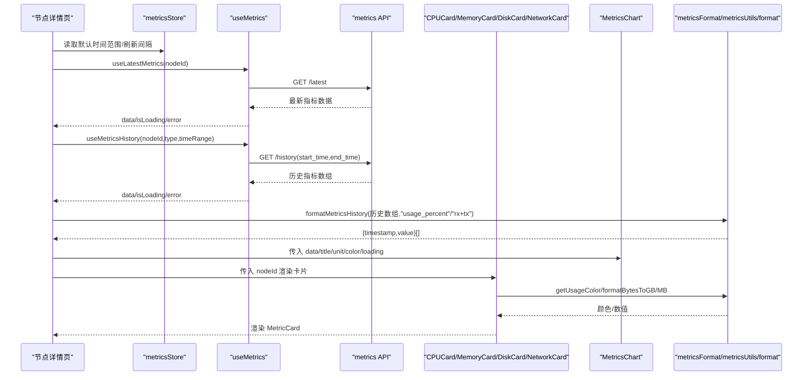
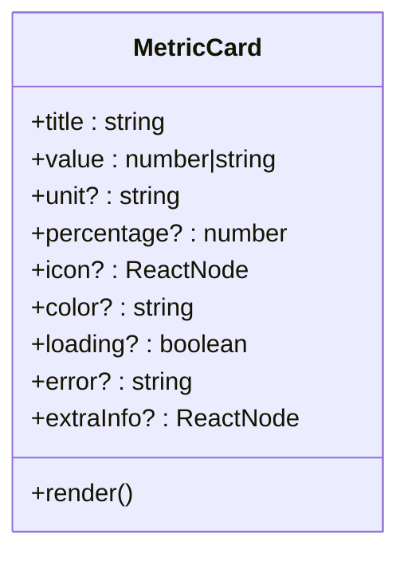
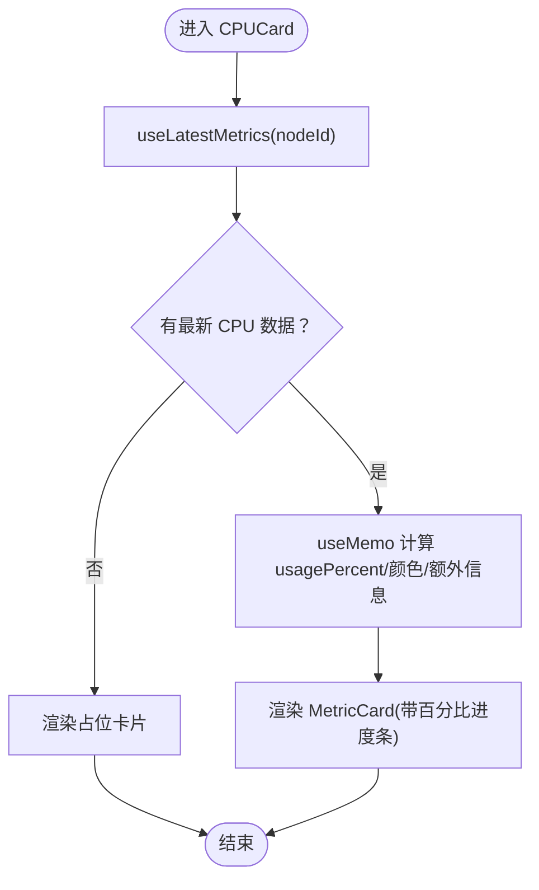
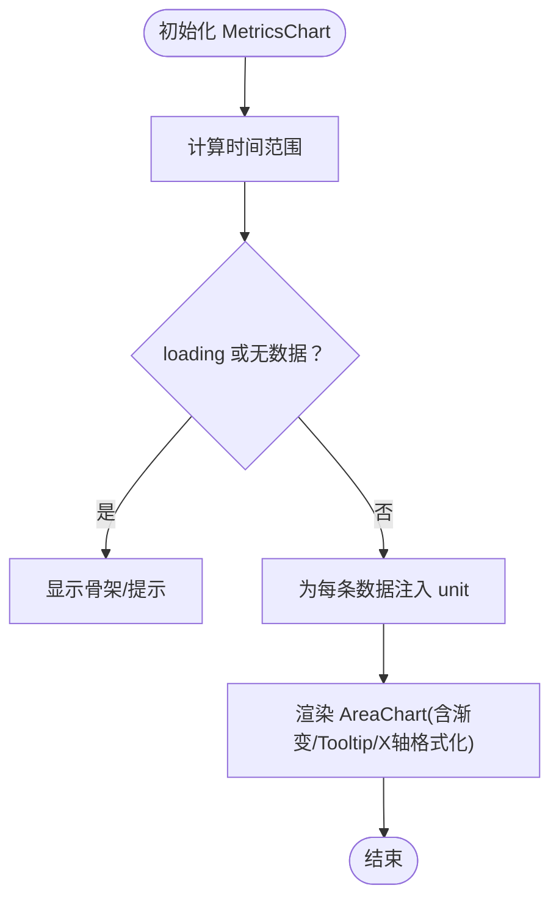
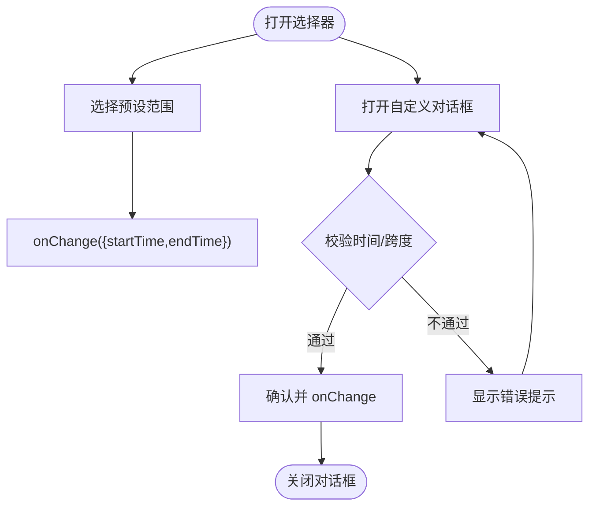
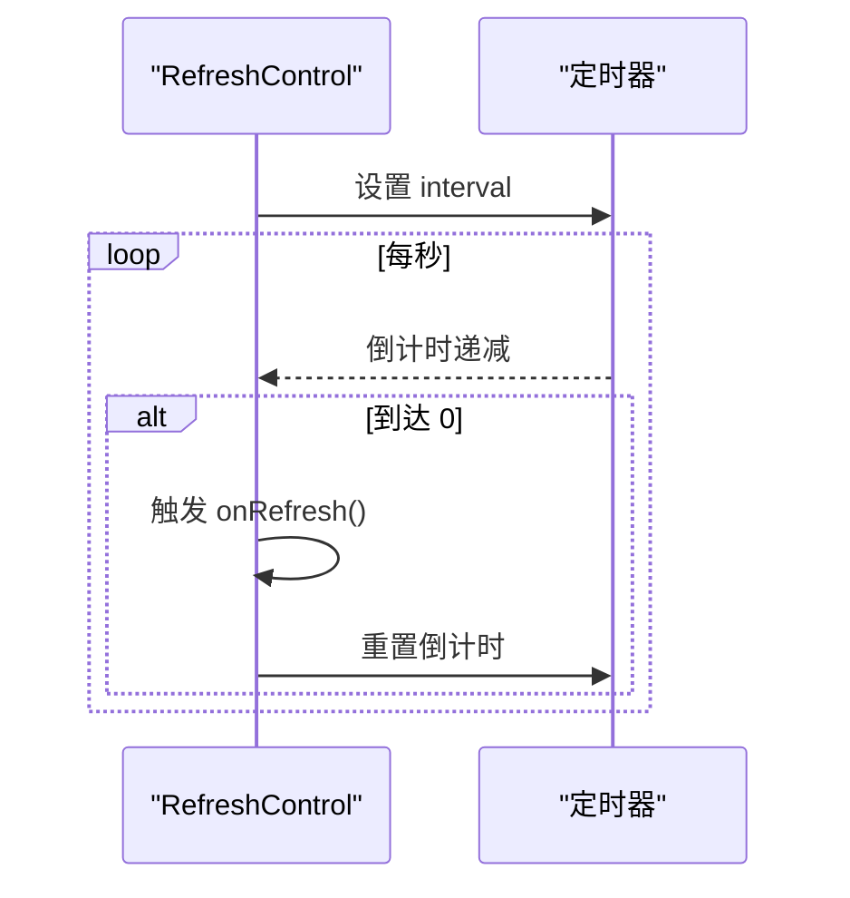
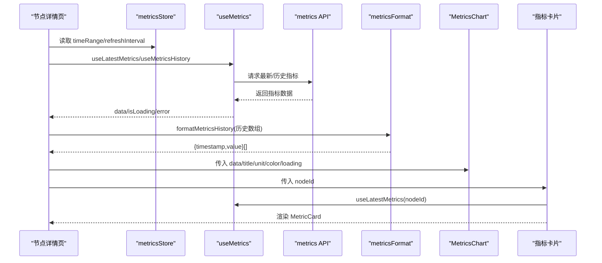
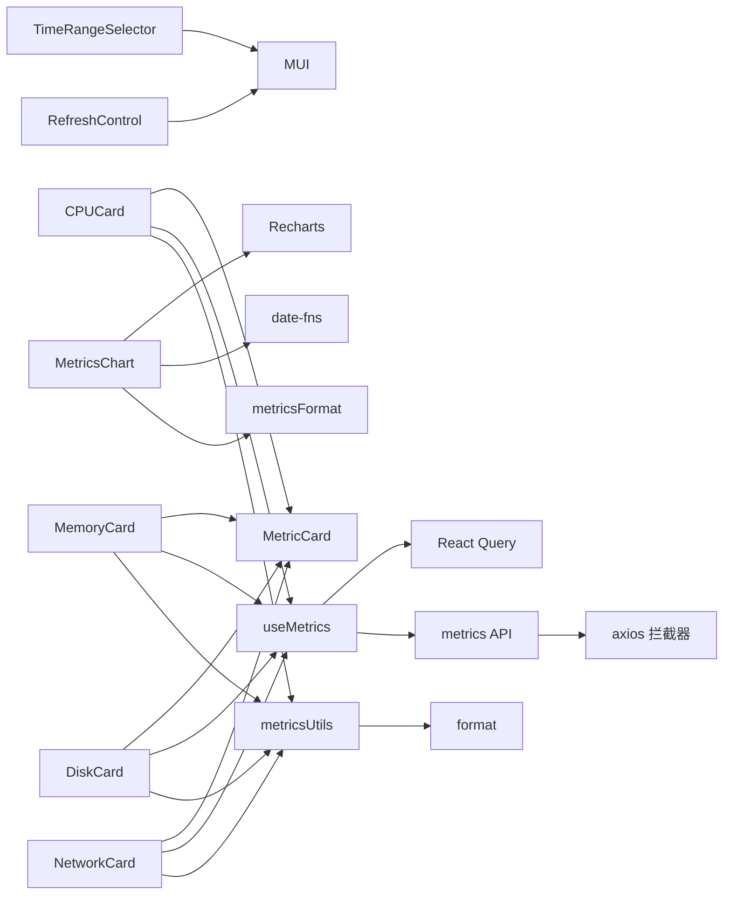

# 指标可视化组件

<cite>
**本文引用的文件**
- [web/src/components/Metrics/CPUCard.tsx](file://web/src/components/Metrics/CPUCard.tsx)
- [web/src/components/Metrics/MemoryCard.tsx](file://web/src/components/Metrics/MemoryCard.tsx)
- [web/src/components/Metrics/DiskCard.tsx](file://web/src/components/Metrics/DiskCard.tsx)
- [web/src/components/Metrics/NetworkCard.tsx](file://web/src/components/Metrics/NetworkCard.tsx)
- [web/src/components/Metrics/MetricCard.tsx](file://web/src/components/Metrics/MetricCard.tsx)
- [web/src/components/Metrics/MetricsChart.tsx](file://web/src/components/Metrics/MetricsChart.tsx)
- [web/src/components/Metrics/TimeRangeSelector.tsx](file://web/src/components/Metrics/TimeRangeSelector.tsx)
- [web/src/components/Metrics/RefreshControl.tsx](file://web/src/components/Metrics/RefreshControl.tsx)
- [web/src/hooks/useMetrics.ts](file://web/src/hooks/useMetrics.ts)
- [web/src/api/metrics.ts](file://web/src/api/metrics.ts)
- [web/src/utils/metricsFormat.ts](file://web/src/utils/metricsFormat.ts)
- [web/src/utils/metricsUtils.ts](file://web/src/utils/metricsUtils.ts)
- [web/src/utils/format.ts](file://web/src/utils/format.ts)
- [web/src/types/metrics.ts](file://web/src/types/metrics.ts)
- [web/src/stores/metricsStore.ts](file://web/src/stores/metricsStore.ts)
- [web/src/pages/Nodes/Detail.tsx](file://web/src/pages/Nodes/Detail.tsx)
- [web/src/components/Metrics/index.ts](file://web/src/components/Metrics/index.ts)
</cite>

## 目录
1. [简介](#简介)
2. [项目结构](#项目结构)
3. [核心组件](#核心组件)
4. [架构总览](#架构总览)
5. [详细组件分析](#详细组件分析)
6. [依赖关系分析](#依赖关系分析)
7. [性能考量](#性能考量)
8. [故障排查指南](#故障排查指南)
9. [结论](#结论)
10. [附录](#附录)

## 简介
本文件系统性阐述指标可视化组件的设计与实现，覆盖 CPUCard、MemoryCard、DiskCard、NetworkCard 等资源指标卡片，以及作为基础容器的 MetricCard。文档重点说明 MetricsChart 如何集成 Recharts 实现动态折线图渲染，支持时间范围选择 TimeRangeSelector 与手动刷新 RefreshControl；解释各指标组件的数据绑定流程，从 useMetrics 等自定义 Hook 获取实时数据，并通过 metricsUtils.ts 与 format.ts 进行单位转换与精度处理；同时给出组件属性 API、主题适配方案、加载与错误边界处理，以及在高频数据更新下的性能优化实践（useMemo 缓存、diff 优化与请求节流策略）。

## 项目结构
指标可视化组件位于 web/src/components/Metrics 下，采用按功能域分层组织：
- 卡片组件：CPUCard、MemoryCard、DiskCard、NetworkCard、MetricCard
- 图表组件：MetricsChart
- 控制组件：TimeRangeSelector、RefreshControl
- 数据与工具：useMetrics、metricsFormat、metricsUtils、format、types、stores

**图表来源**
- [web/src/components/Metrics/MetricCard.tsx](file://web/src/components/Metrics/MetricCard.tsx#L1-L117)
- [web/src/components/Metrics/CPUCard.tsx](file://web/src/components/Metrics/CPUCard.tsx#L1-L77)
- [web/src/components/Metrics/MemoryCard.tsx](file://web/src/components/Metrics/MemoryCard.tsx#L1-L86)
- [web/src/components/Metrics/DiskCard.tsx](file://web/src/components/Metrics/DiskCard.tsx#L1-L86)
- [web/src/components/Metrics/NetworkCard.tsx](file://web/src/components/Metrics/NetworkCard.tsx#L1-L89)
- [web/src/components/Metrics/MetricsChart.tsx](file://web/src/components/Metrics/MetricsChart.tsx#L1-L178)
- [web/src/components/Metrics/TimeRangeSelector.tsx](file://web/src/components/Metrics/TimeRangeSelector.tsx#L1-L235)
- [web/src/components/Metrics/RefreshControl.tsx](file://web/src/components/Metrics/RefreshControl.tsx#L1-L101)
- [web/src/hooks/useMetrics.ts](file://web/src/hooks/useMetrics.ts#L1-L103)
- [web/src/api/metrics.ts](file://web/src/api/metrics.ts#L1-L58)
- [web/src/utils/metricsFormat.ts](file://web/src/utils/metricsFormat.ts#L1-L32)
- [web/src/utils/metricsUtils.ts](file://web/src/utils/metricsUtils.ts#L1-L77)
- [web/src/utils/format.ts](file://web/src/utils/format.ts#L1-L57)
- [web/src/types/metrics.ts](file://web/src/types/metrics.ts#L1-L93)
- [web/src/stores/metricsStore.ts](file://web/src/stores/metricsStore.ts#L1-L37)

**章节来源**
- [web/src/components/Metrics/index.ts](file://web/src/components/Metrics/index.ts#L1-L14)

## 核心组件
- MetricCard：通用指标卡片容器，负责标题、数值、单位、进度条、图标、颜色与加载/错误态展示，memo 包装以减少重渲染。
- CPUCard/MemoryCard/DiskCard/NetworkCard：各自封装特定指标的展示逻辑，从 useLatestMetrics 获取最新指标，结合 metricsUtils 进行颜色映射与单位转换，使用 useMemo 缓存计算结果。
- MetricsChart：基于 Recharts 的面积图组件，支持自定义 Tooltip、X/Y 轴格式化、渐变填充与响应式容器，memo 包装。
- TimeRangeSelector：时间范围选择器，支持预设范围与自定义时间区间，校验时间合法性与最大跨度。
- RefreshControl：刷新控制，支持暂停与固定间隔（30/60 秒），内置倒计时与刷新回调。
- useMetrics：封装 React Query 的 useQuery，提供最新指标、历史指标、统计摘要与集群概览的查询与缓存策略。
- metricsFormat：将后端历史指标数据转换为 Recharts 所需的 {timestamp, value} 格式。
- metricsUtils/format：颜色映射、字节到 GB/MB 转换、百分比与数字格式化等工具函数。
- types：指标数据结构、时间范围、节点指标等类型定义。
- stores：metricsStore 提供全局默认时间范围与刷新间隔，供页面读取与修改。

**章节来源**
- [web/src/components/Metrics/MetricCard.tsx](file://web/src/components/Metrics/MetricCard.tsx#L1-L117)
- [web/src/components/Metrics/CPUCard.tsx](file://web/src/components/Metrics/CPUCard.tsx#L1-L77)
- [web/src/components/Metrics/MemoryCard.tsx](file://web/src/components/Metrics/MemoryCard.tsx#L1-L86)
- [web/src/components/Metrics/DiskCard.tsx](file://web/src/components/Metrics/DiskCard.tsx#L1-L86)
- [web/src/components/Metrics/NetworkCard.tsx](file://web/src/components/Metrics/NetworkCard.tsx#L1-L89)
- [web/src/components/Metrics/MetricsChart.tsx](file://web/src/components/Metrics/MetricsChart.tsx#L1-L178)
- [web/src/components/Metrics/TimeRangeSelector.tsx](file://web/src/components/Metrics/TimeRangeSelector.tsx#L1-L235)
- [web/src/components/Metrics/RefreshControl.tsx](file://web/src/components/Metrics/RefreshControl.tsx#L1-L101)
- [web/src/hooks/useMetrics.ts](file://web/src/hooks/useMetrics.ts#L1-L103)
- [web/src/utils/metricsFormat.ts](file://web/src/utils/metricsFormat.ts#L1-L32)
- [web/src/utils/metricsUtils.ts](file://web/src/utils/metricsUtils.ts#L1-L77)
- [web/src/utils/format.ts](file://web/src/utils/format.ts#L1-L57)
- [web/src/types/metrics.ts](file://web/src/types/metrics.ts#L1-L93)
- [web/src/stores/metricsStore.ts](file://web/src/stores/metricsStore.ts#L1-L37)

## 架构总览
整体数据流：页面通过 useMetrics 获取最新与历史指标，使用 metricsFormat 将历史数据转换为图表所需格式，TimeRangeSelector 与 RefreshControl 提供时间范围与刷新策略，最终由 MetricCard 与 MetricsChart 渲染。

**图表来源**
- [web/src/pages/Nodes/Detail.tsx](file://web/src/pages/Nodes/Detail.tsx#L276-L474)
- [web/src/stores/metricsStore.ts](file://web/src/stores/metricsStore.ts#L1-L37)
- [web/src/hooks/useMetrics.ts](file://web/src/hooks/useMetrics.ts#L1-L103)
- [web/src/api/metrics.ts](file://web/src/api/metrics.ts#L1-L58)
- [web/src/utils/metricsFormat.ts](file://web/src/utils/metricsFormat.ts#L1-L32)
- [web/src/utils/metricsUtils.ts](file://web/src/utils/metricsUtils.ts#L1-L77)
- [web/src/components/Metrics/CPUCard.tsx](file://web/src/components/Metrics/CPUCard.tsx#L1-L77)
- [web/src/components/Metrics/MemoryCard.tsx](file://web/src/components/Metrics/MemoryCard.tsx#L1-L86)
- [web/src/components/Metrics/DiskCard.tsx](file://web/src/components/Metrics/DiskCard.tsx#L1-L86)
- [web/src/components/Metrics/NetworkCard.tsx](file://web/src/components/Metrics/NetworkCard.tsx#L1-L89)
- [web/src/components/Metrics/MetricsChart.tsx](file://web/src/components/Metrics/MetricsChart.tsx#L1-L178)

## 详细组件分析

### MetricCard 组件
- 职责：作为通用指标卡片容器，统一处理标题、图标、数值、单位、百分比进度条、附加信息、加载骨架与错误提示。
- 主题适配：进度条颜色通过 color 属性传入，未传入时使用默认主题主色；图标颜色使用文本次要色。
- 性能：使用 memo 包装，避免不必要的重渲染。
- 加载与错误：loading 时显示骨架；error 时显示错误提示；正常时渲染数值与进度条。

**图表来源**
- [web/src/components/Metrics/MetricCard.tsx](file://web/src/components/Metrics/MetricCard.tsx#L1-L117)

**章节来源**
- [web/src/components/Metrics/MetricCard.tsx](file://web/src/components/Metrics/MetricCard.tsx#L1-L117)

### CPUCard 组件
- 数据来源：useLatestMetrics(nodeId)，解析 data.data.cpu.values。
- 计算逻辑：使用 useMemo 缓存 usagePercent、颜色与额外信息（核心数、CPU 型号）。
- 边界处理：当无数据或错误时，显示占位或错误信息；否则渲染 MetricCard。
- 单位与精度：百分比保留一位小数；颜色通过 getUsageColor 映射。

**图表来源**
- [web/src/components/Metrics/CPUCard.tsx](file://web/src/components/Metrics/CPUCard.tsx#L1-L77)
- [web/src/utils/metricsUtils.ts](file://web/src/utils/metricsUtils.ts#L1-L77)

**章节来源**
- [web/src/components/Metrics/CPUCard.tsx](file://web/src/components/Metrics/CPUCard.tsx#L1-L77)
- [web/src/utils/metricsUtils.ts](file://web/src/utils/metricsUtils.ts#L1-L77)

### MemoryCard 组件
- 数据来源：useLatestMetrics(nodeId)，解析 data.data.memory.values。
- 计算逻辑：useMemo 计算 usedGB、totalGB、usagePercent，并检查是否存在有效数据（任一值大于 0）。
- 边界处理：无数据或无效数据时显示“暂无数据”；否则渲染 MetricCard。
- 单位与精度：GB 精度两位；颜色通过 getUsageColor 映射。

**章节来源**
- [web/src/components/Metrics/MemoryCard.tsx](file://web/src/components/Metrics/MemoryCard.tsx#L1-L86)
- [web/src/utils/metricsUtils.ts](file://web/src/utils/metricsUtils.ts#L1-L77)

### DiskCard 组件
- 数据来源：useLatestMetrics(nodeId)，解析 data.data.disk.values。
- 计算逻辑：useMemo 计算 usedGB、totalGB、usagePercent，并检查有效性。
- 边界处理：无数据或无效数据时显示“暂无数据”；否则渲染 MetricCard。
- 颜色策略：使用 getDiskUsageColor，阈值与 CPU 不同。

**章节来源**
- [web/src/components/Metrics/DiskCard.tsx](file://web/src/components/Metrics/DiskCard.tsx#L1-L86)
- [web/src/utils/metricsUtils.ts](file://web/src/utils/metricsUtils.ts#L1-L77)

### NetworkCard 组件
- 数据来源：useLatestMetrics(nodeId)，解析 data.data.network.values。
- 计算逻辑：useMemo 计算 rxMB、txMB、totalMB，并拼接额外信息；检查是否存在有效数据。
- 边界处理：无数据或无效数据时显示“暂无数据”；否则渲染 MetricCard（固定主色）。
- 单位与精度：MB 精度两位。

**章节来源**
- [web/src/components/Metrics/NetworkCard.tsx](file://web/src/components/Metrics/NetworkCard.tsx#L1-L89)
- [web/src/utils/metricsUtils.ts](file://web/src/utils/metricsUtils.ts#L1-L77)

### MetricsChart 组件
- 数据格式：接收 {timestamp, value}[]，内部为每个数据项注入 unit 字段供 Tooltip 使用。
- X/Y 轴格式化：根据时间范围动态选择时间刻度格式；Y 轴根据单位添加单位符号。
- 自定义 Tooltip：显示时间与数值，数值保留两位小数。
- 渐变填充：基于传入 color 创建线性渐变，提升视觉层次。
- 响应式容器：使用 ResponsiveContainer 保证图表随容器尺寸变化而自适应。
- 性能：memo 包装；loading 时显示骨架；空数据时显示提示。

**图表来源**
- [web/src/components/Metrics/MetricsChart.tsx](file://web/src/components/Metrics/MetricsChart.tsx#L1-L178)

**章节来源**
- [web/src/components/Metrics/MetricsChart.tsx](file://web/src/components/Metrics/MetricsChart.tsx#L1-L178)

### TimeRangeSelector 组件
- 功能：提供预设时间范围（15m/30m/1h/1d/7d/30d）与自定义时间区间选择。
- 校验：确保结束时间晚于开始时间，且最大跨度不超过 30 天。
- 状态：维护当前选中预设值，onChange 回调返回新的 TimeRange。

**图表来源**
- [web/src/components/Metrics/TimeRangeSelector.tsx](file://web/src/components/Metrics/TimeRangeSelector.tsx#L1-L235)

**章节来源**
- [web/src/components/Metrics/TimeRangeSelector.tsx](file://web/src/components/Metrics/TimeRangeSelector.tsx#L1-L235)
- [web/src/types/metrics.ts](file://web/src/types/metrics.ts#L52-L57)
- [web/src/stores/metricsStore.ts](file://web/src/stores/metricsStore.ts#L1-L37)

### RefreshControl 组件
- 功能：支持暂停与固定间隔（30/60 秒）自动刷新；内置倒计时与刷新回调。
- 行为：当 interval 非空时，每轮倒计时结束后触发 onRefresh 回调，然后重置倒计时。

**图表来源**
- [web/src/components/Metrics/RefreshControl.tsx](file://web/src/components/Metrics/RefreshControl.tsx#L1-L101)

**章节来源**
- [web/src/components/Metrics/RefreshControl.tsx](file://web/src/components/Metrics/RefreshControl.tsx#L1-L101)
- [web/src/stores/metricsStore.ts](file://web/src/stores/metricsStore.ts#L1-L37)

### 数据绑定与格式化流程
- 页面：在节点详情页中，通过 useLatestMetrics 获取最新指标，通过 useMetricsHistory 获取历史指标，并使用 metricsStore 提供的时间范围与刷新间隔。
- 格式化：使用 metricsFormat.formatMetricsHistory 将后端历史指标数组转换为 {timestamp, value}；网络指标需对 rx_bytes 与 tx_bytes 求和后再转为 MB。
- 渲染：将格式化后的数据传递给 MetricsChart；将 nodeId 传递给各指标卡片组件，卡片内部通过 useLatestMetrics 获取最新数据并渲染 MetricCard。

**图表来源**
- [web/src/pages/Nodes/Detail.tsx](file://web/src/pages/Nodes/Detail.tsx#L276-L474)
- [web/src/stores/metricsStore.ts](file://web/src/stores/metricsStore.ts#L1-L37)
- [web/src/hooks/useMetrics.ts](file://web/src/hooks/useMetrics.ts#L1-L103)
- [web/src/api/metrics.ts](file://web/src/api/metrics.ts#L1-L58)
- [web/src/utils/metricsFormat.ts](file://web/src/utils/metricsFormat.ts#L1-L32)

**章节来源**
- [web/src/pages/Nodes/Detail.tsx](file://web/src/pages/Nodes/Detail.tsx#L276-L474)
- [web/src/utils/metricsFormat.ts](file://web/src/utils/metricsFormat.ts#L1-L32)

## 依赖关系分析
- 组件耦合：各指标卡片依赖 MetricCard 作为统一容器；MetricsChart 依赖 Recharts 与日期格式化库；TimeRangeSelector 与 RefreshControl 依赖 MUI 与 date-fns。
- 数据依赖：useMetrics 依赖 React Query 与拦截器封装的 API；API 依赖统一客户端；metricsFormat 依赖 types 中的 MetricData 结构。
- 状态依赖：metricsStore 提供全局时间范围与刷新间隔，被页面与控制组件共享。

**图表来源**
- [web/src/components/Metrics/CPUCard.tsx](file://web/src/components/Metrics/CPUCard.tsx#L1-L77)
- [web/src/components/Metrics/MemoryCard.tsx](file://web/src/components/Metrics/MemoryCard.tsx#L1-L86)
- [web/src/components/Metrics/DiskCard.tsx](file://web/src/components/Metrics/DiskCard.tsx#L1-L86)
- [web/src/components/Metrics/NetworkCard.tsx](file://web/src/components/Metrics/NetworkCard.tsx#L1-L89)
- [web/src/components/Metrics/MetricsChart.tsx](file://web/src/components/Metrics/MetricsChart.tsx#L1-L178)
- [web/src/components/Metrics/TimeRangeSelector.tsx](file://web/src/components/Metrics/TimeRangeSelector.tsx#L1-L235)
- [web/src/components/Metrics/RefreshControl.tsx](file://web/src/components/Metrics/RefreshControl.tsx#L1-L101)
- [web/src/hooks/useMetrics.ts](file://web/src/hooks/useMetrics.ts#L1-L103)
- [web/src/api/metrics.ts](file://web/src/api/metrics.ts#L1-L58)
- [web/src/utils/metricsFormat.ts](file://web/src/utils/metricsFormat.ts#L1-L32)
- [web/src/utils/metricsUtils.ts](file://web/src/utils/metricsUtils.ts#L1-L77)
- [web/src/utils/format.ts](file://web/src/utils/format.ts#L1-L57)
- [web/src/stores/metricsStore.ts](file://web/src/stores/metricsStore.ts#L1-L37)

**章节来源**
- [web/src/types/metrics.ts](file://web/src/types/metrics.ts#L1-L93)
- [web/src/stores/metricsStore.ts](file://web/src/stores/metricsStore.ts#L1-L37)

## 性能考量
- useMemo 缓存：各指标卡片与页面均使用 useMemo 缓存计算结果，避免重复计算与对象引用变化导致的子组件重渲染。
- memo 包装：MetricCard、MetricsChart、TimeRangeSelector、RefreshControl 均使用 memo 包装，减少不必要渲染。
- diff 优化：页面对历史数据格式化使用 useMemo，避免每次渲染都重新映射；网络数据聚合使用 useMemo，仅在数据源变化时更新。
- 请求节流策略：
  - useLatestMetrics：refetchInterval 30 秒，staleTime 25 秒，降低频繁刷新带来的压力。
  - useMetricsHistory：staleTime 5 分钟，禁用窗口聚焦自动刷新，避免后台标签页频繁拉取。
  - RefreshControl：通过倒计时与 interval 控制主动刷新节奏，避免 UI 频繁触发请求。
- 图表渲染：MetricsChart 在 loading 与空数据时使用骨架与提示，减少无效渲染；X/Y 轴格式化函数通过 useMemo 计算时间范围后复用。

**章节来源**
- [web/src/components/Metrics/CPUCard.tsx](file://web/src/components/Metrics/CPUCard.tsx#L1-L77)
- [web/src/components/Metrics/MemoryCard.tsx](file://web/src/components/Metrics/MemoryCard.tsx#L1-L86)
- [web/src/components/Metrics/DiskCard.tsx](file://web/src/components/Metrics/DiskCard.tsx#L1-L86)
- [web/src/components/Metrics/NetworkCard.tsx](file://web/src/components/Metrics/NetworkCard.tsx#L1-L89)
- [web/src/components/Metrics/MetricsChart.tsx](file://web/src/components/Metrics/MetricsChart.tsx#L1-L178)
- [web/src/components/Metrics/TimeRangeSelector.tsx](file://web/src/components/Metrics/TimeRangeSelector.tsx#L1-L235)
- [web/src/components/Metrics/RefreshControl.tsx](file://web/src/components/Metrics/RefreshControl.tsx#L1-L101)
- [web/src/hooks/useMetrics.ts](file://web/src/hooks/useMetrics.ts#L1-L103)
- [web/src/pages/Nodes/Detail.tsx](file://web/src/pages/Nodes/Detail.tsx#L276-L474)

## 故障排查指南
- 加载状态：
  - MetricCard：loading 时显示骨架；MetricsChart：loading 时显示骨架；页面整体 loading 时显示圆形进度指示。
- 错误边界：
  - MetricCard：error 时显示错误提示；MetricsChart：无数据时显示提示；页面整体 error 时显示可重试的错误提示。
- 时间范围与刷新：
  - TimeRangeSelector：若自定义时间非法（开始/结束时间不合法或跨度超限），会显示错误提示；请检查时间选择器输入。
  - RefreshControl：若设置为暂停，将不会自动刷新；请检查 interval 是否为 null。
- 数据为空：
  - 各指标卡片在无最新数据或无效数据时会显示“暂无数据”或占位；请确认后端指标采集是否正常。
- API 异常：
  - useMetrics 中 onError 可记录错误；页面中也提供重试按钮；若出现 401，useClusterOverview 会跳转登录页。

**章节来源**
- [web/src/components/Metrics/MetricCard.tsx](file://web/src/components/Metrics/MetricCard.tsx#L1-L117)
- [web/src/components/Metrics/MetricsChart.tsx](file://web/src/components/Metrics/MetricsChart.tsx#L1-L178)
- [web/src/components/Metrics/TimeRangeSelector.tsx](file://web/src/components/Metrics/TimeRangeSelector.tsx#L1-L235)
- [web/src/components/Metrics/RefreshControl.tsx](file://web/src/components/Metrics/RefreshControl.tsx#L1-L101)
- [web/src/hooks/useMetrics.ts](file://web/src/hooks/useMetrics.ts#L1-L103)
- [web/src/pages/Nodes/Detail.tsx](file://web/src/pages/Nodes/Detail.tsx#L276-L474)

## 结论
本指标可视化体系以 MetricCard 为核心容器，结合 CPUCard/MemoryCard/DiskCard/NetworkCard 实现资源指标的卡片化展示；通过 MetricsChart 与 Recharts 实现动态趋势图；TimeRangeSelector 与 RefreshControl 提供灵活的时间范围与刷新控制。数据层通过 useMetrics 与 React Query 实现高效缓存与节流；格式化层通过 metricsFormat 与 metricsUtils/format 实现单位转换与精度处理。整体设计具备良好的主题适配、加载与错误边界处理，并在高频更新场景下通过 useMemo、memo 与请求节流策略保障性能稳定。

## 附录

### 组件属性 API

- MetricCard
  - title: string
  - value: number | string
  - unit?: string
  - percentage?: number
  - icon?: ReactNode
  - color?: string
  - loading?: boolean
  - error?: string
  - extraInfo?: ReactNode

- CPUCard/MemoryCard/DiskCard/NetworkCard
  - nodeId: string

- MetricsChart
  - data: { timestamp: number; value: number }[]
  - title: string
  - unit: string
  - color: string
  - loading?: boolean
  - height?: number

- TimeRangeSelector
  - value: { startTime: Date; endTime: Date }
  - onChange: (range: { startTime: Date; endTime: Date }) => void

- RefreshControl
  - value: number | null
  - onChange: (interval: number | null) => void
  - onRefresh?: () => void

- useMetrics
  - useLatestMetrics(nodeId)
  - useMetricsHistory(nodeId, type, timeRange)
  - useMetricsSummary(nodeId, timeRange?)
  - useClusterOverview()

- metricsFormat
  - formatMetricsHistory(metrics: MetricData[], valueKey: string): { timestamp: number; value: number }[]

- metricsUtils
  - getUsageColor(usage: number, theme?): string
  - getDiskUsageColor(usage: number, theme?): string
  - formatBytesToGB(bytes: number): number
  - formatBytesToMB(bytes: number): number

- format
  - formatDateTime(date, format?)
  - formatRelativeTime(date)
  - formatBytes(bytes, decimals?)
  - formatPercent(value, decimals?)
  - formatNumber(num)

- types
  - MetricData, MetricsLatestResponse, MetricsHistoryResponse, MetricsSummaryResponse, TimeRange, NodeMetrics, ClusterOverviewResponse

- stores
  - useMetricsStore: timeRange, refreshInterval, setTimeRange, setRefreshInterval

**章节来源**
- [web/src/components/Metrics/MetricCard.tsx](file://web/src/components/Metrics/MetricCard.tsx#L1-L117)
- [web/src/components/Metrics/CPUCard.tsx](file://web/src/components/Metrics/CPUCard.tsx#L1-L77)
- [web/src/components/Metrics/MemoryCard.tsx](file://web/src/components/Metrics/MemoryCard.tsx#L1-L86)
- [web/src/components/Metrics/DiskCard.tsx](file://web/src/components/Metrics/DiskCard.tsx#L1-L86)
- [web/src/components/Metrics/NetworkCard.tsx](file://web/src/components/Metrics/NetworkCard.tsx#L1-L89)
- [web/src/components/Metrics/MetricsChart.tsx](file://web/src/components/Metrics/MetricsChart.tsx#L1-L178)
- [web/src/components/Metrics/TimeRangeSelector.tsx](file://web/src/components/Metrics/TimeRangeSelector.tsx#L1-L235)
- [web/src/components/Metrics/RefreshControl.tsx](file://web/src/components/Metrics/RefreshControl.tsx#L1-L101)
- [web/src/hooks/useMetrics.ts](file://web/src/hooks/useMetrics.ts#L1-L103)
- [web/src/utils/metricsFormat.ts](file://web/src/utils/metricsFormat.ts#L1-L32)
- [web/src/utils/metricsUtils.ts](file://web/src/utils/metricsUtils.ts#L1-L77)
- [web/src/utils/format.ts](file://web/src/utils/format.ts#L1-L57)
- [web/src/types/metrics.ts](file://web/src/types/metrics.ts#L1-L93)
- [web/src/stores/metricsStore.ts](file://web/src/stores/metricsStore.ts#L1-L37)