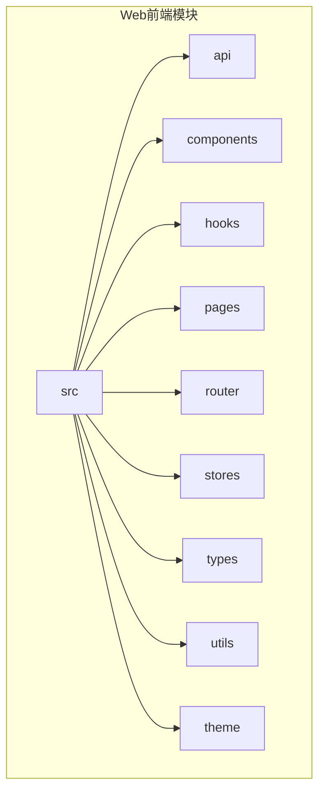
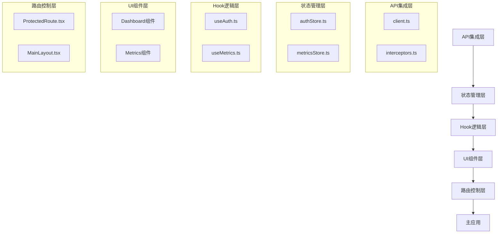
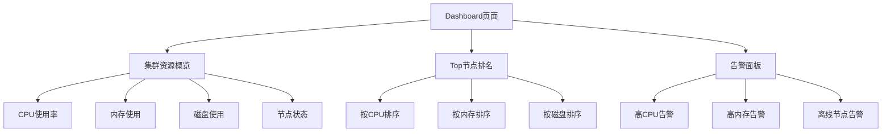
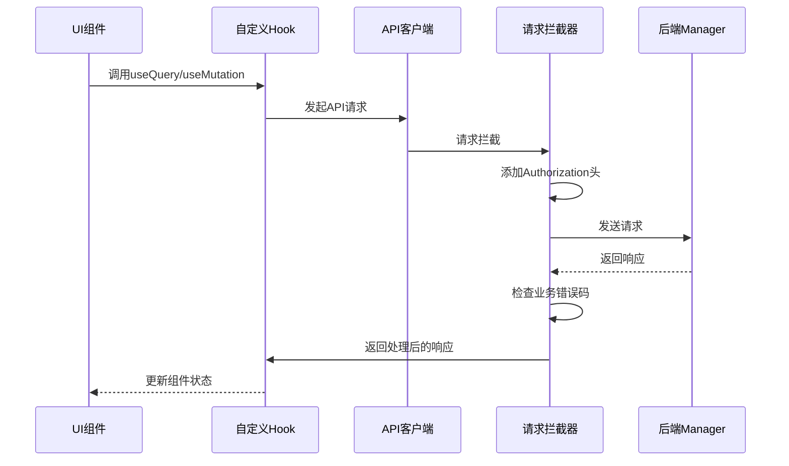
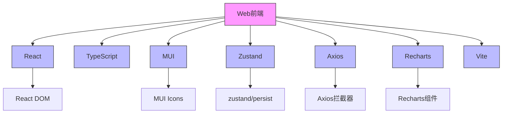

# Web前端模块

<cite>
**本文档引用的文件**
- [App.tsx](file://web/src/App.tsx)
- [main.tsx](file://web/src/main.tsx)
- [ProtectedRoute.tsx](file://web/src/router/ProtectedRoute.tsx)
- [authStore.ts](file://web/src/stores/authStore.ts)
- [metricsStore.ts](file://web/src/stores/metricsStore.ts)
- [MainLayout.tsx](file://web/src/components/Layout/MainLayout.tsx)
- [useAuth.ts](file://web/src/hooks/useAuth.ts)
- [useMetrics.ts](file://web/src/hooks/useMetrics.ts)
- [client.ts](file://web/src/api/client.ts)
- [interceptors.ts](file://web/src/api/interceptors.ts)
- [MetricsChart.tsx](file://web/src/components/Metrics/MetricsChart.tsx)
- [TimeRangeSelector.tsx](file://web/src/components/Metrics/TimeRangeSelector.tsx)
- [index.tsx](file://web/src/pages/Dashboard/index.tsx)
- [types.ts](file://web/src/types/index.ts)
- [storage.ts](file://web/src/utils/storage.ts)
</cite>

## 目录
1. [简介](#简介)
2. [项目结构](#项目结构)
3. [核心组件](#核心组件)
4. [架构概览](#架构概览)
5. [详细组件分析](#详细组件分析)
6. [依赖分析](#依赖分析)
7. [性能考虑](#性能考虑)
8. [故障排除指南](#故障排除指南)
9. [结论](#结论)

## 简介
本文件深入解析了运维工具框架中的Web前端模块，该模块基于React+TypeScript构建，采用现代化的前端架构。文档详细阐述了组件化设计原则、状态管理机制、API集成层、数据可视化组件以及用户体验优化策略。通过分析Dashboard和Metrics组件，展示了UI分层结构和实时指标渲染的实现方式。

## 项目结构
Web前端模块位于`web/`目录下，采用标准的React+TypeScript项目结构。源代码位于`web/src/`目录，主要包含api、components、hooks、pages、router、stores等子目录，分别对应API接口、UI组件、自定义Hook、页面组件、路由控制和状态管理。



**图表来源**
- [App.tsx](file://web/src/App.tsx)

**章节来源**
- [App.tsx](file://web/src/App.tsx)
- [main.tsx](file://web/src/main.tsx)

## 核心组件
前端模块的核心组件包括基于React Router的路由系统、使用Zustand的状态管理Store、基于Axios的API客户端以及由MUI构建的UI组件库。这些组件共同构成了一个高效、可维护的前端应用架构。

**章节来源**
- [App.tsx](file://web/src/App.tsx)
- [authStore.ts](file://web/src/stores/authStore.ts)
- [metricsStore.ts](file://web/src/stores/metricsStore.ts)

## 架构概览
整个前端应用采用分层架构设计，从下到上分别为：API集成层、状态管理层、Hook逻辑层、UI组件层和路由控制层。这种分层设计实现了关注点分离，提高了代码的可维护性和可测试性。



**图表来源**
- [App.tsx](file://web/src/App.tsx)
- [client.ts](file://web/src/api/client.ts)
- [authStore.ts](file://web/src/stores/authStore.ts)
- [useAuth.ts](file://web/src/hooks/useAuth.ts)

## 详细组件分析
对前端模块中的关键组件进行深入分析，包括其设计原则、实现方式和交互逻辑。

### Dashboard组件分析
Dashboard页面作为应用的主入口，集成了集群资源概览、节点状态统计和告警信息展示等功能。通过Grid布局实现了响应式设计，确保在不同屏幕尺寸下都有良好的用户体验。



**图表来源**
- [index.tsx](file://web/src/pages/Dashboard/index.tsx)
- [MetricCard.tsx](file://web/src/components/Metrics/MetricCard.tsx)
- [TopNodesCard.tsx](file://web/src/components/Dashboard/TopNodesCard.tsx)
- [AlertsPanel.tsx](file://web/src/components/Dashboard/AlertsPanel.tsx)

**章节来源**
- [index.tsx](file://web/src/pages/Dashboard/index.tsx)
- [MainLayout.tsx](file://web/src/components/Layout/MainLayout.tsx)

### 状态管理机制
应用使用Zustand库实现全局状态管理，通过创建独立的Store来管理不同领域的状态。`authStore`负责认证状态，`metricsStore`负责监控指标的状态。

```mermaid
classDiagram
class authStore {
+user : User | null
+token : string | null
+isAuthenticated : boolean
+_hasHydrated : boolean
+setAuth(user, token)
+clearAuth()
+updateUser(user)
+setHasHydrated(state)
}
class metricsStore {
+timeRange : TimeRange
+refreshInterval : number | null
+setTimeRange(range)
+setRefreshInterval(interval)
}
note right of authStore
使用zustand/persist实现
状态持久化到localStorage
end note
note right of metricsStore
管理时间范围选择和
自动刷新间隔设置
end note
```

**图表来源**
- [authStore.ts](file://web/src/stores/authStore.ts)
- [metricsStore.ts](file://web/src/stores/metricsStore.ts)

**章节来源**
- [authStore.ts](file://web/src/stores/authStore.ts)
- [metricsStore.ts](file://web/src/stores/metricsStore.ts)

### API集成层分析
API集成层基于Axios构建，通过创建自定义实例和配置拦截器，实现了统一的请求处理和错误管理。拦截器自动添加认证Token，并对响应进行统一的错误处理。



**图表来源**
- [client.ts](file://web/src/api/client.ts)
- [interceptors.ts](file://web/src/api/interceptors.ts)
- [useMetrics.ts](file://web/src/hooks/useMetrics.ts)

**章节来源**
- [client.ts](file://web/src/api/client.ts)
- [interceptors.ts](file://web/src/api/interceptors.ts)

### 数据可视化组件分析
MetricsChart组件使用Recharts库实现数据可视化，支持动态时间范围选择和实时数据更新。组件通过响应式设计，确保在不同设备上都有良好的显示效果。

```mermaid
flowchart TD
A[数据输入] --> B{数据是否为空?}
B --> |是| C[显示"暂无数据"]
B --> |否| D{是否加载中?}
D --> |是| E[显示加载骨架屏]
D --> |否| F[渲染AreaChart]
F --> G[配置X轴格式化]
F --> H[配置Y轴格式化]
F --> I[配置渐变填充]
F --> J[配置自定义Tooltip]
G --> K[根据时间范围选择显示格式]
H --> L[根据单位格式化刻度]
I --> M[创建线性渐变]
J --> N[显示时间戳和数值]
```

**图表来源**
- [MetricsChart.tsx](file://web/src/components/Metrics/MetricsChart.tsx)
- [TimeRangeSelector.tsx](file://web/src/components/Metrics/TimeRangeSelector.tsx)

**章节来源**
- [MetricsChart.tsx](file://web/src/components/Metrics/MetricsChart.tsx)
- [TimeRangeSelector.tsx](file://web/src/components/Metrics/TimeRangeSelector.tsx)

## 依赖分析
前端模块依赖于多个第三方库，包括React、TypeScript、MUI、Zustand、Axios和Recharts等。这些依赖通过package.json文件管理，并通过Vite进行模块打包。



**图表来源**
- [package.json](file://web/package.json)
- [vite.config.ts](file://web/vite.config.ts)

**章节来源**
- [package.json](file://web/package.json)
- [vite.config.ts](file://web/vite.config.ts)

## 性能考虑
前端应用在性能方面进行了多项优化，包括使用React Query进行数据缓存和自动刷新、使用memo进行组件记忆化、使用suspense进行代码分割等。这些优化措施有效提升了应用的响应速度和用户体验。

## 故障排除指南
当遇到前端问题时，可以按照以下步骤进行排查：检查网络连接、验证API地址配置、清除浏览器缓存、检查认证状态等。对于常见的网络错误，系统提供了详细的错误信息和解决方案建议。

**章节来源**
- [interceptors.ts](file://web/src/api/interceptors.ts)
- [ProtectedRoute.tsx](file://web/src/router/ProtectedRoute.tsx)

## 结论
Web前端模块采用现代化的React+TypeScript技术栈，通过合理的架构设计和组件化开发，实现了高效、可维护的运维管理界面。状态管理、API集成和数据可视化等方面的优秀实践，为系统的稳定运行提供了有力保障。