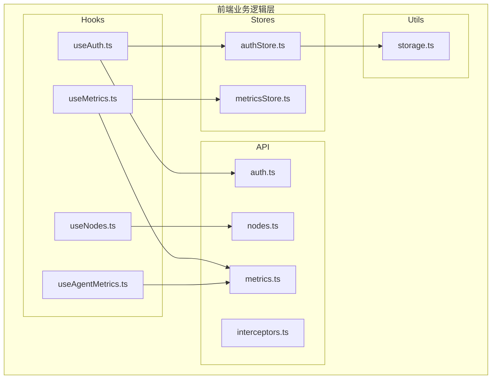
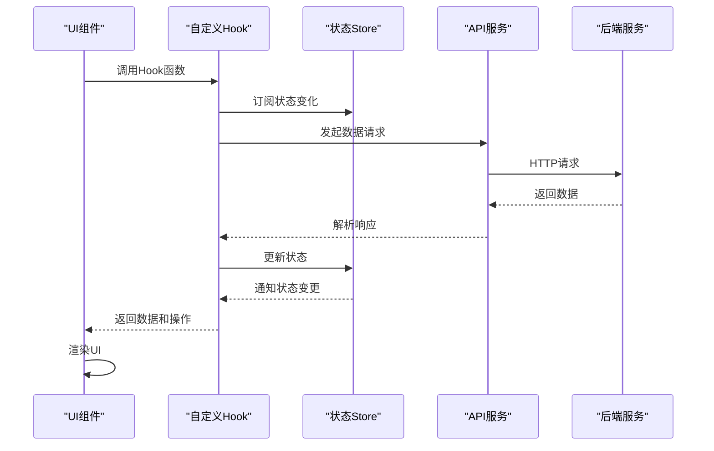
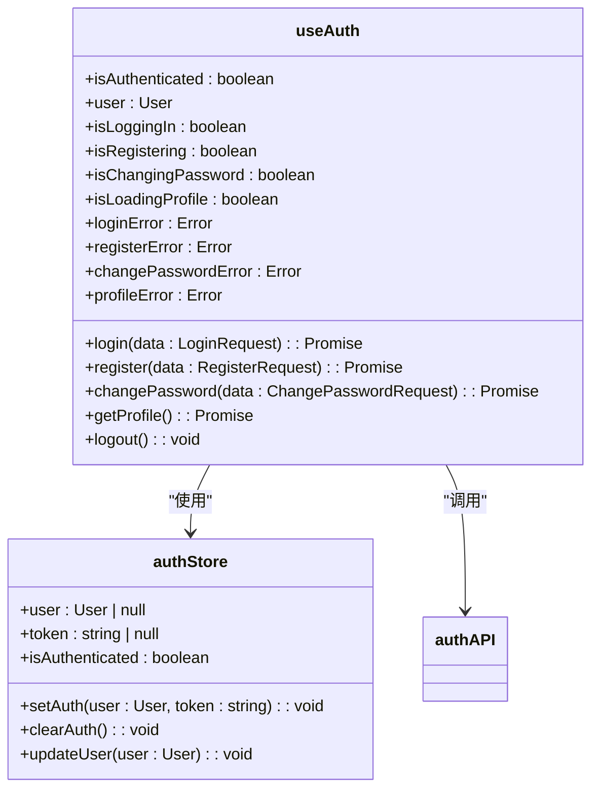
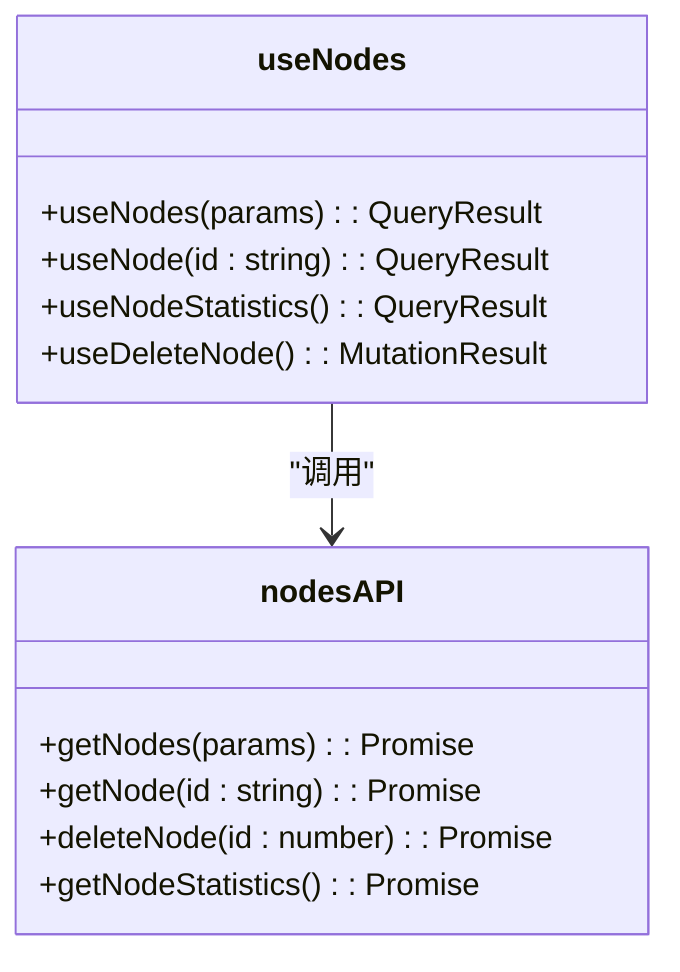
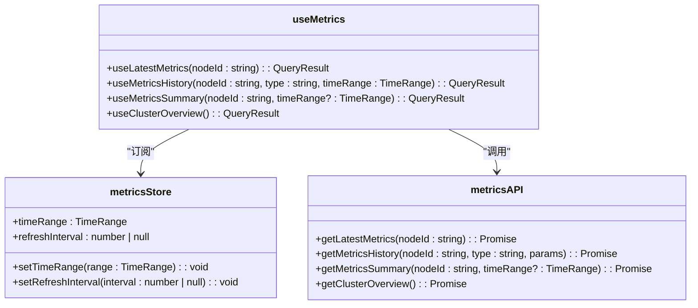
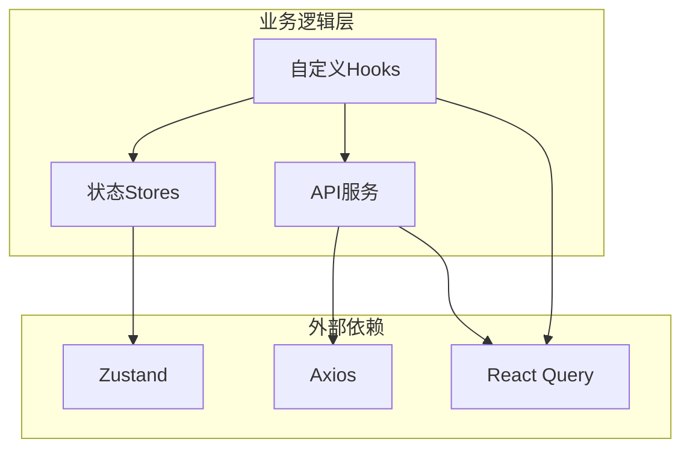

# 业务逻辑层

<cite>
**本文档引用的文件**
- [useAuth.ts](file://web/src/hooks/useAuth.ts)
- [useNodes.ts](file://web/src/hooks/useNodes.ts)
- [useMetrics.ts](file://web/src/hooks/useMetrics.ts)
- [useAgentMetrics.ts](file://web/src/hooks/useAgentMetrics.ts)
- [authStore.ts](file://web/src/stores/authStore.ts)
- [metricsStore.ts](file://web/src/stores/metricsStore.ts)
- [auth.ts](file://web/src/api/auth.ts)
- [nodes.ts](file://web/src/api/nodes.ts)
- [metrics.ts](file://web/src/api/metrics.ts)
- [interceptors.ts](file://web/src/api/interceptors.ts)
- [storage.ts](file://web/src/utils/storage.ts)
- [index.ts](file://web/src/stores/index.ts)
- [Login/index.tsx](file://web/src/pages/Login/index.tsx)
- [Dashboard/index.tsx](file://web/src/pages/Dashboard/index.tsx)
- [List.tsx](file://web/src/pages/Nodes/List.tsx)
</cite>

## 目录
1. [简介](#简介)
2. [项目结构](#项目结构)
3. [核心组件](#核心组件)
4. [架构概述](#架构概述)
5. [详细组件分析](#详细组件分析)
6. [依赖分析](#依赖分析)
7. [性能考虑](#性能考虑)
8. [故障排除指南](#故障排除指南)
9. [结论](#结论)

## 简介
本文档深入剖析前端业务逻辑层的实现机制，重点阐述自定义Hooks与状态管理Store的协同工作模式。文档详细说明useAuth、useNodes、useMetrics等自定义Hooks如何封装数据获取和业务逻辑，分析Zustand状态管理库在authStore和metricsStore中的具体应用。同时解释Hooks如何订阅Store状态变化并提供数据查询接口，描述数据缓存、错误处理和加载状态管理的实现策略。

## 项目结构

**图示来源**
- [useAuth.ts](file://web/src/hooks/useAuth.ts)
- [useNodes.ts](file://web/src/hooks/useNodes.ts)
- [useMetrics.ts](file://web/src/hooks/useMetrics.ts)
- [useAgentMetrics.ts](file://web/src/hooks/useAgentMetrics.ts)
- [authStore.ts](file://web/src/stores/authStore.ts)
- [metricsStore.ts](file://web/src/stores/metricsStore.ts)
- [auth.ts](file://web/src/api/auth.ts)
- [nodes.ts](file://web/src/api/nodes.ts)
- [metrics.ts](file://web/src/api/metrics.ts)
- [storage.ts](file://web/src/utils/storage.ts)

**本节来源**
- [web/src/hooks](file://web/src/hooks)
- [web/src/stores](file://web/src/stores)
- [web/src/api](file://web/src/api)
- [web/src/utils](file://web/src/utils)

## 核心组件

前端业务逻辑层采用自定义Hooks与状态管理Store相结合的架构模式，实现了数据获取、状态管理和业务逻辑的分离。自定义Hooks封装了具体的数据访问逻辑和业务操作，而Zustand状态管理Store则负责全局状态的存储和持久化。这种架构模式使得组件可以专注于UI渲染，而将复杂的业务逻辑交由Hooks处理。

**本节来源**
- [useAuth.ts](file://web/src/hooks/useAuth.ts#L1-L73)
- [authStore.ts](file://web/src/stores/authStore.ts#L1-L85)
- [useMetrics.ts](file://web/src/hooks/useMetrics.ts#L1-L103)
- [metricsStore.ts](file://web/src/stores/metricsStore.ts#L1-L37)

## 架构概述

**图示来源**
- [useAuth.ts](file://web/src/hooks/useAuth.ts)
- [useNodes.ts](file://web/src/hooks/useNodes.ts)
- [useMetrics.ts](file://web/src/hooks/useMetrics.ts)
- [authStore.ts](file://web/src/stores/authStore.ts)
- [metricsStore.ts](file://web/src/stores/metricsStore.ts)

## 详细组件分析

### 认证逻辑分析

#### useAuth Hook分析

**图示来源**
- [useAuth.ts](file://web/src/hooks/useAuth.ts#L13-L73)
- [authStore.ts](file://web/src/stores/authStore.ts#L23-L84)

**本节来源**
- [useAuth.ts](file://web/src/hooks/useAuth.ts#L1-L73)
- [authStore.ts](file://web/src/stores/authStore.ts#L1-L85)
- [auth.ts](file://web/src/api/auth.ts#L1-L43)

### 节点管理逻辑分析

#### useNodes Hook分析

**图示来源**
- [useNodes.ts](file://web/src/hooks/useNodes.ts#L11-L58)
- [nodes.ts](file://web/src/api/nodes.ts#L1-L47)

**本节来源**
- [useNodes.ts](file://web/src/hooks/useNodes.ts#L1-L58)
- [nodes.ts](file://web/src/api/nodes.ts#L1-L47)
- [List.tsx](file://web/src/pages/Nodes/List.tsx#L1-L183)

### 监控指标逻辑分析

#### useMetrics Hook分析

**图示来源**
- [useMetrics.ts](file://web/src/hooks/useMetrics.ts#L15-L103)
- [metricsStore.ts](file://web/src/stores/metricsStore.ts#L17-L36)
- [metrics.ts](file://web/src/api/metrics.ts#L1-L58)

**本节来源**
- [useMetrics.ts](file://web/src/hooks/useMetrics.ts#L1-L103)
- [metricsStore.ts](file://web/src/stores/metricsStore.ts#L1-L37)
- [metrics.ts](file://web/src/api/metrics.ts#L1-L58)
- [Dashboard/index.tsx](file://web/src/pages/Dashboard/index.tsx#L1-L193)

## 依赖分析

**图示来源**
- [useAuth.ts](file://web/src/hooks/useAuth.ts)
- [useNodes.ts](file://web/src/hooks/useNodes.ts)
- [useMetrics.ts](file://web/src/hooks/useMetrics.ts)
- [authStore.ts](file://web/src/stores/authStore.ts)
- [metricsStore.ts](file://web/src/stores/metricsStore.ts)
- [interceptors.ts](file://web/src/api/interceptors.ts)

**本节来源**
- [package.json](file://web/package.json)
- [useAuth.ts](file://web/src/hooks/useAuth.ts)
- [authStore.ts](file://web/src/stores/authStore.ts)

## 性能考虑

业务逻辑层在性能方面采用了多种优化策略。首先，通过React Query的缓存机制，实现了数据的本地缓存和自动失效管理，减少了不必要的网络请求。其次，设置了合理的缓存时间和刷新间隔，如最新指标数据缓存25秒并每30秒自动刷新，历史数据缓存5分钟等。此外，通过条件性查询（enabled）避免了无效的数据请求，例如在节点ID为空时不发起指标查询。

**本节来源**
- [useMetrics.ts](file://web/src/hooks/useMetrics.ts#L20-L21)
- [useMetrics.ts](file://web/src/hooks/useMetrics.ts#L53-L54)
- [useMetrics.ts](file://web/src/hooks/useMetrics.ts#L75-L76)
- [useMetrics.ts](file://web/src/hooks/useMetrics.ts#L92-L93)

## 故障排除指南

当业务逻辑层出现问题时，可以从以下几个方面进行排查：首先检查网络请求是否正常，查看浏览器开发者工具中的网络面板；其次确认认证状态是否正确，检查localStorage中的认证信息；然后验证状态Store的数据是否正确更新；最后检查自定义Hooks的返回值和加载状态。对于数据不更新的问题，可以检查React Query的查询键是否正确，以及缓存设置是否合理。

**本节来源**
- [useAuth.ts](file://web/src/hooks/useAuth.ts#L66-L70)
- [useMetrics.ts](file://web/src/hooks/useMetrics.ts#L22-L26)
- [useMetrics.ts](file://web/src/hooks/useMetrics.ts#L55-L57)
- [useMetrics.ts](file://web/src/hooks/useMetrics.ts#L76-L78)
- [useMetrics.ts](file://web/src/hooks/useMetrics.ts#L94-L98)

## 结论

前端业务逻辑层通过自定义Hooks与状态管理Store的协同工作，实现了清晰的职责分离和高效的代码复用。自定义Hooks封装了复杂的数据获取和业务逻辑，为上层组件提供了简洁的接口；Zustand状态管理Store则确保了全局状态的一致性和持久化。这种架构模式不仅提高了代码的可维护性，还增强了应用的性能和用户体验。未来可以进一步优化错误处理机制，并增加更多的监控和日志功能。