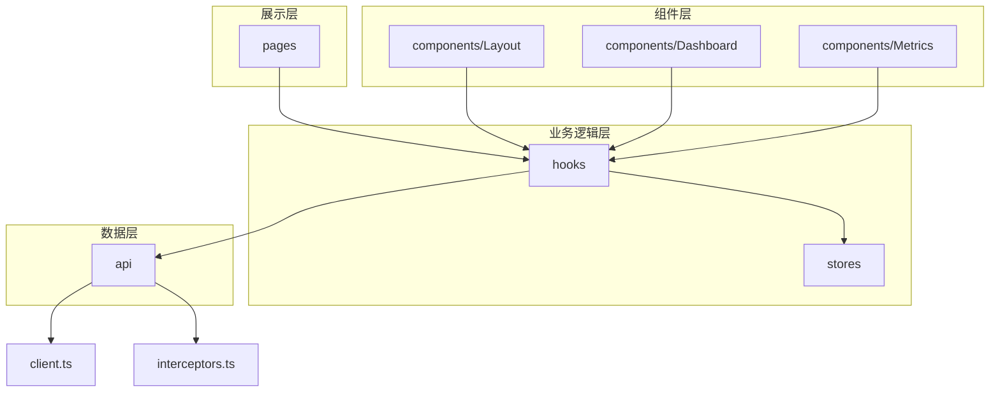
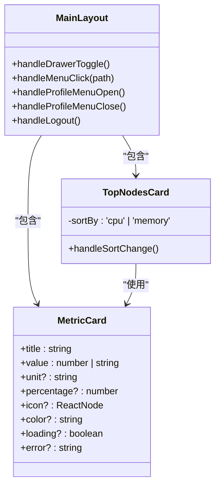
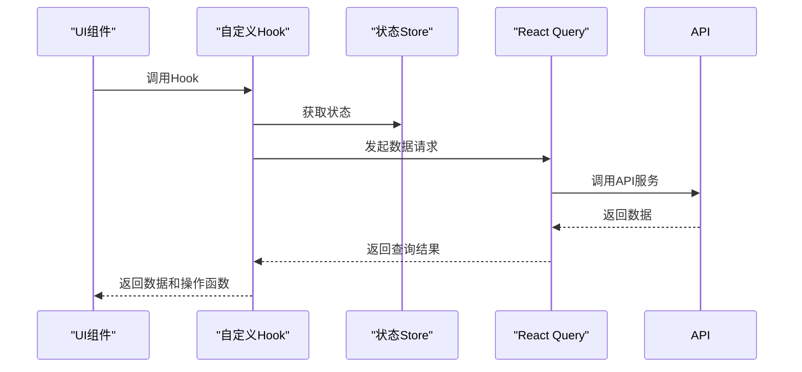
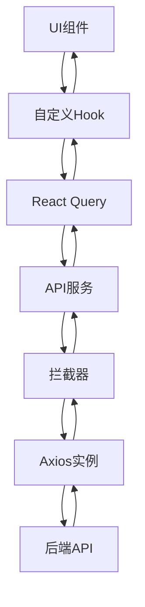
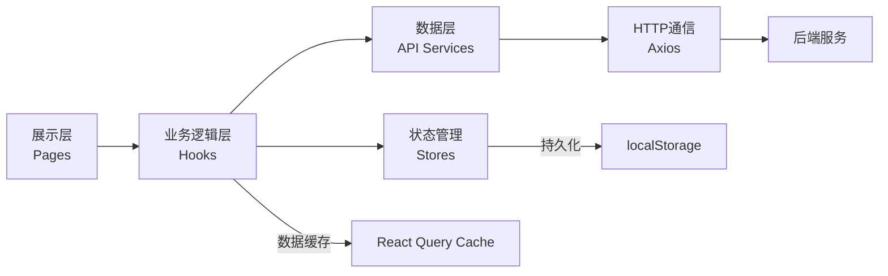

# 分层架构设计

<cite>
**本文档引用的文件**
- [App.tsx](file://web/src/App.tsx)
- [main.tsx](file://web/src/main.tsx)
- [ProtectedRoute.tsx](file://web/src/router/ProtectedRoute.tsx)
- [Dashboard/index.tsx](file://web/src/pages/Dashboard/index.tsx)
- [Login/index.tsx](file://web/src/pages/Login/index.tsx)
- [Nodes/index.ts](file://web/src/pages/Nodes/index.ts)
- [MainLayout.tsx](file://web/src/components/Layout/MainLayout.tsx)
- [TopNodesCard.tsx](file://web/src/components/Dashboard/TopNodesCard.tsx)
- [MetricCard.tsx](file://web/src/components/Metrics/MetricCard.tsx)
- [useAuth.ts](file://web/src/hooks/useAuth.ts)
- [useNodes.ts](file://web/src/hooks/useNodes.ts)
- [useMetrics.ts](file://web/src/hooks/useMetrics.ts)
- [authStore.ts](file://web/src/stores/authStore.ts)
- [metricsStore.ts](file://web/src/stores/metricsStore.ts)
- [client.ts](file://web/src/api/client.ts)
- [interceptors.ts](file://web/src/api/interceptors.ts)
- [auth.ts](file://web/src/api/auth.ts)
- [nodes.ts](file://web/src/api/nodes.ts)
- [agents.ts](file://web/src/api/agents.ts)
- [metrics.ts](file://web/src/api/metrics.ts)
</cite>

## 目录
1. [项目结构](#项目结构)
2. [展示层（Pages）](#展示层pages)
3. [组件层（Layout/Business/Common）](#组件层layoutbusinesscommon)
4. [业务逻辑层（Hooks/Stores）](#业务逻辑层hookstores)
5. [数据层（API Services）](#数据层api-services)
6. [四层架构调用关系](#四层架构调用关系)

## 项目结构

前端项目采用清晰的四层架构设计，各层职责分明，代码组织合理。项目根目录`web/src`下包含`api`、`components`、`hooks`、`pages`、`router`、`stores`等核心目录，分别对应数据层、组件层、业务逻辑层、展示层和状态管理。



**图示来源**
- [App.tsx](file://web/src/App.tsx)
- [MainLayout.tsx](file://web/src/components/Layout/MainLayout.tsx)
- [useAuth.ts](file://web/src/hooks/useAuth.ts)
- [authStore.ts](file://web/src/stores/authStore.ts)
- [client.ts](file://web/src/api/client.ts)
- [interceptors.ts](file://web/src/api/interceptors.ts)

## 展示层（Pages）

展示层位于`web/src/pages`目录下，包含`Dashboard`、`Login`和`Nodes`三个主要页面模块，负责用户界面的呈现和路由映射。

### 页面组织与路由映射

展示层的页面组织遵循功能模块化原则，每个页面模块独立成目录。`App.tsx`文件中的路由配置定义了页面间的导航关系：

- `/login` 路径映射到`Login`页面，用于用户身份验证
- `/dashboard` 路径映射到`Dashboard`页面，作为系统主入口
- `/nodes` 路径映射到`NodeList`组件，展示节点列表
- `/nodes/:id` 路径映射到`NodeDetail`组件，展示特定节点的详细信息

所有受保护的路由都通过`ProtectedRoute`组件进行访问控制，确保只有已认证用户才能访问系统核心功能。

```mermaid
graph TD
A[/login] --> B[Login页面]
C[/] --> D[ProtectedRoute]
D --> E[/dashboard]
D --> F[/nodes]
D --> G[/nodes/:id]
E --> H[Dashboard页面]
F --> I[NodeList组件]
G --> J[NodeDetail组件]
```

**图示来源**
- [App.tsx](file://web/src/App.tsx)
- [ProtectedRoute.tsx](file://web/src/router/ProtectedRoute.tsx)
- [Login/index.tsx](file://web/src/pages/Login/index.tsx)
- [Dashboard/index.tsx](file://web/src/pages/Dashboard/index.tsx)
- [Nodes/index.ts](file://web/src/pages/Nodes/index.ts)

**本节来源**
- [App.tsx](file://web/src/App.tsx#L34-L48)
- [ProtectedRoute.tsx](file://web/src/router/ProtectedRoute.tsx)
- [Login/index.tsx](file://web/src/pages/Login/index.tsx)
- [Dashboard/index.tsx](file://web/src/pages/Dashboard/index.tsx)
- [Nodes/index.ts](file://web/src/pages/Nodes/index.ts)

## 组件层（Layout/Business/Common）

组件层包含布局组件、业务组件和通用组件，实现了UI元素的复用和组合。

### 布局组件（Layout）

`MainLayout.tsx`实现了应用的主布局结构，包含顶部导航栏、侧边栏菜单和内容区域。布局组件使用`Outlet`占位符来渲染子路由的内容，实现了布局与内容的分离。侧边栏菜单包含"仪表盘"和"节点管理"两个导航项，支持响应式设计，在移动设备上以抽屉形式呈现。

### 业务组件（Dashboard）

`Dashboard`目录下的业务组件实现了特定功能模块的UI展示：
- `TopNodesCard`：展示资源使用率最高的5个节点，支持按CPU或内存使用率排序
- `AlertsPanel`：显示系统告警信息

### 通用组件（Metrics）

`Metrics`目录下的通用组件实现了可复用的UI元素：
- `MetricCard`：通用指标卡片，可显示标题、数值、单位和进度条
- `MetricsChart`：指标趋势图表
- `RefreshControl`：刷新控制组件
- `TimeRangeSelector`：时间范围选择器

这些组件通过props接收数据和配置，实现了高度的可复用性。



**图示来源**
- [MainLayout.tsx](file://web/src/components/Layout/MainLayout.tsx)
- [TopNodesCard.tsx](file://web/src/components/Dashboard/TopNodesCard.tsx)
- [MetricCard.tsx](file://web/src/components/Metrics/MetricCard.tsx)

**本节来源**
- [MainLayout.tsx](file://web/src/components/Layout/MainLayout.tsx)
- [TopNodesCard.tsx](file://web/src/components/Dashboard/TopNodesCard.tsx)
- [MetricCard.tsx](file://web/src/components/Metrics/MetricCard.tsx)

## 业务逻辑层（Hooks/Stores）

业务逻辑层由自定义Hooks和状态Store组成，实现了业务逻辑与UI的分离。

### 自定义Hooks

自定义Hooks封装了特定功能的业务逻辑，提供简洁的API供组件使用：

- `useAuth`：处理用户认证相关的业务逻辑，包括登录、注册、修改密码和登出
- `useNodes`：处理节点管理相关的业务逻辑，包括获取节点列表、节点详情和删除节点
- `useMetrics`：处理监控指标相关的业务逻辑，包括获取最新指标、历史指标和集群概览

这些Hooks基于`@tanstack/react-query`库实现，自动处理数据获取、缓存、错误处理和刷新逻辑。

### Zustand状态Store

状态Store使用Zustand库实现，提供了全局状态管理：

- `authStore`：管理用户认证状态，包括用户信息、认证令牌和认证状态
- `metricsStore`：管理监控指标相关的UI状态，包括时间范围和刷新间隔

状态Store支持持久化存储，用户认证信息在页面刷新后仍然保持。



**图示来源**
- [useAuth.ts](file://web/src/hooks/useAuth.ts)
- [useNodes.ts](file://web/src/hooks/useNodes.ts)
- [useMetrics.ts](file://web/src/hooks/useMetrics.ts)
- [authStore.ts](file://web/src/stores/authStore.ts)
- [metricsStore.ts](file://web/src/stores/metricsStore.ts)

**本节来源**
- [useAuth.ts](file://web/src/hooks/useAuth.ts)
- [useNodes.ts](file://web/src/hooks/useNodes.ts)
- [useMetrics.ts](file://web/src/hooks/useMetrics.ts)
- [authStore.ts](file://web/src/stores/authStore.ts)
- [metricsStore.ts](file://web/src/stores/metricsStore.ts)

## 数据层（API Services）

数据层位于`web/src/api`目录下，负责与后端API进行通信。

### Axios实例配置

`client.ts`文件创建了Axios实例，配置了基础URL、超时时间和默认请求头。基础URL通过环境变量`VITE_API_BASE_URL`配置，支持不同环境下的API地址切换。

### 拦截器统一处理

`interceptors.ts`文件配置了请求和响应拦截器，实现了HTTP通信的统一处理：

- **请求拦截器**：在每个请求中自动添加认证令牌（Bearer Token）
- **响应拦截器**：统一处理业务错误码和HTTP状态码，对401未授权错误自动重定向到登录页面，对网络错误提供详细的错误信息

### API服务模块

API服务按功能模块组织，每个模块导出对应的API函数：

- `auth.ts`：认证相关API，包括登录、注册、获取用户资料
- `nodes.ts`：节点管理相关API，包括获取节点列表、节点详情和删除节点
- `agents.ts`：Agent管理相关API
- `metrics.ts`：监控指标相关API

这些API函数返回Promise，与React Query的useQuery和useMutation完美集成。



**图示来源**
- [client.ts](file://web/src/api/client.ts)
- [interceptors.ts](file://web/src/api/interceptors.ts)
- [auth.ts](file://web/src/api/auth.ts)
- [nodes.ts](file://web/src/api/nodes.ts)

**本节来源**
- [client.ts](file://web/src/api/client.ts)
- [interceptors.ts](file://web/src/api/interceptors.ts)
- [auth.ts](file://web/src/api/auth.ts)
- [nodes.ts](file://web/src/api/nodes.ts)

## 四层架构调用关系

四层架构之间通过清晰的调用关系协同工作，形成了一个完整的数据流动路径。

### 数据流动路径

1. **展示层**通过调用**业务逻辑层**的自定义Hook来获取数据和操作函数
2. **业务逻辑层**的Hook调用**数据层**的API服务来获取远程数据
3. **数据层**通过Axios实例和拦截器与后端API通信
4. **业务逻辑层**的Hook将获取的数据和状态返回给**展示层**
5. **展示层**根据数据渲染UI，并通过操作函数触发状态更新

### 状态管理协作

- **Zustand Store**作为单一状态源，存储全局状态
- **自定义Hook**作为状态的消费者和操作者，通过Store API读取和更新状态
- **React Query**作为服务状态管理器，缓存和同步远程数据状态

这种架构设计实现了关注点分离，提高了代码的可维护性和可测试性。



**图示来源**
- [App.tsx](file://web/src/App.tsx)
- [useAuth.ts](file://web/src/hooks/useAuth.ts)
- [authStore.ts](file://web/src/stores/authStore.ts)
- [client.ts](file://web/src/api/client.ts)
- [interceptors.ts](file://web/src/api/interceptors.ts)