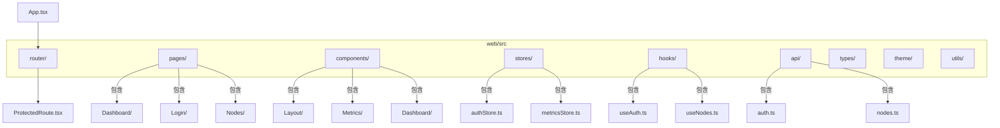
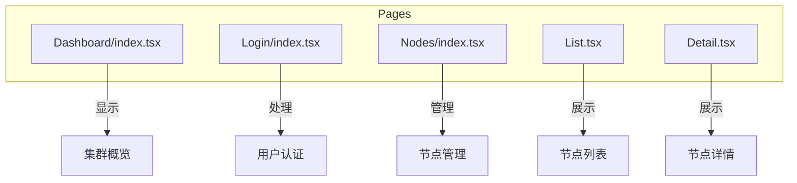
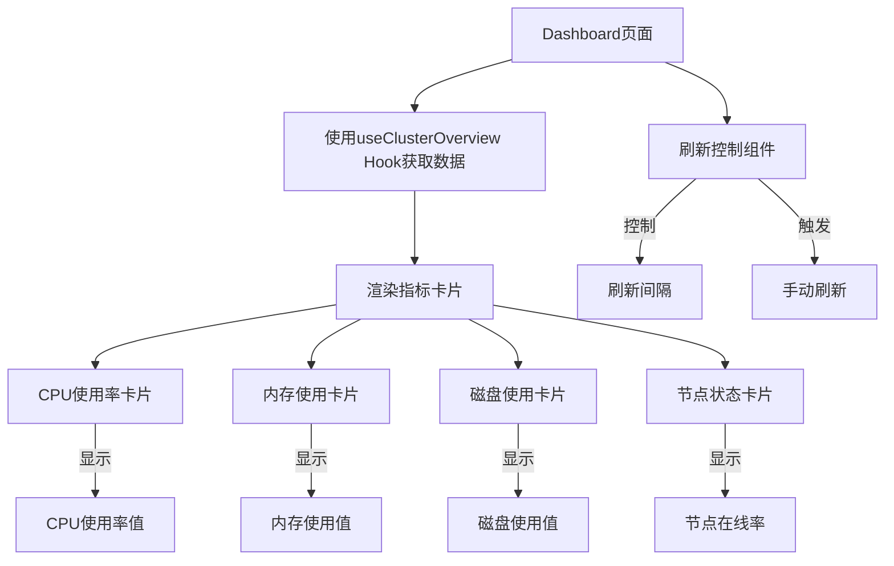
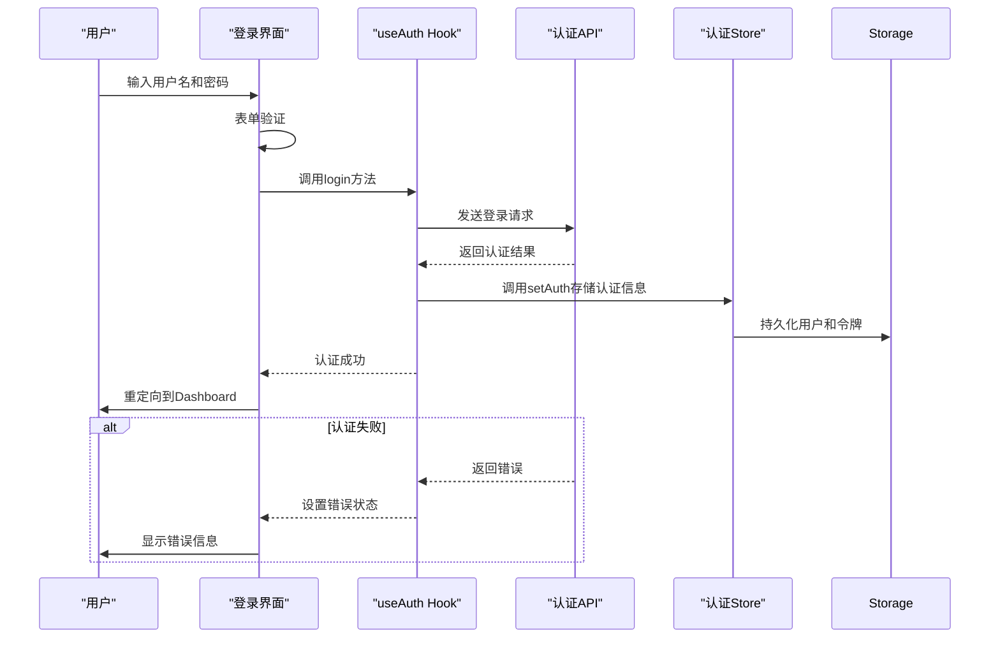
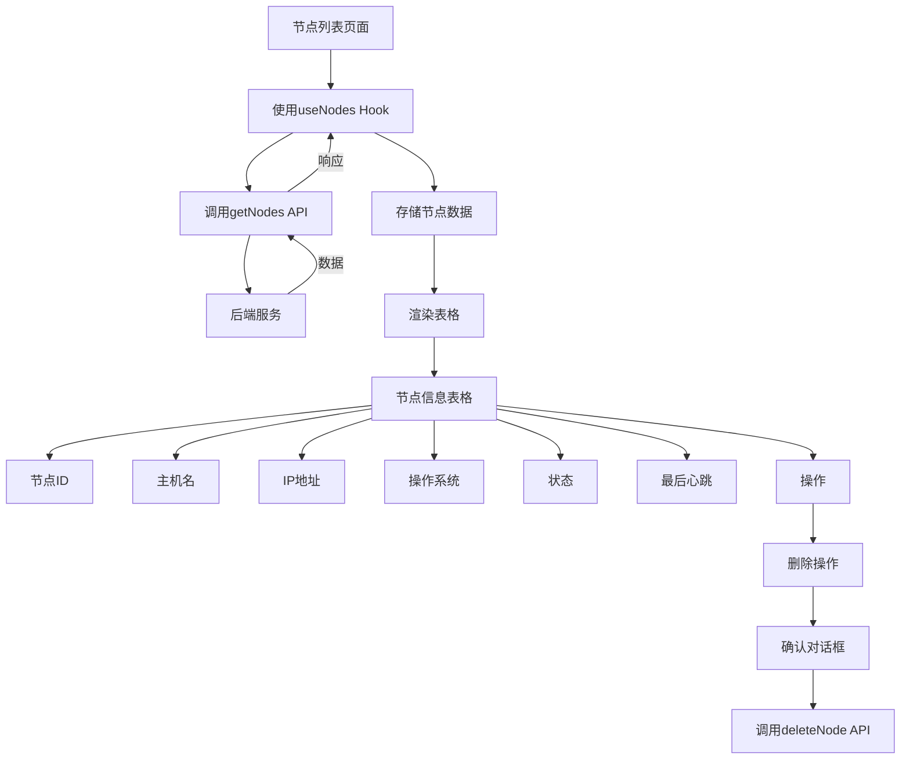
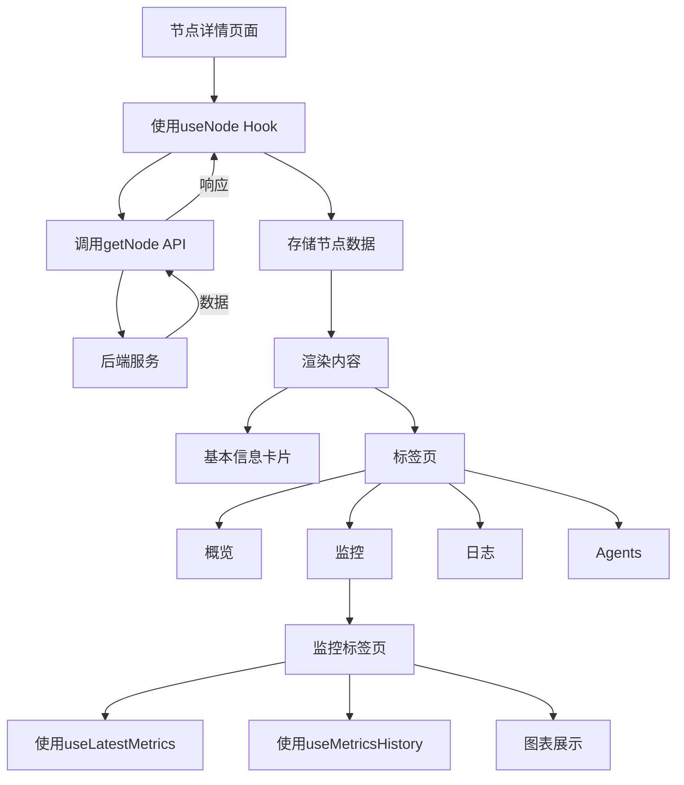
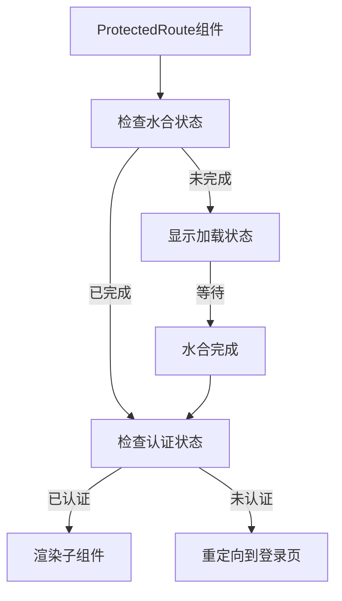
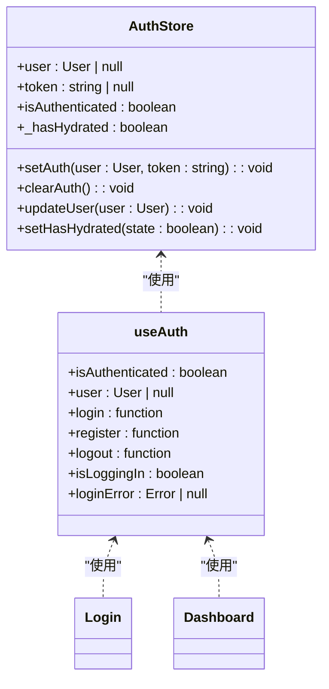
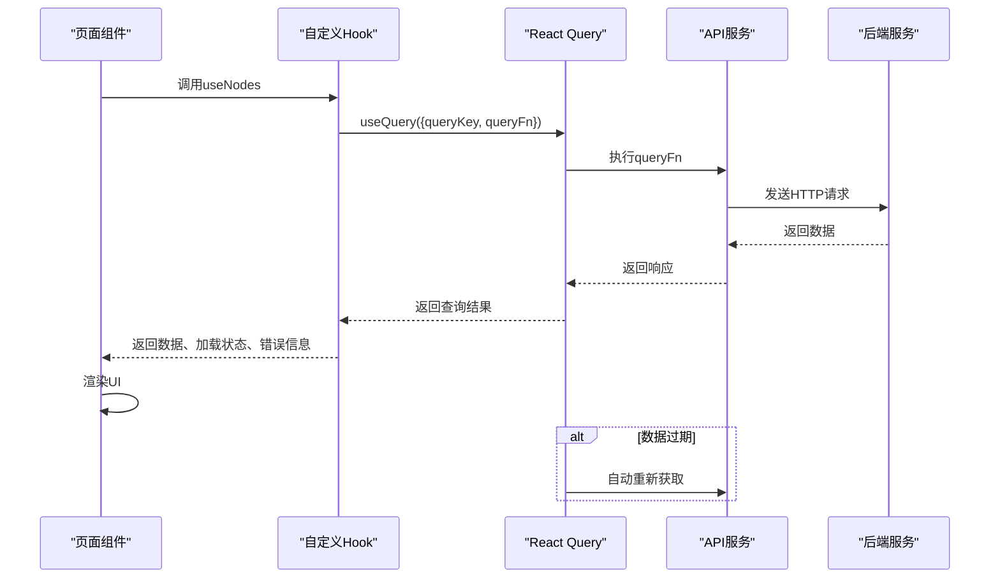

# 展示层

<cite>
**本文档引用的文件**
- [Dashboard/index.tsx](file://web/src/pages/Dashboard/index.tsx)
- [Login/index.tsx](file://web/src/pages/Login/index.tsx)
- [Nodes/List.tsx](file://web/src/pages/Nodes/List.tsx)
- [Nodes/Detail.tsx](file://web/src/pages/Nodes/Detail.tsx)
- [App.tsx](file://web/src/App.tsx)
- [ProtectedRoute.tsx](file://web/src/router/ProtectedRoute.tsx)
- [authStore.ts](file://web/src/stores/authStore.ts)
- [useAuth.ts](file://web/src/hooks/useAuth.ts)
- [useNodes.ts](file://web/src/hooks/useNodes.ts)
- [nodes.ts](file://web/src/api/nodes.ts)
- [auth.ts](file://web/src/api/auth.ts)
</cite>

## 目录
1. [项目结构](#项目结构)
2. [页面组件组织与路由映射](#页面组件组织与路由映射)
3. [Dashboard页面实现](#dashboard页面实现)
4. [登录认证流程](#登录认证流程)
5. [节点管理模块](#节点管理模块)
6. [路由与导航机制](#路由与导航机制)
7. [状态管理与API调用](#状态管理与api调用)

## 项目结构

前端展示层位于`web/src`目录下，采用模块化设计，主要包含以下目录结构：



**Diagram sources**
- [App.tsx](file://web/src/App.tsx)

**Section sources**
- [App.tsx](file://web/src/App.tsx)

## 页面组件组织与路由映射

前端展示层的页面组件按照功能模块组织在`pages`目录下，每个页面模块包含独立的组件文件和路由配置。页面组件通过React Router进行路由映射，形成清晰的导航结构。



**Diagram sources**
- [Dashboard/index.tsx](file://web/src/pages/Dashboard/index.tsx)
- [Login/index.tsx](file://web/src/pages/Login/index.tsx)
- [Nodes/List.tsx](file://web/src/pages/Nodes/List.tsx)
- [Nodes/Detail.tsx](file://web/src/pages/Nodes/Detail.tsx)

**Section sources**
- [Dashboard/index.tsx](file://web/src/pages/Dashboard/index.tsx)
- [Login/index.tsx](file://web/src/pages/Login/index.tsx)
- [Nodes/List.tsx](file://web/src/pages/Nodes/List.tsx)
- [Nodes/Detail.tsx](file://web/src/pages/Nodes/Detail.tsx)

## Dashboard页面实现

Dashboard页面作为系统概览入口，整合了多个业务组件展示关键监控指标。页面通过`useClusterOverview` Hook获取集群聚合数据，并使用`MetricCard`组件展示核心指标。

### 组件整合与数据展示

Dashboard页面通过网格布局组织四个核心指标卡片：集群平均CPU使用率、集群总内存使用、集群总磁盘使用和节点状态统计。每个卡片组件通过`useClusterOverview` Hook获取数据，并根据数据状态显示加载、错误或正常内容。



**Diagram sources**
- [Dashboard/index.tsx](file://web/src/pages/Dashboard/index.tsx)

**Section sources**
- [Dashboard/index.tsx](file://web/src/pages/Dashboard/index.tsx)

## 登录认证流程

登录页面实现了完整的用户认证流程，通过`useAuth` Hook管理认证状态，并与后端API进行交互完成登录操作。

### 认证流程实现

登录流程从用户输入凭据开始，通过React Hook Form处理表单验证，然后调用`useAuth` Hook的登录方法与后端进行认证交互。



**Diagram sources**
- [Login/index.tsx](file://web/src/pages/Login/index.tsx)
- [useAuth.ts](file://web/src/hooks/useAuth.ts)
- [authStore.ts](file://web/src/stores/authStore.ts)
- [auth.ts](file://web/src/api/auth.ts)

**Section sources**
- [Login/index.tsx](file://web/src/pages/Login/index.tsx)
- [useAuth.ts](file://web/src/hooks/useAuth.ts)

## 节点管理模块

节点管理模块包含节点列表和详情页，实现了节点数据的展示、筛选和操作功能。

### 节点列表数据展示

节点列表页面通过`useNodes` Hook获取分页的节点数据，并使用Material UI的Table组件展示节点信息。列表支持分页、排序和刷新功能。



**Diagram sources**
- [Nodes/List.tsx](file://web/src/pages/Nodes/List.tsx)
- [useNodes.ts](file://web/src/hooks/useNodes.ts)
- [nodes.ts](file://web/src/api/nodes.ts)

**Section sources**
- [Nodes/List.tsx](file://web/src/pages/Nodes/List.tsx)

### 节点详情数据展示

节点详情页面通过`useNode` Hook获取特定节点的详细信息，并使用Tabs组件组织不同类别的信息展示。详情页包含基本信息、监控、日志和Agents四个标签页。



**Diagram sources**
- [Nodes/Detail.tsx](file://web/src/pages/Nodes/Detail.tsx)
- [useNodes.ts](file://web/src/hooks/useNodes.ts)
- [nodes.ts](file://web/src/api/nodes.ts)

**Section sources**
- [Nodes/Detail.tsx](file://web/src/pages/Nodes/Detail.tsx)

## 路由与导航机制

前端应用使用React Router实现页面间的导航，并通过路由守卫确保只有认证用户才能访问受保护的页面。

### 路由配置与导航

应用的路由配置定义了所有页面的路径映射关系，并使用`ProtectedRoute`组件实现路由守卫功能。

```mermaid
graph TD
App[App组件] --> Router[BrowserRouter]
Router --> Routes[Routes]
Routes --> LoginRoute[/login]
Routes --> ProtectedRoute[ProtectedRoute]
ProtectedRoute --> MainLayout[MainLayout]
MainLayout --> IndexRoute[/]
IndexRoute --> DashboardRoute[/dashboard]
MainLayout --> NodesRoute[/nodes]
MainLayout --> NodeDetailRoute[/nodes/:id]
Routes --> NotFoundRoute[*]
NotFoundRoute --> DashboardRoute
LoginRoute --> Login[Login页面]
DashboardRoute --> Dashboard[Dashboard页面]
NodesRoute --> NodeList[节点列表]
NodeDetailRoute --> NodeDetail[节点详情]
```

**Diagram sources**
- [App.tsx](file://web/src/App.tsx)

**Section sources**
- [App.tsx](file://web/src/App.tsx)

### 路由守卫实现

路由守卫通过`ProtectedRoute`组件实现，该组件检查用户的认证状态，未认证用户将被重定向到登录页面。



**Diagram sources**
- [ProtectedRoute.tsx](file://web/src/router/ProtectedRoute.tsx)
- [authStore.ts](file://web/src/stores/authStore.ts)

**Section sources**
- [ProtectedRoute.tsx](file://web/src/router/ProtectedRoute.tsx)

## 状态管理与API调用

前端展示层通过Zustand实现状态管理，并使用React Query进行数据获取和缓存管理。

### 状态管理实现

认证状态通过`useAuthStore`管理，使用Zustand的persist中间件实现状态持久化，确保页面刷新后用户仍保持登录状态。



**Diagram sources**
- [authStore.ts](file://web/src/stores/authStore.ts)
- [useAuth.ts](file://web/src/hooks/useAuth.ts)

**Section sources**
- [authStore.ts](file://web/src/stores/authStore.ts)
- [useAuth.ts](file://web/src/hooks/useAuth.ts)

### API调用与数据获取

页面组件通过自定义Hook调用API服务，使用React Query管理数据获取、缓存和更新。



**Diagram sources**
- [useNodes.ts](file://web/src/hooks/useNodes.ts)
- [nodes.ts](file://web/src/api/nodes.ts)

**Section sources**
- [useNodes.ts](file://web/src/hooks/useNodes.ts)
- [nodes.ts](file://web/src/api/nodes.ts)