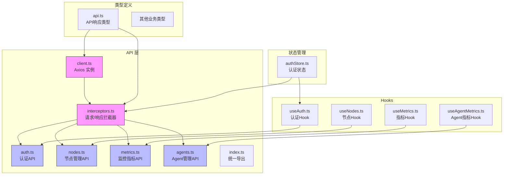
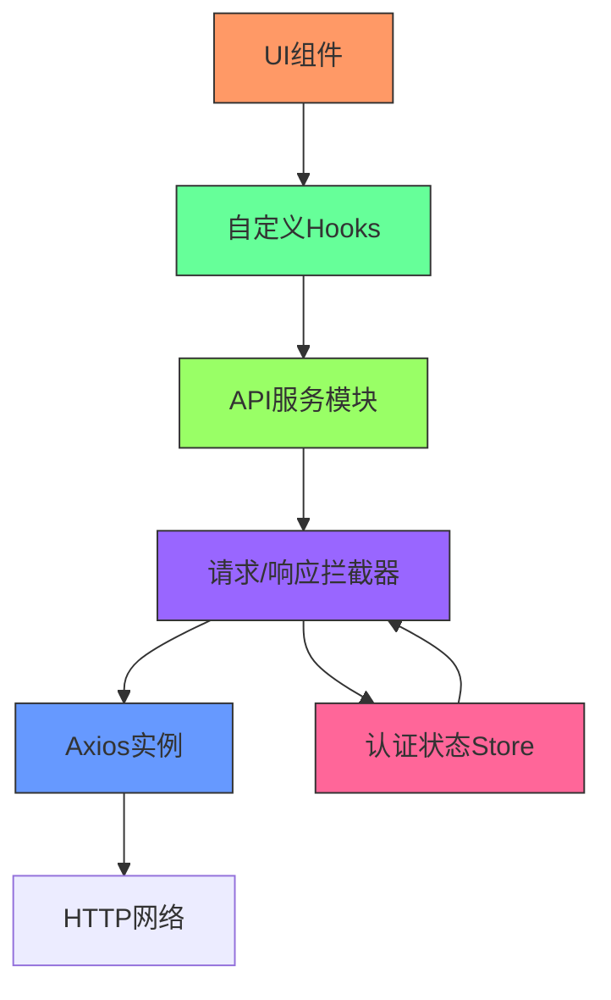
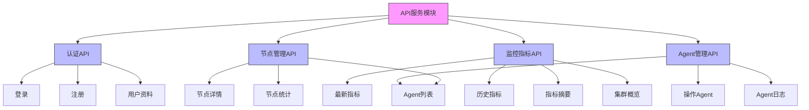
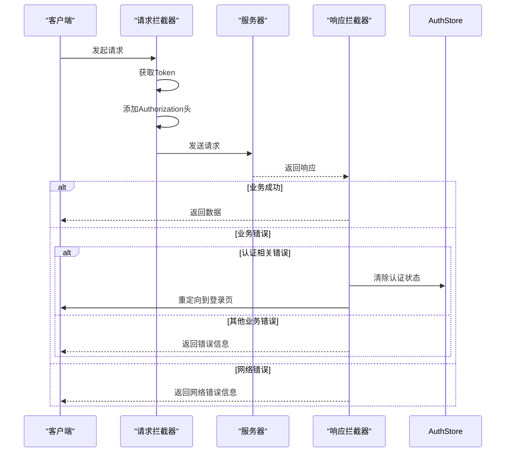
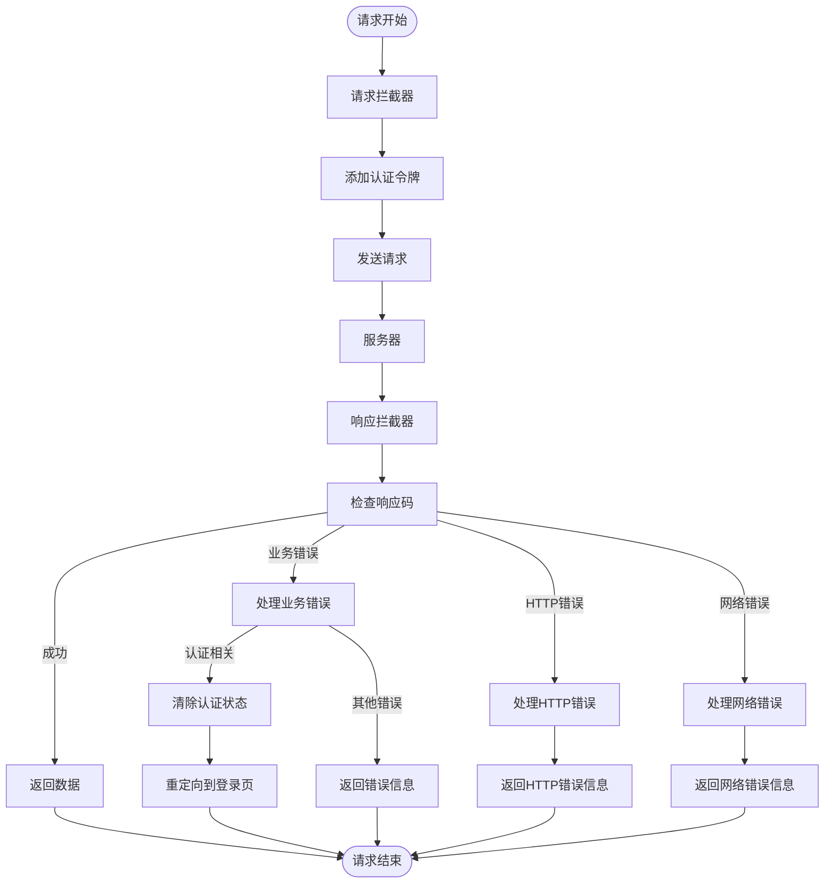
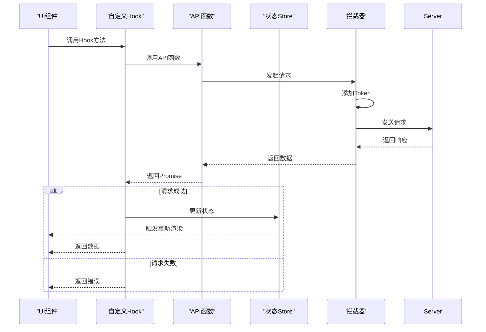
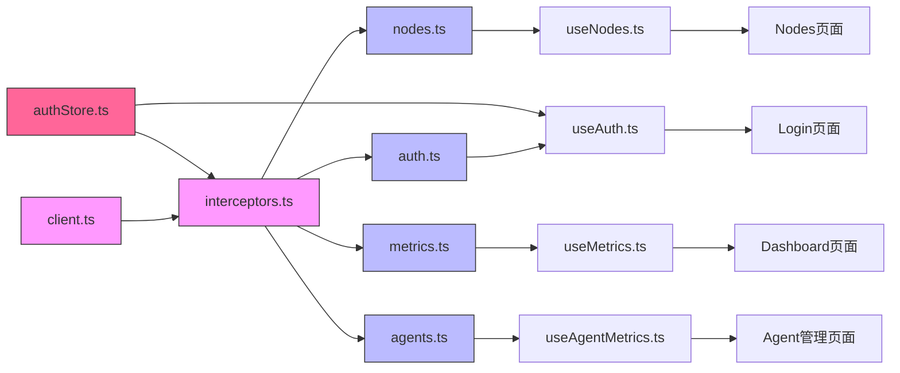

# 数据层

<cite>
**本文档引用的文件**
- [client.ts](file://web/src/api/client.ts)
- [interceptors.ts](file://web/src/api/interceptors.ts)
- [auth.ts](file://web/src/api/auth.ts)
- [nodes.ts](file://web/src/api/nodes.ts)
- [metrics.ts](file://web/src/api/metrics.ts)
- [agents.ts](file://web/src/api/agents.ts)
- [api.ts](file://web/src/types/api.ts)
- [authStore.ts](file://web/src/stores/authStore.ts)
- [useAuth.ts](file://web/src/hooks/useAuth.ts)
- [useNodes.ts](file://web/src/hooks/useNodes.ts)
- [useMetrics.ts](file://web/src/hooks/useMetrics.ts)
- [useAgentMetrics.ts](file://web/src/hooks/useAgentMetrics.ts)
- [ProtectedRoute.tsx](file://web/src/router/ProtectedRoute.tsx)
- [Login/index.tsx](file://web/src/pages/Login/index.tsx)
- [App.tsx](file://web/src/App.tsx)
</cite>

## 目录
1. [项目结构](#项目结构)
2. [核心组件](#核心组件)
3. [架构概述](#架构概述)
4. [详细组件分析](#详细组件分析)
5. [依赖分析](#依赖分析)
6. [性能考虑](#性能考虑)
7. [故障排除指南](#故障排除指南)
8. [结论](#结论)

## 项目结构

前端数据层的架构设计围绕API服务模块展开，采用模块化组织结构，将不同业务领域的API请求进行分类封装。API层位于`web/src/api`目录下，通过清晰的文件划分实现了关注点分离。

**Diagram sources**
- [client.ts](file://web/src/api/client.ts)
- [interceptors.ts](file://web/src/api/interceptors.ts)
- [auth.ts](file://web/src/api/auth.ts)
- [nodes.ts](file://web/src/api/nodes.ts)
- [metrics.ts](file://web/src/api/metrics.ts)
- [agents.ts](file://web/src/api/agents.ts)

**Section sources**
- [client.ts](file://web/src/api/client.ts)
- [interceptors.ts](file://web/src/api/interceptors.ts)
- [index.ts](file://web/src/api/index.ts)

## 核心组件

数据层的核心组件包括Axios实例配置、请求/响应拦截器、API模块封装和状态管理。这些组件协同工作，为上层应用提供稳定、可靠的HTTP通信能力。API服务模块通过`client.ts`创建的Axios实例作为基础，通过`interceptors.ts`添加横切关注点处理，然后在各个业务API文件中封装具体的HTTP请求。

**Section sources**
- [client.ts](file://web/src/api/client.ts)
- [interceptors.ts](file://web/src/api/interceptors.ts)
- [authStore.ts](file://web/src/stores/authStore.ts)

## 架构概述

前端数据层采用分层架构设计，从下到上依次为：Axios实例层、拦截器层、API服务层、Hook层和UI层。这种分层设计实现了关注点分离，提高了代码的可维护性和可测试性。Axios实例提供基础的HTTP通信能力，拦截器处理认证、错误处理等横切关注点，API服务层封装具体的业务API请求，Hook层为React组件提供数据获取和状态管理能力。

**Diagram sources**
- [client.ts](file://web/src/api/client.ts)
- [interceptors.ts](file://web/src/api/interceptors.ts)
- [authStore.ts](file://web/src/stores/authStore.ts)
- [useAuth.ts](file://web/src/hooks/useAuth.ts)

## 详细组件分析

### API服务模块组织结构

API服务模块采用功能模块化组织方式，将不同业务领域的API请求分别封装在独立的文件中。`auth.ts`处理认证相关API，`nodes.ts`处理节点管理API，`metrics.ts`处理监控指标API，`agents.ts`处理Agent管理API。这种组织方式使得代码结构清晰，易于维护和扩展。

**Diagram sources**
- [auth.ts](file://web/src/api/auth.ts)
- [nodes.ts](file://web/src/api/nodes.ts)
- [metrics.ts](file://web/src/api/metrics.ts)
- [agents.ts](file://web/src/api/agents.ts)

**Section sources**
- [auth.ts](file://web/src/api/auth.ts)
- [nodes.ts](file://web/src/api/nodes.ts)
- [metrics.ts](file://web/src/api/metrics.ts)
- [agents.ts](file://web/src/api/agents.ts)

### Axios实例配置与拦截器实现

Axios实例在`client.ts`中创建，配置了基础URL、超时时间和默认请求头。拦截器在`interceptors.ts`中配置，实现了认证令牌注入、错误码转换和自动重定向等横切关注点。请求拦截器从`authStore`获取当前用户的认证令牌，并将其添加到请求头中。响应拦截器处理业务错误码和HTTP状态码，对于认证相关的错误自动清除登录状态并重定向到登录页面。

**Diagram sources**
- [client.ts](file://web/src/api/client.ts)
- [interceptors.ts](file://web/src/api/interceptors.ts)
- [authStore.ts](file://web/src/stores/authStore.ts)

**Section sources**
- [client.ts](file://web/src/api/client.ts)
- [interceptors.ts](file://web/src/api/interceptors.ts)

### API模块封装与通信机制

各个API模块通过导入`interceptors`中的`client`实例来发起HTTP请求。每个API函数都返回一个Promise，遵循统一的响应格式。`auth.ts`中的`login`函数发起登录请求，`nodes.ts`中的`getNodes`函数获取节点列表，`metrics.ts`中的`getLatestMetrics`函数获取最新指标数据，`agents.ts`中的`listAgents`函数获取Agent列表。这些API函数通过链式调用`.then()`方法提取响应数据中的`data`字段，保持了API调用的一致性。

**Section sources**
- [auth.ts](file://web/src/api/auth.ts)
- [nodes.ts](file://web/src/api/nodes.ts)
- [metrics.ts](file://web/src/api/metrics.ts)
- [agents.ts](file://web/src/api/agents.ts)

### 横切关注点处理

API层通过拦截器集中处理认证令牌、错误码转换和请求重试等横切关注点。认证令牌从`authStore`中获取，并在请求拦截器中自动注入到请求头中。错误码转换在响应拦截器中实现，将后端返回的业务错误码和HTTP状态码转换为用户友好的错误信息。对于网络连接失败的情况，拦截器提供详细的错误提示，指导用户检查服务状态和网络配置。

**Diagram sources**
- [interceptors.ts](file://web/src/api/interceptors.ts)
- [authStore.ts](file://web/src/stores/authStore.ts)

**Section sources**
- [interceptors.ts](file://web/src/api/interceptors.ts)
- [authStore.ts](file://web/src/stores/authStore.ts)

### API层与上层Hooks的调用关系

API层与上层Hooks通过依赖注入的方式建立调用关系。各个Hook文件（如`useAuth.ts`、`useNodes.ts`）导入对应的API函数，并使用`@tanstack/react-query`库的`useQuery`和`useMutation`等Hook来管理数据获取和状态更新。`useAuth` Hook导入`login`、`register`等API函数，封装成更易用的接口供UI组件调用。当API请求成功时，Hook会自动更新`authStore`中的状态，触发UI的重新渲染。

**Diagram sources**
- [useAuth.ts](file://web/src/hooks/useAuth.ts)
- [useNodes.ts](file://web/src/hooks/useNodes.ts)
- [useMetrics.ts](file://web/src/hooks/useMetrics.ts)
- [useAgentMetrics.ts](file://web/src/hooks/useAgentMetrics.ts)
- [authStore.ts](file://web/src/stores/authStore.ts)

**Section sources**
- [useAuth.ts](file://web/src/hooks/useAuth.ts)
- [useNodes.ts](file://web/src/hooks/useNodes.ts)
- [useMetrics.ts](file://web/src/hooks/useMetrics.ts)
- [useAgentMetrics.ts](file://web/src/hooks/useAgentMetrics.ts)

## 依赖分析

数据层各组件之间存在明确的依赖关系。API服务模块依赖于Axios实例和拦截器，拦截器依赖于认证状态Store，各个Hook依赖于对应的API函数，UI组件依赖于Hook。这种依赖关系形成了清晰的调用链，使得代码结构易于理解和维护。通过`index.ts`文件统一导出所有API函数，简化了导入路径，提高了代码的可读性。

**Diagram sources**
- [client.ts](file://web/src/api/client.ts)
- [interceptors.ts](file://web/src/api/interceptors.ts)
- [auth.ts](file://web/src/api/auth.ts)
- [nodes.ts](file://web/src/api/nodes.ts)
- [metrics.ts](file://web/src/api/metrics.ts)
- [agents.ts](file://web/src/api/agents.ts)
- [authStore.ts](file://web/src/stores/authStore.ts)
- [useAuth.ts](file://web/src/hooks/useAuth.ts)
- [useNodes.ts](file://web/src/hooks/useNodes.ts)
- [useMetrics.ts](file://web/src/hooks/useMetrics.ts)
- [useAgentMetrics.ts](file://web/src/hooks/useAgentMetrics.ts)

**Section sources**
- [client.ts](file://web/src/api/client.ts)
- [interceptors.ts](file://web/src/api/interceptors.ts)
- [authStore.ts](file://web/src/stores/authStore.ts)

## 性能考虑

数据层在性能方面进行了多项优化。通过`@tanstack/react-query`库的缓存机制，避免了重复的网络请求，提高了应用响应速度。`useLatestMetrics` Hook设置了30秒的自动刷新间隔和25秒的缓存时间，平衡了数据实时性和网络开销。历史数据查询设置了5分钟的缓存时间，减少了对服务器的压力。错误处理中提供了详细的网络连接失败信息，帮助用户快速定位问题，减少了不必要的重试请求。

## 故障排除指南

当API请求出现问题时，可以按照以下步骤进行排查：
1. 检查Manager服务是否已启动
2. 检查API地址配置是否正确（查看`.env.development`文件）
3. 检查防火墙或网络设置是否阻止了连接
4. 查看浏览器开发者工具中的网络请求，确认请求URL和响应状态
5. 检查认证令牌是否有效，必要时重新登录
6. 查看控制台错误信息，根据提示进行相应处理

**Section sources**
- [interceptors.ts](file://web/src/api/interceptors.ts)
- [ProtectedRoute.tsx](file://web/src/router/ProtectedRoute.tsx)
- [Login/index.tsx](file://web/src/pages/Login/index.tsx)

## 结论

前端数据层采用模块化、分层化的架构设计，通过Axios实例、拦截器、API服务模块和自定义Hook的协同工作，为应用提供了稳定、可靠的HTTP通信能力。API服务模块按业务领域进行组织，代码结构清晰，易于维护。拦截器集中处理认证、错误处理等横切关注点，提高了代码的复用性。与`@tanstack/react-query`库的集成实现了数据缓存和状态管理，提升了应用性能和用户体验。整体架构设计合理，具有良好的可扩展性和可维护性。