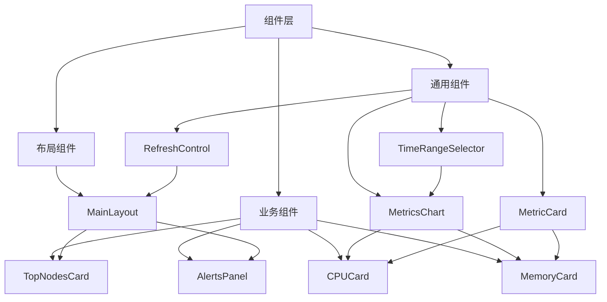
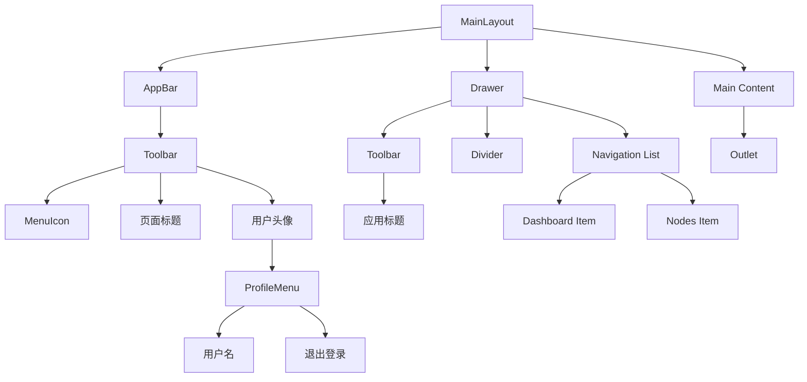
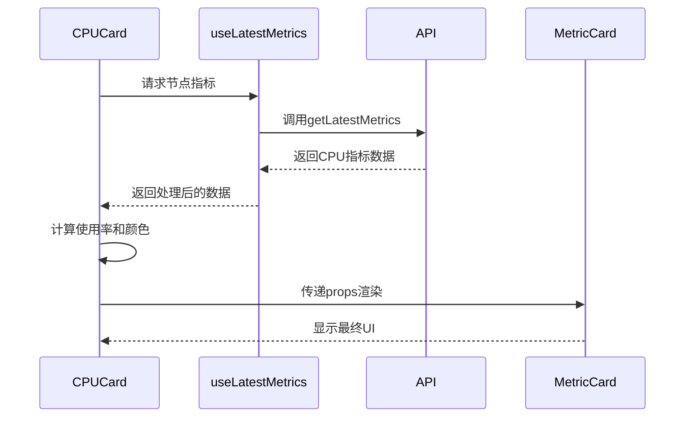
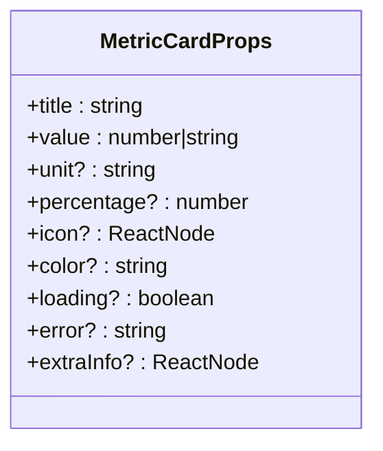
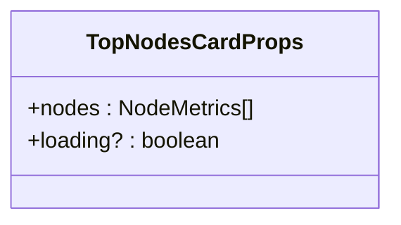
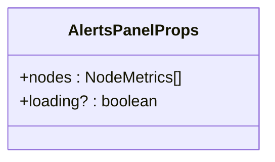
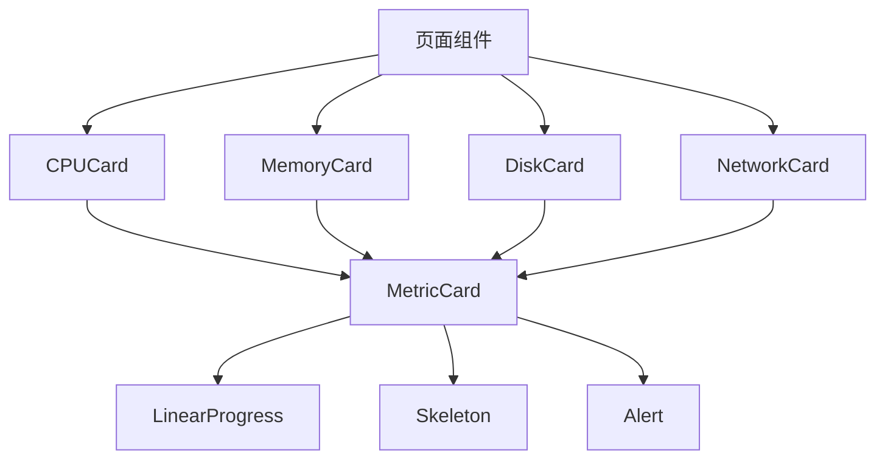
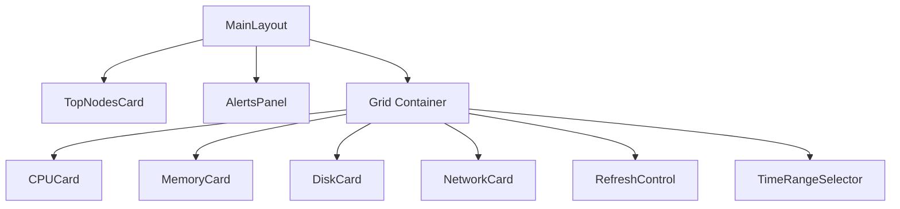
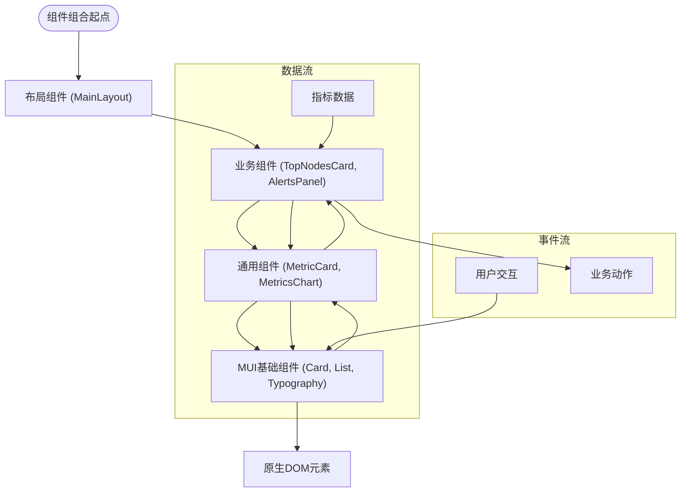

# 组件层

<cite>
**本文档引用的文件**
- [MainLayout.tsx](file://web/src/components/Layout/MainLayout.tsx)
- [MetricsChart.tsx](file://web/src/components/Metrics/MetricsChart.tsx)
- [MetricCard.tsx](file://web/src/components/Metrics/MetricCard.tsx)
- [CPUCard.tsx](file://web/src/components/Metrics/CPUCard.tsx)
- [MemoryCard.tsx](file://web/src/components/Metrics/MemoryCard.tsx)
- [TopNodesCard.tsx](file://web/src/components/Dashboard/TopNodesCard.tsx)
- [AlertsPanel.tsx](file://web/src/components/Dashboard/AlertsPanel.tsx)
- [RefreshControl.tsx](file://web/src/components/Metrics/RefreshControl.tsx)
- [TimeRangeSelector.tsx](file://web/src/components/Metrics/TimeRangeSelector.tsx)
- [metrics.ts](file://web/src/types/metrics.ts)
- [metricsUtils.ts](file://web/src/utils/metricsUtils.ts)
- [alertRules.ts](file://web/src/utils/alertRules.ts)
- [useMetrics.ts](file://web/src/hooks/useMetrics.ts)
</cite>

## 目录
1. [组件架构概述](#组件架构概述)
2. [布局组件设计](#布局组件设计)
3. [监控图表组件](#监控图表组件)
4. [业务组件实现](#业务组件实现)
5. [组件接口与使用](#组件接口与使用)
6. [组件组合与样式](#组件组合与样式)

## 组件架构概述

前端组件层采用分层架构设计，将组件划分为布局组件、通用组件和业务组件三大类别，实现高内聚、低耦合的组件化开发模式。布局组件负责页面整体结构和导航框架，通用组件提供可复用的UI元素和功能模块，业务组件则封装特定业务逻辑和数据可视化功能。

组件层通过React函数式组件和Hooks机制实现状态管理和逻辑复用，结合Material-UI组件库构建一致的视觉风格。组件间通过props进行数据传递，利用TypeScript接口定义确保类型安全。这种分层设计不仅提高了代码的可维护性，还支持组件的灵活组合和跨页面复用。

**组件架构图**


**Diagram sources**
- [MainLayout.tsx](file://web/src/components/Layout/MainLayout.tsx)
- [MetricsChart.tsx](file://web/src/components/Metrics/MetricsChart.tsx)
- [MetricCard.tsx](file://web/src/components/Metrics/MetricCard.tsx)
- [TopNodesCard.tsx](file://web/src/components/Dashboard/TopNodesCard.tsx)
- [AlertsPanel.tsx](file://web/src/components/Dashboard/AlertsPanel.tsx)

## 布局组件设计

MainLayout组件作为应用的主布局容器，实现了统一的页面结构和导航框架。该组件采用响应式设计，支持桌面端和移动端的不同布局模式。在桌面端，导航侧边栏以永久抽屉形式显示；在移动端，则以临时抽屉形式呈现，通过汉堡菜单按钮进行切换。

布局组件集成了用户身份验证信息展示和退出登录功能，通过useAuth Hook获取当前用户信息，并在顶部导航栏右侧显示用户头像和操作菜单。导航菜单采用声明式配置，通过menuItems数组定义路由链接和图标，支持快速扩展新的功能页面。

**MainLayout组件结构**


**Section sources**
- [MainLayout.tsx](file://web/src/components/Layout/MainLayout.tsx#L1-L184)

## 监控图表组件

监控图表组件基于Recharts库封装，实现了ECharts功能的替代方案，提供丰富的数据可视化能力。MetricsChart组件作为核心图表组件，支持面积图、折线图等多种图表类型，通过响应式容器适配不同屏幕尺寸。

组件采用函数式编程思想，通过自定义Hook和memo优化性能。MetricsChart组件支持动态数据更新、加载状态显示和空数据提示，内置了智能的坐标轴格式化逻辑，根据时间范围自动调整X轴标签格式。Y轴支持自定义单位显示，Tooltip组件提供详细的数据信息展示。

**图表组件关系图**
```mermaid
classDiagram
class MetricsChart {
+data : {timestamp : number, value : number}[]
+title : string
+unit : string
+color : string
+loading? : boolean
+height? : number
}
class CustomTooltip {
+active : boolean
+payload : any
+label : any
}
class formatXAxisTick {
+timestamp : number
+timeRange : number
}
class formatYAxisTick {
+value : number
+unit : string
}
MetricsChart --> CustomTooltip : "使用"
MetricsChart --> formatXAxisTick : "调用"
MetricsChart --> formatYAxisTick : "调用"
MetricsChart --> ResponsiveContainer : "包装"
MetricsChart --> AreaChart : "使用"
```

**Section sources**
- [MetricsChart.tsx](file://web/src/components/Metrics/MetricsChart.tsx#L1-L178)
- [MetricCard.tsx](file://web/src/components/Metrics/MetricCard.tsx#L1-L117)

## 业务组件实现

### TopNodesCard组件

TopNodesCard组件用于展示资源使用率最高的5个节点，支持按CPU或内存使用率进行排序。组件通过useMemo优化排序计算性能，避免不必要的重复计算。排名前三位的节点分别显示金、银、铜色标识，增强视觉识别效果。

组件实现了完整的加载状态管理，支持Skeleton占位符显示，提供流畅的用户体验。节点列表支持点击交互，点击后跳转到对应节点的详情页面。使用率进度条采用动态颜色方案，根据使用率高低显示不同颜色，直观反映资源压力状况。

**Section sources**
- [TopNodesCard.tsx](file://web/src/components/Dashboard/TopNodesCard.tsx#L1-L202)

### AlertsPanel组件

AlertsPanel组件负责展示系统告警信息，通过checkNodeAlerts工具函数分析节点指标数据，生成告警列表。组件采用分级告警机制，将告警分为critical和warning两个级别，分别用红色和黄色标识。

告警列表按严重程度排序，critical级别告警优先显示。组件右上角的徽章显示当前告警总数，并根据是否存在critical告警改变颜色。支持最多显示10个告警，超出部分通过"还有X个告警"提示，避免界面过于拥挤。

**Section sources**
- [AlertsPanel.tsx](file://web/src/components/Dashboard/AlertsPanel.tsx#L1-L137)
- [alertRules.ts](file://web/src/utils/alertRules.ts#L1-L121)

### 指标卡片组件

指标卡片组件包括CPUCard和MemoryCard等，基于通用的MetricCard组件构建。这些组件通过useLatestMetrics Hook获取实时监控数据，实现自动刷新功能。组件采用颜色编码方案，根据资源使用率高低显示不同颜色，帮助用户快速识别异常情况。

CPUCard组件显示CPU使用率百分比，同时展示CPU核心数和型号等附加信息。MemoryCard组件显示内存使用量和总量，单位为GB，便于用户理解内存容量。两个组件都实现了错误处理机制，在数据获取失败时显示错误信息。

**指标组件数据流**


**Diagram sources**
- [CPUCard.tsx](file://web/src/components/Metrics/CPUCard.tsx#L1-L77)
- [MemoryCard.tsx](file://web/src/components/Metrics/MemoryCard.tsx#L1-L86)
- [useMetrics.ts](file://web/src/hooks/useMetrics.ts#L1-L103)

## 组件接口与使用

### 组件Props接口定义

各组件通过TypeScript接口明确定义props，确保类型安全和开发体验。核心接口包括：

**MetricCardProps接口**


**MetricsChartProps接口**
```mermaid
classDiagram
class MetricsChartProps {
+data : {timestamp : number, value : number}[]
+title : string
+unit : string
+color : string
+loading? : boolean
+height? : number
}
```

**TopNodesCardProps接口**


**AlertsPanelProps接口**


### 组件使用示例

**指标卡片使用示例**


**仪表盘布局示例**


**Section sources**
- [MetricCard.tsx](file://web/src/components/Metrics/MetricCard.tsx#L16-L26)
- [MetricsChart.tsx](file://web/src/components/Metrics/MetricsChart.tsx#L18-L25)
- [TopNodesCard.tsx](file://web/src/components/Dashboard/TopNodesCard.tsx#L30-L33)
- [AlertsPanel.tsx](file://web/src/components/Dashboard/AlertsPanel.tsx#L24-L27)

## 组件组合与样式

组件层通过组合模式实现复杂UI的构建，遵循单一职责原则。通用组件如MetricCard和MetricsChart作为基础构建块，业务组件通过组合这些基础组件实现特定功能。这种设计模式提高了组件的复用性和可维护性。

样式管理采用Material-UI的sx prop和Theme机制，支持动态样式和主题切换。组件通过useTheme Hook获取当前主题，实现颜色、间距等样式的统一管理。关键样式规则包括：

- **卡片组件**：统一使用elevation={2}的阴影效果，保持视觉一致性
- **响应式布局**：通过Box组件的sx属性实现断点适配
- **颜色方案**：基于资源使用率动态计算颜色，使用getUsageColor工具函数
- **间距系统**：遵循Material-UI的8px网格系统，确保布局协调

**组件组合模式**


**Section sources**
- [MainLayout.tsx](file://web/src/components/Layout/MainLayout.tsx)
- [metricsUtils.ts](file://web/src/utils/metricsUtils.ts#L13-L32)
- [RefreshControl.tsx](file://web/src/components/Metrics/RefreshControl.tsx)
- [TimeRangeSelector.tsx](file://web/src/components/Metrics/TimeRangeSelector.tsx)