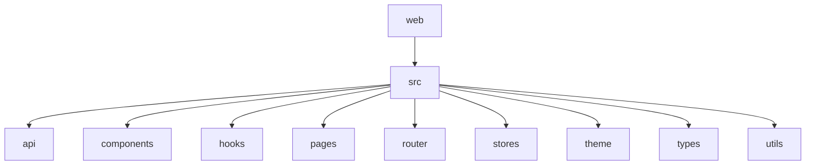
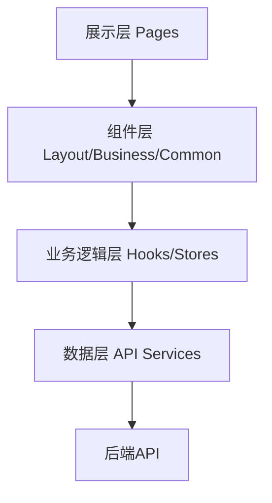
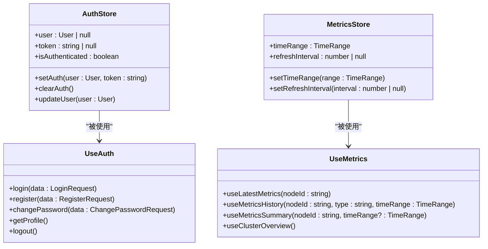
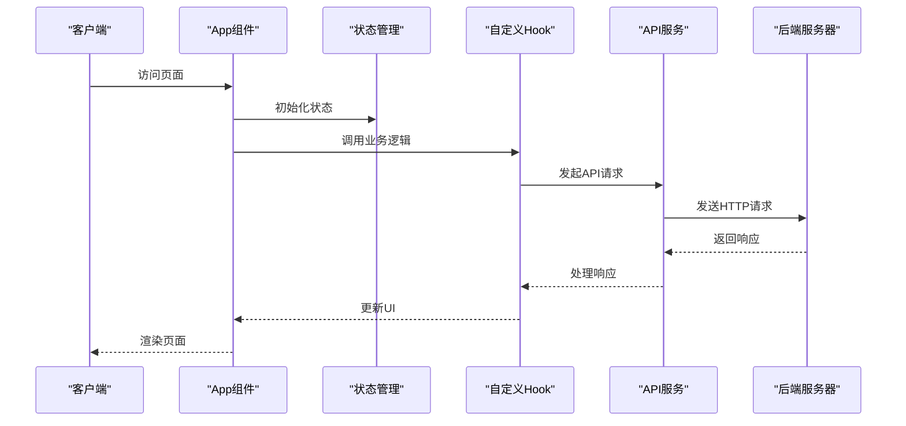
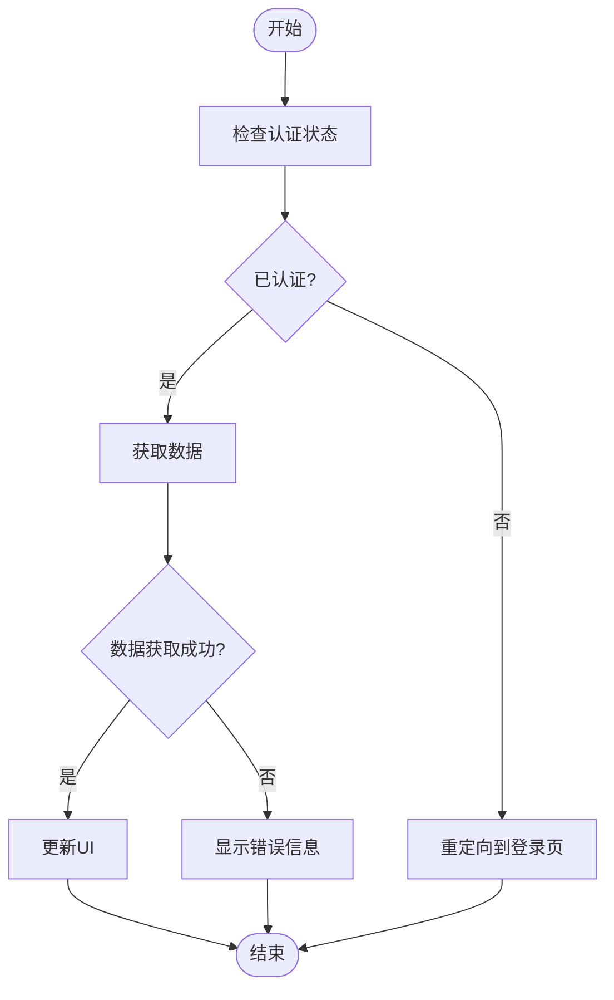
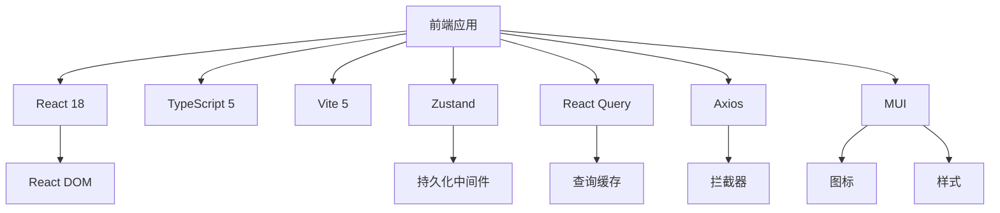

# 前端架构设计

<cite>
**本文档中引用的文件**  
- [package.json](file://web/package.json)
- [vite.config.ts](file://web/vite.config.ts)
- [main.tsx](file://web/src/main.tsx)
- [App.tsx](file://web/src/App.tsx)
- [authStore.ts](file://web/src/stores/authStore.ts)
- [metricsStore.ts](file://web/src/stores/metricsStore.ts)
- [useAuth.ts](file://web/src/hooks/useAuth.ts)
- [useMetrics.ts](file://web/src/hooks/useMetrics.ts)
- [interceptors.ts](file://web/src/api/interceptors.ts)
- [ProtectedRoute.tsx](file://web/src/router/ProtectedRoute.tsx)
- [Dashboard/index.tsx](file://web/src/pages/Dashboard/index.tsx)
- [MainLayout.tsx](file://web/src/components/Layout/MainLayout.tsx)
</cite>

## 目录
1. [引言](#引言)
2. [项目结构](#项目结构)
3. [核心组件](#核心组件)
4. [架构概览](#架构概览)
5. [详细组件分析](#详细组件分析)
6. [依赖分析](#依赖分析)
7. [性能考虑](#性能考虑)
8. [故障排除指南](#故障排除指南)
9. [结论](#结论)

## 引言
本文档详细阐述了基于React 18 + TypeScript 5 + Vite 5的前端架构设计。文档说明了分层架构设计：展示层（Pages）、组件层（Layout/Business/Common）、业务逻辑层（Hooks/Stores）和数据层（API Services）的职责划分与协作机制。同时解释了为何选择Zustand而非Redux进行状态管理，以及React Query在服务端状态同步中的作用。此外，还描述了Vite构建优化策略，包括代码分割、懒加载和Tree Shaking配置。

## 项目结构
本项目采用模块化组织方式，清晰地划分了不同功能区域。主要目录包括`api`、`components`、`hooks`、`pages`、`router`、`stores`、`theme`、`types`和`utils`等。

**图示来源**
- [web/package.json](file://web/package.json)
- [web/vite.config.ts](file://web/vite.config.ts)

**章节来源**
- [web/package.json](file://web/package.json)
- [web/vite.config.ts](file://web/vite.config.ts)

## 核心组件
核心组件包括`App.tsx`作为主应用组件，`main.tsx`作为入口文件，`stores`用于状态管理，`hooks`用于封装业务逻辑，`api`用于处理API请求，`pages`用于展示页面内容，`components`用于构建UI组件。

**章节来源**
- [web/src/main.tsx](file://web/src/main.tsx)
- [web/src/App.tsx](file://web/src/App.tsx)

## 架构概览
系统架构采用分层设计，各层之间职责明确，协作紧密。展示层负责UI渲染，组件层提供可复用的UI元素，业务逻辑层处理应用逻辑，数据层负责与后端API交互。

**图示来源**
- [web/src/App.tsx](file://web/src/App.tsx)
- [web/src/stores/index.ts](file://web/src/stores/index.ts)
- [web/src/hooks/index.ts](file://web/src/hooks/index.ts)

## 详细组件分析
### 组件A分析
#### 对象导向组件

**图示来源**
- [web/src/stores/authStore.ts](file://web/src/stores/authStore.ts)
- [web/src/stores/metricsStore.ts](file://web/src/stores/metricsStore.ts)
- [web/src/hooks/useAuth.ts](file://web/src/hooks/useAuth.ts)
- [web/src/hooks/useMetrics.ts](file://web/src/hooks/useMetrics.ts)

#### API/服务组件

**图示来源**
- [web/src/App.tsx](file://web/src/App.tsx)
- [web/src/hooks/useAuth.ts](file://web/src/hooks/useAuth.ts)
- [web/src/api/interceptors.ts](file://web/src/api/interceptors.ts)

#### 复杂逻辑组件

**图示来源**
- [web/src/router/ProtectedRoute.tsx](file://web/src/router/ProtectedRoute.tsx)
- [web/src/hooks/useMetrics.ts](file://web/src/hooks/useMetrics.ts)

**章节来源**
- [web/src/stores/authStore.ts](file://web/src/stores/authStore.ts)
- [web/src/stores/metricsStore.ts](file://web/src/stores/metricsStore.ts)
- [web/src/hooks/useAuth.ts](file://web/src/hooks/useAuth.ts)
- [web/src/hooks/useMetrics.ts](file://web/src/hooks/useMetrics.ts)

## 依赖分析
项目依赖关系清晰，主要依赖包括React、TypeScript、Vite、Zustand、React Query、Axios、MUI等。通过Vite的Tree Shaking和代码分割功能，有效减少了打包体积。

**图示来源**
- [web/package.json](file://web/package.json)
- [web/vite.config.ts](file://web/vite.config.ts)

**章节来源**
- [web/package.json](file://web/package.json)
- [web/vite.config.ts](file://web/vite.config.ts)

## 性能考虑
### 技术选型决策
选择React 18 + TypeScript 5 + Vite 5的技术栈，主要基于以下几点考虑：
- React 18提供了并发渲染能力，提升了应用性能。
- TypeScript 5增强了类型检查，提高了代码质量。
- Vite 5利用ES模块原生支持，实现了快速的开发服务器启动和热更新。

### 状态管理选择
选择Zustand而非Redux的原因：
- Zustand更轻量，API更简洁。
- 不需要复杂的中间件配置。
- 支持持久化存储，易于集成。
- 更好的TypeScript支持。

### 服务端状态同步
React Query在服务端状态同步中发挥重要作用：
- 自动管理数据缓存和失效。
- 提供开箱即用的加载和错误状态。
- 支持数据预取和后台同步。
- 简化了数据获取和更新的逻辑。

### 构建优化策略
Vite构建优化策略包括：
- 代码分割：将不同依赖打包到不同chunk中。
- 懒加载：按需加载页面和组件。
- Tree Shaking：移除未使用的代码。
- 预构建：预构建大型依赖以提高开发服务器性能。

**章节来源**
- [web/package.json](file://web/package.json)
- [web/vite.config.ts](file://web/vite.config.ts)
- [web/src/stores/authStore.ts](file://web/src/stores/authStore.ts)
- [web/src/hooks/useMetrics.ts](file://web/src/hooks/useMetrics.ts)

## 故障排除指南
### 常见问题
1. **网络连接失败**：检查Manager服务是否已启动，API地址配置是否正确，防火墙或网络设置。
2. **认证失败**：检查Token是否过期，用户凭证是否正确。
3. **数据加载失败**：检查后端服务是否正常运行，API接口是否可用。

### 调试工具
- 使用浏览器开发者工具查看网络请求和响应。
- 查看控制台日志获取错误信息。
- 使用React DevTools检查组件状态。

**章节来源**
- [web/src/api/interceptors.ts](file://web/src/api/interceptors.ts)
- [web/src/router/ProtectedRoute.tsx](file://web/src/router/ProtectedRoute.tsx)

## 结论
本文档全面介绍了基于React 18 + TypeScript 5 + Vite 5的前端架构设计。通过分层架构设计，实现了职责清晰、协作紧密的系统结构。选择Zustand和React Query分别解决了客户端状态管理和服务端状态同步的问题。Vite的构建优化策略有效提升了应用性能。为新开发者提供了清晰的代码导航指南，有助于快速上手和维护项目。