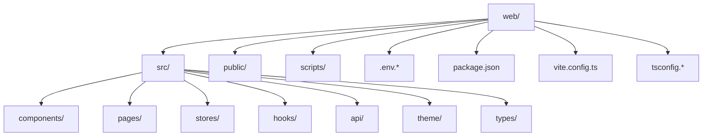
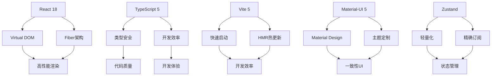
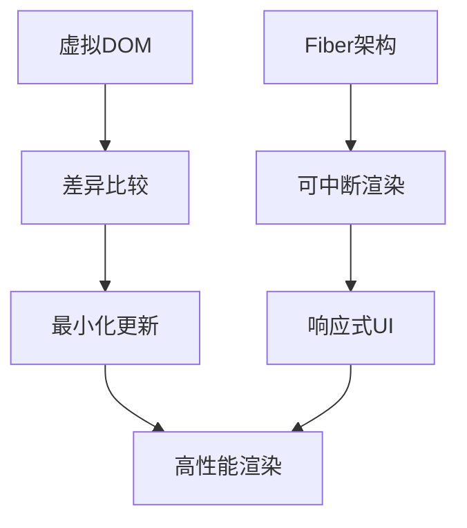
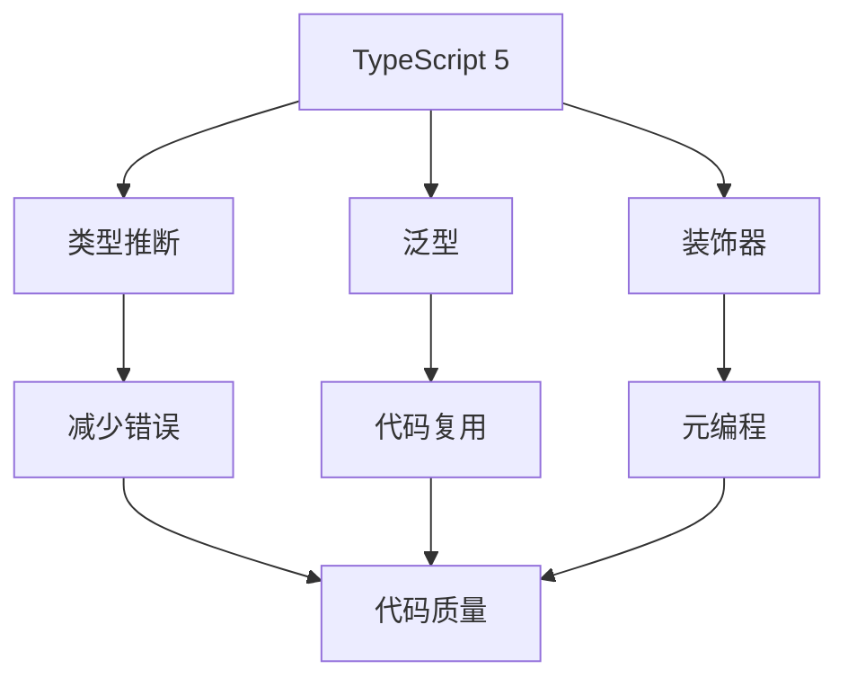
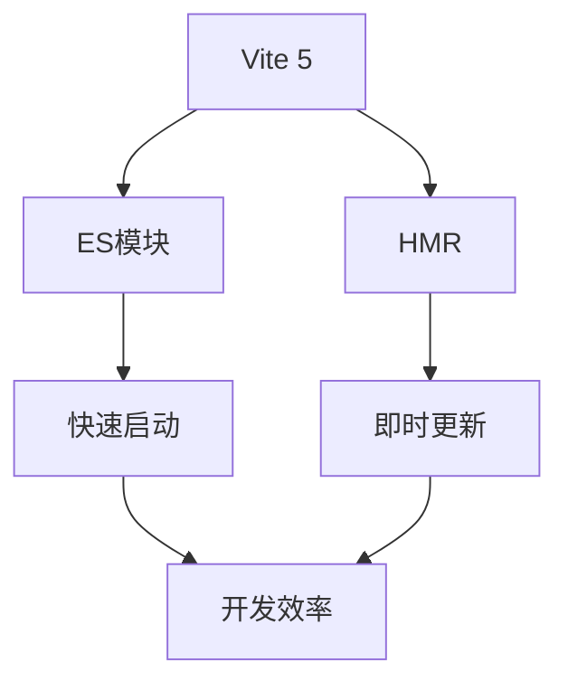
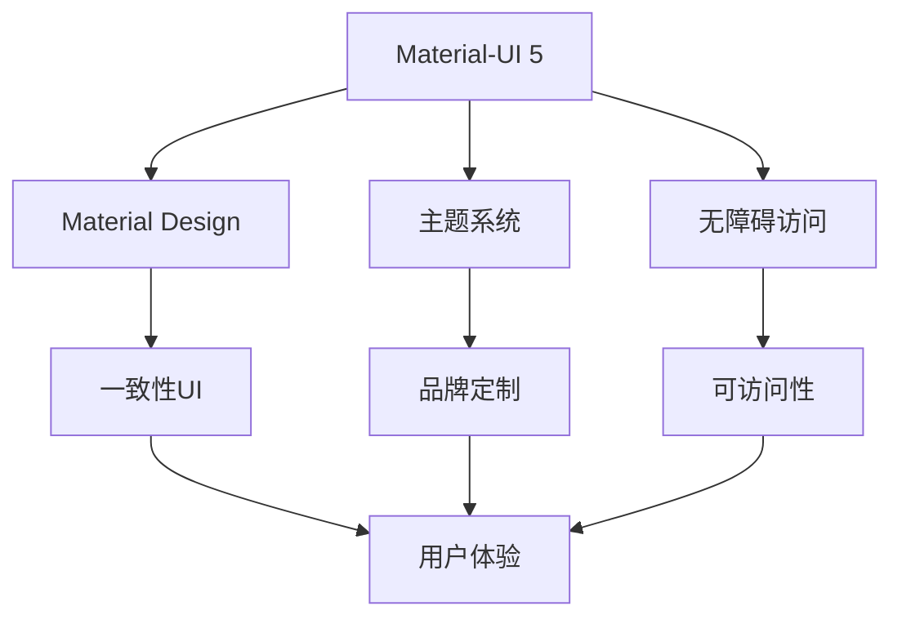
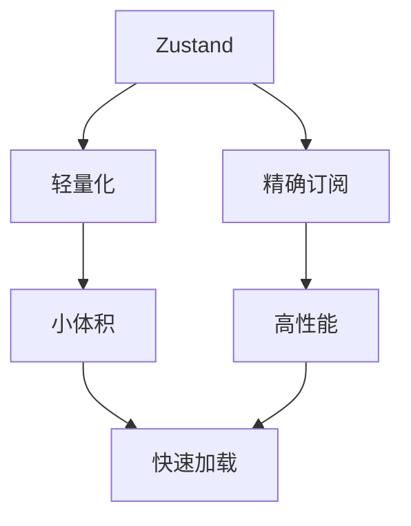
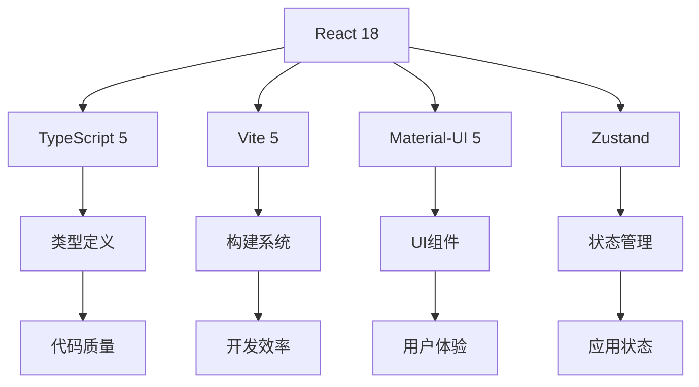

# 技术栈选型

<cite>
**本文档引用的文件**
- [package.json](file://web/package.json)
- [vite.config.ts](file://web/vite.config.ts)
- [tsconfig.json](file://web/tsconfig.json)
- [main.tsx](file://web/src/main.tsx)
- [App.tsx](file://web/src/App.tsx)
- [index.ts](file://web/src/theme/index.ts)
- [authStore.ts](file://web/src/stores/authStore.ts)
- [metricsStore.ts](file://web/src/stores/metricsStore.ts)
- [useAuth.ts](file://web/src/hooks/useAuth.ts)
- [useMetrics.ts](file://web/src/hooks/useMetrics.ts)
- [Dashboard/index.tsx](file://web/src/pages/Dashboard/index.tsx)
- [ProtectedRoute.tsx](file://web/src/router/ProtectedRoute.tsx)
- [MainLayout.tsx](file://web/src/components/Layout/MainLayout.tsx)
- [client.ts](file://web/src/api/client.ts)
- [index.ts](file://web/src/types/index.ts)
</cite>

## 目录
1. [引言](#引言)
2. [项目结构](#项目结构)
3. [核心组件](#核心组件)
4. [架构概述](#架构概述)
5. [详细组件分析](#详细组件分析)
6. [依赖分析](#依赖分析)
7. [性能考量](#性能考量)
8. [故障排除指南](#故障排除指南)
9. [结论](#结论)

## 引言
Ops Scaffold Framework前端模块采用现代化技术栈构建，旨在提供高性能、高可维护性的运维管理界面。本技术文档详细阐述了React 18、TypeScript 5、Vite 5、Material-UI 5和Zustand等核心技术的选型决策，分析其在项目中的协同效应和架构稳定性。

## 项目结构
前端模块位于`web/`目录下，采用标准的React项目结构，包含源代码、配置文件、测试和文档等完整组件。

**Diagram sources**
- [package.json](file://web/package.json)
- [vite.config.ts](file://web/vite.config.ts)

**Section sources**
- [package.json](file://web/package.json)
- [vite.config.ts](file://web/vite.config.ts)

## 核心组件
前端模块的核心组件包括基于React 18的UI组件、TypeScript 5类型系统、Vite 5构建工具、Material-UI 5组件库和Zustand状态管理。

**Section sources**
- [package.json](file://web/package.json)
- [main.tsx](file://web/src/main.tsx)

## 架构概述
Ops Scaffold Framework前端采用现代化的React架构，结合TypeScript类型安全、Vite快速构建、Material-UI设计系统和Zustand轻量状态管理。

**Diagram sources**
- [package.json](file://web/package.json)
- [App.tsx](file://web/src/App.tsx)

## 详细组件分析
### React 18 核心框架
React 18作为核心框架，其虚拟DOM和Fiber架构为前端性能提供了坚实基础。

#### 虚拟DOM与Fiber架构优势
React 18的虚拟DOM通过最小化DOM操作来提升性能，Fiber架构则实现了可中断的渲染过程，提高了应用的响应性。

**Diagram sources**
- [main.tsx](file://web/src/main.tsx)
- [App.tsx](file://web/src/App.tsx)

**Section sources**
- [main.tsx](file://web/src/main.tsx)
- [App.tsx](file://web/src/App.tsx)

### TypeScript 5 类型系统
TypeScript 5在类型安全和开发效率方面提供了显著提升。

#### 类型安全与开发效率
TypeScript 5的高级类型特性确保了代码的类型安全，同时提供了优秀的开发工具支持。

**Diagram sources**
- [tsconfig.json](file://web/tsconfig.json)
- [index.ts](file://web/src/types/index.ts)

**Section sources**
- [tsconfig.json](file://web/tsconfig.json)
- [index.ts](file://web/src/types/index.ts)

### Vite 5 构建工具
Vite 5作为构建工具，在开发服务器启动速度和HMR热更新方面表现出色。

#### 开发服务器与热更新
Vite 5利用ES模块原生支持，实现了极快的启动速度和高效的热更新机制。

**Diagram sources**
- [vite.config.ts](file://web/vite.config.ts)
- [package.json](file://web/package.json)

**Section sources**
- [vite.config.ts](file://web/vite.config.ts)
- [package.json](file://web/package.json)

### Material-UI 5 组件库
Material-UI 5组件库在实现Material Design设计语言、主题定制和无障碍访问方面具有优势。

#### 设计语言与主题定制
Material-UI 5完整实现了Material Design规范，并提供了强大的主题定制能力。

**Diagram sources**
- [index.ts](file://web/src/theme/index.ts)
- [App.tsx](file://web/src/App.tsx)

**Section sources**
- [index.ts](file://web/src/theme/index.ts)
- [App.tsx](file://web/src/App.tsx)

### Zustand 状态管理
Zustand状态管理库相比Redux具有轻量化和精确订阅特性。

#### 轻量化与精确订阅
Zustand采用极简API设计，避免了Redux的样板代码，同时支持精确的状态订阅。

**Diagram sources**
- [authStore.ts](file://web/src/stores/authStore.ts)
- [metricsStore.ts](file://web/src/stores/metricsStore.ts)

**Section sources**
- [authStore.ts](file://web/src/stores/authStore.ts)
- [metricsStore.ts](file://web/src/stores/metricsStore.ts)

## 依赖分析
前端模块的依赖关系清晰，各技术栈之间协同良好。

**Diagram sources**
- [package.json](file://web/package.json)
- [tsconfig.json](file://web/tsconfig.json)

**Section sources**
- [package.json](file://web/package.json)
- [tsconfig.json](file://web/tsconfig.json)

## 性能考量
技术栈选型充分考虑了性能因素，确保应用的高效运行。

**Section sources**
- [vite.config.ts](file://web/vite.config.ts)
- [App.tsx](file://web/src/App.tsx)

## 故障排除指南
当遇到技术栈相关问题时，可参考以下排查步骤。

**Section sources**
- [client.ts](file://web/src/api/client.ts)
- [useAuth.ts](file://web/src/hooks/useAuth.ts)

## 结论
Ops Scaffold Framework前端模块的技术栈选型经过精心设计，React 18、TypeScript 5、Vite 5、Material-UI 5和Zustand的组合提供了高性能、高可维护性和优秀开发体验的完整解决方案。各技术栈之间协同效应显著，共同构建了稳定可靠的前端架构。