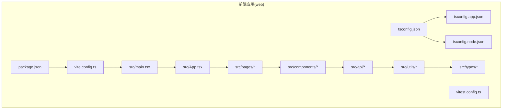
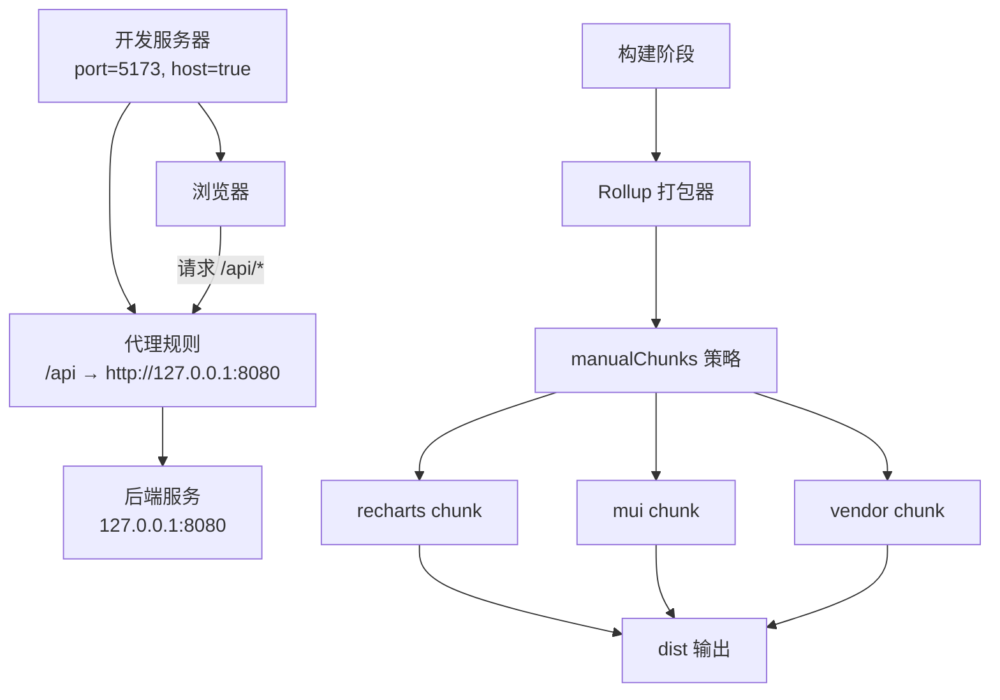
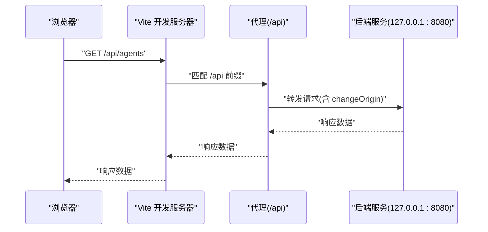
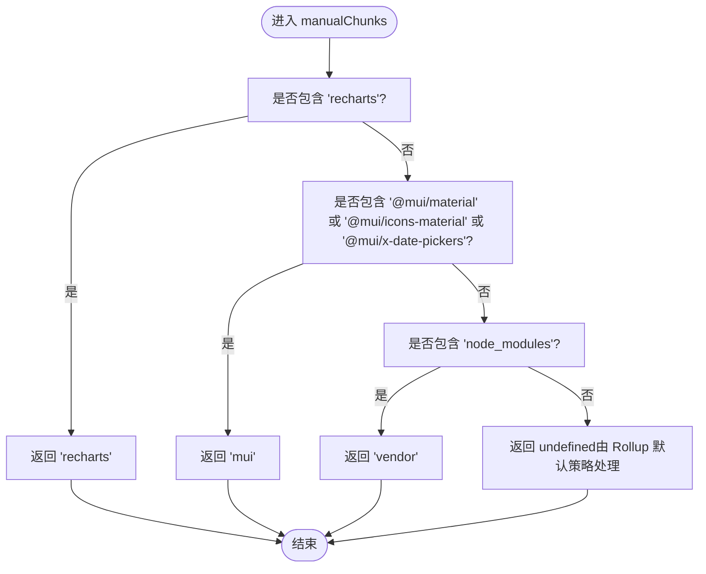
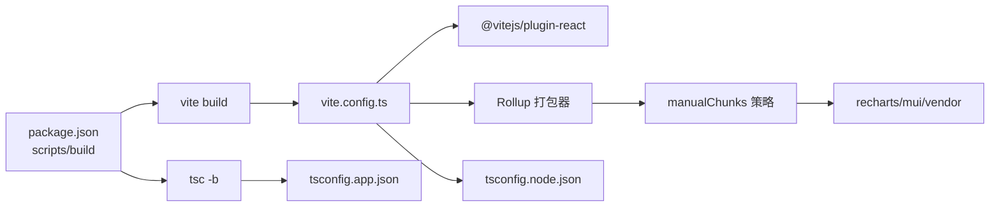

# 构建与性能优化

<cite>
**本文引用的文件**
- [vite.config.ts](file://web/vite.config.ts)
- [tsconfig.json](file://web/tsconfig.json)
- [tsconfig.app.json](file://web/tsconfig.app.json)
- [tsconfig.node.json](file://web/tsconfig.node.json)
- [package.json](file://web/package.json)
- [App.tsx](file://web/src/App.tsx)
- [MetricsChart.tsx](file://web/src/components/Metrics/MetricsChart.tsx)
- [index.ts](file://web/src/components/Metrics/index.ts)
- [TimeRangeSelector.tsx](file://web/src/components/Metrics/TimeRangeSelector.tsx)
- [index.ts](file://web/src/components/Layout/MainLayout.tsx)
- [index.ts](file://web/src/pages/Dashboard/index.tsx)
- [index.ts](file://web/src/pages/Nodes/List.tsx)
- [index.ts](file://web/src/pages/Nodes/Detail.tsx)
- [index.ts](file://web/src/router/ProtectedRoute.tsx)
- [index.ts](file://web/src/stores/index.ts)
- [index.ts](file://web/src/stores/metricsStore.ts)
- [index.ts](file://web/src/hooks/index.ts)
- [useMetrics.ts](file://web/src/hooks/useMetrics.ts)
- [useNodes.ts](file://web/src/hooks/useNodes.ts)
- [useAgentMetrics.ts](file://web/src/hooks/useAgentMetrics.ts)
- [useAuth.ts](file://web/src/hooks/useAuth.ts)
- [client.ts](file://web/src/api/client.ts)
- [interceptors.ts](file://web/src/api/interceptors.ts)
- [agents.ts](file://web/src/api/agents.ts)
- [metrics.ts](file://web/src/api/metrics.ts)
- [nodes.ts](file://web/src/api/nodes.ts)
- [index.ts](file://web/src/utils/index.ts)
- [format.ts](file://web/src/utils/format.ts)
- [metricsFormat.ts](file://web/src/utils/metricsFormat.ts)
- [storage.ts](file://web/src/utils/storage.ts)
- [index.ts](file://web/src/types/index.ts)
- [agent.ts](file://web/src/types/agent.ts)
- [node.ts](file://web/src/types/node.ts)
- [metrics.ts](file://web/src/types/metrics.ts)
- [user.ts](file://web/src/types/user.ts)
- [api.ts](file://web/src/types/api.ts)
- [index.ts](file://web/src/test/setup.ts)
- [testUtils.tsx](file://web/src/test/testUtils.tsx)
- [vitest.config.ts](file://web/vitest.config.ts)
- [index.html](file://web/index.html)
- [main.tsx](file://web/src/main.tsx)
- [App.css](file://web/src/App.css)
- [index.css](file://web/src/index.css)
- [.env.development](file://web/.env.development)
- [.env.production](file://web/.env.production)
</cite>

## 目录
1. [简介](#简介)
2. [项目结构](#项目结构)
3. [核心组件](#核心组件)
4. [架构总览](#架构总览)
5. [详细组件分析](#详细组件分析)
6. [依赖关系分析](#依赖关系分析)
7. [性能考量](#性能考量)
8. [故障排查指南](#故障排查指南)
9. [结论](#结论)
10. [附录](#附录)

## 简介
本文件围绕基于 Vite 的前端工程，系统梳理构建优化与性能调优策略，重点解析以下方面：
- 开发服务器配置：端口、host 绑定与 API 代理规则（/api → http://127.0.0.1:8080）
- Rollup 打包配置中的 manualChunks 策略：将 recharts、MUI 组件库与 node_modules 依赖拆分为独立 chunk（recharts、mui、vendor），以提升首屏加载与缓存复用效率
- tsconfig.json 通过引用 tsconfig.app.json 与 tsconfig.node.json 实现“应用侧”和“Vite 配置侧”的构建环境分离，从而优化开发体验与构建性能

## 项目结构
前端工程位于 web 目录，采用 Vite + React 技术栈，TypeScript 类型检查通过 tsconfig 引用机制分层配置。关键配置文件如下：
- 构建与开发服务器：vite.config.ts
- 类型检查分层：tsconfig.json 引用 tsconfig.app.json 与 tsconfig.node.json
- 应用入口与页面：src/main.tsx、src/App.tsx、src/pages/*、src/components/*
- API 客户端与拦截器：src/api/*
- 工具与类型：src/utils/*、src/types/*
- 测试配置：vitest.config.ts、src/test/*

图示来源
- [vite.config.ts](file://web/vite.config.ts#L1-L38)
- [tsconfig.json](file://web/tsconfig.json#L1-L8)
- [tsconfig.app.json](file://web/tsconfig.app.json#L1-L29)
- [tsconfig.node.json](file://web/tsconfig.node.json#L1-L27)
- [package.json](file://web/package.json#L1-L57)
- [main.tsx](file://web/src/main.tsx)
- [App.tsx](file://web/src/App.tsx#L1-L57)
- [vitest.config.ts](file://web/vitest.config.ts)

章节来源
- [vite.config.ts](file://web/vite.config.ts#L1-L38)
- [tsconfig.json](file://web/tsconfig.json#L1-L8)
- [tsconfig.app.json](file://web/tsconfig.app.json#L1-L29)
- [tsconfig.node.json](file://web/tsconfig.node.json#L1-L27)
- [package.json](file://web/package.json#L1-L57)

## 核心组件
本节聚焦于构建与性能优化相关的核心配置与实现要点。

- 开发服务器配置
  - 端口：默认 5173
  - host：允许外部访问
  - API 代理：将 /api 请求转发至 http://127.0.0.1:8080，并启用跨域源变更
  - 参考路径：[开发服务器配置](file://web/vite.config.ts#L7-L16)

- Rollup 手动分包（manualChunks）
  - 将 recharts 单独拆分为 recharts chunk
  - 将 MUI 相关库（@mui/material、@mui/icons-material、@mui/x-date-pickers）单独拆分为 mui chunk
  - 将 node_modules 中的其余依赖拆分为 vendor chunk
  - 参考路径：[manualChunks 策略](file://web/vite.config.ts#L17-L36)

- TypeScript 构建环境分离
  - tsconfig.json 通过 references 引入 tsconfig.app.json 与 tsconfig.node.json
  - tsconfig.app.json 面向浏览器应用侧，包含严格类型检查与 bundler 模式
  - tsconfig.node.json 面向 Vite 配置侧，仅包含 vite.config.ts
  - 参考路径：[tsconfig.json 引用](file://web/tsconfig.json#L1-L8)、[tsconfig.app.json](file://web/tsconfig.app.json#L1-L29)、[tsconfig.node.json](file://web/tsconfig.node.json#L1-L27)

- 依赖与插件
  - 使用 @vitejs/plugin-react 提升 React 开发体验
  - 依赖中包含 recharts、@mui/material、@mui/icons-material、@mui/x-date-pickers 等
  - 参考路径：[package.json 依赖](file://web/package.json#L15-L34)

章节来源
- [vite.config.ts](file://web/vite.config.ts#L1-L38)
- [tsconfig.json](file://web/tsconfig.json#L1-L8)
- [tsconfig.app.json](file://web/tsconfig.app.json#L1-L29)
- [tsconfig.node.json](file://web/tsconfig.node.json#L1-L27)
- [package.json](file://web/package.json#L15-L34)

## 架构总览
下图展示开发服务器、代理与打包阶段的关键交互，以及 manualChunks 对产物的影响。

图示来源
- [vite.config.ts](file://web/vite.config.ts#L7-L36)
- [package.json](file://web/package.json#L15-L34)

## 详细组件分析

### 开发服务器与 API 代理
- 端口与 host
  - 默认端口 5173，host 设置为 true，便于局域网设备访问本地开发服务
  - 参考路径：[端口与 host](file://web/vite.config.ts#L7-L10)

- API 代理规则
  - 将 /api 前缀的请求代理到 http://127.0.0.1:8080，并开启 changeOrigin
  - 该规则可避免前端开发时的跨域问题，统一后端接口地址
  - 参考路径：[代理规则](file://web/vite.config.ts#L10-L15)

- 代理生效流程（序列图）

图示来源
- [vite.config.ts](file://web/vite.config.ts#L7-L16)

章节来源
- [vite.config.ts](file://web/vite.config.ts#L7-L16)

### Rollup 手动分包策略（manualChunks）
- 目标
  - 将大型第三方库（如 recharts）独立打包，降低主包体积，提升缓存命中率
  - 将 MUI 生态（@mui/material、@mui/icons-material、@mui/x-date-pickers）独立打包，便于按需更新与缓存复用
  - 将 node_modules 中的通用依赖统一打包为 vendor，减少重复依赖带来的体积膨胀

- 策略细节
  - recharts：命中包含 recharts 的模块 id，返回 'recharts'
  - MUI：命中包含 @mui/material、@mui/icons-material、@mui/x-date-pickers 的模块 id，返回 'mui'
  - vendor：命中包含 node_modules 的模块 id，返回 'vendor'
  - 参考路径：[manualChunks 实现](file://web/vite.config.ts#L17-L36)

- 分包算法流程（流程图）

图示来源
- [vite.config.ts](file://web/vite.config.ts#L17-L36)

- 对首屏加载与缓存的影响
  - 首屏加载：将 recharts、MUI 等大体量库拆分为独立 chunk，避免与业务代码同包，缩短首屏 JS 下载与解析时间
  - 缓存利用率：MUI 与 recharts 更新频率相对较低，独立 chunk 可长期缓存，提升后续访问性能
  - vendor：将通用依赖集中打包，减少重复依赖导致的体积膨胀，提升缓存命中率

章节来源
- [vite.config.ts](file://web/vite.config.ts#L17-L36)

### TypeScript 构建环境分离（tsconfig 引用）
- 目的
  - 将“应用侧”（浏览器运行时）与“Vite 配置侧”（Node 环境）的编译目标与模块解析策略解耦
  - 提升类型检查效率与准确性，避免 Vite 配置对应用侧类型检查造成干扰

- 结构与职责
  - tsconfig.json：通过 references 引入 tsconfig.app.json 与 tsconfig.node.json
  - tsconfig.app.json：面向浏览器应用侧，启用 bundler 模式、严格类型检查等
  - tsconfig.node.json：仅包含 vite.config.ts，确保 Vite 配置在 Node 环境下的正确编译
  - 参考路径：[tsconfig.json 引用](file://web/tsconfig.json#L1-L8)、[tsconfig.app.json](file://web/tsconfig.app.json#L1-L29)、[tsconfig.node.json](file://web/tsconfig.node.json#L1-L27)

- 分离带来的收益
  - 开发体验：Vite 配置与应用代码类型检查互不干扰，IDE 类型提示更准确
  - 构建性能：分层编译减少不必要的类型扫描，缩短增量编译时间
  - 可维护性：明确区分两类编译目标，降低配置复杂度

章节来源
- [tsconfig.json](file://web/tsconfig.json#L1-L8)
- [tsconfig.app.json](file://web/tsconfig.app.json#L1-L29)
- [tsconfig.node.json](file://web/tsconfig.node.json#L1-L27)

### 依赖与插件
- 插件
  - @vitejs/plugin-react：提供 React 快速刷新与 JSX 转换支持
  - 参考路径：[插件注册](file://web/vite.config.ts#L6-L6)

- 关键依赖
  - recharts：用于图表渲染
  - @mui/material、@mui/icons-material、@mui/x-date-pickers：用于 UI 组件与日期选择器
  - 参考路径：[依赖声明](file://web/package.json#L15-L34)

- 在应用中的使用示例
  - App.tsx：引入 ThemeProvider、CssBaseline、QueryClientProvider
  - MetricsChart.tsx：使用 recharts 的 AreaChart、ResponsiveContainer 等组件
  - TimeRangeSelector.tsx：使用 @mui/x-date-pickers 的 LocalizationProvider、DateTimePicker
  - 参考路径：[App.tsx](file://web/src/App.tsx#L1-L57)、[MetricsChart.tsx](file://web/src/components/Metrics/MetricsChart.tsx#L1-L178)、[TimeRangeSelector.tsx](file://web/src/components/Metrics/TimeRangeSelector.tsx#L1-L49)

章节来源
- [vite.config.ts](file://web/vite.config.ts#L6-L6)
- [package.json](file://web/package.json#L15-L34)
- [App.tsx](file://web/src/App.tsx#L1-L57)
- [MetricsChart.tsx](file://web/src/components/Metrics/MetricsChart.tsx#L1-L178)
- [TimeRangeSelector.tsx](file://web/src/components/Metrics/TimeRangeSelector.tsx#L1-L49)

## 依赖关系分析
- 构建链路
  - package.json 中的 build 脚本先执行 tsc -b（TypeScript 构建），再执行 vite build
  - 参考路径：[build 脚本](file://web/package.json#L7-L9)

- 配置依赖
  - vite.config.ts 依赖 @vitejs/plugin-react
  - tsconfig.json 依赖 tsconfig.app.json 与 tsconfig.node.json
  - 参考路径：[vite.config.ts 插件导入](file://web/vite.config.ts#L1-L3)、[tsconfig.json 引用](file://web/tsconfig.json#L1-L8)

- 运行时依赖
  - recharts、@mui/*、react、react-router-dom 等在应用侧被广泛使用
  - 参考路径：[package.json 依赖](file://web/package.json#L15-L34)

图示来源
- [package.json](file://web/package.json#L7-L9)
- [vite.config.ts](file://web/vite.config.ts#L1-L38)
- [tsconfig.app.json](file://web/tsconfig.app.json#L1-L29)
- [tsconfig.node.json](file://web/tsconfig.node.json#L1-L27)

章节来源
- [package.json](file://web/package.json#L7-L9)
- [vite.config.ts](file://web/vite.config.ts#L1-L38)
- [tsconfig.app.json](file://web/tsconfig.app.json#L1-L29)
- [tsconfig.node.json](file://web/tsconfig.node.json#L1-L27)

## 性能考量
- 首屏加载优化
  - manualChunks 将 recharts、MUI 等大体量库拆分为独立 chunk，避免与业务代码同包，缩短首屏 JS 下载与解析时间
  - 参考路径：[manualChunks 策略](file://web/vite.config.ts#L17-L36)

- 缓存利用率提升
  - MUI 与 recharts 更新频率低，独立 chunk 可长期缓存，显著提升后续访问性能
  - vendor 将通用依赖集中打包，减少重复依赖导致的体积膨胀
  - 参考路径：[manualChunks 策略](file://web/vite.config.ts#L17-L36)

- 开发体验与构建性能
  - tsconfig 引用将“应用侧”与“Vite 配置侧”分离，避免类型检查相互干扰，提升 IDE 响应与增量编译速度
  - 参考路径：[tsconfig.json 引用](file://web/tsconfig.json#L1-L8)、[tsconfig.app.json](file://web/tsconfig.app.json#L1-L29)、[tsconfig.node.json](file://web/tsconfig.node.json#L1-L27)

- 代理与网络
  - /api 代理简化了开发期跨域问题，统一后端接口地址，减少网络往返与 CORS 处理开销
  - 参考路径：[代理规则](file://web/vite.config.ts#L10-L15)

[本节为通用性能讨论，无需列出具体文件来源]

## 故障排查指南
- 代理无效或 404
  - 确认请求路径是否以 /api 开头
  - 确认后端服务是否在 http://127.0.0.1:8080 正常运行
  - 参考路径：[代理规则](file://web/vite.config.ts#L10-L15)

- 手动分包未生效
  - 确认模块 id 是否包含 recharts、@mui/material、@mui/icons-material、@mui/x-date-pickers 或 node_modules
  - 清理缓存后重新构建，确认 dist 输出目录中是否存在 recharts、mui、vendor 对应 chunk
  - 参考路径：[manualChunks 策略](file://web/vite.config.ts#L17-L36)

- 类型检查异常
  - 确认 tsconfig.json 的 references 是否正确指向 tsconfig.app.json 与 tsconfig.node.json
  - 确认 tsconfig.app.json 的 moduleResolution、bundler 模式与 strict 选项符合预期
  - 参考路径：[tsconfig.json 引用](file://web/tsconfig.json#L1-L8)、[tsconfig.app.json](file://web/tsconfig.app.json#L1-L29)、[tsconfig.node.json](file://web/tsconfig.node.json#L1-L27)

- 构建失败或耗时过长
  - 检查 package.json 中的 build 脚本顺序（先 tsc -b 再 vite build）
  - 确保依赖安装完整且版本兼容
  - 参考路径：[build 脚本](file://web/package.json#L7-L9)

章节来源
- [vite.config.ts](file://web/vite.config.ts#L10-L36)
- [tsconfig.json](file://web/tsconfig.json#L1-L8)
- [tsconfig.app.json](file://web/tsconfig.app.json#L1-L29)
- [tsconfig.node.json](file://web/tsconfig.node.json#L1-L27)
- [package.json](file://web/package.json#L7-L9)

## 结论
本项目通过以下策略实现了高效的构建与性能优化：
- 开发服务器采用 5173 端口与 host 绑定，并以 /api 代理到后端服务，简化开发期跨域与联调流程
- 通过 manualChunks 将 recharts、MUI 与 vendor 独立打包，有效缩短首屏加载时间并提升缓存复用率
- 通过 tsconfig.json 的引用机制实现“应用侧”与“Vite 配置侧”的构建环境分离，优化开发体验与构建性能

这些措施共同提升了开发效率与用户体验，建议在后续迭代中持续监控分包效果与缓存命中情况，按需调整分包策略。

[本节为总结性内容，无需列出具体文件来源]

## 附录
- 关键文件路径索引
  - 构建与开发服务器：[vite.config.ts](file://web/vite.config.ts#L1-L38)
  - 类型检查分层：[tsconfig.json](file://web/tsconfig.json#L1-L8)、[tsconfig.app.json](file://web/tsconfig.app.json#L1-L29)、[tsconfig.node.json](file://web/tsconfig.node.json#L1-L27)
  - 依赖与插件：[package.json](file://web/package.json#L15-L34)
  - 应用入口与页面：[main.tsx](file://web/src/main.tsx)、[App.tsx](file://web/src/App.tsx#L1-L57)、[pages/*](file://web/src/pages/)
  - 组件与图表：[MetricsChart.tsx](file://web/src/components/Metrics/MetricsChart.tsx#L1-L178)、[TimeRangeSelector.tsx](file://web/src/components/Metrics/TimeRangeSelector.tsx#L1-L49)
  - API 客户端与拦截器：[client.ts](file://web/src/api/client.ts)、[interceptors.ts](file://web/src/api/interceptors.ts)
  - 测试配置：[vitest.config.ts](file://web/vitest.config.ts)

[本节为索引性内容，无需列出具体文件来源]