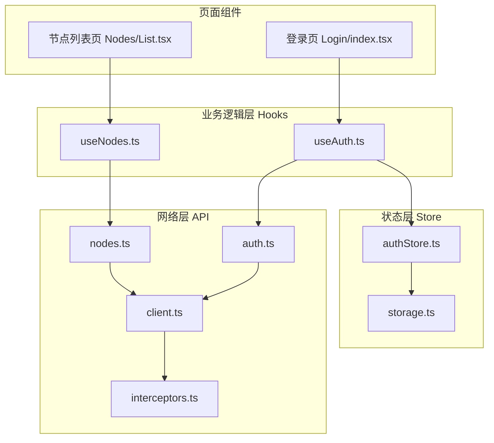
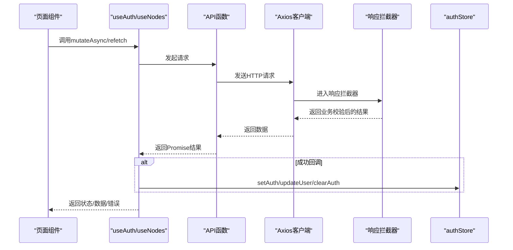
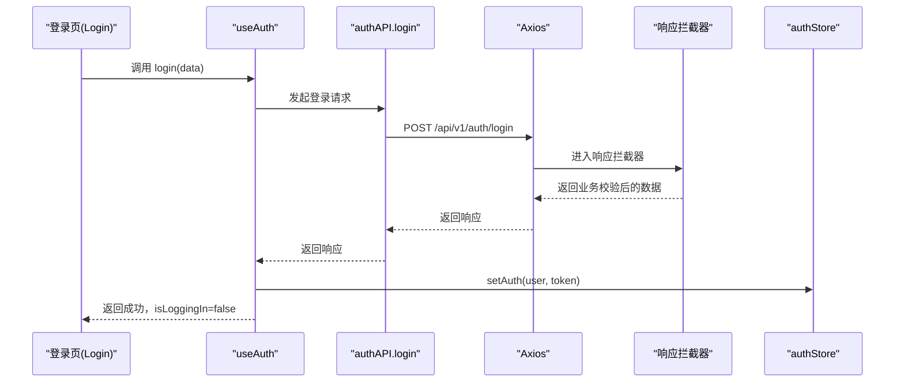
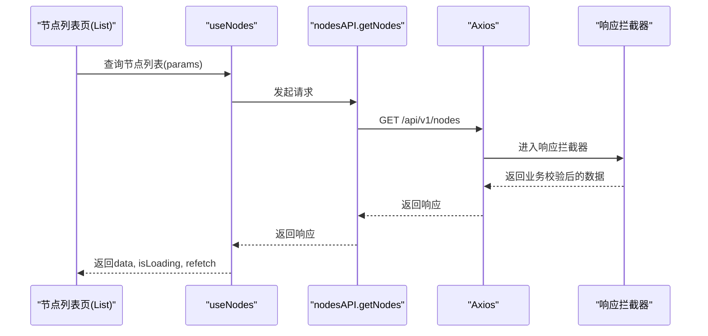
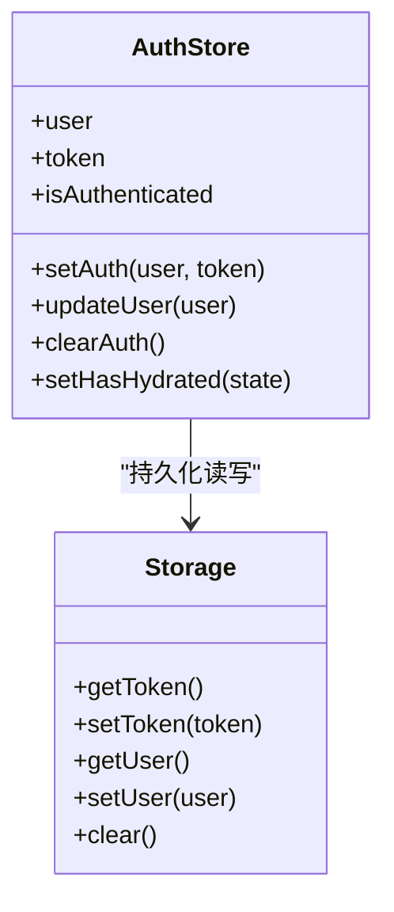
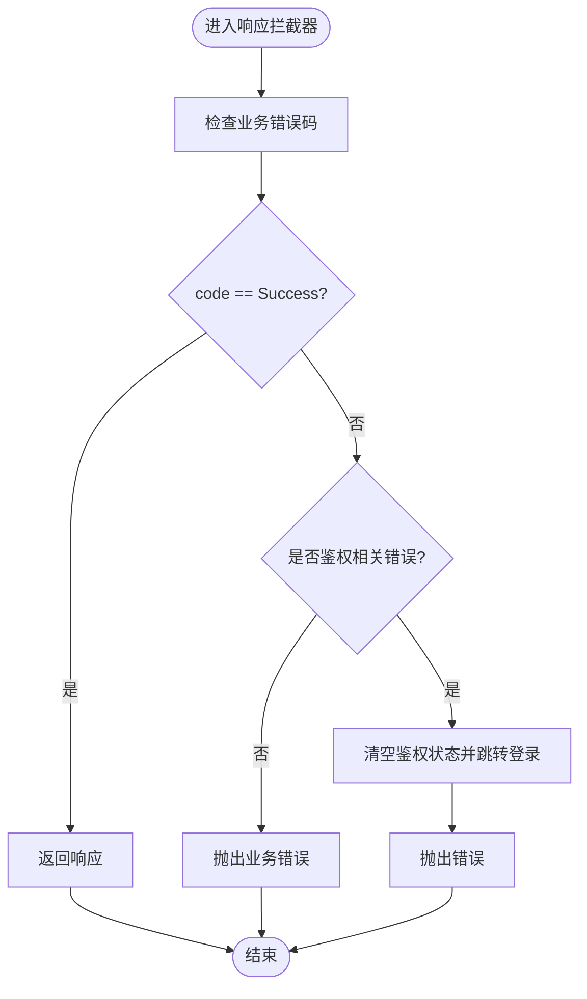
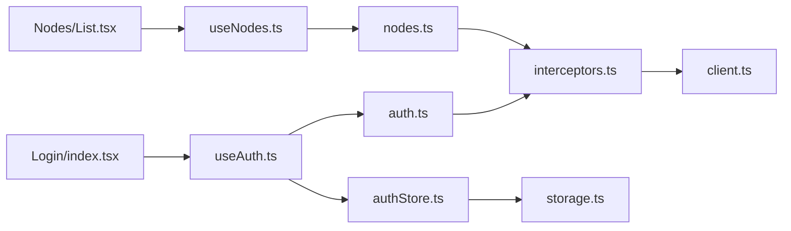

# 业务逻辑封装

<cite>
**本文引用的文件**
- [web/src/hooks/useAuth.ts](file://web/src/hooks/useAuth.ts)
- [web/src/hooks/useNodes.ts](file://web/src/hooks/useNodes.ts)
- [web/src/stores/authStore.ts](file://web/src/stores/authStore.ts)
- [web/src/api/auth.ts](file://web/src/api/auth.ts)
- [web/src/api/nodes.ts](file://web/src/api/nodes.ts)
- [web/src/api/interceptors.ts](file://web/src/api/interceptors.ts)
- [web/src/api/client.ts](file://web/src/api/client.ts)
- [web/src/utils/storage.ts](file://web/src/utils/storage.ts)
- [web/src/types/api.ts](file://web/src/types/api.ts)
- [web/src/pages/Login/index.tsx](file://web/src/pages/Login/index.tsx)
- [web/src/pages/Nodes/List.tsx](file://web/src/pages/Nodes/List.tsx)
</cite>

## 目录
1. [引言](#引言)
2. [项目结构](#项目结构)
3. [核心组件](#核心组件)
4. [架构总览](#架构总览)
5. [详细组件分析](#详细组件分析)
6. [依赖关系分析](#依赖关系分析)
7. [性能考量](#性能考量)
8. [故障排查指南](#故障排查指南)
9. [结论](#结论)

## 引言
本文件围绕前端业务逻辑封装展开，重点阐述自定义Hook如何将复杂业务流程与状态Store解耦整合，形成可复用、可维护的UI层抽象。文档聚焦两个关键Hook：useAuth与useNodes，说明它们如何通过React Query的useMutation/useQuery统一处理API调用、错误、加载与数据更新，并在useAuth中与Zustand状态管理器进行同步，从而实现关注点分离与UI简洁化。

## 项目结构
前端采用分层组织：API层负责HTTP请求与拦截器；Hooks层封装业务逻辑；Store层负责状态持久化与共享；页面组件仅消费Hook返回的状态与方法，不直接操作API或Store。

图表来源
- [web/src/pages/Login/index.tsx](file://web/src/pages/Login/index.tsx#L1-L110)
- [web/src/pages/Nodes/List.tsx](file://web/src/pages/Nodes/List.tsx#L1-L183)
- [web/src/hooks/useAuth.ts](file://web/src/hooks/useAuth.ts#L1-L73)
- [web/src/hooks/useNodes.ts](file://web/src/hooks/useNodes.ts#L1-L58)
- [web/src/stores/authStore.ts](file://web/src/stores/authStore.ts#L1-L85)
- [web/src/utils/storage.ts](file://web/src/utils/storage.ts#L1-L48)
- [web/src/api/interceptors.ts](file://web/src/api/interceptors.ts#L1-L95)
- [web/src/api/client.ts](file://web/src/api/client.ts#L1-L18)
- [web/src/api/auth.ts](file://web/src/api/auth.ts#L1-L43)
- [web/src/api/nodes.ts](file://web/src/api/nodes.ts#L1-L47)

章节来源
- [web/src/hooks/useAuth.ts](file://web/src/hooks/useAuth.ts#L1-L73)
- [web/src/hooks/useNodes.ts](file://web/src/hooks/useNodes.ts#L1-L58)
- [web/src/stores/authStore.ts](file://web/src/stores/authStore.ts#L1-L85)
- [web/src/api/interceptors.ts](file://web/src/api/interceptors.ts#L1-L95)
- [web/src/api/client.ts](file://web/src/api/client.ts#L1-L18)
- [web/src/api/auth.ts](file://web/src/api/auth.ts#L1-L43)
- [web/src/api/nodes.ts](file://web/src/api/nodes.ts#L1-L47)
- [web/src/utils/storage.ts](file://web/src/utils/storage.ts#L1-L48)
- [web/src/pages/Login/index.tsx](file://web/src/pages/Login/index.tsx#L1-L110)
- [web/src/pages/Nodes/List.tsx](file://web/src/pages/Nodes/List.tsx#L1-L183)

## 核心组件
- useAuth Hook：封装登录、注册、修改密码、获取用户资料、登出等认证相关操作，统一暴露加载状态与错误信息，并在成功回调中与authStore进行状态同步。
- useNodes Hook：封装节点列表、详情、统计与删除等查询与变更操作，利用useQuery进行缓存与刷新控制，删除成功后通过queryClient.invalidateQueries触发相关缓存失效。
- authStore：基于Zustand的认证状态容器，支持持久化、水合与鉴权状态计算，提供setAuth、updateUser、clearAuth等动作。
- API层：统一通过Axios实例与拦截器处理请求头注入、业务错误码与HTTP错误的统一处理，保证Hook层无需关心网络细节。

章节来源
- [web/src/hooks/useAuth.ts](file://web/src/hooks/useAuth.ts#L1-L73)
- [web/src/hooks/useNodes.ts](file://web/src/hooks/useNodes.ts#L1-L58)
- [web/src/stores/authStore.ts](file://web/src/stores/authStore.ts#L1-L85)
- [web/src/api/interceptors.ts](file://web/src/api/interceptors.ts#L1-L95)
- [web/src/api/auth.ts](file://web/src/api/auth.ts#L1-L43)
- [web/src/api/nodes.ts](file://web/src/api/nodes.ts#L1-L47)

## 架构总览
下图展示从页面到Hook、API、拦截器与Store的整体调用链路，体现“关注点分离”：页面只关心UI与交互；Hook只关心业务流程与状态；API只关心网络；拦截器统一处理鉴权与错误；Store只负责状态与持久化。

图表来源
- [web/src/pages/Login/index.tsx](file://web/src/pages/Login/index.tsx#L1-L110)
- [web/src/pages/Nodes/List.tsx](file://web/src/pages/Nodes/List.tsx#L1-L183)
- [web/src/hooks/useAuth.ts](file://web/src/hooks/useAuth.ts#L1-L73)
- [web/src/hooks/useNodes.ts](file://web/src/hooks/useNodes.ts#L1-L58)
- [web/src/api/auth.ts](file://web/src/api/auth.ts#L1-L43)
- [web/src/api/nodes.ts](file://web/src/api/nodes.ts#L1-L47)
- [web/src/api/interceptors.ts](file://web/src/api/interceptors.ts#L1-L95)
- [web/src/stores/authStore.ts](file://web/src/stores/authStore.ts#L1-L85)

## 详细组件分析

### useAuth Hook：认证业务封装与状态同步
useAuth通过useMutation将登录、注册、修改密码、获取用户资料等API调用封装为可复用的业务单元，并在onSuccess中调用authStore的动作，实现UI与状态的同步。

- 关键点
  - 使用useMutation封装多个认证操作，分别暴露mutateAsync与加载/错误状态。
  - 登录成功后调用setAuth(user, token)，注册与修改密码默认不改变全局状态，保持职责单一。
  - 获取用户资料成功后调用updateUser(user)，用于更新当前用户信息。
  - 登出直接调用clearAuth，清理本地存储与状态。
  - 页面通过useAuth拿到isAuthenticated、user以及各操作的loading/error，简化UI逻辑。

图表来源
- [web/src/pages/Login/index.tsx](file://web/src/pages/Login/index.tsx#L1-L110)
- [web/src/hooks/useAuth.ts](file://web/src/hooks/useAuth.ts#L1-L73)
- [web/src/api/auth.ts](file://web/src/api/auth.ts#L1-L43)
- [web/src/api/interceptors.ts](file://web/src/api/interceptors.ts#L1-L95)
- [web/src/stores/authStore.ts](file://web/src/stores/authStore.ts#L1-L85)

章节来源
- [web/src/hooks/useAuth.ts](file://web/src/hooks/useAuth.ts#L1-L73)
- [web/src/api/auth.ts](file://web/src/api/auth.ts#L1-L43)
- [web/src/stores/authStore.ts](file://web/src/stores/authStore.ts#L1-L85)
- [web/src/api/interceptors.ts](file://web/src/api/interceptors.ts#L1-L95)
- [web/src/pages/Login/index.tsx](file://web/src/pages/Login/index.tsx#L1-L110)

### useNodes Hook：查询、缓存与刷新
useNodes通过useQuery对节点数据进行异步获取、缓存与刷新控制，并通过useDeleteNode的useMutation在删除成功后主动使相关查询失效，确保UI数据一致性。

- 关键点
  - useNodes(params)：封装节点列表查询，queryKey包含params，避免参数变化导致缓存错乱。
  - useNode(id)：封装节点详情查询，enabled由id存在性决定，避免无效请求。
  - useNodeStatistics()：封装节点统计查询。
  - useDeleteNode()：封装删除操作，成功后invalidateQueries(['nodes'])与['node-statistics']，触发对应缓存失效与自动重取。
  - 页面通过isLoading/refetch等状态与方法，实现加载态与手动刷新。

图表来源
- [web/src/pages/Nodes/List.tsx](file://web/src/pages/Nodes/List.tsx#L1-L183)
- [web/src/hooks/useNodes.ts](file://web/src/hooks/useNodes.ts#L1-L58)
- [web/src/api/nodes.ts](file://web/src/api/nodes.ts#L1-L47)
- [web/src/api/interceptors.ts](file://web/src/api/interceptors.ts#L1-L95)

章节来源
- [web/src/hooks/useNodes.ts](file://web/src/hooks/useNodes.ts#L1-L58)
- [web/src/api/nodes.ts](file://web/src/api/nodes.ts#L1-L47)
- [web/src/pages/Nodes/List.tsx](file://web/src/pages/Nodes/List.tsx#L1-L183)

### authStore：状态持久化与水合
authStore基于Zustand与persist中间件，提供用户信息、token与鉴权状态的持久化存储，并在水合阶段根据本地存储计算isAuthenticated，确保应用重启后仍能维持正确的鉴权状态。

- 关键点
  - setAuth：写入用户与token，同时更新isAuthenticated。
  - updateUser：仅更新用户信息，保持token不变。
  - clearAuth：清空用户与token，isAuthenticated置为false。
  - persist配置：仅持久化user/token/isAuthenticated，onRehydrateStorage中根据恢复数据重算isAuthenticated并标记水合完成。
  - storage工具：封装localStorage读写，避免重复逻辑。

图表来源
- [web/src/stores/authStore.ts](file://web/src/stores/authStore.ts#L1-L85)
- [web/src/utils/storage.ts](file://web/src/utils/storage.ts#L1-L48)

章节来源
- [web/src/stores/authStore.ts](file://web/src/stores/authStore.ts#L1-L85)
- [web/src/utils/storage.ts](file://web/src/utils/storage.ts#L1-L48)

### API层与拦截器：统一错误处理与鉴权
API层通过Axios实例与拦截器实现统一的请求头注入、业务错误码与HTTP错误处理，使上层Hook无需关心网络细节。

- 关键点
  - 请求拦截器：从authStore读取token并注入Authorization头。
  - 响应拦截器：校验业务错误码，遇到未授权/过期/无效Token时自动清空鉴权状态并跳转登录页；对HTTP错误按状态码给出明确提示。
  - API函数：login/register/getProfile/changePassword/getNodes/getNode/deleteNode/getNodeStatistics均返回标准化的APIResponse结构，便于Hook统一处理。

图表来源
- [web/src/api/interceptors.ts](file://web/src/api/interceptors.ts#L1-L95)
- [web/src/types/api.ts](file://web/src/types/api.ts#L1-L55)

章节来源
- [web/src/api/interceptors.ts](file://web/src/api/interceptors.ts#L1-L95)
- [web/src/types/api.ts](file://web/src/types/api.ts#L1-L55)

## 依赖关系分析
- 页面组件仅依赖useAuth/useNodes返回的状态与方法，不直接调用API或Store，降低耦合度。
- useAuth依赖API层与authStore，API层依赖拦截器与Axios客户端。
- useNodes依赖API层与React Query的queryClient，用于缓存与失效。
- 拦截器依赖authStore以实现鉴权状态的统一处理。

图表来源
- [web/src/pages/Login/index.tsx](file://web/src/pages/Login/index.tsx#L1-L110)
- [web/src/pages/Nodes/List.tsx](file://web/src/pages/Nodes/List.tsx#L1-L183)
- [web/src/hooks/useAuth.ts](file://web/src/hooks/useAuth.ts#L1-L73)
- [web/src/hooks/useNodes.ts](file://web/src/hooks/useNodes.ts#L1-L58)
- [web/src/api/auth.ts](file://web/src/api/auth.ts#L1-L43)
- [web/src/api/nodes.ts](file://web/src/api/nodes.ts#L1-L47)
- [web/src/api/interceptors.ts](file://web/src/api/interceptors.ts#L1-L95)
- [web/src/api/client.ts](file://web/src/api/client.ts#L1-L18)
- [web/src/stores/authStore.ts](file://web/src/stores/authStore.ts#L1-L85)
- [web/src/utils/storage.ts](file://web/src/utils/storage.ts#L1-L48)

章节来源
- [web/src/pages/Login/index.tsx](file://web/src/pages/Login/index.tsx#L1-L110)
- [web/src/pages/Nodes/List.tsx](file://web/src/pages/Nodes/List.tsx#L1-L183)
- [web/src/hooks/useAuth.ts](file://web/src/hooks/useAuth.ts#L1-L73)
- [web/src/hooks/useNodes.ts](file://web/src/hooks/useNodes.ts#L1-L58)
- [web/src/api/auth.ts](file://web/src/api/auth.ts#L1-L43)
- [web/src/api/nodes.ts](file://web/src/api/nodes.ts#L1-L47)
- [web/src/api/interceptors.ts](file://web/src/api/interceptors.ts#L1-L95)
- [web/src/api/client.ts](file://web/src/api/client.ts#L1-L18)
- [web/src/stores/authStore.ts](file://web/src/stores/authStore.ts#L1-L85)
- [web/src/utils/storage.ts](file://web/src/utils/storage.ts#L1-L48)

## 性能考量
- useNodes的查询使用queryKey携带参数，避免缓存污染；删除成功后通过invalidateQueries精准失效，减少不必要的全量刷新。
- useAuth的各个mutation使用isPending作为加载态，避免在UI层重复管理loading状态。
- API拦截器对鉴权错误进行统一处理，减少Hook层重复逻辑，提升稳定性。
- 对于高频刷新场景（如指标类），建议结合staleTime/refetchInterval策略优化缓存命中率与网络开销。

## 故障排查指南
- 登录失败或频繁跳转登录
  - 检查拦截器对业务错误码与HTTP 401/403的处理逻辑，确认是否因token过期或无效被清空。
  - 确认useAuth的onSuccess是否正确调用setAuth，以及authStore的persist是否正常工作。
- 节点列表不刷新
  - 确认useDeleteNode成功后是否调用了invalidateQueries(['nodes'])与['node-statistics']。
  - 检查useNodes的queryKey是否包含当前params，避免缓存错乱导致未刷新。
- 网络错误提示不准确
  - 检查Axios拦截器对error.response与error.request分支的处理，确认环境变量VITE_API_BASE_URL与超时配置是否正确。

章节来源
- [web/src/api/interceptors.ts](file://web/src/api/interceptors.ts#L1-L95)
- [web/src/hooks/useAuth.ts](file://web/src/hooks/useAuth.ts#L1-L73)
- [web/src/hooks/useNodes.ts](file://web/src/hooks/useNodes.ts#L1-L58)
- [web/src/stores/authStore.ts](file://web/src/stores/authStore.ts#L1-L85)

## 结论
通过useAuth与useNodes等自定义Hook，前端实现了业务逻辑与UI的清晰分离：API层统一处理网络与错误，Store层专注状态与持久化，Hook层聚合业务流程并暴露简洁的接口。这种模式提升了可维护性与可测试性，也为后续扩展更多业务场景提供了稳定基座。