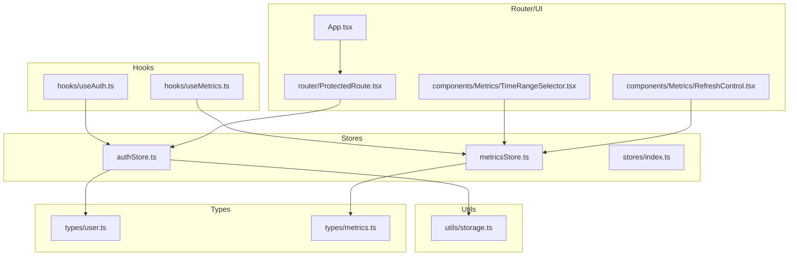
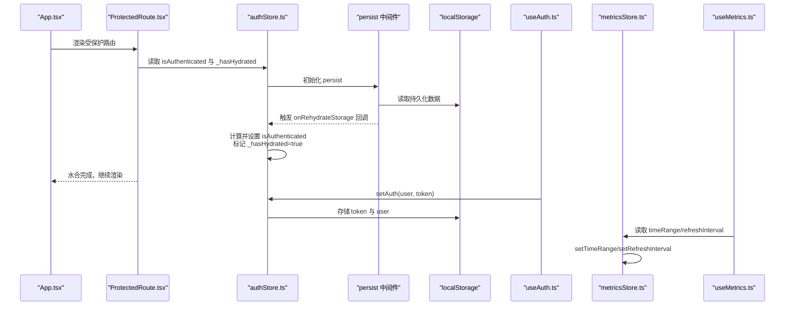
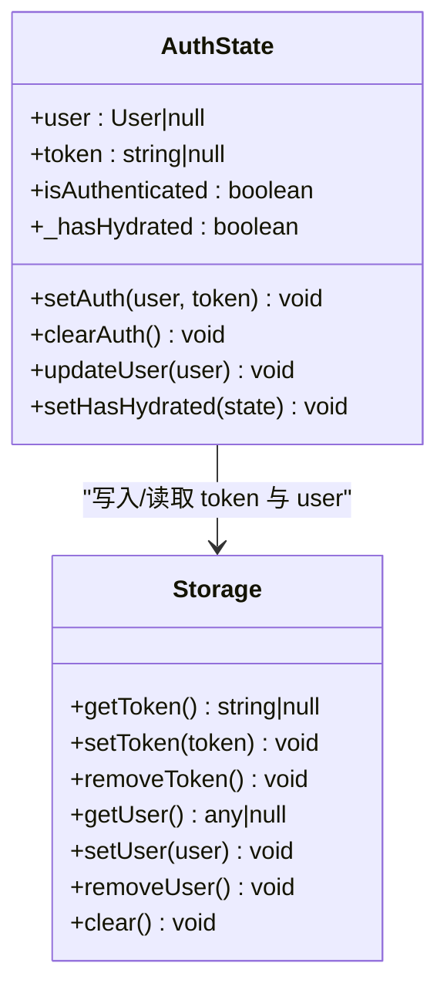
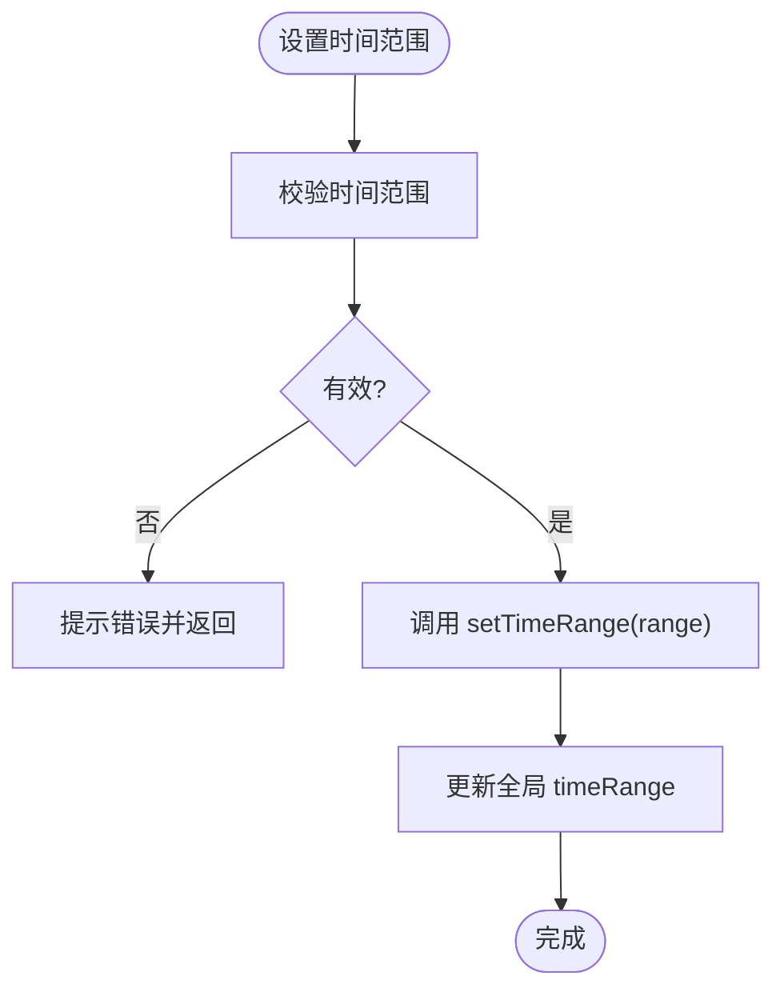
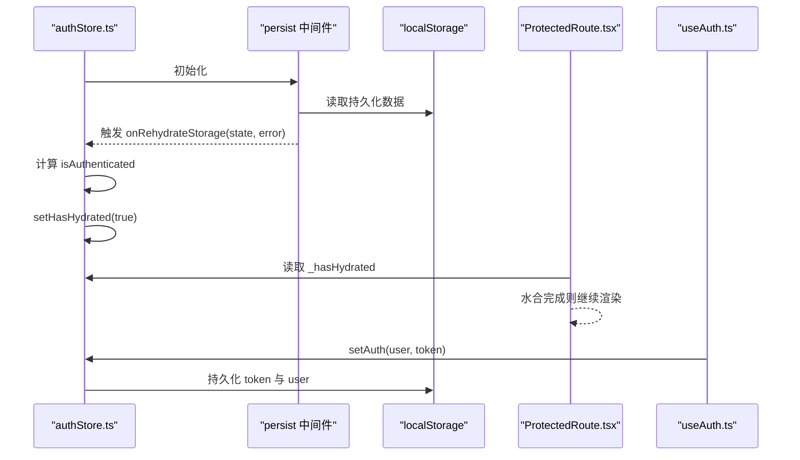
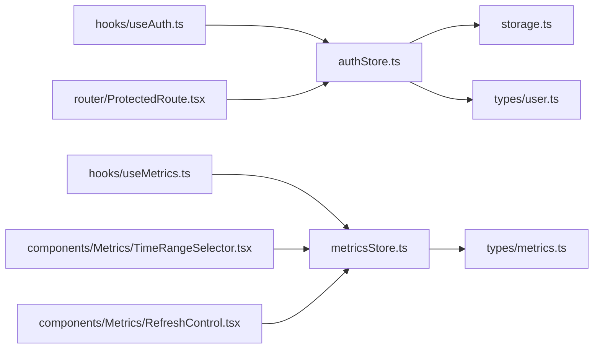

# 数据存储设计

<cite>
**本文引用的文件**
- [web/src/stores/authStore.ts](file://web/src/stores/authStore.ts)
- [web/src/stores/metricsStore.ts](file://web/src/stores/metricsStore.ts)
- [web/src/stores/index.ts](file://web/src/stores/index.ts)
- [web/src/utils/storage.ts](file://web/src/utils/storage.ts)
- [web/src/types/user.ts](file://web/src/types/user.ts)
- [web/src/types/metrics.ts](file://web/src/types/metrics.ts)
- [web/src/hooks/useAuth.ts](file://web/src/hooks/useAuth.ts)
- [web/src/hooks/useMetrics.ts](file://web/src/hooks/useMetrics.ts)
- [web/src/router/ProtectedRoute.tsx](file://web/src/router/ProtectedRoute.tsx)
- [web/src/components/Metrics/TimeRangeSelector.tsx](file://web/src/components/Metrics/TimeRangeSelector.tsx)
- [web/src/components/Metrics/RefreshControl.tsx](file://web/src/components/Metrics/RefreshControl.tsx)
- [web/src/App.tsx](file://web/src/App.tsx)
- [web/src/main.tsx](file://web/src/main.tsx)
- [docs/前端开发规范.md](file://docs/前端开发规范.md)
- [docs/设计文档_04_Web前端模块.md](file://docs/设计文档_04_Web前端模块.md)
</cite>

## 目录
1. [引言](#引言)
2. [项目结构](#项目结构)
3. [核心组件](#核心组件)
4. [架构总览](#架构总览)
5. [详细组件分析](#详细组件分析)
6. [依赖关系分析](#依赖关系分析)
7. [性能考量](#性能考量)
8. [故障排查指南](#故障排查指南)
9. [结论](#结论)
10. [附录](#附录)

## 引言
本设计文档围绕前端基于 Zustand 的状态存储实现进行系统性解析，重点覆盖以下方面：
- authStore 如何定义用户认证状态（user、token、isAuthenticated），并通过 persist 中间件实现 JWT 令牌与用户信息的持久化存储，包括中间件配置（name、partialize、onRehydrateStorage）及页面刷新后的状态恢复机制；
- metricsStore 如何定义监控相关状态（timeRange、refreshInterval）并实现全局共享；
- Store 的初始化逻辑、状态更新方法（setAuth、clearAuth、setTimeRange 等）以及水合（hydration）过程中的错误处理；
- 结合代码示例展示状态变更的不可变性原则与性能优化实践。

## 项目结构
前端状态存储位于 web/src/stores，采用按功能域划分的组织方式：
- authStore.ts：用户认证状态与持久化
- metricsStore.ts：监控指标状态与全局共享
- index.ts：统一导出，便于上层组件按需引入

图表来源
- [web/src/stores/authStore.ts](file://web/src/stores/authStore.ts#L1-L84)
- [web/src/stores/metricsStore.ts](file://web/src/stores/metricsStore.ts#L1-L37)
- [web/src/stores/index.ts](file://web/src/stores/index.ts#L1-L7)
- [web/src/utils/storage.ts](file://web/src/utils/storage.ts#L1-L48)
- [web/src/types/user.ts](file://web/src/types/user.ts#L1-L52)
- [web/src/types/metrics.ts](file://web/src/types/metrics.ts#L1-L93)
- [web/src/hooks/useAuth.ts](file://web/src/hooks/useAuth.ts#L1-L58)
- [web/src/hooks/useMetrics.ts](file://web/src/hooks/useMetrics.ts#L1-L103)
- [web/src/router/ProtectedRoute.tsx](file://web/src/router/ProtectedRoute.tsx#L1-L37)
- [web/src/components/Metrics/TimeRangeSelector.tsx](file://web/src/components/Metrics/TimeRangeSelector.tsx#L1-L235)
- [web/src/components/Metrics/RefreshControl.tsx](file://web/src/components/Metrics/RefreshControl.tsx#L55-L98)
- [web/src/App.tsx](file://web/src/App.tsx#L1-L57)

章节来源
- [web/src/stores/index.ts](file://web/src/stores/index.ts#L1-L7)

## 核心组件
- authStore：负责用户认证状态与持久化，包含 setAuth、clearAuth、updateUser、setHasHydrated 等动作，并通过 persist 中间件将 user、token 与派生字段 isAuthenticated 写入 localStorage。
- metricsStore：负责监控时间范围与刷新间隔的全局状态，提供 setTimeRange、setRefreshInterval 动作，供图表与查询 Hook 使用。

章节来源
- [web/src/stores/authStore.ts](file://web/src/stores/authStore.ts#L1-L84)
- [web/src/stores/metricsStore.ts](file://web/src/stores/metricsStore.ts#L1-L37)

## 架构总览
下图展示了认证与监控状态在前端的整体交互路径，包括持久化、水合、路由守卫与查询 Hook 的协作。

图表来源
- [web/src/App.tsx](file://web/src/App.tsx#L1-L57)
- [web/src/router/ProtectedRoute.tsx](file://web/src/router/ProtectedRoute.tsx#L1-L37)
- [web/src/stores/authStore.ts](file://web/src/stores/authStore.ts#L23-L84)
- [web/src/utils/storage.ts](file://web/src/utils/storage.ts#L1-L48)
- [web/src/hooks/useAuth.ts](file://web/src/hooks/useAuth.ts#L1-L58)
- [web/src/stores/metricsStore.ts](file://web/src/stores/metricsStore.ts#L1-L37)
- [web/src/hooks/useMetrics.ts](file://web/src/hooks/useMetrics.ts#L1-L103)

## 详细组件分析

### 认证状态存储（authStore）
- 状态字段
  - user：用户对象或空
  - token：JWT 字符串或空
  - isAuthenticated：派生字段，当 user 与 token 均非空时为真
  - _hasHydrated：水合完成标记
- 动作方法
  - setAuth(user, token)：写入用户与令牌，设置已认证
  - clearAuth()：清除用户与令牌，设置未认证
  - updateUser(user)：仅更新用户信息
  - setHasHydrated(state)：标记水合完成
- 持久化中间件配置
  - name：持久化键名，用于 localStorage 区分存储
  - partialize：仅持久化 user、token 与派生的 isAuthenticated，避免冗余字段
  - onRehydrateStorage：水合回调中根据恢复数据重新计算 isAuthenticated，并标记水合完成
- 水合与路由守卫
  - ProtectedRoute 在 _hasHydrated 为假时显示加载态，确保水合完成后再判断 isAuthenticated

图表来源
- [web/src/stores/authStore.ts](file://web/src/stores/authStore.ts#L1-L84)
- [web/src/utils/storage.ts](file://web/src/utils/storage.ts#L1-L48)

章节来源
- [web/src/stores/authStore.ts](file://web/src/stores/authStore.ts#L1-L84)
- [web/src/utils/storage.ts](file://web/src/utils/storage.ts#L1-L48)
- [web/src/router/ProtectedRoute.tsx](file://web/src/router/ProtectedRoute.tsx#L1-L37)
- [web/src/hooks/useAuth.ts](file://web/src/hooks/useAuth.ts#L1-L58)

### 监控状态存储（metricsStore）
- 状态字段
  - timeRange：起止时间范围，默认最近 1 小时
  - refreshInterval：刷新间隔（毫秒），可为空表示暂停
- 动作方法
  - setTimeRange(range)：设置时间范围
  - setRefreshInterval(interval)：设置刷新间隔
- 共享与使用
  - useMetrics.ts 通过 useMetricsStore 读取 refreshInterval，驱动集群概览的自动刷新
  - TimeRangeSelector 与 RefreshControl 组件通过动作更新全局状态

图表来源
- [web/src/stores/metricsStore.ts](file://web/src/stores/metricsStore.ts#L1-L37)
- [web/src/hooks/useMetrics.ts](file://web/src/hooks/useMetrics.ts#L82-L101)
- [web/src/components/Metrics/TimeRangeSelector.tsx](file://web/src/components/Metrics/TimeRangeSelector.tsx#L1-L235)
- [web/src/components/Metrics/RefreshControl.tsx](file://web/src/components/Metrics/RefreshControl.tsx#L55-L98)

章节来源
- [web/src/stores/metricsStore.ts](file://web/src/stores/metricsStore.ts#L1-L37)
- [web/src/hooks/useMetrics.ts](file://web/src/hooks/useMetrics.ts#L1-L103)
- [web/src/components/Metrics/TimeRangeSelector.tsx](file://web/src/components/Metrics/TimeRangeSelector.tsx#L1-L235)
- [web/src/components/Metrics/RefreshControl.tsx](file://web/src/components/Metrics/RefreshControl.tsx#L55-L98)

### Store 初始化与水合流程
- 初始化
  - authStore 使用 create 与 persist 中间件初始化，设置初始状态与动作
  - metricsStore 使用 create 初始化默认状态与动作
- 水合
  - persist 中间件从 localStorage 读取持久化数据
  - onRehydrateStorage 回调中根据 user 与 token 计算 isAuthenticated，并设置 _hasHydrated
  - ProtectedRoute 等组件等待 _hasHydrated 为真后再进行路由判定
- 错误处理
  - onRehydrateStorage 对水合错误进行记录
  - useMetrics.ts 在 401 时导航至登录页

图表来源
- [web/src/stores/authStore.ts](file://web/src/stores/authStore.ts#L23-L84)
- [web/src/router/ProtectedRoute.tsx](file://web/src/router/ProtectedRoute.tsx#L1-L37)
- [web/src/hooks/useAuth.ts](file://web/src/hooks/useAuth.ts#L1-L58)

章节来源
- [web/src/stores/authStore.ts](file://web/src/stores/authStore.ts#L23-L84)
- [web/src/router/ProtectedRoute.tsx](file://web/src/router/ProtectedRoute.tsx#L1-L37)
- [web/src/hooks/useMetrics.ts](file://web/src/hooks/useMetrics.ts#L82-L101)

## 依赖关系分析
- 组件耦合
  - authStore 依赖 storage 工具进行本地持久化
  - useAuth 依赖 authStore 的动作与状态
  - ProtectedRoute 依赖 authStore 的认证状态与水合标记
  - useMetrics 依赖 metricsStore 的时间范围与刷新间隔
  - TimeRangeSelector 与 RefreshControl 通过动作更新 metricsStore
- 类型约束
  - user.ts 定义用户与角色枚举
  - metrics.ts 定义时间范围与指标类型

图表来源
- [web/src/stores/authStore.ts](file://web/src/stores/authStore.ts#L1-L84)
- [web/src/utils/storage.ts](file://web/src/utils/storage.ts#L1-L48)
- [web/src/types/user.ts](file://web/src/types/user.ts#L1-L52)
- [web/src/hooks/useAuth.ts](file://web/src/hooks/useAuth.ts#L1-L58)
- [web/src/router/ProtectedRoute.tsx](file://web/src/router/ProtectedRoute.tsx#L1-L37)
- [web/src/stores/metricsStore.ts](file://web/src/stores/metricsStore.ts#L1-L37)
- [web/src/types/metrics.ts](file://web/src/types/metrics.ts#L1-L93)
- [web/src/hooks/useMetrics.ts](file://web/src/hooks/useMetrics.ts#L1-L103)
- [web/src/components/Metrics/TimeRangeSelector.tsx](file://web/src/components/Metrics/TimeRangeSelector.tsx#L1-L235)
- [web/src/components/Metrics/RefreshControl.tsx](file://web/src/components/Metrics/RefreshControl.tsx#L55-L98)

章节来源
- [web/src/stores/authStore.ts](file://web/src/stores/authStore.ts#L1-L84)
- [web/src/stores/metricsStore.ts](file://web/src/stores/metricsStore.ts#L1-L37)
- [web/src/utils/storage.ts](file://web/src/utils/storage.ts#L1-L48)
- [web/src/types/user.ts](file://web/src/types/user.ts#L1-L52)
- [web/src/types/metrics.ts](file://web/src/types/metrics.ts#L1-L93)
- [web/src/hooks/useAuth.ts](file://web/src/hooks/useAuth.ts#L1-L58)
- [web/src/hooks/useMetrics.ts](file://web/src/hooks/useMetrics.ts#L1-L103)
- [web/src/router/ProtectedRoute.tsx](file://web/src/router/ProtectedRoute.tsx#L1-L37)
- [web/src/components/Metrics/TimeRangeSelector.tsx](file://web/src/components/Metrics/TimeRangeSelector.tsx#L1-L235)
- [web/src/components/Metrics/RefreshControl.tsx](file://web/src/components/Metrics/RefreshControl.tsx#L55-L98)

## 性能考量
- 不可变性与精确订阅
  - Zustand 的 set 以不可变方式更新状态，避免不必要的渲染
  - 文档规范强调使用动词命名的动作函数，保持状态更新简洁明确
- 水合与首屏体验
  - 通过 _hasHydrated 标记避免在水合完成前进行路由判定，减少闪烁与重复渲染
- 缓存与刷新策略
  - useMetrics.ts 对查询设置了合理的 staleTime 与 refetchInterval，降低网络压力
  - metricsStore 的 refreshInterval 作为全局开关，统一控制自动刷新节奏
- 本地存储最小化
  - authStore 的 partialize 仅持久化必要字段，减少存储体积与序列化成本

章节来源
- [docs/前端开发规范.md](file://docs/前端开发规范.md#L437-L512)
- [web/src/stores/authStore.ts](file://web/src/stores/authStore.ts#L63-L84)
- [web/src/hooks/useMetrics.ts](file://web/src/hooks/useMetrics.ts#L1-L103)
- [web/src/router/ProtectedRoute.tsx](file://web/src/router/ProtectedRoute.tsx#L1-L37)

## 故障排查指南
- 水合失败
  - 现象：控制台出现水合错误日志
  - 处理：检查 localStorage 中的持久化键是否存在、格式是否正确；确认 onRehydrateStorage 回调中的错误分支
- 认证状态异常
  - 现象：登录后仍提示未认证或路由无法跳转
  - 处理：确认 setAuth 是否被调用、token 与 user 是否正确写入 storage；检查 _hasHydrated 是否被标记为 true
- 刷新策略问题
  - 现象：图表不刷新或频繁刷新
  - 处理：核对 metricsStore 的 refreshInterval 设置；检查 useMetrics.ts 的 refetchInterval 与 staleTime 配置
- 类型不匹配
  - 现象：编译或运行时报错
  - 处理：核对 user.ts 与 metrics.ts 中的接口定义，确保与实际数据一致

章节来源
- [web/src/stores/authStore.ts](file://web/src/stores/authStore.ts#L70-L81)
- [web/src/hooks/useAuth.ts](file://web/src/hooks/useAuth.ts#L1-L58)
- [web/src/hooks/useMetrics.ts](file://web/src/hooks/useMetrics.ts#L82-L101)
- [web/src/types/user.ts](file://web/src/types/user.ts#L1-L52)
- [web/src/types/metrics.ts](file://web/src/types/metrics.ts#L1-L93)

## 结论
本设计通过 Zustand 与 persist 中间件实现了轻量、可维护的前端状态管理：
- authStore 将用户认证状态与本地持久化紧密结合，借助水合回调保证页面刷新后的状态一致性与安全性
- metricsStore 提供全局共享的时间范围与刷新策略，配合 React Query 实现高效的数据获取与缓存
- 通过清晰的动作命名、最小化持久化字段与合理的缓存策略，兼顾了性能与可维护性

## 附录
- 设计文档参考
  - [设计文档_04_Web前端模块.md](file://docs/设计文档_04_Web前端模块.md)
  - [前端开发规范.md](file://docs/前端开发规范.md)