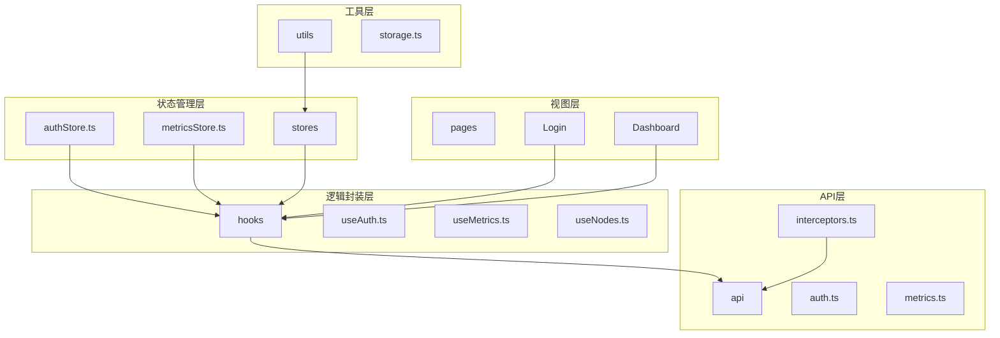
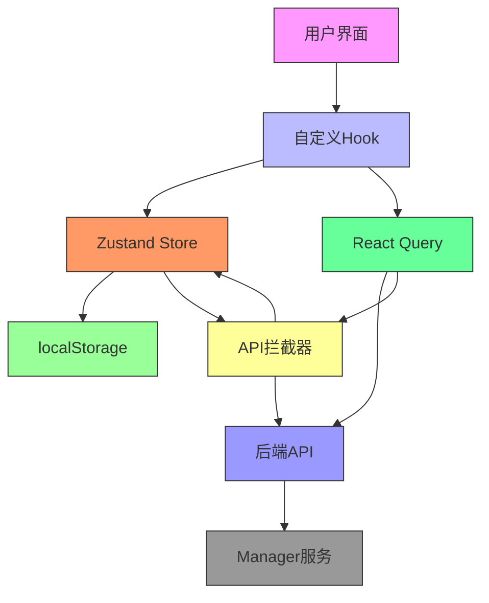
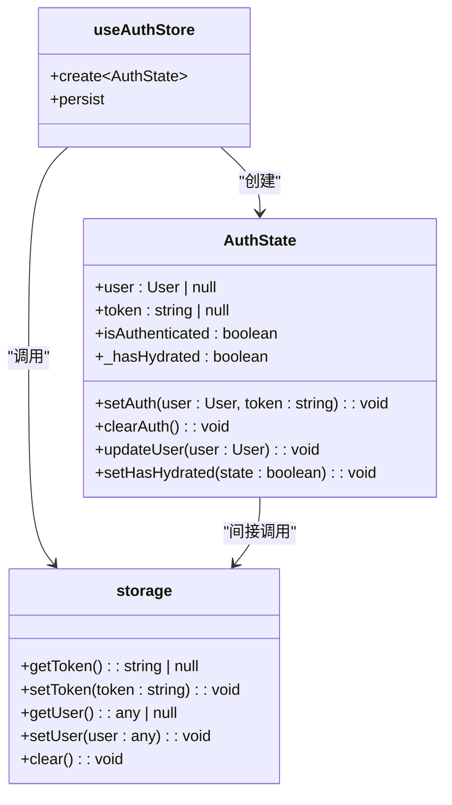
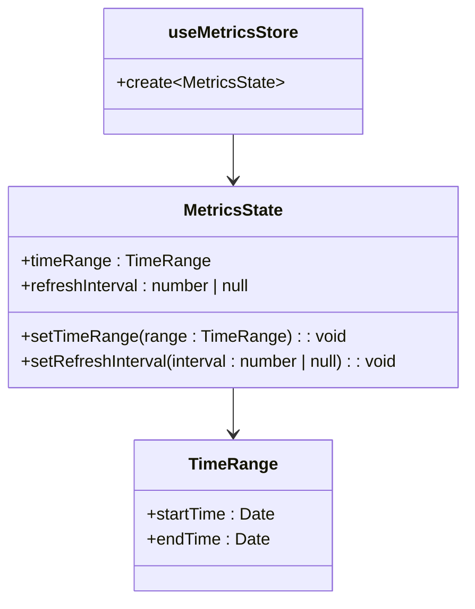
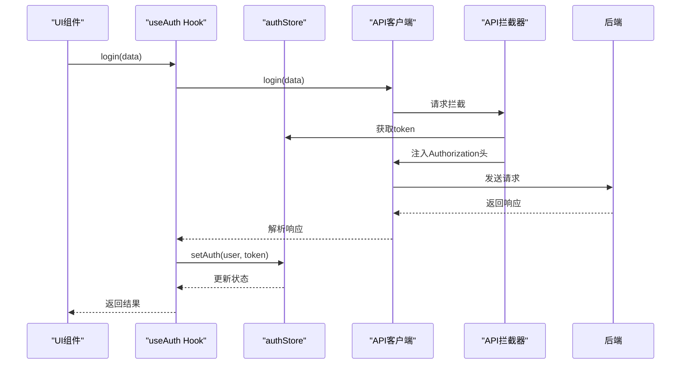
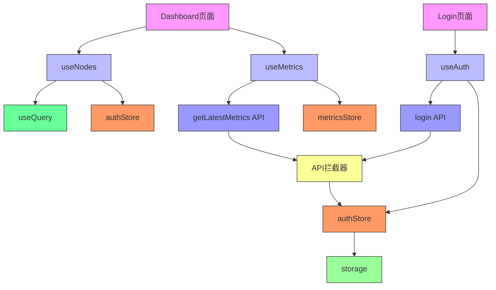

# 状态管理机制

<cite>
**本文档引用的文件**
- [authStore.ts](file://web/src/stores/authStore.ts)
- [metricsStore.ts](file://web/src/stores/metricsStore.ts)
- [useAuth.ts](file://web/src/hooks/useAuth.ts)
- [useMetrics.ts](file://web/src/hooks/useMetrics.ts)
- [useNodes.ts](file://web/src/hooks/useNodes.ts)
- [storage.ts](file://web/src/utils/storage.ts)
- [interceptors.ts](file://web/src/api/interceptors.ts)
- [api.ts](file://web/src/types/api.ts)
- [user.ts](file://web/src/types/user.ts)
- [metrics.ts](file://web/src/types/metrics.ts)
- [index.ts](file://web/src/stores/index.ts)
- [Login/index.tsx](file://web/src/pages/Login/index.tsx)
- [Dashboard/index.tsx](file://web/src/pages/Dashboard/index.tsx)
- [ProtectedRoute.tsx](file://web/src/router/ProtectedRoute.tsx)
</cite>

## 目录
1. [简介](#简介)
2. [项目结构](#项目结构)
3. [核心组件](#核心组件)
4. [架构概述](#架构概述)
5. [详细组件分析](#详细组件分析)
6. [依赖分析](#依赖分析)
7. [性能考虑](#性能考虑)
8. [故障排除指南](#故障排除指南)
9. [结论](#结论)

## 简介
本项目采用Zustand作为核心状态管理解决方案，构建了一个高效、可维护的前端状态管理体系。系统通过Zustand的`create`和`persist`中间件实现了认证状态的持久化存储与自动恢复，确保用户在页面刷新后仍保持登录状态。同时，结合React Query进行服务端状态管理，实现了数据的智能缓存、自动刷新和错误处理。自定义Hook封装了复杂的业务逻辑，提供了简洁的API供组件使用，实现了状态逻辑与UI组件的完全解耦。

## 项目结构
项目的状态管理机制主要集中在`web/src`目录下，形成了清晰的分层架构。`stores`目录包含使用Zustand创建的全局状态存储，`hooks`目录封装了业务逻辑和数据获取逻辑，`utils`目录提供了辅助工具，`api`目录负责与后端服务通信。这种分层设计使得状态管理逻辑清晰、易于维护和测试。

**图示来源**
- [authStore.ts](file://web/src/stores/authStore.ts)
- [useAuth.ts](file://web/src/hooks/useAuth.ts)
- [useMetrics.ts](file://web/src/hooks/useMetrics.ts)
- [storage.ts](file://web/src/utils/storage.ts)
- [interceptors.ts](file://web/src/api/interceptors.ts)

**本节来源**
- [authStore.ts](file://web/src/stores/authStore.ts)
- [useAuth.ts](file://web/src/hooks/useAuth.ts)
- [useMetrics.ts](file://web/src/hooks/useMetrics.ts)
- [storage.ts](file://web/src/utils/storage.ts)

## 核心组件
系统的核心状态管理组件包括`authStore`和`metricsStore`，分别负责认证状态和监控指标状态的管理。`authStore`利用Zustand的持久化中间件实现了JWT令牌的本地存储和自动恢复，确保了用户会话的连续性。`metricsStore`则管理着监控数据的时间范围和刷新间隔等全局状态，为数据可视化提供了统一的配置中心。这些Store通过自定义Hook暴露给组件使用，实现了状态逻辑的复用和解耦。

**本节来源**
- [authStore.ts](file://web/src/stores/authStore.ts)
- [metricsStore.ts](file://web/src/stores/metricsStore.ts)

## 架构概述
系统的状态管理架构采用了Zustand与React Query相结合的混合模式。Zustand负责管理客户端的全局UI状态和用户会话状态，而React Query则专注于服务端状态的管理，包括数据获取、缓存、同步和更新。这种架构的优势在于将不同类型的状体分离管理，既保证了UI状态的响应性，又实现了服务端数据的高效管理。API拦截器在请求层面统一处理了认证令牌的注入和错误状态的处理，确保了状态的一致性和安全性。

**图示来源**
- [authStore.ts](file://web/src/stores/authStore.ts)
- [useAuth.ts](file://web/src/hooks/useAuth.ts)
- [useMetrics.ts](file://web/src/hooks/useMetrics.ts)
- [interceptors.ts](file://web/src/api/interceptors.ts)

## 详细组件分析

### 认证状态管理分析
`authStore`是系统认证状态的核心管理器，它使用Zustand的`persist`中间件实现了状态的持久化存储。Store中定义了用户信息、认证令牌、认证状态等关键字段，并提供了`setAuth`、`clearAuth`等操作方法。持久化配置中的`partialize`函数精确控制了哪些状态需要被持久化，而`onRehydrateStorage`回调则在状态恢复完成后重新计算认证状态，确保了状态的一致性。

**图示来源**
- [authStore.ts](file://web/src/stores/authStore.ts)
- [storage.ts](file://web/src/utils/storage.ts)

**本节来源**
- [authStore.ts](file://web/src/stores/authStore.ts)
- [storage.ts](file://web/src/utils/storage.ts)

### 监控指标状态管理分析
`metricsStore`负责管理监控相关的全局状态，如时间范围和刷新间隔。与`authStore`不同，`metricsStore`没有使用持久化中间件，其状态在页面刷新后会重置为默认值。Store中定义了`timeRange`和`refreshInterval`两个核心状态字段，以及相应的更新方法。这些状态被`useMetrics`等自定义Hook使用，为监控数据的获取和展示提供了统一的配置接口。

**图示来源**
- [metricsStore.ts](file://web/src/stores/metricsStore.ts)
- [metrics.ts](file://web/src/types/metrics.ts)

**本节来源**
- [metricsStore.ts](file://web/src/stores/metricsStore.ts)

### 自定义Hook分析
自定义Hook是连接状态管理与UI组件的桥梁。`useAuth` Hook封装了所有与认证相关的业务逻辑，包括登录、注册、获取用户资料等操作。它通过`useMutation`和`useQuery`与后端API交互，并将结果映射到Zustand Store中。Hook还暴露了加载状态和错误信息，使得组件可以优雅地处理异步操作的各个阶段。`useMetrics` Hook则专注于监控数据的获取，利用React Query的缓存和自动刷新机制，实现了数据的高效管理。

**图示来源**
- [useAuth.ts](file://web/src/hooks/useAuth.ts)
- [authStore.ts](file://web/src/stores/authStore.ts)
- [interceptors.ts](file://web/src/api/interceptors.ts)

**本节来源**
- [useAuth.ts](file://web/src/hooks/useAuth.ts)
- [useMetrics.ts](file://web/src/hooks/useMetrics.ts)
- [useNodes.ts](file://web/src/hooks/useNodes.ts)

### 状态订阅优化分析
系统通过多种方式优化了状态订阅，避免了不必要的组件重渲染。首先，Zustand支持选择器函数，允许组件只订阅Store中的特定字段。其次，React Query的`useQuery` Hook内置了智能缓存和比较机制，只有当数据真正变化时才会触发重渲染。此外，自定义Hook将加载状态和错误信息分别暴露，使得组件可以根据需要独立订阅，进一步细化了渲染控制。

## 依赖分析
状态管理组件之间存在清晰的依赖关系。`authStore`依赖于`storage`工具进行本地存储操作，`useAuth` Hook依赖于`authStore`和API模块，而UI组件则依赖于自定义Hook。API拦截器作为一个全局单例，依赖于`authStore`来获取当前的认证状态。这种依赖关系形成了一个稳定的层次结构，确保了状态流的单向性和可预测性。

**图示来源**
- [authStore.ts](file://web/src/stores/authStore.ts)
- [useAuth.ts](file://web/src/hooks/useAuth.ts)
- [useMetrics.ts](file://web/src/hooks/useMetrics.ts)
- [useNodes.ts](file://web/src/hooks/useNodes.ts)
- [storage.ts](file://web/src/utils/storage.ts)
- [interceptors.ts](file://web/src/api/interceptors.ts)

**本节来源**
- [authStore.ts](file://web/src/stores/authStore.ts)
- [useAuth.ts](file://web/src/hooks/useAuth.ts)
- [useMetrics.ts](file://web/src/hooks/useMetrics.ts)
- [useNodes.ts](file://web/src/hooks/useNodes.ts)
- [storage.ts](file://web/src/utils/storage.ts)
- [interceptors.ts](file://web/src/api/interceptors.ts)

## 性能考虑
系统的状态管理设计充分考虑了性能因素。Zustand的轻量级特性确保了状态更新的高效性，而React Query的智能缓存机制减少了不必要的网络请求。持久化存储的使用避免了用户每次访问都需要重新登录，提升了用户体验。API拦截器中的错误处理逻辑确保了网络异常时的优雅降级，防止了应用崩溃。整体架构在保证功能完整性的同时，实现了良好的性能表现。

## 故障排除指南
当遇到状态管理相关的问题时，可以按照以下步骤进行排查：首先检查`authStore`中的`_hasHydrated`标志是否为true，这决定了应用是否已完成状态恢复；其次检查API拦截器是否正确注入了认证令牌；然后查看React Query的开发者工具，检查查询状态和缓存情况；最后检查自定义Hook的返回值，确认加载状态和错误信息是否按预期工作。对于持久化问题，可以检查浏览器的localStorage是否被正确写入和读取。

**本节来源**
- [authStore.ts](file://web/src/stores/authStore.ts)
- [interceptors.ts](file://web/src/api/interceptors.ts)
- [useAuth.ts](file://web/src/hooks/useAuth.ts)
- [useMetrics.ts](file://web/src/hooks/useMetrics.ts)

## 结论
本项目的状态管理机制设计合理、实现高效。通过Zustand和React Query的有机结合，实现了客户端状态和服务端状态的有效管理。自定义Hook的封装提高了代码的复用性和可维护性，API拦截器确保了认证状态的一致性和安全性。整体架构清晰，层次分明，为系统的稳定运行提供了坚实的基础。未来可以考虑引入更复杂的状态管理模式，如状态机，以应对更复杂的业务场景。