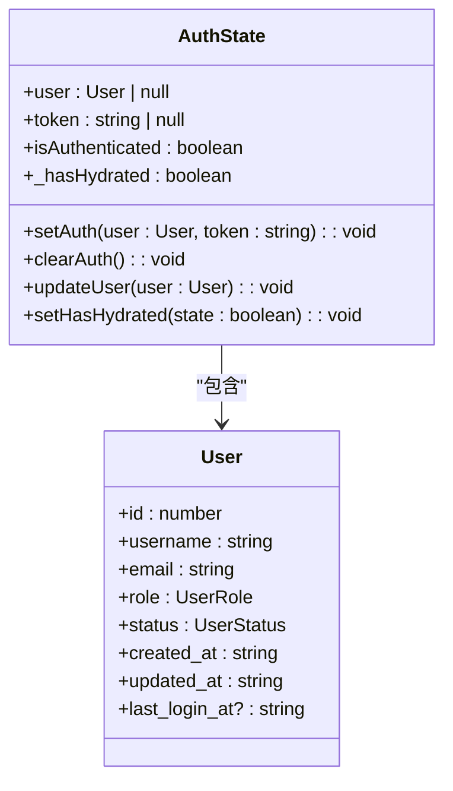
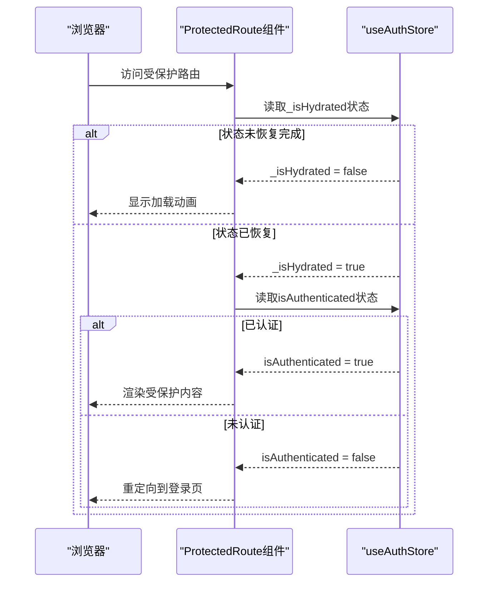
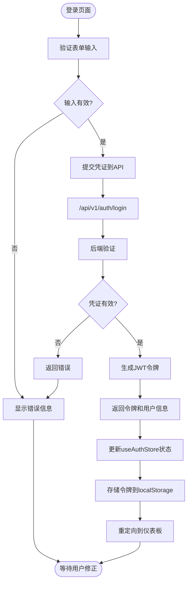
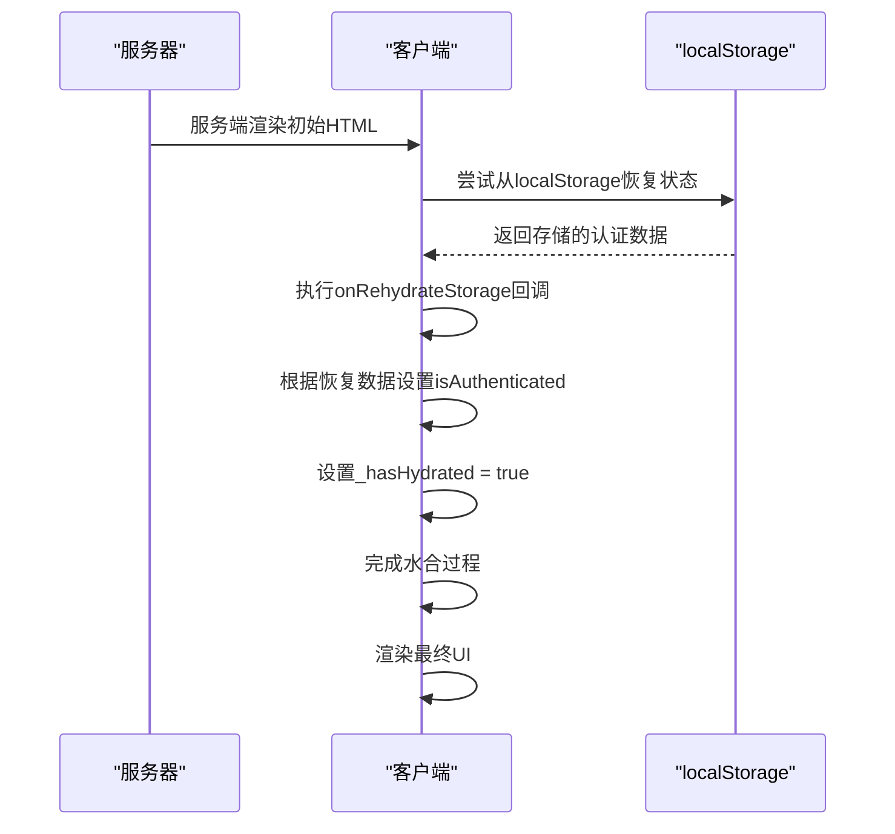
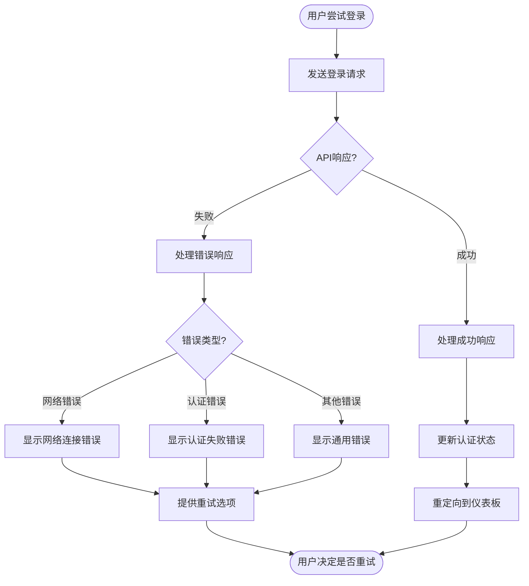
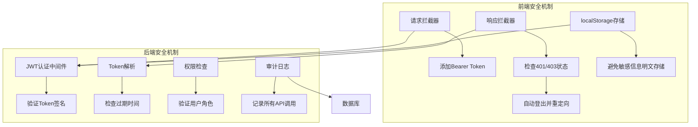

# 安全机制

<cite>
**本文档引用的文件**
- [authStore.ts](file://web/src/stores/authStore.ts)
- [ProtectedRoute.tsx](file://web/src/router/ProtectedRoute.tsx)
- [useAuth.ts](file://web/src/hooks/useAuth.ts)
- [interceptors.ts](file://web/src/api/interceptors.ts)
- [auth.ts](file://web/src/api/auth.ts)
- [client.ts](file://web/src/api/client.ts)
- [storage.ts](file://web/src/utils/storage.ts)
- [user.ts](file://web/src/types/user.ts)
- [api.ts](file://web/src/types/api.ts)
- [Login/index.tsx](file://web/src/pages/Login/index.tsx)
- [jwt.go](file://manager/pkg/jwt/jwt.go)
- [auth.go](file://manager/internal/middleware/auth.go)
- [auth.go](file://manager/internal/handler/auth.go)
- [auth.go](file://manager/internal/service/auth.go)
</cite>

## 目录
1. [简介](#简介)
2. [认证状态管理](#认证状态管理)
3. [路由守卫机制](#路由守卫机制)
4. [登录流程](#登录流程)
5. [SSR/SSG状态同步](#ssrssg状态同步)
6. [错误处理机制](#错误处理机制)
7. [安全最佳实践](#安全最佳实践)

## 简介
本系统采用基于JWT的认证体系，实现了完整的用户认证和权限控制流程。前端使用Zustand进行状态管理，通过React Router实现路由守卫，确保受保护资源的安全访问。后端使用Gin框架和JWT库实现认证中间件，对API请求进行身份验证和权限检查。

## 认证状态管理
系统使用Zustand库创建`useAuthStore`状态管理器，集中管理用户的认证状态。该状态管理器包含用户信息、JWT令牌和认证状态等关键数据。

**图表来源**
- [authStore.ts](file://web/src/stores/authStore.ts#L10-L21)
- [user.ts](file://web/src/types/user.ts#L5-L14)

**章节来源**
- [authStore.ts](file://web/src/stores/authStore.ts#L1-L84)

## 路由守卫机制
`ProtectedRoute`组件通过`useAuthStore`钩子读取`isAuthenticated`状态，实现路由守卫功能，阻止未授权用户访问受保护资源。

**图表来源**
- [ProtectedRoute.tsx](file://web/src/router/ProtectedRoute.tsx#L13-L37)
- [authStore.ts](file://web/src/stores/authStore.ts#L14-L15)

**章节来源**
- [ProtectedRoute.tsx](file://web/src/router/ProtectedRoute.tsx#L1-L38)

## 登录流程
登录流程包括表单验证、用户凭证提交、JWT令牌获取与本地存储等步骤，确保用户安全登录系统。

**图表来源**
- [Login/index.tsx](file://web/src/pages/Login/index.tsx#L21-L110)
- [useAuth.ts](file://web/src/hooks/useAuth.ts#L17-L23)
- [auth.ts](file://web/src/api/auth.ts#L19-L21)
- [authStore.ts](file://web/src/stores/authStore.ts#L31-L40)

**章节来源**
- [Login/index.tsx](file://web/src/pages/Login/index.tsx#L1-L110)
- [useAuth.ts](file://web/src/hooks/useAuth.ts#L1-L73)

## SSR/SSG状态同步
`_hasHydrated`状态确保在SSR/SSG场景下的状态同步一致性，防止水合不匹配问题。

**图表来源**
- [authStore.ts](file://web/src/stores/authStore.ts#L70-L80)
- [ProtectedRoute.tsx](file://web/src/router/ProtectedRoute.tsx#L17-L29)

**章节来源**
- [authStore.ts](file://web/src/stores/authStore.ts#L70-L80)

## 错误处理机制
系统提供完善的错误处理机制，展示登录失败时的错误提示与重试逻辑。

**图表来源**
- [Login/index.tsx](file://web/src/pages/Login/index.tsx#L37-L39)
- [interceptors.ts](file://web/src/api/interceptors.ts#L55-L90)
- [api.ts](file://web/src/types/api.ts#L28-L41)

**章节来源**
- [Login/index.tsx](file://web/src/pages/Login/index.tsx#L24-L40)
- [interceptors.ts](file://web/src/api/interceptors.ts#L1-L95)

## 安全最佳实践
系统实施了多项安全最佳实践，包括令牌过期处理、自动登出机制和XSS防护措施。

**图表来源**
- [interceptors.ts](file://web/src/api/interceptors.ts#L14-L90)
- [auth.go](file://manager/internal/middleware/auth.go#L13-L50)
- [jwt.go](file://manager/pkg/jwt/jwt.go#L63-L88)
- [audit.go](file://manager/internal/middleware/audit.go#L13-L49)

**章节来源**
- [interceptors.ts](file://web/src/api/interceptors.ts#L1-L95)
- [auth.go](file://manager/internal/middleware/auth.go#L1-L60)
- [jwt.go](file://manager/pkg/jwt/jwt.go#L1-L139)