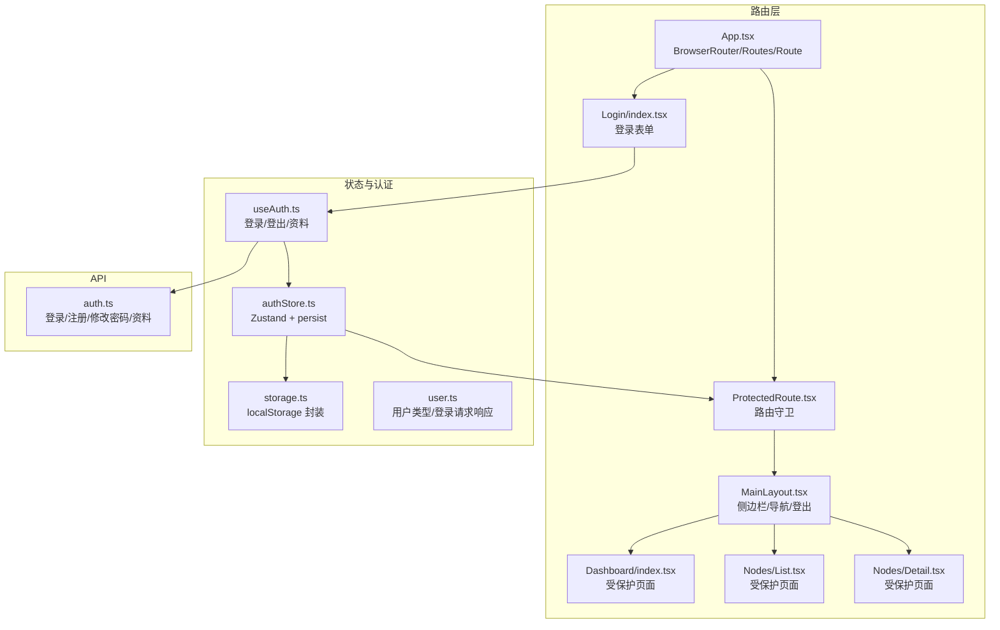
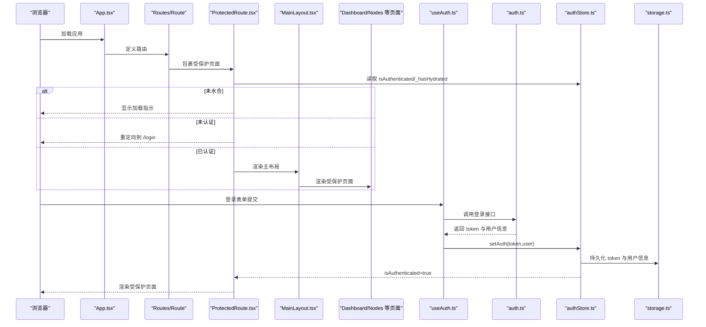
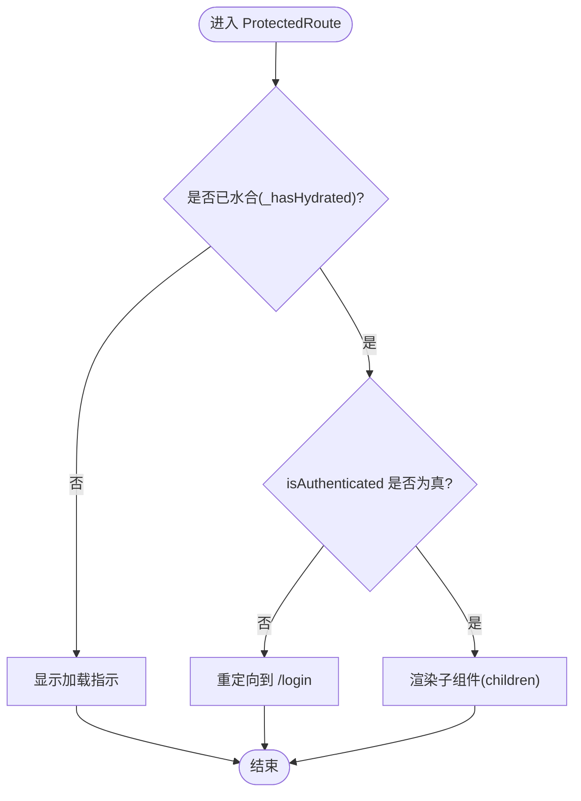
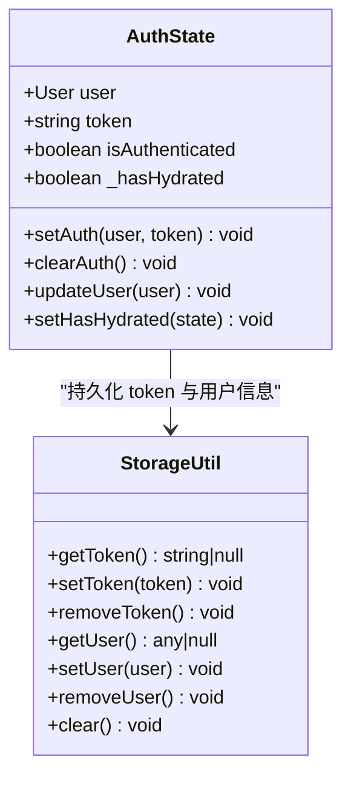
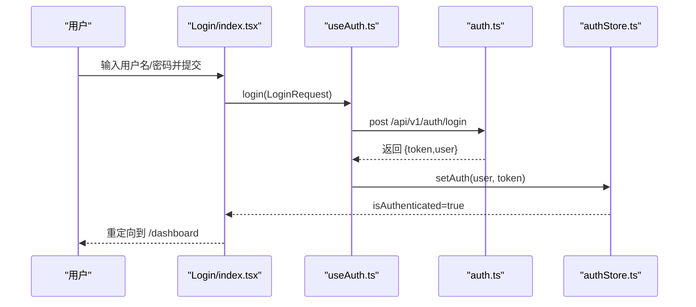
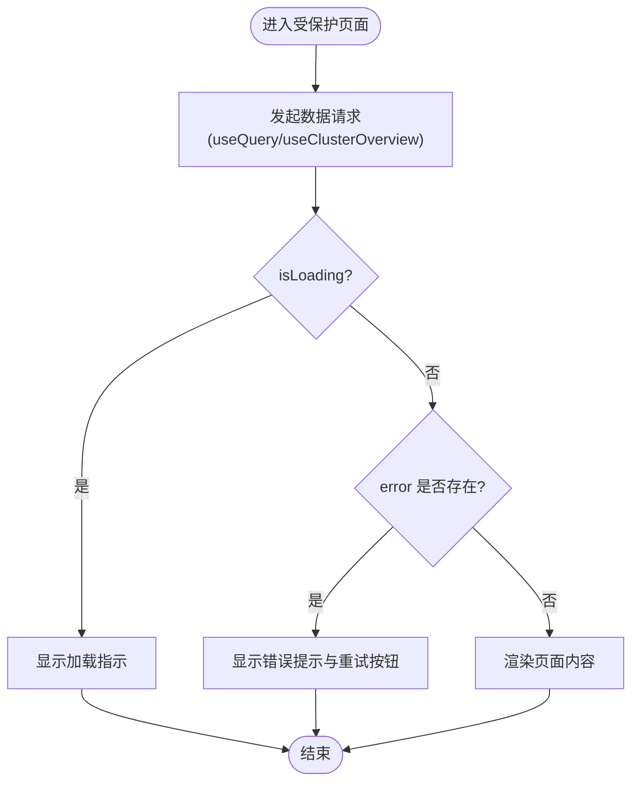
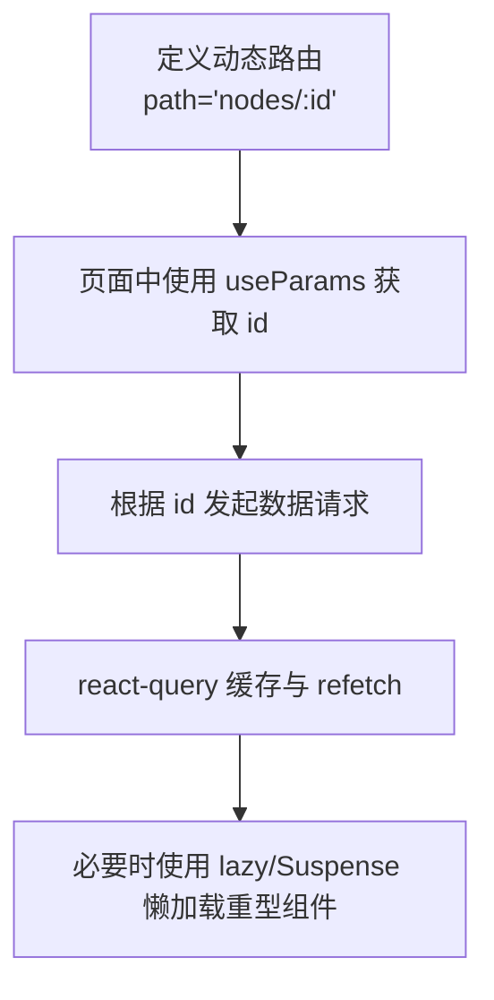
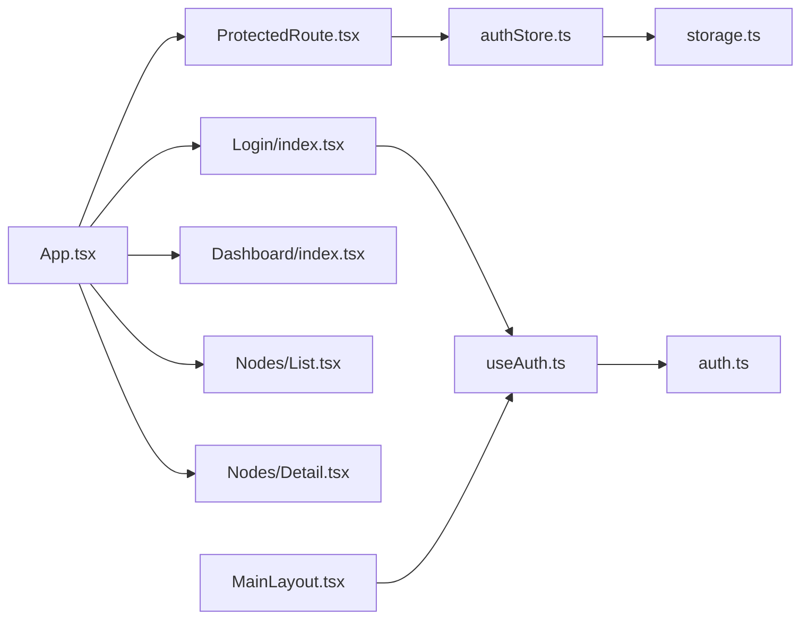

# 路由与安全

<cite>
**本文引用的文件**
- [web/src/App.tsx](file://web/src/App.tsx)
- [web/src/router/ProtectedRoute.tsx](file://web/src/router/ProtectedRoute.tsx)
- [web/src/stores/authStore.ts](file://web/src/stores/authStore.ts)
- [web/src/hooks/useAuth.ts](file://web/src/hooks/useAuth.ts)
- [web/src/pages/Login/index.tsx](file://web/src/pages/Login/index.tsx)
- [web/src/api/auth.ts](file://web/src/api/auth.ts)
- [web/src/utils/storage.ts](file://web/src/utils/storage.ts)
- [web/src/components/Layout/MainLayout.tsx](file://web/src/components/Layout/MainLayout.tsx)
- [web/src/pages/Dashboard/index.tsx](file://web/src/pages/Dashboard/index.tsx)
- [web/src/pages/Nodes/Detail.tsx](file://web/src/pages/Nodes/Detail.tsx)
- [web/src/pages/Nodes/List.tsx](file://web/src/pages/Nodes/List.tsx)
- [web/src/types/user.ts](file://web/src/types/user.ts)
- [docs/设计文档_04_Web前端模块.md](file://docs/设计文档_04_Web前端模块.md)
</cite>

## 目录
1. [引言](#引言)
2. [项目结构](#项目结构)
3. [核心组件](#核心组件)
4. [架构总览](#架构总览)
5. [详细组件分析](#详细组件分析)
6. [依赖关系分析](#依赖关系分析)
7. [性能考量](#性能考量)
8. [故障排查指南](#故障排查指南)
9. [结论](#结论)
10. [附录](#附录)

## 引言
本文件聚焦于 React Router 6 的路由配置与权限控制机制，围绕以下目标展开：
- 解析 ProtectedRoute 如何基于 authStore 的认证状态实现路由守卫，阻止未授权访问；
- 阐述登录页面（Login）的认证流程，包括表单验证、JWT 获取与重定向逻辑；
- 说明 Dashboard 等受保护页面的加载状态管理与错误边界处理；
- 提供路由懒加载、动态路由参数处理与 URL 查询参数解析的最佳实践建议。

## 项目结构
前端路由与安全相关的关键文件组织如下：
- 应用入口与路由配置：App.tsx
- 路由守卫：ProtectedRoute.tsx
- 认证状态管理：authStore.ts（Zustand + persist）
- 认证 Hook：useAuth.ts（封装登录、登出、用户资料获取等）
- 登录页面：Login/index.tsx
- API 层：auth.ts（登录、注册、修改密码、获取资料）
- 存储工具：storage.ts（localStorage 封装）
- 布局与导航：MainLayout.tsx
- 受保护页面示例：Dashboard/index.tsx、Nodes/Detail.tsx、Nodes/List.tsx
- 类型定义：user.ts

**图示来源**
- [web/src/App.tsx](file://web/src/App.tsx#L1-L57)
- [web/src/router/ProtectedRoute.tsx](file://web/src/router/ProtectedRoute.tsx#L1-L38)
- [web/src/stores/authStore.ts](file://web/src/stores/authStore.ts#L1-L85)
- [web/src/hooks/useAuth.ts](file://web/src/hooks/useAuth.ts#L1-L73)
- [web/src/pages/Login/index.tsx](file://web/src/pages/Login/index.tsx#L1-L110)
- [web/src/api/auth.ts](file://web/src/api/auth.ts#L1-L43)
- [web/src/utils/storage.ts](file://web/src/utils/storage.ts#L1-L48)
- [web/src/components/Layout/MainLayout.tsx](file://web/src/components/Layout/MainLayout.tsx#L1-L184)
- [web/src/pages/Dashboard/index.tsx](file://web/src/pages/Dashboard/index.tsx#L1-L193)
- [web/src/pages/Nodes/Detail.tsx](file://web/src/pages/Nodes/Detail.tsx#L1-L1110)
- [web/src/pages/Nodes/List.tsx](file://web/src/pages/Nodes/List.tsx#L1-L183)
- [web/src/types/user.ts](file://web/src/types/user.ts#L1-L52)

**章节来源**
- [web/src/App.tsx](file://web/src/App.tsx#L1-L57)

## 核心组件
- 路由守卫 ProtectedRoute：基于 authStore 的 isAuthenticated 与 _hasHydrated 状态进行判断，未水合时显示加载指示，未认证则跳转到登录页。
- 认证状态管理 authStore：使用 Zustand + persist，持久化 token 与用户信息，并在水合完成后修正 isAuthenticated。
- 登录页面 Login：使用 react-hook-form 进行表单校验，提交后通过 useAuth.login 调用 API 并在成功后重定向至受保护页面。
- 认证 Hook useAuth：封装登录、注册、修改密码、获取资料与登出，统一暴露状态与错误信息。
- API 层 auth.ts：封装登录、注册、修改密码、获取资料等接口。
- 存储工具 storage.ts：封装 localStorage 的 token 与用户信息读写。
- 布局 MainLayout：提供导航菜单、侧边栏与登出逻辑，登出时调用 useAuth.logout 并跳转到登录页。

**章节来源**
- [web/src/router/ProtectedRoute.tsx](file://web/src/router/ProtectedRoute.tsx#L1-L38)
- [web/src/stores/authStore.ts](file://web/src/stores/authStore.ts#L1-L85)
- [web/src/pages/Login/index.tsx](file://web/src/pages/Login/index.tsx#L1-L110)
- [web/src/hooks/useAuth.ts](file://web/src/hooks/useAuth.ts#L1-L73)
- [web/src/api/auth.ts](file://web/src/api/auth.ts#L1-L43)
- [web/src/utils/storage.ts](file://web/src/utils/storage.ts#L1-L48)
- [web/src/components/Layout/MainLayout.tsx](file://web/src/components/Layout/MainLayout.tsx#L1-L184)

## 架构总览
React Router 6 在应用入口中配置路由，受保护页面通过 ProtectedRoute 包裹，内部依赖 authStore 的认证状态进行守卫。登录流程通过 useAuth.login 触发 API 调用，成功后将 token 与用户信息写入 authStore 与 localStorage，随后受保护页面可正常渲染。

**图示来源**
- [web/src/App.tsx](file://web/src/App.tsx#L1-L57)
- [web/src/router/ProtectedRoute.tsx](file://web/src/router/ProtectedRoute.tsx#L1-L38)
- [web/src/hooks/useAuth.ts](file://web/src/hooks/useAuth.ts#L1-L73)
- [web/src/api/auth.ts](file://web/src/api/auth.ts#L1-L43)
- [web/src/stores/authStore.ts](file://web/src/stores/authStore.ts#L1-L85)
- [web/src/utils/storage.ts](file://web/src/utils/storage.ts#L1-L48)
- [web/src/components/Layout/MainLayout.tsx](file://web/src/components/Layout/MainLayout.tsx#L1-L184)

## 详细组件分析

### 路由守卫 ProtectedRoute
- 作用：作为受保护页面的前置守卫，依据 authStore 的 isAuthenticated 与 _hasHydrated 状态决定是否放行。
- 行为：
  - 若 _hasHydrated 为 false，显示加载指示，等待状态从 localStorage 恢复完成；
  - 若 isAuthenticated 为 false，重定向到 /login；
  - 否则渲染子组件（受保护页面）。
- 关键点：_hasHydrated 用于避免首次渲染时因状态尚未从持久化恢复导致的误判。

**图示来源**
- [web/src/router/ProtectedRoute.tsx](file://web/src/router/ProtectedRoute.tsx#L1-L38)
- [web/src/stores/authStore.ts](file://web/src/stores/authStore.ts#L1-L85)

**章节来源**
- [web/src/router/ProtectedRoute.tsx](file://web/src/router/ProtectedRoute.tsx#L1-L38)
- [web/src/stores/authStore.ts](file://web/src/stores/authStore.ts#L1-L85)

### 认证状态管理 authStore
- 状态字段：user、token、isAuthenticated、_hasHydrated。
- 持久化策略：persist 中仅保存 user、token、isAuthenticated，onRehydrateStorage 中根据恢复数据修正 isAuthenticated，并标记 _hasHydrated。
- 行为：
  - setAuth：写入用户与 token，设置 isAuthenticated 为真；
  - clearAuth：清空用户与 token，设置 isAuthenticated 为假；
  - updateUser：更新用户信息并持久化；
  - setHasHydrated：标记水合完成。

**图示来源**
- [web/src/stores/authStore.ts](file://web/src/stores/authStore.ts#L1-L85)
- [web/src/utils/storage.ts](file://web/src/utils/storage.ts#L1-L48)

**章节来源**
- [web/src/stores/authStore.ts](file://web/src/stores/authStore.ts#L1-L85)
- [web/src/utils/storage.ts](file://web/src/utils/storage.ts#L1-L48)

### 登录页面 Login 的认证流程
- 表单验证：使用 react-hook-form 对用户名与密码进行必填校验，错误信息通过 Alert 展示。
- 提交流程：onSubmit 中调用 useAuth.login(data)，成功后 navigate('/dashboard')。
- 错误处理：捕获异常并设置错误信息，同时 useAuth.loginMutation.error 也会在组件中展示。
- JWT 获取：useAuth.login 调用 auth.ts 的 login 接口，成功后通过 setAuth 写入 token 与用户信息，从而触发守卫放行。

**图示来源**
- [web/src/pages/Login/index.tsx](file://web/src/pages/Login/index.tsx#L1-L110)
- [web/src/hooks/useAuth.ts](file://web/src/hooks/useAuth.ts#L1-L73)
- [web/src/api/auth.ts](file://web/src/api/auth.ts#L1-L43)
- [web/src/stores/authStore.ts](file://web/src/stores/authStore.ts#L1-L85)

**章节来源**
- [web/src/pages/Login/index.tsx](file://web/src/pages/Login/index.tsx#L1-L110)
- [web/src/hooks/useAuth.ts](file://web/src/hooks/useAuth.ts#L1-L73)
- [web/src/api/auth.ts](file://web/src/api/auth.ts#L1-L43)
- [web/src/types/user.ts](file://web/src/types/user.ts#L1-L52)

### 受保护页面的加载状态与错误边界
- Dashboard：使用 react-query 的 useClusterOverview 获取数据，结合 isLoading、error、refetch、dataUpdatedAt 等状态进行加载指示、错误提示与最后更新时间展示。
- Nodes/Detail：在节点详情页中，针对 error、isLoading、节点不存在等情况分别渲染错误提示、加载指示与“节点不存在”提示；监控 Tab 中使用 Suspense 对懒加载图表组件进行加载兜底。
- Nodes/List：分页与加载状态管理，表格在加载时显示进度条，空数据时显示提示。

**图示来源**
- [web/src/pages/Dashboard/index.tsx](file://web/src/pages/Dashboard/index.tsx#L1-L193)
- [web/src/pages/Nodes/Detail.tsx](file://web/src/pages/Nodes/Detail.tsx#L1-L1110)
- [web/src/pages/Nodes/List.tsx](file://web/src/pages/Nodes/List.tsx#L1-L183)

**章节来源**
- [web/src/pages/Dashboard/index.tsx](file://web/src/pages/Dashboard/index.tsx#L1-L193)
- [web/src/pages/Nodes/Detail.tsx](file://web/src/pages/Nodes/Detail.tsx#L1-L1110)
- [web/src/pages/Nodes/List.tsx](file://web/src/pages/Nodes/List.tsx#L1-L183)

### 路由懒加载、动态路由参数与查询参数最佳实践
- 路由懒加载：参考设计文档中的示例，使用 React.lazy 与 Suspense 对大型页面进行懒加载，提升首屏性能。
- 动态路由参数：在路由定义中使用冒号语法声明参数，在页面中通过 useParams 获取；例如节点详情路由 path="nodes/:id"，在页面中读取 id 并发起数据请求。
- URL 查询参数：在页面中可通过 URLSearchParams 或第三方库解析查询参数，结合 react-query 的查询键进行缓存与刷新控制。

**图示来源**
- [web/src/App.tsx](file://web/src/App.tsx#L1-L57)
- [web/src/pages/Nodes/Detail.tsx](file://web/src/pages/Nodes/Detail.tsx#L1-L1110)
- [docs/设计文档_04_Web前端模块.md](file://docs/设计文档_04_Web前端模块.md#L1324-L1399)

**章节来源**
- [web/src/App.tsx](file://web/src/App.tsx#L1-L57)
- [web/src/pages/Nodes/Detail.tsx](file://web/src/pages/Nodes/Detail.tsx#L1-L1110)
- [docs/设计文档_04_Web前端模块.md](file://docs/设计文档_04_Web前端模块.md#L1324-L1399)

## 依赖关系分析
- App.tsx 依赖 ProtectedRoute、MainLayout、Login、Dashboard、Nodes 等组件；
- ProtectedRoute 依赖 authStore；
- Login 依赖 useAuth；
- useAuth 依赖 auth.ts 与 authStore；
- authStore 依赖 storage.ts；
- MainLayout 依赖 useAuth 与 useNavigate。

**图示来源**
- [web/src/App.tsx](file://web/src/App.tsx#L1-L57)
- [web/src/router/ProtectedRoute.tsx](file://web/src/router/ProtectedRoute.tsx#L1-L38)
- [web/src/stores/authStore.ts](file://web/src/stores/authStore.ts#L1-L85)
- [web/src/hooks/useAuth.ts](file://web/src/hooks/useAuth.ts#L1-L73)
- [web/src/api/auth.ts](file://web/src/api/auth.ts#L1-L43)
- [web/src/utils/storage.ts](file://web/src/utils/storage.ts#L1-L48)
- [web/src/components/Layout/MainLayout.tsx](file://web/src/components/Layout/MainLayout.tsx#L1-L184)

**章节来源**
- [web/src/App.tsx](file://web/src/App.tsx#L1-L57)

## 性能考量
- 路由懒加载：对大型页面（如 Dashboard、Nodes 列表与详情）采用 lazy 与 Suspense，减少首屏体积与初次渲染时间。
- 数据缓存与刷新：react-query 的 staleTime、refetchOnWindowFocus 等配置降低无效请求；受保护页面使用 refetch 与定时刷新控制数据新鲜度。
- 组件优化：合理使用 useMemo/useCallback 缓存计算结果与回调函数，避免不必要的重渲染。
- 加载与错误边界：在关键页面中提供 Loading 与 Error 的明确反馈，提升用户体验。

[本节为通用指导，无需列出具体文件来源]

## 故障排查指南
- 登录失败：
  - 检查 useAuth.login 的错误信息与 Login 组件中的错误展示；
  - 确认 auth.ts 的登录接口返回结构与 useAuth.login 的 onSuccess 处理一致；
  - 查看 authStore.setAuth 是否成功写入 token 与用户信息。
- 无法进入受保护页面：
  - 检查 ProtectedRoute 的 _hasHydrated 与 isAuthenticated 状态；
  - 确认 authStore 的 persist 是否正确读取 localStorage；
  - 若首次加载即跳转登录，确认水合流程是否执行。
- 页面空白或加载卡住：
  - 检查 Dashboard/Nodes 页面的 isLoading、error、data 状态分支；
  - 确认 react-query 的查询键与 refetch 逻辑；
  - 对懒加载组件，检查 Suspense fallback 是否覆盖到图表组件。
- 登出后仍可访问：
  - 确认 MainLayout 的登出逻辑调用了 useAuth.logout 并清空了 authStore；
  - 检查 ProtectedRoute 是否再次读取到已清空的状态。

**章节来源**
- [web/src/pages/Login/index.tsx](file://web/src/pages/Login/index.tsx#L1-L110)
- [web/src/hooks/useAuth.ts](file://web/src/hooks/useAuth.ts#L1-L73)
- [web/src/api/auth.ts](file://web/src/api/auth.ts#L1-L43)
- [web/src/stores/authStore.ts](file://web/src/stores/authStore.ts#L1-L85)
- [web/src/router/ProtectedRoute.tsx](file://web/src/router/ProtectedRoute.tsx#L1-L38)
- [web/src/components/Layout/MainLayout.tsx](file://web/src/components/Layout/MainLayout.tsx#L1-L184)
- [web/src/pages/Dashboard/index.tsx](file://web/src/pages/Dashboard/index.tsx#L1-L193)
- [web/src/pages/Nodes/Detail.tsx](file://web/src/pages/Nodes/Detail.tsx#L1-L1110)

## 结论
本项目以 React Router 6 为基础，结合 Zustand 的 authStore 与持久化策略，构建了清晰的路由守卫与认证流程。登录页面通过表单校验与 useAuth.login 完成认证，受保护页面通过 ProtectedRoute 与 MainLayout 提供导航与登出能力。页面层面采用 react-query 管理加载与错误状态，并配合懒加载与组件优化提升性能与体验。建议在后续迭代中补充 GuestGuard 与更完善的查询参数解析与动态路由参数处理，进一步完善路由安全与灵活性。

[本节为总结性内容，无需列出具体文件来源]

## 附录
- 路由守卫概念参考：设计文档中提供了 GuestGuard 与 ProtectedRoute 的思路，可作为扩展实现的参考。
- 类型定义：user.ts 提供了用户角色与登录请求/响应的类型，便于前后端契约一致。

**章节来源**
- [docs/设计文档_04_Web前端模块.md](file://docs/设计文档_04_Web前端模块.md#L411-L432)
- [web/src/types/user.ts](file://web/src/types/user.ts#L1-L52)