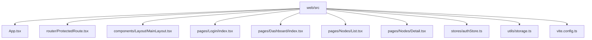
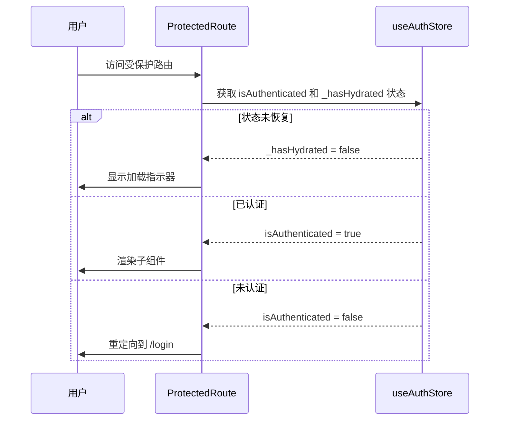
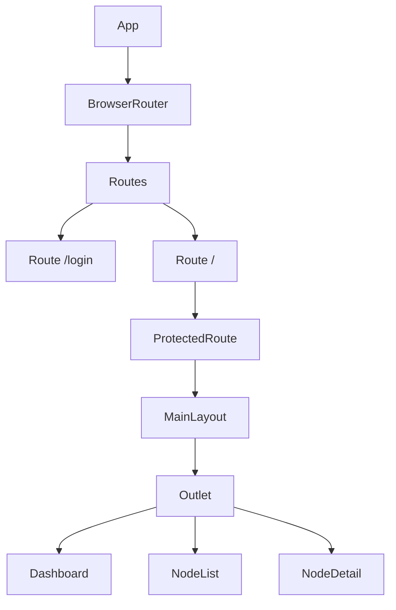
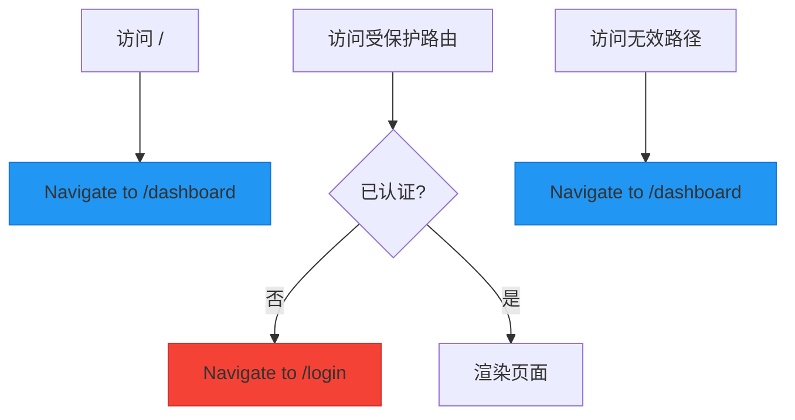
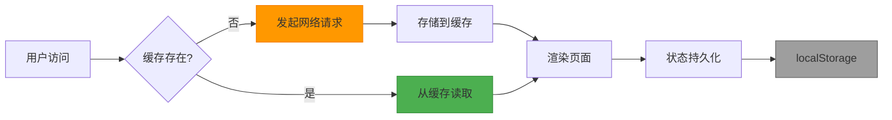

# 路由配置

<cite>
**本文档引用文件**  
- [App.tsx](file://web/src/App.tsx#L1-L56)
- [ProtectedRoute.tsx](file://web/src/router/ProtectedRoute.tsx#L1-L37)
- [MainLayout.tsx](file://web/src/components/Layout/MainLayout.tsx#L1-L184)
- [Login/index.tsx](file://web/src/pages/Login/index.tsx#L1-L110)
- [Dashboard/index.tsx](file://web/src/pages/Dashboard/index.tsx#L1-L193)
- [Nodes/List.tsx](file://web/src/pages/Nodes/List.tsx#L1-L183)
- [Nodes/Detail.tsx](file://web/src/pages/Nodes/Detail.tsx#L1-L800)
- [authStore.ts](file://web/src/stores/authStore.ts#L1-L85)
- [useAuth.ts](file://web/src/hooks/useAuth.ts#L1-L73)
- [storage.ts](file://web/src/utils/storage.ts#L1-L48)
- [vite.config.ts](file://web/vite.config.ts#L1-L38)
- [前端开发规范.md](file://docs/前端开发规范.md#L593-L678)
- [设计文档_04_Web前端模块.md](file://docs/设计文档_04_Web前端模块.md#L411-L432)
</cite>

## 目录
1. [项目结构](#项目结构)
2. [核心路由配置](#核心路由配置)
3. [路由保护机制](#路由保护机制)
4. [嵌套路由与布局](#嵌套路由与布局)
5. [动态路由参数处理](#动态路由参数处理)
6. [页面重定向实现](#页面重定向实现)
7. [性能优化策略](#性能优化策略)
8. [配置要点总结](#配置要点总结)

## 项目结构

前端路由相关文件主要位于 `web/src` 目录下，核心结构如下：



**图示来源**  
- [App.tsx](file://web/src/App.tsx#L1-L56)
- [ProtectedRoute.tsx](file://web/src/router/ProtectedRoute.tsx#L1-L37)
- [MainLayout.tsx](file://web/src/components/Layout/MainLayout.tsx#L1-L184)

## 核心路由配置

项目使用 React Router 6 进行路由管理，通过 `BrowserRouter` 组件实现基于 HTML5 History API 的客户端路由。在 `App.tsx` 中定义了应用的主路由结构，包含登录页、仪表盘、节点管理等核心页面的路径映射。

路由配置采用嵌套结构，将需要认证的页面包裹在 `ProtectedRoute` 组件中，实现路由级别的权限控制。未匹配的路径会自动重定向到仪表盘页面，确保用户体验的一致性。

```mermaid
flowchart TD
A[/login] --> B[Login Page]
C[/] --> D[ProtectedRoute]
D --> E[/dashboard]
D --> F[/nodes]
D --> G[/nodes/:id]
H[*] --> I[Redirect to /dashboard]
style A fill:#4CAF50,stroke:#388E3C
style E fill:#2196F3,stroke:#1976D2
style F fill:#FF9800,stroke:#F57C00
style G fill:#9C27B0,stroke:#7B1FA2
style H fill:#607D8B,stroke:#455A64
```

**图示来源**  
- [App.tsx](file://web/src/App.tsx#L34-L48)
- [前端开发规范.md](file://docs/前端开发规范.md#L598-L602)

**本节来源**  
- [App.tsx](file://web/src/App.tsx#L5-L56)
- [前端开发规范.md](file://docs/前端开发规范.md#L593-L678)

## 路由保护机制

路由保护通过自定义的 `ProtectedRoute` 组件实现，该组件利用 Zustand 状态管理库中的 `useAuthStore` 钩子来检查用户的认证状态。当用户未登录时，组件会自动重定向到登录页面。

保护机制包含两个关键状态检查：
1. `_hasHydrated`：确保从持久化存储恢复状态已完成
2. `isAuthenticated`：验证用户是否已通过身份验证

在状态恢复期间，组件会显示加载指示器，提供良好的用户体验。



**图示来源**  
- [ProtectedRoute.tsx](file://web/src/router/ProtectedRoute.tsx#L13-L37)
- [authStore.ts](file://web/src/stores/authStore.ts#L10-L21)

**本节来源**  
- [ProtectedRoute.tsx](file://web/src/router/ProtectedRoute.tsx#L1-L37)
- [authStore.ts](file://web/src/stores/authStore.ts#L1-L85)
- [设计文档_04_Web前端模块.md](file://docs/设计文档_04_Web前端模块.md#L411-L427)

## 嵌套路由与布局

项目采用嵌套路由模式，通过 `MainLayout` 组件实现统一的页面布局。主布局包含顶部导航栏、侧边栏菜单和内容区域，所有受保护的页面都共享这一布局结构。

嵌套路由的实现方式如下：
- 根路由 `/` 使用 `ProtectedRoute` 进行保护
- 子路由 `dashboard`、`nodes` 等作为 `MainLayout` 的内容区域渲染
- 使用 `Outlet` 组件作为子路由的占位符

这种设计实现了布局与内容的分离，提高了代码的可维护性和复用性。



**图示来源**  
- [App.tsx](file://web/src/App.tsx#L32-L48)
- [MainLayout.tsx](file://web/src/components/Layout/MainLayout.tsx#L6-L184)

**本节来源**  
- [App.tsx](file://web/src/App.tsx#L27-L56)
- [MainLayout.tsx](file://web/src/components/Layout/MainLayout.tsx#L1-L184)

## 动态路由参数处理

项目中的节点详情页面使用了动态路由参数，路径格式为 `/nodes/:id`。通过 `useParams` 钩子可以获取 URL 中的动态参数，实现基于节点 ID 的数据加载和页面渲染。

在 `NodeDetail` 组件中，`useParams` 钩子用于获取节点 ID，并将其作为参数传递给数据获取钩子，从而加载特定节点的详细信息。这种方式使得单个组件可以处理多个不同的数据实体，提高了代码的复用性。

```mermaid
flowchart LR
A[/nodes/123] --> B[NodeDetail]
B --> C[useParams]
C --> D[nodeId = "123"]
D --> E[useNode(nodeId)]
E --> F[加载节点数据]
F --> G[渲染节点详情]
style A fill:#FF9800,stroke:#F57C00
style B fill:#9C27B0,stroke:#7B1FA2
```

**图示来源**  
- [Nodes/Detail.tsx](file://web/src/pages/Nodes/Detail.tsx#L82-L124)
- [Nodes/List.tsx](file://web/src/pages/Nodes/List.tsx#L123-L134)

**本节来源**  
- [Nodes/Detail.tsx](file://web/src/pages/Nodes/Detail.tsx#L1-L800)
- [Nodes/List.tsx](file://web/src/pages/Nodes/List.tsx#L1-L183)

## 页面重定向实现

页面重定向通过 React Router 6 的 `Navigate` 组件实现，主要应用于以下场景：

1. **默认路由重定向**：根路径 `/` 重定向到 `/dashboard`
2. **未授权访问重定向**：未认证用户访问受保护路由时重定向到 `/login`
3. **未匹配路径重定向**：无效路径重定向到 `/dashboard`

`Navigate` 组件的 `replace` 属性设置为 `true`，确保重定向不会在浏览器历史中留下记录，避免用户通过后退按钮返回到不需要的页面。



**图示来源**  
- [App.tsx](file://web/src/App.tsx#L43-L48)
- [ProtectedRoute.tsx](file://web/src/router/ProtectedRoute.tsx#L33-L34)

**本节来源**  
- [App.tsx](file://web/src/App.tsx#L43-L48)
- [ProtectedRoute.tsx](file://web/src/router/ProtectedRoute.tsx#L32-L34)

## 性能优化策略

项目通过多种方式优化路由相关的性能表现：

1. **代码分割**：在 `vite.config.ts` 中配置了 `manualChunks`，将大型依赖库（如 Recharts、MUI）分割成独立的代码块，实现按需加载
2. **状态持久化**：使用 `zustand/middleware` 的 `persist` 功能，将认证状态持久化到 `localStorage`，避免页面刷新后重新登录
3. **数据缓存**：通过 `@tanstack/react-query` 实现数据的智能缓存和自动刷新，减少不必要的网络请求

这些优化措施共同提升了应用的首屏加载速度和整体响应性能。



**图示来源**  
- [vite.config.ts](file://web/vite.config.ts#L20-L33)
- [authStore.ts](file://web/src/stores/authStore.ts#L23-L84)
- [App.tsx](file://web/src/App.tsx#L17-L25)

**本节来源**  
- [vite.config.ts](file://web/vite.config.ts#L1-L38)
- [authStore.ts](file://web/src/stores/authStore.ts#L1-L85)
- [App.tsx](file://web/src/App.tsx#L16-L25)
- [storage.ts](file://web/src/utils/storage.ts#L1-L48)

## 配置要点总结

React Router 6 在本项目中的配置要点总结如下：

1. **BrowserRouter 配置**：作为路由根组件，包裹所有路由定义
2. **Routes 组件**：包含所有 Route 定义，实现路由匹配
3. **Route 组件**：定义路径与组件的映射关系，支持嵌套
4. **Navigate 组件**：实现页面重定向，`replace` 属性避免历史记录堆积
5. **ProtectedRoute 组件**：自定义路由守卫，基于认证状态控制访问权限
6. **动态参数**：使用 `:param` 语法定义动态路由，通过 `useParams` 钩子获取参数
7. **嵌套路由**：通过 `Outlet` 组件实现布局与内容的分离

这些配置共同构建了一个结构清晰、易于维护的前端路由系统。

**本节来源**  
- [App.tsx](file://web/src/App.tsx#L5-L56)
- [ProtectedRoute.tsx](file://web/src/router/ProtectedRoute.tsx#L1-L37)
- [前端开发规范.md](file://docs/前端开发规范.md#L593-L678)