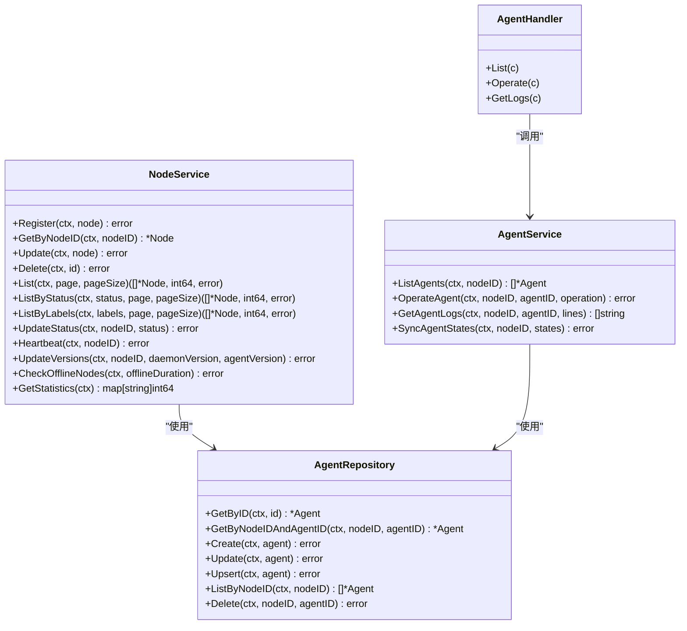
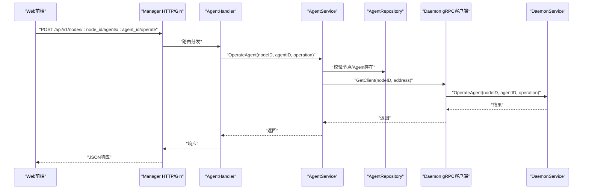
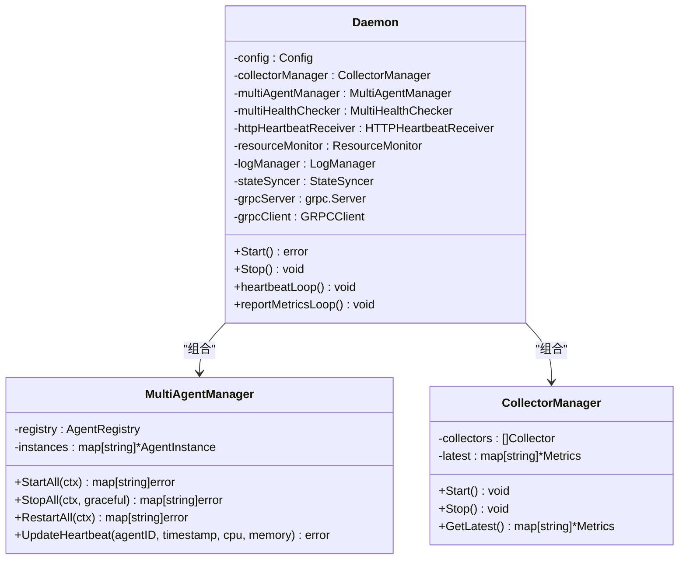
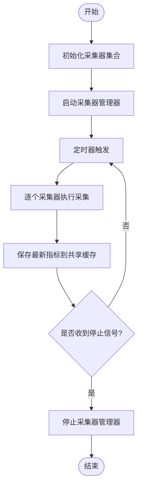
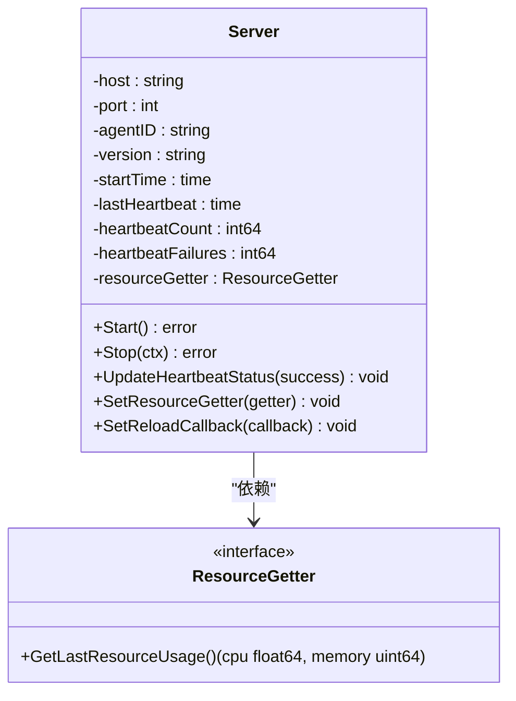
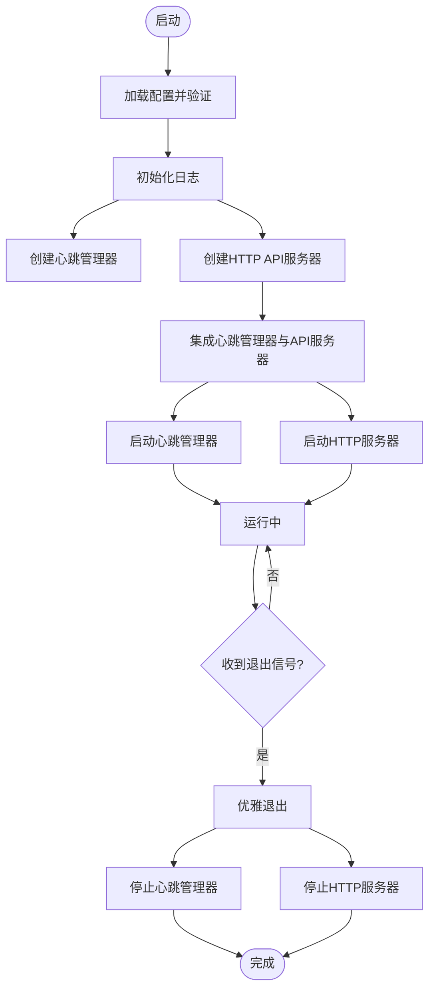
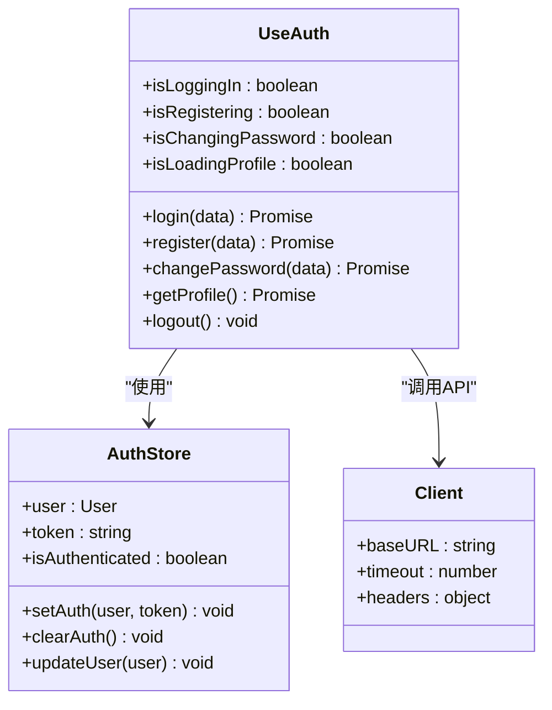
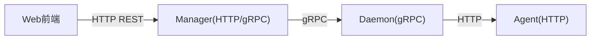

# 核心模块

<cite>
**本文引用的文件**
- [manager/cmd/manager/main.go](file://manager/cmd/manager/main.go)
- [manager/internal/service/node.go](file://manager/internal/service/node.go)
- [manager/internal/service/agent.go](file://manager/internal/service/agent.go)
- [manager/internal/handler/agent.go](file://manager/internal/handler/agent.go)
- [manager/internal/repository/agent.go](file://manager/internal/repository/agent.go)
- [manager/internal/model/agent.go](file://manager/internal/model/agent.go)
- [daemon/cmd/daemon/main.go](file://daemon/cmd/daemon/main.go)
- [daemon/internal/daemon/daemon.go](file://daemon/internal/daemon/daemon.go)
- [daemon/internal/config/config.go](file://daemon/internal/config/config.go)
- [daemon/internal/agent/manager.go](file://daemon/internal/agent/manager.go)
- [daemon/internal/agent/multi_manager.go](file://daemon/internal/agent/multi_manager.go)
- [daemon/internal/collector/manager.go](file://daemon/internal/collector/manager.go)
- [agent/cmd/agent/main.go](file://agent/cmd/agent/main.go)
- [agent/internal/api/server.go](file://agent/internal/api/server.go)
- [web/src/App.tsx](file://web/src/App.tsx)
- [web/src/api/client.ts](file://web/src/api/client.ts)
- [web/src/stores/authStore.ts](file://web/src/stores/authStore.ts)
- [web/src/hooks/useAuth.ts](file://web/src/hooks/useAuth.ts)
</cite>

## 目录
1. [引言](#引言)
2. [项目结构](#项目结构)
3. [核心组件](#核心组件)
4. [架构总览](#架构总览)
5. [详细组件分析](#详细组件分析)
6. [依赖分析](#依赖分析)
7. [性能考虑](#性能考虑)
8. [故障排查指南](#故障排查指南)
9. [结论](#结论)
10. [附录](#附录)

## 引言
本文件面向运维框架的四大核心模块：Manager、Daemon、Agent、Web前端，系统性梳理其架构设计、数据流、处理逻辑与集成关系。文档以代码为依据，通过类图、时序图与流程图展示模块内部实现与调用链路，帮助开发者快速理解与扩展系统。

## 项目结构
- Manager：基于Gin的API网关，结合业务服务层（NodeService、TaskSvc等）、数据访问层（GORM Repository）、gRPC客户端/服务器，提供节点与Agent管理、指标采集与清理、鉴权审计等能力。
- Daemon：守护进程核心引擎，负责资源采集器（CPU/内存/磁盘/网络）、Agent生命周期管理（单Agent/多Agent）、心跳接收器、资源监控与日志管理，并向上游Manager上报心跳与指标。
- Agent：Agent进程的HTTP/HTTPS服务、任务执行引擎、心跳上报机制与插件扩展能力，支持与Daemon的心跳对接与指标暴露。
- Web前端：基于React的组件化设计，使用Zustand进行状态管理，Axios/React Query进行API集成与缓存，ECharts进行数据可视化。

```mermaid
graph TB
subgraph "Manager"
M_Main["manager/cmd/manager/main.go"]
M_NodeSvc["manager/internal/service/node.go"]
M_AgentSvc["manager/internal/service/agent.go"]
M_AgentRepo["manager/internal/repository/agent.go"]
M_AgentModel["manager/internal/model/agent.go"]
M_AgentHandler["manager/internal/handler/agent.go"]
end
subgraph "Daemon"
D_Main["daemon/cmd/daemon/main.go"]
D_Daemon["daemon/internal/daemon/daemon.go"]
D_Config["daemon/internal/config/config.go"]
D_CollectorMgr["daemon/internal/collector/manager.go"]
D_AgentMgr["daemon/internal/agent/manager.go"]
D_MultiMgr["daemon/internal/agent/multi_manager.go"]
end
subgraph "Agent"
A_Main["agent/cmd/agent/main.go"]
A_API["agent/internal/api/server.go"]
end
subgraph "Web"
W_App["web/src/App.tsx"]
W_Client["web/src/api/client.ts"]
W_Store["web/src/stores/authStore.ts"]
W_Hook["web/src/hooks/useAuth.ts"]
end
M_Main --> M_NodeSvc
M_Main --> M_AgentSvc
M_AgentSvc --> M_AgentRepo
M_AgentRepo --> M_AgentModel
M_AgentSvc --> M_AgentHandler
D_Main --> D_Daemon
D_Daemon --> D_Config
D_Daemon --> D_CollectorMgr
D_Daemon --> D_AgentMgr
D_Daemon --> D_MultiMgr
A_Main --> A_API
W_App --> W_Client
W_App --> W_Store
W_App --> W_Hook
```



图表来源
- [manager/cmd/manager/main.go](file://manager/cmd/manager/main.go#L1-L290)
- [manager/internal/service/node.go](file://manager/internal/service/node.go#L1-L234)
- [manager/internal/service/agent.go](file://manager/internal/service/agent.go#L1-L298)
- [manager/internal/handler/agent.go](file://manager/internal/handler/agent.go#L1-L161)
- [manager/internal/repository/agent.go](file://manager/internal/repository/agent.go#L1-L138)
- [manager/internal/model/agent.go](file://manager/internal/model/agent.go#L1-L53)
- [daemon/cmd/daemon/main.go](file://daemon/cmd/daemon/main.go#L1-L65)
- [daemon/internal/daemon/daemon.go](file://daemon/internal/daemon/daemon.go#L1-L695)
- [daemon/internal/config/config.go](file://daemon/internal/config/config.go#L1-L499)
- [daemon/internal/collector/manager.go](file://daemon/internal/collector/manager.go#L1-L124)
- [daemon/internal/agent/manager.go](file://daemon/internal/agent/manager.go#L1-L234)
- [daemon/internal/agent/multi_manager.go](file://daemon/internal/agent/multi_manager.go#L1-L529)
- [agent/cmd/agent/main.go](file://agent/cmd/agent/main.go#L1-L138)
- [agent/internal/api/server.go](file://agent/internal/api/server.go#L1-L217)
- [web/src/App.tsx](file://web/src/App.tsx#L1-L57)
- [web/src/api/client.ts](file://web/src/api/client.ts#L1-L18)
- [web/src/stores/authStore.ts](file://web/src/stores/authStore.ts#L1-L85)
- [web/src/hooks/useAuth.ts](file://web/src/hooks/useAuth.ts#L1-L73)

章节来源
- [manager/cmd/manager/main.go](file://manager/cmd/manager/main.go#L1-L290)
- [daemon/cmd/daemon/main.go](file://daemon/cmd/daemon/main.go#L1-L65)
- [agent/cmd/agent/main.go](file://agent/cmd/agent/main.go#L1-L138)
- [web/src/App.tsx](file://web/src/App.tsx#L1-L57)

## 核心组件
- Manager模块
  - API网关层：基于Gin，注册路由、中间件（恢复、日志、CORS、JWT鉴权、审计），提供公开与受保护的REST接口。
  - 业务服务层：NodeService、AgentService、MetricsService、TaskService、VersionService等，封装领域逻辑与跨仓储操作。
  - 数据访问层：GORM Repository，提供统一的CRUD与复杂查询封装。
  - gRPC：同时作为ManagerService服务器（接收Daemon上报）与DaemonService客户端（下发Agent操作指令）。
- Daemon模块
  - 守护进程引擎：统一管理Agent生命周期、资源采集、心跳上报、指标上报、日志管理与gRPC服务。
  - 多Agent支持：新式MultiAgentManager与旧式Manager并存，兼容历史配置。
  - 资源采集器：CPU/内存/磁盘/网络采集器聚合管理，定时采集并缓存最新指标。
- Agent模块
  - HTTP服务：健康检查、指标暴露、配置重载等接口。
  - 心跳上报：与Daemon的HTTP心跳接收器对接，维护心跳状态与资源使用。
  - 插件扩展：通过配置加载Agent实例，支持多Agent并行运行。
- Web前端模块
  - 组件化：基于React Router与Material UI主题。
  - 状态管理：Zustand持久化存储用户认证信息。
  - API集成：Axios客户端与React Query缓存策略，统一拦截器与错误处理。
  - 数据可视化：ECharts用于图表渲染（在页面组件中使用）。

章节来源
- [manager/internal/service/node.go](file://manager/internal/service/node.go#L1-L234)
- [manager/internal/service/agent.go](file://manager/internal/service/agent.go#L1-L298)
- [manager/internal/handler/agent.go](file://manager/internal/handler/agent.go#L1-L161)
- [manager/internal/repository/agent.go](file://manager/internal/repository/agent.go#L1-L138)
- [manager/internal/model/agent.go](file://manager/internal/model/agent.go#L1-L53)
- [daemon/internal/daemon/daemon.go](file://daemon/internal/daemon/daemon.go#L1-L695)
- [daemon/internal/config/config.go](file://daemon/internal/config/config.go#L1-L499)
- [daemon/internal/collector/manager.go](file://daemon/internal/collector/manager.go#L1-L124)
- [daemon/internal/agent/manager.go](file://daemon/internal/agent/manager.go#L1-L234)
- [daemon/internal/agent/multi_manager.go](file://daemon/internal/agent/multi_manager.go#L1-L529)
- [agent/internal/api/server.go](file://agent/internal/api/server.go#L1-L217)
- [web/src/api/client.ts](file://web/src/api/client.ts#L1-L18)
- [web/src/stores/authStore.ts](file://web/src/stores/authStore.ts#L1-L85)
- [web/src/hooks/useAuth.ts](file://web/src/hooks/useAuth.ts#L1-L73)

## 架构总览
Manager与Daemon通过gRPC双向交互：Manager作为控制面，Daemon作为数据面与执行面。Agent作为末端节点的执行单元，既可被Daemon托管，也可直接对外提供HTTP服务。

```mermaid
graph TB
subgraph "Manager"
M_HTTP["Gin HTTP 服务器<br/>/api/v1/*"]
M_GRPC_S["ManagerService gRPC 服务器"]
M_Services["业务服务层<br/>Node/Agent/Metrics/Task/Version"]
M_Repositories["GORM 仓库层"]
end
subgraph "Daemon"
D_GRPC_C["gRPC 客户端<br/>ManagerService"]
D_GRPC_S["DaemonService gRPC 服务器"]
D_Collectors["资源采集器管理器"]
D_AgentMgr["Agent 生命周期管理器"]
D_HTTP["HTTP 心跳接收器"]
end
subgraph "Agent"
A_HTTP["Agent HTTP 服务"]
A_Heartbeat["心跳上报"]
end
M_HTTP --> M_Services
M_Services --> M_Repositories
M_GRPC_S <- --> D_GRPC_C
D_GRPC_S <- --> M_GRPC_S
D_Collectors --> D_GRPC_C
D_AgentMgr --> D_GRPC_S
D_HTTP --> D_GRPC_S
A_HTTP --> D_HTTP
A_Heartbeat --> D_HTTP
```

图表来源
- [manager/cmd/manager/main.go](file://manager/cmd/manager/main.go#L135-L245)
- [daemon/internal/daemon/daemon.go](file://daemon/internal/daemon/daemon.go#L240-L396)
- [agent/internal/api/server.go](file://agent/internal/api/server.go#L94-L196)

## 详细组件分析

### Manager模块

#### 架构与职责
- API网关层（Gin）：集中注册路由与中间件，区分公开与受保护接口；受保护接口附加JWT鉴权与审计中间件。
- 业务服务层：NodeService负责节点注册、心跳、状态更新与离线检测；AgentService负责Agent列表、操作与日志拉取（预留）。
- 数据访问层：GORM Repository封装Agent、Node、Metrics、Task、User、Version、AuditLog等模型的增删改查。
- gRPC：ManagerService服务器用于接收Daemon上报；DaemonService服务器用于向Daemon下发Agent操作指令。



图表来源
- [manager/internal/service/node.go](file://manager/internal/service/node.go#L1-L234)
- [manager/internal/service/agent.go](file://manager/internal/service/agent.go#L1-L298)
- [manager/internal/repository/agent.go](file://manager/internal/repository/agent.go#L1-L138)
- [manager/internal/handler/agent.go](file://manager/internal/handler/agent.go#L1-L161)

章节来源
- [manager/cmd/manager/main.go](file://manager/cmd/manager/main.go#L135-L245)
- [manager/internal/service/node.go](file://manager/internal/service/node.go#L1-L234)
- [manager/internal/service/agent.go](file://manager/internal/service/agent.go#L1-L298)
- [manager/internal/handler/agent.go](file://manager/internal/handler/agent.go#L1-L161)
- [manager/internal/repository/agent.go](file://manager/internal/repository/agent.go#L1-L138)
- [manager/internal/model/agent.go](file://manager/internal/model/agent.go#L1-L53)

#### API与调用序列（Agent操作）


图表来源
- [manager/internal/handler/agent.go](file://manager/internal/handler/agent.go#L62-L103)
- [manager/internal/service/agent.go](file://manager/internal/service/agent.go#L175-L252)
- [manager/internal/repository/agent.go](file://manager/internal/repository/agent.go#L112-L138)

### Daemon模块

#### 架构与职责
- 守护进程引擎：统一创建采集器、Agent管理器、健康检查器、心跳接收器、资源监控器、日志管理器与gRPC服务。
- 多Agent支持：新式MultiAgentManager支持多Agent并行管理，兼容旧式Manager；支持按Agent配置的健康检查与重启策略。
- 资源采集：CPU/内存/磁盘/网络采集器聚合管理，定时采集并缓存最新指标。
- 上报与心跳：周期性向Manager上报心跳与指标；接收Agent心跳并通过HTTP端点。



图表来源
- [daemon/internal/daemon/daemon.go](file://daemon/internal/daemon/daemon.go#L1-L238)
- [daemon/internal/agent/multi_manager.go](file://daemon/internal/agent/multi_manager.go#L1-L120)
- [daemon/internal/collector/manager.go](file://daemon/internal/collector/manager.go#L1-L124)

章节来源
- [daemon/cmd/daemon/main.go](file://daemon/cmd/daemon/main.go#L1-L65)
- [daemon/internal/daemon/daemon.go](file://daemon/internal/daemon/daemon.go#L240-L396)
- [daemon/internal/config/config.go](file://daemon/internal/config/config.go#L1-L499)
- [daemon/internal/agent/multi_manager.go](file://daemon/internal/agent/multi_manager.go#L1-L529)
- [daemon/internal/collector/manager.go](file://daemon/internal/collector/manager.go#L1-L124)

#### 资源采集流程


图表来源
- [daemon/internal/collector/manager.go](file://daemon/internal/collector/manager.go#L35-L104)

### Agent模块

#### 架构与职责
- HTTP服务：提供健康检查、指标暴露、配置重载等接口；与心跳管理器联动维护心跳状态。
- 心跳上报：通过HTTP端点向Daemon上报心跳；同时将心跳状态回传给HTTP服务以更新状态。
- 插件扩展：通过配置加载Agent实例，支持多Agent并行运行与独立生命周期管理。



图表来源
- [agent/internal/api/server.go](file://agent/internal/api/server.go#L1-L217)

章节来源
- [agent/cmd/agent/main.go](file://agent/cmd/agent/main.go#L1-L138)
- [agent/internal/api/server.go](file://agent/internal/api/server.go#L1-L217)

#### Agent启动与优雅退出流程


图表来源
- [agent/cmd/agent/main.go](file://agent/cmd/agent/main.go#L24-L119)

### Web前端模块

#### 架构与职责
- 应用入口：App组件配置路由、主题、基准样式与React Query客户端。
- 认证状态：Zustand持久化存储用户信息与令牌，支持水合与自动登录态判断。
- API集成：Axios客户端统一配置基础URL、超时与内容类型；React Query提供缓存与重试策略。
- 页面与组件：仪表盘、节点列表/详情、指标卡片与图表组件，配合Hook进行数据获取与刷新控制。



图表来源
- [web/src/stores/authStore.ts](file://web/src/stores/authStore.ts#L1-L85)
- [web/src/hooks/useAuth.ts](file://web/src/hooks/useAuth.ts#L1-L73)
- [web/src/api/client.ts](file://web/src/api/client.ts#L1-L18)
- [web/src/App.tsx](file://web/src/App.tsx#L1-L57)

章节来源
- [web/src/App.tsx](file://web/src/App.tsx#L1-L57)
- [web/src/api/client.ts](file://web/src/api/client.ts#L1-L18)
- [web/src/stores/authStore.ts](file://web/src/stores/authStore.ts#L1-L85)
- [web/src/hooks/useAuth.ts](file://web/src/hooks/useAuth.ts#L1-L73)

## 依赖分析
- Manager与Daemon通过gRPC耦合：Manager作为控制面，Daemon作为执行面；Manager侧提供Agent操作指令，Daemon侧负责执行与状态上报。
- Daemon与Agent通过HTTP心跳耦合：Agent定期上报心跳，Daemon接收并更新Agent元数据与资源使用历史。
- Web前端与Manager通过HTTP REST耦合：前端通过Axios与React Query访问Manager提供的API，Zustand持久化用户态。



图表来源
- [manager/cmd/manager/main.go](file://manager/cmd/manager/main.go#L212-L245)
- [daemon/internal/daemon/daemon.go](file://daemon/internal/daemon/daemon.go#L372-L396)
- [agent/internal/api/server.go](file://agent/internal/api/server.go#L94-L196)

章节来源
- [manager/cmd/manager/main.go](file://manager/cmd/manager/main.go#L212-L245)
- [daemon/internal/daemon/daemon.go](file://daemon/internal/daemon/daemon.go#L372-L396)
- [agent/internal/api/server.go](file://agent/internal/api/server.go#L94-L196)

## 性能考虑
- Manager
  - 路由与中间件：Gin中间件顺序影响延迟，建议将轻量中间件前置，重负载中间件（审计、鉴权）尽量减少不必要的开销。
  - 数据库：使用GORM事务批量同步Agent状态，降低写放大；合理设置索引（如agents.idx_node_agent、agents.idx_status）提升查询效率。
  - 定时任务：指标清理采用cron调度，建议使用稳定的调度表达式并限制任务粒度，避免高峰时段高负载。
- Daemon
  - 采集器：采集器并发执行，注意I/O与系统调用的开销；合理设置采集间隔，避免频繁系统调用导致抖动。
  - 多Agent：批量启动/停止/重启采用并发协程，需关注系统资源上限与进程管理器的稳定性。
  - gRPC：心跳与指标上报周期与Manager一致，建议保持合理的超时与重连策略。
- Agent
  - HTTP服务：路由简单、中间件少，适合高频心跳上报；资源使用获取应避免阻塞。
  - 心跳：心跳间隔与超时阈值需与Manager一致，避免误判离线。
- Web前端
  - React Query：合理设置staleTime与refetchOnWindowFocus，减少重复请求；Axios超时与重试策略平衡用户体验与服务器压力。

## 故障排查指南
- Manager
  - 路由与鉴权：确认JWT中间件与审计中间件正确挂载；检查公开与受保护接口的路径与权限。
  - 数据库：检查AutoMigrate是否成功；核对Agent/Node等表的索引与约束。
  - gRPC：确认ManagerService与DaemonService注册成功；检查Daemon客户端连接池与地址解析。
- Daemon
  - 配置：检查Config.Load与默认值合并逻辑；验证Agent二进制路径、Socket路径与TLS证书存在性。
  - 组件启动：查看采集器、Agent管理器、健康检查器、心跳接收器的启动日志；关注gRPC服务器监听与连接Manager的错误。
  - 心跳与指标：确认heartbeatLoop与reportMetricsLoop的定时器正常；检查指标缓存是否为空。
- Agent
  - HTTP服务：检查/health与/metrics接口返回；核对lastHeartbeat与状态判定逻辑。
  - 心跳：确认HTTP心跳接收器端点与回调；检查资源使用获取器是否可用。
- Web前端
  - Axios：确认baseURL与超时配置；检查拦截器与错误处理。
  - Zustand：确认持久化键值与水合过程；检查登录态与令牌存储。

章节来源
- [manager/cmd/manager/main.go](file://manager/cmd/manager/main.go#L135-L245)
- [daemon/internal/config/config.go](file://daemon/internal/config/config.go#L137-L355)
- [daemon/internal/daemon/daemon.go](file://daemon/internal/daemon/daemon.go#L491-L571)
- [agent/internal/api/server.go](file://agent/internal/api/server.go#L120-L196)
- [web/src/api/client.ts](file://web/src/api/client.ts#L1-L18)
- [web/src/stores/authStore.ts](file://web/src/stores/authStore.ts#L1-L85)

## 结论
该框架以清晰的分层与模块边界实现了运维平台的核心能力：Manager负责控制与数据面，Daemon负责执行与采集，Agent负责末端执行与上报，Web前端提供可视化与交互。通过gRPC与HTTP的协同，系统具备良好的扩展性与可观测性。建议在生产环境中进一步完善日志分级、指标埋点与告警策略，持续优化并发与资源占用。

## 附录
- 关键实现路径参考
  - Manager入口与路由注册：[manager/cmd/manager/main.go](file://manager/cmd/manager/main.go#L135-L245)
  - NodeService核心逻辑：[manager/internal/service/node.go](file://manager/internal/service/node.go#L62-L201)
  - AgentService操作与同步：[manager/internal/service/agent.go](file://manager/internal/service/agent.go#L175-L252)
  - AgentHandler接口实现：[manager/internal/handler/agent.go](file://manager/internal/handler/agent.go#L62-L103)
  - Daemon引擎与组件装配：[daemon/internal/daemon/daemon.go](file://daemon/internal/daemon/daemon.go#L240-L396)
  - 多Agent管理器：[daemon/internal/agent/multi_manager.go](file://daemon/internal/agent/multi_manager.go#L130-L233)
  - 资源采集器管理：[daemon/internal/collector/manager.go](file://daemon/internal/collector/manager.go#L35-L104)
  - Agent HTTP服务：[agent/internal/api/server.go](file://agent/internal/api/server.go#L94-L196)
  - Web前端Axios与Zustand：[web/src/api/client.ts](file://web/src/api/client.ts#L1-L18)，[web/src/stores/authStore.ts](file://web/src/stores/authStore.ts#L1-L85)