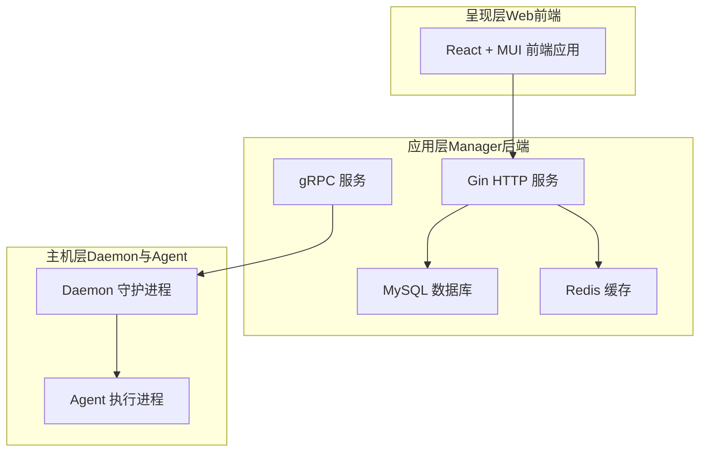
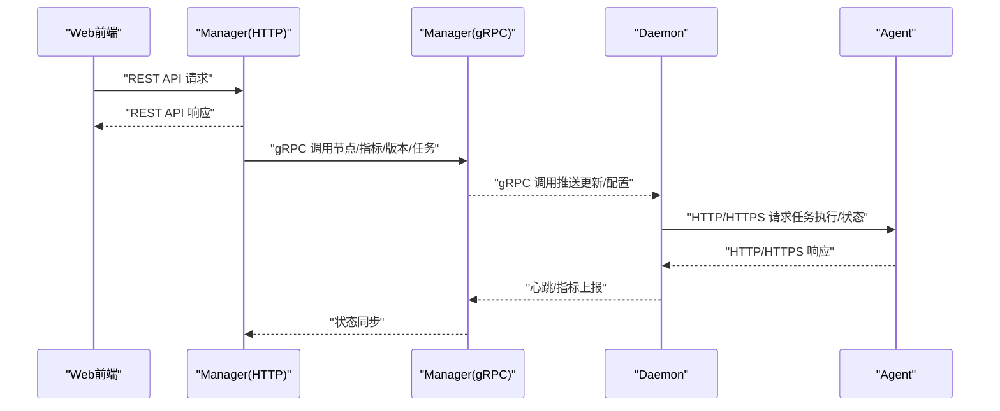
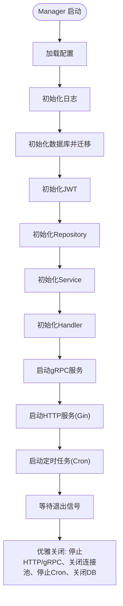
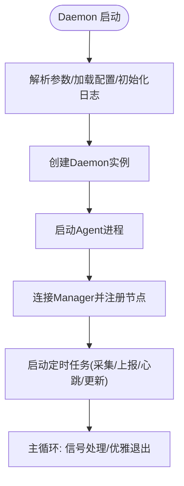
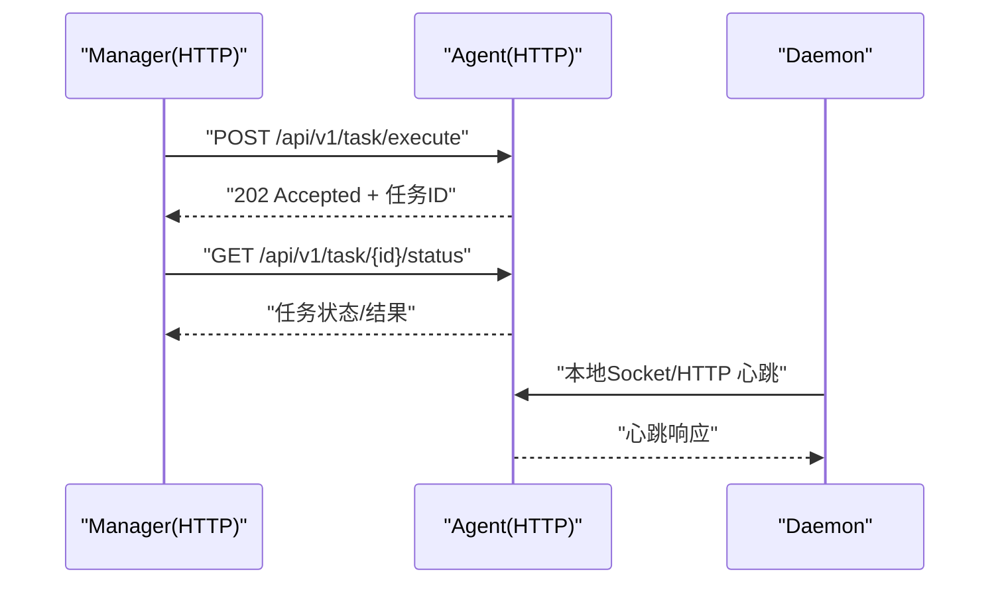
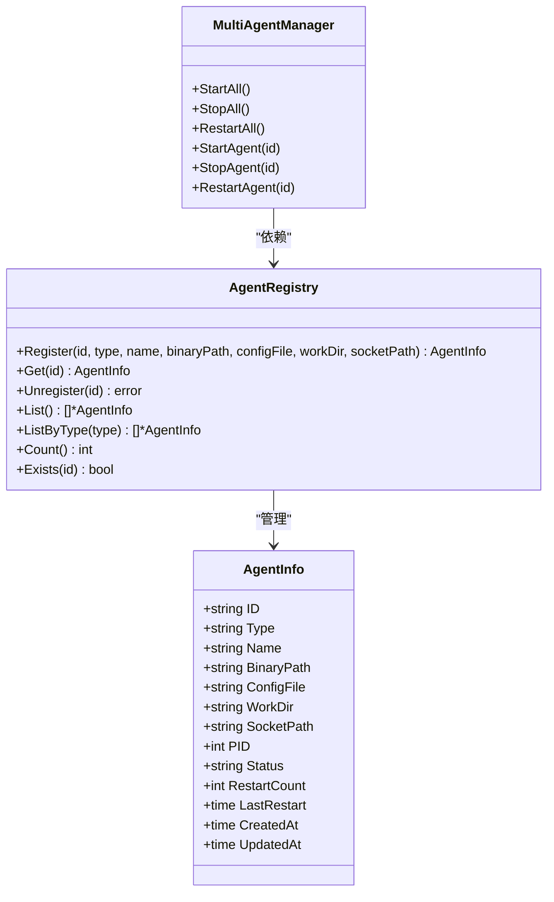
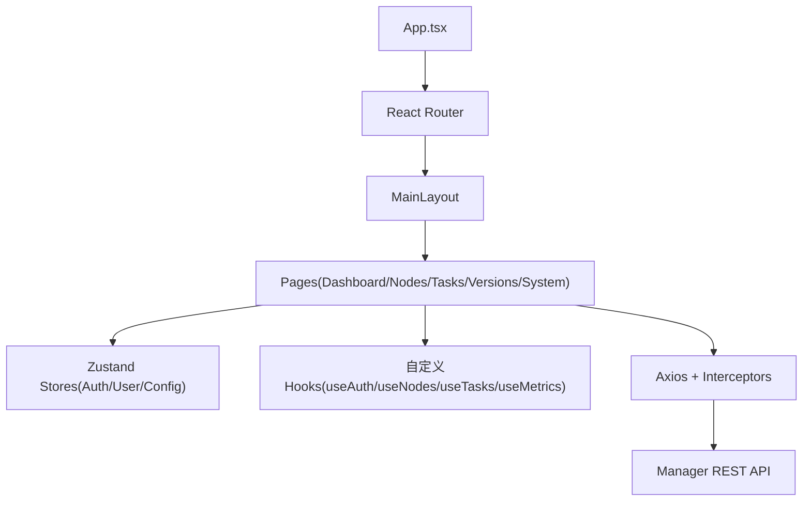
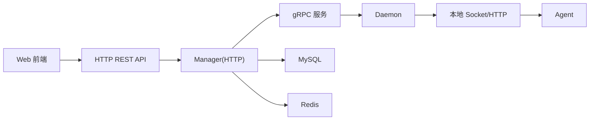

# 系统概述

<cite>
**本文引用的文件**
- [运维工具框架需求文档.md](file://docs/运维工具框架需求文档.md)
- [设计文档_01_Daemon模块.md](file://docs/设计文档_01_Daemon模块.md)
- [设计文档_02_Agent模块.md](file://docs/设计文档_02_Agent模块.md)
- [设计文档_03_Manager模块.md](file://docs/设计文档_03_Manager模块.md)
- [设计文档_04_Daemon多Agent管理架构.md](file://docs/设计文档_04_Daemon多Agent管理架构.md)
- [设计文档_04_Web前端模块.md](file://docs/设计文档_04_Web前端模块.md)
- [daemon/cmd/daemon/main.go](file://daemon/cmd/daemon/main.go)
- [manager/cmd/manager/main.go](file://manager/cmd/manager/main.go)
- [daemon/configs/daemon.yaml](file://daemon/configs/daemon.yaml)
- [manager/configs/manager.yaml](file://manager/configs/manager.yaml)
- [daemon/pkg/proto/manager/manager.proto](file://daemon/pkg/proto/manager/manager.proto)
- [web/src/App.tsx](file://web/src/App.tsx)
- [web/package.json](file://web/package.json)
</cite>

## 目录
1. [简介](#简介)
2. [项目结构](#项目结构)
3. [核心组件](#核心组件)
4. [架构总览](#架构总览)
5. [详细组件分析](#详细组件分析)
6. [依赖关系分析](#依赖关系分析)
7. [性能考量](#性能考量)
8. [故障排查指南](#故障排查指南)
9. [结论](#结论)
10. [附录](#附录)

## 简介
本文件面向运维工具框架（Ops Scaffold Framework）的整体架构与核心价值，聚焦于如何通过“呈现层（Web前端）—应用层（Manager后端）—主机层（Daemon与Agent）”三层架构，实现对分布式主机的集中管理、监控与自动化运维。系统以“轻量化、高可用、强安全、可扩展”为目标，围绕节点注册、心跳与状态上报、资源指标采集、任务执行与调度、版本发布与回滚等关键能力展开，并在设计文档中明确了非功能性需求（性能、可靠性、安全、兼容性）与技术选型（Go/TypeScript、Gin/React、gRPC/HTTP）。

## 项目结构
仓库采用模块化组织，分为三类核心模块与配套文档：
- 呈现层（Web前端）：React + Material-UI，提供仪表盘、节点管理、任务与版本管理等界面。
- 应用层（Manager后端）：Go + Gin + GORM，提供REST API与gRPC服务，负责节点管理、监控、任务调度、版本发布与审计。
- 主机层（Daemon与Agent）：Daemon运行于被管主机，负责资源采集、Agent进程管理、心跳上报与版本更新；Agent提供HTTP API供Manager/Daemon调用。

图表来源
- [manager/cmd/manager/main.go](file://manager/cmd/manager/main.go#L136-L211)
- [daemon/cmd/daemon/main.go](file://daemon/cmd/daemon/main.go#L18-L64)
- [daemon/configs/daemon.yaml](file://daemon/configs/daemon.yaml#L1-L63)
- [manager/configs/manager.yaml](file://manager/configs/manager.yaml#L1-L52)

章节来源
- [运维工具框架需求文档.md](file://docs/运维工具框架需求文档.md#L390-L419)
- [设计文档_03_Manager模块.md](file://docs/设计文档_03_Manager模块.md#L80-L137)
- [设计文档_01_Daemon模块.md](file://docs/设计文档_01_Daemon模块.md#L64-L99)
- [设计文档_02_Agent模块.md](file://docs/设计文档_02_Agent模块.md#L72-L114)

## 核心组件
- Manager（中心管理节点）
  - 职责：节点注册/状态监控、版本发布与回滚、任务调度与执行、认证授权与审计日志。
  - 技术：Go + Gin（HTTP）、gRPC（与Daemon通信）、GORM（MySQL）、Redis（可选缓存）、JWT（认证）。
- Daemon（主机守护进程）
  - 职责：系统资源采集、Agent进程生命周期管理、心跳上报、版本更新执行、本地日志管理。
  - 技术：Go + gRPC（与Manager通信）、Unix Socket/Named Pipe（与Agent通信）、gopsutil（系统信息采集）。
- Agent（任务执行进程）
  - 职责：执行运维任务（脚本/文件/服务）、提供HTTP API、心跳上报、支持插件扩展。
  - 技术：Go + HTTP/HTTPS（REST API）、请求签名与IP白名单（安全）、任务队列与并发控制。

章节来源
- [运维工具框架需求文档.md](file://docs/运维工具框架需求文档.md#L390-L419)
- [设计文档_03_Manager模块.md](file://docs/设计文档_03_Manager模块.md#L30-L76)
- [设计文档_01_Daemon模块.md](file://docs/设计文档_01_Daemon模块.md#L22-L42)
- [设计文档_02_Agent模块.md](file://docs/设计文档_02_Agent模块.md#L24-L45)

## 架构总览
系统边界与职责划分如下：
- Manager：负责全局管理、监控与版本更新，不直接执行业务逻辑与日志存储（使用外部ELK），不直接暴露外部API给业务。
- Daemon：负责本机资源采集、Agent进程管理、版本更新执行、状态上报，不直接执行复杂业务逻辑与直接对外暴露API。
- Agent：负责具体任务执行、提供HTTP/HTTPS API、心跳上报，不进行进程自管理与系统资源采集（可选）。

通信协议设计：
- Manager 与 Daemon：gRPC over TLS，双向mTLS + Token验证，接口包括注册、心跳、指标上报、推送更新、获取配置等。
- Manager/Daemon 与 Agent：HTTP/HTTPS RESTful API，请求签名（HMAC-SHA256）+ IP白名单，接口包括健康检查、状态查询、任务执行、取消与文件操作等。
- Daemon 与 Agent 本地通信：Unix Domain Socket（Linux）/Named Pipe（Windows），JSON-RPC 2.0，消息包括心跳、优雅停止、状态查询等。

图表来源
- [运维工具框架需求文档.md](file://docs/运维工具框架需求文档.md#L469-L494)
- [daemon/pkg/proto/manager/manager.proto](file://daemon/pkg/proto/manager/manager.proto#L1-L68)
- [manager/cmd/manager/main.go](file://manager/cmd/manager/main.go#L212-L246)
- [daemon/cmd/daemon/main.go](file://daemon/cmd/daemon/main.go#L18-L64)

章节来源
- [运维工具框架需求文档.md](file://docs/运维工具框架需求文档.md#L390-L419)
- [设计文档_03_Manager模块.md](file://docs/设计文档_03_Manager模块.md#L139-L169)
- [设计文档_01_Daemon模块.md](file://docs/设计文档_01_Daemon模块.md#L140-L177)
- [设计文档_02_Agent模块.md](file://docs/设计文档_02_Agent模块.md#L150-L189)

## 详细组件分析

### Manager（应用层）
- 启动流程与服务边界
  - 加载配置、初始化日志、数据库迁移、JWT管理器、Repository/Service/Handler层初始化。
  - 启动HTTP服务器（Gin）与gRPC服务器，注册路由与中间件（鉴权、审计、CORS、日志、恢复）。
  - 启动定时任务（如指标清理）与优雅关闭流程。
- 数据库与模型
  - 节点、Agent、版本、任务、任务执行、审计日志、告警规则与记录等核心表，支持分组、标签、指标历史与分区。
- 前端集成
  - React + MUI + Zustand + React Query，提供登录、Dashboard、节点管理、任务与版本管理、系统管理等页面。

图表来源
- [manager/cmd/manager/main.go](file://manager/cmd/manager/main.go#L35-L133)
- [manager/cmd/manager/main.go](file://manager/cmd/manager/main.go#L135-L211)
- [manager/cmd/manager/main.go](file://manager/cmd/manager/main.go#L212-L289)

章节来源
- [manager/cmd/manager/main.go](file://manager/cmd/manager/main.go#L35-L133)
- [manager/cmd/manager/main.go](file://manager/cmd/manager/main.go#L135-L211)
- [manager/cmd/manager/main.go](file://manager/cmd/manager/main.go#L212-L289)
- [设计文档_03_Manager模块.md](file://docs/设计文档_03_Manager模块.md#L140-L229)

### Daemon（主机层）
- 启动与核心引擎
  - 解析命令行参数、加载配置、初始化日志、创建Daemon实例、启动Agent（若未运行）、连接Manager、注册节点、启动定时任务（采集/上报/心跳/更新）。
- 资源采集模块
  - CPU、内存、磁盘、网络采集器，统一接口与并发模型，定时采集与结果缓存。
- Agent管理模块
  - 进程管理（启动/停止/重启）、健康检查（进程存在、心跳、资源阈值）、心跳接收（Unix Socket/Named Pipe）。
- 版本更新模块
  - 下载、签名与哈希校验、备份、回滚、自更新（Daemon自更新）、验证与清理。

图表来源
- [daemon/cmd/daemon/main.go](file://daemon/cmd/daemon/main.go#L18-L64)
- [设计文档_01_Daemon模块.md](file://docs/设计文档_01_Daemon模块.md#L141-L177)

章节来源
- [daemon/cmd/daemon/main.go](file://daemon/cmd/daemon/main.go#L18-L64)
- [设计文档_01_Daemon模块.md](file://docs/设计文档_01_Daemon模块.md#L192-L386)
- [设计文档_01_Daemon模块.md](file://docs/设计文档_01_Daemon模块.md#L387-L624)
- [设计文档_01_Daemon模块.md](file://docs/设计文档_01_Daemon模块.md#L693-L796)

### Agent（主机层）
- HTTP服务与安全
  - 健康检查、状态查询、任务执行、取消、文件上传/下载/删除、服务管理等接口。
  - 认证中间件（IP白名单、请求签名、时间戳防重放）、限流中间件。
- 任务引擎
  - 任务队列（按类型分队列、优先级排序）、Worker Pool（并发执行）、结果存储（带TTL清理）。
- 执行器
  - 脚本执行器（Shell/Python/PowerShell）、文件执行器（上传/下载/复制/删除/统计）、服务执行器（启动/停止/重启/状态）。
- 心跳与状态上报
  - 每30秒上报心跳，支持本地Socket或HTTP两种方式。

图表来源
- [运维工具框架需求文档.md](file://docs/运维工具框架需求文档.md#L478-L485)
- [设计文档_02_Agent模块.md](file://docs/设计文档_02_Agent模块.md#L153-L239)
- [设计文档_02_Agent模块.md](file://docs/设计文档_02_Agent模块.md#L307-L415)
- [设计文档_02_Agent模块.md](file://docs/设计文档_02_Agent模块.md#L577-L707)

章节来源
- [设计文档_02_Agent模块.md](file://docs/设计文档_02_Agent模块.md#L153-L239)
- [设计文档_02_Agent模块.md](file://docs/设计文档_02_Agent模块.md#L307-L415)
- [设计文档_02_Agent模块.md](file://docs/设计文档_02_Agent模块.md#L577-L707)

### 多Agent管理架构（Daemon）
- 从单实例到多实例演进
  - 通过AgentRegistry与AgentInfo实现Agent注册、查询、列举与并发安全；MultiAgentManager统一管理多个Agent实例；配置隔离与向后兼容。
- 第三方Agent兼容性
  - 支持filebeat、telegraf、node_exporter等常见Agent，提供参数模板与健康检查策略。

图表来源
- [设计文档_04_Daemon多Agent管理架构.md](file://docs/设计文档_04_Daemon多Agent管理架构.md#L146-L241)
- [设计文档_04_Daemon多Agent管理架构.md](file://docs/设计文档_04_Daemon多Agent管理架构.md#L242-L403)
- [设计文档_04_Daemon多Agent管理架构.md](file://docs/设计文档_04_Daemon多Agent管理架构.md#L617-L745)

章节来源
- [设计文档_04_Daemon多Agent管理架构.md](file://docs/设计文档_04_Daemon多Agent管理架构.md#L1-L145)
- [设计文档_04_Daemon多Agent管理架构.md](file://docs/设计文档_04_Daemon多Agent管理架构.md#L440-L616)

### 前端（Web）
- 技术栈与架构
  - React 18 + TypeScript + Vite + Material-UI + Zustand + React Query + Axios + ECharts/Recharts。
- 功能模块
  - 登录认证、Dashboard（节点统计、资源趋势、告警）、节点管理（列表/详情/监控）、任务管理（创建/执行/历史）、版本管理（上传/部署/回滚）、系统管理（用户/审计/设置）。
- 路由与状态
  - React Router 6 + 路由守卫（AuthGuard/GuestGuard）；QueryClientProvider统一缓存与刷新策略；Zustand持久化认证状态。

图表来源
- [web/src/App.tsx](file://web/src/App.tsx#L1-L57)
- [设计文档_04_Web前端模块.md](file://docs/设计文档_04_Web前端模块.md#L110-L146)
- [web/package.json](file://web/package.json#L1-L57)

章节来源
- [web/src/App.tsx](file://web/src/App.tsx#L1-L57)
- [设计文档_04_Web前端模块.md](file://docs/设计文档_04_Web前端模块.md#L1-L67)
- [设计文档_04_Web前端模块.md](file://docs/设计文档_04_Web前端模块.md#L280-L322)
- [web/package.json](file://web/package.json#L1-L57)

## 依赖关系分析
- 组件耦合与协作
  - Manager 通过 gRPC 与 Daemon 通信，Daemon 通过本地 Socket/HTTP 与 Agent 通信，Web 通过 HTTP 与 Manager 通信。
  - 数据层：Manager 使用 GORM 访问 MySQL，可选 Redis 缓存；Daemon 与 Agent 本地通信，Manager 侧负责数据聚合与持久化。
- 外部依赖与集成点
  - gRPC/Protobuf：Daemon 与 Manager 的服务契约；Manager 与 Agent 的HTTP API。
  - 认证与安全：Manager 使用 JWT；Agent API 使用请求签名与IP白名单；Daemon/Manager 通信使用 mTLS。
  - 监控与可视化：前端使用 ECharts/Recharts；后端指标入库与清理策略。

图表来源
- [运维工具框架需求文档.md](file://docs/运维工具框架需求文档.md#L469-L494)
- [manager/cmd/manager/main.go](file://manager/cmd/manager/main.go#L212-L246)
- [daemon/pkg/proto/manager/manager.proto](file://daemon/pkg/proto/manager/manager.proto#L1-L68)

章节来源
- [运维工具框架需求文档.md](file://docs/运维工具框架需求文档.md#L469-L494)
- [manager/cmd/manager/main.go](file://manager/cmd/manager/main.go#L212-L246)
- [daemon/pkg/proto/manager/manager.proto](file://daemon/pkg/proto/manager/manager.proto#L1-L68)

## 性能考量
- 性能目标（摘自需求文档）
  - Daemon CPU占用（空闲时）< 1%，内存 < 30MB；Agent CPU占用（空闲时）< 1%，内存 < 50MB；Manager API响应（P95）< 200ms；节点管理容量 > 1000节点；任务响应延迟 < 100ms。
- 实现要点
  - Daemon/Agent 采用轻量级并发模型（goroutines/timers），采集与上报周期可配置，避免阻塞。
  - Manager 使用连接池与缓存（Redis），定时任务清理历史指标，数据库表建立合适索引。
  - 前端使用 React Query 缓存与去重请求，减少重复网络请求。

章节来源
- [运维工具框架需求文档.md](file://docs/运维工具框架需求文档.md#L344-L357)
- [设计文档_03_Manager模块.md](file://docs/设计文档_03_Manager模块.md#L353-L396)

## 故障排查指南
- 常见问题与定位
  - Manager 启动失败：检查配置文件路径、数据库连接、日志输出路径；确认端口占用与证书配置。
  - Daemon 启动失败：检查配置文件（manager.address、tls、agent配置）、日志文件、进程PID文件；确认与Manager的TLS握手是否成功。
  - Agent 无法被管理：检查Agent HTTP服务监听、请求签名与IP白名单、心跳上报路径（Socket/HTTP）。
  - 指标缺失或延迟：检查Daemon采集周期、Manager指标清理任务、数据库分区与索引。
- 诊断工具与日志
  - Manager：日志级别、审计日志、数据库连接状态、gRPC连接池状态。
  - Daemon：采集器日志、Agent进程状态、健康检查日志、更新流程日志。
  - Agent：HTTP请求日志、任务执行日志、心跳上报日志。

章节来源
- [manager/cmd/manager/main.go](file://manager/cmd/manager/main.go#L35-L133)
- [daemon/cmd/daemon/main.go](file://daemon/cmd/daemon/main.go#L18-L64)
- [设计文档_01_Daemon模块.md](file://docs/设计文档_01_Daemon模块.md#L192-L386)
- [设计文档_02_Agent模块.md](file://docs/设计文档_02_Agent模块.md#L153-L239)

## 结论
该运维工具框架通过清晰的三层架构实现了对分布式主机的集中管理与自动化运维：Manager负责全局治理与数据持久化，Daemon负责本机资源采集与Agent管理，Agent负责具体任务执行与API服务。系统在性能、可靠性、安全与可扩展性方面均有明确设计目标与实现路径，适合在大规模节点场景下稳定运行。前端采用现代化技术栈，提供直观的可视化界面与良好的用户体验。

## 附录
- 非功能性需求（节选）
  - 性能：Daemon/Agent 轻量化指标、Manager API响应与节点管理容量目标。
  - 可靠性：服务可用性、故障恢复时间、数据完整性、更新可靠性与进程隔离。
  - 安全：传输加密（TLS 1.2+）、双向mTLS、请求签名、版本更新签名与哈希校验、审计日志。
  - 兼容性：操作系统与Go/浏览器版本要求。
- 技术选型权衡
  - Go 与 TypeScript：Go在系统层具备高并发与低资源占用优势，TypeScript在前端提供类型安全与开发效率。
  - Gin 与 React：Gin轻量高效，React组件化与生态完善，契合本项目的服务端与前端架构。

章节来源
- [运维工具框架需求文档.md](file://docs/运维工具框架需求文档.md#L344-L385)
- [设计文档_04_Web前端模块.md](file://docs/设计文档_04_Web前端模块.md#L280-L322)