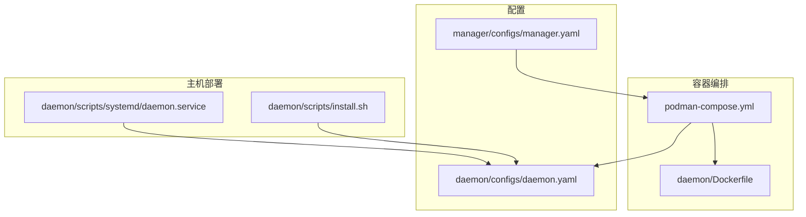
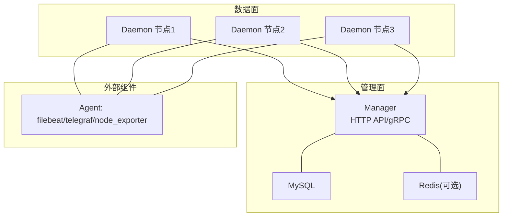
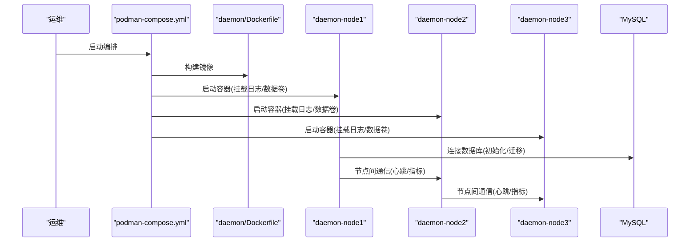
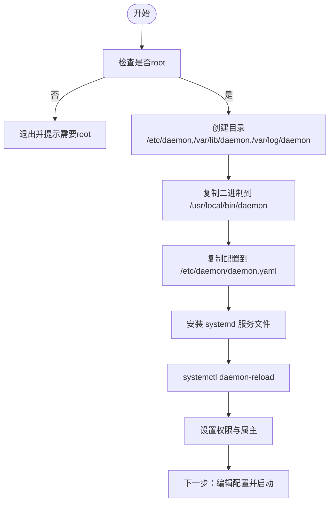
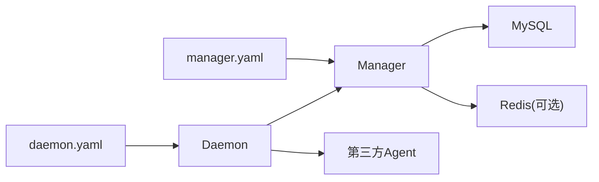

# 部署与运维

<cite>
**本文引用的文件**
- [podman-compose.yml](file://podman-compose.yml)
- [Dockerfile（Daemon）](file://daemon/Dockerfile)
- [安装脚本（Daemon）](file://daemon/scripts/install.sh)
- [systemd服务文件（Daemon）](file://daemon/scripts/systemd/daemon.service)
- [Daemon配置（生产）](file://daemon/configs/daemon.yaml)
- [Manager配置（生产）](file://manager/configs/manager.yaml)
- [Podman部署指南](file://daemon/PODMAN_DEPLOYMENT.md)
- [快速启动指南](file://QUICKSTART.md)
- [集成测试启动脚本](file://test/integration/start_test_env.sh)
- [集成测试清理脚本](file://test/integration/cleanup_test_env.sh)
- [Agent配置设计文档](file://daemon/configs/AGENTS_CONFIG_DESIGN.md)
- [Daemon配置加载（Go）](file://daemon/internal/config/config.go)
- [Daemon日志（Zap）](file://daemon/internal/logger/logger.go)
- [Manager日志（Zap）](file://manager/internal/logger/logger.go)
- [资源监控（Go）](file://daemon/internal/agent/resource_monitor.go)
- [多Agent健康检查（Go）](file://daemon/internal/agent/multi_health_checker.go)
- [备份器（Go）](file://docs/设计文档_01_Daemon模块.md)
- [Manager指标服务（Go）](file://manager/internal/service/metrics.go)
</cite>

## 目录
1. [简介](#简介)
2. [项目结构](#项目结构)
3. [核心组件](#核心组件)
4. [架构总览](#架构总览)
5. [详细组件分析](#详细组件分析)
6. [依赖关系分析](#依赖关系分析)
7. [性能考虑](#性能考虑)
8. [故障排查指南](#故障排查指南)
9. [结论](#结论)
10. [附录](#附录)

## 简介
本指南面向生产环境运维工程师，提供ops-scaffold-framework的部署与运维实践，覆盖容器化（Podman/Docker）、主机直装（systemd）两种部署方式；详述环境准备、配置文件定制、服务启停、高可用架构建议、监控指标采集（Prometheus思路）、日志管理（Zap）、备份恢复策略及常见问题排查流程，帮助快速落地并稳定运行。

## 项目结构
- 三层组件：Manager（中心管理）、Daemon（节点代理）、Agent（第三方采集/探针）
- 部署载体：容器（Podman/Docker）与主机（systemd）
- 关键配置：daemon.yaml、manager.yaml
- 运维脚本：podman-compose.yml、Dockerfile、install.sh、systemd服务文件

图表来源
- [podman-compose.yml](file://podman-compose.yml#L1-L178)
- [Dockerfile（Daemon）](file://daemon/Dockerfile#L1-L76)
- [安装脚本（Daemon）](file://daemon/scripts/install.sh#L1-L70)
- [systemd服务文件（Daemon）](file://daemon/scripts/systemd/daemon.service#L1-L53)
- [Daemon配置（生产）](file://daemon/configs/daemon.yaml#L1-L63)
- [Manager配置（生产）](file://manager/configs/manager.yaml#L1-L52)

章节来源
- [podman-compose.yml](file://podman-compose.yml#L1-L178)
- [Dockerfile（Daemon）](file://daemon/Dockerfile#L1-L76)
- [安装脚本（Daemon）](file://daemon/scripts/install.sh#L1-L70)
- [systemd服务文件（Daemon）](file://daemon/scripts/systemd/daemon.service#L1-L53)
- [Daemon配置（生产）](file://daemon/configs/daemon.yaml#L1-L63)
- [Manager配置（生产）](file://manager/configs/manager.yaml#L1-L52)

## 核心组件
- Manager：提供HTTP API与gRPC服务，负责节点与Agent的统一管理、鉴权、指标存储与清理。
- Daemon：节点侧代理，负责与Manager建立TLS连接、周期性心跳、采集系统指标、管理第三方Agent、资源监控与告警、更新下载与备份。
- Agent：第三方采集/探针（如filebeat、telegraf、node_exporter），由Daemon统一管理与健康检查。

章节来源
- [Manager配置（生产）](file://manager/configs/manager.yaml#L1-L52)
- [Daemon配置（生产）](file://daemon/configs/daemon.yaml#L1-L63)
- [Agent配置设计文档](file://daemon/configs/AGENTS_CONFIG_DESIGN.md#L1-L31)

## 架构总览
生产环境典型拓扑：Manager作为中心节点，Daemon以多节点形式分布在各主机/容器中，Daemon与Manager通过gRPC/TLS通信；Manager内部集成数据库与可选Redis缓存；前端Web通过HTTP API与Manager交互。

图表来源
- [Manager配置（生产）](file://manager/configs/manager.yaml#L1-L52)
- [podman-compose.yml](file://podman-compose.yml#L92-L165)
- [Dockerfile（Daemon）](file://daemon/Dockerfile#L1-L76)

## 详细组件分析

### 容器化部署（Podman/Docker）
- 使用podman-compose.yml定义网络、卷与服务，包含MySQL、多个Daemon节点，以及可选的Manager服务。
- Daemon镜像采用多阶段构建，非root运行，挂载日志与数据卷，容器内默认配置位于configs/daemon.container.yaml。
- 支持三种Manager连接方式：宿主机、同compose、独立网络。

图表来源
- [podman-compose.yml](file://podman-compose.yml#L1-L178)
- [Dockerfile（Daemon）](file://daemon/Dockerfile#L1-L76)
- [Podman部署指南](file://daemon/PODMAN_DEPLOYMENT.md#L1-L285)

章节来源
- [podman-compose.yml](file://podman-compose.yml#L1-L178)
- [Dockerfile（Daemon）](file://daemon/Dockerfile#L1-L76)
- [Podman部署指南](file://daemon/PODMAN_DEPLOYMENT.md#L1-L285)

### 主机直装部署（systemd）
- 使用install.sh安装二进制、配置文件与systemd服务单元，设置工作目录、日志目录、证书目录与权限。
- systemd服务文件定义User/Group、Restart策略、资源限制、标准输出/错误到journal、安全选项等。

图表来源
- [安装脚本（Daemon）](file://daemon/scripts/install.sh#L1-L70)
- [systemd服务文件（Daemon）](file://daemon/scripts/systemd/daemon.service#L1-L53)

章节来源
- [安装脚本（Daemon）](file://daemon/scripts/install.sh#L1-L70)
- [systemd服务文件（Daemon）](file://daemon/scripts/systemd/daemon.service#L1-L53)

### 配置文件定制
- Daemon配置（daemon.yaml）：基础运行参数、Manager连接（地址、TLS证书、心跳/重连/超时）、Agent管理（二进制路径、工作目录、健康检查阈值、重启策略）、采集器（CPU/Memory/Disk/Network）、更新下载与备份。
- Manager配置（manager.yaml）：HTTP/gRPC监听、数据库DSN、Redis、JWT密钥与过期、日志轮转参数。

章节来源
- [Daemon配置（生产）](file://daemon/configs/daemon.yaml#L1-L63)
- [Manager配置（生产）](file://manager/configs/manager.yaml#L1-L52)

### 服务启停与systemd集成
- 启动：systemctl start daemon；开机自启：systemctl enable daemon；状态检查：systemctl status daemon。
- 重载：ExecReload触发HUP信号；工作目录与资源限制在服务单元中配置。
- 日志：StandardOutput/StandardError写入journal，SyslogIdentifier便于检索。

章节来源
- [systemd服务文件（Daemon）](file://daemon/scripts/systemd/daemon.service#L1-L53)

### 高可用部署架构建议
- 多节点Daemon：通过podman-compose.yml或手动扩展节点数量，实现横向扩展与故障隔离。
- Manager高可用：建议使用反向代理/负载均衡（如HAProxy/Nginx）+ 多实例部署，并对数据库做主从/集群；gRPC/TLS通信必须启用。
- 网络隔离：为不同环境划分独立网络，使用extra_hosts或自定义网络连接Manager。
- 存储持久化：为MySQL、Daemon日志与数据卷配置持久化，避免容器重建导致数据丢失。

章节来源
- [podman-compose.yml](file://podman-compose.yml#L1-L178)
- [Podman部署指南](file://daemon/PODMAN_DEPLOYMENT.md#L1-L285)

### 监控指标采集（Prometheus思路）
- Manager侧：可基于现有指标服务接口（如指标创建、批量创建、历史查询）暴露指标端点，结合Prometheus抓取。
- Daemon侧：采集CPU/Memory/Disk/Network指标，结合资源监控器与健康检查，形成资源使用与健康状态指标。
- 建议：在Manager与Daemon分别暴露/metrics端点，配置Prometheus scrape规则与告警规则。

章节来源
- [Manager指标服务（Go）](file://manager/internal/service/metrics.go#L33-L76)
- [Daemon配置（生产）](file://daemon/configs/daemon.yaml#L40-L63)
- [资源监控（Go）](file://daemon/internal/agent/resource_monitor.go#L77-L110)

### 日志管理（Zap）
- Daemon与Manager均使用Zap进行日志记录，支持控制台与文件输出，Manager支持同时输出到stdout与文件，Daemon支持JSON编码与轮转。
- 建议：生产环境开启文件输出与轮转，设置合理的最大文件大小、备份数与保留天数；集中化收集（如rsyslog/Fluentd）并归档。

章节来源
- [Daemon日志（Zap）](file://daemon/internal/logger/logger.go#L59-L124)
- [Manager日志（Zap）](file://manager/internal/logger/logger.go#L64-L114)
- [Manager配置（生产）](file://manager/configs/manager.yaml#L45-L52)

### 备份恢复策略
- Daemon侧：配置文件中定义下载目录、备份目录与保留数量；可结合备份器实现组件级备份与恢复。
- 建议：定期执行增量备份（针对日志与数据卷），保留N份历史备份；制定恢复演练流程与回滚预案。

章节来源
- [Daemon配置（生产）](file://daemon/configs/daemon.yaml#L56-L63)
- [备份器（Go）](file://docs/设计文档_01_Daemon模块.md#L917-L960)

## 依赖关系分析
- Manager依赖MySQL（与可选Redis），提供HTTP与gRPC服务；Daemon依赖Manager的gRPC/TLS连接，采集系统指标并管理第三方Agent。
- 配置文件决定组件行为：daemon.yaml控制Daemon与Agent行为，manager.yaml控制Manager服务与存储。
- 运维脚本与systemd服务文件共同保证服务的生命周期与稳定性。

图表来源
- [Daemon配置（生产）](file://daemon/configs/daemon.yaml#L1-L63)
- [Manager配置（生产）](file://manager/configs/manager.yaml#L1-L52)

章节来源
- [Daemon配置（生产）](file://daemon/configs/daemon.yaml#L1-L63)
- [Manager配置（生产）](file://manager/configs/manager.yaml#L1-L52)

## 性能考虑
- 资源监控与健康检查：Daemon内置资源监控器与多Agent健康检查器，支持阈值与持续时间判断，避免误报与抖动。
- 指标采集频率：根据业务负载调整CPU/Memory/Disk/Network采集间隔，避免过度采集造成I/O与CPU压力。
- 数据库与缓存：合理设置连接池大小、超时与日志级别；对指标表进行分区与索引优化，减少长尾查询。
- 前端性能：遵循代码生成计划中的前端性能目标（LCP/FID/CLS/Bundled Size），并结合CDN与缓存策略。

章节来源
- [多Agent健康检查（Go）](file://daemon/internal/agent/multi_health_checker.go#L184-L428)
- [资源监控（Go）](file://daemon/internal/agent/resource_monitor.go#L77-L110)
- [Manager指标服务（Go）](file://manager/internal/service/metrics.go#L33-L76)
- [代码生成计划.md](file://docs/代码生成计划.md#L2380-L2588)

## 故障排查指南

### 服务无法启动
- 检查systemd状态与日志：systemctl status daemon；journalctl -u daemon -n 100。
- 确认配置文件路径与权限：/etc/daemon/daemon.yaml、/var/lib/daemon、/var/log/daemon。
- 端口占用：使用lsof检查8080/9090/9091等端口是否被占用。

章节来源
- [systemd服务文件（Daemon）](file://daemon/scripts/systemd/daemon.service#L1-L53)
- [集成测试启动脚本](file://test/integration/start_test_env.sh#L1-L366)

### 节点连接失败
- Manager未就绪：使用curl http://127.0.0.1:8080/health验证；若失败，检查Manager日志与数据库连接。
- 网络连通性：在容器环境中使用podman network inspect与ping测试；在主机环境中检查防火墙与DNS解析。
- TLS握手失败：核对daemon.yaml中的Manager地址、证书路径与CA文件一致性。

章节来源
- [Podman部署指南](file://daemon/PODMAN_DEPLOYMENT.md#L1-L285)
- [集成测试启动脚本](file://test/integration/start_test_env.sh#L1-L366)
- [Daemon配置（生产）](file://daemon/configs/daemon.yaml#L12-L21)

### 性能瓶颈
- 指标采集压力：降低采集间隔或过滤不必要指标；检查磁盘I/O与CPU使用率。
- 数据库压力：优化SQL查询、增加索引、限制连接数；对指标表进行分区与清理策略。
- 健康检查抖动：调整阈值与持续时间，避免频繁重启Agent。

章节来源
- [多Agent健康检查（Go）](file://daemon/internal/agent/multi_health_checker.go#L184-L428)
- [资源监控（Go）](file://daemon/internal/agent/resource_monitor.go#L77-L110)
- [Manager指标服务（Go）](file://manager/internal/service/metrics.go#L33-L76)

### 日志与备份问题
- 日志轮转：确认文件路径与轮转参数；生产环境建议使用专业轮转组件替代简单文件打开。
- 备份策略：核对备份目录、保留数量与清理逻辑；定期演练恢复流程。

章节来源
- [Daemon日志（Zap）](file://daemon/internal/logger/logger.go#L59-L124)
- [Manager日志（Zap）](file://manager/internal/logger/logger.go#L64-L114)
- [Daemon配置（生产）](file://daemon/configs/daemon.yaml#L56-L63)
- [备份器（Go）](file://docs/设计文档_01_Daemon模块.md#L917-L960)

## 结论
通过容器化与主机直装两种方式，结合完善的配置、日志与备份策略，ops-scaffold-framework可在生产环境中实现高可用、可观测与可维护的运维体系。建议在上线前完成性能压测与容量规划，并建立标准化的变更与应急流程。

## 附录

### 快速部署步骤（容器化）
- 准备：安装Podman与podman-compose，拉起MySQL与多个Daemon节点。
- 配置：根据实际环境修改Manager地址、TLS证书与采集间隔。
- 启动：podman-compose up -d；查看日志与状态。
- 验证：curl http://127.0.0.1:8080/health；检查节点注册与指标上报。

章节来源
- [Podman部署指南](file://daemon/PODMAN_DEPLOYMENT.md#L1-L285)
- [podman-compose.yml](file://podman-compose.yml#L1-L178)

### 快速部署步骤（主机直装）
- 准备：以root运行install.sh，安装二进制、配置与systemd服务。
- 配置：编辑/etc/daemon/daemon.yaml，设置Manager地址与TLS证书。
- 启停：systemctl start daemon；systemctl enable daemon；systemctl status daemon。

章节来源
- [安装脚本（Daemon）](file://daemon/scripts/install.sh#L1-L70)
- [systemd服务文件（Daemon）](file://daemon/scripts/systemd/daemon.service#L1-L53)

### 集成测试环境（参考）
- 启动：./test/integration/start_test_env.sh；等待Manager、Daemon与Agent就绪。
- 清理：./test/integration/cleanup_test_env.sh；支持清理日志与PID文件。

章节来源
- [集成测试启动脚本](file://test/integration/start_test_env.sh#L1-L366)
- [集成测试清理脚本](file://test/integration/cleanup_test_env.sh#L1-L143)