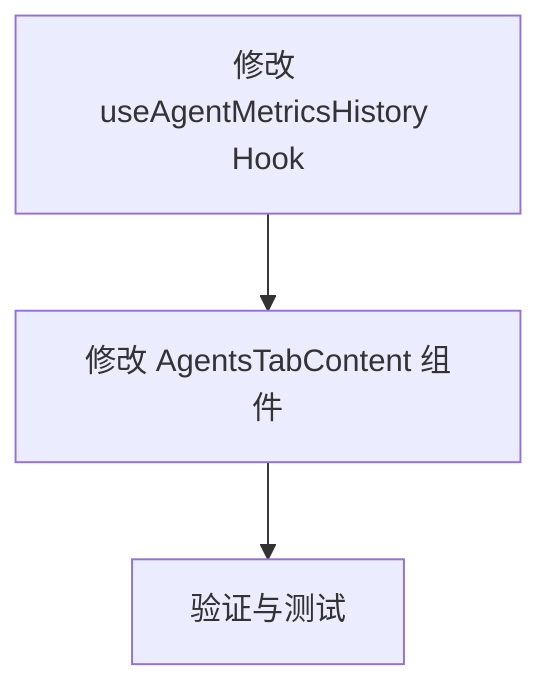

# TASK: Agent 监控功能增强

## 任务依赖图

## 子任务列表

### 1. 修改 useAgentMetricsHistory Hook
- **目标**: 扩展 Hook 以支持 `open_files` 和 `disk_io` 指标，并支持多值返回。
- **文件**: `web/src/hooks/useAgentMetrics.ts`
- **输入**: 现有的 Hook 代码。
- **输出**: 支持新类型和多值返回的 Hook 代码。
- **验收标准**: 
  - 支持 `type` 参数为 `'cpu' | 'memory' | 'open_files' | 'disk_io'`。
  - `disk_io` 返回 read 和 write 两个值。
  - 单位转换正确 (Bytes -> MB)。

### 2. 修改 AgentsTabContent 组件
- **目标**: 在 Agent 详情页展示新增的监控图表。
- **文件**: `web/src/pages/Nodes/Detail.tsx`
- **输入**: 修改后的 Hook。
- **输出**: 包含 4 个图表的详情页。
- **验收标准**:
  - 页面包含 CPU, Memory, Open Files, Disk I/O 四个图表。
  - 图表布局合理 (Grid 2x2)。
  - 数据正确加载和显示。

### 3. 验证与测试
- **目标**: 确保功能正常且无回归。
- **文件**: `web/src/pages/Nodes/__tests__/AgentsTabContent.test.tsx` (可选更新测试)
- **验收标准**: 运行测试通过，手动验证 UI (如果有 OpenPreview)。
